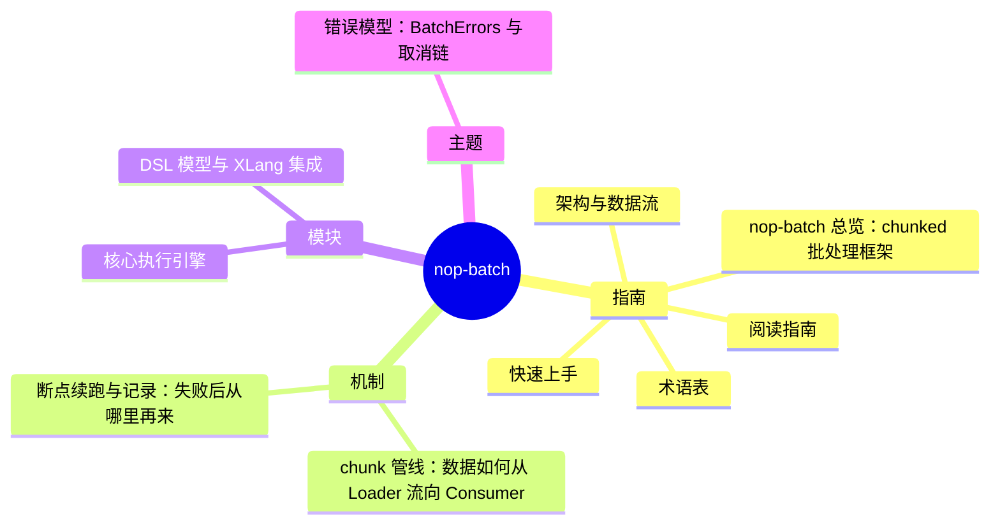

# nop-batch DeepWiki

> 目标：nop-batch · 结构契约：[PLAN.md](./PLAN.md) · 本文件由 gen-wiki-meta.mjs 生成，勿手改

> 快照：nop-batch @ 0b288247aa · 2026-09-26

## 指南

- [overview](overview.md) — nop-batch 总览：chunked 批处理框架
- [quickstart](quickstart.md) — 快速上手
- [glossary](glossary.md) — 术语表
- [reading guide](reading-guide.md) — 阅读指南
- [architecture](architecture.md) — 架构与数据流

## 机制

- [flows batch pipeline](flows/batch-pipeline.md) — chunk 管线：数据如何从 Loader 流向 Consumer
- [flows checkpoint recovery](flows/checkpoint-recovery.md) — 断点续跑与记录：失败后从哪里再来

## 模块

- [modules batch core](modules/batch-core.md) — 核心执行引擎
- [modules batch dsl](modules/batch-dsl.md) — DSL 模型与 XLang 集成

## 主题

- [topics error model](topics/error-model.md) — 错误模型：BatchErrors 与取消链
