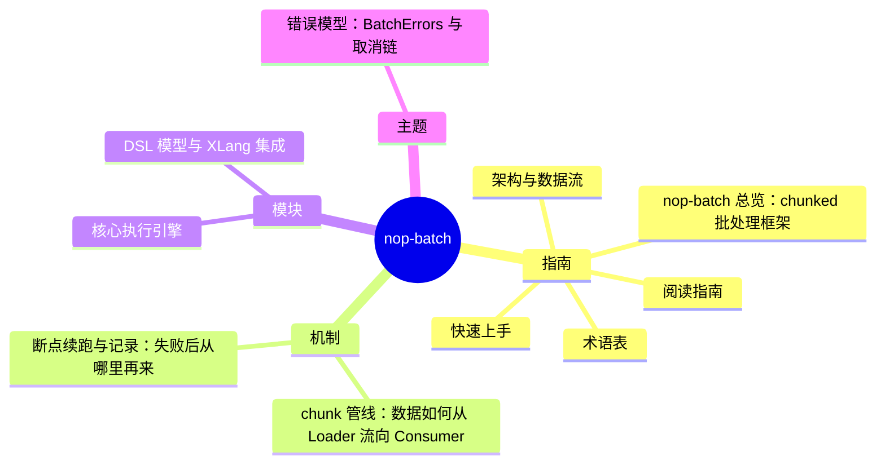

# nop-batch DeepWiki

> 目标：nop-batch · 结构契约：[PLAN.md](./PLAN.md) · 本文件由 gen-wiki-meta.mjs 生成，勿手改

> 快照：nop-batch @ ea3e35e6d0 · 2026-09-29

## 指南

- [nop-batch 总览：chunked 批处理框架](overview.md)
- [快速上手](quickstart.md)
- [术语表](glossary.md)
- [阅读指南](reading-guide.md)
- [架构与数据流](architecture.md)

## 机制

- [chunk 管线：数据如何从 Loader 流向 Consumer](flows/batch-pipeline.md)
- [断点续跑与记录：失败后从哪里再来](flows/checkpoint-recovery.md)

## 模块

- [核心执行引擎](modules/batch-core.md)
- [DSL 模型与 XLang 集成](modules/batch-dsl.md)

## 主题

- [错误模型：BatchErrors 与取消链](topics/error-model.md)
