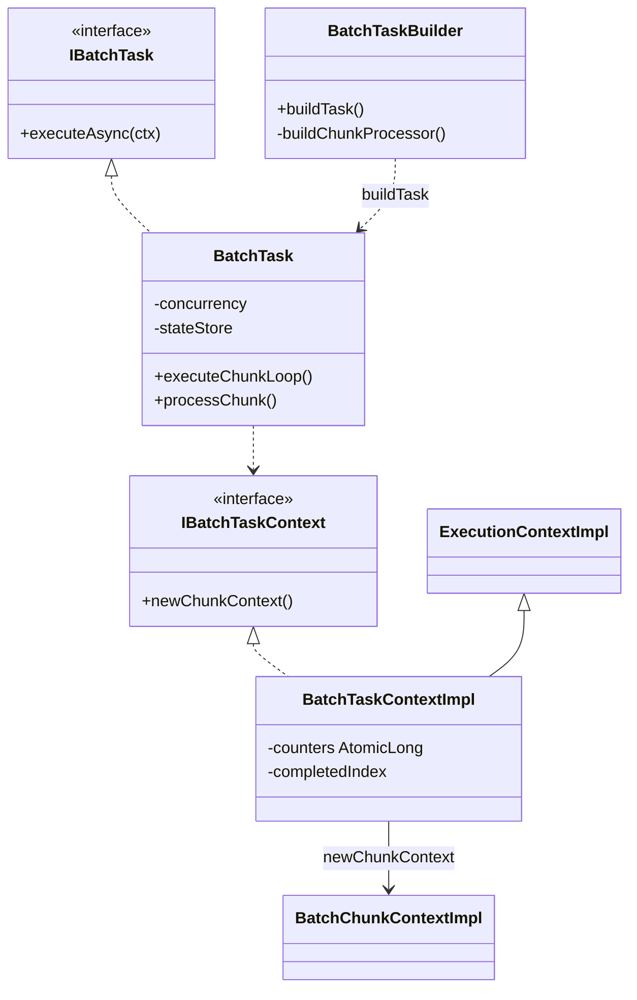
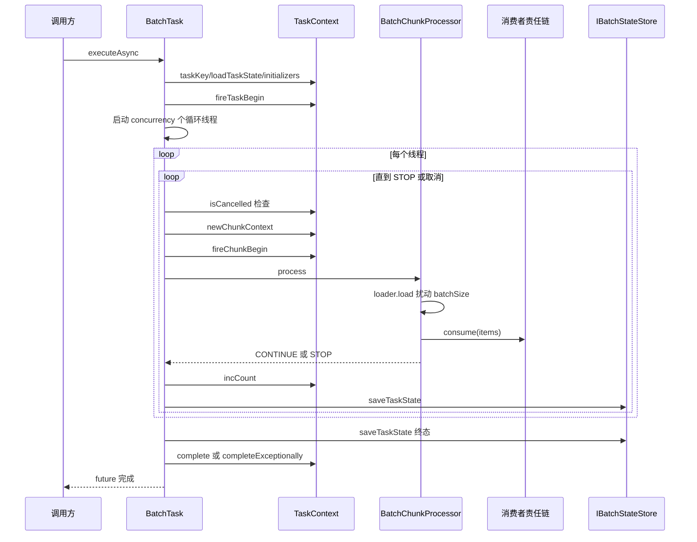
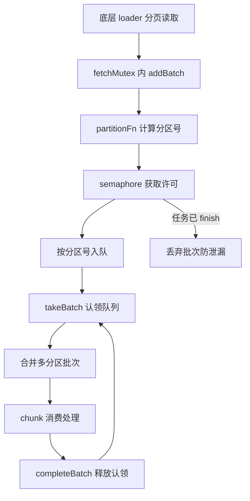

# 核心执行引擎

> 本页源文件基准（相对于 `deepwiki/nop-batch/modules/`，三级回溯到仓库根）：
>
> - [../../../nop-batch/nop-batch-core/src/main/java/io/nop/batch/core/BatchTaskBuilder.java](../../../nop-batch/nop-batch-core/src/main/java/io/nop/batch/core/BatchTaskBuilder.java)
> - [../../../nop-batch/nop-batch-core/src/main/java/io/nop/batch/core/impl/BatchTask.java](../../../nop-batch/nop-batch-core/src/main/java/io/nop/batch/core/impl/BatchTask.java)
> - [../../../nop-batch/nop-batch-core/src/main/java/io/nop/batch/core/impl/BatchTaskContextImpl.java](../../../nop-batch/nop-batch-core/src/main/java/io/nop/batch/core/impl/BatchTaskContextImpl.java)
> - [../../../nop-batch/nop-batch-core/src/main/java/io/nop/batch/core/loader/PartitionDispatchQueue.java](../../../nop-batch/nop-batch-core/src/main/java/io/nop/batch/core/loader/PartitionDispatchQueue.java)
> - [../../../nop-batch/nop-batch-core/src/main/java/io/nop/batch/core/processor/BatchChunkProcessor.java](../../../nop-batch/nop-batch-core/src/main/java/io/nop/batch/core/processor/BatchChunkProcessor.java)
> - [../../../nop-batch/nop-batch-core/src/main/java/io/nop/batch/core/loader/AsyncFetchPartitionDispatchLoaderProvider.java](../../../nop-batch/nop-batch-core/src/main/java/io/nop/batch/core/loader/AsyncFetchPartitionDispatchLoaderProvider.java)
> - [../../../nop-batch/nop-batch-api/src/main/java/io/nop/batch/api/beans/NopBatchTaskOutputBean.java](../../../nop-batch/nop-batch-api/src/main/java/io/nop/batch/api/beans/NopBatchTaskOutputBean.java)
> - [../../../nop-batch/nop-batch-core/src/main/java/io/nop/batch/core/IBatchTaskContext.java](../../../nop-batch/nop-batch-core/src/main/java/io/nop/batch/core/IBatchTaskContext.java)

nop-batch 的执行引擎由四个角色构成：`BatchTaskBuilder` 在构建期只登记配置、把装配推迟到运行期；`BatchTask` 用 N 个线程跑 do-while chunk 循环；`BatchTaskContextImpl` 集中持有计数器与生命周期回调；`PartitionDispatchQueue` 在多线程消费时保证同一分区串行。数据在 Loader→Processor→Consumer 三段中的流动细节见[chunk 管线](../flows/batch-pipeline.md)。

## BatchTaskBuilder：装配延迟到 setup 时刻

`BatchTaskBuilder` 的类注释自我定位为"负责创建 IBatchTask 的工厂类……组织 skip/retry/transaction/process/listener 的处理顺序"（`nop-batch/nop-batch-core/src/main/java/io/nop/batch/core/BatchTaskBuilder.java:48-50`）。关键设计是 `buildTask()` 并不装配管线，只 new 一个 `BatchTask`，把两个装配方法以引用形式传入（`BatchTaskBuilder.java:326-330`）：

```java
public IBatchTask buildTask() {
    return new BatchTask<S>(taskName, ..., taskInitializers,
            this::buildLoader, this::buildChunkProcessor, stateStore,
            allowStartIfComplete, startLimit);
}
```

真正的装配发生在 `BatchTask.executeAsync` 内部调用 `loaderProvider.setup(context)` 与 `chunkProcessorProvider.setup(loader, context)` 时（`nop-batch/nop-batch-core/src/main/java/io/nop/batch/core/impl/BatchTask.java:123-124`），此时任务上下文已初始化完毕，各 Provider 可以按上下文生成本次执行专用的 loader/consumer 实例。

loader 侧装配在 `buildLoader`：若配置了 `dispatchConfig`，按 `fetchThreadCount > 0` 选择 `AsyncFetchPartitionDispatchLoaderProvider` 或 `PartitionDispatchLoaderProvider` 包装底层 loader，最后统一套 `inputComparator`（`BatchTaskBuilder.java:332-355`）。一个容易踩的坑被注释显式标出：dispatch 模式下同样要包装 `loadRetryPolicy`，"否则该配置会被静默忽略"（`BatchTaskBuilder.java:361-364`）。

consumer 侧装配在 `buildChunkProcessor`，责任链从内到外按固定顺序叠加（`BatchTaskBuilder.java:376-456`）：

```java
consumer = EmptyBatchConsumer 缺省                     // 377-379
consumer = InvokerBatchConsumer    consume 事务        // 391-394
consumer = BatchProcessorConsumer  processor→consumer  // 396-403
consumer = WithHistoryBatchConsumer 去重历史           // 405-407
consumer = InvokerBatchConsumer    process 事务        // 409-412
consumer = AddCompletedBatchConsumer 标记完成          // 414-416
consumer = RateLimitConsumer       限速               // 418-420
consumer = SingleModeBatchConsumer 逐条消费            // 422-424
consumer = RetryOneByOne/RetryAll  重试               // 426-434
consumer = SkipBatchConsumer       跳过错误            // 436-439
chunkProcessor = BatchChunkProcessor(loader, batchSize, jitterRatio, consumer) // 441-442
```

三点语义值得注意。其一，重试发生在事务之外（scope 为 process/consume 时），注释明说"一般情况……retry 是在事务之外执行"（`BatchTaskBuilder.java:426`）；只有 `BatchTransactionScope.chunk` 才把整个 chunk 包进事务（444-447）。其二，`retryOneByOne` 时 `skipPolicy` 已在重试器内执行，外层不再重复套 Skip（436-439）。其三，存在 `historyStore` 且 scope 为 consume 时自动把事务提升到 process 级并输出 `nop.batch.history-txn-promoted` 日志，理由是"saveProcessed 必须与业务 consume 同事务提交，否则崩溃窗口会导致重启后重复处理"（381-389）——`WithHistory` 包装在 consume 事务内侧，无法覆盖 `saveProcessed`。

类型层级如下：Builder 产出 BatchTask，BatchTask 持有上下文并经工厂方法创建 chunk 上下文。



> Sources: [nop-batch/nop-batch-core/src/main/java/io/nop/batch/core/BatchTaskBuilder.java:48-50](/nop-batch/nop-batch-core/src/main/java/io/nop/batch/core/BatchTaskBuilder.java#L48-L50)、[nop-batch/nop-batch-core/src/main/java/io/nop/batch/core/BatchTaskBuilder.java:326-456](/nop-batch/nop-batch-core/src/main/java/io/nop/batch/core/BatchTaskBuilder.java#L326-L456)、[nop-batch/nop-batch-core/src/main/java/io/nop/batch/core/impl/BatchTask.java:123-124](/nop-batch/nop-batch-core/src/main/java/io/nop/batch/core/impl/BatchTask.java#L123-L124)、[nop-batch/nop-batch-core/src/main/java/io/nop/batch/core/BatchTaskBuilder.java:381-389](/nop-batch/nop-batch-core/src/main/java/io/nop/batch/core/BatchTaskBuilder.java#L381-L389)

## BatchTask：多线程 chunk 循环

`executeAsync` 的前半段是初始化：`allowStartIfComplete`/`startLimit` 以外部 context 已设值为准（`BatchTask.java:86-91`）；`taskKey` 依次尝试 context 现值、`taskKeyExpr` 求值、UUID 兜底（156-164）；有 `stateStore` 时先 `loadTaskState` 恢复上次状态（106-108）；`taskInitializers` 回调与 `params` 逐项注入 evalScope 局部变量（114-121）。初始化回调中可能分配资源，因此 setup 抛异常也要走 `onTaskComplete` 释放（127-131）。随后启动 `concurrency` 个 `executeChunkLoop` 并发执行（133-137），executor 未指定时统一落到 `GlobalExecutors.cachedThreadPool()`（77-82，注释"chunk循环统一由cachedThreadPool执行"）。

循环本体是一个 do-while（`BatchTask.java:206-243`），每轮迭代先检查取消：

```java
do {
    if (context.isCancelled())
        throw new BatchCancelException(ERR_BATCH_CANCEL_PROCESS);
    if (processChunk(context, threadIndex, chunkProcessor) != ProcessResult.CONTINUE)
        break;
} while (true);
```

`processChunk`（270-342）是单个 chunk 的生命周期现场：`newChunkContext` 并写入 `concurrency`/`threadIndex`（272-274）→ `fireChunkBegin` → `chunkProcessor.process` → `fireBeforeComplete` → `fireBeforeChunkEnd` → `incCount` 汇总计数 → `stateStore.saveTaskState` 落中间状态 → `chunkContext.complete` → `fireChunkEnd`（290-306）。异常路径同样保证闭环：计数未同步时先补记（314-316），再触发 `fireChunkEnd(err)`、`saveTaskState(err)`、`chunkContext.completeExceptionally`，然后 rethrow——注释"chunk处理失败时退出循环"（327-328）。`incCount` 的语义是把 chunk 侧计数并入任务侧：`completeItemCount += completedItemCount - historyItemCount`（344-347），历史已存在的记录不计入本次完成数。

失败传播是 fail-fast 的：任一线程 chunk 失败，先 `future.completeExceptionally` 再 `context.cancel(CANCEL_REASON_STOP)` 通知兄弟线程尽快停止（229-234），注释解释先完成 future 是"确保 allOf 报告的是原始异常而不是兄弟线程随后抛出的 BatchCancelException"。

数据侧由 `BatchChunkProcessor.process` 驱动：loader 返回空即"全局数据都已经读取完毕"，返回 STOP 结束循环（`nop-batch/nop-batch-core/src/main/java/io/nop/batch/core/processor/BatchChunkProcessor.java:51-54`）；否则调用 consumer 后返回 CONTINUE（56-58）。`jitterRatio > 0` 时在 ±range 内随机扰动 batchSize，破坏多线程同拍读写数据库的同步效应（83-92）。

任务收尾在 `onTaskComplete`（166-204）：先解包 `CompletionException`，让 stateStore 能按原始异常类型（如 `BatchCancelException`）判定 KILLED/CANCELLED 状态（150-154,167-169）；成功路径 `fireBeforeComplete → saveTaskState → context.complete`，失败路径 `saveTaskState(err) → completeExceptionally`；`finally` 中结束 metrics 并完成 future（198-203）。



> Sources: [nop-batch/nop-batch-core/src/main/java/io/nop/batch/core/impl/BatchTask.java:85-148](/nop-batch/nop-batch-core/src/main/java/io/nop/batch/core/impl/BatchTask.java#L85-L148)、[nop-batch/nop-batch-core/src/main/java/io/nop/batch/core/impl/BatchTask.java:206-243](/nop-batch/nop-batch-core/src/main/java/io/nop/batch/core/impl/BatchTask.java#L206-L243)、[nop-batch/nop-batch-core/src/main/java/io/nop/batch/core/impl/BatchTask.java:270-347](/nop-batch/nop-batch-core/src/main/java/io/nop/batch/core/impl/BatchTask.java#L270-L347)、[nop-batch/nop-batch-core/src/main/java/io/nop/batch/core/processor/BatchChunkProcessor.java:43-92](/nop-batch/nop-batch-core/src/main/java/io/nop/batch/core/processor/BatchChunkProcessor.java#L43-L92)

## BatchTaskContextImpl：计数、回调与恢复字段

`BatchTaskContextImpl` 继承 `ExecutionContextImpl` 实现 `IBatchTaskContext`（`nop-batch/nop-batch-core/src/main/java/io/nop/batch/core/impl/BatchTaskContextImpl.java:35`），构造时把 `svcCtx` 与自身绑入 evalScope 变量（83-88），使 XLang 表达式可以直接访问批处理上下文。缓存惰性初始化：优先委托 serviceContext，否则新建 `MapCache`（103-113）。

可变状态分四类。计数器是 11 个 `AtomicLong`（skip/complete/process/retry/history/loadRetry/loadSkip/error/insert/update/delete，55-65）加一个 `volatile long completedIndex`（67）——volatile 保证多线程 chunk 循环下的可见性，AtomicLong 保证增量不丢。生命周期回调是十组 `CopyOnWriteArrayList`（69-81）：任务级的 `onTaskBegin`，chunk 级的 `onChunkBegin`/`onBeforeChunkEnd`/`onChunkEnd`/`onChunkTryBegin`/`onChunkTryEnd`，以及 load/consume 阶段各一对 Begin/End。注册侧有三条纪律：任务结束后注册抛 `nop.err.execution-already-completed`（392-401 等十个注册方法同型）；`fireTaskBegin` 是一次性的，触发后把回调列表置 null（518-530）；`fireChunkEnd` 逐个吞掉回调异常只记日志（555-566），保证一个坏监听器不拖垮其余清理逻辑。

恢复语义字段直接服务断点续跑：`persistVars` 的接口注释写明"当批处理任务失败后重试时可以读取上次处理状态"（`nop-batch/nop-batch-core/src/main/java/io/nop/batch/core/IBatchTaskContext.java:75-78`）；`partitionRange` 是"本次任务处理所涉及到的数据分区，可能包含多个不连续区间"（94-97）；`recoverMode`（101-103）与 `startLimit`/`allowStartIfComplete`（111-117）控制重入策略。每次 chunk 迭代经 `newChunkContext()` 新建 `BatchChunkContextImpl`（`BatchTaskContextImpl.java:211-214`），chunk 级状态不污染任务级。

| 状态组 | 字段/机制 | 职责 |
|---|---|---|
| 任务身份 | taskName/taskVersion/taskId/taskKey/flowId/flowStepId | 任务与流程实例标识，taskKey 缺省由 UUID 生成 |
| 执行环境 | serviceContext/evalScope 绑定/cache | 表达式可见变量、服务上下文、任务级缓存 |
| 恢复与分区 | persistVars/partitionRange/recoverMode/startLimit/allowStartIfComplete | 断点续跑的状态载体与重入闸门 |
| 运行计数 | 11 个 AtomicLong + volatile completedIndex | 多线程安全的进度度量，喂给输出 Bean 与 stateStore |
| 生命周期回调 | 10 组 CopyOnWriteArrayList + fire* 方法 | 任务/chunk/load/consume 各阶段的监听器注册与触发 |
| chunk 工厂 | newChunkContext() | 每次迭代产出独立 BatchChunkContextImpl |

> Sources: [nop-batch/nop-batch-core/src/main/java/io/nop/batch/core/impl/BatchTaskContextImpl.java:55-88](/nop-batch/nop-batch-core/src/main/java/io/nop/batch/core/impl/BatchTaskContextImpl.java#L55-L88)、[nop-batch/nop-batch-core/src/main/java/io/nop/batch/core/impl/BatchTaskContextImpl.java:392-566](/nop-batch/nop-batch-core/src/main/java/io/nop/batch/core/impl/BatchTaskContextImpl.java#L392-L566)、[nop-batch/nop-batch-core/src/main/java/io/nop/batch/core/IBatchTaskContext.java:75-117](/nop-batch/nop-batch-core/src/main/java/io/nop/batch/core/IBatchTaskContext.java#L75-L117)

## PartitionDispatchQueue：分区串行与背压

类注释给出目标："对每条记录计算得到一个 partitionIndex，按照 partitionIndex 将记录拆分到多个队列中……partitionIndex 相同的任务总是顺序被处理（不一定在同一个线程上）"（`nop-batch/nop-batch-core/src/main/java/io/nop/batch/core/loader/PartitionDispatchQueue.java:31-34`）。实现是 `IntHashMap<PartitionQueue>`，每个 `PartitionQueue` 持有一个 `threadId` 认领标记与一个 `ArrayDeque`（38-51）；`threadId < 0` 表示该分区当前无人处理。

写入侧 `addBatch`（304-330）先按 `partitionFn` 逐条分组，再经 `acquirePermits` 获取容量许可——这是背压点：队列满时 fetch 线程阻塞。许可获取不用无超时的 `semaphore.acquire`，而是 500ms 超时的 `tryAcquire` 循环，发现 `finished` 后丢弃数据返回 false，类注释解释这是防"fetch线程将永久阻塞并泄漏底层连接"（332-350）。

读取侧 `takeBatch`（133-239）是核心：`randomForEachEntry` 随机扫描分区表，只碰 `threadId < 0` 或等于自己 `threadId` 的队列，取数直到凑满 batchSize 或触及 `maxLockQueueCountPerThread`（默认 100，防止单线程霸占过多队列，67,170-172）。取到数据后同步释放等量 semaphore 许可（179-181）。一个微妙细节：队列被取空时也把 `threadId` 认领给当前线程（167-168），注释解释"此时有可能已经空了，但是取到的数据还未处理"——防止其他线程在旧数据未处理完时向同一分区插入新数据。终止判定是三者同时成立：`count <= 0`、全部 fetch 线程已退出、`noMoreData`，此时返回 null（189-195）。

消费完成后的 `completeBatch`（283-302）释放 threadId 认领并删除空队列以省内存；分区已被 `removePartition` 删除时安全跳过（287-296）。`removePartition`（267-281）丢弃指定分区的全部排队记录并释放许可，已派发的批次不受影响。

引擎层有两个包装者，对应两种取数模式。同步模式 `PartitionDispatchLoaderProvider`：消费线程在 loader 调用内顺手执行 fetcher（`() -> loader.load(loadBatchSize, ctx)`），`takeBatch` 返回 null 映射为空列表（`nop-batch/nop-batch-core/src/main/java/io/nop/batch/core/loader/PartitionDispatchLoaderProvider.java:69-84`）。异步模式 `AsyncFetchPartitionDispatchLoaderProvider`：`fetchThreadCount` 个专职线程循环 load+addBatch（114-144），消费线程调 `takeBatch(batchSize, threadIndex, null)` 纯等待（93）。两种模式都把 fetch 与入队放进 `fetchMutex` 临界区（`PartitionDispatchQueue.java:58-62,216-225`；Async 43-47,123-132），否则同一 partition 内的记录顺序会被跨页打乱。异步模式额外做了失败传播：fetch 线程异常以 `compareAndSet` 保留首个根因（134-137），`takeBatch` 返回 null 时复查并重抛，注释点明风险——"避免加载失败被静默吞掉、任务以 0 条记录'成功'结束"（94-100）。两个包装者都在 `context.onAfterComplete` 中注册 `queue.finish()`（PartitionDispatchLoaderProvider 65-67；Async 84-86），保证任务结束时等待者被唤醒。



| 操作 | 执行者 | 关键行为 | 失败/边界 |
|---|---|---|---|
| addBatch | fetch 线程（或消费线程兼任） | partitionFn 分组、拿许可、加锁入队 | 许可不足则阻塞；finish 后丢弃数据 |
| takeBatch | 消费线程 | 认领分区队列、取足 batchSize、释放许可 | 三条件终止返回 null；await 500ms 轮询 |
| completeBatch | 消费线程（onAfterComplete） | 释放 threadId 认领、删空队列 | 分区已删则跳过 |
| removePartition | 外部管理动作 | 删队列、弃记录、退许可 | 已派发批次照常完成 |
| finish | 任务结束回调 | 置 finished、signalAll 唤醒 | 未消费许可不补发，靠超时循环兜底 |
| exitFetchThread | fetch 线程 | countDown，最后一个置 noMoreData 并唤醒 | — |

> Sources: [nop-batch/nop-batch-core/src/main/java/io/nop/batch/core/loader/PartitionDispatchQueue.java:31-83](/nop-batch/nop-batch-core/src/main/java/io/nop/batch/core/loader/PartitionDispatchQueue.java#L31-L83)、[nop-batch/nop-batch-core/src/main/java/io/nop/batch/core/loader/PartitionDispatchQueue.java:133-239](/nop-batch/nop-batch-core/src/main/java/io/nop/batch/core/loader/PartitionDispatchQueue.java#L133-L239)、[nop-batch/nop-batch-core/src/main/java/io/nop/batch/core/loader/PartitionDispatchQueue.java:259-350](/nop-batch/nop-batch-core/src/main/java/io/nop/batch/core/loader/PartitionDispatchQueue.java#L259-L350)、[nop-batch/nop-batch-core/src/main/java/io/nop/batch/core/loader/AsyncFetchPartitionDispatchLoaderProvider.java:88-147](/nop-batch/nop-batch-core/src/main/java/io/nop/batch/core/loader/AsyncFetchPartitionDispatchLoaderProvider.java#L88-L147)、[nop-batch/nop-batch-core/src/main/java/io/nop/batch/core/loader/PartitionDispatchLoaderProvider.java:57-87](/nop-batch/nop-batch-core/src/main/java/io/nop/batch/core/loader/PartitionDispatchLoaderProvider.java#L57-L87)

## NopBatchTaskOutputBean：任务结果的对外契约

`NopBatchTaskOutputBean` 是代码生成物：文件首行 `__XGEN_FORCE_OVERRIDE__`，类上标注 `@DataBean` 与 `NON_NULL` 序列化策略，每个属性带 `@PropMeta(propId)` 序号（`nop-batch/nop-batch-api/src/main/java/io/nop/batch/api/beans/NopBatchTaskOutputBean.java:1-14`）。它是 `NopBatchTask` 任务的输出 DTO，绑定点是生成的 CRUD 接口：`NopBatchTaskApi extends ICrudApi<NopBatchTaskInputBean, NopBatchTaskOutputBean>`，`@BizModel("NopBatchTask")`（`nop-batch/nop-batch-api/src/main/java/io/nop/batch/api/crud/NopBatchTaskApi.java:10-13`）。

字段分六组，与引擎内部状态一一对应。计数组是引擎计数的持久快照：`completedIndex`/`completeItemCount`/`processItemCount`/`skipItemCount`/`retryItemCount`/`loadRetryCount`/`loadSkipCount`/`writeItemCount`（`NopBatchTaskOutputBean.java:267-376`），名字与 `BatchTaskContextImpl` 的 AtomicLong 同构；其中 `completedIndex` 对应上下文的 volatile 字段（`BatchTaskContextImpl.java:67`），是断点续跑的进度锚点。结果组 `resultStatus`/`resultCode`/`resultMsg`/`errorStack`（211-264）承接失败终态；调度组 `startTime`/`endTime`/`execCount`/`workerId`/`restartTime`（85-208）记录执行史；流程组 `inputFileId`/`flowStepId`/`flowId`（155-194）挂接工作流；审计组 `version`/`createdBy`/`createTime`/`updatedBy`/`updateTime`/`remark`（379-460）；扩展组 `inputFile`/`taskVars`（463-482）携带输入文件信息与任务变量。record 侧结果与断点恢复实体的完整机制见[断点续跑与记录](../flows/checkpoint-recovery.md)。

> Sources: [nop-batch/nop-batch-api/src/main/java/io/nop/batch/api/beans/NopBatchTaskOutputBean.java:1-14](/nop-batch/nop-batch-api/src/main/java/io/nop/batch/api/beans/NopBatchTaskOutputBean.java#L1-L14)、[nop-batch/nop-batch-api/src/main/java/io/nop/batch/api/beans/NopBatchTaskOutputBean.java:267-376](/nop-batch/nop-batch-api/src/main/java/io/nop/batch/api/beans/NopBatchTaskOutputBean.java#L267-L376)、[nop-batch/nop-batch-api/src/main/java/io/nop/batch/api/crud/NopBatchTaskApi.java:10-13](/nop-batch/nop-batch-api/src/main/java/io/nop/batch/api/crud/NopBatchTaskApi.java#L10-L13)

## 取消、失败与边界速查

- **取消**：每个 chunk 迭代入口检查 `context.isCancelled()`，命中即抛 `BatchCancelException`（`BatchTask.java:218-219`）；异步 fetch 线程同样以 `isCancelled` 为循环退出条件（`AsyncFetchPartitionDispatchLoaderProvider.java:118`）。取消异常经 `onTaskComplete` 解包后交给 stateStore 映射终态（166-169）。
- **fail-fast**：任一线程失败先完成自己的 future、再 cancel 其余线程（229-234），避免失败后继续消费剩余数据。
- **空数据/分区空**：loader 返回空列表 → STOP 正常收尾（`BatchChunkProcessor.java:52-54`）；dispatch 模式下 `takeBatch` 返回 null 映射为空列表（`PartitionDispatchLoaderProvider.java:71-73`），不区分"数据读完"与"本轮无本线程可处理的分区"——后者会再进下一轮循环。
- **队列溢出与终止竞态**：队列容量固定为 `loadBatchSize * 30`（`PartitionDispatchLoaderProvider.java:61-62`）；任务 finish 与 fetch 入队并发时，超时 `tryAcquire` 循环保证 fetch 线程退出而非泄漏（`PartitionDispatchQueue.java:337-350`）。
- **单线程认领上限**：`maxLockQueueCountPerThread` 默认 100，防一个消费线程同时锁死过多分区队列（`PartitionDispatchQueue.java:67,170-172`）。

Loader/Processor/Consumer 三段各自的扩展契约与 ChunkContext 细节见[chunk 管线](../flows/batch-pipeline.md)；术语边界见[术语表](../glossary.md)。

> Sources: [nop-batch/nop-batch-core/src/main/java/io/nop/batch/core/impl/BatchTask.java:166-243](/nop-batch/nop-batch-core/src/main/java/io/nop/batch/core/impl/BatchTask.java#L166-L243)、[nop-batch/nop-batch-core/src/main/java/io/nop/batch/core/loader/PartitionDispatchQueue.java:337-350](/nop-batch/nop-batch-core/src/main/java/io/nop/batch/core/loader/PartitionDispatchQueue.java#L337-L350)、[nop-batch/nop-batch-core/src/main/java/io/nop/batch/core/loader/PartitionDispatchLoaderProvider.java:61-73](/nop-batch/nop-batch-core/src/main/java/io/nop/batch/core/loader/PartitionDispatchLoaderProvider.java#L61-L73)

## Sources

- [nop-batch/nop-batch-core/src/main/java/io/nop/batch/core/BatchTaskBuilder.java:48-456](/nop-batch/nop-batch-core/src/main/java/io/nop/batch/core/BatchTaskBuilder.java#L48-L456)
- [nop-batch/nop-batch-core/src/main/java/io/nop/batch/core/impl/BatchTask.java:77-347](/nop-batch/nop-batch-core/src/main/java/io/nop/batch/core/impl/BatchTask.java#L77-L347)
- [nop-batch/nop-batch-core/src/main/java/io/nop/batch/core/impl/BatchTaskContextImpl.java:35-566](/nop-batch/nop-batch-core/src/main/java/io/nop/batch/core/impl/BatchTaskContextImpl.java#L35-L566)
- [nop-batch/nop-batch-core/src/main/java/io/nop/batch/core/IBatchTaskContext.java:75-219](/nop-batch/nop-batch-core/src/main/java/io/nop/batch/core/IBatchTaskContext.java#L75-L219)
- [nop-batch/nop-batch-core/src/main/java/io/nop/batch/core/processor/BatchChunkProcessor.java:43-92](/nop-batch/nop-batch-core/src/main/java/io/nop/batch/core/processor/BatchChunkProcessor.java#L43-L92)
- [nop-batch/nop-batch-core/src/main/java/io/nop/batch/core/loader/PartitionDispatchQueue.java:31-350](/nop-batch/nop-batch-core/src/main/java/io/nop/batch/core/loader/PartitionDispatchQueue.java#L31-L350)
- [nop-batch/nop-batch-core/src/main/java/io/nop/batch/core/loader/PartitionDispatchLoaderProvider.java:20-87](/nop-batch/nop-batch-core/src/main/java/io/nop/batch/core/loader/PartitionDispatchLoaderProvider.java#L20-L87)
- [nop-batch/nop-batch-core/src/main/java/io/nop/batch/core/loader/AsyncFetchPartitionDispatchLoaderProvider.java:43-147](/nop-batch/nop-batch-core/src/main/java/io/nop/batch/core/loader/AsyncFetchPartitionDispatchLoaderProvider.java#L43-L147)
- [nop-batch/nop-batch-api/src/main/java/io/nop/batch/api/beans/NopBatchTaskOutputBean.java:1-482](/nop-batch/nop-batch-api/src/main/java/io/nop/batch/api/beans/NopBatchTaskOutputBean.java#L1-L482)
- [nop-batch/nop-batch-api/src/main/java/io/nop/batch/api/crud/NopBatchTaskApi.java:10-13](/nop-batch/nop-batch-api/src/main/java/io/nop/batch/api/crud/NopBatchTaskApi.java#L10-L13)

---

## On this page

- BatchTaskBuilder：装配延迟到 setup 时刻
- BatchTask：多线程 chunk 循环
- BatchTaskContextImpl：计数、回调与恢复字段
- PartitionDispatchQueue：分区串行与背压
- NopBatchTaskOutputBean：任务结果的对外契约
- 取消、失败与边界速查
