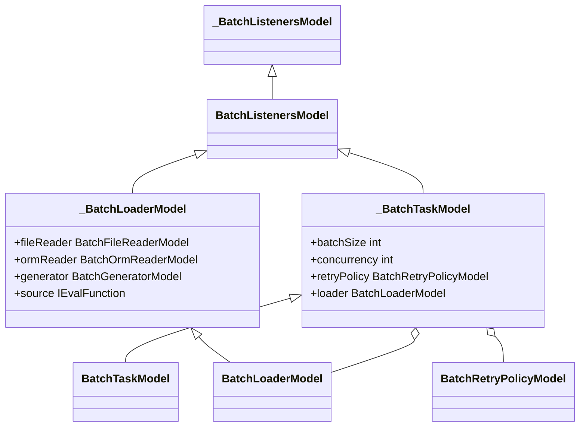
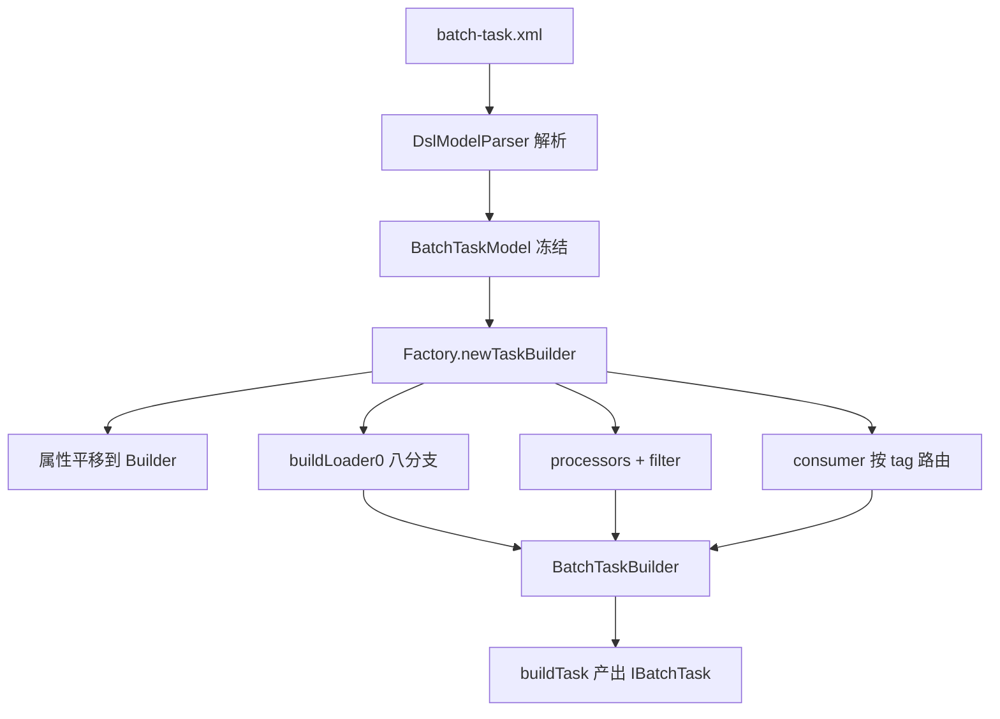
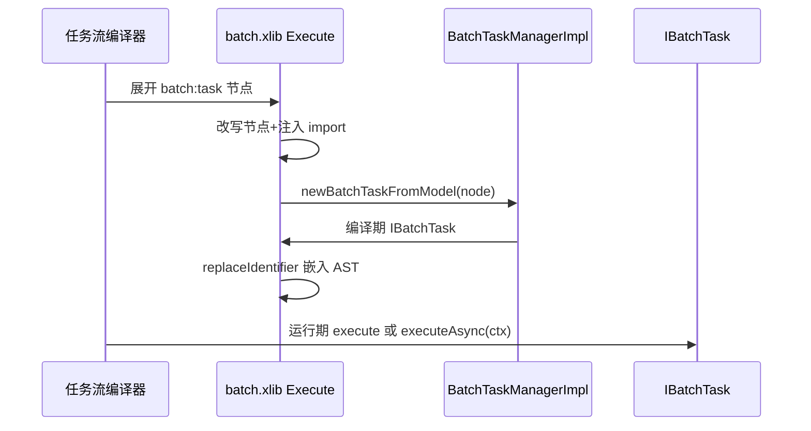

# DSL 模型与 XLang 集成

> 本页源文件（仓库相对路径，链接自 `deepwiki/nop-batch/modules/` 三级回溯）：
>
> - [nop-batch/nop-batch-dsl/src/main/java/io/nop/batch/dsl/model/BatchTaskModel.java](../../../nop-batch/nop-batch-dsl/src/main/java/io/nop/batch/dsl/model/BatchTaskModel.java)
> - [nop-batch/nop-batch-dsl/src/main/java/io/nop/batch/dsl/model/_gen/_BatchTaskModel.java](../../../nop-batch/nop-batch-dsl/src/main/java/io/nop/batch/dsl/model/_gen/_BatchTaskModel.java)
> - [nop-batch/nop-batch-dsl/src/main/java/io/nop/batch/dsl/manager/ModelBasedBatchTaskBuilderFactory.java](../../../nop-batch/nop-batch-dsl/src/main/java/io/nop/batch/dsl/manager/ModelBasedBatchTaskBuilderFactory.java)
> - [nop-batch/nop-batch-dsl/src/main/java/io/nop/batch/dsl/manager/BatchTaskManagerImpl.java](../../../nop-batch/nop-batch-dsl/src/main/java/io/nop/batch/dsl/manager/BatchTaskManagerImpl.java)
> - [nop-batch/nop-batch-dsl/src/main/resources/_vfs/nop/batch/beans/batch-dsl.beans.xml](../../../nop-batch/nop-batch-dsl/src/main/resources/_vfs/nop/batch/beans/batch-dsl.beans.xml)
> - [nop-kernel/nop-xdefs/src/main/resources/_vfs/nop/schema/task/batch.xdef](../../../nop-kernel/nop-xdefs/src/main/resources/_vfs/nop/schema/task/batch.xdef)
> - [nop-batch/nop-batch-dsl/src/main/resources/_vfs/nop/batch/xlib/batch.xlib](../../../nop-batch/nop-batch-dsl/src/main/resources/_vfs/nop/batch/xlib/batch.xlib)
> - [nop-batch/nop-batch-dsl/src/main/resources/_vfs/nop/batch/xlib/batch-record.xlib](../../../nop-batch/nop-batch-dsl/src/main/resources/_vfs/nop/batch/xlib/batch-record.xlib)
> - [nop-batch/nop-batch-dsl/src/main/resources/_vfs/nop/batch/xlib/batch-gen.xlib](../../../nop-batch/nop-batch-dsl/src/main/resources/_vfs/nop/batch/xlib/batch-gen.xlib)
> - [nop-batch/nop-batch-dsl/src/main/resources/_vfs/nop/task/lib/batch-common.task.xml](../../../nop-batch/nop-batch-dsl/src/main/resources/_vfs/nop/task/lib/batch-common.task.xml)
> - [nop-batch/nop-batch-gen/src/main/java/io/nop/batch/gen/loader/BatchGenLoaderProvider.java](../../../nop-batch/nop-batch-gen/src/main/java/io/nop/batch/gen/loader/BatchGenLoaderProvider.java)
> - [nop-batch/nop-batch-gen/src/main/java/io/nop/batch/gen/model/BatchGenModel.java](../../../nop-batch/nop-batch-gen/src/main/java/io/nop/batch/gen/model/BatchGenModel.java)
> - [nop-batch/nop-batch-gen/src/main/java/io/nop/batch/gen/generator/BatchGenState.java](../../../nop-batch/nop-batch-gen/src/main/java/io/nop/batch/gen/generator/BatchGenState.java)

nop-batch-dsl 把批处理任务定义成受 `batch.xdef` 约束的 XML 模型树，并在 XLang 编译期把它翻译成 nop-batch-core 的可执行任务。本页覆盖三件事：`BatchTaskModel` 模型族的来源与结构；`ModelBasedBatchTaskBuilderFactory` 如何把模型逐节点装配为 `IBatchTaskBuilder`；batch.xlib / batch-record.xlib / batch-gen.xlib 三件套在 XLang 管线中的角色，以及 nop-batch-gen 数据生成模块与 DSL 线的交汇点。装配产出的 `BatchTaskBuilder` 与执行期的 chunk 循环见[核心引擎](./batch-core.md)与[chunk 管线](../flows/batch-pipeline.md)。

## 模型层：batch.xdef 生成的 BatchTaskModel 族

模型类的唯一来源是 `/nop/schema/task/batch.xdef`。根节点声明 `xdef:name="BatchTaskModel"` 与 `xdef:bean-package="io.nop.batch.dsl.model"`，即代码生成器按这个 xdef 在 `io.nop.batch.dsl.model` 包下生成模型类（`nop-kernel/nop-xdefs/src/main/resources/_vfs/nop/schema/task/batch.xdef:14-17`）。根节点还声明 `xdef:model-name-prop="taskName"`、`xdef:model-version-prop="taskVersion"`，模型文件名与版本由 `taskName`/`taskVersion` 两个属性承载（`batch.xdef:17`）：

`nop-kernel/nop-xdefs/src/main/resources/_vfs/nop/schema/task/batch.xdef:9-18`：

```xml
<batch taskName="string" taskVersion="long" batchSize="!int" concurrency="!int=0" retryOneByOne="boolean=false"
       singleMode="boolean=false" singleSession="boolean" saveState="boolean"
       transactionScope="enum:io.nop.batch.core.BatchTransactionScope"
       rateLimit="double" jitterRatio="double" allowStartIfComplete="boolean" startLimit="!int=0"
       useBatchRequestGenerator="!boolean=false" xdef:ref="BatchListenersModel"
       executor="bean-name" xdef:name="BatchTaskModel" xdef:bean-package="io.nop.batch.dsl.model"
       asyncProcessor="boolean" asyncProcessTimeout="duration" snapshotBuilder="bean-name"
       x:schema="/nop/schema/xdef.xdef" xmlns:x="/nop/schema/xdsl.xdef"
       xdef:model-name-prop="taskName" xdef:model-version-prop="taskVersion"
       xmlns:xdef="/nop/schema/xdef.xdef"
```

手写类是空壳，仅继承生成类并提供无参构造：

`nop-batch/nop-batch-dsl/src/main/java/io/nop/batch/dsl/model/BatchTaskModel.java:5-9`：

```java
public class BatchTaskModel extends _BatchTaskModel{
    public BatchTaskModel(){

    }
}
```

`_BatchTaskModel` 头部注释直接标注 `generate from /nop/schema/task/batch.xdef`，它继承 `BatchListenersModel`（`nop-batch/nop-batch-dsl/src/main/java/io/nop/batch/dsl/model/_gen/_BatchTaskModel.java:11-17`）。监听器模型由 xdef 的 `<xdef:define xdef:name="BatchListenersModel">` 复用块定义（`batch.xdef:54-71`），被 `batch`、`loader`、`processor`、`consumer` 四类节点通过 `xdef:ref` 复用（`batch.xdef:13,76-77,151-152,167-168`）。

`_BatchTaskModel` 共 29 个属性（以 `outputJson` 的输出键为准，`_BatchTaskModel.java:911-943`）。语义上可分为四组：调度控制、输入读取、处理/消费、可靠性。部分关键属性：

| 属性 | 类型 | 语义（取自 xdef/xlib 注释或代码） | 证据 |
|---|---|---|---|
| `taskName`/`taskVersion` | String / Long | 任务标识与版本；`newBatchTaskFromModel` 路径下 `saveState=true` 且 taskName 为空直接报错 | `_BatchTaskModel.java:200-207`；`BatchTaskManagerImpl.java:103-104` |
| `batchSize` / `concurrency` / `executor` | int / int / String | 批大小与并行度；executor 按 bean 名或全局线程池解析 | `_BatchTaskModel.java:45-52,66`；`ModelBasedBatchTaskBuilderFactory.java:207-214` |
| `jitterRatio` | Double | 多线程下对 batchSize 施加随机抖动，`original*(1+jitterRatio*random)`，破坏同步读写数据库的共振 | `_BatchTaskModel.java:84-88` |
| `rateLimit` | Double | 每秒最多处理多少条记录 | `_BatchTaskModel.java:120-123` |
| `singleMode` / `singleSession` | Boolean | singleMode 为逐条处理消费；singleSession 未配置时工厂缺省置 true | `_BatchTaskModel.java:148-158`；`ModelBasedBatchTaskBuilderFactory.java:149-156` |
| `retryPolicy` / `loadRetryPolicy` / `skipPolicy` | 模型对象 | chunk 重试、加载重试、跳过策略，各自独立构建 | `ModelBasedBatchTaskBuilderFactory.java:171-177,194-196` |
| `transactionScope` / `saveState` | enum / Boolean | 事务范围；saveState 决定是否挂接 IBatchStateStore | `ModelBasedBatchTaskBuilderFactory.java:161-162,191-192` |
| `taskKeyExpr` | IEvalFunction | 区分同名任务的不同执行实例，`taskName+taskKey` 只允许执行一次 | `_BatchTaskModel.java:189-193` |
| `useBatchRequestGenerator` | boolean | 交给 IBatchRequestGenerator 驱动请求生成（gen 线使用） | `_BatchTaskModel.java:221` |

`BatchListenersModel` 在 xdef 中声明 12 个监听钩子（`onTaskBegin`、`onBeforeTaskEnd`、`onTaskEnd`、`onChunkBegin`、`onBeforeChunkEnd`、`onChunkEnd`、`onChunkTryBegin`、`onChunkTryEnd`、`onLoadBegin`、`onLoadEnd`、`onConsumeBegin`、`onConsumeEnd`，`batch.xdef:54-71`）；工厂的 `addListeners` 只装配其中 10 个，`onBeforeTaskEnd` 与 `onBeforeChunkEnd` 不在其列（`ModelBasedBatchTaskBuilderFactory.java:540-618`）。

`loader` 节点的 `BatchLoaderModel` 是读入端的 Union 模型：`adapter`、`aggregator`、`dispatcher`、`excelReader`、`fileReader`、`generator`、`jdbcReader`、`ormReader`、`provider`、`source` 十个互斥/组合分支各自对应独立子模型或 XLang 函数（`nop-batch/nop-batch-dsl/src/main/java/io/nop/batch/dsl/model/_gen/_BatchLoaderModel.java:116-344`）。整个模型族都是不可变对象：`freeze(cascade)` 对 consumers、loader、processors、policies 等做深冻结（`_BatchTaskModel.java:880-908`），工厂读取时模型已不可修改。



> Sources: [nop-batch/nop-batch-dsl/src/main/java/io/nop/batch/dsl/model/BatchTaskModel.java:5-9](https://gitee.com/canonical-entropy/nop-entropy/blob/555f7a9731/nop-batch/nop-batch-dsl/src/main/java/io/nop/batch/dsl/model/BatchTaskModel.java#L5-L9)、[nop-batch/nop-batch-dsl/src/main/java/io/nop/batch/dsl/model/_gen/_BatchTaskModel.java:11-943](https://gitee.com/canonical-entropy/nop-entropy/blob/555f7a9731/nop-batch/nop-batch-dsl/src/main/java/io/nop/batch/dsl/model/_gen/_BatchTaskModel.java#L11-L943)、[nop-kernel/nop-xdefs/src/main/resources/_vfs/nop/schema/task/batch.xdef:9-71](https://gitee.com/canonical-entropy/nop-entropy/blob/555f7a9731/nop-kernel/nop-xdefs/src/main/resources/_vfs/nop/schema/task/batch.xdef#L9-L71)、[nop-batch/nop-batch-dsl/src/main/java/io/nop/batch/dsl/model/_gen/_BatchLoaderModel.java:116-344](https://gitee.com/canonical-entropy/nop-entropy/blob/555f7a9731/nop-batch/nop-batch-dsl/src/main/java/io/nop/batch/dsl/model/_gen/_BatchLoaderModel.java#L116-L344)

## 模型→工厂→任务：ModelBasedBatchTaskBuilderFactory 的装配链

`BatchTaskManagerImpl`（bean `nopBatchTaskManager`，注册于 `nop-batch/nop-batch-dsl/src/main/resources/_vfs/nop/batch/beans/batch-dsl.beans.xml:4`）提供三个模型入口，全部汇聚到同一条装配语句：

- `newBatchTask(name, version)`：按 `/nop/batch-task/{name}.{version}.batch-task.xml` 规则拼路径后经 `ResourceComponentManager` 加载模型（`BatchTaskManagerImpl.java:90-94,120-124`；路径常量见 `nop-batch/nop-batch-dsl/src/main/java/io/nop/batch/dsl/BatchDslConstants.java:4-7`）；
- `newBatchTaskFromModel(XNode)`：供 XPL 宏标签调用，用 `DslModelParser(XDEF_BATCH)` 直接从节点解析，编译期临时放开未注册作用域变量（`BatchTaskManagerImpl.java:97-111`）；
- `loadBatchTaskFromPath(path)`：按显式路径加载（`BatchTaskManagerImpl.java:114-118`）。

宏标签入口的完整实现——临时放开 `allowUnregisteredScopeVar`、校验 `taskName`、落到同一条装配语句：

`nop-batch/nop-batch-dsl/src/main/java/io/nop/batch/dsl/manager/BatchTaskManagerImpl.java:97-111`：

```java
    public IBatchTask newBatchTaskFromModel(XNode node, IBeanProvider beanProvider, IXLangCompileScope scope) {
        XLangCompileTool compileTool = scope == null ? XLang.newCompileTool() : new XLangCompileTool(scope.newChildScope(true));
        boolean allowUnregisteredVar = compileTool.isAllowUnregisteredScopeVar();
        try {
            compileTool.allowUnregisteredScopeVar(true);
            BatchTaskModel taskModel = (BatchTaskModel) new DslModelParser(BatchDslConstants.XDEF_BATCH).withCompileTool(compileTool).parseFromNode(node);
            if (StringHelper.isEmpty(taskModel.getTaskName()) && Boolean.TRUE.equals(taskModel.getSaveState()))
                throw new NopException(ERR_BATCH_TASK_NAME_EMPTY).source(node);

            return new ModelBasedBatchTaskBuilderFactory(taskModel, stateStore, transactionTemplate,
                    ormTemplate, jdbcTemplate, daoProvider, sqlLibManager, historyStoreBuilder).newTaskBuilder(beanProvider).buildTask();
        } finally {
            compileTool.allowUnregisteredScopeVar(allowUnregisteredVar);
        }
    }
```

三条路径的终点相同：`new ModelBasedBatchTaskBuilderFactory(taskModel, stateStore, transactionTemplate, ormTemplate, jdbcTemplate, daoProvider, sqlLibManager, historyStoreBuilder).newTaskBuilder(beanProvider).buildTask()`（`BatchTaskManagerImpl.java:92-93,106-107,116-117`）。构造器的八个依赖决定了这个工厂能装配出哪些读入/写实现——ORM、JDBC、事务、DAO、sql-lib、状态存储、历史存储全部从这里注入（`ModelBasedBatchTaskBuilderFactory.java:112-128`）。

`newTaskBuilder`（`ModelBasedBatchTaskBuilderFactory.java:130-205`）第一遍扫描把 29 个模型属性平移到 `BatchTaskBuilder`：标量直传；`retryPolicy`/`loadRetryPolicy` 调 `buildRetryPolicy()` 变成 `IRetryPolicy`；`inputSorter` 包成 `OrderByComparator`；`transactionTemplate`/`ormTemplate` 存在时分别挂 `TransactionalFunctionInvoker` 与 `SingleSessionFunctionInvoker`。两个缺省语义值得注意：`singleSession` 未配置时被显式置为 `true`（152-156 行），`concurrency>0` 才设置并发（165-166 行）。

`buildTask`（238-314 行）第二遍装配三段管线。读端 `buildLoader0` 按 8 个分支把 `BatchLoaderModel` 翻译成 `IBatchLoaderProvider`，分支判定完全按模型字段非空顺序：

| loader 分支 | 装配结果 | 委托目标 |
|---|---|---|
| `bean` | 容器 bean 直转 | `beanProvider.getBean`（422-424 行） |
| `fileReader` / `excelReader` | 文件/Excel 读取器 | `FileBatchSupport.newFileReader/newExcelReader`（429-432 行） |
| `jdbcReader` / `ormReader` | SQL/ORM 读取器 | `JdbcBatchSupport`/`OrmBatchSupport`（433-436 行） |
| `generator` | 测试数据生成器 | `BatchGenLoaderProvider`（437-438,472-480 行） |
| `provider` | XLang 函数返回 loader 或 List | `newLoaderProvider`（439-440,456-470 行） |
| `source` | XLang 函数 `(batchSize,ctx)=>List` | `safeLoad`（441-442,452-454 行） |

`source` 分支的注释明确了一个边界：每个 chunk 有独立 ctx，对 ctx 加锁不能提供跨线程互斥，非线程安全的 source 要么配 dispatcher 串行化 fetch，要么自行保证线程安全（448-451 行）。处理端把每个 `BatchProcessorModel` 的 `filter` 前置为 `FilterBatchProcessor`，再经 `MultiBatchProcessorProvider.fromList` 合并（258-269 行）。写端 `getWriter0`（672-703 行）按 `fileWriter`/`excelWriter`/`ormWriter`/`jdbcWriter`/`provider`/`source` 分支产出 `IBatchConsumerProvider`，`transformer` 包成 `TransformedBatchConsumerProvider`，`filter` 经 `withFilter` 叠加（699-702,725-734 行）。

多 consumer 路由是装配链中最复杂的分支（271-313 行）：有 `tagger` 时包 `RecordTagSplitter`，consumer 按 `forTag` 分组，带 tag 的组经 `SplitBatchConsumer` 分流，不带 tag 的组总是消费。工厂在构建期就拦截一个静默丢数据的配置错误——consumer 配了 `forTag` 但任务没有 `tagger` 时抛 `ERR_BATCH_TASK_CONSUMER_FOR_TAG_NO_TAGGER`（216-236 行），构建期校验的实现如下：

`nop-batch/nop-batch-dsl/src/main/java/io/nop/batch/dsl/manager/ModelBasedBatchTaskBuilderFactory.java:221-236`：

```java
    private void validateConsumers(IBeanProvider beanContainer) {
        List<BatchConsumerModel> consumers = batchTaskModel.getConsumers();
        if (consumers == null)
            return;

        BatchConsumerModel tagged = consumers.stream()
                .filter(c -> c.getForTag() != null)
                .findFirst()
                .orElse(null);
        if (tagged != null && getTagger(beanContainer) == null) {
            throw new NopException(ERR_BATCH_TASK_CONSUMER_FOR_TAG_NO_TAGGER)
                    .source(batchTaskModel)
                    .param(ARG_BATCH_TASK_NAME, batchTaskName)
                    .param(ARG_CONSUMER_LOCATION, String.valueOf(tagged.getLocation()));
        }
    }
```

方法上的 javadoc（216-220 行）写明不拦截的后果："多 consumer 场景下带 tag 的 consumer 会被静默丢弃（全部 forTag 时整条消费链退化为 EmptyBatchConsumer，数据全部丢弃），单 consumer 场景下 forTag 被静默忽略"。

三条次级装配线补齐剩余语义。其一，`addParamsInitializer` 为 `param` 声明注册任务初始化器：运行期从 context 取值，缺省回退模型 `defaultValue`，声明了 `type` 的按 `StdDataType` 做类型转换，`mandatory` 且仍为 null 时抛 `ERR_BATCH_INPUT_MANDATORY_NOT_PROVIDED`（620-643 行）。其二，`addHistoryStore` 支持两种历史存储来源：`historyStore.bean` 指向的容器 bean 直接实现 `IBatchRecordHistoryStore` 时直挂，实现 `IBatchHistoryStoreBuilder` 时替换缺省 builder，否则类型错误抛 `ERR_BATCH_TASK_INVALID_HISTORY_STORE_BEAN`；无 bean 时用工厂注入的缺省 builder 调 `newHistoryStore(model)`（316-344 行）。其三，`snapshotBuilder` 有一个约定特殊值：`BatchConstants.SNAPSHOT_BUILDER_ORM_ENTITY` 映射到内置的 `OrmBatchRecordSnapshotBuilder`，其余值按 bean 名从容器解析（346-350 行）。loader 还可声明 `dispatcher` 做分区分发：`partitionIndexField` 按字段 hash、`partitionFn` 按函数返回值、都没有时退化为随机分区，hash 统一经 `Math.floorMod` 折到非负区间（352-383 行）。



> Sources: [nop-batch/nop-batch-dsl/src/main/java/io/nop/batch/dsl/manager/BatchTaskManagerImpl.java:90-125](https://gitee.com/canonical-entropy/nop-entropy/blob/555f7a9731/nop-batch/nop-batch-dsl/src/main/java/io/nop/batch/dsl/manager/BatchTaskManagerImpl.java#L90-L125)、[nop-batch/nop-batch-dsl/src/main/java/io/nop/batch/dsl/manager/ModelBasedBatchTaskBuilderFactory.java:130-480](https://gitee.com/canonical-entropy/nop-entropy/blob/555f7a9731/nop-batch/nop-batch-dsl/src/main/java/io/nop/batch/dsl/manager/ModelBasedBatchTaskBuilderFactory.java#L130-L480)、[nop-batch/nop-batch-dsl/src/main/java/io/nop/batch/dsl/manager/ModelBasedBatchTaskBuilderFactory.java:540-734](https://gitee.com/canonical-entropy/nop-entropy/blob/555f7a9731/nop-batch/nop-batch-dsl/src/main/java/io/nop/batch/dsl/manager/ModelBasedBatchTaskBuilderFactory.java#L540-L734)、[nop-batch/nop-batch-dsl/src/main/java/io/nop/batch/dsl/BatchDslConstants.java:4-7](https://gitee.com/canonical-entropy/nop-entropy/blob/555f7a9731/nop-batch/nop-batch-dsl/src/main/java/io/nop/batch/dsl/BatchDslConstants.java#L4-L7)、[nop-batch/nop-batch-dsl/src/main/resources/_vfs/nop/batch/beans/batch-dsl.beans.xml:4-11](https://gitee.com/canonical-entropy/nop-entropy/blob/555f7a9731/nop-batch/nop-batch-dsl/src/main/resources/_vfs/nop/batch/beans/batch-dsl.beans.xml#L4-L11)

## xlib 三件套：XLang 编译期的三个挂载点

三个 xlib 都是 `/nop/schema/xlib.xdef` 约束的 XML 标签库，但挂在编译管线的不同位置：

| xlib | 标签 | 类型 | 职责 | 行号 |
|---|---|---|---|---|
| batch.xlib | `Execute` | 宏标签（`macro="true"`） | 把 slot 里的批处理 XML 编译期解析为模型并生成调用 AST | `batch.xlib:11-60` |
| batch.xlib | `Consume` / `MapFields` | 普通标签 | 管线内消费语法糖：`consume(item)`、`consume(_.mapFields(item,mapping))` | `batch.xlib:62-77` |
| batch.xlib | `ImportFromExcelLoader` | 普通标签 | 按 imp 模型加载 xlsx 为 List，供 loader provider 使用 | `batch.xlib:79-97` |
| batch-record.xlib | `BuildRecordInputProviderFromFileModel` | 普通标签 | `ModelBasedResourceRecordIO.fromFileModel(fileModel)` 构造读 IO | `batch-record.xlib:7-14` |
| batch-record.xlib | `BuildRecordOutputProviderFromFileModel` | 普通标签（`x:prototype` 复用前者） | 同上，构造写 IO | `batch-record.xlib:16` |
| batch-gen.xlib | `PreParseFileModel` | 编译期钩子（x:pre-parse） | 把 `record:file-model` 节点解析为作用域变量，并向 file-reader/file-writer 注入 record IO 构造标签 | `batch-gen.xlib:7-49` |
| batch-gen.xlib | `PostExtendsForTaskFlow` | 编译期钩子（x:post-extends） | 给带 `task:taskModelPath` 的 processor 注入 `task:Execute` 调用 | `batch-gen.xlib:51-64` |

`Execute` 宏标签是批任务嵌入任务流（task flow）的入口，它的 source 段在编译期做两件事。其一，把 slot 传入的 XML 节点改写为 batch 根节点：`setAttrIfAbsent('x:schema','/nop/schema/task/batch.xdef')`、`tagName='batch'`，并向 `x:config` 注入对 batch.xlib 自身的 `c:import`；随后 `inject('nopBatchTaskManager')` 调 `newBatchTaskFromModel` 得到编译期 `IBatchTask` 实例（`batch.xlib:28-36`）：

`nop-batch/nop-batch-dsl/src/main/resources/_vfs/nop/batch/xlib/batch.xlib:28-36`：

```xml
                   const node = slot_task.cloneInstance();
                   node.setAttrIfAbsent('x:schema','/nop/schema/task/batch.xdef');
                   node.setAttr('xmlns:x','/nop/schema/xdsl.xdef');
                   node.tagName = 'batch';
                   node.makeChild('x:config').appendBodyXml(`<c:import from="/nop/batch/xlib/batch.xlib" />`);

                   const batchTaskManager = inject('nopBatchTaskManager')
                   const batchTask = batchTaskManager.newBatchTaskFromModel(node,$beanProvider,$scope);
                    // 得到<c:script>对应的抽象语法树
```

其二，用 `xpl` 模板生成运行期脚本的 AST，`ast.replaceIdentifier("batchTask", batchTask)` 把模型对象直接替换进 AST——运行期不再解析模型，只执行 `batchTask.execute(batchTaskContext)` 或 `executeAsync`（`batch.xlib:34-56`）。文件头注释概括了这一机制："通过名为 task 的 slot 传入批处理模型配置，然后执行宏标签函数，在编译期将其解析构造出 IBatchTaskBuilder 对象"（`batch.xlib:7-10`）。

`PreParseFileModel` 与 `PostExtendsForTaskFlow` 的挂载通过任务流扩展库完成：`nop-batch/nop-batch-dsl/src/main/resources/_vfs/nop/task/lib/batch-common.task.xml:3-9` 把两个钩子分别追加到 task DSL 的 `x:pre-parse` 与 `x:post-extends` 阶段，任务流通过 `x:extends="/nop/task/lib/common.task.xml,/nop/task/lib/batch-common.task.xml"` 启用（测试样例 `nop-batch/nop-batch-dsl/src/test/resources/_vfs/test/batch/test-batch.task.xml:2`）。`PreParseFileModel` 扫描根节点的 `record:file-model` 子节点，改写 tagName 并用 `RecordModelParseHelper.parseRecordFileMetaFromNode` 解析成模型后 `assign(name, model)` 绑定到作用域变量，再为所有引用它的 `file-reader`/`file-writer` 注入 `newRecordInputProvider`/`newRecordOutputProvider` 子节点，子节点体内正是 batch-record.xlib 的两个标签（`batch-gen.xlib:13-47`）。也就是说，batch-gen.xlib 负责 DSL 预处理与标签注入，batch-record.xlib 负责真正构造 record IO，二者是编译期上下游。`PostExtendsForTaskFlow` 则反向打通 batch→task 方向：processor 声明 `task:taskModelPath` 时，post-extends 阶段给它生成一个 `source` 子节点，内容是对 `/nop/task/xlib/task.xlib` 的 `task:Execute` 调用，inputs 固定传 `{item,consume,batchChunkCtx}`（`batch-gen.xlib:55-62`）——批处理处理器由此可以把单个 item 委托给一个独立的任务流文件。nop-batch-dsl 模块同时注册了 `nopBatchTaskRunner` bean，包装 manager 提供按路径异步执行任务的门面，可选注入 job 侧的 `PartitionResolver`（`batch-dsl.beans.xml:6-11`）。



> Sources: [nop-batch/nop-batch-dsl/src/main/resources/_vfs/nop/batch/xlib/batch.xlib:7-97](https://gitee.com/canonical-entropy/nop-entropy/blob/555f7a9731/nop-batch/nop-batch-dsl/src/main/resources/_vfs/nop/batch/xlib/batch.xlib#L7-L97)、[nop-batch/nop-batch-dsl/src/main/resources/_vfs/nop/batch/xlib/batch-gen.xlib:7-64](https://gitee.com/canonical-entropy/nop-entropy/blob/555f7a9731/nop-batch/nop-batch-dsl/src/main/resources/_vfs/nop/batch/xlib/batch-gen.xlib#L7-L64)、[nop-batch/nop-batch-dsl/src/main/resources/_vfs/nop/batch/xlib/batch-record.xlib:7-16](https://gitee.com/canonical-entropy/nop-entropy/blob/555f7a9731/nop-batch/nop-batch-dsl/src/main/resources/_vfs/nop/batch/xlib/batch-record.xlib#L7-L16)、[nop-batch/nop-batch-dsl/src/main/resources/_vfs/nop/task/lib/batch-common.task.xml:3-9](https://gitee.com/canonical-entropy/nop-entropy/blob/555f7a9731/nop-batch/nop-batch-dsl/src/main/resources/_vfs/nop/task/lib/batch-common.task.xml#L3-L9)、[nop-batch/nop-batch-dsl/src/test/resources/_vfs/test/batch/test-batch.task.xml:2](https://gitee.com/canonical-entropy/nop-entropy/blob/555f7a9731/nop-batch/nop-batch-dsl/src/test/resources/_vfs/test/batch/test-batch.task.xml#L2)

## 与 nop-batch-gen 的关系：loader 的 generator 分支

nop-batch-gen 与 DSL 线只有一个交汇点：`BatchLoaderModel.generator` 分支。xdef 中该分支声明为 `<generator genModelPath="v-path" totalCountExpr="!expr"/>`（`nop-kernel/nop-xdefs/src/main/resources/_vfs/nop/schema/task/batch.xdef:138`），工厂的 `newGenerator` 把它翻译为 `BatchGenLoaderProvider`：`totalCountExpr` 决定生成总量，`genModelPath` 经 `VirtualFileSystem` 定位生成模型（`ModelBasedBatchTaskBuilderFactory.java:472-480`）。

`BatchGenLoaderProvider.setup` 在任务启动时求值 totalCount，用 `BatchGenModelParser` 解析生成模型，构建 `BatchGenState` 后返回同步加锁的 loader——load 方法整体在 `synchronized(state)` 内，保证跨线程领取时不重复发放记录：

`nop-batch/nop-batch-gen/src/main/java/io/nop/batch/gen/loader/BatchGenLoaderProvider.java:50-63`：

```java
    @Override
    public IBatchLoader<Object> setup(IBatchTaskContext context) {
        long totalCount = ConvertHelper.toPrimitiveLong(totalCountExpr.invoke(context), NopException::new);

        LoaderState state = new LoaderState();
        state.genModel = new BatchGenModelParser().parseFromResource(getResource(context));
        state.genState = new BatchGenState(state.genModel, totalCount);
        state.genContext = new BatchGenContextImpl(registry);
        return (batchSize, ctx) -> {
            synchronized (state) {
                return load(batchSize, ctx, state);
            }
        };
    }
```

生成模型 `BatchGenModel` 自述为"数据生成模型。用于按照指定的数据分布比例来批量生成一批测试数据"（`BatchGenModel.java:20-35`）：`template` 是数据模板，`subCases` 是按比例分配的子用例，`init()` 递归地把父用例的 template/outputVars 用 `JsonMerger` 合并进子用例的 merged 视图（`BatchGenModel.java:117-155`）。`BatchGenState` 按是否 `sequential` 选择顺序生成或子用例分配，`next` 最终经 `context.getProducer().produce(mergedTemplate, beanType, context)` 产出对象（`nop-batch/nop-batch-gen/src/main/java/io/nop/batch/gen/generator/BatchGenState.java:33-38,64-86`）；顺序模式下每次 `next` 返回一个 `SequentialBatchRequestGenerator`，其 `nextRequest` 用 `when` 过滤条件跳过子用例、`onResponse` 从响应回填输出变量（`nop-batch/nop-batch-gen/src/main/java/io/nop/batch/gen/generator/SequentialBatchRequestGenerator.java:31-74`）。

生成模型本身不是 xdef DSL：`BatchGenModelParser` 按扩展名分流，`.batch-gen.xlsx` 走 Excel 模型加载（imp 路径常量 `/nop/batch/imp/batch-gen.imp.xml`），否则按 JSON delta bean 加载（`nop-batch/nop-batch-gen/src/main/java/io/nop/batch/gen/model/BatchGenModelParser.java:20-35`；格式常量 `nop-batch/nop-batch-gen/src/main/java/io/nop/batch/gen/BatchGenConstants.java:12-24`）。因此页面上名字相近的两个"gen"需要划界：`nop-batch-gen` 是数据生成模型的运行期实现；`batch-gen.xlib` 是任务 DSL 编译期的预处理钩子，与数据生成无关。术语划界见[术语表](../glossary.md)。

> Sources: [nop-batch/nop-batch-gen/src/main/java/io/nop/batch/gen/loader/BatchGenLoaderProvider.java:27-75](https://gitee.com/canonical-entropy/nop-entropy/blob/555f7a9731/nop-batch/nop-batch-gen/src/main/java/io/nop/batch/gen/loader/BatchGenLoaderProvider.java#L27-L75)、[nop-batch/nop-batch-gen/src/main/java/io/nop/batch/gen/model/BatchGenModel.java:20-155](https://gitee.com/canonical-entropy/nop-entropy/blob/555f7a9731/nop-batch/nop-batch-gen/src/main/java/io/nop/batch/gen/model/BatchGenModel.java#L20-L155)、[nop-batch/nop-batch-gen/src/main/java/io/nop/batch/gen/model/BatchGenModelParser.java:20-35](https://gitee.com/canonical-entropy/nop-entropy/blob/555f7a9731/nop-batch/nop-batch-gen/src/main/java/io/nop/batch/gen/model/BatchGenModelParser.java#L20-L35)、[nop-batch/nop-batch-gen/src/main/java/io/nop/batch/gen/generator/BatchGenState.java:33-100](https://gitee.com/canonical-entropy/nop-entropy/blob/555f7a9731/nop-batch/nop-batch-gen/src/main/java/io/nop/batch/gen/generator/BatchGenState.java#L33-L100)、[nop-batch/nop-batch-gen/src/main/java/io/nop/batch/gen/generator/SequentialBatchRequestGenerator.java:31-74](https://gitee.com/canonical-entropy/nop-entropy/blob/555f7a9731/nop-batch/nop-batch-gen/src/main/java/io/nop/batch/gen/generator/SequentialBatchRequestGenerator.java#L31-L74)

## Sources

- [nop-batch/nop-batch-dsl/src/main/java/io/nop/batch/dsl/model/BatchTaskModel.java:5-9](https://gitee.com/canonical-entropy/nop-entropy/blob/555f7a9731/nop-batch/nop-batch-dsl/src/main/java/io/nop/batch/dsl/model/BatchTaskModel.java#L5-L9)
- [nop-batch/nop-batch-dsl/src/main/java/io/nop/batch/dsl/model/_gen/_BatchTaskModel.java:11-943](https://gitee.com/canonical-entropy/nop-entropy/blob/555f7a9731/nop-batch/nop-batch-dsl/src/main/java/io/nop/batch/dsl/model/_gen/_BatchTaskModel.java#L11-L943)
- [nop-batch/nop-batch-dsl/src/main/java/io/nop/batch/dsl/model/_gen/_BatchLoaderModel.java:116-344](https://gitee.com/canonical-entropy/nop-entropy/blob/555f7a9731/nop-batch/nop-batch-dsl/src/main/java/io/nop/batch/dsl/model/_gen/_BatchLoaderModel.java#L116-L344)
- [nop-batch/nop-batch-dsl/src/main/java/io/nop/batch/dsl/manager/ModelBasedBatchTaskBuilderFactory.java:112-741](https://gitee.com/canonical-entropy/nop-entropy/blob/555f7a9731/nop-batch/nop-batch-dsl/src/main/java/io/nop/batch/dsl/manager/ModelBasedBatchTaskBuilderFactory.java#L112-L741)
- [nop-batch/nop-batch-dsl/src/main/java/io/nop/batch/dsl/manager/BatchTaskManagerImpl.java:33-125](https://gitee.com/canonical-entropy/nop-entropy/blob/555f7a9731/nop-batch/nop-batch-dsl/src/main/java/io/nop/batch/dsl/manager/BatchTaskManagerImpl.java#L33-L125)
- [nop-batch/nop-batch-dsl/src/main/java/io/nop/batch/dsl/BatchDslConstants.java:3-16](https://gitee.com/canonical-entropy/nop-entropy/blob/555f7a9731/nop-batch/nop-batch-dsl/src/main/java/io/nop/batch/dsl/BatchDslConstants.java#L3-L16)
- [nop-batch/nop-batch-dsl/src/main/resources/_vfs/nop/batch/xlib/batch.xlib:7-99](https://gitee.com/canonical-entropy/nop-entropy/blob/555f7a9731/nop-batch/nop-batch-dsl/src/main/resources/_vfs/nop/batch/xlib/batch.xlib#L7-L99)
- [nop-batch/nop-batch-dsl/src/main/resources/_vfs/nop/batch/xlib/batch-record.xlib:1-18](https://gitee.com/canonical-entropy/nop-entropy/blob/555f7a9731/nop-batch/nop-batch-dsl/src/main/resources/_vfs/nop/batch/xlib/batch-record.xlib#L1-L18)
- [nop-batch/nop-batch-dsl/src/main/resources/_vfs/nop/batch/xlib/batch-gen.xlib:1-66](https://gitee.com/canonical-entropy/nop-entropy/blob/555f7a9731/nop-batch/nop-batch-dsl/src/main/resources/_vfs/nop/batch/xlib/batch-gen.xlib#L1-L66)
- [nop-batch/nop-batch-dsl/src/main/resources/_vfs/nop/task/lib/batch-common.task.xml:1-10](https://gitee.com/canonical-entropy/nop-entropy/blob/555f7a9731/nop-batch/nop-batch-dsl/src/main/resources/_vfs/nop/task/lib/batch-common.task.xml#L1-L10)
- [nop-batch/nop-batch-dsl/src/main/resources/_vfs/nop/batch/beans/batch-dsl.beans.xml:1-12](https://gitee.com/canonical-entropy/nop-entropy/blob/555f7a9731/nop-batch/nop-batch-dsl/src/main/resources/_vfs/nop/batch/beans/batch-dsl.beans.xml#L1-L12)
- [nop-batch/nop-batch-dsl/src/test/resources/_vfs/test/batch/test-batch.task.xml:1-56](https://gitee.com/canonical-entropy/nop-entropy/blob/555f7a9731/nop-batch/nop-batch-dsl/src/test/resources/_vfs/test/batch/test-batch.task.xml#L1-L56)
- [nop-batch/nop-batch-gen/src/main/java/io/nop/batch/gen/loader/BatchGenLoaderProvider.java:27-76](https://gitee.com/canonical-entropy/nop-entropy/blob/555f7a9731/nop-batch/nop-batch-gen/src/main/java/io/nop/batch/gen/loader/BatchGenLoaderProvider.java#L27-L76)
- [nop-batch/nop-batch-gen/src/main/java/io/nop/batch/gen/model/BatchGenModel.java:20-156](https://gitee.com/canonical-entropy/nop-entropy/blob/555f7a9731/nop-batch/nop-batch-gen/src/main/java/io/nop/batch/gen/model/BatchGenModel.java#L20-L156)
- [nop-batch/nop-batch-gen/src/main/java/io/nop/batch/gen/model/BatchGenModelParser.java:18-37](https://gitee.com/canonical-entropy/nop-entropy/blob/555f7a9731/nop-batch/nop-batch-gen/src/main/java/io/nop/batch/gen/model/BatchGenModelParser.java#L18-L37)
- [nop-batch/nop-batch-gen/src/main/java/io/nop/batch/gen/generator/BatchGenState.java:17-101](https://gitee.com/canonical-entropy/nop-entropy/blob/555f7a9731/nop-batch/nop-batch-gen/src/main/java/io/nop/batch/gen/generator/BatchGenState.java#L17-L101)
- [nop-batch/nop-batch-gen/src/main/java/io/nop/batch/gen/generator/SequentialBatchRequestGenerator.java:20-75](https://gitee.com/canonical-entropy/nop-entropy/blob/555f7a9731/nop-batch/nop-batch-gen/src/main/java/io/nop/batch/gen/generator/SequentialBatchRequestGenerator.java#L20-L75)
- [nop-batch/nop-batch-gen/src/main/java/io/nop/batch/gen/BatchGenConstants.java:12-24](https://gitee.com/canonical-entropy/nop-entropy/blob/555f7a9731/nop-batch/nop-batch-gen/src/main/java/io/nop/batch/gen/BatchGenConstants.java#L12-L24)
- [nop-kernel/nop-xdefs/src/main/resources/_vfs/nop/schema/task/batch.xdef:9-215](https://gitee.com/canonical-entropy/nop-entropy/blob/555f7a9731/nop-kernel/nop-xdefs/src/main/resources/_vfs/nop/schema/task/batch.xdef#L9-L215)

---

## On this page

- 模型层：batch.xdef 生成的 BatchTaskModel 族
- 模型→工厂→任务：ModelBasedBatchTaskBuilderFactory 的装配链
- xlib 三件套：XLang 编译期的三个挂载点
- 与 nop-batch-gen 的关系：loader 的 generator 分支
