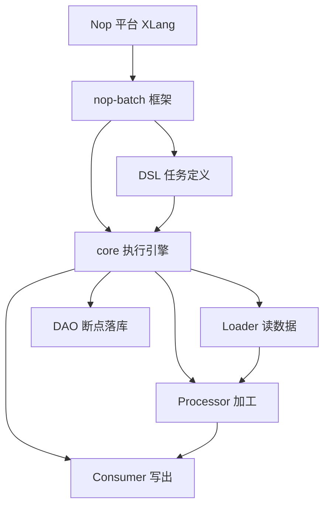

# nop-batch 总览：chunked 批处理框架

> 本页源文件基准（相对于 `deepwiki/nop-batch/`，两级回溯到仓库根，逐条验证可达）：
>
> - [../../nop-batch/pom.xml](../../nop-batch/pom.xml)
> - [../../nop-batch/nop-batch-core/src/main/java/io/nop/batch/core/BatchTaskBuilder.java](../../nop-batch/nop-batch-core/src/main/java/io/nop/batch/core/BatchTaskBuilder.java)
> - [../../nop-batch/nop-batch-core/src/main/java/io/nop/batch/core/IBatchChunkContext.java](../../nop-batch/nop-batch-core/src/main/java/io/nop/batch/core/IBatchChunkContext.java)
> - [../../nop-batch/nop-batch-core/src/main/java/io/nop/batch/core/BatchErrors.java](../../nop-batch/nop-batch-core/src/main/java/io/nop/batch/core/BatchErrors.java)
> - [../../nop-batch/nop-batch-core/src/main/java/io/nop/batch/core/IBatchStateStore.java](../../nop-batch/nop-batch-core/src/main/java/io/nop/batch/core/IBatchStateStore.java)
> - [../../nop-batch/nop-batch-core/src/main/java/io/nop/batch/core/loader/PartitionDispatchQueue.java](../../nop-batch/nop-batch-core/src/main/java/io/nop/batch/core/loader/PartitionDispatchQueue.java)
> - [../../nop-batch/nop-batch-dsl/src/main/java/io/nop/batch/dsl/model/BatchTaskModel.java](../../nop-batch/nop-batch-dsl/src/main/java/io/nop/batch/dsl/model/BatchTaskModel.java)
> - [../../nop-batch/nop-batch-dao/src/main/java/io/nop/batch/dao/entity/NopBatchTask.java](../../nop-batch/nop-batch-dao/src/main/java/io/nop/batch/dao/entity/NopBatchTask.java)
> - [../../nop-batch/nop-batch-exp/src/main/java/io/nop/batch/exp/ImportDbTool.java](../../nop-batch/nop-batch-exp/src/main/java/io/nop/batch/exp/ImportDbTool.java)

## 定位与形态判定

nop-batch 是 Nop 平台的 chunked 批处理框架（形态判定：framework-repo，类 mini-Spring-Batch）。它把批处理抽象为 Loader（读）→ Processor（加工）→ Consumer（写）三段 Provider 管线：一个 chunk（默认 100 条记录）全部执行完毕才提交一次，而非逐条提交（`nop-batch/nop-batch-core/src/main/java/io/nop/batch/core/IBatchChunkContext.java:18-21`）。任务用 DSL（batch.xdef → BatchTaskModel）或编程式 `BatchTaskBuilder` 定义，后者自述职责是"组织 skip/retry/transaction/process/listener 的处理顺序"（`nop-batch/nop-batch-core/src/main/java/io/nop/batch/core/BatchTaskBuilder.java:48-50`）；执行进度经 `IBatchStateStore` 落 DAO 实体，支持断点续跑与记录级追溯（`nop-batch/nop-batch-core/src/main/java/io/nop/batch/core/IBatchStateStore.java:13-17`）。

框架在 `nop-batch/` 内自洽：core 是执行引擎，dsl 经 xlib 三件套接入 XLang，dao/orm/jdbc 负责状态落库与数据库读写，api/service/web/biz 提供实体外观与 CRUD。exp 模块（ImportDbTool 416 行 / ExportDbTool 392 行，`nop-batch/nop-batch-exp/src/main/java/io/nop/batch/exp/ImportDbTool.java:1-416`、`ExportDbTool.java:1-392`）是框架之上的数据库导入导出应用工具，不属于框架机制，本页带过。

> Sources: IBatchChunkContext.java:18-21；BatchTaskBuilder.java:48-50,62；IBatchStateStore.java:13-17；BatchTaskModel.java:3-5；ImportDbTool.java；ExportDbTool.java

## 关键数字

| 数字 | 含义 | 依据 |
|---|---|---|
| 17 子目录 | `nop-batch/` 下 15 个 Maven 聚合模块 + deploy（建表 SQL）+ model（`nop-batch.orm.xml` 源）；平台构建序号 23 | `nop-batch/pom.xml:15-35` |
| 85 文件 | nop-batch-core main 源文件数，框架质量最重的模块 | 目录统计 |
| 67 fan-in | `IBatchChunkContext` 被 67 个 main 源文件引用，全模块第一；`IBatchTaskContext` 54 次之 | 全仓 grep（排除定义文件） |
| 8 码全在用 | `BatchErrors` 定义 8 个 ErrorCode，逐码核查均有生产抛出点，无预留码 | `nop-batch/nop-batch-core/src/main/java/io/nop/batch/core/BatchErrors.java:30-51` |
| 三 Provider | 管线三段接口 fan-in：Loader 31 / Processor 16 / Consumer 36 | 全仓 grep |
| 四实体断点资产 | ORM 注册 Task/TaskVar/RecordResult/File 四实体支撑断点续跑与追溯 | `nop-batch/model/nop-batch.orm.xml:40-226` |

> Sources: pom.xml:15-35；BatchErrors.java:30-51；nop-batch.orm.xml:40-226

## 能力边界

| 能力 | 支持情况 | 依据 |
|---|---|---|
| loader 类型 | core 内置 Invoker/List/BlockingSource/ResourceRecord/ChunkSort 等 13 类；ORM 查询加载（OrmQueryBatchLoaderProvider）；JDBC 全量/分页（JdbcBatchLoaderProvider、JdbcPageBatchLoaderProvider） | `nop-batch/nop-batch-core/src/main/java/io/nop/batch/core/loader/`、`nop-batch/nop-batch-orm/.../orm/loader/`、`nop-batch/nop-batch-jdbc/.../jdbc/loader/` |
| consumer 装饰链 | core 21 个 consumer 类：skip/retry（整体与逐条）/限流/速率/jitter/历史跳过/多路分发，由 Builder 按序组装 | `nop-batch/nop-batch-core/src/main/java/io/nop/batch/core/BatchTaskBuilder.java:54-120` |
| 分区 | `PartitionDispatchQueue` 按 partitionIndex 拆队、同区顺序处理；AsyncFetch 变体异步预取；`threadIndex` 可作分区依据 | `nop-batch/nop-batch-core/src/main/java/io/nop/batch/core/loader/PartitionDispatchQueue.java:32-35`；`IBatchChunkContext.java:48-53` |
| 取消 | `BatchCancelException` + 2 个取消码（cancel-process/cancel-load）；取消原因分派 SUSPENDED/CANCELLED/KILLED 终态 | `nop-batch/nop-batch-core/src/main/java/io/nop/batch/core/BatchErrors.java:33-35`；`nop-batch/nop-batch-dao/src/main/java/io/nop/batch/dao/store/DaoBatchStateStore.java:180-197` |
| 重入 | `IBatchStateStore` 两方法接缝；重入按 (taskName,taskKey)+execCount 取最新执行行；续跑时输出文件已存在则拒绝 | `nop-batch/nop-batch-core/src/main/java/io/nop/batch/core/IBatchStateStore.java:13-17`；`BatchErrors.java:46-48` |

三条边界澄清（子页已核实，此处只给结论）：

- **NopBatchTaskState 是占位**：实体类与 CRUD BizModel 存在，但 ORM 模型与建表脚本均未注册该实体，仓库内无 Java 接线，详见 [flows/checkpoint-recovery.md](flows/checkpoint-recovery.md)。
- **processor 伪装 consumer**：引擎消费端只有 Consumer 一个接口；设置了 processor 时由 `BatchProcessorConsumer` 包装接入管线（`nop-batch/nop-batch-core/src/main/java/io/nop/batch/core/BatchTaskBuilder.java:396-402`）。
- **queue 与 nop-task 无关**：`PartitionDispatchQueue` 是 core 内进程内分区分发原语，不涉 nop-task 调度集成；dsl 的 main 代码无 `io.nop.task` 引用，仅 pom 声明 `nop-task-core` 依赖（`nop-batch/nop-batch-dsl/pom.xml:50`）。

> Sources: BatchTaskBuilder.java:54-120,396-402；PartitionDispatchQueue.java:32-35；BatchErrors.java:33-35,46-48；DaoBatchStateStore.java:180-197；nop-batch-dsl/pom.xml:50

## 页面地图

- [architecture.md](architecture.md) — 17 子目录分层与引擎/DSL 两条线
- [quickstart.md](quickstart.md) — 构建与最小批任务定义
- [reading-guide.md](reading-guide.md) — 按读者角色的阅读路径
- [flows/batch-pipeline.md](flows/batch-pipeline.md) — chunk 管线：数据如何从 Loader 流向 Consumer
- [flows/checkpoint-recovery.md](flows/checkpoint-recovery.md) — 断点续跑与记录追溯
- [modules/batch-core.md](modules/batch-core.md) — 核心执行引擎
- [modules/batch-dsl.md](modules/batch-dsl.md) — DSL 模型与 XLang 集成
- [topics/error-model.md](topics/error-model.md) — BatchErrors 与取消链
- [glossary.md](glossary.md) — 术语表

> Sources: deepwiki/nop-batch 页面集（PLAN.md 锁定的 10 页）

## Sources

- [nop-batch/pom.xml:15-35](https://gitee.com/canonical-entropy/nop-entropy/blob/0e67dba845/nop-batch/pom.xml#L15-L35)
- [nop-batch/nop-batch-core/src/main/java/io/nop/batch/core/BatchTaskBuilder.java:48-120,396-402](https://gitee.com/canonical-entropy/nop-entropy/blob/0e67dba845/nop-batch/nop-batch-core/src/main/java/io/nop/batch/core/BatchTaskBuilder.java#L48-L120)
- [nop-batch/nop-batch-core/src/main/java/io/nop/batch/core/IBatchChunkContext.java:18-53,85-113](https://gitee.com/canonical-entropy/nop-entropy/blob/0e67dba845/nop-batch/nop-batch-core/src/main/java/io/nop/batch/core/IBatchChunkContext.java#L18-L53)
- [nop-batch/nop-batch-core/src/main/java/io/nop/batch/core/BatchErrors.java:30-51](https://gitee.com/canonical-entropy/nop-entropy/blob/0e67dba845/nop-batch/nop-batch-core/src/main/java/io/nop/batch/core/BatchErrors.java#L30-L51)
- [nop-batch/nop-batch-core/src/main/java/io/nop/batch/core/IBatchStateStore.java:13-17](https://gitee.com/canonical-entropy/nop-entropy/blob/0e67dba845/nop-batch/nop-batch-core/src/main/java/io/nop/batch/core/IBatchStateStore.java#L13-L17)
- [nop-batch/nop-batch-core/src/main/java/io/nop/batch/core/loader/PartitionDispatchQueue.java:32-35](https://gitee.com/canonical-entropy/nop-entropy/blob/0e67dba845/nop-batch/nop-batch-core/src/main/java/io/nop/batch/core/loader/PartitionDispatchQueue.java#L32-L35)
- [nop-batch/nop-batch-dao/src/main/java/io/nop/batch/dao/store/DaoBatchStateStore.java:180-197](https://gitee.com/canonical-entropy/nop-entropy/blob/0e67dba845/nop-batch/nop-batch-dao/src/main/java/io/nop/batch/dao/store/DaoBatchStateStore.java#L180-L197)
- [nop-batch/nop-batch-dao/src/main/java/io/nop/batch/dao/entity/NopBatchTask.java](https://gitee.com/canonical-entropy/nop-entropy/blob/0e67dba845/nop-batch/nop-batch-dao/src/main/java/io/nop/batch/dao/entity/NopBatchTask.java)
- [nop-batch/nop-batch-dsl/src/main/java/io/nop/batch/dsl/model/BatchTaskModel.java:3-5](https://gitee.com/canonical-entropy/nop-entropy/blob/0e67dba845/nop-batch/nop-batch-dsl/src/main/java/io/nop/batch/dsl/model/BatchTaskModel.java#L3-L5)
- [nop-batch/nop-batch-dsl/pom.xml:50](https://gitee.com/canonical-entropy/nop-entropy/blob/0e67dba845/nop-batch/nop-batch-dsl/pom.xml#L50)
- [nop-batch/nop-batch-exp/src/main/java/io/nop/batch/exp/ImportDbTool.java:1-416](https://gitee.com/canonical-entropy/nop-entropy/blob/0e67dba845/nop-batch/nop-batch-exp/src/main/java/io/nop/batch/exp/ImportDbTool.java#L1-L416)
- [nop-batch/nop-batch-exp/src/main/java/io/nop/batch/exp/ExportDbTool.java:1-392](https://gitee.com/canonical-entropy/nop-entropy/blob/0e67dba845/nop-batch/nop-batch-exp/src/main/java/io/nop/batch/exp/ExportDbTool.java#L1-L392)
- [nop-batch/model/nop-batch.orm.xml:40-226](https://gitee.com/canonical-entropy/nop-entropy/blob/0e67dba845/nop-batch/model/nop-batch.orm.xml#L40-L226)

---

## On this page

- 定位与形态判定
- 关键数字
- 能力边界
- 页面地图
