# 阅读指南

> 本页引用基准（相对于 `deepwiki/nop-batch/`：wiki 页同目录直达，源码两级回溯到仓库根，逐条验证可达）：
>
> - [总览](./overview.md)、[快速上手](./quickstart.md)、[架构与数据流](./architecture.md)（与本页同批产出）
> - [术语表](./glossary.md)
> - [chunk 管线](./flows/batch-pipeline.md)
> - [断点续跑与记录](./flows/checkpoint-recovery.md)
> - [核心执行引擎](./modules/batch-core.md)
> - [DSL 模型与 XLang 集成](./modules/batch-dsl.md)
> - [错误模型](./topics/error-model.md)
> - [../../nop-batch/nop-batch-core/src/main/java/io/nop/batch/core/BatchTaskBuilder.java](../../nop-batch/nop-batch-core/src/main/java/io/nop/batch/core/BatchTaskBuilder.java)
> - [../../nop-batch/nop-batch-core/src/main/java/io/nop/batch/core/IBatchLoaderProvider.java](../../nop-batch/nop-batch-core/src/main/java/io/nop/batch/core/IBatchLoaderProvider.java)
> - [../../nop-batch/nop-batch-core/src/main/java/io/nop/batch/core/IBatchProcessorProvider.java](../../nop-batch/nop-batch-core/src/main/java/io/nop/batch/core/IBatchProcessorProvider.java)
> - [../../nop-batch/nop-batch-core/src/main/java/io/nop/batch/core/IBatchConsumerProvider.java](../../nop-batch/nop-batch-core/src/main/java/io/nop/batch/core/IBatchConsumerProvider.java)

本页为三类读者各给出一条按序阅读路径，每步落到具体 wiki 页章节与源码文件。步骤排序依据核心类型的 fan-in（文件级 grep 口径：该类型名在仓库 `.java` 源文件中出现的文件数，2026-09-26 @ HEAD）：fan-in 越高的类型在越多文件的签名中出现，越需要先建立认知。

## fan-in 排序与阅读优先级

| fan-in 排名 | 类型 | 所属 wiki 页（章节） | 读者优先级（读者:步骤） |
|---|---|---|---|
| 1 | `IBatchChunkContext`（67） | [chunk 管线](./flows/batch-pipeline.md) §两个上下文；[术语表](./glossary.md) §核心术语 | A4 · B3 · C2 |
| 2 | `IBatchTaskContext`（53） | [chunk 管线](./flows/batch-pipeline.md) §两个上下文；[核心执行引擎](./modules/batch-core.md) §BatchTaskContextImpl | A4 · B3 · C2 |
| 3 | `IBatchConsumerProvider`（36） | [chunk 管线](./flows/batch-pipeline.md) §三段 Provider | A4 · B3 · C2 |
| 4 | `IBatchLoaderProvider`（31） | 同上 | A4 · B3 · C2 |
| 5 | `IBatchProcessorProvider`（16） | 同上 | A4 · B3 · C2 |
| 6 | `IBatchTask`（9） | [核心执行引擎](./modules/batch-core.md) §BatchTask | B4 |
| 7 | `IBatchRecordHistoryStore`（9） | [断点续跑与记录](./flows/checkpoint-recovery.md) §IBatchRecordHistoryStore 与 IBatchRecordFilter | A5 · B5 · C2 |
| 8 | `IBatchRecordFilter`（9） | 同上 | A5 · B5 |
| 9 | `BatchCancelException`（9） | 同页 §BatchCancelException；[错误模型](./topics/error-model.md) §BatchCancelException | A6 · B5 · C4 |

三条路径的枢纽页是[术语表](./glossary.md)与[chunk 管线](./flows/batch-pipeline.md)：每条路径的前两步都会经过其一。

## 读者 A：框架使用者——用 nop-batch 跑批

目标：会定义任务、会配参数、失败后知道怎么办。不需要读引擎实现。

1. **[总览](./overview.md)**（全页）——确认 nop-batch 的定位（chunked 批处理框架）与能力边界；若需求恰好是数据库导入导出，先看现成的 nop-batch-exp 工具再决定是否自己写任务。
2. **[术语表](./glossary.md) §核心术语**——只读 Chunk、Loader/`IBatchLoaderProvider`、Processor/`IBatchProcessorProvider`、Consumer/`IBatchConsumerProvider`、Record 五行，建立三段管线词汇。
3. **[快速上手](./quickstart.md)**（全页）——按最小批任务定义跑通一次，拿到构建与测试命令。
4. **[chunk 管线](./flows/batch-pipeline.md) §三段 Provider：契约与典型实现 + §chunk 循环：终止条件与失败分支**——弄清 `batchSize/concurrency/retryPolicy/skipPolicy/transactionScope/rateLimit/jitterRatio` 各配置在哪一段生效。配置字段全集见 `nop-batch/nop-batch-core/src/main/java/io/nop/batch/core/BatchTaskBuilder.java:54-120`。
5. **[断点续跑与记录](./flows/checkpoint-recovery.md) §任务重入：DaoBatchStateStore 从哪里恢复**——任务失败重跑时的恢复语义；§四个 DAO 实体各记什么按需查阅。
6. **[错误模型](./topics/error-model.md) §BatchErrors：8 个错误码全表**——任务失败后的错误码排查字典。

## 读者 B：引擎维护者——理解/修改 chunk 管线

目标：能定位 chunk 循环、上下文与装配代码，改动前知道契约边界。

1. **[架构与数据流](./architecture.md)**（全页）——17 个子模块分层，引擎线与 DSL 线两条主线。
2. **[术语表](./glossary.md) §边界组辨析**——五组划界：`IBatchChunkContext` vs `IBatchTaskContext`、Loader vs Consumer、RecordResult vs HistoryStore、TaskState vs `ITaskState`、`IBatchProcessorProvider` vs `IBatchChunkProcessorProvider`。
3. **[chunk 管线](./flows/batch-pipeline.md) §两个上下文 + §chunk 循环：终止条件与失败分支 + §一个 chunk 的时序**——fan-in 最高的两个类型在此收口：`IBatchChunkContext`（`nop-batch/nop-batch-core/src/main/java/io/nop/batch/core/IBatchChunkContext.java:21`）与 `IBatchTaskContext`（`nop-batch/nop-batch-core/src/main/java/io/nop/batch/core/IBatchTaskContext.java:25`）。
4. **[核心执行引擎](./modules/batch-core.md)**（全文四节）——装配与执行的核心代码：`BatchTaskBuilder`（`nop-batch/nop-batch-core/src/main/java/io/nop/batch/core/BatchTaskBuilder.java:326-456`，其中 `buildTask` :326、`buildLoader` :332、`buildChunkProcessor` :376）、`BatchTask` 多线程循环（`nop-batch/nop-batch-core/src/main/java/io/nop/batch/core/impl/BatchTask.java:42`）、`BatchTaskContextImpl`（`nop-batch/nop-batch-core/src/main/java/io/nop/batch/core/impl/BatchTaskContextImpl.java:35`）、`PartitionDispatchQueue`（`nop-batch/nop-batch-core/src/main/java/io/nop/batch/core/loader/PartitionDispatchQueue.java:35`）。
5. **[断点续跑与记录](./flows/checkpoint-recovery.md) §BatchCancelException：取消如何穿过 chunk 循环 + §任务重入**——取消链与恢复字段；取消异常定义在 `nop-batch/nop-batch-core/src/main/java/io/nop/batch/core/exceptions/BatchCancelException.java:16`。
6. **[DSL 模型与 XLang 集成](./modules/batch-dsl.md) §模型→工厂→任务**——DSL 到 `IBatchTask` 的编译链；修改引擎行为时同步核对 DSL 声明属性的兼容性。

## 读者 C：扩展贡献者——新增 Loader/Processor/Consumer Provider

目标：写出能被 `BatchTaskBuilder` 装配的新 Provider 实现。排序按 fan-in：先认两个上下文类型（所有回调签名的入参），再认三个 Provider 契约，最后看注册点。

1. **[术语表](./glossary.md) §核心术语**——Loader/Processor/Consumer 三行，重点看"易混淆项"列：扩展点是记录级 `IBatchProcessorProvider`，不是 chunk 级 `IBatchChunkProcessorProvider`（后者一般直接用 `BatchChunkProcessor`，勿实现）。
2. **[chunk 管线](./flows/batch-pipeline.md) §三段 Provider：契约与典型实现 + §装配：BatchTaskBuilder 把三段串成一条消费链**——`setup(IBatchTaskContext)` 延迟装配语义与装饰链顺序；同时对照三个接口源码，确认必须实现的方法：

| Provider 接口 | Provider 方法 | 内部接口必须实现 | 语义约束 |
|---|---|---|---|
| `IBatchLoaderProvider<S>` | `setup(IBatchTaskContext)`（`nop-batch/nop-batch-core/src/main/java/io/nop/batch/core/IBatchLoaderProvider.java:10`） | `IBatchLoader.load(int, IBatchChunkContext)`（同文件 ：31）；`loadAsync` 有缺省实现（:33-35） | `load` 必须线程安全；返回空集合表示所有数据已读完 |
| `IBatchProcessorProvider<S,R>` | `setup(IBatchTaskContext)`（`nop-batch/nop-batch-core/src/main/java/io/nop/batch/core/IBatchProcessorProvider.java:8`） | `IBatchProcessor.process(S, Consumer<R>, IBatchChunkContext)`（同文件 ：32） | flatMap 语义：向回调推送 0..n 条结果；`then()` 可级联合成（:37-39） |
| `IBatchConsumerProvider<R>` | `setup(IBatchTaskContext)`（`nop-batch/nop-batch-core/src/main/java/io/nop/batch/core/IBatchConsumerProvider.java:9`） | `IBatchConsumer.consume(Collection<R>, IBatchChunkContext)`（同文件 ：28） | 整批接收、无返回值，失败靠抛异常；`withFilter()` 可挂 `IBatchRecordFilter`（`nop-batch/nop-batch-core/src/main/java/io/nop/batch/core/IBatchRecordFilter.java:15`，包装见同文件 :11-16） |

3. **[核心执行引擎](./modules/batch-core.md) §BatchTaskBuilder：装配延迟到 setup 时刻**——新 Provider 的注册点与被包装位置。注册：`loader()`（`nop-batch/nop-batch-core/src/main/java/io/nop/batch/core/BatchTaskBuilder.java:279`）、`consumer()`（:294）、`processor()`（:319），三者均 `Guard.checkState` 防重复设置。包装：loader 侧在 `buildLoader`（:332-355，dispatch/排序/重试），consumer 侧在 `buildChunkProcessor`（:376-456，事务/历史/补完成计数/限速/单条/重试/跳过按固定顺序装饰）。
4. **[错误模型](./topics/error-model.md) §BatchCancelException：取消链的透传纪律**——自定义装饰器（尤其包在 retry/skip 内层的 consumer/loader）必须让 `BatchCancelException`（`nop-batch/nop-batch-core/src/main/java/io/nop/batch/core/exceptions/BatchCancelException.java:16`）原样上浮，否则取消会退化成失败重试。
5. **[DSL 模型与 XLang 集成](./modules/batch-dsl.md) §xlib 三件套**——仅当新 Provider 类型需要经 DSL（batch.xdef 节点）暴露时必读；纯编程式使用可跳过。起步参考实现：`nop-batch/nop-batch-core/src/main/java/io/nop/batch/core/loader/ListBatchLoader.java:17-36`（最简 loader：synchronized 分页取数，空列表终止）、`nop-batch/nop-batch-core/src/main/java/io/nop/batch/core/processor/IdentityBatchProcessor.java:15`、`nop-batch/nop-batch-core/src/main/java/io/nop/batch/core/consumer/EmptyBatchConsumer.java:18`；同类实现存量：`core/loader/` 13 个、`core/consumer/` 21 个、`core/processor/` 9 个。

## 三条路径总览

```mermaid
graph TD
    subgraph SA["读者A：框架使用者"]
        A1["总览"] -->|1| A2["术语表"]
        A2 -->|2| A3["快速上手"]
        A3 -->|3| A4["chunk 管线"]
        A4 -->|4| A5["断点续跑"]
        A5 -->|5| A6["错误模型"]
    end
    subgraph SB["读者B：引擎维护者"]
        B1["架构与数据流"] -->|1| B2["术语表"]
        B2 -->|2| B3["chunk 管线"]
        B3 -->|3| B4["核心引擎"]
        B4 -->|4| B5["断点续跑"]
        B5 -->|5| B6["DSL 模型"]
    end
    subgraph SC["读者C：扩展贡献者"]
        C1["术语表"] -->|1| C2["chunk 管线"]
        C2 -->|2| C3["核心引擎"]
        C3 -->|3| C4["错误模型"]
        C4 -->|4| C5["DSL 模型"]
    end
```

时间受限时的最短路径：A 读步骤 1+3（总览、快速上手）；B 读步骤 3+4（chunk 管线、核心引擎）；C 读步骤 2+3（chunk 管线 §三段 Provider 与 §装配、BatchTaskBuilder 源码）。

## Sources

- [nop-batch/nop-batch-core/src/main/java/io/nop/batch/core/BatchTaskBuilder.java:54-120](/nop-batch/nop-batch-core/src/main/java/io/nop/batch/core/BatchTaskBuilder.java#L54-L120)
- [nop-batch/nop-batch-core/src/main/java/io/nop/batch/core/BatchTaskBuilder.java:279](/nop-batch/nop-batch-core/src/main/java/io/nop/batch/core/BatchTaskBuilder.java#L279)
- [nop-batch/nop-batch-core/src/main/java/io/nop/batch/core/BatchTaskBuilder.java:294](/nop-batch/nop-batch-core/src/main/java/io/nop/batch/core/BatchTaskBuilder.java#L294)
- [nop-batch/nop-batch-core/src/main/java/io/nop/batch/core/BatchTaskBuilder.java:319](/nop-batch/nop-batch-core/src/main/java/io/nop/batch/core/BatchTaskBuilder.java#L319)
- [nop-batch/nop-batch-core/src/main/java/io/nop/batch/core/BatchTaskBuilder.java:326-456](/nop-batch/nop-batch-core/src/main/java/io/nop/batch/core/BatchTaskBuilder.java#L326-L456)
- [nop-batch/nop-batch-core/src/main/java/io/nop/batch/core/IBatchLoaderProvider.java:9-36](/nop-batch/nop-batch-core/src/main/java/io/nop/batch/core/IBatchLoaderProvider.java#L9-L36)
- [nop-batch/nop-batch-core/src/main/java/io/nop/batch/core/IBatchProcessorProvider.java:7-40](/nop-batch/nop-batch-core/src/main/java/io/nop/batch/core/IBatchProcessorProvider.java#L7-L40)
- [nop-batch/nop-batch-core/src/main/java/io/nop/batch/core/IBatchConsumerProvider.java:7-30](/nop-batch/nop-batch-core/src/main/java/io/nop/batch/core/IBatchConsumerProvider.java#L7-L30)
- [nop-batch/nop-batch-core/src/main/java/io/nop/batch/core/IBatchChunkContext.java:21](/nop-batch/nop-batch-core/src/main/java/io/nop/batch/core/IBatchChunkContext.java#L21)
- [nop-batch/nop-batch-core/src/main/java/io/nop/batch/core/IBatchTaskContext.java:25](/nop-batch/nop-batch-core/src/main/java/io/nop/batch/core/IBatchTaskContext.java#L25)
- [nop-batch/nop-batch-core/src/main/java/io/nop/batch/core/IBatchTask.java:18](/nop-batch/nop-batch-core/src/main/java/io/nop/batch/core/IBatchTask.java#L18)
- [nop-batch/nop-batch-core/src/main/java/io/nop/batch/core/IBatchRecordFilter.java:15](/nop-batch/nop-batch-core/src/main/java/io/nop/batch/core/IBatchRecordFilter.java#L15)
- [nop-batch/nop-batch-core/src/main/java/io/nop/batch/core/IBatchRecordHistoryStore.java:15](/nop-batch/nop-batch-core/src/main/java/io/nop/batch/core/IBatchRecordHistoryStore.java#L15)
- [nop-batch/nop-batch-core/src/main/java/io/nop/batch/core/exceptions/BatchCancelException.java:16](/nop-batch/nop-batch-core/src/main/java/io/nop/batch/core/exceptions/BatchCancelException.java#L16)
- [nop-batch/nop-batch-core/src/main/java/io/nop/batch/core/impl/BatchTask.java:42](/nop-batch/nop-batch-core/src/main/java/io/nop/batch/core/impl/BatchTask.java#L42)
- [nop-batch/nop-batch-core/src/main/java/io/nop/batch/core/impl/BatchTaskContextImpl.java:35](/nop-batch/nop-batch-core/src/main/java/io/nop/batch/core/impl/BatchTaskContextImpl.java#L35)
- [nop-batch/nop-batch-core/src/main/java/io/nop/batch/core/loader/PartitionDispatchQueue.java:35](/nop-batch/nop-batch-core/src/main/java/io/nop/batch/core/loader/PartitionDispatchQueue.java#L35)
- [nop-batch/nop-batch-core/src/main/java/io/nop/batch/core/loader/ListBatchLoader.java:17-36](/nop-batch/nop-batch-core/src/main/java/io/nop/batch/core/loader/ListBatchLoader.java#L17-L36)
- [nop-batch/nop-batch-core/src/main/java/io/nop/batch/core/processor/IdentityBatchProcessor.java:15](/nop-batch/nop-batch-core/src/main/java/io/nop/batch/core/processor/IdentityBatchProcessor.java#L15)
- [nop-batch/nop-batch-core/src/main/java/io/nop/batch/core/consumer/EmptyBatchConsumer.java:18](/nop-batch/nop-batch-core/src/main/java/io/nop/batch/core/consumer/EmptyBatchConsumer.java#L18)

## On this page

- [fan-in 排序与阅读优先级](#fan-in-排序与阅读优先级)
- [读者 A：框架使用者——用 nop-batch 跑批](#读者-a框架使用者用-nop-batch-跑批)
- [读者 B：引擎维护者——理解/修改 chunk 管线](#读者-b引擎维护者理解修改-chunk-管线)
- [读者 C：扩展贡献者——新增 Loader/Processor/Consumer Provider](#读者-c扩展贡献者新增-loaderprocessorconsumer-provider)
- [三条路径总览](#三条路径总览)
- [Sources](#sources)

---

## On this page

- fan-in 排序与阅读优先级
- 读者 A：框架使用者——用 nop-batch 跑批
- 读者 B：引擎维护者——理解/修改 chunk 管线
- 读者 C：扩展贡献者——新增 Loader/Processor/Consumer Provider
- 三条路径总览
