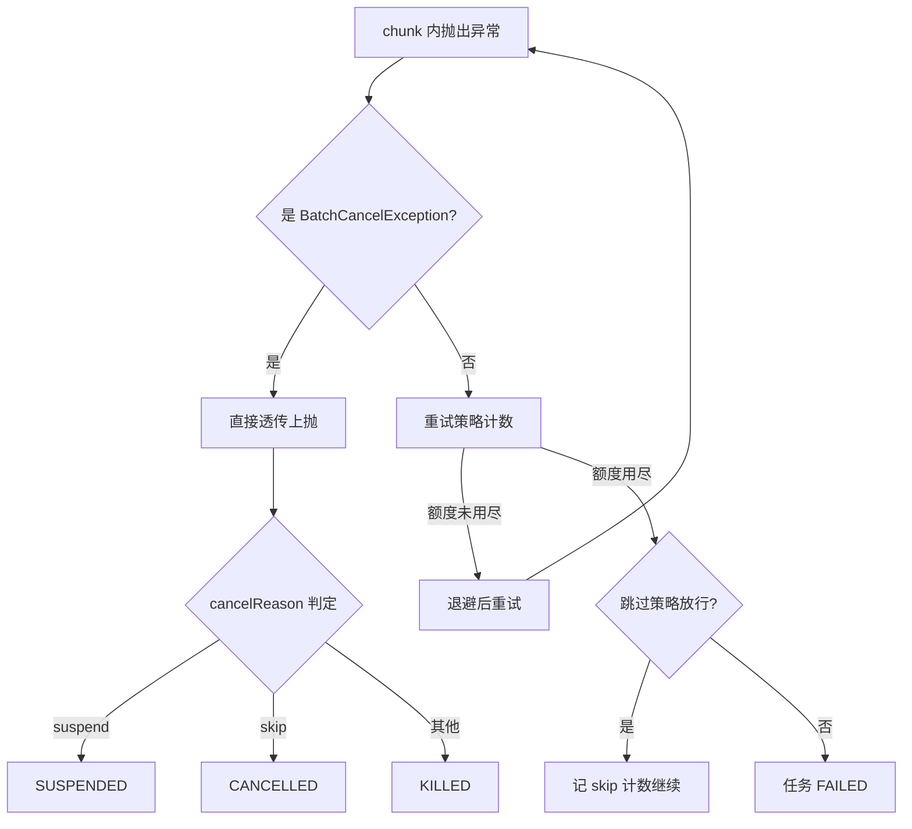

# 错误模型：BatchErrors 与取消链

nop-batch 的错误模型沿两个正交的轴组织：`BatchErrors` 定义的 8 个错误码回答"为什么失败"，`BatchCancelException` 单独刻画"停止执行"这一非失败语义。本页逐码核查抛出点，梳理取消异常穿透重试与跳过逻辑的透传纪律，并给出失败/取消/重试三种语义在任务状态机与记录账本上的不同落点。

> **基准源文件**（相对本页 `deepwiki/nop-batch/topics/`，三级回溯到仓库根，已逐条验证存在）：
>
> - [../../../nop-batch/nop-batch-core/src/main/java/io/nop/batch/core/BatchErrors.java](../../../nop-batch/nop-batch-core/src/main/java/io/nop/batch/core/BatchErrors.java)
> - [../../../nop-batch/nop-batch-core/src/main/java/io/nop/batch/core/exceptions/BatchCancelException.java](../../../nop-batch/nop-batch-core/src/main/java/io/nop/batch/core/exceptions/BatchCancelException.java)
> - [../../../nop-batch/nop-batch-core/src/main/java/io/nop/batch/core/loader/RetryBatchLoader.java](../../../nop-batch/nop-batch-core/src/main/java/io/nop/batch/core/loader/RetryBatchLoader.java)
> - [../../../nop-batch/nop-batch-core/src/main/java/io/nop/batch/core/consumer/AbstractRetryBatchConsumer.java](../../../nop-batch/nop-batch-core/src/main/java/io/nop/batch/core/consumer/AbstractRetryBatchConsumer.java)
> - [../../../nop-batch/nop-batch-core/src/main/java/io/nop/batch/core/consumer/SkipConsumeHelper.java](../../../nop-batch/nop-batch-core/src/main/java/io/nop/batch/core/consumer/SkipConsumeHelper.java)
> - [../../../nop-batch/nop-batch-core/src/main/java/io/nop/batch/core/consumer/RetryConsumeHelper.java](../../../nop-batch/nop-batch-core/src/main/java/io/nop/batch/core/consumer/RetryConsumeHelper.java)
> - [../../../nop-batch/nop-batch-core/src/main/java/io/nop/batch/core/consumer/RetryOneByOneBatchConsumer.java](../../../nop-batch/nop-batch-core/src/main/java/io/nop/batch/core/consumer/RetryOneByOneBatchConsumer.java)
> - [../../../nop-batch/nop-batch-core/src/main/java/io/nop/batch/core/impl/BatchTask.java](../../../nop-batch/nop-batch-core/src/main/java/io/nop/batch/core/impl/BatchTask.java)
> - [../../../nop-batch/nop-batch-dao/src/main/java/io/nop/batch/dao/store/DaoBatchStateStore.java](../../../nop-batch/nop-batch-dao/src/main/java/io/nop/batch/dao/store/DaoBatchStateStore.java)
> - [../../../nop-batch/nop-batch-dao/src/main/java/io/nop/batch/dao/history/DaoBatchRecordHistoryStore.java](../../../nop-batch/nop-batch-dao/src/main/java/io/nop/batch/dao/history/DaoBatchRecordHistoryStore.java)
> - [../../../nop-batch/nop-batch-dao/src/main/java/io/nop/batch/dao/entity/NopBatchRecordResult.java](../../../nop-batch/nop-batch-dao/src/main/java/io/nop/batch/dao/entity/NopBatchRecordResult.java)

**相关页面**：[断点续跑与记录](../flows/checkpoint-recovery.md)（DAO 实体与续跑机制）、[核心引擎](../modules/batch-core.md)（BatchTaskBuilder 装配链）、[chunk 管线](../flows/batch-pipeline.md)（异常传播所在的执行结构）。

## BatchErrors：8 个错误码全表

`BatchErrors` 以 `@Locale("zh-CN")` 接口常量形式定义 8 个 `ErrorCode`（`nop-batch/nop-batch-core/src/main/java/io/nop/batch/core/BatchErrors.java:15-52`）。逐码 grep 全仓库（排除测试与定义处），8 个码全部有生产代码抛出点，**无预留未用码**：

| 错误码 | 含义（定义文案摘要） | 抛出点（生产代码） | 语义归类 |
|---|---|---|---|
| `ERR_BATCH_PERSIST_VAR_CONVERT_TYPE_FAIL` | 持久化状态变量类型转换失败 | `common/AbstractBatchHandler.java:48,53,58`（getPersistLong/Int/Boolean 三处） | 失败（状态恢复） |
| `ERR_BATCH_CANCEL_PROCESS` | 批处理执行被取消 | `impl/BatchTask.java:219`；`consumer/BatchProcessorConsumer.java:79,82` | 取消 |
| `ERR_BATCH_CANCEL_LOAD` | 批处理读取被取消 | `loader/BlockingSourceBatchLoader.java:66,73` | 取消 |
| `ERR_BATCH_WRITE_FILE_FAIL` | 输出到文件失败 | `consumer/ResourceRecordConsumerProvider.java:188`（装入 `BatchCancelException` 信封） | 失败码 + 取消信封 |
| `ERR_BATCH_TOO_MANY_PROCESSING_ITEMS` | 处理中记录过多，疑似内存泄露 | `loader/ResourceRecordLoaderProvider.java:312,342` | 失败（背压保护） |
| `ERR_BATCH_PROCESSING_ITEMS_NOT_EMPTY` | 任务完成时仍有未处理完记录 | `loader/ResourceRecordLoaderProvider.java:223`（onBeforeComplete 回调） | 失败（一致性校验） |
| `ERR_BATCH_OUTPUT_FILE_EXISTS_ON_RECOVERY` | 续跑时输出文件已存在且非空 | `consumer/ResourceRecordConsumerProvider.java:165` | 失败（续跑安全检查） |
| `ERR_BATCH_RATE_LIMIT_ACQUIRE_TIMEOUT` | 限流超时未获足够许可 | `consumer/RateLimitConsumer.java:39`（`NopTimeoutException`） | 失败（限流保护） |

三个值得注意的设计点：

1. **失败码可以装入取消信封**。`ResourceRecordConsumerProvider` 在 `cancelTaskWhenWriteError` 开启时，把文件写失败的 `ERR_BATCH_WRITE_FILE_FAIL` 包进 `BatchCancelException` 抛出，以取消整个任务（`ResourceRecordConsumerProvider.java:44,186-189`）。错误码与异常类型是两个正交维度：任务级 `resultCode` 仍记录 `nop.err.batch.write-file-fail`，而任务状态按取消语义判定（见下节）。
2. **保护性失败码都对应一条显式的反静默注释**。限流器拿不到许可"不能静默放行，否则下游保护机制会 fail-open"（`RateLimitConsumer.java:38`）；续跑截断输出文件前"把静默数据丢失转化为可定位的失败"（`ResourceRecordConsumerProvider.java:155-159`）；背压超限"等待后仍超过，则不读取，直接抛错"（`ResourceRecordLoaderProvider.java:310`）。
3. **参数化统一走 `.param(ARG_*)`**。8 个码中 6 个携带 ARG 常量（varName/resourcePath/itemCount/processingItems/readCount），抛出点一律以 `NopException.param()` 填充，供错误消息模板插值。

> Sources: [nop-batch/nop-batch-core/src/main/java/io/nop/batch/core/BatchErrors.java:15-52](https://gitee.com/canonical-entropy/nop-entropy/blob/ea3e35e6d0/nop-batch/nop-batch-core/src/main/java/io/nop/batch/core/BatchErrors.java#L15-L52)；[nop-batch/nop-batch-core/src/main/java/io/nop/batch/core/common/AbstractBatchHandler.java:46-58](https://gitee.com/canonical-entropy/nop-entropy/blob/ea3e35e6d0/nop-batch/nop-batch-core/src/main/java/io/nop/batch/core/common/AbstractBatchHandler.java#L46-L58)；[nop-batch/nop-batch-core/src/main/java/io/nop/batch/core/consumer/ResourceRecordConsumerProvider.java:155-193](https://gitee.com/canonical-entropy/nop-entropy/blob/ea3e35e6d0/nop-batch/nop-batch-core/src/main/java/io/nop/batch/core/consumer/ResourceRecordConsumerProvider.java#L155-L193)；[nop-batch/nop-batch-core/src/main/java/io/nop/batch/core/loader/ResourceRecordLoaderProvider.java:216-228,309-345](https://gitee.com/canonical-entropy/nop-entropy/blob/ea3e35e6d0/nop-batch/nop-batch-core/src/main/java/io/nop/batch/core/loader/ResourceRecordLoaderProvider.java#L216-L228)；[nop-batch/nop-batch-core/src/main/java/io/nop/batch/core/consumer/RateLimitConsumer.java:32-42](https://gitee.com/canonical-entropy/nop-entropy/blob/ea3e35e6d0/nop-batch/nop-batch-core/src/main/java/io/nop/batch/core/consumer/RateLimitConsumer.java#L32-L42)

## BatchCancelException：取消链的透传纪律

`BatchCancelException` 继承 `NopException`，javadoc 直接声明契约："Retry和Skip逻辑识别此异常，会自动中断处理"（`nop-batch/nop-batch-core/src/main/java/io/nop/batch/core/exceptions/BatchCancelException.java:13-16`）。这条契约落在四处 `catch (BatchCancelException e) { throw e; }` 透传上，它们必须先于通用的 `catch (Exception/Throwable)` 重试/跳过分支：

1. **读侧重试不吞取消**：`RetryBatchLoader.load` 首次捕获即透传，注释写明"避免取消响应被重试退避延迟"；重试循环 `retryLoad` 内层同样透传（`nop-batch/nop-batch-core/src/main/java/io/nop/batch/core/loader/RetryBatchLoader.java:40-45,63-64`）。
2. **消费重试不吞取消**：`AbstractRetryBatchConsumer.consume` 在进入失败日志、已完成项剔除、快照恢复等一切重试逻辑之前先透传（`nop-batch/nop-batch-core/src/main/java/io/nop/batch/core/consumer/AbstractRetryBatchConsumer.java:39-40`）。
3. **跳过策略不吞取消**：`SkipConsumeHelper.consumeWithSkipPolicy` 先于 `shouldSkip` 判定透传——取消永远不算"可跳过的错误"（`nop-batch/nop-batch-core/src/main/java/io/nop/batch/core/consumer/SkipConsumeHelper.java:31-32`）。
4. **重试循环体不吞取消**：`RetryConsumeHelper.retryConsume` 在 `fireChunkTryEnd` 之后透传，保证 chunk 生命周期回调仍然触发（`nop-batch/nop-batch-core/src/main/java/io/nop/batch/core/consumer/RetryConsumeHelper.java:51-53`）。

取消的**产生点**同样收敛在三处：chunk 循环每轮开始前检查任务级 `isCancelled()`（`BatchTask.java:217-219`）；`BatchProcessorConsumer` 每处理完一条记录检查任务级与 chunk 级取消标志（`BatchProcessorConsumer.java:78-82`）；阻塞式读源在每轮 poll 前检查，且区分原因——`stop` 原因静默返回空列表优雅退出，其他原因抛 `ERR_BATCH_CANCEL_LOAD`（`BlockingSourceBatchLoader.java:62-74`）。

取消链的终点是状态机映射：`DaoBatchStateStore.getTaskStatus` 按 `BatchCancelException` + cancelReason 三分——`suspend` → SUSPENDED(20)、`skip` → CANCELLED(50)、其余 → KILLED(60)；非取消异常 → FAILED(40)；成功 → COMPLETED(30)（`nop-batch/nop-batch-dao/src/main/java/io/nop/batch/dao/store/DaoBatchStateStore.java:180-197`，状态值见 `_NopBatchDaoConstants.java:9-39`）。同时任务表写入 resultCode/resultStatus/resultMsg 三元组（`DaoBatchStateStore.java:164-168`），取消原因常量定义于 `nop-kernel/nop-api-core/src/main/java/io/nop/api/core/util/ICancellable.java:11-15`。

失败与取消在多线程下还有一个顺序纪律：某个 chunk 失败后先 `future.completeExceptionally(e)` 再通知兄弟线程取消，"确保 allOf 报告的是原始异常而不是兄弟线程随后抛出的 BatchCancelException"（`BatchTask.java:227-234`）——即**原始失败在任务状态判定上优先于连带的取消**。任务完成回调侧则统一解包 `CompletionException`，便于 stateStore 按异常类型判定状态（`BatchTask.java:166-169`）。

> Sources: [nop-batch/nop-batch-core/src/main/java/io/nop/batch/core/exceptions/BatchCancelException.java:13-16](https://gitee.com/canonical-entropy/nop-entropy/blob/ea3e35e6d0/nop-batch/nop-batch-core/src/main/java/io/nop/batch/core/exceptions/BatchCancelException.java#L13-L16)；[nop-batch/nop-batch-core/src/main/java/io/nop/batch/core/loader/RetryBatchLoader.java:38-70](https://gitee.com/canonical-entropy/nop-entropy/blob/ea3e35e6d0/nop-batch/nop-batch-core/src/main/java/io/nop/batch/core/loader/RetryBatchLoader.java#L38-L70)；[nop-batch/nop-batch-core/src/main/java/io/nop/batch/core/consumer/AbstractRetryBatchConsumer.java:37-41](https://gitee.com/canonical-entropy/nop-entropy/blob/ea3e35e6d0/nop-batch/nop-batch-core/src/main/java/io/nop/batch/core/consumer/AbstractRetryBatchConsumer.java#L37-L41)；[nop-batch/nop-batch-core/src/main/java/io/nop/batch/core/consumer/SkipConsumeHelper.java:28-33](https://gitee.com/canonical-entropy/nop-entropy/blob/ea3e35e6d0/nop-batch/nop-batch-core/src/main/java/io/nop/batch/core/consumer/SkipConsumeHelper.java#L28-L33)；[nop-batch/nop-batch-core/src/main/java/io/nop/batch/core/consumer/RetryConsumeHelper.java:51-53](https://gitee.com/canonical-entropy/nop-entropy/blob/ea3e35e6d0/nop-batch/nop-batch-core/src/main/java/io/nop/batch/core/consumer/RetryConsumeHelper.java#L51-L53)；[nop-batch/nop-batch-core/src/main/java/io/nop/batch/core/impl/BatchTask.java:166-169,217-234](https://gitee.com/canonical-entropy/nop-entropy/blob/ea3e35e6d0/nop-batch/nop-batch-core/src/main/java/io/nop/batch/core/impl/BatchTask.java#L166-L169)；[nop-batch/nop-batch-core/src/main/java/io/nop/batch/core/loader/BlockingSourceBatchLoader.java:60-74](https://gitee.com/canonical-entropy/nop-entropy/blob/ea3e35e6d0/nop-batch/nop-batch-core/src/main/java/io/nop/batch/core/loader/BlockingSourceBatchLoader.java#L60-L74)；[nop-batch/nop-batch-dao/src/main/java/io/nop/batch/dao/store/DaoBatchStateStore.java:157-197](https://gitee.com/canonical-entropy/nop-entropy/blob/ea3e35e6d0/nop-batch/nop-batch-dao/src/main/java/io/nop/batch/dao/store/DaoBatchStateStore.java#L157-L197)

## 失败、取消、重试：三种语义的区分

三者的分叉点只有一个：异常是否 `instanceof BatchCancelException`。重试不是终态，只是失败语义内的一个处理阶段。

| 维度 | 失败 | 取消 | 重试 |
|---|---|---|---|
| 载体 | `NopException`/业务异常（非取消类） | `BatchCancelException`（8 码中占 2 个） | 非独立异常，失败的处理阶段 |
| 典型来源 | 处理逻辑出错、写文件、限流超时、一致性校验 | 外部 cancel 调用、写文件失败强制取消任务 | retryPolicy 配置 + 退避延迟 |
| 重试策略介入 | 是（`RetryConsumeHelper.checkRetry`：delay<0 即放弃，`RetryConsumeHelper.java:19-33`） | **否**（四处透传，见上节） | 介入本身即重试 |
| 跳过策略介入 | 可跳过（`SkipConsumeHelper.java:34-47`） | **否** | oneByOne 逐条重试时逐条可跳（`RetryOneByOneBatchConsumer.java:24-33`） |
| 任务终态 | FAILED(40)；或 skip 放行后继续直至 COMPLETED | SUSPENDED(20)/CANCELLED(50)/KILLED(60) | 无终态；重试耗尽后回落到失败 |
| 最终异常形态 | 首次异常被保留 | 原样上抛 | 重试最终失败抛最后一次异常 e2，首次异常 e 挂在 suppressed 上（`AbstractRetryBatchConsumer.java:68-72`） |

`retryOneByOne` 的逐条重试经 `SkipConsumeHelper` 包装，使"批内一条失败"在逐条阶段可以按条跳过；但取消异常在该包装内同样先透传，不会被逐条循环稀释（`RetryOneByOneBatchConsumer.java:27-32`）。

> Sources: [nop-batch/nop-batch-core/src/main/java/io/nop/batch/core/consumer/RetryConsumeHelper.java:19-53](https://gitee.com/canonical-entropy/nop-entropy/blob/ea3e35e6d0/nop-batch/nop-batch-core/src/main/java/io/nop/batch/core/consumer/RetryConsumeHelper.java#L19-L53)；[nop-batch/nop-batch-core/src/main/java/io/nop/batch/core/consumer/SkipConsumeHelper.java:34-47](https://gitee.com/canonical-entropy/nop-entropy/blob/ea3e35e6d0/nop-batch/nop-batch-core/src/main/java/io/nop/batch/core/consumer/SkipConsumeHelper.java#L34-L47)；[nop-batch/nop-batch-core/src/main/java/io/nop/batch/core/consumer/RetryOneByOneBatchConsumer.java:24-33](https://gitee.com/canonical-entropy/nop-entropy/blob/ea3e35e6d0/nop-batch/nop-batch-core/src/main/java/io/nop/batch/core/consumer/RetryOneByOneBatchConsumer.java#L24-L33)；[nop-batch/nop-batch-core/src/main/java/io/nop/batch/core/consumer/AbstractRetryBatchConsumer.java:63-73](https://gitee.com/canonical-entropy/nop-entropy/blob/ea3e35e6d0/nop-batch/nop-batch-core/src/main/java/io/nop/batch/core/consumer/AbstractRetryBatchConsumer.java#L63-L73)；[nop-kernel/nop-api-core/src/main/java/io/nop/api/core/util/ICancellable.java:11-15](https://gitee.com/canonical-entropy/nop-entropy/blob/ea3e35e6d0/nop-kernel/nop-api-core/src/main/java/io/nop/api/core/util/ICancellable.java#L11-L15)

## 记录侧落库：resultStatus 幂等账本

记录级结果落在 `NopBatchRecordResult` 实体（表 nop_batch_record_result，复合主键 batchTaskId+recordKey）。Java 实体是空壳，字段全部在生成基类：resultStatus 为 `Integer`，PROP_ID=3（`nop-batch/nop-batch-dao/src/main/java/io/nop/batch/dao/entity/NopBatchRecordResult.java:17`；`nop-batch/nop-batch-dao/src/main/java/io/nop/batch/dao/entity/_gen/_NopBatchRecordResult.java:32-34,153-154`，生成文件此处仅作证据引用）。

账本是**单值幂等**的，只有两个事实：

- **写侧只记成功**。`saveProcessed` 在 `exception != null` 时直接返回——"仅在处理成功时写入历史记录（resultStatus=0）。失败时不写入，重启后这些记录会被重新处理"（`nop-batch/nop-batch-dao/src/main/java/io/nop/batch/dao/history/DaoBatchRecordHistoryStore.java:77-84`，写入循环 91-102 行固定 `setResultStatus(0)`）。失败在记录侧的表达是**行的缺席**，不是非零状态值；全仓库没有写非零 resultStatus 的代码路径。
- **读侧只认 0**。`filterProcessed` 查询 taskId + recordKey + `resultStatus=0` 的行并从本批剔除，其余记录重新进入处理（`DaoBatchRecordHistoryStore.java:34-55`）。

写入与业务消费同事务是账本可靠性的关键：检测到 historyStore 时，`BatchTaskBuilder` 把 consume 事务scope提升为 process 级——`InvokerBatchConsumer` 包在 `WithHistoryBatchConsumer` 外层，saveProcessed 在事务提交前执行，"成功提交后历史一定可见"（`DaoBatchRecordHistoryStore.java:79-82` 的实现注释；装配顺序证据见[核心引擎](../modules/batch-core.md)的 consumer 责任链）。因此不存在"业务已生效但账本没记"的中间态，重启重放由账本幂等去重。

不要混淆两级 resultStatus：任务表的 resultStatus 存 `ErrorBean.getStatus()`（失败时由 `ErrorMessageManager` 构建，`DaoBatchStateStore.java:164-168`），语义是错误严重级别；记录表的 resultStatus 只取 0/缺席，语义是"该 recordKey 在本任务内是否已成功"。断点续跑如何消费这本账本，见[断点续跑与记录](../flows/checkpoint-recovery.md)。

> Sources: [nop-batch/nop-batch-dao/src/main/java/io/nop/batch/dao/entity/NopBatchRecordResult.java:17](https://gitee.com/canonical-entropy/nop-entropy/blob/ea3e35e6d0/nop-batch/nop-batch-dao/src/main/java/io/nop/batch/dao/entity/NopBatchRecordResult.java#L17)；[nop-batch/nop-batch-dao/src/main/java/io/nop/batch/dao/entity/_gen/_NopBatchRecordResult.java:32-34](https://gitee.com/canonical-entropy/nop-entropy/blob/ea3e35e6d0/nop-batch/nop-batch-dao/src/main/java/io/nop/batch/dao/entity/_gen/_NopBatchRecordResult.java#L32-L34)；[nop-batch/nop-batch-dao/src/main/java/io/nop/batch/dao/history/DaoBatchRecordHistoryStore.java:34-103](https://gitee.com/canonical-entropy/nop-entropy/blob/ea3e35e6d0/nop-batch/nop-batch-dao/src/main/java/io/nop/batch/dao/history/DaoBatchRecordHistoryStore.java#L34-L103)；[nop-batch/nop-batch-dao/src/main/java/io/nop/batch/dao/store/DaoBatchStateStore.java:164-168](https://gitee.com/canonical-entropy/nop-entropy/blob/ea3e35e6d0/nop-batch/nop-batch-dao/src/main/java/io/nop/batch/dao/store/DaoBatchStateStore.java#L164-L168)

## Sources

- nop-batch/nop-batch-core/src/main/java/io/nop/batch/core/BatchErrors.java （）
- nop-batch/nop-batch-core/src/main/java/io/nop/batch/core/exceptions/BatchCancelException.java （）
- nop-batch/nop-batch-core/src/main/java/io/nop/batch/core/loader/RetryBatchLoader.java （）
- nop-batch/nop-batch-core/src/main/java/io/nop/batch/core/loader/BlockingSourceBatchLoader.java （）
- nop-batch/nop-batch-core/src/main/java/io/nop/batch/core/loader/ResourceRecordLoaderProvider.java （）
- nop-batch/nop-batch-core/src/main/java/io/nop/batch/core/consumer/AbstractRetryBatchConsumer.java （）
- nop-batch/nop-batch-core/src/main/java/io/nop/batch/core/consumer/SkipConsumeHelper.java （）
- nop-batch/nop-batch-core/src/main/java/io/nop/batch/core/consumer/RetryConsumeHelper.java （）
- nop-batch/nop-batch-core/src/main/java/io/nop/batch/core/consumer/RetryOneByOneBatchConsumer.java （）
- nop-batch/nop-batch-core/src/main/java/io/nop/batch/core/consumer/BatchProcessorConsumer.java （）
- nop-batch/nop-batch-core/src/main/java/io/nop/batch/core/consumer/ResourceRecordConsumerProvider.java （）
- nop-batch/nop-batch-core/src/main/java/io/nop/batch/core/consumer/RateLimitConsumer.java （）
- nop-batch/nop-batch-core/src/main/java/io/nop/batch/core/common/AbstractBatchHandler.java （）
- nop-batch/nop-batch-core/src/main/java/io/nop/batch/core/impl/BatchTask.java （）
- nop-batch/nop-batch-dao/src/main/java/io/nop/batch/dao/store/DaoBatchStateStore.java （）
- nop-batch/nop-batch-dao/src/main/java/io/nop/batch/dao/history/DaoBatchRecordHistoryStore.java （）
- nop-batch/nop-batch-dao/src/main/java/io/nop/batch/dao/entity/NopBatchRecordResult.java （）
- nop-batch/nop-batch-dao/src/main/java/io/nop/batch/dao/_NopBatchDaoConstants.java （）
- nop-kernel/nop-api-core/src/main/java/io/nop/api/core/util/ICancellable.java （）

---

## On this page

- BatchErrors：8 个错误码全表
- BatchCancelException：取消链的透传纪律
- 失败、取消、重试：三种语义的区分
- 记录侧落库：resultStatus 幂等账本
