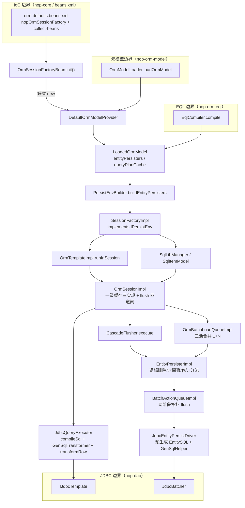
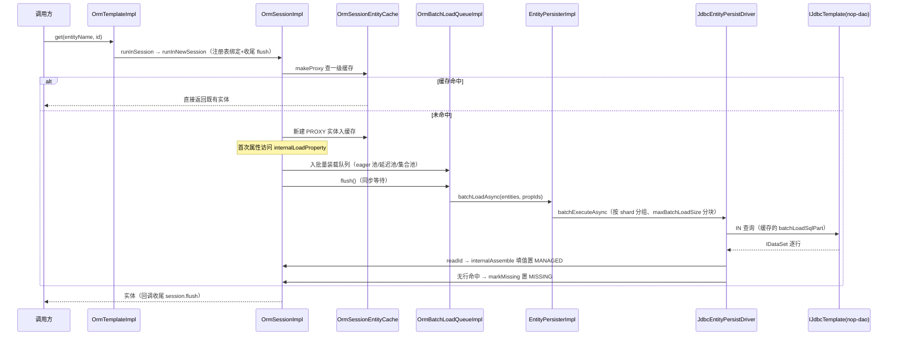

# 架构与数据流

> 本页依据的源文件（相对路径自本页上行两级至仓库根，写入前已逐条 test -f 验证）：
>
> - ../../nop-persistence/nop-orm/pom.xml
> - ../../nop-persistence/nop-orm/src/main/resources/_vfs/nop/orm/beans/orm-defaults.beans.xml
> - ../../nop-persistence/nop-orm/src/main/java/io/nop/orm/factory/SessionFactoryImpl.java
> - ../../nop-persistence/nop-orm/src/main/java/io/nop/orm/session/OrmSessionImpl.java
> - ../../nop-persistence/nop-orm/src/main/java/io/nop/orm/impl/OrmTemplateImpl.java
> - ../../nop-persistence/nop-orm/src/main/java/io/nop/orm/loader/JdbcQueryExecutor.java
> - ../../nop-persistence/nop-orm/src/main/java/io/nop/orm/persister/IPersistEnv.java
> - ../../nop-persistence/nop-orm/src/main/java/io/nop/orm/factory/DefaultOrmModelProvider.java

本页是 nop-orm 的父级架构页：以 pom 依赖与 beans 装配证明四个外部边界，给出引擎内部分层职责表与符号级组件图，再沿一次加载、一次保存两条端到端路径串起全部接缝。机制细节由子页承接，本页只做结构总装与互链。

## 四个边界：引擎消费的四条支撑线

nop-orm 的 Maven 依赖只有四个非 test 依赖：`nop-dao`、`nop-orm-eql`、`nop-orm-model`、`nop-core`（nop-persistence/nop-orm/pom.xml:16-34）。这四条依赖不是偶然的打包结果，而是引擎刻意外移的四类能力：元模型由 nop-orm-model 供给，EQL 编译由 nop-orm-eql 完成，JDBC 执行由 nop-dao 承接，IoC 与反射由 nop-core 依赖族提供。引擎自身不做模型解析、不解析 EQL 文本、不持有 Connection、不做注解扫描——`SessionFactoryImpl` 的 import 区就是这张接缝清单的直接证据：`io.nop.dao.jdbc.IJdbcTemplate`、`io.nop.orm.model.IOrmModel`、`io.nop.orm.eql.ICompiledSql` 三组类型并列出现（nop-persistence/nop-orm/src/main/java/io/nop/orm/factory/SessionFactoryImpl.java:19-45）。

| 边界 | 对方模块 | 本模块接缝类型 | 本模块接缝类/文件 |
|---|---|---|---|
| 元模型 | nop-orm-model | 模型装载调用 + `IEntityModel`/`IOrmModel` 只读消费 | `IOrmModelProvider`、`DefaultOrmModelProvider`、`LoadedOrmModel`、`PersistEnvBuilder` |
| EQL | nop-orm-eql | 调 `EqlCompiler.compile` 一次、长期持有编译产物 `ICompiledSql` | `SessionFactoryImpl.compileSql`、`LoadedOrmModel.compileSql`、`QueryPlanCacheKey` |
| JDBC | nop-dao | 语句执行、方言、事务、批执行全部委托 | `IPersistEnv.jdbc()/txn()`、`JdbcQueryExecutor`、`JdbcEntityPersistDriver`、`GenSqlTransformer` |
| IoC | nop-core（含 nop-api-core 的 `IBeanProvider` 契约） | 单文件 beans.xml 缺省装配 + `IBeanProvider` 按名取 bean | orm-defaults.beans.xml、`OrmSessionFactoryBean`、`SessionFactoryImpl.getBean` |

元模型边界只有一个进入方向：`DefaultOrmModelProvider.clearCache` 调 `new OrmModelLoader().loadOrmModel(false)` 取回 `OrmModel`，随后立刻包成引擎自己的 `LoadedOrmModel`（nop-persistence/nop-orm/src/main/java/io/nop/orm/factory/DefaultOrmModelProvider.java:44-49）。`OrmModelLoader` 与 `IEntityModel` 都住在 nop-orm-model（nop-persistence/nop-orm-model/src/main/java/io/nop/orm/model/loader/OrmModelLoader.java:30-48、nop-persistence/nop-orm-model/src/main/java/io/nop/orm/model/IEntityModel.java:25），本模块只经 `getLoadedOrmModel()` 间接访问（SessionFactoryImpl.java:143-146）。EQL 边界同理是单点调用：`LoadedOrmModel.compileSql` 以五元组 `QueryPlanCacheKey` 查缓存，未命中才 `new EqlCompiler().compile(name, sqlText, ctx)`（nop-persistence/nop-orm/src/main/java/io/nop/orm/factory/LoadedOrmModel.java:88-123；编译器入口在 nop-persistence/nop-orm-eql/src/main/java/io/nop/orm/eql/compile/EqlCompiler.java:40-46；五元组键定义在 nop-persistence/nop-orm/src/main/java/io/nop/orm/QueryPlanCacheKey.java:16-36）。JDBC 边界藏在 `IPersistEnv` 的两个方法后面：`jdbc()` 与 `txn()` 直接转发给注入的 `IJdbcTemplate`（nop-persistence/nop-orm/src/main/java/io/nop/orm/persister/IPersistEnv.java:69-71；SessionFactoryImpl.java:425-433），方言按 querySpace 从 `IDialectProvider` 解析，缺省 provider 就是 jdbcTemplate 本身（SessionFactoryImpl.java:351-354，OrmSessionFactoryBean.init 中的缺省装配见 nop-persistence/nop-orm/src/main/java/io/nop/orm/factory/OrmSessionFactoryBean.java:95-98）。IoC 边界是唯一双向的一条：容器把 bean 注入引擎（`ioc:collect-beans` 收集拦截器与监听器，orm-defaults.beans.xml:44-50），引擎也反向按名取 bean——替换持久化驱动时用 `getBean("entityPersister_" + driverName, true)` 且强制 prototype scope（SessionFactoryImpl.java:379-384、445-451）。

> Sources: [nop-persistence/nop-orm/pom.xml:16-34](https://gitee.com/canonical-entropy/nop-entropy/blob/f2ecee739b/nop-persistence/nop-orm/pom.xml#L16-L34)、[nop-persistence/nop-orm/src/main/java/io/nop/orm/factory/SessionFactoryImpl.java:19-45](https://gitee.com/canonical-entropy/nop-entropy/blob/f2ecee739b/nop-persistence/nop-orm/src/main/java/io/nop/orm/factory/SessionFactoryImpl.java#L19-L45)、[nop-persistence/nop-orm/src/main/java/io/nop/orm/factory/LoadedOrmModel.java:88-123](https://gitee.com/canonical-entropy/nop-entropy/blob/f2ecee739b/nop-persistence/nop-orm/src/main/java/io/nop/orm/factory/LoadedOrmModel.java#L88-L123)、[nop-persistence/nop-orm/src/main/java/io/nop/orm/persister/IPersistEnv.java:69-71](https://gitee.com/canonical-entropy/nop-entropy/blob/f2ecee739b/nop-persistence/nop-orm/src/main/java/io/nop/orm/persister/IPersistEnv.java#L69-L71)、[nop-persistence/nop-orm/src/main/resources/_vfs/nop/orm/beans/orm-defaults.beans.xml:44-50](https://gitee.com/canonical-entropy/nop-entropy/blob/f2ecee739b/nop-persistence/nop-orm/src/main/resources/_vfs/nop/orm/beans/orm-defaults.beans.xml#L44-L50)

## 引擎内部分层与符号级组件图

四个边界围出来的内部空间分五层。分层判据是"谁拥有谁"：入口层绑定会话，会话层拥有缓存与 flusher，编排层拥有驱动与全局缓存，驱动层拥有预生成 SQL，模型供给层在工厂构建期一次性生成前三层的所有单实例对象。

| 层 | 代表类型 | 拥有的状态 | 对下层的调用 |
|---|---|---|---|
| 入口层 | `OrmTemplateImpl`、`SqlLibManager`、`SqlItemModel` | 线程绑定的 session 注册表（`OrmSessionRegistry`） | `runInSession` 打开/复用 `OrmSessionImpl`（OrmTemplateImpl.java:204-231） |
| 会话层 | `OrmSessionImpl`、`OrmSessionEntityCache` 三实现、`CascadeFlusher`、`SessionBatchActionQueue`、`OrmBatchLoadQueueImpl` | 一级缓存、dirty 位、批量动作队列、批量装载队列 | flush 时消费脏实体并调 persister（OrmSessionImpl.java:176-224） |
| 持久化编排层 | `EntityPersisterImpl`、`CollectionPersisterImpl`、`BatchActionQueueImpl` | 每实体一个 persister、全局缓存开关、shard 选择 | 逻辑删除/时间戳/修订分流后生成动作入队，flush 时派发驱动（EntityPersisterImpl.java:288-337） |
| 驱动/SQL 层 | `JdbcEntityPersistDriver`、`GenSqlHelper`、`JdbcQueryExecutor`、`GenSqlTransformer` | 预生成 `EntitySQL`（insert/delete/load/lock/batchLoadSqlPart） | 经 `IPersistEnv.jdbc()` 交给 nop-dao 的 `IJdbcTemplate`/`JdbcBatcher`（JdbcEntityPersistDriver.java:80-97） |
| 模型供给层 | `DefaultOrmModelProvider`、`LoadedOrmModel`、`PersistEnvBuilder`、`SqlExprMetaCache` | persister 表、collectionPersister 表、queryPlanCache | 构建期调 `OrmModelLoader`（元模型边界）与 `EqlCompiler`（EQL 边界）（LoadedOrmModel.java:38-53） |

`SessionFactoryImpl` 是全部接缝的物理汇聚点：一个类实现 `IPersistEnv`，同时暴露会话创建（`openSession` 直接 `new OrmSessionImpl(stateless, this, getInterceptors())`，SessionFactoryImpl.java:322-325）、查询执行器路由（按 querySpace 查 `queryExecutors` 表、回落 `defaultQueryExecutor`，SessionFactoryImpl.java:370-377）、编译委托（三个 `compileSql` 重载全部转发 `LoadedOrmModel`，SessionFactoryImpl.java:332-349）、驱动创建与实体类加载（SessionFactoryImpl.java:379-384、411-423）。会话构造函数则完成"引擎与供给层"的对接：`env.getLoadedOrmModel()` 计数加一，并按模型是否含租户实体在三种一级缓存实现里三选一（OrmSessionImpl.java:125-135）。

> Sources: [nop-persistence/nop-orm/src/main/java/io/nop/orm/factory/SessionFactoryImpl.java:322-377](https://gitee.com/canonical-entropy/nop-entropy/blob/f2ecee739b/nop-persistence/nop-orm/src/main/java/io/nop/orm/factory/SessionFactoryImpl.java#L322-L377)、[nop-persistence/nop-orm/src/main/java/io/nop/orm/session/OrmSessionImpl.java:125-135](https://gitee.com/canonical-entropy/nop-entropy/blob/f2ecee739b/nop-persistence/nop-orm/src/main/java/io/nop/orm/session/OrmSessionImpl.java#L125-L135)、[nop-persistence/nop-orm/src/main/java/io/nop/orm/factory/LoadedOrmModel.java:38-53](https://gitee.com/canonical-entropy/nop-entropy/blob/f2ecee739b/nop-persistence/nop-orm/src/main/java/io/nop/orm/factory/LoadedOrmModel.java#L38-L53)、[nop-persistence/nop-orm/src/main/java/io/nop/orm/impl/OrmTemplateImpl.java:204-231](https://gitee.com/canonical-entropy/nop-entropy/blob/f2ecee739b/nop-persistence/nop-orm/src/main/java/io/nop/orm/impl/OrmTemplateImpl.java#L204-L231)

## 一次加载：按 id 取实体的端到端时序

按 id 装载是引擎内最长的一条只读路径，它串起入口层、会话层、编排层与 JDBC 边界，且中途有两次"延迟"设计：先返回 PROXY 代理，再靠批量装载队列把 1+N 合并成 IN 查询。

`runInSession` 先查 `OrmSessionRegistry` 里线程绑定的 session，stateless 标志一致则复用，否则 `runInNewSession` 打开新 session 并在 finally 中恢复旧 session、关闭新 session（OrmTemplateImpl.java:204-231）。代理创建与缓存登记集中在 `makeProxy`（OrmSessionImpl.java:781-822），懒属性触发在 `internalLoadProperty`（OrmSessionImpl.java:840-873），批量合并队列惰性创建于 `getBatchLoadQueue`（OrmSessionImpl.java:269-274），批量执行委托 `persister.batchLoadAsync`（OrmSessionImpl.java:880-887）。EQL 查询走另一条入口：`OrmSessionImpl.executeQuery` 按 querySpace 选 `IQueryExecutor` 后进入 `JdbcQueryExecutor`，在那里完成编译缓存查询、daoListener 回调、`GenSqlTransformer` 重写与 `TransformedDataSet` 惰性行映射（OrmSessionImpl.java:1425-1430、JdbcQueryExecutor.java:75-93、147-171）。这条管线的六阶段拆解见 [flows/query-pipeline.md](flows/query-pipeline.md)；PROXY→MANAGED 的状态语义见 [flows/entity-lifecycle.md](flows/entity-lifecycle.md)。

> Sources: [nop-persistence/nop-orm/src/main/java/io/nop/orm/impl/OrmTemplateImpl.java:204-231](https://gitee.com/canonical-entropy/nop-entropy/blob/f2ecee739b/nop-persistence/nop-orm/src/main/java/io/nop/orm/impl/OrmTemplateImpl.java#L204-L231)、[nop-persistence/nop-orm/src/main/java/io/nop/orm/session/OrmSessionImpl.java:781-887](https://gitee.com/canonical-entropy/nop-entropy/blob/f2ecee739b/nop-persistence/nop-orm/src/main/java/io/nop/orm/session/OrmSessionImpl.java#L781-L887)、[nop-persistence/nop-orm/src/main/java/io/nop/orm/session/OrmSessionImpl.java:1425-1430](https://gitee.com/canonical-entropy/nop-entropy/blob/f2ecee739b/nop-persistence/nop-orm/src/main/java/io/nop/orm/session/OrmSessionImpl.java#L1425-L1430)、[nop-persistence/nop-orm/src/main/java/io/nop/orm/loader/JdbcQueryExecutor.java:75-171](https://gitee.com/canonical-entropy/nop-entropy/blob/f2ecee739b/nop-persistence/nop-orm/src/main/java/io/nop/orm/loader/JdbcQueryExecutor.java#L75-L171)

## 一次保存：从 internalSave 到 JDBC 批执行

保存路径与装载共享入口层，分叉点在会话层。`save()` 调 `internalSave`：非 TRANSIENT 抛 `ERR_ORM_SAVE_ENTITY_NOT_TRANSIENT`，随后置 SAVING、`initEntityId` 生成主键、`cache.add` 入一级缓存（OrmSessionImpl.java:906-948）；stateless 会话此刻立即 `flushImmediately`，有状态会话把落库推迟到 `flush()`（OrmSessionImpl.java:481-491）。`flush` 过四道闸——重入、非 dirty、只读，以及前置的 context/valid 校验——然后 `interceptPreFlush`、执行 `CascadeFlusher`、清 dirty、`batchActionQueue.flush()`、`interceptPostFlush`（OrmSessionImpl.java:176-224）。`CascadeFlusher` 对每个脏实体按状态分流到 `flushSave/flushUpdate/flushDelete`，三者先过拦截器 VETO 检查再调 persister（OrmSessionImpl.java:1001-1059）。

persister 层把状态翻译成动作：`EntityPersisterImpl.save/update/delete` 完成 `LogicalDeleteHelper`、`OrmTimestampHelper`、`OrmRevisionHelper` 三条特殊写路径分流与必填校验，然后 `enqueueSave/Update/Delete` 进 session 的 `SessionBatchActionQueue`（EntityPersisterImpl.java:288-337）。真正发 SQL 在 `BatchActionQueueImpl.flushAsync`：对实体模型拓扑排序后两阶段执行，正序跑 INSERT/UPDATE 和不被依赖实体的 DELETE，逆序补被依赖实体的 DELETE，任一阶段失败即中断并补发 onFailure 回调（BatchActionQueueImpl.java:145-257）。驱动层 `JdbcEntityPersistDriver` 按 `orm_dirtyPropIds` 现生成 UPDATE、复用预生成 INSERT，经 nop-dao 的 `JdbcBatcher` 按同文本合批执行（JdbcEntityPersistDriver.java:233-319、nop-persistence/nop-dao/src/main/java/io/nop/dao/jdbc/JdbcBatcher.java:136-146）。关键点：SAVING→MANAGED、DELETING→DELETED 的状态迁移不发生在生成动作时，而在 SQL 成功后的回调 `persisterPostSave/PostDelete` 里（OrmSessionImpl.java:1159-1175）。全链路的级联终止条件、失败恢复与三条特殊写路径对照见 [flows/entity-lifecycle.md](flows/entity-lifecycle.md) 与 [modules/persister-sql.md](modules/persister-sql.md)。

> Sources: [nop-persistence/nop-orm/src/main/java/io/nop/orm/session/OrmSessionImpl.java:906-999](https://gitee.com/canonical-entropy/nop-entropy/blob/f2ecee739b/nop-persistence/nop-orm/src/main/java/io/nop/orm/session/OrmSessionImpl.java#L906-L999)、[nop-persistence/nop-orm/src/main/java/io/nop/orm/session/OrmSessionImpl.java:176-224](https://gitee.com/canonical-entropy/nop-entropy/blob/f2ecee739b/nop-persistence/nop-orm/src/main/java/io/nop/orm/session/OrmSessionImpl.java#L176-L224)、[nop-persistence/nop-orm/src/main/java/io/nop/orm/persister/EntityPersisterImpl.java:288-337](https://gitee.com/canonical-entropy/nop-entropy/blob/f2ecee739b/nop-persistence/nop-orm/src/main/java/io/nop/orm/persister/EntityPersisterImpl.java#L288-L337)、[nop-persistence/nop-orm/src/main/java/io/nop/orm/persister/BatchActionQueueImpl.java:145-257](https://gitee.com/canonical-entropy/nop-entropy/blob/f2ecee739b/nop-persistence/nop-orm/src/main/java/io/nop/orm/persister/BatchActionQueueImpl.java#L145-L257)、[nop-persistence/nop-orm/src/main/java/io/nop/orm/driver/jdbc/JdbcEntityPersistDriver.java:233-319](https://gitee.com/canonical-entropy/nop-entropy/blob/f2ecee739b/nop-persistence/nop-orm/src/main/java/io/nop/orm/driver/jdbc/JdbcEntityPersistDriver.java#L233-L319)

## 装配视图与阅读路径

运行时图里每个节点的出生地都在同一个文件：orm-defaults.beans.xml 用 `ioc:bean-method="getObject"` 暴露工厂、`ioc:collect-beans` 收集两个扩展点、三个 `if-property` 条件初始化器以 `ioc:after` 串在工厂之后（orm-defaults.beans.xml:38-97）。`OrmSessionFactoryBean.init()` 补齐缺省件：无 provider 时 `new DefaultOrmModelProvider(sessionFactory)`（OrmSessionFactoryBean.java:169-177）、无方言 provider 时回落 jdbcTemplate、无查询执行器时 `new JdbcQueryExecutor(impl)`（OrmSessionFactoryBean.java:95-130）。这份装配的逐 bean 清单、两个扩展点的分发机制、schema 初始化与事务挂接见 [topics/assembly-interceptors.md](topics/assembly-interceptors.md)；可运行的最短上手路径见 [quickstart.md](quickstart.md)；会话与一级缓存的内部结构见 [modules/session-factory.md](modules/session-factory.md)；术语对照见 [glossary.md](glossary.md)。模块定位与平台坐标见 overview.md（PLAN 规划），推荐阅读顺序见 reading-guide.md（PLAN 规划）。

> Sources: [nop-persistence/nop-orm/src/main/resources/_vfs/nop/orm/beans/orm-defaults.beans.xml:38-97](https://gitee.com/canonical-entropy/nop-entropy/blob/f2ecee739b/nop-persistence/nop-orm/src/main/resources/_vfs/nop/orm/beans/orm-defaults.beans.xml#L38-L97)、[nop-persistence/nop-orm/src/main/java/io/nop/orm/factory/OrmSessionFactoryBean.java:95-177](https://gitee.com/canonical-entropy/nop-entropy/blob/f2ecee739b/nop-persistence/nop-orm/src/main/java/io/nop/orm/factory/OrmSessionFactoryBean.java#L95-L177)、[nop-persistence/nop-orm/src/main/java/io/nop/orm/factory/SessionFactoryImpl.java:322-325](https://gitee.com/canonical-entropy/nop-entropy/blob/f2ecee739b/nop-persistence/nop-orm/src/main/java/io/nop/orm/factory/SessionFactoryImpl.java#L322-L325)

## Sources

- [nop-persistence/nop-orm/pom.xml:16-34](https://gitee.com/canonical-entropy/nop-entropy/blob/f2ecee739b/nop-persistence/nop-orm/pom.xml#L16-L34)
- [nop-persistence/nop-orm/src/main/resources/_vfs/nop/orm/beans/orm-defaults.beans.xml:38-97](https://gitee.com/canonical-entropy/nop-entropy/blob/f2ecee739b/nop-persistence/nop-orm/src/main/resources/_vfs/nop/orm/beans/orm-defaults.beans.xml#L38-L97)
- [nop-persistence/nop-orm/src/main/resources/_vfs/nop/orm/beans/orm-defaults.beans.xml:44-50](https://gitee.com/canonical-entropy/nop-entropy/blob/f2ecee739b/nop-persistence/nop-orm/src/main/resources/_vfs/nop/orm/beans/orm-defaults.beans.xml#L44-L50)
- [nop-persistence/nop-orm/src/main/java/io/nop/orm/factory/SessionFactoryImpl.java:19-45](https://gitee.com/canonical-entropy/nop-entropy/blob/f2ecee739b/nop-persistence/nop-orm/src/main/java/io/nop/orm/factory/SessionFactoryImpl.java#L19-L45)
- [nop-persistence/nop-orm/src/main/java/io/nop/orm/factory/SessionFactoryImpl.java:143-146](https://gitee.com/canonical-entropy/nop-entropy/blob/f2ecee739b/nop-persistence/nop-orm/src/main/java/io/nop/orm/factory/SessionFactoryImpl.java#L143-L146)
- [nop-persistence/nop-orm/src/main/java/io/nop/orm/factory/SessionFactoryImpl.java:322-377](https://gitee.com/canonical-entropy/nop-entropy/blob/f2ecee739b/nop-persistence/nop-orm/src/main/java/io/nop/orm/factory/SessionFactoryImpl.java#L322-L377)
- [nop-persistence/nop-orm/src/main/java/io/nop/orm/factory/SessionFactoryImpl.java:411-451](https://gitee.com/canonical-entropy/nop-entropy/blob/f2ecee739b/nop-persistence/nop-orm/src/main/java/io/nop/orm/factory/SessionFactoryImpl.java#L411-L451)
- [nop-persistence/nop-orm/src/main/java/io/nop/orm/factory/OrmSessionFactoryBean.java:95-130](https://gitee.com/canonical-entropy/nop-entropy/blob/f2ecee739b/nop-persistence/nop-orm/src/main/java/io/nop/orm/factory/OrmSessionFactoryBean.java#L95-L130)
- [nop-persistence/nop-orm/src/main/java/io/nop/orm/factory/OrmSessionFactoryBean.java:169-177](https://gitee.com/canonical-entropy/nop-entropy/blob/f2ecee739b/nop-persistence/nop-orm/src/main/java/io/nop/orm/factory/OrmSessionFactoryBean.java#L169-L177)
- [nop-persistence/nop-orm/src/main/java/io/nop/orm/factory/DefaultOrmModelProvider.java:44-49](https://gitee.com/canonical-entropy/nop-entropy/blob/f2ecee739b/nop-persistence/nop-orm/src/main/java/io/nop/orm/factory/DefaultOrmModelProvider.java#L44-L49)
- [nop-persistence/nop-orm/src/main/java/io/nop/orm/factory/LoadedOrmModel.java:38-53](https://gitee.com/canonical-entropy/nop-entropy/blob/f2ecee739b/nop-persistence/nop-orm/src/main/java/io/nop/orm/factory/LoadedOrmModel.java#L38-L53)
- [nop-persistence/nop-orm/src/main/java/io/nop/orm/factory/LoadedOrmModel.java:88-123](https://gitee.com/canonical-entropy/nop-entropy/blob/f2ecee739b/nop-persistence/nop-orm/src/main/java/io/nop/orm/factory/LoadedOrmModel.java#L88-L123)
- [nop-persistence/nop-orm/src/main/java/io/nop/orm/QueryPlanCacheKey.java:16-36](https://gitee.com/canonical-entropy/nop-entropy/blob/f2ecee739b/nop-persistence/nop-orm/src/main/java/io/nop/orm/QueryPlanCacheKey.java#L16-L36)
- [nop-persistence/nop-orm/src/main/java/io/nop/orm/session/OrmSessionImpl.java:125-135](https://gitee.com/canonical-entropy/nop-entropy/blob/f2ecee739b/nop-persistence/nop-orm/src/main/java/io/nop/orm/session/OrmSessionImpl.java#L125-L135)
- [nop-persistence/nop-orm/src/main/java/io/nop/orm/session/OrmSessionImpl.java:176-224](https://gitee.com/canonical-entropy/nop-entropy/blob/f2ecee739b/nop-persistence/nop-orm/src/main/java/io/nop/orm/session/OrmSessionImpl.java#L176-L224)
- [nop-persistence/nop-orm/src/main/java/io/nop/orm/session/OrmSessionImpl.java:481-491](https://gitee.com/canonical-entropy/nop-entropy/blob/f2ecee739b/nop-persistence/nop-orm/src/main/java/io/nop/orm/session/OrmSessionImpl.java#L481-L491)
- [nop-persistence/nop-orm/src/main/java/io/nop/orm/session/OrmSessionImpl.java:781-887](https://gitee.com/canonical-entropy/nop-entropy/blob/f2ecee739b/nop-persistence/nop-orm/src/main/java/io/nop/orm/session/OrmSessionImpl.java#L781-L887)
- [nop-persistence/nop-orm/src/main/java/io/nop/orm/session/OrmSessionImpl.java:906-999](https://gitee.com/canonical-entropy/nop-entropy/blob/f2ecee739b/nop-persistence/nop-orm/src/main/java/io/nop/orm/session/OrmSessionImpl.java#L906-L999)
- [nop-persistence/nop-orm/src/main/java/io/nop/orm/session/OrmSessionImpl.java:1001-1059](https://gitee.com/canonical-entropy/nop-entropy/blob/f2ecee739b/nop-persistence/nop-orm/src/main/java/io/nop/orm/session/OrmSessionImpl.java#L1001-L1059)
- [nop-persistence/nop-orm/src/main/java/io/nop/orm/session/OrmSessionImpl.java:1159-1175](https://gitee.com/canonical-entropy/nop-entropy/blob/f2ecee739b/nop-persistence/nop-orm/src/main/java/io/nop/orm/session/OrmSessionImpl.java#L1159-L1175)
- [nop-persistence/nop-orm/src/main/java/io/nop/orm/session/OrmSessionImpl.java:1425-1430](https://gitee.com/canonical-entropy/nop-entropy/blob/f2ecee739b/nop-persistence/nop-orm/src/main/java/io/nop/orm/session/OrmSessionImpl.java#L1425-L1430)
- [nop-persistence/nop-orm/src/main/java/io/nop/orm/impl/OrmTemplateImpl.java:204-231](https://gitee.com/canonical-entropy/nop-entropy/blob/f2ecee739b/nop-persistence/nop-orm/src/main/java/io/nop/orm/impl/OrmTemplateImpl.java#L204-L231)
- [nop-persistence/nop-orm/src/main/java/io/nop/orm/persister/IPersistEnv.java:69-71](https://gitee.com/canonical-entropy/nop-entropy/blob/f2ecee739b/nop-persistence/nop-orm/src/main/java/io/nop/orm/persister/IPersistEnv.java#L69-L71)
- [nop-persistence/nop-orm/src/main/java/io/nop/orm/persister/EntityPersisterImpl.java:288-337](https://gitee.com/canonical-entropy/nop-entropy/blob/f2ecee739b/nop-persistence/nop-orm/src/main/java/io/nop/orm/persister/EntityPersisterImpl.java#L288-L337)
- [nop-persistence/nop-orm/src/main/java/io/nop/orm/persister/BatchActionQueueImpl.java:145-257](https://gitee.com/canonical-entropy/nop-entropy/blob/f2ecee739b/nop-persistence/nop-orm/src/main/java/io/nop/orm/persister/BatchActionQueueImpl.java#L145-L257)
- [nop-persistence/nop-orm/src/main/java/io/nop/orm/driver/jdbc/JdbcEntityPersistDriver.java:80-97](https://gitee.com/canonical-entropy/nop-entropy/blob/f2ecee739b/nop-persistence/nop-orm/src/main/java/io/nop/orm/driver/jdbc/JdbcEntityPersistDriver.java#L80-L97)
- [nop-persistence/nop-orm/src/main/java/io/nop/orm/driver/jdbc/JdbcEntityPersistDriver.java:233-319](https://gitee.com/canonical-entropy/nop-entropy/blob/f2ecee739b/nop-persistence/nop-orm/src/main/java/io/nop/orm/driver/jdbc/JdbcEntityPersistDriver.java#L233-L319)
- [nop-persistence/nop-orm/src/main/java/io/nop/orm/loader/JdbcQueryExecutor.java:75-171](https://gitee.com/canonical-entropy/nop-entropy/blob/f2ecee739b/nop-persistence/nop-orm/src/main/java/io/nop/orm/loader/JdbcQueryExecutor.java#L75-L171)
- [nop-persistence/nop-orm-model/src/main/java/io/nop/orm/model/IEntityModel.java:25](https://gitee.com/canonical-entropy/nop-entropy/blob/f2ecee739b/nop-persistence/nop-orm-model/src/main/java/io/nop/orm/model/IEntityModel.java#L25)
- [nop-persistence/nop-orm-model/src/main/java/io/nop/orm/model/loader/OrmModelLoader.java:30-48](https://gitee.com/canonical-entropy/nop-entropy/blob/f2ecee739b/nop-persistence/nop-orm-model/src/main/java/io/nop/orm/model/loader/OrmModelLoader.java#L30-L48)
- [nop-persistence/nop-orm-eql/src/main/java/io/nop/orm/eql/compile/EqlCompiler.java:40-46](https://gitee.com/canonical-entropy/nop-entropy/blob/f2ecee739b/nop-persistence/nop-orm-eql/src/main/java/io/nop/orm/eql/compile/EqlCompiler.java#L40-L46)
- [nop-persistence/nop-dao/src/main/java/io/nop/dao/jdbc/IJdbcTemplate.java:24](https://gitee.com/canonical-entropy/nop-entropy/blob/f2ecee739b/nop-persistence/nop-dao/src/main/java/io/nop/dao/jdbc/IJdbcTemplate.java#L24)
- [nop-persistence/nop-dao/src/main/java/io/nop/dao/jdbc/JdbcBatcher.java:136-146](https://gitee.com/canonical-entropy/nop-entropy/blob/f2ecee739b/nop-persistence/nop-dao/src/main/java/io/nop/dao/jdbc/JdbcBatcher.java#L136-L146)

---

## On this page

- 四个边界：引擎消费的四条支撑线
- 引擎内部分层与符号级组件图
- 一次加载：按 id 取实体的端到端时序
- 一次保存：从 internalSave 到 JDBC 批执行
- 装配视图与阅读路径
