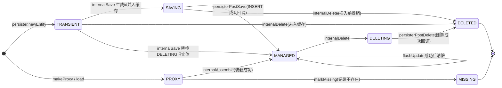
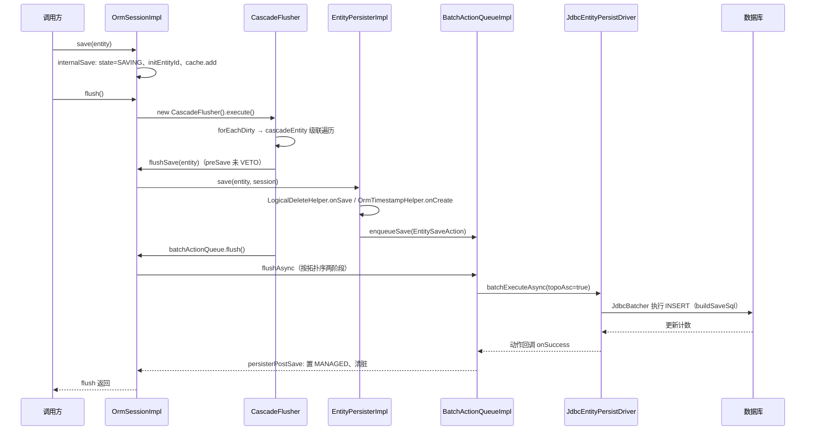

# 实体生命周期：从 TRANSIENT 到 DELETED 的状态机

> 本页依据的源文件（相对路径自本页上行三级至仓库根）：
>
> - ../../../nop-persistence/nop-orm/src/main/java/io/nop/orm/OrmEntityState.java
> - ../../../nop-persistence/nop-orm/src/main/java/io/nop/orm/session/OrmSessionImpl.java
> - ../../../nop-persistence/nop-orm/src/main/java/io/nop/orm/session/CascadeFlusher.java
> - ../../../nop-persistence/nop-orm/src/main/java/io/nop/orm/persister/EntityPersisterImpl.java
> - ../../../nop-persistence/nop-orm/src/main/java/io/nop/orm/persister/LogicalDeleteHelper.java
> - ../../../nop-persistence/nop-orm/src/main/java/io/nop/orm/persister/OrmTimestampHelper.java
> - ../../../nop-persistence/nop-orm/src/main/java/io/nop/orm/persister/OrmRevisionHelper.java
> - ../../../nop-persistence/nop-orm/src/main/java/io/nop/orm/session/OrmSessionEntityCache.java
> - ../../../nop-persistence/nop-orm/src/main/java/io/nop/orm/persister/BatchActionQueueImpl.java
> - ../../../nop-persistence/nop-orm/src/main/java/io/nop/orm/driver/jdbc/JdbcEntityPersistDriver.java

实体生命周期由 OrmEntityState 的七个枚举状态标记，且全部状态迁移集中在 OrmSessionImpl 一个类中完成（类注释即如此声明）。本页追踪 save→flush→SQL 的确定执行路径：TRANSIENT 如何变为 SAVING，flush 如何经 CascadeFlusher 与两阶段批量队列落到 JDBC，级联循环靠什么终止，以及逻辑删除、时间戳、修订三条特殊写路径的分流位置。

## 状态全景：七个状态与判定谓词

`OrmEntityState` 定义 TRANSIENT、SAVING、PROXY、MANAGED、MISSING、DELETING、DELETED 七个状态（OrmEntityState.java:14-41）。三个判定谓词决定了状态机的外部行为：`isUnsaved()` 覆盖 TRANSIENT 与 SAVING（OrmEntityState.java:43-45），`isAllowLoad()` 允许对 PROXY、MANAGED、DELETING 三种状态发起装载——注意 DELETING 实体仍可加载（OrmEntityState.java:51-53）；`isGone()` 把 MISSING、DELETED、DELETING 统一视为"已消失"（OrmEntityState.java:55-57），`get()` 据此对已删实体返回 null（OrmSessionImpl.java:336-352）。

PROXY 的来源是 `load()`/`makeProxy()`：缓存命中直接返回既有实体，否则新建实体、置 PROXY、把 to-many 集合置为代理态并加入一级缓存（OrmSessionImpl.java:781-822）。首次属性访问触发 `internalLoadProperty` → `persister.loadAsync` → driver 查询 → `internalAssemble` 装配（OrmSessionImpl.java:840-873）；数据库无此行时 driver 调 `session.markMissing` 置 MISSING（JdbcEntityPersistDriver.java:219-221），悲观锁 `lock()` 失败同样置 MISSING 并抛 ERR_ORM_LOCK_ENTITY_FAIL（OrmSessionImpl.java:604-618）。

> Sources: [nop-persistence/nop-orm/src/main/java/io/nop/orm/OrmEntityState.java:14-57](https://gitee.com/canonical-entropy/nop-entropy/blob/f2ecee739b/nop-persistence/nop-orm/src/main/java/io/nop/orm/OrmEntityState.java#L14-L57)、[nop-persistence/nop-orm/src/main/java/io/nop/orm/session/OrmSessionImpl.java:781-822](https://gitee.com/canonical-entropy/nop-entropy/blob/f2ecee739b/nop-persistence/nop-orm/src/main/java/io/nop/orm/session/OrmSessionImpl.java#L781-L822)、[nop-persistence/nop-orm/src/main/java/io/nop/orm/session/OrmSessionImpl.java:364-423](https://gitee.com/canonical-entropy/nop-entropy/blob/f2ecee739b/nop-persistence/nop-orm/src/main/java/io/nop/orm/session/OrmSessionImpl.java#L364-L423)、[nop-persistence/nop-orm/src/main/java/io/nop/orm/driver/jdbc/JdbcEntityPersistDriver.java:188-224](https://gitee.com/canonical-entropy/nop-entropy/blob/f2ecee739b/nop-persistence/nop-orm/src/main/java/io/nop/orm/driver/jdbc/JdbcEntityPersistDriver.java#L188-L224)

## 状态迁移触发点

写入路径从公开 API 进入：`save()` 校验后调 `internalSave`，stateless 会话立即 `flushImmediately`（OrmSessionImpl.java:481-491）。`internalSave` 是 TRANSIENT→SAVING 的唯一常规触发点：非 TRANSIENT 状态直接抛 ERR_ORM_SAVE_ENTITY_NOT_TRANSIENT（OrmSessionImpl.java:914-915），随后置 SAVING（918）、`initEntityId` 生成主键——一对一从表先递归初始化主表并复制关联属性，否则走 `persister.generateId`（950-968）——再 `cache.add` 入一级缓存（926）。同 id 冲突时：旧实体未消失则抛 ERR_ORM_SAVE_ENTITY_REPLACE_EXISTING_ENTITY（932-934）；旧实体处于 DELETING 则新实体直接置 MANAGED 并继承旧值（"删除后又新建"，936-940），这是唯一一条不经过 SAVING 的 TRANSIENT→MANAGED 迁移。

删除路径上，`session.delete` 要求实体已在缓存中（OrmSessionImpl.java:630-641），`internalDelete`（971-999）按当前状态分流：PROXY 先装载并重读状态（978-982）；TRANSIENT/SAVING 直接置 DELETED，不产生 SQL（984-987）；MISSING 不做任何事（988-989）；其余置 DELETING 并标记 session 与实体缓存为 dirty（990-994）。DELETING→DELETED 不发生在标记时刻，而是发生在批量动作执行成功的回调里（见下文批量落库一节）。`saveOrUpdate` 按 `contains` 分派到 update 或 save（621-627）；`update/internalUpdate` 要求 MANAGED 或 SAVING（568-576）。

| 迁移 | 触发方法 | 条件与错误 | 证据 |
|---|---|---|---|
| TRANSIENT→SAVING | `OrmSessionImpl.internalSave` | 必须为 TRANSIENT，否则 ERR_ORM_SAVE_ENTITY_NOT_TRANSIENT | OrmSessionImpl.java:914-918 |
| TRANSIENT→SAVING | `saveDirectly` | 绕过级联与缓存直达 persister，立即 flushSave | OrmSessionImpl.java:494-519 |
| SAVING→MANAGED | `EntitySaveAction` 回调→`persisterPostSave` | INSERT 执行成功后：interceptPostSave+清脏+置 MANAGED | OrmSessionImpl.java:1171-1175、EntityPersisterImpl.java:462-467 |
| TRANSIENT/SAVING→DELETED | `internalDelete` | 尚未写入数据库，无需 SQL | OrmSessionImpl.java:984-987 |
| MANAGED→DELETING | `internalDelete` | 已托管实体；置 session dirty+缓存 dirty | OrmSessionImpl.java:990-994 |
| DELETING→DELETED | `EntityDeleteAction` 回调→`persisterPostDelete` | DELETE/逻辑删除 UPDATE 执行成功 | OrmSessionImpl.java:1159-1162、EntityPersisterImpl.java:495-502 |
| PROXY→MANAGED | `internalAssemble` | 装载成功置 MANAGED；修订实体 nopRevType=REV_TYPE_DELETE(3) 时置 DELETED | OrmSessionImpl.java:398-407 |
| PROXY→MISSING | `markMissing` | driver 批量装载未命中行，或 lock 失败 | JdbcEntityPersistDriver.java:219-221、OrmSessionImpl.java:609 |
| TRANSIENT→MANAGED | `internalSave` 替换 DELETING 旧实体 | 同 id 删除后重建，继承旧值 | OrmSessionImpl.java:936-940 |

游离态相关：`attach` 对绑定在未关闭的其他 session 上的实体抛 ERR_ORM_ENTITY_NOT_DETACHED，TRANSIENT 实体直接转 `save`，其余重新入缓存并可级联 attach 已装载的关联实体（OrmSessionImpl.java:1332-1366）；`detach` 调 `orm_detach` 并递归游离已装载关联（1369-1411）；`reset` 移除 gone/saving 实体、其余 orm_reset（1293-1304）。

> Sources: [nop-persistence/nop-orm/src/main/java/io/nop/orm/session/OrmSessionImpl.java:481-519](https://gitee.com/canonical-entropy/nop-entropy/blob/f2ecee739b/nop-persistence/nop-orm/src/main/java/io/nop/orm/session/OrmSessionImpl.java#L481-L519)、[nop-persistence/nop-orm/src/main/java/io/nop/orm/session/OrmSessionImpl.java:906-999](https://gitee.com/canonical-entropy/nop-entropy/blob/f2ecee739b/nop-persistence/nop-orm/src/main/java/io/nop/orm/session/OrmSessionImpl.java#L906-L999)、[nop-persistence/nop-orm/src/main/java/io/nop/orm/session/OrmSessionImpl.java:1159-1175](https://gitee.com/canonical-entropy/nop-entropy/blob/f2ecee739b/nop-persistence/nop-orm/src/main/java/io/nop/orm/session/OrmSessionImpl.java#L1159-L1175)、[nop-persistence/nop-orm/src/main/java/io/nop/orm/persister/EntityPersisterImpl.java:455-503](https://gitee.com/canonical-entropy/nop-entropy/blob/f2ecee739b/nop-persistence/nop-orm/src/main/java/io/nop/orm/persister/EntityPersisterImpl.java#L455-L503)、[nop-persistence/nop-orm/src/main/java/io/nop/orm/session/OrmSessionImpl.java:1332-1411](https://gitee.com/canonical-entropy/nop-entropy/blob/f2ecee739b/nop-persistence/nop-orm/src/main/java/io/nop/orm/session/OrmSessionImpl.java#L1332-L1411)

## flush 的完整调用链

本页追踪一次 save 之后到 JDBC 的完整执行路径：入口 `OrmSessionImpl.flush`（OrmSessionImpl.java:176-224）依次通过三道闸门——正在 flush 中则直接返回（183-186）、session 非 dirty 直接返回（189-192）、只读 session 直接返回（195-198）——然后 interceptPreFlush（202），创建 `CascadeFlusher` 并 `execute()`（205-206）。execute 内部第一步对每个 dirty 实体做级联遍历 `cascadeEntity`（CascadeFlusher.java:85），第二步 `flushBatchLoadQueue` 补齐待删除实体（88），第三步 `processWaitDeletes`（90），第四步对 dirty 实体逐个 `internalFlush` 生成动作（93-99），最后 `flushChanged` 重放 flush 过程中产生的修改（101）。回到 flush：置 dirty=false、清缓存 dirty 标记（208-209），随后 `batchActionQueue.flush()`（211）真正执行 SQL，最后 interceptPostFlush（219-221）。关键点：SAVING→MANAGED 的状态迁移发生在第 211 步的回调里，而非 internalFlush 时。

`internalFlush`（CascadeFlusher.java:240-258）是状态到动作的翻译器：只读实体跳过（242-243）；SAVING→`session.flushSave`（247-249）；DELETING→`flushDelete`（250-252）；MANAGED 且 `orm_dirty`→`flushUpdate`（253-255）。三个 flushXxx（OrmSessionImpl.java:1020-1059）先过 `interceptPreSave/Update/Delete`，返回 STOP 即 VETO 该实体（1021-1024、1035-1038、1049-1052），再调 persister 同名方法。拦截器链的组装方式见 [../topics/assembly-interceptors.md](../topics/assembly-interceptors.md)。

stateless 会话没有延迟 flush：`save/update/delete` 立即调 `flushImmediately`（OrmSessionImpl.java:487-488、564-565、639-640），它对单实体执行 `CascadeFlusher.execute(entity)` 并同步 `batchActionQueue.flush()`，且恢复 dirty 时用 `oldDirty || dirty` 防止覆盖 flush 过程中的新标记（1001-1017）。`saveDirectly/updateDirectly/deleteDirectly` 则完全绕过级联，直接 flushSave/flushUpdate/flushDelete 并可选立即执行队列（494-551）。

> Sources: [nop-persistence/nop-orm/src/main/java/io/nop/orm/session/OrmSessionImpl.java:176-224](https://gitee.com/canonical-entropy/nop-entropy/blob/f2ecee739b/nop-persistence/nop-orm/src/main/java/io/nop/orm/session/OrmSessionImpl.java#L176-L224)、[nop-persistence/nop-orm/src/main/java/io/nop/orm/session/CascadeFlusher.java:81-133](https://gitee.com/canonical-entropy/nop-entropy/blob/f2ecee739b/nop-persistence/nop-orm/src/main/java/io/nop/orm/session/CascadeFlusher.java#L81-L133)、[nop-persistence/nop-orm/src/main/java/io/nop/orm/session/CascadeFlusher.java:240-258](https://gitee.com/canonical-entropy/nop-entropy/blob/f2ecee739b/nop-persistence/nop-orm/src/main/java/io/nop/orm/session/CascadeFlusher.java#L240-L258)、[nop-persistence/nop-orm/src/main/java/io/nop/orm/session/OrmSessionImpl.java:1001-1059](https://gitee.com/canonical-entropy/nop-entropy/blob/f2ecee739b/nop-persistence/nop-orm/src/main/java/io/nop/orm/session/OrmSessionImpl.java#L1001-L1059)、[nop-persistence/nop-orm/src/main/java/io/nop/orm/session/OrmSessionImpl.java:494-551](https://gitee.com/canonical-entropy/nop-entropy/blob/f2ecee739b/nop-persistence/nop-orm/src/main/java/io/nop/orm/session/OrmSessionImpl.java#L494-L551)

## 级联遍历与循环终止条件

级联遍历从 `cascadeEntity` 进入：`orm_flushVisiting` 标记防止同一实体被重复递归（CascadeFlusher.java:260-269）。`_cascadeEntity` 的遍历规则：只读实体直接返回（275-276）；MISSING/DELETED 不递归（279-280）；PROXY 仅在 `orm_extDirty` 时检查 to-many 集合（284-298）；TRANSIENT 先 `session.internalSave` 转入 SAVING（301-303）；然后沿模型关系走——to-many 且级联删除或 extDirty 时 `cascadeCollection`（313-319）；to-one 已装载时，级联删除属性走 `cascadeDeleteEntity`（注意注释：cascadeDelete 语义是删除关联对象而非 owner 自身，322-324），否则 TRANSIENT 关联实体递归 cascadeEntity（326-329）。

`cascadeDeleteEntity`（334-351）：目标还是 PROXY 时放入 `waitDeletes` 并进批量装载队列，装载后在 `processWaitDeletes` 中补删（144-163，每轮处理后再次 `flushBatchLoadQueue`，161）；已装载且非 gone 则 `internalDelete` 并清除 visiting 标记以便重新遍历其级联（342-348）。`cascadeCollection`（353-403）：父级联删除时 `coll.clear()`（361-363）；否则 TRANSIENT 元素递归保存、gone 元素从集合移除（364-374）；`orm_removed` 中的孤儿（`isOrphan`：owner 绑定已解除或无反向属性，405-415）级联删除（377-389）；集合脏则 `flushCollectionChange`（392-393）；未装载的代理集合在父级联删除且非 autoCascadeDelete 时入装载队列延后处理（396-402）。

循环终止靠三重机制：

1. **重放上限**：flush 过程中拦截器或生命周期回调对其他实体的修改通过 `addChangeDuringFlush` 登记（CascadeFlusher.java:71-79，OrmSessionImpl.java:945-947、996-998），`flushChanged` 的 while 循环重放这些修改，超过 `MAX_FLUSH_LOOP_COUNT = 10` 抛 ERR_ORM_FLUSH_LOOP_COUNT_EXCEED_LIMIT（CascadeFlusher.java:36、116-133）。
2. **已刷标记**：生成过 SQL 动作的实体记入 `flushedEntities`（CascadeFlusher.java:47-69），重放时跳过（126-127）；其后续修改由队列中挂起的动作在批执行时按实体最终脏属性构建 SQL 覆盖——UPDATE 语句在执行期按 `orm_dirtyPropIds` 现生成（JdbcEntityPersistDriver.java:281-293）。
3. **缓存遍历上限**：`OrmSessionEntityCache.forEachDirty` 只遍历 dirty 的 EntityCache，遍历中新增实体进 tempEntityCaches、删除进 tempRemoves 避免并发修改，循环合并，超过 `MAX_LOOP_COUNT = 100` 抛 ERR_ORM_VISIT_LOOP_COUNT_EXCEED_LIMIT（OrmSessionEntityCache.java:29、36-43、114-124、319-356、369-380）。缓存的 LinkedHashMap 保序设计服务于录制回放测试（55-56）。

失败恢复：flush 中途抛异常时第二遍遍历不会执行，`finally` 中 `clearFlushVisiting` 统一复位 visiting 标记，否则同一 session 重试 flush 会静默丢弃级联（CascadeFlusher.java:103-108、185-193）。

> Sources: [nop-persistence/nop-orm/src/main/java/io/nop/orm/session/CascadeFlusher.java:260-403](https://gitee.com/canonical-entropy/nop-entropy/blob/f2ecee739b/nop-persistence/nop-orm/src/main/java/io/nop/orm/session/CascadeFlusher.java#L260-L403)、[nop-persistence/nop-orm/src/main/java/io/nop/orm/session/CascadeFlusher.java:116-133](https://gitee.com/canonical-entropy/nop-entropy/blob/f2ecee739b/nop-persistence/nop-orm/src/main/java/io/nop/orm/session/CascadeFlusher.java#L116-L133)、[nop-persistence/nop-orm/src/main/java/io/nop/orm/session/OrmSessionEntityCache.java:319-380](https://gitee.com/canonical-entropy/nop-entropy/blob/f2ecee739b/nop-persistence/nop-orm/src/main/java/io/nop/orm/session/OrmSessionEntityCache.java#L319-L380)、[nop-persistence/nop-orm/src/main/java/io/nop/orm/driver/jdbc/JdbcEntityPersistDriver.java:281-293](https://gitee.com/canonical-entropy/nop-entropy/blob/f2ecee739b/nop-persistence/nop-orm/src/main/java/io/nop/orm/driver/jdbc/JdbcEntityPersistDriver.java#L281-L293)

## 批量落库：两阶段拓扑执行

动作入队后，执行入口是 `SessionBatchActionQueue`：每个 querySpace 一个 `BatchActionQueueImpl`，用 TreeMap 按 querySpace 名保序（SessionBatchActionQueue.java:21-43）；`flush()` 是 `flushAsync` 的同步等待（45-47）。`BatchActionQueueImpl.flushAsync`（BatchActionQueueImpl.java:145-239）把涉及的实体模型按拓扑排序（154），然后两阶段执行：阶段一 `topoAsc=true` 正序——无被依赖的实体先执行 DELETE，INSERT/UPDATE 共用一个连接批处理（JdbcEntityPersistDriver.java:239-252）；阶段二逆序补上被依赖实体的 DELETE（253-255）。同一实体的 update/delete 动作按实体 id 存 TreeMap，多行更新按 id 排序以减少锁冲突（BatchActionQueueImpl.java:53-55、63-67、88-92）。中途失败立即中断两阶段，`notifyUnsubmittedFailure` 为未提交的动作补发 onFailure 回调（204-208、245-257）；延迟任务只在全部成功后执行（217-220）。

状态回写全部发生在动作回调中，与 SQL 执行解耦：

- `EntitySaveAction` 成功 → `session.persisterPostSave`：interceptPostSave + 清脏 + 置 MANAGED（EntityPersisterImpl.java:462-467、OrmSessionImpl.java:1171-1175）。
- `EntityUpdateAction` 成功 → `checkUpdateResult`（更新行数>1 抛 ERR_ORM_UPDATE_ENTITY_MULTIPLE_ROWS、=0 抛 ERR_ORM_UPDATE_ENTITY_NOT_FOUND，`orm_disableVersionCheckError` 时降级为置只读）→ 内存版本号 +1 → 清全局缓存 → `persisterPostUpdate` 清脏（EntityPersisterImpl.java:371-378、480-521、1165-1168）。
- `EntityDeleteAction` 成功 → `persisterPostDelete`：interceptPostDelete + 置 DELETED（495-502、1159-1162）。

驱动层 SQL 生成与 JdbcBatcher 批执行的细节（含 INSERT 语句缓存与方言切换）见 [../modules/persister-sql.md](../modules/persister-sql.md)；全局缓存失效被注册为事务提交后回调（EntityPersisterImpl.java:550-566）。批量只读装载的合并协议见 [query-pipeline.md](query-pipeline.md)。

> Sources: [nop-persistence/nop-orm/src/main/java/io/nop/orm/persister/BatchActionQueueImpl.java:145-257](https://gitee.com/canonical-entropy/nop-entropy/blob/f2ecee739b/nop-persistence/nop-orm/src/main/java/io/nop/orm/persister/BatchActionQueueImpl.java#L145-L257)、[nop-persistence/nop-orm/src/main/java/io/nop/orm/session/SessionBatchActionQueue.java:21-64](https://gitee.com/canonical-entropy/nop-entropy/blob/f2ecee739b/nop-persistence/nop-orm/src/main/java/io/nop/orm/session/SessionBatchActionQueue.java#L21-L64)、[nop-persistence/nop-orm/src/main/java/io/nop/orm/driver/jdbc/JdbcEntityPersistDriver.java:233-319](https://gitee.com/canonical-entropy/nop-entropy/blob/f2ecee739b/nop-persistence/nop-orm/src/main/java/io/nop/orm/driver/jdbc/JdbcEntityPersistDriver.java#L233-L319)、[nop-persistence/nop-orm/src/main/java/io/nop/orm/persister/EntityPersisterImpl.java:455-521](https://gitee.com/canonical-entropy/nop-entropy/blob/f2ecee739b/nop-persistence/nop-orm/src/main/java/io/nop/orm/persister/EntityPersisterImpl.java#L455-L521)

## 特殊写路径对照：逻辑删除、时间戳、修订

persister 的 save/update/delete 是三条写路径的总分流点（EntityPersisterImpl.java:288-337）。

| 维度 | 逻辑删除 | 物理删除 | 时间戳 | 修订（失效版本） |
|---|---|---|---|---|
| 分流条件 | `isUseLogicalDelete` 且未 `orm_disableLogicalDelete` | 其余 delete | 模型声明 creator/updater/createTime/updateTime 属性 | `isUseRevision`，在 save/update/delete 各自入口分流 |
| 生成的 SQL | UPDATE（改 deleteFlag/deleteVersion） | DELETE | 随 INSERT/UPDATE 附带 | 一条 UPDATE 关闭旧修订 + 一条 INSERT 新修订 |
| 关键处理 | `LogicalDeleteHelper.onDelete` 置 deleteFlag=YES_VALUE、deleteVersion=`env.newDeleteVersion()`，随后转 `update()` | `syncComponentWhenDelete(false)` + `queueDelete` | `OrmTimestampHelper.onCreate/onUpdate` 填四字段 | `OrmRevisionHelper.onRevSave/onRevUpdate/onRevDelete` |
| 证据 | EntityPersisterImpl.java:320-325、LogicalDeleteHelper.java:50-65 | EntityPersisterImpl.java:335-336、492-503 | EntityPersisterImpl.java:456、472、OrmTimestampHelper.java:31-119 | EntityPersisterImpl.java:296-299、309-312、329-333、OrmRevisionHelper.java:23-72 |

逻辑删除的写侧对称操作在保存时：`onSave` 把 deleteFlag 初始化为 0、deleteVersion 初始化为 0（LogicalDeleteHelper.java:28-48）；读侧 `addDeleteFlagToExample` 给所有 byExample 查询追加 deleteFlag=0 过滤（EntityPersisterImpl.java:756-760）。deleteFlag 与 deleteVersion 可合并为同一列（同一 propId 时直接写 `newDeleteVersion()`，LogicalDeleteHelper.java:57-58）。

时间戳的取值规则：用户取 `ContextProvider.currentUserRefNo()`，取不到回退 `CFG_ORM_SYS_USER_NAME`（OrmTimestampHelper.java:121-123、50-55）；时间统一取 `CoreMetrics.currentTimeMillis()`（58-71）；`CFG_ORM_USE_ASSIGNED_USER_TIMESTAMP` 开启时只填空值，保留调用方显式赋值（shouldAssign，115-119）；`orm_disableAutoStamp` 可整体关闭（32-33、75-76）。乐观锁版本独立于时间戳：保存时初始化为 0（EntityPersisterImpl.java:349-358），更新成功后内存 +1（371-378），懒加载发现版本漂移抛 ERR_ORM_ENTITY_VERSION_CHANGED（OrmSessionImpl.java:384-394）。

修订模型把 DELETE 也变成"写一条新版本"：`onRevSave` 先 `findLatest` 检查最新修订不是 REV_TYPE_DELETE，否则 ERR_ORM_ENTITY_ALREADY_EXISTS（OrmRevisionHelper.java:25-28）；版本号取 `session.getSessionRevVersion()`，同一 session 每次 flush 重新分配（OrmSessionImpl.java:157-161、215）；`newRevEntity` 克隆实体、`orm_clearDirty` 后用 `orm_propValue`（而非 `orm_internalSet`）关闭旧记录的 revEndVer——注释明确说明 internalSet 不记录 oldValues 会导致 UPDATE 不生成（OrmRevisionHelper.java:115-123）。修订类型常量 REV_TYPE_SAVE=1、REV_TYPE_UPDATE=2、REV_TYPE_DELETE=3（OrmConstants.java:87-97），"是否当前版本"以 revEndVer==Long.MAX_VALUE 判定（131-139）。

> Sources: [nop-persistence/nop-orm/src/main/java/io/nop/orm/persister/EntityPersisterImpl.java:288-337](https://gitee.com/canonical-entropy/nop-entropy/blob/f2ecee739b/nop-persistence/nop-orm/src/main/java/io/nop/orm/persister/EntityPersisterImpl.java#L288-L337)、[nop-persistence/nop-orm/src/main/java/io/nop/orm/persister/LogicalDeleteHelper.java:28-65](https://gitee.com/canonical-entropy/nop-entropy/blob/f2ecee739b/nop-persistence/nop-orm/src/main/java/io/nop/orm/persister/LogicalDeleteHelper.java#L28-L65)、[nop-persistence/nop-orm/src/main/java/io/nop/orm/persister/OrmTimestampHelper.java:31-123](https://gitee.com/canonical-entropy/nop-entropy/blob/f2ecee739b/nop-persistence/nop-orm/src/main/java/io/nop/orm/persister/OrmTimestampHelper.java#L31-L123)、[nop-persistence/nop-orm/src/main/java/io/nop/orm/persister/OrmRevisionHelper.java:23-139](https://gitee.com/canonical-entropy/nop-entropy/blob/f2ecee739b/nop-persistence/nop-orm/src/main/java/io/nop/orm/persister/OrmRevisionHelper.java#L23-L139)、[nop-persistence/nop-orm/src/main/java/io/nop/orm/OrmConstants.java:87-97](https://gitee.com/canonical-entropy/nop-entropy/blob/f2ecee739b/nop-persistence/nop-orm/src/main/java/io/nop/orm/OrmConstants.java#L87-L97)

## 延伸阅读

- 状态机在 session 一级缓存上的载体（visiting 协议、租户缓存变体）见 [../modules/session-factory.md](../modules/session-factory.md)。
- SQL 如何从动作生成并批量执行见 [../modules/persister-sql.md](../modules/persister-sql.md)。
- 装配与拦截器回调的完整清单见 [../topics/assembly-interceptors.md](../topics/assembly-interceptors.md)；查询侧管线见 [query-pipeline.md](query-pipeline.md)。
- 术语表与阅读顺序见 [../glossary.md](../glossary.md)、reading-guide.md（PLAN 规划）；平台总览见 overview.md（PLAN 规划）、architecture.md（PLAN 规划）；可运行示例见 [../quickstart.md](../quickstart.md)。

## Sources

- [nop-persistence/nop-orm/src/main/java/io/nop/orm/OrmEntityState.java:14-57](https://gitee.com/canonical-entropy/nop-entropy/blob/f2ecee739b/nop-persistence/nop-orm/src/main/java/io/nop/orm/OrmEntityState.java#L14-L57)
- [nop-persistence/nop-orm/src/main/java/io/nop/orm/session/OrmSessionImpl.java:176-224](https://gitee.com/canonical-entropy/nop-entropy/blob/f2ecee739b/nop-persistence/nop-orm/src/main/java/io/nop/orm/session/OrmSessionImpl.java#L176-L224)
- [nop-persistence/nop-orm/src/main/java/io/nop/orm/session/OrmSessionImpl.java:364-423](https://gitee.com/canonical-entropy/nop-entropy/blob/f2ecee739b/nop-persistence/nop-orm/src/main/java/io/nop/orm/session/OrmSessionImpl.java#L364-L423)
- [nop-persistence/nop-orm/src/main/java/io/nop/orm/session/OrmSessionImpl.java:481-551](https://gitee.com/canonical-entropy/nop-entropy/blob/f2ecee739b/nop-persistence/nop-orm/src/main/java/io/nop/orm/session/OrmSessionImpl.java#L481-L551)
- [nop-persistence/nop-orm/src/main/java/io/nop/orm/session/OrmSessionImpl.java:592-641](https://gitee.com/canonical-entropy/nop-entropy/blob/f2ecee739b/nop-persistence/nop-orm/src/main/java/io/nop/orm/session/OrmSessionImpl.java#L592-L641)
- [nop-persistence/nop-orm/src/main/java/io/nop/orm/session/OrmSessionImpl.java:781-873](https://gitee.com/canonical-entropy/nop-entropy/blob/f2ecee739b/nop-persistence/nop-orm/src/main/java/io/nop/orm/session/OrmSessionImpl.java#L781-L873)
- [nop-persistence/nop-orm/src/main/java/io/nop/orm/session/OrmSessionImpl.java:906-999](https://gitee.com/canonical-entropy/nop-entropy/blob/f2ecee739b/nop-persistence/nop-orm/src/main/java/io/nop/orm/session/OrmSessionImpl.java#L906-L999)
- [nop-persistence/nop-orm/src/main/java/io/nop/orm/session/OrmSessionImpl.java:1001-1059](https://gitee.com/canonical-entropy/nop-entropy/blob/f2ecee739b/nop-persistence/nop-orm/src/main/java/io/nop/orm/session/OrmSessionImpl.java#L1001-L1059)
- [nop-persistence/nop-orm/src/main/java/io/nop/orm/session/OrmSessionImpl.java:1159-1175](https://gitee.com/canonical-entropy/nop-entropy/blob/f2ecee739b/nop-persistence/nop-orm/src/main/java/io/nop/orm/session/OrmSessionImpl.java#L1159-L1175)
- [nop-persistence/nop-orm/src/main/java/io/nop/orm/session/OrmSessionImpl.java:1332-1411](https://gitee.com/canonical-entropy/nop-entropy/blob/f2ecee739b/nop-persistence/nop-orm/src/main/java/io/nop/orm/session/OrmSessionImpl.java#L1332-L1411)
- [nop-persistence/nop-orm/src/main/java/io/nop/orm/session/CascadeFlusher.java:36-133](https://gitee.com/canonical-entropy/nop-entropy/blob/f2ecee739b/nop-persistence/nop-orm/src/main/java/io/nop/orm/session/CascadeFlusher.java#L36-L133)
- [nop-persistence/nop-orm/src/main/java/io/nop/orm/session/CascadeFlusher.java:144-163](https://gitee.com/canonical-entropy/nop-entropy/blob/f2ecee739b/nop-persistence/nop-orm/src/main/java/io/nop/orm/session/CascadeFlusher.java#L144-L163)
- [nop-persistence/nop-orm/src/main/java/io/nop/orm/session/CascadeFlusher.java:240-403](https://gitee.com/canonical-entropy/nop-entropy/blob/f2ecee739b/nop-persistence/nop-orm/src/main/java/io/nop/orm/session/CascadeFlusher.java#L240-L403)
- [nop-persistence/nop-orm/src/main/java/io/nop/orm/session/OrmSessionEntityCache.java:29-56](https://gitee.com/canonical-entropy/nop-entropy/blob/f2ecee739b/nop-persistence/nop-orm/src/main/java/io/nop/orm/session/OrmSessionEntityCache.java#L29-L56)
- [nop-persistence/nop-orm/src/main/java/io/nop/orm/session/OrmSessionEntityCache.java:319-380](https://gitee.com/canonical-entropy/nop-entropy/blob/f2ecee739b/nop-persistence/nop-orm/src/main/java/io/nop/orm/session/OrmSessionEntityCache.java#L319-L380)
- [nop-persistence/nop-orm/src/main/java/io/nop/orm/session/SessionBatchActionQueue.java:21-64](https://gitee.com/canonical-entropy/nop-entropy/blob/f2ecee739b/nop-persistence/nop-orm/src/main/java/io/nop/orm/session/SessionBatchActionQueue.java#L21-L64)
- [nop-persistence/nop-orm/src/main/java/io/nop/orm/persister/EntityPersisterImpl.java:288-521](https://gitee.com/canonical-entropy/nop-entropy/blob/f2ecee739b/nop-persistence/nop-orm/src/main/java/io/nop/orm/persister/EntityPersisterImpl.java#L288-L521)
- [nop-persistence/nop-orm/src/main/java/io/nop/orm/persister/EntityPersisterImpl.java:550-566](https://gitee.com/canonical-entropy/nop-entropy/blob/f2ecee739b/nop-persistence/nop-orm/src/main/java/io/nop/orm/persister/EntityPersisterImpl.java#L550-L566)
- [nop-persistence/nop-orm/src/main/java/io/nop/orm/persister/EntityPersisterImpl.java:634-651](https://gitee.com/canonical-entropy/nop-entropy/blob/f2ecee739b/nop-persistence/nop-orm/src/main/java/io/nop/orm/persister/EntityPersisterImpl.java#L634-L651)
- [nop-persistence/nop-orm/src/main/java/io/nop/orm/persister/EntityPersisterImpl.java:756-760](https://gitee.com/canonical-entropy/nop-entropy/blob/f2ecee739b/nop-persistence/nop-orm/src/main/java/io/nop/orm/persister/EntityPersisterImpl.java#L756-L760)
- [nop-persistence/nop-orm/src/main/java/io/nop/orm/persister/BatchActionQueueImpl.java:51-93](https://gitee.com/canonical-entropy/nop-entropy/blob/f2ecee739b/nop-persistence/nop-orm/src/main/java/io/nop/orm/persister/BatchActionQueueImpl.java#L51-L93)
- [nop-persistence/nop-orm/src/main/java/io/nop/orm/persister/BatchActionQueueImpl.java:145-257](https://gitee.com/canonical-entropy/nop-entropy/blob/f2ecee739b/nop-persistence/nop-orm/src/main/java/io/nop/orm/persister/BatchActionQueueImpl.java#L145-L257)
- [nop-persistence/nop-orm/src/main/java/io/nop/orm/persister/LogicalDeleteHelper.java:28-65](https://gitee.com/canonical-entropy/nop-entropy/blob/f2ecee739b/nop-persistence/nop-orm/src/main/java/io/nop/orm/persister/LogicalDeleteHelper.java#L28-L65)
- [nop-persistence/nop-orm/src/main/java/io/nop/orm/persister/OrmTimestampHelper.java:31-123](https://gitee.com/canonical-entropy/nop-entropy/blob/f2ecee739b/nop-persistence/nop-orm/src/main/java/io/nop/orm/persister/OrmTimestampHelper.java#L31-L123)
- [nop-persistence/nop-orm/src/main/java/io/nop/orm/persister/OrmRevisionHelper.java:23-139](https://gitee.com/canonical-entropy/nop-entropy/blob/f2ecee739b/nop-persistence/nop-orm/src/main/java/io/nop/orm/persister/OrmRevisionHelper.java#L23-L139)
- [nop-persistence/nop-orm/src/main/java/io/nop/orm/driver/jdbc/JdbcEntityPersistDriver.java:151-224](https://gitee.com/canonical-entropy/nop-entropy/blob/f2ecee739b/nop-persistence/nop-orm/src/main/java/io/nop/orm/driver/jdbc/JdbcEntityPersistDriver.java#L151-L224)
- [nop-persistence/nop-orm/src/main/java/io/nop/orm/driver/jdbc/JdbcEntityPersistDriver.java:233-319](https://gitee.com/canonical-entropy/nop-entropy/blob/f2ecee739b/nop-persistence/nop-orm/src/main/java/io/nop/orm/driver/jdbc/JdbcEntityPersistDriver.java#L233-L319)
- [nop-persistence/nop-orm/src/main/java/io/nop/orm/OrmConstants.java:87-97](https://gitee.com/canonical-entropy/nop-entropy/blob/f2ecee739b/nop-persistence/nop-orm/src/main/java/io/nop/orm/OrmConstants.java#L87-L97)

---

## On this page

- 状态全景：七个状态与判定谓词
- 状态迁移触发点
- flush 的完整调用链
- 级联遍历与循环终止条件
- 批量落库：两阶段拓扑执行
- 特殊写路径对照：逻辑删除、时间戳、修订
- 延伸阅读
