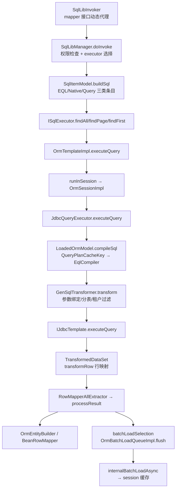
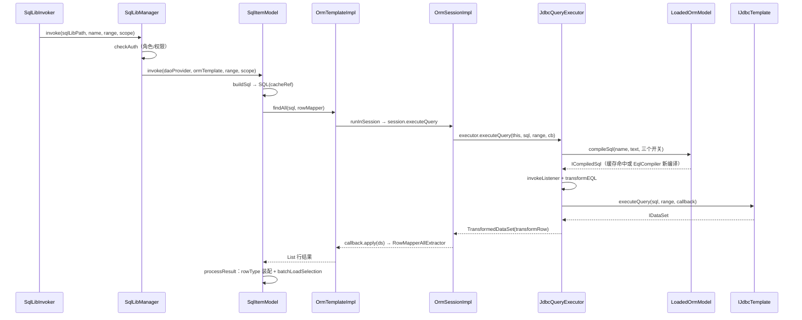

# 查询管线：从 EQL/SQL 到实体装载与缓存

> 本页依据的源文件（相对路径自本页上行三级至仓库根）：
>
> - ../../../nop-persistence/nop-orm/src/main/java/io/nop/orm/impl/OrmTemplateImpl.java
> - ../../../nop-persistence/nop-orm/src/main/java/io/nop/orm/sql_lib/SqlLibManager.java
> - ../../../nop-persistence/nop-orm/src/main/java/io/nop/orm/sql_lib/SqlItemModel.java
> - ../../../nop-persistence/nop-orm/src/main/java/io/nop/orm/factory/LoadedOrmModel.java
> - ../../../nop-persistence/nop-orm/src/main/java/io/nop/orm/QueryPlanCacheKey.java
> - ../../../nop-persistence/nop-orm/src/main/java/io/nop/orm/factory/SimpleCachedQueryPlan.java
> - ../../../nop-persistence/nop-orm/src/main/java/io/nop/orm/factory/TenantCachedQueryPlan.java
> - ../../../nop-persistence/nop-orm/src/main/java/io/nop/orm/loader/JdbcQueryExecutor.java
> - ../../../nop-persistence/nop-orm/src/main/java/io/nop/orm/loader/OrmBatchLoadQueueImpl.java
> - ../../../nop-persistence/nop-orm/src/main/java/io/nop/orm/driver/jdbc/JdbcEntityPersistDriver.java
> - ../../../nop-persistence/nop-orm/src/main/java/io/nop/orm/persister/OrmAssembly.java
> - ../../../nop-persistence/nop-orm/src/main/java/io/nop/orm/session/OrmSessionImpl.java

本页追踪一条查询从 `IOrmTemplate` 调用到实体返回的完整执行路径：SqlLib 如何把 mapper 方法翻译成 SQL 对象，EQL 文本如何按 `QueryPlanCacheKey` 进入编译缓存，SQL 如何经 `GenSqlTransformer` 落到 JDBC，行数据如何经 `transformRow` 与 `OrmAssembly` 装配为实体，以及 1+N 查询如何被批量装载队列合并后注册进 session 缓存。

## 管线全景：六个阶段

一条查询先后经过六个阶段：入口绑定（OrmTemplateImpl.runInSession）、SQL 构造（SqlItemModel.buildSql）、编译缓存（LoadedOrmModel.compileSql）、SQL 重写（GenSqlTransformer）、JDBC 执行与行映射（JdbcQueryExecutor）、结果装配与缓存注册（OrmAssembly + OrmSessionEntityCache）。EQL 文本到原生 SQL 的翻译发生在 nop-orm-eql 模块的 `EqlCompiler`（io.nop.orm.eql.compile.EqlCompiler，入口 `compile(String, String, ISqlCompileContext)`，EqlCompiler.java:40-43），nop-orm 只持有编译产物 `ICompiledSql`。



| 阶段 | 输入 | 输出 | 失败模式 |
|---|---|---|---|
| 入口绑定 | lambda 回调 | 绑定到线程的 IOrmSession | 无可用 session 抛 ERR_ORM_NOT_IN_SESSION（OrmTemplateImpl.java:181-186） |
| SQL 构造 | IEvalContext + sql-lib 模型 | SQL 对象（含 cacheRef/timeout/fetchSize） | 权限不足抛 ERR_ORM_NO_PERMISSION_FOR_SQL（SqlLibManager.java:157-160） |
| 编译缓存 | name + sqlText + 三个布尔开关 | ICompiledSql（复用或新编译） | 多语句 EQL 抛 ERR_EQL_NOT_SUPPORT_MULTIPLE_STATEMENT（EqlCompiler.java:45-46） |
| SQL 重写 | ICompiledSql + markerValues | 绑定实参的原生 SQL | 参数个数不符抛 ERR_ORM_SQL_PARAM_COUNT_MISMATCH（GenSqlTransformer.java:210-214） |
| JDBC 执行与行映射 | SQL + LongRangeBean | TransformedDataSet（惰性行转换） | 读实体触发 daoListener.onRead（JdbcQueryExecutor.java:118-125） |
| 结果装配 | Map 行数据 | IOrmEntity 或 Bean，入 session 缓存 | 行 id 无法匹配待装实体记 warn 并 markMissing（JdbcEntityPersistDriver.java:213-221） |

> Sources: [nop-persistence/nop-orm/src/main/java/io/nop/orm/impl/OrmTemplateImpl.java:204-231](https://gitee.com/canonical-entropy/nop-entropy/blob/555f7a9731/nop-persistence/nop-orm/src/main/java/io/nop/orm/impl/OrmTemplateImpl.java#L204-L231)、[nop-persistence/nop-orm/src/main/java/io/nop/orm/sql_lib/SqlItemModel.java:76-88](https://gitee.com/canonical-entropy/nop-entropy/blob/555f7a9731/nop-persistence/nop-orm/src/main/java/io/nop/orm/sql_lib/SqlItemModel.java#L76-L88)、[nop-persistence/nop-orm/src/main/java/io/nop/orm/loader/JdbcQueryExecutor.java:71-93](https://gitee.com/canonical-entropy/nop-entropy/blob/555f7a9731/nop-persistence/nop-orm/src/main/java/io/nop/orm/loader/JdbcQueryExecutor.java#L71-L93)

## 入口：IOrmTemplate 会话绑定与 SqlLib 分发

`IOrmTemplate` 继承 `ISqlExecutor`（IOrmTemplate.java:30），所有查询方法统一收敛到 `runInSession`：`executeQuery` 是 `runInSession(session -> session.executeQuery(...))` 的一行包装（OrmTemplateImpl.java:142-144）。`runInSession` 先查 `OrmSessionRegistry` 中当前线程已注册的 session，stateless 标志一致则直接复用，否则 `runInNewSession` 打开新 session——注册、执行回调、`session.flush()`，finally 中恢复旧 session 并关闭新 session（OrmTemplateImpl.java:204-231）。按 id 取实体走同一条路：`get`/`load` 分别包装 `session.get`/`session.load`（OrmTemplateImpl.java:291-298），QueryBean 查询则交给 `MdxQueryExecutor`（OrmTemplateImpl.java:440-447）。

SqlLib 是第二条入口。`SqlLibManager.createProxy` 为 `@SqlLibMapper` 接口生成动态代理（SqlLibManager.java:218-223），`SqlLibInvoker.invoke` 把方法实参按参数名绑入 eval scope、识别 `LongRangeBean` 为分页区间，然后调 `sqlLibManager.invoke(sqlLibPath, methodName, range, scope)` 并把结果转换为方法返回类型（SqlLibInvoker.java:59-95）。sql 名 `xx.Yyy` 被解析为资源路径 `module:/sql/xx.sql-lib.xml` 下的条目 `Yyy`（SqlLibManager.java:169-185）。执行前 `doInvoke` 先做权限检查（角色或权限集合任一满足即放行，SqlLibManager.java:130-161），再按条目类型选执行器：eql/query 类型用 `ormTemplate`，原生 sql 用 `jdbcTemplate`（SqlLibManager.java:210-215）。分发与 scope 保护的完整代码：

`nop-persistence/nop-orm/src/main/java/io/nop/orm/sql_lib/SqlLibManager.java:112-128`

```java
    @Override
    public Object invoke(String sqlName, LongRangeBean range, IEvalContext context) {
        SqlItemModel item = getSqlItemModel(sqlName);
        return doInvoke(item, range, context);
    }

    Object doInvoke(SqlItemModel item, LongRangeBean range, IEvalContext context) {
        checkAuth(item, context);
        IEvalScope scope = context.getEvalScope();
        ValueWithLocation sqlLibVl = scope.recordValueLocation(OrmConstants.PARAM_SQL_LIB_MODEL);
        try {
            scope.setLocalValue(OrmConstants.PARAM_SQL_LIB_MODEL, item.getSqlLibModel());
            return item.invoke(daoProvider, getExecutor(item.getType()), range, context);
        } finally {
            scope.restoreValueLocation(OrmConstants.PARAM_SQL_LIB_MODEL, sqlLibVl);
        }
    }
```

`checkAuth` 把 sql-lib 模型临时压入 scope 的 `PARAM_SQL_LIB_MODEL` 槽位，模板内即可经 `sql` 访问本条目元数据，finally 中按 `recordValueLocation` 返回值恢复现场——嵌套 sql 调用互不污染。

SQL 对象由 `SqlItemModel.buildSql` 构造：执行 source 模板生成带 marker 的 SQL 文本，若同时配置 cacheKeyExpr 与 cacheName 则计算 `CacheRef` 一并装入 SQL 对象（SqlItemModel.java:76-88）。三类条目的差异只在文本生成：`EqlSqlItemModel` 与 `NativeSqlItemModel` 都是 `getSource().generateSql(context)`（EqlSqlItemModel.java:21-24、NativeSqlItemModel.java:19-23），source 是 XLang 模板（_EqlSqlItemModel.java:84，类型 ISqlGenerator）；`QuerySqlItemModel` 不生成 SQL，而是生成 `QueryBean` 后走 `orm.findListByQuery`（QuerySqlItemModel.java:31-35、62-78）。未显式指定 sqlMethod 时按文本推断：select 开头且有 range 走 findPage，select 无 range 走 findAll，其余走 execute（SqlItemModel.java:107-118）。

> Sources: [nop-persistence/nop-orm/src/main/java/io/nop/orm/impl/OrmTemplateImpl.java:137-150](https://gitee.com/canonical-entropy/nop-entropy/blob/555f7a9731/nop-persistence/nop-orm/src/main/java/io/nop/orm/impl/OrmTemplateImpl.java#L137-L150)、[nop-persistence/nop-orm/src/main/java/io/nop/orm/sql_lib/SqlLibManager.java:112-128](https://gitee.com/canonical-entropy/nop-entropy/blob/555f7a9731/nop-persistence/nop-orm/src/main/java/io/nop/orm/sql_lib/SqlLibManager.java#L112-L128)、[nop-persistence/nop-orm/src/main/java/io/nop/orm/sql_lib/proxy/SqlLibInvoker.java:37-96](https://gitee.com/canonical-entropy/nop-entropy/blob/555f7a9731/nop-persistence/nop-orm/src/main/java/io/nop/orm/sql_lib/proxy/SqlLibInvoker.java#L37-L96)、[nop-persistence/nop-orm/src/main/java/io/nop/orm/sql_lib/SqlItemModel.java:98-145](https://gitee.com/canonical-entropy/nop-entropy/blob/555f7a9731/nop-persistence/nop-orm/src/main/java/io/nop/orm/sql_lib/SqlItemModel.java#L98-L145)

## 编译缓存：QueryPlanCacheKey 与 Simple/Tenant 双计划

session 侧每次执行 EQL 都先编译：`OrmSessionImpl.executeQuery` 按 querySpace 选出 `IQueryExecutor`（OrmSessionImpl.java:1426-1430；选择逻辑见 SessionFactoryImpl.java:371-377），`JdbcQueryExecutor.executeQuery` 调 `env.compileSql(name, text, disableLogicalDelete, allowUnderscoreName, enableFilter)`（JdbcQueryExecutor.java:71-78）。`SessionFactoryImpl.compileSql` 只做委托，实际缓存在 `LoadedOrmModel.compileSql`（SessionFactoryImpl.java:333-349）：以五元组 `(name, sqlText, disableLogicalDelete, allowUnderscoreName, enableFilter)` 构造 `QueryPlanCacheKey` 查 `queryPlanCache`（LoadedOrmModel.java:95-98）。enableFilter 必须参与键——源码注释明确说明它影响生成的执行计划，否则不同 filter 配置的编译结果会相互复用（QueryPlanCacheKey.java:22-25）。缓存查找与双计划写入的核心分支：

`nop-persistence/nop-orm/src/main/java/io/nop/orm/factory/LoadedOrmModel.java:96-115`

```java
            QueryPlanCacheKey key = new QueryPlanCacheKey(name, sqlText, disableLogicalDelete, allowUnderscoreName,
                    enableFilter);
            IOrmCachedQueryPlan result = env.getQueryPlanCache().get(key);
            if (result == null || result.getCompiledSql() == null) {
                ISqlCompileContext ctx = new EqlCompileContext(env, this, disableLogicalDelete,
                        astTransformer, allowUnderscoreName, enableFilter);
                ICompiledSql compiledSql = new EqlCompiler().compile(name, sqlText, ctx);
                if (compiledSql.isUseTenantModel()) {
                    TenantCachedQueryPlan tenantPlan;
                    if (result instanceof TenantCachedQueryPlan) {
                        tenantPlan = (TenantCachedQueryPlan) result;
                    } else {
                        tenantPlan = new TenantCachedQueryPlan();
                        result = tenantPlan;
                    }
                    tenantPlan.addCompiledSql(compiledSql);
                } else {
                    result = new SimpleCachedQueryPlan(compiledSql);
                }
                env.getQueryPlanCache().put(key, result);
            }
```

租户相关语句命中已有 `TenantCachedQueryPlan` 时原地追加（100-106 行的 instanceof 分支），避免替换掉其他租户已缓存的计划；非租户语句则整体替换为 `SimpleCachedQueryPlan`。未命中时构造 `EqlCompileContext`，调 `new EqlCompiler().compile(name, sqlText, ctx)` 编译，再按 `compiledSql.isUseTenantModel()` 决定缓存载体，put 回缓存（LoadedOrmModel.java:100-115）。`useCache=false` 的重载完全绕开缓存直接编译（LoadedOrmModel.java:118-122）。

| 维度 | SimpleCachedQueryPlan | TenantCachedQueryPlan |
|---|---|---|
| 触发条件 | 编译结果 `isUseTenantModel()==false` | 编译结果 `isUseTenantModel()==true`（LoadedOrmModel.java:103-113） |
| 内部结构 | 单个 `ICompiledSql` 字段（SimpleCachedQueryPlan.java:7） | 共享字段 + 按 tenantId 的 `LocalCache`，容量 100（TenantCachedQueryPlan.java:11-13） |
| 取计划 | 直接返回编译产物（SimpleCachedQueryPlan.java:13-16） | `ContextProvider.currentTenantId()` 非空按租户取，为空回落共享字段（TenantCachedQueryPlan.java:15-21） |
| 写入 | 缓存未命中时整体替换（LoadedOrmModel.java:113-115） | `addCompiledSql` 按当前租户写入，无租户写共享字段（TenantCachedQueryPlan.java:23-30） |
| 并发语义 | 不可变，天然线程安全 | 每租户独立条目，同一键只编译一次 |

失效只有显式路径：`IOrmTemplate.clearQueryPlanCache()` → `sessionFactory.getQueryPlanCache().clear()`（IOrmTemplate.java:284、OrmTemplateImpl.java:117-119、SessionFactoryImpl.java:303-305）。启动期的预编译由 `SqlLibManager.checkLibValid` 完成：对每个 EQL 条目调 `ormTemplate.getSessionFactory().compileSql(...)`，把编译错误提前到初始化阶段（SqlLibManager.java:242-263，开关 CFG_CHECK_ALL_SQL_LIB_WHEN_INIT 见 76-79）。值得注意：`reloadModel` 只清 ormModelHolder 的缓存（SessionFactoryImpl.java:454-457），并不清 queryPlanCache。

> Sources: [nop-persistence/nop-orm/src/main/java/io/nop/orm/factory/LoadedOrmModel.java:88-123](https://gitee.com/canonical-entropy/nop-entropy/blob/555f7a9731/nop-persistence/nop-orm/src/main/java/io/nop/orm/factory/LoadedOrmModel.java#L88-L123)、[nop-persistence/nop-orm/src/main/java/io/nop/orm/QueryPlanCacheKey.java:16-36](https://gitee.com/canonical-entropy/nop-entropy/blob/555f7a9731/nop-persistence/nop-orm/src/main/java/io/nop/orm/QueryPlanCacheKey.java#L16-L36)、[nop-persistence/nop-orm/src/main/java/io/nop/orm/factory/TenantCachedQueryPlan.java:10-31](https://gitee.com/canonical-entropy/nop-entropy/blob/555f7a9731/nop-persistence/nop-orm/src/main/java/io/nop/orm/factory/TenantCachedQueryPlan.java#L10-L31)、[nop-persistence/nop-orm/src/main/java/io/nop/orm/factory/SessionFactoryImpl.java:303-349](https://gitee.com/canonical-entropy/nop-entropy/blob/555f7a9731/nop-persistence/nop-orm/src/main/java/io/nop/orm/factory/SessionFactoryImpl.java#L303-L349)

## 执行与行映射：transformEQL → JDBC → TransformedDataSet

编译产物不会直接执行。`executeQuerySql` 先 `invokeListener`——按 `ICompiledSql.getReadEntityNames()` 逐实体触发 `daoListener.onRead`，写语句再按 statementKind 触发 onUpdate/onDelete/onSave（JdbcQueryExecutor.java:81-145）。随后 `transformEQL` 做三件事：`compiled.buildParams(markerValues)` 把 marker 占位替换为实参；`GenSqlTransformer` 识别 SQL 涉及的物理表，按 shard 配置改写分区表名、为启用 revision 的表追加 revEndVer 条件、为启用租户的表追加租户过滤（JdbcQueryExecutor.java:147-152、GenSqlTransformer.java:62-70）；产出可执行 SQL 交给 `jdbc().executeQuery`（JdbcQueryExecutor.java:89-92）。executeQuerySql 全文三步——listener 通知、SQL 重写、惰性数据集包装：

`nop-persistence/nop-orm/src/main/java/io/nop/orm/loader/JdbcQueryExecutor.java:80-93`

```java
    @Override
    public <T> T executeQuerySql(@Nonnull IOrmSessionImplementor session, @Nonnull ICompiledSql compiled,
                                 @Nonnull List<Object> markerValues,
                                 LongRangeBean range,
                                 @Nonnull Function<? super IDataSet, T> callback) {
        invokeListener(compiled);

        SQL sql = transformEQL(session, compiled, markerValues);

        return jdbc().executeQuery(sql, range, ds -> {
            ds = new TransformedDataSet(ds, compiled.getDataSetMeta(), rs -> transformRow(rs, compiled, session));
            return callback.apply(ds);
        });
    }
```

行映射不在 JDBC 回调里一次性完成，而是包成惰性数据集：`new TransformedDataSet(ds, compiled.getDataSetMeta(), rs -> transformRow(rs, compiled, session))`（JdbcQueryExecutor.java:89-92）。`transformRow` 先用 `OrmAssembly.readRow` 按列 binder 读出原始值数组（JdbcQueryExecutor.java:154-156、OrmAssembly.java:187-194），再按 `ICompiledSql.getFieldMetas()` 逐字段 `buildValue(row, index, session)`——单字段结果包成 `SingleColumnRow`，多字段按列数推进 index 后包成 `BaseDataRow`（JdbcQueryExecutor.java:156-170）。消费端由 `ISqlExecutor.findAll` 的默认实现决定：`executeQuery(sql, null, RowMapperAllExtractor)`（ISqlExecutor.java:180-182），即 SqlLib 传入的 rowMapper 逐行转换数据集。rowMapper 本身在 `SqlItemModel.buildRowMapper` 组装：配置了 fields 用 `SqlFiledRowMapper`；原生 SQL 按开关选 camelCase 或大小写不敏感的 `ColumnMapRowMapper`；EQL 列名即属性名，直接用 `ColumnMapRowMapper.INSTANCE`（SqlItemModel.java:220-233），最后统一包 `SmartRowMapper`（248-251）。



结果后处理 `processResult` 是实体化的收口：配置 rowType 时，Map 行经 `OrmEntityBuilder(dao, ormEntityRefreshBehavior).buildEntity(map)` 变成受管实体，或经 `BeanRowMapper.newBean` 变成普通 Bean（SqlItemModel.java:169-186）；配置 batchLoadSelection 且执行器是 IOrmTemplate 时，追加调 `ormTemplate.batchLoadSelection(data, selection)`（SqlItemModel.java:188-190）——查询结果里关联对象的批量预取由此触发。

> Sources: [nop-persistence/nop-orm/src/main/java/io/nop/orm/loader/JdbcQueryExecutor.java:80-171](https://gitee.com/canonical-entropy/nop-entropy/blob/555f7a9731/nop-persistence/nop-orm/src/main/java/io/nop/orm/loader/JdbcQueryExecutor.java#L80-L171)、[nop-persistence/nop-dao/src/main/java/io/nop/dao/api/ISqlExecutor.java:180-186](https://gitee.com/canonical-entropy/nop-entropy/blob/555f7a9731/nop-persistence/nop-dao/src/main/java/io/nop/dao/api/ISqlExecutor.java#L180-L186)、[nop-persistence/nop-orm/src/main/java/io/nop/orm/sql_lib/SqlItemModel.java:169-253](https://gitee.com/canonical-entropy/nop-entropy/blob/555f7a9731/nop-persistence/nop-orm/src/main/java/io/nop/orm/sql_lib/SqlItemModel.java#L169-L253)、[nop-persistence/nop-orm/src/main/java/io/nop/orm/sql/GenSqlTransformer.java:62-70](https://gitee.com/canonical-entropy/nop-entropy/blob/555f7a9731/nop-persistence/nop-orm/src/main/java/io/nop/orm/sql/GenSqlTransformer.java#L62-L70)

## 批量装载：1+N 的队列合并

懒加载不会立即发 SQL。按 id 装载先返回代理：`load` → `makeProxy` → `_makeProxy`，session 缓存命中直接返回，否则新建 PROXY 实体并 `cache.add` 入一级缓存（OrmSessionImpl.java:426-433、781-822）。首次属性访问才经 `internalLoadProperty` → `_internalLoad` → `persister.loadAsync` 补数据（OrmSessionImpl.java:840-873）。1+N 问题由 `OrmBatchLoadQueueImpl` 解决——类注释自述"类似于 GraphQL 的 DataLoader 机制，但针对 OrmEntity 优化"（OrmBatchLoadQueueImpl.java:38-40）。它按 entityName 维护三个装载池：首次 eager 装载池、已装载实体的延迟属性池、集合池，外加文件资源 id 集合（46-67）；入队时非 proxy 实体直接跳过（323-333），eager 与 lazy 装载分别取模型的 `getEagerLoadProps` 与 `getMinimumLazyLoadProps` 作为默认属性集（81-84）。

`flush` 是合并发生的地方（OrmBatchLoadQueueImpl.java:577-607）：`flushing` 标志防递归；每轮先装载集合（可能顺带装配出后续要装载的实体）、再装载实体、最后装载文件资源，`FutureHelper.syncGet` 等全部 future 完成后重读 loadQueue，非空则继续循环（587-600，596-597 行注释解释了为何必须在 syncGet 之后的 598 行重新捕获队列）。flush 的合并主循环：

`nop-persistence/nop-orm/src/main/java/io/nop/orm/loader/OrmBatchLoadQueueImpl.java:583-600`

```java
        try {
            LoadQueue queue = this.loadQueue;
            this.loadQueue = null;
            if (queue != null) {
                do {
                    List<CompletionStage<?>> futures = new ArrayList<>();
                    // 先加载集合，其中有可能已经包含了后续要加载的实体
                    _flushCollection(queue, futures);
                    _flushEntity(queue, futures);
                    _flushFile(queue, futures);

                    FutureHelper.syncGet(FutureHelper.waitAll(futures));

                    // 必须在syncGet之后再捕获loadQueue：thenRun回调在future完成时才执行，
                    // 若在syncGet之前捕获，异步驱动下回调新入队的装载项会滞留在loadQueue中导致循环提前退出
                    queue = this.loadQueue;
                    this.loadQueue = null;
                } while (queue != null);
```

集合装载完成后把已装配为非 proxy 的实体从两个实体池中剔除，避免冗余二次装载（652-656、670-677）；subSelection 指向的深层属性重新入队，由下一轮消化（658-660、684-688）。会话侧入口是 `session.getBatchLoadQueue()`（惰性创建，OrmSessionImpl.java:269-274）与 `flushBatchLoadQueue`（276-281）；模板侧 `batchLoadProps`/`batchLoadSelection` 都是"入队后立即 flush"（OrmTemplateImpl.java:496-513）。

真正发 SQL 时合并为 IN 查询。`OrmSessionImpl.internalBatchLoadAsync` 委托 `persister.batchLoadAsync`（OrmSessionImpl.java:880-887）；单实体退化为 `loadAsync`（EntityPersisterImpl.java:138-140），多实体按 shard 分组（160-172）、超过 maxBatchLoadSize 再分块（203-212），全局缓存模式下强制装载全部属性（154-157）。`JdbcEntityPersistDriver.batchLoadAsync` 用缓存的 loadSqlPart 拼 IN 条件（188-200），把待装实体建成 id→entity 映射（202），逐行 `getPropValues` → `readId` → `map.remove(id)` 命中后 `session.internalAssemble` 装配（204-215）；查询结束后仍在映射里的实体说明数据库无此行，置 `markMissing`（219-221）。

> Sources: [nop-persistence/nop-orm/src/main/java/io/nop/orm/loader/OrmBatchLoadQueueImpl.java:577-705](https://gitee.com/canonical-entropy/nop-entropy/blob/555f7a9731/nop-persistence/nop-orm/src/main/java/io/nop/orm/loader/OrmBatchLoadQueueImpl.java#L577-L705)、[nop-persistence/nop-orm/src/main/java/io/nop/orm/persister/EntityPersisterImpl.java:136-244](https://gitee.com/canonical-entropy/nop-entropy/blob/555f7a9731/nop-persistence/nop-orm/src/main/java/io/nop/orm/persister/EntityPersisterImpl.java#L136-L244)、[nop-persistence/nop-orm/src/main/java/io/nop/orm/driver/jdbc/JdbcEntityPersistDriver.java:188-224](https://gitee.com/canonical-entropy/nop-entropy/blob/555f7a9731/nop-persistence/nop-orm/src/main/java/io/nop/orm/driver/jdbc/JdbcEntityPersistDriver.java#L188-L224)、[nop-persistence/nop-orm/src/main/java/io/nop/orm/session/OrmSessionImpl.java:840-897](https://gitee.com/canonical-entropy/nop-entropy/blob/555f7a9731/nop-persistence/nop-orm/src/main/java/io/nop/orm/session/OrmSessionImpl.java#L840-L897)

## 实体装配与 session 缓存注册

行数据到实体的最后一步在 `OrmAssembly` 与 session 之间完成。两条装配路径殊途同归：驱动逐行装载用 `readEntity`——读值数组、`readId` 提取主键、`session.internalLoad(entityName, id)` 取实体、`session.internalAssemble` 填值（OrmAssembly.java:155-164）；批量路径由 driver 自己做 `getPropValues`+`readId` 后调同一个 `internalAssemble`（JdbcEntityPersistDriver.java:204-215）。`internalLoad`/`makeProxy` 的缓存查询与注册都落在 `OrmSessionEntityCache`：按 entityName 分桶、桶内按 id 存取（OrmSessionEntityCache.java:86-98、140-151），`add` 先 `orm_attach` 绑定 session 再入桶（134-137）。模型任一实体启用租户时，session 换用 `TenantOrmSessionEntityCache`（OrmSessionImpl.java:130）。

`internalAssemble` 是状态收敛点（OrmSessionImpl.java:365-418）：非受管实体逐个写入属性值；已受管实体只补未初始化的属性（保持 session 内读取一致性，381-383），版本号属性被并发修改时抛 ERR_ORM_ENTITY_VERSION_CHANGED（384-394）；随后置 MANAGED（修订实体 nopRevType=REV_TYPE_DELETE 时置 DELETED，398-407），全列装载则 `orm_markFullyLoaded`（412-414），最后触发 `interceptPostLoad` 拦截器回调（417）。PROXY→MANAGED 的状态语义与后续 flush 行为见 [entity-lifecycle.md](entity-lifecycle.md)；session 工厂与 queryPlanCache Bean 的装配见 [../modules/session-factory.md](../modules/session-factory.md)，persister/driver 层的 SQL 生成见 [../modules/persister-sql.md](../modules/persister-sql.md)，拦截器细节见 [../topics/assembly-interceptors.md](../topics/assembly-interceptors.md)。术语对照见 [../glossary.md](../glossary.md)，可运行的入门示例见 [../quickstart.md](../quickstart.md)。另注意 session 内还有一个与实体缓存无关的 KV 缓存 `getSessionCache`（OrmSessionImpl.java:1285-1289），供 `IOrmTemplate.cacheGet/cachePut` 使用（OrmTemplateImpl.java:521-544），不要与一级缓存混淆。

> Sources: [nop-persistence/nop-orm/src/main/java/io/nop/orm/persister/OrmAssembly.java:155-194](https://gitee.com/canonical-entropy/nop-entropy/blob/555f7a9731/nop-persistence/nop-orm/src/main/java/io/nop/orm/persister/OrmAssembly.java#L155-L194)、[nop-persistence/nop-orm/src/main/java/io/nop/orm/session/OrmSessionImpl.java:365-433](https://gitee.com/canonical-entropy/nop-entropy/blob/555f7a9731/nop-persistence/nop-orm/src/main/java/io/nop/orm/session/OrmSessionImpl.java#L365-L433)、[nop-persistence/nop-orm/src/main/java/io/nop/orm/session/OrmSessionEntityCache.java:86-151](https://gitee.com/canonical-entropy/nop-entropy/blob/555f7a9731/nop-persistence/nop-orm/src/main/java/io/nop/orm/session/OrmSessionEntityCache.java#L86-L151)

## Sources

- [nop-persistence/nop-orm/src/main/java/io/nop/orm/IOrmTemplate.java:30](https://gitee.com/canonical-entropy/nop-entropy/blob/555f7a9731/nop-persistence/nop-orm/src/main/java/io/nop/orm/IOrmTemplate.java#L30)
- [nop-persistence/nop-orm/src/main/java/io/nop/orm/IOrmTemplate.java:72](https://gitee.com/canonical-entropy/nop-entropy/blob/555f7a9731/nop-persistence/nop-orm/src/main/java/io/nop/orm/IOrmTemplate.java#L72)
- [nop-persistence/nop-orm/src/main/java/io/nop/orm/IOrmTemplate.java:284](https://gitee.com/canonical-entropy/nop-entropy/blob/555f7a9731/nop-persistence/nop-orm/src/main/java/io/nop/orm/IOrmTemplate.java#L284)
- [nop-persistence/nop-orm/src/main/java/io/nop/orm/impl/OrmTemplateImpl.java:117-119](https://gitee.com/canonical-entropy/nop-entropy/blob/555f7a9731/nop-persistence/nop-orm/src/main/java/io/nop/orm/impl/OrmTemplateImpl.java#L117-L119)
- [nop-persistence/nop-orm/src/main/java/io/nop/orm/impl/OrmTemplateImpl.java:137-150](https://gitee.com/canonical-entropy/nop-entropy/blob/555f7a9731/nop-persistence/nop-orm/src/main/java/io/nop/orm/impl/OrmTemplateImpl.java#L137-L150)
- [nop-persistence/nop-orm/src/main/java/io/nop/orm/impl/OrmTemplateImpl.java:204-231](https://gitee.com/canonical-entropy/nop-entropy/blob/555f7a9731/nop-persistence/nop-orm/src/main/java/io/nop/orm/impl/OrmTemplateImpl.java#L204-L231)
- [nop-persistence/nop-orm/src/main/java/io/nop/orm/impl/OrmTemplateImpl.java:291-298](https://gitee.com/canonical-entropy/nop-entropy/blob/555f7a9731/nop-persistence/nop-orm/src/main/java/io/nop/orm/impl/OrmTemplateImpl.java#L291-L298)
- [nop-persistence/nop-orm/src/main/java/io/nop/orm/impl/OrmTemplateImpl.java:440-447](https://gitee.com/canonical-entropy/nop-entropy/blob/555f7a9731/nop-persistence/nop-orm/src/main/java/io/nop/orm/impl/OrmTemplateImpl.java#L440-L447)
- [nop-persistence/nop-orm/src/main/java/io/nop/orm/impl/OrmTemplateImpl.java:496-544](https://gitee.com/canonical-entropy/nop-entropy/blob/555f7a9731/nop-persistence/nop-orm/src/main/java/io/nop/orm/impl/OrmTemplateImpl.java#L496-L544)
- [nop-persistence/nop-orm/src/main/java/io/nop/orm/sql_lib/SqlLibManager.java:76-79](https://gitee.com/canonical-entropy/nop-entropy/blob/555f7a9731/nop-persistence/nop-orm/src/main/java/io/nop/orm/sql_lib/SqlLibManager.java#L76-L79)
- [nop-persistence/nop-orm/src/main/java/io/nop/orm/sql_lib/SqlLibManager.java:112-128](https://gitee.com/canonical-entropy/nop-entropy/blob/555f7a9731/nop-persistence/nop-orm/src/main/java/io/nop/orm/sql_lib/SqlLibManager.java#L112-L128)
- [nop-persistence/nop-orm/src/main/java/io/nop/orm/sql_lib/SqlLibManager.java:130-161](https://gitee.com/canonical-entropy/nop-entropy/blob/555f7a9731/nop-persistence/nop-orm/src/main/java/io/nop/orm/sql_lib/SqlLibManager.java#L130-L161)
- [nop-persistence/nop-orm/src/main/java/io/nop/orm/sql_lib/SqlLibManager.java:169-185](https://gitee.com/canonical-entropy/nop-entropy/blob/555f7a9731/nop-persistence/nop-orm/src/main/java/io/nop/orm/sql_lib/SqlLibManager.java#L169-L185)
- [nop-persistence/nop-orm/src/main/java/io/nop/orm/sql_lib/SqlLibManager.java:210-263](https://gitee.com/canonical-entropy/nop-entropy/blob/555f7a9731/nop-persistence/nop-orm/src/main/java/io/nop/orm/sql_lib/SqlLibManager.java#L210-L263)
- [nop-persistence/nop-orm/src/main/java/io/nop/orm/sql_lib/SqlItemModel.java:76-88](https://gitee.com/canonical-entropy/nop-entropy/blob/555f7a9731/nop-persistence/nop-orm/src/main/java/io/nop/orm/sql_lib/SqlItemModel.java#L76-L88)
- [nop-persistence/nop-orm/src/main/java/io/nop/orm/sql_lib/SqlItemModel.java:98-145](https://gitee.com/canonical-entropy/nop-entropy/blob/555f7a9731/nop-persistence/nop-orm/src/main/java/io/nop/orm/sql_lib/SqlItemModel.java#L98-L145)
- [nop-persistence/nop-orm/src/main/java/io/nop/orm/sql_lib/SqlItemModel.java:169-253](https://gitee.com/canonical-entropy/nop-entropy/blob/555f7a9731/nop-persistence/nop-orm/src/main/java/io/nop/orm/sql_lib/SqlItemModel.java#L169-L253)
- [nop-persistence/nop-orm/src/main/java/io/nop/orm/sql_lib/EqlSqlItemModel.java:21-24](https://gitee.com/canonical-entropy/nop-entropy/blob/555f7a9731/nop-persistence/nop-orm/src/main/java/io/nop/orm/sql_lib/EqlSqlItemModel.java#L21-L24)
- [nop-persistence/nop-orm/src/main/java/io/nop/orm/sql_lib/NativeSqlItemModel.java:19-23](https://gitee.com/canonical-entropy/nop-entropy/blob/555f7a9731/nop-persistence/nop-orm/src/main/java/io/nop/orm/sql_lib/NativeSqlItemModel.java#L19-L23)
- [nop-persistence/nop-orm/src/main/java/io/nop/orm/sql_lib/QuerySqlItemModel.java:31-78](https://gitee.com/canonical-entropy/nop-entropy/blob/555f7a9731/nop-persistence/nop-orm/src/main/java/io/nop/orm/sql_lib/QuerySqlItemModel.java#L31-L78)
- [nop-persistence/nop-orm/src/main/java/io/nop/orm/sql_lib/proxy/SqlLibInvoker.java:37-96](https://gitee.com/canonical-entropy/nop-entropy/blob/555f7a9731/nop-persistence/nop-orm/src/main/java/io/nop/orm/sql_lib/proxy/SqlLibInvoker.java#L37-L96)
- [nop-persistence/nop-dao/src/main/java/io/nop/dao/api/ISqlExecutor.java:35-59](https://gitee.com/canonical-entropy/nop-entropy/blob/555f7a9731/nop-persistence/nop-dao/src/main/java/io/nop/dao/api/ISqlExecutor.java#L35-L59)
- [nop-persistence/nop-dao/src/main/java/io/nop/dao/api/ISqlExecutor.java:180-186](https://gitee.com/canonical-entropy/nop-entropy/blob/555f7a9731/nop-persistence/nop-dao/src/main/java/io/nop/dao/api/ISqlExecutor.java#L180-L186)
- [nop-persistence/nop-orm/src/main/java/io/nop/orm/session/OrmSessionImpl.java:130](https://gitee.com/canonical-entropy/nop-entropy/blob/555f7a9731/nop-persistence/nop-orm/src/main/java/io/nop/orm/session/OrmSessionImpl.java#L130)
- [nop-persistence/nop-orm/src/main/java/io/nop/orm/session/OrmSessionImpl.java:269-281](https://gitee.com/canonical-entropy/nop-entropy/blob/555f7a9731/nop-persistence/nop-orm/src/main/java/io/nop/orm/session/OrmSessionImpl.java#L269-L281)
- [nop-persistence/nop-orm/src/main/java/io/nop/orm/session/OrmSessionImpl.java:336-352](https://gitee.com/canonical-entropy/nop-entropy/blob/555f7a9731/nop-persistence/nop-orm/src/main/java/io/nop/orm/session/OrmSessionImpl.java#L336-L352)
- [nop-persistence/nop-orm/src/main/java/io/nop/orm/session/OrmSessionImpl.java:365-433](https://gitee.com/canonical-entropy/nop-entropy/blob/555f7a9731/nop-persistence/nop-orm/src/main/java/io/nop/orm/session/OrmSessionImpl.java#L365-L433)
- [nop-persistence/nop-orm/src/main/java/io/nop/orm/session/OrmSessionImpl.java:781-822](https://gitee.com/canonical-entropy/nop-entropy/blob/555f7a9731/nop-persistence/nop-orm/src/main/java/io/nop/orm/session/OrmSessionImpl.java#L781-L822)
- [nop-persistence/nop-orm/src/main/java/io/nop/orm/session/OrmSessionImpl.java:840-897](https://gitee.com/canonical-entropy/nop-entropy/blob/555f7a9731/nop-persistence/nop-orm/src/main/java/io/nop/orm/session/OrmSessionImpl.java#L840-L897)
- [nop-persistence/nop-orm/src/main/java/io/nop/orm/session/OrmSessionImpl.java:1285-1289](https://gitee.com/canonical-entropy/nop-entropy/blob/555f7a9731/nop-persistence/nop-orm/src/main/java/io/nop/orm/session/OrmSessionImpl.java#L1285-L1289)
- [nop-persistence/nop-orm/src/main/java/io/nop/orm/session/OrmSessionImpl.java:1419-1438](https://gitee.com/canonical-entropy/nop-entropy/blob/555f7a9731/nop-persistence/nop-orm/src/main/java/io/nop/orm/session/OrmSessionImpl.java#L1419-L1438)
- [nop-persistence/nop-orm/src/main/java/io/nop/orm/session/OrmSessionEntityCache.java:86-151](https://gitee.com/canonical-entropy/nop-entropy/blob/555f7a9731/nop-persistence/nop-orm/src/main/java/io/nop/orm/session/OrmSessionEntityCache.java#L86-L151)
- [nop-persistence/nop-orm/src/main/java/io/nop/orm/factory/SessionFactoryImpl.java:73](https://gitee.com/canonical-entropy/nop-entropy/blob/555f7a9731/nop-persistence/nop-orm/src/main/java/io/nop/orm/factory/SessionFactoryImpl.java#L73)
- [nop-persistence/nop-orm/src/main/java/io/nop/orm/factory/SessionFactoryImpl.java:303-349](https://gitee.com/canonical-entropy/nop-entropy/blob/555f7a9731/nop-persistence/nop-orm/src/main/java/io/nop/orm/factory/SessionFactoryImpl.java#L303-L349)
- [nop-persistence/nop-orm/src/main/java/io/nop/orm/factory/SessionFactoryImpl.java:371-377](https://gitee.com/canonical-entropy/nop-entropy/blob/555f7a9731/nop-persistence/nop-orm/src/main/java/io/nop/orm/factory/SessionFactoryImpl.java#L371-L377)
- [nop-persistence/nop-orm/src/main/java/io/nop/orm/factory/SessionFactoryImpl.java:454-457](https://gitee.com/canonical-entropy/nop-entropy/blob/555f7a9731/nop-persistence/nop-orm/src/main/java/io/nop/orm/factory/SessionFactoryImpl.java#L454-L457)
- [nop-persistence/nop-orm/src/main/java/io/nop/orm/factory/LoadedOrmModel.java:88-123](https://gitee.com/canonical-entropy/nop-entropy/blob/555f7a9731/nop-persistence/nop-orm/src/main/java/io/nop/orm/factory/LoadedOrmModel.java#L88-L123)
- [nop-persistence/nop-orm/src/main/java/io/nop/orm/factory/SimpleCachedQueryPlan.java:6-17](https://gitee.com/canonical-entropy/nop-entropy/blob/555f7a9731/nop-persistence/nop-orm/src/main/java/io/nop/orm/factory/SimpleCachedQueryPlan.java#L6-L17)
- [nop-persistence/nop-orm/src/main/java/io/nop/orm/factory/TenantCachedQueryPlan.java:10-31](https://gitee.com/canonical-entropy/nop-entropy/blob/555f7a9731/nop-persistence/nop-orm/src/main/java/io/nop/orm/factory/TenantCachedQueryPlan.java#L10-L31)
- [nop-persistence/nop-orm/src/main/java/io/nop/orm/QueryPlanCacheKey.java:16-36](https://gitee.com/canonical-entropy/nop-entropy/blob/555f7a9731/nop-persistence/nop-orm/src/main/java/io/nop/orm/QueryPlanCacheKey.java#L16-L36)
- [nop-persistence/nop-orm/src/main/java/io/nop/orm/loader/JdbcQueryExecutor.java:71-93](https://gitee.com/canonical-entropy/nop-entropy/blob/555f7a9731/nop-persistence/nop-orm/src/main/java/io/nop/orm/loader/JdbcQueryExecutor.java#L71-L93)
- [nop-persistence/nop-orm/src/main/java/io/nop/orm/loader/JdbcQueryExecutor.java:118-171](https://gitee.com/canonical-entropy/nop-entropy/blob/555f7a9731/nop-persistence/nop-orm/src/main/java/io/nop/orm/loader/JdbcQueryExecutor.java#L118-L171)
- [nop-persistence/nop-orm/src/main/java/io/nop/orm/loader/OrmBatchLoadQueueImpl.java:38-40](https://gitee.com/canonical-entropy/nop-entropy/blob/555f7a9731/nop-persistence/nop-orm/src/main/java/io/nop/orm/loader/OrmBatchLoadQueueImpl.java#L38-L40)
- [nop-persistence/nop-orm/src/main/java/io/nop/orm/loader/OrmBatchLoadQueueImpl.java:46-84](https://gitee.com/canonical-entropy/nop-entropy/blob/555f7a9731/nop-persistence/nop-orm/src/main/java/io/nop/orm/loader/OrmBatchLoadQueueImpl.java#L46-L84)
- [nop-persistence/nop-orm/src/main/java/io/nop/orm/loader/OrmBatchLoadQueueImpl.java:323-333](https://gitee.com/canonical-entropy/nop-entropy/blob/555f7a9731/nop-persistence/nop-orm/src/main/java/io/nop/orm/loader/OrmBatchLoadQueueImpl.java#L323-L333)
- [nop-persistence/nop-orm/src/main/java/io/nop/orm/loader/OrmBatchLoadQueueImpl.java:577-705](https://gitee.com/canonical-entropy/nop-entropy/blob/555f7a9731/nop-persistence/nop-orm/src/main/java/io/nop/orm/loader/OrmBatchLoadQueueImpl.java#L577-L705)
- [nop-persistence/nop-orm/src/main/java/io/nop/orm/persister/EntityPersisterImpl.java:136-244](https://gitee.com/canonical-entropy/nop-entropy/blob/555f7a9731/nop-persistence/nop-orm/src/main/java/io/nop/orm/persister/EntityPersisterImpl.java#L136-L244)
- [nop-persistence/nop-orm/src/main/java/io/nop/orm/persister/OrmAssembly.java:98-128](https://gitee.com/canonical-entropy/nop-entropy/blob/555f7a9731/nop-persistence/nop-orm/src/main/java/io/nop/orm/persister/OrmAssembly.java#L98-L128)
- [nop-persistence/nop-orm/src/main/java/io/nop/orm/persister/OrmAssembly.java:155-194](https://gitee.com/canonical-entropy/nop-entropy/blob/555f7a9731/nop-persistence/nop-orm/src/main/java/io/nop/orm/persister/OrmAssembly.java#L155-L194)
- [nop-persistence/nop-orm/src/main/java/io/nop/orm/driver/jdbc/JdbcEntityPersistDriver.java:125-148](https://gitee.com/canonical-entropy/nop-entropy/blob/555f7a9731/nop-persistence/nop-orm/src/main/java/io/nop/orm/driver/jdbc/JdbcEntityPersistDriver.java#L125-L148)
- [nop-persistence/nop-orm/src/main/java/io/nop/orm/driver/jdbc/JdbcEntityPersistDriver.java:188-224](https://gitee.com/canonical-entropy/nop-entropy/blob/555f7a9731/nop-persistence/nop-orm/src/main/java/io/nop/orm/driver/jdbc/JdbcEntityPersistDriver.java#L188-L224)
- [nop-persistence/nop-orm/src/main/java/io/nop/orm/sql/GenSqlTransformer.java:62-70](https://gitee.com/canonical-entropy/nop-entropy/blob/555f7a9731/nop-persistence/nop-orm/src/main/java/io/nop/orm/sql/GenSqlTransformer.java#L62-L70)
- [nop-persistence/nop-orm-eql/src/main/java/io/nop/orm/eql/compile/EqlCompiler.java:40-46](https://gitee.com/canonical-entropy/nop-entropy/blob/555f7a9731/nop-persistence/nop-orm-eql/src/main/java/io/nop/orm/eql/compile/EqlCompiler.java#L40-L46)

---

## On this page

- 管线全景：六个阶段
- 入口：IOrmTemplate 会话绑定与 SqlLib 分发
- 编译缓存：QueryPlanCacheKey 与 Simple/Tenant 双计划
- 执行与行映射：transformEQL → JDBC → TransformedDataSet
- 批量装载：1+N 的队列合并
- 实体装配与 session 缓存注册
