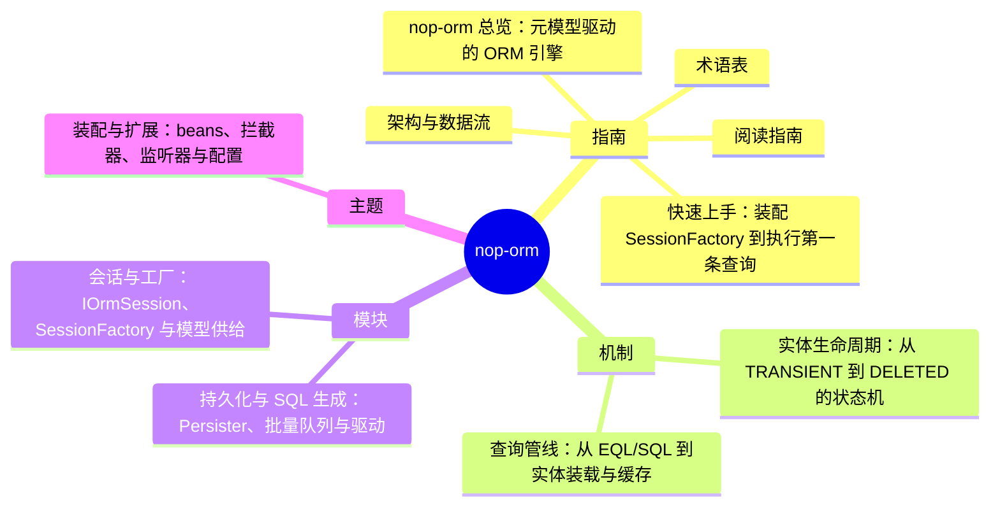

# nop-orm DeepWiki

> 目标：nop-orm · 结构契约：[PLAN.md](./PLAN.md) · 本文件由 gen-wiki-meta.mjs 生成，勿手改

> 快照：nop-orm @ 555f7a9731 · 2026-09-30

## 1. 指南

- 1.1 [nop-orm 总览：元模型驱动的 ORM 引擎](overview.md)
- 1.2 [快速上手：装配 SessionFactory 到执行第一条查询](quickstart.md)
- 1.3 [术语表](glossary.md)
- 1.4 [阅读指南](reading-guide.md)
- 1.5 [架构与数据流](architecture.md)

## 2. 机制

- 2.1 [实体生命周期：从 TRANSIENT 到 DELETED 的状态机](flows/entity-lifecycle.md)
- 2.2 [查询管线：从 EQL/SQL 到实体装载与缓存](flows/query-pipeline.md)

## 3. 模块

- 3.1 [会话与工厂：IOrmSession、SessionFactory 与模型供给](modules/session-factory.md)
- 3.2 [持久化与 SQL 生成：Persister、批量队列与驱动](modules/persister-sql.md)

## 4. 主题

- 4.1 [装配与扩展：beans、拦截器、监听器与配置](topics/assembly-interceptors.md)
