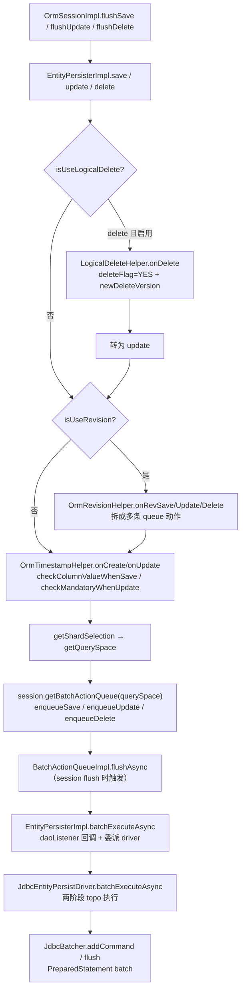
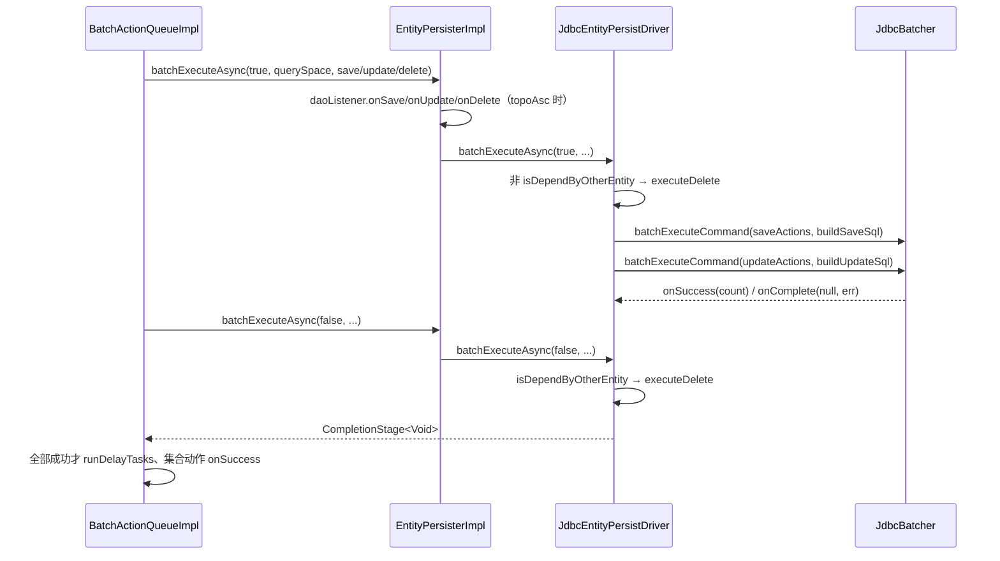

# 持久化与 SQL 生成：Persister、批量队列与驱动

> 本页依据的源文件（仓库相对路径）：
>
> - ../../../nop-persistence/nop-orm/src/main/java/io/nop/orm/persister/IEntityPersister.java
> - ../../../nop-persistence/nop-orm/src/main/java/io/nop/orm/persister/EntityPersisterImpl.java
> - ../../../nop-persistence/nop-orm/src/main/java/io/nop/orm/persister/BatchActionQueueImpl.java
> - ../../../nop-persistence/nop-orm/src/main/java/io/nop/orm/persister/IPersistEnv.java
> - ../../../nop-persistence/nop-orm/src/main/java/io/nop/orm/driver/jdbc/JdbcEntityPersistDriver.java
> - ../../../nop-persistence/nop-orm/src/main/java/io/nop/orm/sql/GenSqlHelper.java
> - ../../../nop-persistence/nop-dao/src/main/java/io/nop/dao/jdbc/JdbcBatcher.java
> - ../../../nop-persistence/nop-orm/src/main/java/io/nop/orm/persister/CollectionPersisterImpl.java

本页覆盖 nop-orm 的写路径：session flush 触发的 save/update/delete 由 EntityPersisterImpl 编排为 IBatchAction 入队，按 querySpace 聚合进 BatchActionQueueImpl，flush 时按实体依赖拓扑分两阶段派发给 IEntityPersistDriver，驱动按方言取预生成 SQL，经 JdbcBatcher 批量执行。读路径见 flows/query-pipeline.md（PLAN 规划），实体状态机见 flows/entity-lifecycle.md（PLAN 规划）。

## 职责与边界：persister、driver、队列三层分工

三层各自屏蔽一类复杂性。`IEntityPersister` 的接口契约写明：负责全局缓存、shard 选择、逻辑删除、batchSize 拆分，内部调用 `IEntityPersistDriver` 完成实际存储（nop-persistence/nop-orm/src/main/java/io/nop/orm/persister/IEntityPersister.java:22-24）。`IEntityPersistDriver` 反向声明自己的边界："具体负责与外部数据源交互的接口。不处理全局缓存和session缓存, 也不处理shard选择"（nop-persistence/nop-orm/src/main/java/io/nop/orm/driver/IEntityPersistDriver.java:24-26）。队列挂在 session 侧，每个 querySpace 一个（nop-persistence/nop-orm/src/main/java/io/nop/orm/session/SessionBatchActionQueue.java:22-25）。

| 类型 | 层次 | 职责 | 关键证据 |
|---|---|---|---|
| EntityPersisterImpl | 编排 | 逻辑删除转 update、租户/过滤绑定、乐观锁与时间戳填充、全局缓存、生成批量动作入队 | nop-persistence/nop-orm/src/main/java/io/nop/orm/persister/EntityPersisterImpl.java:70-101、289-337 |
| CollectionPersisterImpl | 编排 | 集合装载、分片拆分批量装载、集合变更回调入队 | nop-persistence/nop-orm/src/main/java/io/nop/orm/persister/CollectionPersisterImpl.java:82-101、172-183 |
| JdbcEntityPersistDriver | 驱动 | 持有预生成 EntitySQL，按方言执行 insert/update/delete/load/lock | nop-persistence/nop-orm/src/main/java/io/nop/orm/driver/jdbc/JdbcEntityPersistDriver.java:54-97、233-259 |
| JdbcCollectionPersistDriver | 驱动 | 集合单条/批量装载 SQL；flushCollectionChange 为空实现 | nop-persistence/nop-orm/src/main/java/io/nop/orm/driver/jdbc/JdbcCollectionPersistDriver.java:64-67、154-156 |
| BatchActionQueueImpl | 队列 | 按 entityName 聚合动作，两阶段拓扑 flush，失败补发回调 | nop-persistence/nop-orm/src/main/java/io/nop/orm/persister/BatchActionQueueImpl.java:145-239 |
| SessionBatchActionQueue | 队列 | 每 querySpace 一个队列，按名称序 flush | nop-persistence/nop-orm/src/main/java/io/nop/orm/session/SessionBatchActionQueue.java:22-63 |

> Sources: [nop-persistence/nop-orm/src/main/java/io/nop/orm/persister/IEntityPersister.java:22-24](https://gitee.com/canonical-entropy/nop-entropy/blob/f2ecee739b/nop-persistence/nop-orm/src/main/java/io/nop/orm/persister/IEntityPersister.java#L22-L24)、[nop-persistence/nop-orm/src/main/java/io/nop/orm/driver/IEntityPersistDriver.java:24-26](https://gitee.com/canonical-entropy/nop-entropy/blob/f2ecee739b/nop-persistence/nop-orm/src/main/java/io/nop/orm/driver/IEntityPersistDriver.java#L24-L26)、[nop-persistence/nop-orm/src/main/java/io/nop/orm/session/SessionBatchActionQueue.java:22-25](https://gitee.com/canonical-entropy/nop-entropy/blob/f2ecee739b/nop-persistence/nop-orm/src/main/java/io/nop/orm/session/SessionBatchActionQueue.java#L22-L25)、[nop-persistence/nop-orm/src/main/java/io/nop/orm/driver/jdbc/JdbcCollectionPersistDriver.java:154-156](https://gitee.com/canonical-entropy/nop-entropy/blob/f2ecee739b/nop-persistence/nop-orm/src/main/java/io/nop/orm/driver/jdbc/JdbcCollectionPersistDriver.java#L154-L156)

## 装配与初始化：persister 与驱动的创建

SessionFactory 构建期，`PersistEnvBuilder.buildEntityPersisters` 按拓扑序为每个实体模型创建 `EntityPersisterImpl`，配套 `OrmEntityIdGenerator`（nop-persistence/nop-orm/src/main/java/io/nop/orm/factory/PersistEnvBuilder.java:102-130）；`newCollectionPersister` 对每个 to-many 关系创建 `CollectionPersisterImpl`（同文件:132-136）。persister 侧 `init` 做四件事：记录全局缓存开关（模型开关与 `CFG_ENTITY_GLOBAL_CACHE_ENABLED` 取与）、获取全局缓存实例、按 `entityModel.getPersistDriver()` 创建驱动并 init、取实体构造器（nop-persistence/nop-orm/src/main/java/io/nop/orm/persister/EntityPersisterImpl.java:88-102）。`IPersistEnv` 是驱动这些依赖的总入口：`jdbc()`、`txn()`、`getSequenceGenerator()`、`getGlobalCache()`、`createEntityPersistDriver/createCollectionPersistDriver`（nop-persistence/nop-orm/src/main/java/io/nop/orm/persister/IPersistEnv.java:54-73）。

驱动侧 `init` 拿到 jdbcTemplate、按 querySpace 解析方言、构建列绑定器，并预生成五条 SQL：仅修订表才生成 findLatestSql、insertSql、deleteSql、loadSql、lockSql、batchLoadSqlPart（nop-persistence/nop-orm/src/main/java/io/nop/orm/driver/jdbc/JdbcEntityPersistDriver.java:80-97）。预生成意味着同一条 INSERT 语句对象被该实体的所有写操作复用，只有参数在变。

> Sources: [nop-persistence/nop-orm/src/main/java/io/nop/orm/factory/PersistEnvBuilder.java:102-136](https://gitee.com/canonical-entropy/nop-entropy/blob/f2ecee739b/nop-persistence/nop-orm/src/main/java/io/nop/orm/factory/PersistEnvBuilder.java#L102-L136)、[nop-persistence/nop-orm/src/main/java/io/nop/orm/persister/EntityPersisterImpl.java:88-102](https://gitee.com/canonical-entropy/nop-entropy/blob/f2ecee739b/nop-persistence/nop-orm/src/main/java/io/nop/orm/persister/EntityPersisterImpl.java#L88-L102)、[nop-persistence/nop-orm/src/main/java/io/nop/orm/persister/IPersistEnv.java:54-73](https://gitee.com/canonical-entropy/nop-entropy/blob/f2ecee739b/nop-persistence/nop-orm/src/main/java/io/nop/orm/persister/IPersistEnv.java#L54-L73)、[nop-persistence/nop-orm/src/main/java/io/nop/orm/driver/jdbc/JdbcEntityPersistDriver.java:80-97](https://gitee.com/canonical-entropy/nop-entropy/blob/f2ecee739b/nop-persistence/nop-orm/src/main/java/io/nop/orm/driver/jdbc/JdbcEntityPersistDriver.java#L80-L97)

## 写路径控制流：从 save 到入队

`save` 的编排顺序固定：`LogicalDeleteHelper.onSave` 初始化 deleteFlag=0/deleteVersion=0 → `bindFilter` 写入模型过滤字段 → `processTenantId` 校验租户归属 → `processOptimisticLockVersion` 将版本字段初始化为 0 → 若启用修订表则走 `OrmRevisionHelper.onRevSave`，否则 `queueSave`（nop-persistence/nop-orm/src/main/java/io/nop/orm/persister/EntityPersisterImpl.java:289-302）。租户处理中，租户不匹配直接抛 `ERR_ORM_NOT_ALLOW_PROCESS_ENTITY_IN_OTHER_TENANT`（同文件:427-453）。

```java
// EntityPersisterImpl.save 的非修订分支（节选）
protected void queueSave(IOrmEntity entity, IOrmSessionImplementor session) {
    OrmTimestampHelper.instance().onCreate(entityModel, entity);
    this.checkColumnValueWhenSave(entity);
    ShardSelection shard = getShardSelection(entity);
    IBatchAction.EntitySaveAction action = new IBatchAction.EntitySaveAction(entity, shard, (ret, err) -> {
        if (err == null) {
            evictGlobalCache(shard, entity);
            session.persisterPostSave(entity);
        }
    });
    session.getBatchActionQueue(getQuerySpace(shard)).enqueueSave(action);
}
```

`queueSave/queueUpdate/queueDelete` 结构同构：先填时间戳（`OrmTimestampHelper` 的 onCreate/onUpdate 补 creator/updater/createTime/updateTime，nop-persistence/nop-orm/src/main/java/io/nop/orm/persister/OrmTimestampHelper.java:31-113），做必填校验（保存时含默认值、seq 标签与 `CFG_ORM_CHECK_MANDATORY_WHEN_SAVE` 开关，nop-persistence/nop-orm/src/main/java/io/nop/orm/persister/EntityPersisterImpl.java:380-405；更新时受 `CFG_ORM_CHECK_MANDATORY_WHEN_UPDATE` 控制，同文件:471-476），再按分片属性算出 `ShardSelection`，把带回调的动作塞进 session 的队列（同文件:455-503）。update 的回调里做两件事：`checkUpdateResult` 校验影响行数（>1 抛 `ERR_ORM_UPDATE_ENTITY_MULTIPLE_ROWS`，=0 抛 `ERR_ORM_UPDATE_ENTITY_NOT_FOUND`，实体关闭版本检查时降级为 readonly），以及 `incOptimisticLockVersion` 把内存版本号加一以和数据库一致（同文件:371-378、505-521）。

`delete` 的关键分支是逻辑删除：模型启用且未禁用时，`LogicalDeleteHelper.onDelete` 置 deleteFlag=YES_VALUE 并以 `env.newDeleteVersion()` 写 deleteVersion，然后整个操作转为 `update`（nop-persistence/nop-orm/src/main/java/io/nop/orm/persister/EntityPersisterImpl.java:318-325；nop-persistence/nop-orm/src/main/java/io/nop/orm/persister/LogicalDeleteHelper.java:50-65）。物理删除前还要 `syncComponentWhenDelete` 通知需要 flush 的组件（同文件:339-347）。修订表的三个入口则把一次写拆成多条动作：onRevSave 会 queueUpdate 旧记录（关闭其 revEndVer）再 queueSave 新记录（nop-persistence/nop-orm/src/main/java/io/nop/orm/persister/OrmRevisionHelper.java:23-56）。



> Sources: [nop-persistence/nop-orm/src/main/java/io/nop/orm/persister/EntityPersisterImpl.java:289-337](https://gitee.com/canonical-entropy/nop-entropy/blob/f2ecee739b/nop-persistence/nop-orm/src/main/java/io/nop/orm/persister/EntityPersisterImpl.java#L289-L337)、[nop-persistence/nop-orm/src/main/java/io/nop/orm/persister/EntityPersisterImpl.java:455-521](https://gitee.com/canonical-entropy/nop-entropy/blob/f2ecee739b/nop-persistence/nop-orm/src/main/java/io/nop/orm/persister/EntityPersisterImpl.java#L455-L521)、[nop-persistence/nop-orm/src/main/java/io/nop/orm/persister/LogicalDeleteHelper.java:50-65](https://gitee.com/canonical-entropy/nop-entropy/blob/f2ecee739b/nop-persistence/nop-orm/src/main/java/io/nop/orm/persister/LogicalDeleteHelper.java#L50-L65)、[nop-persistence/nop-orm/src/main/java/io/nop/orm/persister/OrmTimestampHelper.java:31-113](https://gitee.com/canonical-entropy/nop-entropy/blob/f2ecee739b/nop-persistence/nop-orm/src/main/java/io/nop/orm/persister/OrmTimestampHelper.java#L31-L113)、[nop-persistence/nop-orm/src/main/java/io/nop/orm/persister/OrmRevisionHelper.java:23-56](https://gitee.com/canonical-entropy/nop-entropy/blob/f2ecee739b/nop-persistence/nop-orm/src/main/java/io/nop/orm/persister/OrmRevisionHelper.java#L23-L56)

## SQL 生成与方言适配

SQL 全部由 `GenSqlHelper` 按 `IDialect` 现场拼装为 `EntitySQL`（语句文本 + propIds + 参数位映射）。INSERT 只包含 `isInsertable()` 的列，参数占位符带类型绑定器并对 TAG_MASKED 列做掩码处理（nop-persistence/nop-orm/src/main/java/io/nop/orm/sql/GenSqlHelper.java:249-288）。UPDATE 有两个决定性细节：

```java
// GenSqlHelper.genUpdateSql（节选）
if (entityModel.getVersionPropId() > 0) {
    IColumnModel col = entityModel.getColumnByPropId(entityModel.getVersionPropId(), false);
    appendCol(sb, dialect, null, col);
    sb.append("=");
    appendCol(sb, dialect, null, col);
    sb.append(" +1,");
}
...
sb.where();
genEntityFilter(params, sb, dialect, null, entityModel, binders);
if (entityModel.getVersionPropId() > 0) {   // WHERE 中再加 version 等值条件
    sb.and();
    ...
}
```

即乐观锁通过 `SET version=version+1` 加 `WHERE version=?` 实现，SET 列只来自调用方传入的 dirty propIds，不可更新列抛 `ERR_ORM_ENTITY_PROP_NOT_UPDATABLE`（nop-persistence/nop-orm/src/main/java/io/nop/orm/sql/GenSqlHelper.java:290-334）。DELETE 的 WHERE 由主键、实体过滤器与可选 version 条件组成（同文件:164-183）。悲观锁 SELECT 依赖方言的 `getLockHintSql`/`getForUpdateSql` 两个钩子（同文件:185-204；nop-persistence/nop-dao/src/main/java/io/nop/dao/dialect/IDialect.java:169-176）。方言插入点还有 `getInsertKeyword`/`getUpdateKeyword`（nop-persistence/nop-dao/src/main/java/io/nop/dao/dialect/IDialect.java:137-141）。

驱动层对 SQL 做分级缓存：insert/delete/findLatest 常驻字段；loadSql/lockSql/batchLoadSqlPart 是 volatile 单槽缓存，属性集合或方言不同则现场重生成，且只回写默认方言的结果以免分片方言污染缓存（nop-persistence/nop-orm/src/main/java/io/nop/orm/driver/jdbc/JdbcEntityPersistDriver.java:58-73、124-148）；update 因列集合随 dirty 集变化，单独用 `lastUpdateSql` 单槽缓存（同文件:281-293）。查询空间不同时分片方言由 `getDialect(shard)` 现场解析（同文件:321-335）。

```mermaid
classDiagram
    class IEntityPersister {
        <<interface>>
        +save(entity, session)
        +update(entity, session)
        +delete(entity, session)
        +batchExecuteAsync(topoAsc, querySpace, saveActions, updateActions, deleteActions, session)
    }
    class IEntityPersistDriver {
        <<interface>>
        +batchExecuteAsync(topoAsc, querySpace, saveActions, updateActions, deleteActions, session)
        +loadAsync(shard, entity, propIds, session)
    }
    class EntityPersisterImpl {
        -IEntityPersistDriver driver
        -IPersistEnv env
        -queueSave(entity, session)
        -queueUpdate(entity, session)
        -queueDelete(entity, session)
    }
    class JdbcEntityPersistDriver {
        -EntitySQL insertSql
        -EntitySQL deleteSql
        -EntitySQL lastUpdateSql
        -buildSaveSql(dialect, action)
        -buildUpdateSql(dialect, action)
        -batchExecuteCommand(conn, actions, sqlCreator)
    }
    class IPersistEnv {
        <<interface>>
        +createEntityPersistDriver(driverName)
        +jdbc() IJdbcTemplate
        +getDialectProvider()
    }
    class IBatchActionQueue {
        <<interface>>
        +enqueueSave(action)
        +enqueueUpdate(action)
        +enqueueDelete(action)
        +flushAsync()
    }
    class BatchActionQueueImpl
    class JdbcBatcher
    class CollectionPersisterImpl
    class JdbcCollectionPersistDriver
    EntityPersisterImpl ..|> IEntityPersister
    JdbcEntityPersistDriver ..|> IEntityPersistDriver
    CollectionPersisterImpl ..|> ICollectionPersister
    JdbcCollectionPersistDriver ..|> ICollectionPersistDriver
    EntityPersisterImpl --> IEntityPersistDriver : 持有并委派
    EntityPersisterImpl --> IPersistEnv : 创建驱动/取方言
    EntityPersisterImpl --> IBatchActionQueue : 经 session 入队
    BatchActionQueueImpl ..|> IBatchActionQueue
    BatchActionQueueImpl --> IEntityPersister : flush 时回调 batchExecuteAsync
    JdbcEntityPersistDriver --> JdbcBatcher : batchExecuteCommand 内创建
```



> Sources: [nop-persistence/nop-orm/src/main/java/io/nop/orm/sql/GenSqlHelper.java:164-334](https://gitee.com/canonical-entropy/nop-entropy/blob/f2ecee739b/nop-persistence/nop-orm/src/main/java/io/nop/orm/sql/GenSqlHelper.java#L164-L334)、[nop-persistence/nop-orm/src/main/java/io/nop/orm/driver/jdbc/JdbcEntityPersistDriver.java:281-335](https://gitee.com/canonical-entropy/nop-entropy/blob/f2ecee739b/nop-persistence/nop-orm/src/main/java/io/nop/orm/driver/jdbc/JdbcEntityPersistDriver.java#L281-L335)、[nop-persistence/nop-dao/src/main/java/io/nop/dao/dialect/IDialect.java:137-176](https://gitee.com/canonical-entropy/nop-entropy/blob/f2ecee739b/nop-persistence/nop-dao/src/main/java/io/nop/dao/dialect/IDialect.java#L137-L176)

## 批量队列与两阶段 flush

session 持有一个 `SessionBatchActionQueue`（nop-persistence/nop-orm/src/main/java/io/nop/orm/session/OrmSessionImpl.java:112），`getBatchActionQueue(querySpace)` 为每个 querySpace 惰性建队列，null 归入 `DEFAULT_QUERY_SPACE`，容器用 TreeMap 保证 flush 顺序确定（nop-persistence/nop-orm/src/main/java/io/nop/orm/session/SessionBatchActionQueue.java:27-43）。flush 的触发点在 `OrmSessionImpl.flushImmediately` 等路径（同文件:1001-1017）。

`BatchActionQueueImpl.flushAsync` 的执行骨架：先对动作覆盖的实体模型做拓扑排序（nop-persistence/nop-orm/src/main/java/io/nop/orm/persister/BatchActionQueueImpl.java:154），然后正序跑一遍 `persister.batchExecuteAsync(true, ...)`——保存与更新在依赖方之前落库，不被依赖的实体的删除也在此阶段执行；再逆序跑一遍 `batchExecuteAsync(false, ...)`——被依赖的实体在此阶段删除。任一阶段出错即中断本阶段（同文件:160-201）。驱动的接口注释明确了这个约定："本函数会被执行两次……一般情况下删除应该在topoDesc阶段执行，其他按照topoAsc阶段执行"（nop-persistence/nop-orm/src/main/java/io/nop/orm/driver/IEntityPersistDriver.java:41-48），JdbcEntityPersistDriver 用 `entityModel.isDependByOtherEntity()` 决定删除落在哪个阶段（nop-persistence/nop-orm/src/main/java/io/nop/orm/driver/jdbc/JdbcEntityPersistDriver.java:239-256）。

合并结构在 `BatchActionHolder`：save 动作进 List；update/delete 动作进以实体 id 字符串为 key 的 TreeMap，注释写明"按照id进行排序，避免更新时发生锁冲突"（nop-persistence/nop-orm/src/main/java/io/nop/orm/persister/BatchActionQueueImpl.java:51-93）。

| 合并/去重条件 | 规则 | 证据 |
|---|---|---|
| 队列归属 | 同一 querySpace 一个队列，队列内按 entityName 聚合 | nop-persistence/nop-orm/src/main/java/io/nop/orm/session/SessionBatchActionQueue.java:27-43；nop-persistence/nop-orm/src/main/java/io/nop/orm/persister/BatchActionQueueImpl.java:100-119 |
| update/delete 同实体去重 | TreeMap 以 `action.getEntityId()` 为 key，同 id 后写覆盖前写，且按 id 排序执行 | nop-persistence/nop-orm/src/main/java/io/nop/orm/persister/BatchActionQueueImpl.java:53-67、88-92 |
| 执行顺序 | 实体模型拓扑排序，正序（save/update + 非被依赖 delete）、逆序（被依赖 delete）两阶段 | nop-persistence/nop-orm/src/main/java/io/nop/orm/persister/BatchActionQueueImpl.java:154-201 |
| JDBC 批合并 | SQL 文本不同立即 flush 前批；同文本命令共用一个 PreparedStatement | nop-persistence/nop-dao/src/main/java/io/nop/dao/jdbc/JdbcBatcher.java:136-146 |
| JDBC 批开关 | `CFG_DAO_JDBC_DISABLE_BATCH_UPDATE` 或 `dialect.isSupportBatchUpdate()`=false 时退化为逐条 executeUpdate | nop-persistence/nop-dao/src/main/java/io/nop/dao/jdbc/JdbcBatcher.java:83-84、156-158 |
| 批大小上限 | 达到 `CFG_DAO_JDBC_MAX_BATCH_UPDATE_SIZE` 即 flush | nop-persistence/nop-dao/src/main/java/io/nop/dao/jdbc/JdbcBatcher.java:60、143-145 |
| 集合变更 | 元素增删已作为实体动作处理，CollectionBatchAction 只承担成功后失效全局缓存的回调 | nop-persistence/nop-orm/src/main/java/io/nop/orm/session/CascadeFlusher.java:391-393；nop-persistence/nop-orm/src/main/java/io/nop/orm/persister/CollectionPersisterImpl.java:172-183 |

集合这条容易误读：`flushCollectionChange` 并不生成集合 SQL——`JdbcCollectionPersistDriver` 的同名方法是空实现（nop-persistence/nop-orm/src/main/java/io/nop/orm/driver/jdbc/JdbcCollectionPersistDriver.java:154-156）。`CollectionBatchAction` 在构造时暂存 `orm_removed()` 快照（nop-persistence/nop-orm/src/main/java/io/nop/orm/persister/IBatchAction.java:130-137），flush 成功后统一回调 `onSuccess` 用于缓存失效，失败则补发 `onFailure`（nop-persistence/nop-orm/src/main/java/io/nop/orm/persister/BatchActionQueueImpl.java:221-230）。

> Sources: [nop-persistence/nop-orm/src/main/java/io/nop/orm/persister/BatchActionQueueImpl.java:145-239](https://gitee.com/canonical-entropy/nop-entropy/blob/f2ecee739b/nop-persistence/nop-orm/src/main/java/io/nop/orm/persister/BatchActionQueueImpl.java#L145-L239)、[nop-persistence/nop-orm/src/main/java/io/nop/orm/persister/BatchActionQueueImpl.java:51-93](https://gitee.com/canonical-entropy/nop-entropy/blob/f2ecee739b/nop-persistence/nop-orm/src/main/java/io/nop/orm/persister/BatchActionQueueImpl.java#L51-L93)、[nop-persistence/nop-orm/src/main/java/io/nop/orm/driver/IEntityPersistDriver.java:41-48](https://gitee.com/canonical-entropy/nop-entropy/blob/f2ecee739b/nop-persistence/nop-orm/src/main/java/io/nop/orm/driver/IEntityPersistDriver.java#L41-L48)、[nop-persistence/nop-orm/src/main/java/io/nop/orm/driver/jdbc/JdbcEntityPersistDriver.java:233-259](https://gitee.com/canonical-entropy/nop-entropy/blob/f2ecee739b/nop-persistence/nop-orm/src/main/java/io/nop/orm/driver/jdbc/JdbcEntityPersistDriver.java#L233-L259)、[nop-persistence/nop-orm/src/main/java/io/nop/orm/session/CascadeFlusher.java:391-393](https://gitee.com/canonical-entropy/nop-entropy/blob/f2ecee739b/nop-persistence/nop-orm/src/main/java/io/nop/orm/session/CascadeFlusher.java#L391-L393)

## JDBC 执行：JdbcBatcher 的批语义与失败契约

驱动层 `batchExecuteCommand` 把动作列表转成 SQL 后交给一个 `JdbcBatcher`：逐条 `addCommand(sql, true, action.getCallback())`，最后 `flush()`（nop-persistence/nop-orm/src/main/java/io/nop/orm/driver/jdbc/JdbcEntityPersistDriver.java:303-319）。JdbcBatcher 内部的合并与失败规则：

- 文本切换即分批：队列中已有命令且 SQL 文本不同，先 flush 再入队（nop-persistence/nop-dao/src/main/java/io/nop/dao/jdbc/JdbcBatcher.java:136-146）。
- 成功路径：`executeBatch` 返回后先处理 batch 自建事务的 commit，再逐条回调；`SUCCESS_NO_INFO`(-2) 归一化为 1，避免上层 `checkUpdateResult` 把 -2 误判为多行更新（同文件:179-196、354-366）。
- 失败路径：`BatchUpdateException` 按驱动返回的 updateCounts 逐条回调成败；残留命令（驱动中途停止、状态未知）统一回调失败并清空队列，不允许混入下一批；每条命令必须恰好收到一次回调（同文件:198-255、337-342）。
- `EXECUTE_FAILED` 按影响 0 行回调，让上层乐观锁检查能发现失败（同文件:344-352）。



> Sources: [nop-persistence/nop-orm/src/main/java/io/nop/orm/driver/jdbc/JdbcEntityPersistDriver.java:303-319](https://gitee.com/canonical-entropy/nop-entropy/blob/f2ecee739b/nop-persistence/nop-orm/src/main/java/io/nop/orm/driver/jdbc/JdbcEntityPersistDriver.java#L303-L319)、[nop-persistence/nop-dao/src/main/java/io/nop/dao/jdbc/JdbcBatcher.java:136-146](https://gitee.com/canonical-entropy/nop-entropy/blob/f2ecee739b/nop-persistence/nop-dao/src/main/java/io/nop/dao/jdbc/JdbcBatcher.java#L136-L146)、[nop-persistence/nop-dao/src/main/java/io/nop/dao/jdbc/JdbcBatcher.java:198-255](https://gitee.com/canonical-entropy/nop-entropy/blob/f2ecee739b/nop-persistence/nop-dao/src/main/java/io/nop/dao/jdbc/JdbcBatcher.java#L198-L255)、[nop-persistence/nop-dao/src/main/java/io/nop/dao/jdbc/JdbcBatcher.java:337-366](https://gitee.com/canonical-entropy/nop-entropy/blob/f2ecee739b/nop-persistence/nop-dao/src/main/java/io/nop/dao/jdbc/JdbcBatcher.java#L337-L366)

## 不变式与失败处理

- **回调恰好一次**：flush 中断时，未提交的实体模型动作由 `notifyUnsubmittedFailure` 补发失败通知——正序阶段失败下标之后的模型补 save/update/delete，逆序阶段失败下标之前被其他实体依赖的模型补 delete（nop-persistence/nop-orm/src/main/java/io/nop/orm/persister/BatchActionQueueImpl.java:204-208、241-277）。
- **flush 后提交前不留脏回调**：`flushAsync` 在 finally 中清空 actionMap/delayTasks/collectionActions 并复位 flushing（同文件:232-238）；waitAll 结果与提交阶段错误双重检查，防止部分 future 实现不透传异常（同文件:210-216）。
- **乐观锁闭环**：UPDATE 语句带 version 条件，影响行数 0/1/多行分别映射为 NOT_FOUND/正常/MULTIPLE_ROWS 错误，成功后内存版本 +1（nop-persistence/nop-orm/src/main/java/io/nop/orm/sql/GenSqlHelper.java:327-332；nop-persistence/nop-orm/src/main/java/io/nop/orm/persister/EntityPersisterImpl.java:371-378、505-521）。
- **缓存失效不早于提交**：全局缓存 evict 在事务已开启时注册 `onAfterCommit` 监听，否则立即移除（nop-persistence/nop-orm/src/main/java/io/nop/orm/persister/EntityPersisterImpl.java:550-566；CollectionPersisterImpl.java:207-223）。
- **锁必须在事务内**：`lock` 执行 select for update，事务未开抛 `ERR_ORM_LOCK_MUST_RUN_IN_TXN`（nop-persistence/nop-orm/src/main/java/io/nop/orm/driver/jdbc/JdbcEntityPersistDriver.java:162-165）。
- **逻辑删除一致性**：save 时初始化 deleteFlag=0，by-example 查询自动附加 deleteFlag=NO_VALUE 条件（nop-persistence/nop-orm/src/main/java/io/nop/orm/persister/LogicalDeleteHelper.java:28-48；nop-persistence/nop-orm/src/main/java/io/nop/orm/persister/EntityPersisterImpl.java:756-760）。

> Sources: [nop-persistence/nop-orm/src/main/java/io/nop/orm/persister/BatchActionQueueImpl.java:204-277](https://gitee.com/canonical-entropy/nop-entropy/blob/f2ecee739b/nop-persistence/nop-orm/src/main/java/io/nop/orm/persister/BatchActionQueueImpl.java#L204-L277)、[nop-persistence/nop-orm/src/main/java/io/nop/orm/persister/EntityPersisterImpl.java:505-566](https://gitee.com/canonical-entropy/nop-entropy/blob/f2ecee739b/nop-persistence/nop-orm/src/main/java/io/nop/orm/persister/EntityPersisterImpl.java#L505-L566)、[nop-persistence/nop-dao/src/main/java/io/nop/dao/jdbc/JdbcBatcher.java:337-366](https://gitee.com/canonical-entropy/nop-entropy/blob/f2ecee739b/nop-persistence/nop-dao/src/main/java/io/nop/dao/jdbc/JdbcBatcher.java#L337-L366)、[nop-persistence/nop-orm/src/main/java/io/nop/orm/driver/jdbc/JdbcEntityPersistDriver.java:162-165](https://gitee.com/canonical-entropy/nop-entropy/blob/f2ecee739b/nop-persistence/nop-orm/src/main/java/io/nop/orm/driver/jdbc/JdbcEntityPersistDriver.java#L162-L165)

## 扩展点与配置

- **驱动可替换**：驱动名来自模型 `entityModel.getPersistDriver()`，由 `IPersistEnv.createEntityPersistDriver` 实例化，非 JDBC 存储可实现自己的 `IEntityPersistDriver`（nop-persistence/nop-orm/src/main/java/io/nop/orm/persister/EntityPersisterImpl.java:96；nop-persistence/nop-orm/src/main/java/io/nop/orm/persister/IPersistEnv.java:56-58）。
- **IOrmDaoListener 写钩子**：`batchExecuteAsync` 在 topoAsc 阶段按动作类型回调 onSave/onUpdate/onDelete；by-example 查询回调 onRead（nop-persistence/nop-orm/src/main/java/io/nop/orm/persister/EntityPersisterImpl.java:635-651、659-730）。拦截器与装配全景见 [../topics/assembly-interceptors.md](../topics/assembly-interceptors.md)。
- **时间戳助手可替换**：`OrmTimestampHelper.registerInstance` 支持替换单例（nop-persistence/nop-orm/src/main/java/io/nop/orm/persister/OrmTimestampHelper.java:27-29）。
- **行为开关**：`CFG_ENTITY_GLOBAL_CACHE_ENABLED`（全局缓存总开关）、`CFG_ORM_CHECK_MANDATORY_WHEN_SAVE/WHEN_UPDATE`（必填校验）、`CFG_ORM_DEFAULT_ENTITY_BATCH_LOAD_SIZE`（批量装载缺省大小，nop-persistence/nop-orm/src/main/java/io/nop/orm/persister/EntityPersisterImpl.java:104-109）、`CFG_DAO_JDBC_MAX_BATCH_UPDATE_SIZE`/`CFG_DAO_JDBC_DISABLE_BATCH_UPDATE`（JDBC 批大小与开关，nop-persistence/nop-dao/src/main/java/io/nop/dao/jdbc/JdbcBatcher.java:31-32、83-84）。
- **实体级关闭行为**：`orm_disableLogicalDelete()`、`orm_disableAutoStamp()`、`orm_disableVersionCheckError()` 分别关闭逻辑删除、自动时间戳、版本检查报错（nop-persistence/nop-orm/src/main/java/io/nop/orm/persister/EntityPersisterImpl.java:320、507-516；nop-persistence/nop-orm/src/main/java/io/nop/orm/persister/OrmTimestampHelper.java:32-33）。

相关页面：架构全景 architecture.md（PLAN 规划）、模块总览 overview.md（PLAN 规划）、术语表 [../glossary.md](../glossary.md)、阅读顺序 reading-guide.md（PLAN 规划）、装配上手 [../quickstart.md](../quickstart.md)、会话与工厂 [session-factory.md](session-factory.md)。

> Sources: [nop-persistence/nop-orm/src/main/java/io/nop/orm/persister/EntityPersisterImpl.java:635-651](https://gitee.com/canonical-entropy/nop-entropy/blob/f2ecee739b/nop-persistence/nop-orm/src/main/java/io/nop/orm/persister/EntityPersisterImpl.java#L635-L651)、[nop-persistence/nop-orm/src/main/java/io/nop/orm/persister/IPersistEnv.java:56-58](https://gitee.com/canonical-entropy/nop-entropy/blob/f2ecee739b/nop-persistence/nop-orm/src/main/java/io/nop/orm/persister/IPersistEnv.java#L56-L58)、[nop-persistence/nop-orm/src/main/java/io/nop/orm/persister/OrmTimestampHelper.java:27-29](https://gitee.com/canonical-entropy/nop-entropy/blob/f2ecee739b/nop-persistence/nop-orm/src/main/java/io/nop/orm/persister/OrmTimestampHelper.java#L27-L29)、[nop-persistence/nop-dao/src/main/java/io/nop/dao/jdbc/JdbcBatcher.java:31-32](https://gitee.com/canonical-entropy/nop-entropy/blob/f2ecee739b/nop-persistence/nop-dao/src/main/java/io/nop/dao/jdbc/JdbcBatcher.java#L31-L32)

## Sources

- [nop-persistence/nop-orm/src/main/java/io/nop/orm/persister/IEntityPersister.java:22-24](https://gitee.com/canonical-entropy/nop-entropy/blob/f2ecee739b/nop-persistence/nop-orm/src/main/java/io/nop/orm/persister/IEntityPersister.java#L22-L24)
- [nop-persistence/nop-orm/src/main/java/io/nop/orm/persister/EntityPersisterImpl.java:88-102](https://gitee.com/canonical-entropy/nop-entropy/blob/f2ecee739b/nop-persistence/nop-orm/src/main/java/io/nop/orm/persister/EntityPersisterImpl.java#L88-L102)
- [nop-persistence/nop-orm/src/main/java/io/nop/orm/persister/EntityPersisterImpl.java:289-337](https://gitee.com/canonical-entropy/nop-entropy/blob/f2ecee739b/nop-persistence/nop-orm/src/main/java/io/nop/orm/persister/EntityPersisterImpl.java#L289-L337)
- [nop-persistence/nop-orm/src/main/java/io/nop/orm/persister/EntityPersisterImpl.java:455-521](https://gitee.com/canonical-entropy/nop-entropy/blob/f2ecee739b/nop-persistence/nop-orm/src/main/java/io/nop/orm/persister/EntityPersisterImpl.java#L455-L521)
- [nop-persistence/nop-orm/src/main/java/io/nop/orm/persister/EntityPersisterImpl.java:550-587](https://gitee.com/canonical-entropy/nop-entropy/blob/f2ecee739b/nop-persistence/nop-orm/src/main/java/io/nop/orm/persister/EntityPersisterImpl.java#L550-L587)
- [nop-persistence/nop-orm/src/main/java/io/nop/orm/persister/EntityPersisterImpl.java:635-651](https://gitee.com/canonical-entropy/nop-entropy/blob/f2ecee739b/nop-persistence/nop-orm/src/main/java/io/nop/orm/persister/EntityPersisterImpl.java#L635-L651)
- [nop-persistence/nop-orm/src/main/java/io/nop/orm/persister/EntityPersisterImpl.java:756-760](https://gitee.com/canonical-entropy/nop-entropy/blob/f2ecee739b/nop-persistence/nop-orm/src/main/java/io/nop/orm/persister/EntityPersisterImpl.java#L756-L760)
- [nop-persistence/nop-orm/src/main/java/io/nop/orm/persister/CollectionPersisterImpl.java:82-183](https://gitee.com/canonical-entropy/nop-entropy/blob/f2ecee739b/nop-persistence/nop-orm/src/main/java/io/nop/orm/persister/CollectionPersisterImpl.java#L82-L183)
- [nop-persistence/nop-orm/src/main/java/io/nop/orm/persister/CollectionPersisterImpl.java:207-223](https://gitee.com/canonical-entropy/nop-entropy/blob/f2ecee739b/nop-persistence/nop-orm/src/main/java/io/nop/orm/persister/CollectionPersisterImpl.java#L207-L223)
- [nop-persistence/nop-orm/src/main/java/io/nop/orm/persister/BatchActionQueueImpl.java:51-93](https://gitee.com/canonical-entropy/nop-entropy/blob/f2ecee739b/nop-persistence/nop-orm/src/main/java/io/nop/orm/persister/BatchActionQueueImpl.java#L51-L93)
- [nop-persistence/nop-orm/src/main/java/io/nop/orm/persister/BatchActionQueueImpl.java:145-239](https://gitee.com/canonical-entropy/nop-entropy/blob/f2ecee739b/nop-persistence/nop-orm/src/main/java/io/nop/orm/persister/BatchActionQueueImpl.java#L145-L239)
- [nop-persistence/nop-orm/src/main/java/io/nop/orm/persister/BatchActionQueueImpl.java:241-289](https://gitee.com/canonical-entropy/nop-entropy/blob/f2ecee739b/nop-persistence/nop-orm/src/main/java/io/nop/orm/persister/BatchActionQueueImpl.java#L241-L289)
- [nop-persistence/nop-orm/src/main/java/io/nop/orm/persister/IBatchAction.java:114-137](https://gitee.com/canonical-entropy/nop-entropy/blob/f2ecee739b/nop-persistence/nop-orm/src/main/java/io/nop/orm/persister/IBatchAction.java#L114-L137)
- [nop-persistence/nop-orm/src/main/java/io/nop/orm/persister/IPersistEnv.java:54-73](https://gitee.com/canonical-entropy/nop-entropy/blob/f2ecee739b/nop-persistence/nop-orm/src/main/java/io/nop/orm/persister/IPersistEnv.java#L54-L73)
- [nop-persistence/nop-orm/src/main/java/io/nop/orm/persister/LogicalDeleteHelper.java:28-65](https://gitee.com/canonical-entropy/nop-entropy/blob/f2ecee739b/nop-persistence/nop-orm/src/main/java/io/nop/orm/persister/LogicalDeleteHelper.java#L28-L65)
- [nop-persistence/nop-orm/src/main/java/io/nop/orm/persister/OrmTimestampHelper.java:31-113](https://gitee.com/canonical-entropy/nop-entropy/blob/f2ecee739b/nop-persistence/nop-orm/src/main/java/io/nop/orm/persister/OrmTimestampHelper.java#L31-L113)
- [nop-persistence/nop-orm/src/main/java/io/nop/orm/persister/OrmRevisionHelper.java:23-56](https://gitee.com/canonical-entropy/nop-entropy/blob/f2ecee739b/nop-persistence/nop-orm/src/main/java/io/nop/orm/persister/OrmRevisionHelper.java#L23-L56)
- [nop-persistence/nop-orm/src/main/java/io/nop/orm/persister/OrmAssembly.java:121-172](https://gitee.com/canonical-entropy/nop-entropy/blob/f2ecee739b/nop-persistence/nop-orm/src/main/java/io/nop/orm/persister/OrmAssembly.java#L121-L172)
- [nop-persistence/nop-orm/src/main/java/io/nop/orm/session/SessionBatchActionQueue.java:22-63](https://gitee.com/canonical-entropy/nop-entropy/blob/f2ecee739b/nop-persistence/nop-orm/src/main/java/io/nop/orm/session/SessionBatchActionQueue.java#L22-L63)
- [nop-persistence/nop-orm/src/main/java/io/nop/orm/session/OrmSessionImpl.java:1001-1045](https://gitee.com/canonical-entropy/nop-entropy/blob/f2ecee739b/nop-persistence/nop-orm/src/main/java/io/nop/orm/session/OrmSessionImpl.java#L1001-L1045)
- [nop-persistence/nop-orm/src/main/java/io/nop/orm/session/CascadeFlusher.java:391-393](https://gitee.com/canonical-entropy/nop-entropy/blob/f2ecee739b/nop-persistence/nop-orm/src/main/java/io/nop/orm/session/CascadeFlusher.java#L391-L393)
- [nop-persistence/nop-orm/src/main/java/io/nop/orm/factory/PersistEnvBuilder.java:102-136](https://gitee.com/canonical-entropy/nop-entropy/blob/f2ecee739b/nop-persistence/nop-orm/src/main/java/io/nop/orm/factory/PersistEnvBuilder.java#L102-L136)
- [nop-persistence/nop-orm/src/main/java/io/nop/orm/driver/IEntityPersistDriver.java:24-51](https://gitee.com/canonical-entropy/nop-entropy/blob/f2ecee739b/nop-persistence/nop-orm/src/main/java/io/nop/orm/driver/IEntityPersistDriver.java#L24-L51)
- [nop-persistence/nop-orm/src/main/java/io/nop/orm/driver/jdbc/JdbcEntityPersistDriver.java:80-97](https://gitee.com/canonical-entropy/nop-entropy/blob/f2ecee739b/nop-persistence/nop-orm/src/main/java/io/nop/orm/driver/jdbc/JdbcEntityPersistDriver.java#L80-L97)
- [nop-persistence/nop-orm/src/main/java/io/nop/orm/driver/jdbc/JdbcEntityPersistDriver.java:233-335](https://gitee.com/canonical-entropy/nop-entropy/blob/f2ecee739b/nop-persistence/nop-orm/src/main/java/io/nop/orm/driver/jdbc/JdbcEntityPersistDriver.java#L233-L335)
- [nop-persistence/nop-orm/src/main/java/io/nop/orm/driver/jdbc/JdbcCollectionPersistDriver.java:154-156](https://gitee.com/canonical-entropy/nop-entropy/blob/f2ecee739b/nop-persistence/nop-orm/src/main/java/io/nop/orm/driver/jdbc/JdbcCollectionPersistDriver.java#L154-L156)
- [nop-persistence/nop-orm/src/main/java/io/nop/orm/sql/GenSqlHelper.java:164-334](https://gitee.com/canonical-entropy/nop-entropy/blob/f2ecee739b/nop-persistence/nop-orm/src/main/java/io/nop/orm/sql/GenSqlHelper.java#L164-L334)
- [nop-persistence/nop-dao/src/main/java/io/nop/dao/dialect/IDialect.java:137-176](https://gitee.com/canonical-entropy/nop-entropy/blob/f2ecee739b/nop-persistence/nop-dao/src/main/java/io/nop/dao/dialect/IDialect.java#L137-L176)
- [nop-persistence/nop-dao/src/main/java/io/nop/dao/jdbc/JdbcBatcher.java:79-146](https://gitee.com/canonical-entropy/nop-entropy/blob/f2ecee739b/nop-persistence/nop-dao/src/main/java/io/nop/dao/jdbc/JdbcBatcher.java#L79-L146)
- [nop-persistence/nop-dao/src/main/java/io/nop/dao/jdbc/JdbcBatcher.java:198-255](https://gitee.com/canonical-entropy/nop-entropy/blob/f2ecee739b/nop-persistence/nop-dao/src/main/java/io/nop/dao/jdbc/JdbcBatcher.java#L198-L255)
- [nop-persistence/nop-dao/src/main/java/io/nop/dao/jdbc/JdbcBatcher.java:337-366](https://gitee.com/canonical-entropy/nop-entropy/blob/f2ecee739b/nop-persistence/nop-dao/src/main/java/io/nop/dao/jdbc/JdbcBatcher.java#L337-L366)

---

## On this page

- 职责与边界：persister、driver、队列三层分工
- 装配与初始化：persister 与驱动的创建
- 写路径控制流：从 save 到入队
- SQL 生成与方言适配
- 批量队列与两阶段 flush
- JDBC 执行：JdbcBatcher 的批语义与失败契约
- 不变式与失败处理
- 扩展点与配置
