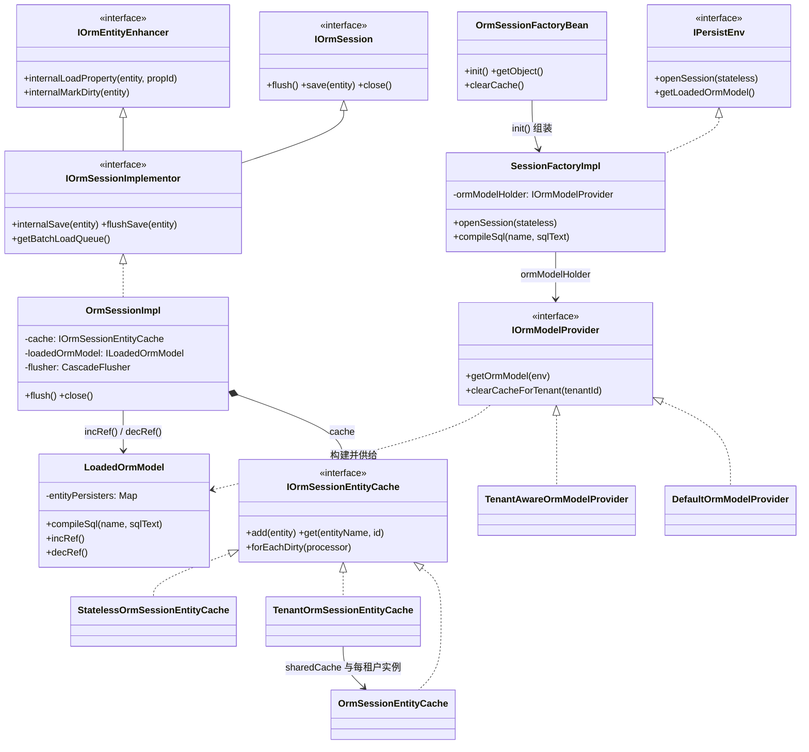
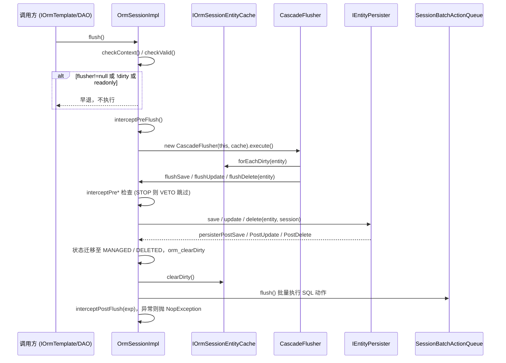
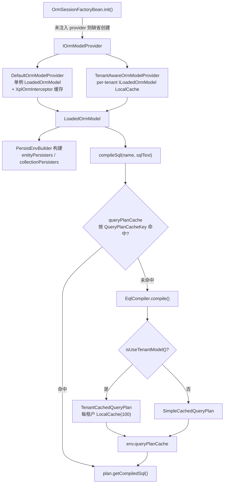

# 会话与工厂：IOrmSession、SessionFactory 与模型供给

> 本页依据的源文件（相对本页目录 `deepwiki/nop-orm/modules/`，均已验证存在）：
>
> - ../../../nop-persistence/nop-orm/src/main/java/io/nop/orm/session/IOrmSessionImplementor.java
> - ../../../nop-persistence/nop-orm/src/main/java/io/nop/orm/session/OrmSessionImpl.java
> - ../../../nop-persistence/nop-orm/src/main/java/io/nop/orm/session/OrmSessionEntityCache.java
> - ../../../nop-persistence/nop-orm/src/main/java/io/nop/orm/factory/SessionFactoryImpl.java
> - ../../../nop-persistence/nop-orm/src/main/java/io/nop/orm/factory/OrmSessionFactoryBean.java
> - ../../../nop-persistence/nop-orm/src/main/java/io/nop/orm/factory/DefaultOrmModelProvider.java
> - ../../../nop-persistence/nop-orm/src/main/java/io/nop/orm/factory/LoadedOrmModel.java

session 包实现 Hibernate 式会话语义：实体状态迁移、一级缓存、级联 flush 与批量动作编排集中在 `OrmSessionImpl`；factory 包组装 `SessionFactoryImpl`，经 `IOrmModelProvider` 供给元模型、persister 与 EQL 编译缓存。本页梳理两包类型职责、三种一级缓存实现的分化、租户模型缓存与实体增强契约。正文引用以包根 `nop-persistence/nop-orm/src/main/java/io/nop/orm/` 为基准，形如 `session/OrmSessionImpl.java:906-948`。

## 职责与边界

两包的分工由类注释直接声明：`OrmSessionImpl` 的类级注释写明"所有实体状态变迁均在此类中完成"（session/OrmSessionImpl.java:87-92）；`IOrmSessionImplementor` 接口注释给出保存主路径 `session.save(entity) --> session.internalSave(entity)`，实体先登记到 sessionEntityCache，等待 `session.flush` 时经 `flushSave --> persister.save --> persisterPostSave` 落库（session/IOrmSessionImplementor.java:25-29）。

- **session 包**：会话 API 与内部实现（`IOrmSession`/`IOrmSessionImplementor`/`OrmSessionImpl`）、一级缓存三实现（`OrmSessionEntityCache`/`TenantOrmSessionEntityCache`/`StatelessOrmSessionEntityCache`）、级联 flush（`CascadeFlusher`）、批量动作队列门面（`SessionBatchActionQueue`）。
- **factory 包**：`IPersistEnv` 的唯一标准实现 `SessionFactoryImpl`（factory/SessionFactoryImpl.java:64）、IoC 生命周期封装 `OrmSessionFactoryBean`（factory/OrmSessionFactoryBean.java:40）、模型供给 `IOrmModelProvider` 及其缺省/租户实现、编译产物持有者 `LoadedOrmModel`。
- **不实现的部分**：元模型来自 nop-orm-model，EQL 编译器来自 nop-orm-eql，JDBC 执行来自 nop-dao，本模块只消费；四个边界的关系见 架构与数据流（architecture.md，PLAN 规划）。

> Sources: [session/IOrmSessionImplementor.java:25-45](https://gitee.com/canonical-entropy/nop-entropy/blob/f2ecee739b/_tmp/rw-clone/nop-persistence/nop-orm/src/main/java/io/nop/orm/session/IOrmSessionImplementor.java#L25-L45)、[session/OrmSessionImpl.java:87-92](https://gitee.com/canonical-entropy/nop-entropy/blob/f2ecee739b/_tmp/rw-clone/nop-persistence/nop-orm/src/main/java/io/nop/orm/session/OrmSessionImpl.java#L87-L92)、[factory/SessionFactoryImpl.java:61-64](https://gitee.com/canonical-entropy/nop-entropy/blob/f2ecee739b/_tmp/rw-clone/nop-persistence/nop-orm/src/main/java/io/nop/orm/factory/SessionFactoryImpl.java#L61-L64)

## 类型关系总览



接口继承关系是理解本模块的钥匙：`IOrmSessionImplementor` 同时继承 `IOrmSession`（会话 API，`extends AutoCloseable`，IOrmSession.java:24）、`IOrmEntityEnhancer`（实体回调契约，IOrmEntityEnhancer.java:16-51）和 `IEqlQueryContext`（查询上下文），三合一声明于 session/IOrmSessionImplementor.java:30。生成的实体类持有 enhancer 引用即 session 本身，懒加载与脏标记都通过 `internal*` 方法回调回会话。

| 类型 | 包 | 职责 | 关键引用 |
|---|---|---|---|
| `IOrmSession` | 根 | 会话公开 API，AutoCloseable | IOrmSession.java:24 |
| `IOrmSessionImplementor` | session | API+增强回调+查询上下文三合一内部契约 | session/IOrmSessionImplementor.java:30 |
| `OrmSessionImpl` | session | 状态迁移、flush 编排、代理创建、拦截器链 | session/OrmSessionImpl.java:92 |
| `IOrmSessionEntityCache` | session | 一级缓存抽象：增删查、脏标记、遍历协议 | session/IOrmSessionEntityCache.java:17-56 |
| `OrmSessionEntityCache` 等 | session | 三种缓存实现，见下表 | session/OrmSessionEntityCache.java:27 |
| `SessionFactoryImpl` | factory | `IPersistEnv` 实现：开 session、编译 SQL、驱动/执行器路由 | factory/SessionFactoryImpl.java:64 |
| `OrmSessionFactoryBean` | factory | IoC 生命周期、缓存容量刷新、缺省装配 | factory/OrmSessionFactoryBean.java:40 |
| `IOrmModelProvider` | factory | 模型供给抽象，可按租户分化 | factory/IOrmModelProvider.java:6-11 |
| `LoadedOrmModel` | factory | 持有元模型、persister 表、编译缓存入口，引用计数 | factory/LoadedOrmModel.java:27-52 |

> Sources: [session/IOrmSessionImplementor.java:30-81](https://gitee.com/canonical-entropy/nop-entropy/blob/f2ecee739b/_tmp/rw-clone/nop-persistence/nop-orm/src/main/java/io/nop/orm/session/IOrmSessionImplementor.java#L30-L81)、[IOrmEntityEnhancer.java:16-51](https://gitee.com/canonical-entropy/nop-entropy/blob/f2ecee739b/_tmp/rw-clone/nop-persistence/nop-orm/src/main/java/io/nop/orm/IOrmEntityEnhancer.java#L16-L51)、[factory/SessionFactoryImpl.java:64-104](https://gitee.com/canonical-entropy/nop-entropy/blob/f2ecee739b/_tmp/rw-clone/nop-persistence/nop-orm/src/main/java/io/nop/orm/factory/SessionFactoryImpl.java#L64-L104)、[factory/LoadedOrmModel.java:27-52](https://gitee.com/canonical-entropy/nop-entropy/blob/f2ecee739b/_tmp/rw-clone/nop-persistence/nop-orm/src/main/java/io/nop/orm/factory/LoadedOrmModel.java#L27-L52)

## 会话生命周期：打开、校验与关闭

**打开**：`SessionFactoryImpl.openSession(stateless)` 直接 `new OrmSessionImpl(stateless, this, getInterceptors())`（factory/SessionFactoryImpl.java:322-325）。构造器里发生三件事：对 `loadedOrmModel` 计数加一（session/OrmSessionImpl.java:127-128）；按条件选择缓存实现——stateless 用 `StatelessOrmSessionEntityCache`，否则模型含租户实体（`loadedOrmModel.isAnyEntityUseTenant()`，ILoadedOrmModel.java:30-32）时用 `TenantOrmSessionEntityCache`，否则普通 `OrmSessionEntityCache`（session/OrmSessionImpl.java:129-130）；上报 `onSessionOpen` 指标（session/OrmSessionImpl.java:134）。

```java
this.cache = stateless ? new StatelessOrmSessionEntityCache(this) :
        (loadedOrmModel.isAnyEntityUseTenant() ? new TenantOrmSessionEntityCache(this) : new OrmSessionEntityCache(this));
```

**校验**：每个公开操作先过两道闸。`checkContext()` 在开启 `CFG_ORM_SESSION_CHECK_CONTEXT` 时校验操作仍运行在 session 创建时的 context 上，防止跨线程串用（session/OrmSessionImpl.java:121, 226-229）；`checkValid()` 对 closed 会话抛 `ERR_ORM_SESSION_CLOSED`（session/OrmSessionImpl.java:231-234），实体/集合级重载进一步要求 `entity.orm_enhancer() == this`，即该实体确实绑定在本会话（session/OrmSessionImpl.java:236-246）。写操作另过 `checkNotReadOnly()`（session/OrmSessionImpl.java:248-251）。唯一例外：`newEntity` 在会话关闭后也允许调用（session/OrmSessionImpl.java:328-333）。

**加载与代理**：`load`/`get` 底层都是 `makeProxy`——无主键实体直接造 PROXY 占位；否则先查一级缓存命中即返回，未命中则建 PROXY 实体、初始化集合代理属性后入缓存（session/OrmSessionImpl.java:781-822）。`get` 与 `load` 的差别在于 `get` 会触发 `internalLoad` 真正查库，记录不存在返回 null，已删除（isGone）也返回 null（session/OrmSessionImpl.java:336-352）。

**关闭**：`close()` 幂等（closed 哨兵），依次上报指标、`loadedOrmModel.decRef()`、清空一级缓存与 sessionCache、执行 `addOnClose` 注册的回调（回调异常只记日志不中断，session/OrmSessionImpl.java:756-779）。`decRef` 归零且已标记 `needClose` 时才真正销毁 persister，实现"有引用则延迟销毁"（factory/LoadedOrmModel.java:145-173）。

> Sources: [session/OrmSessionImpl.java:125-135](https://gitee.com/canonical-entropy/nop-entropy/blob/f2ecee739b/_tmp/rw-clone/nop-persistence/nop-orm/src/main/java/io/nop/orm/session/OrmSessionImpl.java#L125-L135)、[session/OrmSessionImpl.java:756-779](https://gitee.com/canonical-entropy/nop-entropy/blob/f2ecee739b/_tmp/rw-clone/nop-persistence/nop-orm/src/main/java/io/nop/orm/session/OrmSessionImpl.java#L756-L779)、[factory/SessionFactoryImpl.java:322-325](https://gitee.com/canonical-entropy/nop-entropy/blob/f2ecee739b/_tmp/rw-clone/nop-persistence/nop-orm/src/main/java/io/nop/orm/factory/SessionFactoryImpl.java#L322-L325)、[factory/LoadedOrmModel.java:145-173](https://gitee.com/canonical-entropy/nop-entropy/blob/f2ecee739b/_tmp/rw-clone/nop-persistence/nop-orm/src/main/java/io/nop/orm/factory/LoadedOrmModel.java#L145-L173)

## 一级缓存：结构与遍历协议

`OrmSessionEntityCache` 是两级 Map：外层 `Map<entityName, EntityCache>`，内层 `EntityCache` 用 `LinkedHashMap<id, entity>` 保持实体处理顺序——注释明确这是为了让执行过程可复现，便于录制回放式自动化测试（session/OrmSessionEntityCache.java:33, 55-56）。`add` 时 `orm_attach(session)`，`clear`/`remove` 时 `orm_detach`，缓存与 session 的绑定/解绑在这里自动完成（session/OrmSessionEntityCache.java:75-80, 111-124, 133-137）。每个 `EntityCache` 带一个 `dirty` 位，`forEachDirty` 借此跳过整个只读实体类型，减少遍历（session/OrmSessionEntityCache.java:50-53, 328-335）。

**并发遍历协议**是此缓存的特色：`forEachCurrent`/`forEachDirty` 执行期间 `visiting=true`，期间的 `add`/`remove`/`removeAll` 不直接改主结构，而是记入 `tempEntityCaches`/`tempRemoves`/`tempRemoveAllNames` 三个缓冲（session/OrmSessionEntityCache.java:35-43），遍历循环每轮末尾处理挂起删除并 `mergeTempCaches` 合并新增（session/OrmSessionEntityCache.java:252-284, 358-380）。`removeAll` 若在遍历中触发直接 clear 会抛 `ConcurrentModificationException`，因此先记名、遍历后统一清除（session/OrmSessionEntityCache.java:238-244）。`forEachDirty` 还有循环上限 `MAX_LOOP_COUNT=100`，处理器不断制造新脏实体时抛 `ERR_ORM_VISIT_LOOP_COUNT_EXCEED_LIMIT` 防死循环（session/OrmSessionEntityCache.java:29, 325-326）。

三种实现对照（以真实代码为准）：

| 维度 | OrmSessionEntityCache | TenantOrmSessionEntityCache | StatelessOrmSessionEntityCache |
|---|---|---|---|
| `isStateless()` | false（session/OrmSessionEntityCache.java:101-104） | false（session/TenantOrmSessionEntityCache.java:37-40） | true（session/StatelessOrmSessionEntityCache.java:24-27） |
| 存储结构 | 两级 Map + LinkedHashMap 保序 | `HashMap<tenantId, OrmSessionEntityCache>` + 无租户 `sharedCache`（session/TenantOrmSessionEntityCache.java:28-29） | 无任何存储（session/StatelessOrmSessionEntityCache.java:17-22） |
| `add` | attach 后入表，返回原实体 | 按租户路由到子缓存（session/TenantOrmSessionEntityCache.java:92-94） | 仅 attach，恒返回 null（session/StatelessOrmSessionEntityCache.java:40-43） |
| `get` | 按 entityName+id 查，含 temp 缓冲优先 | 按当前租户上下文路由；租户实体缺上下文抛 `ERR_ORM_MISSING_TENANT_ID_IN_CONTEXT`（session/TenantOrmSessionEntityCache.java:96-112） | 恒返回 null（session/StatelessOrmSessionEntityCache.java:46-48） |
| `contains` | 缓存同一性判断 | 路由后判断（session/TenantOrmSessionEntityCache.java:43-45） | `entity.orm_enhancer() == session`（session/StatelessOrmSessionEntityCache.java:30-32） |
| 脏标记 | 置 EntityCache.dirty | 广播到 sharedCache 与所有租户缓存（session/TenantOrmSessionEntityCache.java:123-128） | 空操作（session/StatelessOrmSessionEntityCache.java:56-68） |
| 遍历 | visiting 缓冲协议 | 先遍历 shared，再快照复制租户缓存列表防 CME（session/TenantOrmSessionEntityCache.java:154-179） | 空操作（session/StatelessOrmSessionEntityCache.java:76-88） |

租户路由规则：实体模型没有 tenant 列、或声明为 `isGlobalUniqueId()` 的实体进 sharedCache；否则取实体自身 tenantId，缺省回填上下文租户，仍缺则抛 `ERR_ORM_MISSING_TENANT_ID`（session/TenantOrmSessionEntityCache.java:47-84）。`get` 路径还要求租户实体必须带上下文租户，不接受"实体自带租户号但上下文为空"的查询（session/TenantOrmSessionEntityCache.java:106-111）。

> Sources: [session/OrmSessionEntityCache.java:33-99](https://gitee.com/canonical-entropy/nop-entropy/blob/f2ecee739b/_tmp/rw-clone/nop-persistence/nop-orm/src/main/java/io/nop/orm/session/OrmSessionEntityCache.java#L33-L99)、[session/OrmSessionEntityCache.java:252-380](https://gitee.com/canonical-entropy/nop-entropy/blob/f2ecee739b/_tmp/rw-clone/nop-persistence/nop-orm/src/main/java/io/nop/orm/session/OrmSessionEntityCache.java#L252-L380)、[session/TenantOrmSessionEntityCache.java:47-112](https://gitee.com/canonical-entropy/nop-entropy/blob/f2ecee739b/_tmp/rw-clone/nop-persistence/nop-orm/src/main/java/io/nop/orm/session/TenantOrmSessionEntityCache.java#L47-L112)、[session/StatelessOrmSessionEntityCache.java:24-48](https://gitee.com/canonical-entropy/nop-entropy/blob/f2ecee739b/_tmp/rw-clone/nop-persistence/nop-orm/src/main/java/io/nop/orm/session/StatelessOrmSessionEntityCache.java#L24-L48)

## 保存与 flush 控制流

`save` = `internalSave`（登记）+ 可选立即落库：仅 stateless 会话立刻 `flushImmediately`（session/OrmSessionImpl.java:481-491），有状态会话把落库推迟到 `flush()`。`internalSave` 要点：已 SAVING 幂等返回；非 TRANSIENT 抛 `ERR_ORM_SAVE_ENTITY_NOT_TRANSIENT`；置 SAVING 态、`initEntityId`（一对一从主表复制主键，否则 `persister.generateId`，session/OrmSessionImpl.java:950-968）、标记 fullyLoaded、入缓存。同主键已有实体时：旧的未消失抛 `ERR_ORM_SAVE_ENTITY_REPLACE_EXISTING_ENTITY`，旧的正在删除则视为"删除后重建"，新实体转 MANAGED 并继承旧值（session/OrmSessionImpl.java:906-948）。

`flush()` 有四道早退闸：flush 重入（`flusher != null` 哨兵）、会话不脏、只读会话、前置于二者的 context/valid 校验（session/OrmSessionImpl.java:176-198）。通过后：`interceptPreFlush` → 构造 `CascadeFlusher(this, cache)` 执行 → 清 session 级与缓存级 dirty → `batchActionQueue.flush()` 批量执行积压 SQL 动作 → `interceptPostFlush`（异常透传，session/OrmSessionImpl.java:200-224）。`CascadeFlusher` 消费脏实体调用 `session.flushSave/flushDelete/flushUpdate`（session/CascadeFlusher.java:85-93, 248-254），后者依次做拦截器 VETO 检查与 persister 调用（session/OrmSessionImpl.java:1020-1059）；persister 成功后回调 `persisterPostSave/Update/Delete` 完成状态迁移与 `orm_clearDirty`（session/OrmSessionImpl.java:1159-1175）。



**flush 中修改重放**：flush 过程中拦截器或回调修改其他已托管实体时，`internalUpdate`/`internalMarkDirty`/`internalSave`/`internalDelete` 都检查 `flusher.isFlushing()`，把未处理过的实体登记 `flusher.addChangeDuringFlush(entity)`，否则 flush 结束时统一清 dirty 会把修改静默丢弃；已生成过 SQL 动作的实体（`isAlreadyFlushed`）不重放（session/OrmSessionImpl.java:568-589, 945-947, 996-998）。stateless 的 `flushImmediately` 用 `oldDirty || dirty` 保守合并脏标记，避免回滚覆盖 flush 中新产生的脏位（session/OrmSessionImpl.java:1001-1017）。这套行为有专门回归测试 TestFlushChangeRegistration 与 TestFlushFailure。

> Sources: [session/OrmSessionImpl.java:176-224](https://gitee.com/canonical-entropy/nop-entropy/blob/f2ecee739b/_tmp/rw-clone/nop-persistence/nop-orm/src/main/java/io/nop/orm/session/OrmSessionImpl.java#L176-L224)、[session/OrmSessionImpl.java:906-948](https://gitee.com/canonical-entropy/nop-entropy/blob/f2ecee739b/_tmp/rw-clone/nop-persistence/nop-orm/src/main/java/io/nop/orm/session/OrmSessionImpl.java#L906-L948)、[session/OrmSessionImpl.java:568-589](https://gitee.com/canonical-entropy/nop-entropy/blob/f2ecee739b/_tmp/rw-clone/nop-persistence/nop-orm/src/main/java/io/nop/orm/session/OrmSessionImpl.java#L568-L589)、[session/CascadeFlusher.java:81-111](https://gitee.com/canonical-entropy/nop-entropy/blob/f2ecee739b/_tmp/rw-clone/nop-persistence/nop-orm/src/main/java/io/nop/orm/session/CascadeFlusher.java#L81-L111)

## 模型供给与租户缓存

`SessionFactoryImpl` 自己不持有元模型：`getLoadedOrmModel()` 委托 `ormModelHolder.getOrmModel(this)`（factory/SessionFactoryImpl.java:143-146），`compileSql` 三个重载全部转发到 `LoadedOrmModel`（factory/SessionFactoryImpl.java:332-349）。`OrmSessionFactoryBean.init()` 组装时若无外部注入的 `IOrmModelProvider`，则 new 一个 `DefaultOrmModelProvider` 挂上（factory/OrmSessionFactoryBean.java:170-177）。

两个供给实现分化在租户维度：

- **DefaultOrmModelProvider**：单体模式，仅持一个 `LoadedOrmModel`；另持一个注册进 `GlobalCacheRegistry` 的 `XplOrmInterceptor` 缓存，每次 `getOrmModel` 按配置项 `CFG_ORM_INTERCEPTOR_CACHE_CHECK_CHANGE` 决定是否重扫模块加载拦截器（factory/DefaultOrmModelProvider.java:19-42）。`clearCache` 经 `OrmModelLoader().loadOrmModel(false)` 全量重建模型（factory/DefaultOrmModelProvider.java:44-49）；`clearCacheForTenant` 没有租户粒度，直接退化为全量 `clearCache()`（factory/DefaultOrmModelProvider.java:51-54）。
- **TenantAwareOrmModelProvider**：按租户缓存整个 `ILoadedOrmModel`——无租户上下文用基础模型，否则查 `LocalCache`（容器大小取 `CFG_ORM_MODEL_CACHE_TENANT_CACHE_CONTAINER_SIZE`，销毁时联动关闭），支持真正的按租户失效（factory/TenantAwareOrmModelProvider.java:22-49）。

`LoadedOrmModel` 构造时经 `PersistEnvBuilder` 为每个实体/集合构建 persister 表，并创建 `SqlExprMetaCache`（factory/LoadedOrmModel.java:38-52）。编译入口 `compileSql` 以 `QueryPlanCacheKey` 查 `queryPlanCache`，未命中则 `EqlCompiler.compile`；若编译结果 `isUseTenantModel()`，包装成 `TenantCachedQueryPlan`（内部每租户一个 `LocalCache(100)` 存 `ICompiledSql`），否则用 `SimpleCachedQueryPlan`（factory/LoadedOrmModel.java:88-123；factory/TenantCachedQueryPlan.java:10-31）。即同一 SQL 文本在缓存中可能对应"按租户分化的一组编译产物"。查询计划缓存的消费侧见 查询管线（flows/query-pipeline.md，PLAN 规划）。



> Sources: [factory/SessionFactoryImpl.java:143-146](https://gitee.com/canonical-entropy/nop-entropy/blob/f2ecee739b/_tmp/rw-clone/nop-persistence/nop-orm/src/main/java/io/nop/orm/factory/SessionFactoryImpl.java#L143-L146)、[factory/DefaultOrmModelProvider.java:35-54](https://gitee.com/canonical-entropy/nop-entropy/blob/f2ecee739b/_tmp/rw-clone/nop-persistence/nop-orm/src/main/java/io/nop/orm/factory/DefaultOrmModelProvider.java#L35-L54)、[factory/TenantAwareOrmModelProvider.java:22-49](https://gitee.com/canonical-entropy/nop-entropy/blob/f2ecee739b/_tmp/rw-clone/nop-persistence/nop-orm/src/main/java/io/nop/orm/factory/TenantAwareOrmModelProvider.java#L22-L49)、[factory/LoadedOrmModel.java:88-123](https://gitee.com/canonical-entropy/nop-entropy/blob/f2ecee739b/_tmp/rw-clone/nop-persistence/nop-orm/src/main/java/io/nop/orm/factory/LoadedOrmModel.java#L88-L123)

## 实体增强契约

`IOrmEntityEnhancer` 是代码生成实体与引擎之间的回调面：`internalLoad`/`internalLoadProperty`（懒加载）、`internalMarkDirty`/`internalMarkExtDirty`（脏标记）、`internalLoadRefEntity`/`internalLoadCollection`（关联加载）、`initEntityId`、`newEntity` 等（IOrmEntityEnhancer.java:16-51）。实体上的每个属性写操作最终走 `internalMarkDirty`，它做三件事：置 session 脏、置缓存内实体类型脏、flush 中登记重放（session/OrmSessionImpl.java:579-589）。

懒加载路径：`internalLoadProperty` 首次加载取 eager 属性并附加请求的 propId，已初始化实体只加载指定属性；`_internalLoad` 同步等待 `persister.loadAsync`，结束后以 `state != MISSING` 判定命中（session/OrmSessionImpl.java:840-873）。装配回填 `internalAssemble` 保证会话内读一致性：已托管实体不覆盖已初始化属性；若模型开启 `isCheckVersionWhenLazyLoad`，版本号变化抛 `ERR_ORM_ENTITY_VERSION_CHANGED`（乐观锁冲突）；装配后按 revision 列可能直接置 DELETED 态、标记 fullyLoaded 并触发 postLoad（session/OrmSessionImpl.java:365-418）。`lock` 拒绝锁定脏实体，锁定失败置 MISSING 并抛 `ERR_ORM_LOCK_ENTITY_FAIL`，避免调用方在"已锁定"的错误假设下继续（session/OrmSessionImpl.java:592-618）。`attach` 通过 `isBindToOtherSession` 拒绝绑定到其他未关闭会话的实体（session/OrmSessionImpl.java:1332-1366, 1413-1416）。

> Sources: [IOrmEntityEnhancer.java:16-51](https://gitee.com/canonical-entropy/nop-entropy/blob/f2ecee739b/_tmp/rw-clone/nop-persistence/nop-orm/src/main/java/io/nop/orm/IOrmEntityEnhancer.java#L16-L51)、[session/OrmSessionImpl.java:365-418](https://gitee.com/canonical-entropy/nop-entropy/blob/f2ecee739b/_tmp/rw-clone/nop-persistence/nop-orm/src/main/java/io/nop/orm/session/OrmSessionImpl.java#L365-L418)、[session/OrmSessionImpl.java:840-873](https://gitee.com/canonical-entropy/nop-entropy/blob/f2ecee739b/_tmp/rw-clone/nop-persistence/nop-orm/src/main/java/io/nop/orm/session/OrmSessionImpl.java#L840-L873)

## 扩展点与配置

- **拦截器/监听器**：session 构造时注入 `List<IOrmInterceptor>`（factory/SessionFactoryImpl.java:322-325），beans 里经 `ioc:collect-beans by-type` 收集（nop-persistence/nop-orm/src/main/resources/_vfs/nop/orm/beans/orm-defaults.beans.xml:38-56）；工厂运行时支持 `addInterceptor`/`removeInterceptor`、`addDaoListener`/`removeDaoListener`（factory/SessionFactoryImpl.java:242-285）。Xpl 模型级拦截器由 `DefaultOrmModelProvider` 缓存供给。详见 [装配与扩展](../topics/assembly-interceptors.md)。
- **持久化驱动**：`createEntityPersistDriver(name)` 缺省/`"jdbc"` 返回 `JdbcEntityPersistDriver`，其他名字按 `entityPersister_<name>` 从 beanProvider 取，且要求 prototype scope 否则抛 `ERR_ORM_BEAN_NOT_PROTOTYPE_SCOPE`（factory/SessionFactoryImpl.java:379-392, 444-451）。
- **动态实体**：`dynamicEntityNames` 命中的实体用 `defaultDynamicEntityClass`（缺省 `DynamicOrmEntity`）实例化（factory/SessionFactoryImpl.java:95-96, 411-423）。
- **查询执行器路由**：按规范化 querySpace 查 `queryExecutors` 表，未命中回落 `defaultQueryExecutor`（缺省 `JdbcQueryExecutor`，factory/OrmSessionFactoryBean.java:112-113；factory/SessionFactoryImpl.java:370-377）。
- **缓存与指标**：`init()` 建查询计划缓存（容量 `CFG_QUERY_PLAN_CACHE_SIZE`）与全局实体缓存（`CFG_ENTITY_GLOBAL_CACHE_SIZE`/`CFG_ENTITY_GLOBAL_CACHE_TIMEOUT`），`refreshConfig` 支持运行时改容（factory/OrmSessionFactoryBean.java:95-107, 54-66）；`clearCache` 一次清查询结果缓存、全局实体缓存、EQL 编译缓存与模型缓存四类（factory/OrmSessionFactoryBean.java:154-168）。会话级还有惰性 `sessionCache`（`MapCache`，session/OrmSessionImpl.java:1285-1290）。bean 装配路径见 [快速上手](../quickstart.md)。
- **模型热更新**：`reloadModel()` = `ormModelHolder.clearCache()` + 重新获取（factory/SessionFactoryImpl.java:453-457）；工厂 `close()` 即关闭 ormModelHolder（factory/SessionFactoryImpl.java:440-443）。

> Sources: [factory/OrmSessionFactoryBean.java:95-130](https://gitee.com/canonical-entropy/nop-entropy/blob/f2ecee739b/_tmp/rw-clone/nop-persistence/nop-orm/src/main/java/io/nop/orm/factory/OrmSessionFactoryBean.java#L95-L130)、[factory/OrmSessionFactoryBean.java:154-177](https://gitee.com/canonical-entropy/nop-entropy/blob/f2ecee739b/_tmp/rw-clone/nop-persistence/nop-orm/src/main/java/io/nop/orm/factory/OrmSessionFactoryBean.java#L154-L177)、[factory/SessionFactoryImpl.java:370-392](https://gitee.com/canonical-entropy/nop-entropy/blob/f2ecee739b/_tmp/rw-clone/nop-persistence/nop-orm/src/main/java/io/nop/orm/factory/SessionFactoryImpl.java#L370-L392)

## 失败模式、不变式与关键测试

不变式：

1. **单会话绑定**：实体经 `orm_attach`/`orm_detach` 与缓存对偶绑定，`isBindToOtherSession` 保证同一实体不同时属于两个活会话（session/OrmSessionImpl.java:1413-1416）。
2. **flush 不重入**：`flusher` 哨兵使嵌套 flush 直接返回（session/OrmSessionImpl.java:182-186）；flush 中变更走登记重放而非递归 flush。
3. **遍历安全**：缓存遍历期间的增删经 temp 缓冲延迟合并，`removeAll` 延迟到遍历结束，杜绝 `ConcurrentModificationException`（session/OrmSessionEntityCache.java:233-250）；租户缓存遍历用快照复制（session/TenantOrmSessionEntityCache.java:157-162）。
4. **引用计数生命周期**：session 打开 `incRef`、关闭 `decRef`，`LoadedOrmModel` 在引用归零前不销毁（factory/LoadedOrmModel.java:145-173）。
5. **租户隔离**：带 tenant 列的实体在缓存层按租户分桶，缺租户上下文即失败（`ERR_ORM_MISSING_TENANT_ID`/`ERR_ORM_MISSING_TENANT_ID_IN_CONTEXT`），不做静默回退（session/TenantOrmSessionEntityCache.java:68-84, 106-111）。

失败路径集中在四点：关闭后操作（`ERR_ORM_SESSION_CLOSED`）、状态不符（`ERR_ORM_SAVE_ENTITY_NOT_TRANSIENT` 等）、主键冲突替换（`ERR_ORM_SAVE_ENTITY_REPLACE_EXISTING_ENTITY`）、遍历失控（`ERR_ORM_VISIT_LOOP_COUNT_EXCEED_LIMIT`）。错误码全景见 术语表（glossary.md）；状态迁移细节见 实体生命周期（flows/entity-lifecycle.md，PLAN 规划），SQL 写路径见 [持久化与 SQL 生成](persister-sql.md)。

关键测试（nop-persistence/nop-orm/src/test/java/io/nop/orm/session/ 下）：TestOrmSessionEntityCache.java:1-83（缓存增删与遍历协议）、TestFlushChangeRegistration.java:1-145（flush 中修改重放）、TestFlushFailure.java:1-145（flush 失败传播）、TestLoadRevisionEntity.java:1-38（修订实体装配）。

> Sources: [session/OrmSessionEntityCache.java:233-250](https://gitee.com/canonical-entropy/nop-entropy/blob/f2ecee739b/_tmp/rw-clone/nop-persistence/nop-orm/src/main/java/io/nop/orm/session/OrmSessionEntityCache.java#L233-L250)、[session/TenantOrmSessionEntityCache.java:68-111](https://gitee.com/canonical-entropy/nop-entropy/blob/f2ecee739b/_tmp/rw-clone/nop-persistence/nop-orm/src/main/java/io/nop/orm/session/TenantOrmSessionEntityCache.java#L68-L111)、[factory/LoadedOrmModel.java:145-173](https://gitee.com/canonical-entropy/nop-entropy/blob/f2ecee739b/_tmp/rw-clone/nop-persistence/nop-orm/src/main/java/io/nop/orm/factory/LoadedOrmModel.java#L145-L173)、[session/OrmSessionImpl.java:1413-1416](https://gitee.com/canonical-entropy/nop-entropy/blob/f2ecee739b/_tmp/rw-clone/nop-persistence/nop-orm/src/main/java/io/nop/orm/session/OrmSessionImpl.java#L1413-L1416)

## Sources

- [nop-persistence/nop-orm/src/main/java/io/nop/orm/session/IOrmSessionImplementor.java:25-81](https://gitee.com/canonical-entropy/nop-entropy/blob/f2ecee739b/nop-persistence/nop-orm/src/main/java/io/nop/orm/session/IOrmSessionImplementor.java#L25-L81)
- [nop-persistence/nop-orm/src/main/java/io/nop/orm/session/OrmSessionImpl.java:87-135](https://gitee.com/canonical-entropy/nop-entropy/blob/f2ecee739b/nop-persistence/nop-orm/src/main/java/io/nop/orm/session/OrmSessionImpl.java#L87-L135)
- [nop-persistence/nop-orm/src/main/java/io/nop/orm/session/OrmSessionImpl.java:176-251](https://gitee.com/canonical-entropy/nop-entropy/blob/f2ecee739b/nop-persistence/nop-orm/src/main/java/io/nop/orm/session/OrmSessionImpl.java#L176-L251)
- [nop-persistence/nop-orm/src/main/java/io/nop/orm/session/OrmSessionImpl.java:336-352](https://gitee.com/canonical-entropy/nop-entropy/blob/f2ecee739b/nop-persistence/nop-orm/src/main/java/io/nop/orm/session/OrmSessionImpl.java#L336-L352)
- [nop-persistence/nop-orm/src/main/java/io/nop/orm/session/OrmSessionImpl.java:365-418](https://gitee.com/canonical-entropy/nop-entropy/blob/f2ecee739b/nop-persistence/nop-orm/src/main/java/io/nop/orm/session/OrmSessionImpl.java#L365-L418)
- [nop-persistence/nop-orm/src/main/java/io/nop/orm/session/OrmSessionImpl.java:481-491](https://gitee.com/canonical-entropy/nop-entropy/blob/f2ecee739b/nop-persistence/nop-orm/src/main/java/io/nop/orm/session/OrmSessionImpl.java#L481-L491)
- [nop-persistence/nop-orm/src/main/java/io/nop/orm/session/OrmSessionImpl.java:568-589](https://gitee.com/canonical-entropy/nop-entropy/blob/f2ecee739b/nop-persistence/nop-orm/src/main/java/io/nop/orm/session/OrmSessionImpl.java#L568-L589)
- [nop-persistence/nop-orm/src/main/java/io/nop/orm/session/OrmSessionImpl.java:756-822](https://gitee.com/canonical-entropy/nop-entropy/blob/f2ecee739b/nop-persistence/nop-orm/src/main/java/io/nop/orm/session/OrmSessionImpl.java#L756-L822)
- [nop-persistence/nop-orm/src/main/java/io/nop/orm/session/OrmSessionImpl.java:840-873](https://gitee.com/canonical-entropy/nop-entropy/blob/f2ecee739b/nop-persistence/nop-orm/src/main/java/io/nop/orm/session/OrmSessionImpl.java#L840-L873)
- [nop-persistence/nop-orm/src/main/java/io/nop/orm/session/OrmSessionImpl.java:906-999](https://gitee.com/canonical-entropy/nop-entropy/blob/f2ecee739b/nop-persistence/nop-orm/src/main/java/io/nop/orm/session/OrmSessionImpl.java#L906-L999)
- [nop-persistence/nop-orm/src/main/java/io/nop/orm/session/OrmSessionImpl.java:1001-1059](https://gitee.com/canonical-entropy/nop-entropy/blob/f2ecee739b/nop-persistence/nop-orm/src/main/java/io/nop/orm/session/OrmSessionImpl.java#L1001-L1059)
- [nop-persistence/nop-orm/src/main/java/io/nop/orm/session/OrmSessionImpl.java:1159-1175](https://gitee.com/canonical-entropy/nop-entropy/blob/f2ecee739b/nop-persistence/nop-orm/src/main/java/io/nop/orm/session/OrmSessionImpl.java#L1159-L1175)
- [nop-persistence/nop-orm/src/main/java/io/nop/orm/session/OrmSessionImpl.java:1285-1290](https://gitee.com/canonical-entropy/nop-entropy/blob/f2ecee739b/nop-persistence/nop-orm/src/main/java/io/nop/orm/session/OrmSessionImpl.java#L1285-L1290)
- [nop-persistence/nop-orm/src/main/java/io/nop/orm/session/OrmSessionImpl.java:1332-1416](https://gitee.com/canonical-entropy/nop-entropy/blob/f2ecee739b/nop-persistence/nop-orm/src/main/java/io/nop/orm/session/OrmSessionImpl.java#L1332-L1416)
- [nop-persistence/nop-orm/src/main/java/io/nop/orm/session/IOrmSessionEntityCache.java:17-56](https://gitee.com/canonical-entropy/nop-entropy/blob/f2ecee739b/nop-persistence/nop-orm/src/main/java/io/nop/orm/session/IOrmSessionEntityCache.java#L17-L56)
- [nop-persistence/nop-orm/src/main/java/io/nop/orm/session/OrmSessionEntityCache.java:27-99](https://gitee.com/canonical-entropy/nop-entropy/blob/f2ecee739b/nop-persistence/nop-orm/src/main/java/io/nop/orm/session/OrmSessionEntityCache.java#L27-L99)
- [nop-persistence/nop-orm/src/main/java/io/nop/orm/session/OrmSessionEntityCache.java:233-380](https://gitee.com/canonical-entropy/nop-entropy/blob/f2ecee739b/nop-persistence/nop-orm/src/main/java/io/nop/orm/session/OrmSessionEntityCache.java#L233-L380)
- [nop-persistence/nop-orm/src/main/java/io/nop/orm/session/TenantOrmSessionEntityCache.java:27-179](https://gitee.com/canonical-entropy/nop-entropy/blob/f2ecee739b/nop-persistence/nop-orm/src/main/java/io/nop/orm/session/TenantOrmSessionEntityCache.java#L27-L179)
- [nop-persistence/nop-orm/src/main/java/io/nop/orm/session/StatelessOrmSessionEntityCache.java:17-89](https://gitee.com/canonical-entropy/nop-entropy/blob/f2ecee739b/nop-persistence/nop-orm/src/main/java/io/nop/orm/session/StatelessOrmSessionEntityCache.java#L17-L89)
- [nop-persistence/nop-orm/src/main/java/io/nop/orm/session/CascadeFlusher.java:81-111](https://gitee.com/canonical-entropy/nop-entropy/blob/f2ecee739b/nop-persistence/nop-orm/src/main/java/io/nop/orm/session/CascadeFlusher.java#L81-L111)
- [nop-persistence/nop-orm/src/main/java/io/nop/orm/session/CascadeFlusher.java:248-254](https://gitee.com/canonical-entropy/nop-entropy/blob/f2ecee739b/nop-persistence/nop-orm/src/main/java/io/nop/orm/session/CascadeFlusher.java#L248-L254)
- [nop-persistence/nop-orm/src/main/java/io/nop/orm/IOrmEntityEnhancer.java:16-51](https://gitee.com/canonical-entropy/nop-entropy/blob/f2ecee739b/nop-persistence/nop-orm/src/main/java/io/nop/orm/IOrmEntityEnhancer.java#L16-L51)
- [nop-persistence/nop-orm/src/main/java/io/nop/orm/IOrmSession.java:24](https://gitee.com/canonical-entropy/nop-entropy/blob/f2ecee739b/nop-persistence/nop-orm/src/main/java/io/nop/orm/IOrmSession.java#L24)
- [nop-persistence/nop-orm/src/main/java/io/nop/orm/ILoadedOrmModel.java:30-56](https://gitee.com/canonical-entropy/nop-entropy/blob/f2ecee739b/nop-persistence/nop-orm/src/main/java/io/nop/orm/ILoadedOrmModel.java#L30-L56)
- [nop-persistence/nop-orm/src/main/java/io/nop/orm/factory/SessionFactoryImpl.java:64-104](https://gitee.com/canonical-entropy/nop-entropy/blob/f2ecee739b/nop-persistence/nop-orm/src/main/java/io/nop/orm/factory/SessionFactoryImpl.java#L64-L104)
- [nop-persistence/nop-orm/src/main/java/io/nop/orm/factory/SessionFactoryImpl.java:143-146](https://gitee.com/canonical-entropy/nop-entropy/blob/f2ecee739b/nop-persistence/nop-orm/src/main/java/io/nop/orm/factory/SessionFactoryImpl.java#L143-L146)
- [nop-persistence/nop-orm/src/main/java/io/nop/orm/factory/SessionFactoryImpl.java:242-285](https://gitee.com/canonical-entropy/nop-entropy/blob/f2ecee739b/nop-persistence/nop-orm/src/main/java/io/nop/orm/factory/SessionFactoryImpl.java#L242-L285)
- [nop-persistence/nop-orm/src/main/java/io/nop/orm/factory/SessionFactoryImpl.java:322-349](https://gitee.com/canonical-entropy/nop-entropy/blob/f2ecee739b/nop-persistence/nop-orm/src/main/java/io/nop/orm/factory/SessionFactoryImpl.java#L322-L349)
- [nop-persistence/nop-orm/src/main/java/io/nop/orm/factory/SessionFactoryImpl.java:370-457](https://gitee.com/canonical-entropy/nop-entropy/blob/f2ecee739b/nop-persistence/nop-orm/src/main/java/io/nop/orm/factory/SessionFactoryImpl.java#L370-L457)
- [nop-persistence/nop-orm/src/main/java/io/nop/orm/factory/OrmSessionFactoryBean.java:40-130](https://gitee.com/canonical-entropy/nop-entropy/blob/f2ecee739b/nop-persistence/nop-orm/src/main/java/io/nop/orm/factory/OrmSessionFactoryBean.java#L40-L130)
- [nop-persistence/nop-orm/src/main/java/io/nop/orm/factory/OrmSessionFactoryBean.java:154-195](https://gitee.com/canonical-entropy/nop-entropy/blob/f2ecee739b/nop-persistence/nop-orm/src/main/java/io/nop/orm/factory/OrmSessionFactoryBean.java#L154-L195)
- [nop-persistence/nop-orm/src/main/java/io/nop/orm/factory/DefaultOrmModelProvider.java:15-55](https://gitee.com/canonical-entropy/nop-entropy/blob/f2ecee739b/nop-persistence/nop-orm/src/main/java/io/nop/orm/factory/DefaultOrmModelProvider.java#L15-L55)
- [nop-persistence/nop-orm/src/main/java/io/nop/orm/factory/LoadedOrmModel.java:27-173](https://gitee.com/canonical-entropy/nop-entropy/blob/f2ecee739b/nop-persistence/nop-orm/src/main/java/io/nop/orm/factory/LoadedOrmModel.java#L27-L173)
- [nop-persistence/nop-orm/src/main/java/io/nop/orm/factory/TenantAwareOrmModelProvider.java:15-56](https://gitee.com/canonical-entropy/nop-entropy/blob/f2ecee739b/nop-persistence/nop-orm/src/main/java/io/nop/orm/factory/TenantAwareOrmModelProvider.java#L15-L56)
- [nop-persistence/nop-orm/src/main/java/io/nop/orm/factory/TenantCachedQueryPlan.java:10-31](https://gitee.com/canonical-entropy/nop-entropy/blob/f2ecee739b/nop-persistence/nop-orm/src/main/java/io/nop/orm/factory/TenantCachedQueryPlan.java#L10-L31)
- [nop-persistence/nop-orm/src/main/resources/_vfs/nop/orm/beans/orm-defaults.beans.xml:38-56](https://gitee.com/canonical-entropy/nop-entropy/blob/f2ecee739b/nop-persistence/nop-orm/src/main/resources/_vfs/nop/orm/beans/orm-defaults.beans.xml#L38-L56)
- [nop-persistence/nop-orm/src/test/java/io/nop/orm/session/TestOrmSessionEntityCache.java:1-83](https://gitee.com/canonical-entropy/nop-entropy/blob/f2ecee739b/nop-persistence/nop-orm/src/test/java/io/nop/orm/session/TestOrmSessionEntityCache.java#L1-L83)
- [nop-persistence/nop-orm/src/test/java/io/nop/orm/session/TestFlushChangeRegistration.java:1-145](https://gitee.com/canonical-entropy/nop-entropy/blob/f2ecee739b/nop-persistence/nop-orm/src/test/java/io/nop/orm/session/TestFlushChangeRegistration.java#L1-L145)
- [nop-persistence/nop-orm/src/test/java/io/nop/orm/session/TestFlushFailure.java:1-145](https://gitee.com/canonical-entropy/nop-entropy/blob/f2ecee739b/nop-persistence/nop-orm/src/test/java/io/nop/orm/session/TestFlushFailure.java#L1-L145)
- [nop-persistence/nop-orm/src/test/java/io/nop/orm/session/TestLoadRevisionEntity.java:1-38](https://gitee.com/canonical-entropy/nop-entropy/blob/f2ecee739b/nop-persistence/nop-orm/src/test/java/io/nop/orm/session/TestLoadRevisionEntity.java#L1-L38)

---

## On this page

- 职责与边界
- 类型关系总览
- 会话生命周期：打开、校验与关闭
- 一级缓存：结构与遍历协议
- 保存与 flush 控制流
- 模型供给与租户缓存
- 实体增强契约
- 扩展点与配置
- 失败模式、不变式与关键测试
