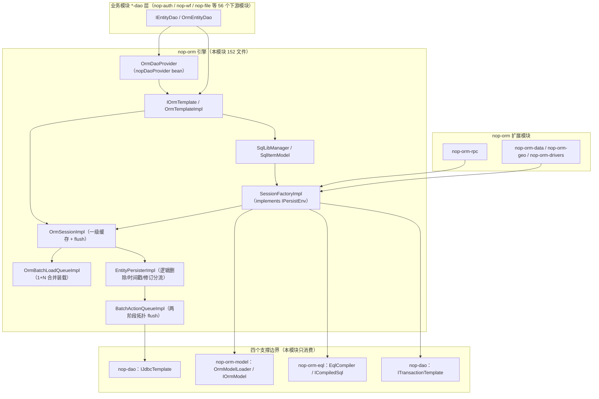

# nop-orm 总览：元模型驱动的 ORM 引擎

> 本页依据的源文件（相对路径自本页上行两级至仓库根，写入前已逐条 test -f 验证）：
>
> - ../../nop-persistence/nop-orm/pom.xml
> - ../../nop-persistence/nop-orm/src/main/resources/_vfs/nop/orm/beans/orm-defaults.beans.xml
> - ../../nop-persistence/nop-orm/src/main/java/io/nop/orm/IOrmTemplate.java
> - ../../nop-persistence/nop-orm/src/main/java/io/nop/orm/IOrmSessionFactory.java
> - ../../nop-persistence/nop-orm/src/main/java/io/nop/orm/OrmEntityState.java
> - ../../nop-persistence/nop-orm/src/main/java/io/nop/orm/OrmConstants.java
> - ../../nop-persistence/nop-orm/src/main/java/io/nop/orm/OrmErrors.java
> - ../../nop-persistence/nop-orm/src/main/java/io/nop/orm/OrmConfigs.java
> - ../../nop-persistence/nop-orm/src/main/java/io/nop/orm/initialize/DataBaseSchemaInitializer.java
> - ../../nop-persistence/nop-orm/src/main/java/io/nop/orm/persister/EntityPersisterImpl.java
> - ../../nop-persistence/nop-orm/src/main/java/io/nop/orm/factory/OrmSessionFactoryBean.java

nop-orm 是 Nop 平台内置的元模型驱动 ORM 引擎：基于 orm.xml 元模型提供 Hibernate 式会话语义、七状态实体状态机、EQL/SqlLib 查询与批量落库。本页界定其能力边界、平台位置与关键数字。

本页形态判定为引擎实现仓库（framework-repo）：叙事对象是引擎机制本身（会话、状态机、persister、缓存、查询管线），不是"如何用 ORM 写业务"的使用教程；上手操作见 [quickstart.md](quickstart.md)。

## 定位：nop-orm 是什么、解决什么问题、在平台中的位置

Maven 坐标 `io.github.entropy-cloud:nop-orm`，归属 nop-persistence 聚合模块（nop-persistence/nop-orm/pom.xml:7-14）。它是一个元模型驱动的 ORM 引擎：实体结构不在 Java 注解里声明，而由 `/nop/schema/orm/orm.xdef` 约束的 orm.xml 模型文件描述（nop-persistence/nop-orm/src/main/java/io/nop/orm/OrmConstants.java:13-15、19），引擎只消费只读元模型，不解析模型文件。

它解决的问题是：把实体状态跟踪、脏检查、关联装载、批量 SQL 生成与执行这类横切工作从业务代码中移走。使用侧契约集中在两个接口上——`IOrmTemplate`（模板门面，继承 `ISqlExecutor`，提供 `runInSession`、`get/load/save/delete`、`batchSaveOrUpdate`、批量装载与 session 级缓存；nop-persistence/nop-orm/src/main/java/io/nop/orm/IOrmTemplate.java:30、72、105-150、262-279）与 `IOrmSessionFactory`（工厂契约：开关会话、查询计划缓存、全局缓存、方言、拦截器注册、SQL 编译；nop-persistence/nop-orm/src/main/java/io/nop/orm/IOrmSessionFactory.java:24-74）。会话语义是 Hibernate 式的：一级缓存 + 实体状态机 + flush 时批量落库。实体有 7 个状态——TRANSIENT、SAVING、PROXY、MANAGED、MISSING、DELETING、DELETED，并附 `isUnsaved/isAllowLoad/isGone` 等判定谓词（nop-persistence/nop-orm/src/main/java/io/nop/orm/OrmEntityState.java:10-57）。

引擎刻意保持极薄的依赖面：非 test 的框架内依赖只有四个——nop-dao（JDBC 与事务）、nop-orm-eql（EQL 编译）、nop-orm-model（元模型）、nop-core（nop-persistence/nop-orm/pom.xml:16-34），另有 1 个非 test 的 microprofile reactive-streams API 依赖（pom.xml:95-98）。引擎自身不做模型解析、不编译 EQL 文本、不持有 Connection。在平台中它位于 nop-dao 之上、业务层之下：仓库内 57 个 pom.xml 引用 nop-orm（含自身，grep 实测），典型消费者是 nop-auth、nop-wf、nop-file 等业务模块的 `*-dao`/`*-codegen` 子模块；其上还有 nop-orm-rpc、nop-orm-data、nop-orm-geo、nop-orm-drivers 等扩展模块。

一次读路径与一次写路径如何穿过这张图，见 [architecture.md](architecture.md)；会话与工厂的内部结构见 [modules/session-factory.md](modules/session-factory.md)。

> Sources: [nop-persistence/nop-orm/pom.xml:7-34](https://gitee.com/canonical-entropy/nop-entropy/blob/f2ecee739b/nop-persistence/nop-orm/pom.xml#L7-L34)、[nop-persistence/nop-orm/src/main/java/io/nop/orm/IOrmTemplate.java:30-150](https://gitee.com/canonical-entropy/nop-entropy/blob/f2ecee739b/nop-persistence/nop-orm/src/main/java/io/nop/orm/IOrmTemplate.java#L30-L150)、[nop-persistence/nop-orm/src/main/java/io/nop/orm/IOrmSessionFactory.java:24-74](https://gitee.com/canonical-entropy/nop-entropy/blob/f2ecee739b/nop-persistence/nop-orm/src/main/java/io/nop/orm/IOrmSessionFactory.java#L24-L74)、[nop-persistence/nop-orm/src/main/java/io/nop/orm/OrmEntityState.java:10-57](https://gitee.com/canonical-entropy/nop-entropy/blob/f2ecee739b/nop-persistence/nop-orm/src/main/java/io/nop/orm/OrmEntityState.java#L10-L57)、[nop-persistence/nop-orm/src/main/java/io/nop/orm/OrmConstants.java:13-19](https://gitee.com/canonical-entropy/nop-entropy/blob/f2ecee739b/nop-persistence/nop-orm/src/main/java/io/nop/orm/OrmConstants.java#L13-L19)

## 与主流替代方案的定位对比

下表只做范式级定位对比：nop-orm 一列全部出自本仓库实测，两个参照系仅取公开常识，不涉及具体版本行为细节。

| 维度 | nop-orm（本仓库实测） | Hibernate/JPA | MyBatis |
|---|---|---|---|
| 范式 | 会话式全功能 ORM：一级缓存、7 状态状态机、flush 时脏检查并批量落库（OrmEntityState.java:10-57、IOrmTemplate.java:58-63） | 同为会话式全功能 ORM：一级缓存 + 脏检查 + 状态管理 | SQL 映射框架：SQL 先行手写，无会话级实体状态管理 |
| 元模型与定制机制 | XML 元模型（orm.xdef 约束，可经 Delta 定制覆盖）；扩展点是 IOrmInterceptor/IOrmDaoListener 与按名替换的 persister/driver（OrmConstants.java:13、IOrmSessionFactory.java:58-64、OrmConstants.java:103-104） | 注解/JPA 注解声明映射，配运行时增强与代理 | mapper XML/注解声明映射，配拦截插件 |
| 模型与查询格式 | app.orm.xml（OrmConstants.java:19）+ sql-lib.xml 语句库（OrmConstants.java:36-37）+ EQL 面向实体属性的查询语言（SQL_TYPE_EQL，OrmConstants.java:31-32，编译为 SQL 执行） | JPA 注解/hbm.xml + JPQL/HQL | mapper XML + 原生 SQL |

差异点落到工程后果上是三条：其一，模型是数据而非注解，orm.xml 可被平台工具链生成、校验、定制，实体 Java 类按模型增强（PROXY 懒加载，IOrmTemplate.java:108-114 的 `load` 契约）；其二，主键名固定为 `id`，注释明言这是对 GraphQL 常见标准与 Hibernate 假定的跟随（OrmConstants.java:39-42）；其三，SQL 语句库 sql-lib 与 EQL 共用一条执行管线，SqlItem 统一入口（nop-persistence/nop-orm/src/main/java/io/nop/orm/sql_lib/ 下 SqlLibManager/SqlItemModel，见 [flows/query-pipeline.md](flows/query-pipeline.md)）。

> Sources: [nop-persistence/nop-orm/src/main/java/io/nop/orm/OrmConstants.java:13-42](https://gitee.com/canonical-entropy/nop-entropy/blob/f2ecee739b/nop-persistence/nop-orm/src/main/java/io/nop/orm/OrmConstants.java#L13-L42)、[nop-persistence/nop-orm/src/main/java/io/nop/orm/IOrmSessionFactory.java:58-64](https://gitee.com/canonical-entropy/nop-entropy/blob/f2ecee739b/nop-persistence/nop-orm/src/main/java/io/nop/orm/IOrmSessionFactory.java#L58-L64)、[nop-persistence/nop-orm/src/main/java/io/nop/orm/IOrmTemplate.java:105-114](https://gitee.com/canonical-entropy/nop-entropy/blob/f2ecee739b/nop-persistence/nop-orm/src/main/java/io/nop/orm/IOrmTemplate.java#L105-L114)

## 能力边界：支持什么、不提供什么

**提供的能力**（全部有 beans 装配或接口签名背书）：

| 能力 | 边界内证据 |
|---|---|
| 会话语义与一级缓存 | `runInSession`/`runInNewSession`、`flushSession`/`clearSession`（IOrmTemplate.java:72-78、58-63）；缓存结构与遍历协议见 [modules/session-factory.md](modules/session-factory.md) |
| 实体状态机 | 7 状态 + 判定谓词（OrmEntityState.java:10-57）；迁移触发者见 [flows/entity-lifecycle.md](flows/entity-lifecycle.md) |
| EQL/SQL 统一执行 | `compileSql` 进查询计划缓存（IOrmSessionFactory.java:66-70）；`nopSqlLibManager` 缺省 bean（orm-defaults.beans.xml:13-15） |
| 批量写与批量读 | 批量动作队列两阶段拓扑 flush；批量装载队列合并 1+N（IOrmTemplate.java:141-143、251-253） |
| 逻辑删除/修订/时间戳 | OrmConstants 中的修订类型常量 REV_TYPE_SAVE/UPDATE/DELETE（OrmConstants.java:87-97）；三助手对照见 [flows/entity-lifecycle.md](flows/entity-lifecycle.md) |
| 实体全局（二级）缓存 | 进程内 `LocalCacheProvider` 装配（orm-defaults.beans.xml:22-29）；按实体 `useGlobalCache` 且全局开关打开才生效（EntityPersisterImpl.java:91-94、OrmConfigs.java:46-48）；`clearGlobalCache` 契约注明"二级缓存"（IOrmTemplate.java:286-296） |
| 租户 | 租户 ORM 缓存容量配置（OrmConfigs.java:85-87）；`AddTenantColInitializer` 自动补租户列（orm-defaults.beans.xml:85-90） |
| 拦截器/DAO 监听器 | 工厂级 `addInterceptor`/`addDaoListener`（IOrmSessionFactory.java:58-64）；`ioc:collect-beans` 按类型收集（orm-defaults.beans.xml:44-50）；机制见 [topics/assembly-interceptors.md](topics/assembly-interceptors.md) |
| 分片与多数据源方言 | `getShardSelector`、`getDialectForQuerySpace`（IOrmSessionFactory.java:54-56） |
| 建表与数据初始化 | `nop.orm.init-database-schema` 开启后按模型拓扑序对缺失表执行 `createTable` 生成的 DDL（DataBaseSchemaInitializer.java:56-72、OrmConfigs.java:50-52）；CSV/SQL 数据初始化（orm-defaults.beans.xml:92-97、OrmConfigs.java:54-60） |

**不提供的能力**（在边界外，写明实际归属）：

| 不提供 | 实际归属/证据 |
|---|---|
| ORM 元模型解析 | nop-orm-model（pom.xml:27-30）；引擎经 `IOrmModelProvider` 只读消费 |
| EQL 文法与编译器本体 | nop-orm-eql（pom.xml:22-25）；引擎只持有编译产物 `ICompiledSql` |
| 连接、事务、批执行的实现 | nop-dao 的 `IJdbcTemplate`/`ITransactionTemplate`（pom.xml:17-20、IOrmSessionFactory.java:33、44）；ORM 仅挂接事务监听器在提交前 flush、回滚后清缓存（orm-defaults.beans.xml:17-20） |
| 独立/分布式二级缓存模块 | 全局缓存是 nop-commons 的进程内 `LocalCacheProvider`（orm-defaults.beans.xml:26-29），容量与过期由 `nop.orm.entity-global-cache.*` 配置（OrmConfigs.java:38-44），启动时注册进 `GlobalCacheRegistry`（OrmSessionFactoryBean.java:124-126）；本模块未内置 Redis 等外部缓存实现 |
| 库表差异化自动升级（DDL diff） | 只建缺失表，不做结构比对升级；`nop.orm.db-differ.auto-upgrade-database` 的注释明言自动升级由外部 `nop-dbtool-core` 提供（OrmConfigs.java:62-67） |
| 注解扫描式实体注册 | 实体来源是 `_vfs` 下的 orm.xml 模型文件（OrmConstants.java:19），orm-defaults.beans.xml 全文无任何 classpath 扫描配置（orm-defaults.beans.xml:1-104） |

> Sources: [nop-persistence/nop-orm/src/main/resources/_vfs/nop/orm/beans/orm-defaults.beans.xml:13-103](https://gitee.com/canonical-entropy/nop-entropy/blob/f2ecee739b/nop-persistence/nop-orm/src/main/resources/_vfs/nop/orm/beans/orm-defaults.beans.xml#L13-L103)、[nop-persistence/nop-orm/src/main/java/io/nop/orm/OrmConfigs.java:38-67](https://gitee.com/canonical-entropy/nop-entropy/blob/f2ecee739b/nop-persistence/nop-orm/src/main/java/io/nop/orm/OrmConfigs.java#L38-L67)、[nop-persistence/nop-orm/src/main/java/io/nop/orm/initialize/DataBaseSchemaInitializer.java:56-72](https://gitee.com/canonical-entropy/nop-entropy/blob/f2ecee739b/nop-persistence/nop-orm/src/main/java/io/nop/orm/initialize/DataBaseSchemaInitializer.java#L56-L72)、[nop-persistence/nop-orm/src/main/java/io/nop/orm/persister/EntityPersisterImpl.java:91-94](https://gitee.com/canonical-entropy/nop-entropy/blob/f2ecee739b/nop-persistence/nop-orm/src/main/java/io/nop/orm/persister/EntityPersisterImpl.java#L91-L94)、[nop-persistence/nop-orm/src/main/java/io/nop/orm/factory/OrmSessionFactoryBean.java:124-126](https://gitee.com/canonical-entropy/nop-entropy/blob/f2ecee739b/nop-persistence/nop-orm/src/main/java/io/nop/orm/factory/OrmSessionFactoryBean.java#L124-L126)

## 关键数字

| 指标 | 值 | 口径与出处 |
|---|---|---|
| 主源文件 | 152 个 / 24,583 行 | `find`+`wc` 实测 src/main/java（PLAN.md §1 计"约 2.3 万行"，实测精确值 24,583） |
| 实体状态 | 7 个 | OrmEntityState.java:14、19、24、29、34、36、41 |
| 模块内 fan-in 前三 | IOrmEntity 55、OrmErrors 35、OrmConstants 30 | 文件级口径（类名被多少个其他 main 源文件引用），grep 实测，与 PLAN.md §2 一致 |
| 错误码 | 90 个 | OrmErrors.java:142-420，如 ERR_ORM_SESSION_CLOSED（144）、ERR_ORM_ENTITY_NOT_ATTACHED（155） |
| 缺省 IoC bean | 19 个（18 个 `<bean>` + 1 个 `<util:constant>`），单文件 orm-defaults.beans.xml 装配 | orm-defaults.beans.xml:13-103 |
| 配置项 | 19 个 `IConfigReference` | OrmConfigs.java:23-98 |
| 非 test Maven 依赖 | 5 个：nop-dao、nop-orm-eql、nop-orm-model、nop-core + microprofile reactive-streams API | pom.xml:16-34、95-98 |
| 下游消费模块 | 56 个（57 个 pom.xml 引用 nop-orm，含自身） | 全仓 grep 实测 |

读数提示：fan-in 为文件级口径（类名被多少个其他 main 源文件引用）而非符号级；152 个文件仅计 src/main/java，不含测试文件；`_gen` 生成物（sql_lib/_gen）不在此叙事范围。错误码全部为 `ErrorCode.define` 风格并标注 `@Locale("zh-CN")`（nop-persistence/nop-orm/src/main/java/io/nop/orm/OrmErrors.java:16-19）。

> Sources: [nop-persistence/nop-orm/src/main/java/io/nop/orm/OrmEntityState.java:10-41](https://gitee.com/canonical-entropy/nop-entropy/blob/f2ecee739b/nop-persistence/nop-orm/src/main/java/io/nop/orm/OrmEntityState.java#L10-L41)、[nop-persistence/nop-orm/src/main/java/io/nop/orm/OrmErrors.java:142-420](https://gitee.com/canonical-entropy/nop-entropy/blob/f2ecee739b/nop-persistence/nop-orm/src/main/java/io/nop/orm/OrmErrors.java#L142-L420)、[nop-persistence/nop-orm/src/main/java/io/nop/orm/OrmConfigs.java:23-98](https://gitee.com/canonical-entropy/nop-entropy/blob/f2ecee739b/nop-persistence/nop-orm/src/main/java/io/nop/orm/OrmConfigs.java#L23-L98)、[nop-persistence/nop-orm/src/main/resources/_vfs/nop/orm/beans/orm-defaults.beans.xml:13-103](https://gitee.com/canonical-entropy/nop-entropy/blob/f2ecee739b/nop-persistence/nop-orm/src/main/resources/_vfs/nop/orm/beans/orm-defaults.beans.xml#L13-L103)

## 阅读路径

- 最短可运行路径（依赖引入 → bean 装配 → 第一条查询 → 事务挂接）：[quickstart.md](quickstart.md)
- 架构分层与端到端数据流（一次加载、一次保存）：[architecture.md](architecture.md)
- 机制章：实体状态机与 flush 全链路 [flows/entity-lifecycle.md](flows/entity-lifecycle.md)；查询六阶段管线 [flows/query-pipeline.md](flows/query-pipeline.md)
- 模块章：会话与工厂 [modules/session-factory.md](modules/session-factory.md)；持久化与 SQL 生成 [modules/persister-sql.md](modules/persister-sql.md)
- 主题章：IoC 装配、拦截器、数据权限过滤、schema 初始化 [topics/assembly-interceptors.md](topics/assembly-interceptors.md)
- 工具页：引擎自造概念划界 [glossary.md](glossary.md)；三类读者阅读顺序 [reading-guide.md](reading-guide.md)

按依赖重要度，先读 glossary 与 quickstart 建立词汇与最小运行图景，再经 architecture 进入 flows 与 modules 两章；只关心扩展点的读者可直接跳 topics 章。这条顺序对应的起点证据是：模板与会话词汇（nop-persistence/nop-orm/src/main/java/io/nop/orm/IOrmTemplate.java:30-78）、状态词汇（nop-persistence/nop-orm/src/main/java/io/nop/orm/OrmEntityState.java:10-57）、装配起点（nop-persistence/nop-orm/src/main/resources/_vfs/nop/orm/beans/orm-defaults.beans.xml:38-58）。

> Sources: [nop-persistence/nop-orm/src/main/java/io/nop/orm/IOrmTemplate.java:30-78](https://gitee.com/canonical-entropy/nop-entropy/blob/f2ecee739b/nop-persistence/nop-orm/src/main/java/io/nop/orm/IOrmTemplate.java#L30-L78)、[nop-persistence/nop-orm/src/main/java/io/nop/orm/OrmEntityState.java:10-57](https://gitee.com/canonical-entropy/nop-entropy/blob/f2ecee739b/nop-persistence/nop-orm/src/main/java/io/nop/orm/OrmEntityState.java#L10-L57)、[nop-persistence/nop-orm/src/main/resources/_vfs/nop/orm/beans/orm-defaults.beans.xml:38-58](https://gitee.com/canonical-entropy/nop-entropy/blob/f2ecee739b/nop-persistence/nop-orm/src/main/resources/_vfs/nop/orm/beans/orm-defaults.beans.xml#L38-L58)

## Sources

- [nop-persistence/nop-orm/pom.xml:7-14](https://gitee.com/canonical-entropy/nop-entropy/blob/f2ecee739b/nop-persistence/nop-orm/pom.xml#L7-L14)
- [nop-persistence/nop-orm/pom.xml:16-34](https://gitee.com/canonical-entropy/nop-entropy/blob/f2ecee739b/nop-persistence/nop-orm/pom.xml#L16-L34)
- [nop-persistence/nop-orm/pom.xml:95-98](https://gitee.com/canonical-entropy/nop-entropy/blob/f2ecee739b/nop-persistence/nop-orm/pom.xml#L95-L98)
- [nop-persistence/nop-orm/src/main/resources/_vfs/nop/orm/beans/orm-defaults.beans.xml:13-103](https://gitee.com/canonical-entropy/nop-entropy/blob/f2ecee739b/nop-persistence/nop-orm/src/main/resources/_vfs/nop/orm/beans/orm-defaults.beans.xml#L13-L103)
- [nop-persistence/nop-orm/src/main/resources/_vfs/nop/orm/beans/orm-defaults.beans.xml:22-29](https://gitee.com/canonical-entropy/nop-entropy/blob/f2ecee739b/nop-persistence/nop-orm/src/main/resources/_vfs/nop/orm/beans/orm-defaults.beans.xml#L22-L29)
- [nop-persistence/nop-orm/src/main/resources/_vfs/nop/orm/beans/orm-defaults.beans.xml:44-50](https://gitee.com/canonical-entropy/nop-entropy/blob/f2ecee739b/nop-persistence/nop-orm/src/main/resources/_vfs/nop/orm/beans/orm-defaults.beans.xml#L44-L50)
- [nop-persistence/nop-orm/src/main/resources/_vfs/nop/orm/beans/orm-defaults.beans.xml:85-97](https://gitee.com/canonical-entropy/nop-entropy/blob/f2ecee739b/nop-persistence/nop-orm/src/main/resources/_vfs/nop/orm/beans/orm-defaults.beans.xml#L85-L97)
- [nop-persistence/nop-orm/src/main/java/io/nop/orm/IOrmTemplate.java:30](https://gitee.com/canonical-entropy/nop-entropy/blob/f2ecee739b/nop-persistence/nop-orm/src/main/java/io/nop/orm/IOrmTemplate.java#L30)
- [nop-persistence/nop-orm/src/main/java/io/nop/orm/IOrmTemplate.java:58-78](https://gitee.com/canonical-entropy/nop-entropy/blob/f2ecee739b/nop-persistence/nop-orm/src/main/java/io/nop/orm/IOrmTemplate.java#L58-L78)
- [nop-persistence/nop-orm/src/main/java/io/nop/orm/IOrmTemplate.java:105-150](https://gitee.com/canonical-entropy/nop-entropy/blob/f2ecee739b/nop-persistence/nop-orm/src/main/java/io/nop/orm/IOrmTemplate.java#L105-L150)
- [nop-persistence/nop-orm/src/main/java/io/nop/orm/IOrmTemplate.java:251-253](https://gitee.com/canonical-entropy/nop-entropy/blob/f2ecee739b/nop-persistence/nop-orm/src/main/java/io/nop/orm/IOrmTemplate.java#L251-L253)
- [nop-persistence/nop-orm/src/main/java/io/nop/orm/IOrmTemplate.java:286-296](https://gitee.com/canonical-entropy/nop-entropy/blob/f2ecee739b/nop-persistence/nop-orm/src/main/java/io/nop/orm/IOrmTemplate.java#L286-L296)
- [nop-persistence/nop-orm/src/main/java/io/nop/orm/IOrmSessionFactory.java:24-74](https://gitee.com/canonical-entropy/nop-entropy/blob/f2ecee739b/nop-persistence/nop-orm/src/main/java/io/nop/orm/IOrmSessionFactory.java#L24-L74)
- [nop-persistence/nop-orm/src/main/java/io/nop/orm/IOrmSessionFactory.java:33-44](https://gitee.com/canonical-entropy/nop-entropy/blob/f2ecee739b/nop-persistence/nop-orm/src/main/java/io/nop/orm/IOrmSessionFactory.java#L33-L44)
- [nop-persistence/nop-orm/src/main/java/io/nop/orm/IOrmSessionFactory.java:54-70](https://gitee.com/canonical-entropy/nop-entropy/blob/f2ecee739b/nop-persistence/nop-orm/src/main/java/io/nop/orm/IOrmSessionFactory.java#L54-L70)
- [nop-persistence/nop-orm/src/main/java/io/nop/orm/OrmEntityState.java:10-57](https://gitee.com/canonical-entropy/nop-entropy/blob/f2ecee739b/nop-persistence/nop-orm/src/main/java/io/nop/orm/OrmEntityState.java#L10-L57)
- [nop-persistence/nop-orm/src/main/java/io/nop/orm/OrmConstants.java:13-19](https://gitee.com/canonical-entropy/nop-entropy/blob/f2ecee739b/nop-persistence/nop-orm/src/main/java/io/nop/orm/OrmConstants.java#L13-L19)
- [nop-persistence/nop-orm/src/main/java/io/nop/orm/OrmConstants.java:31-42](https://gitee.com/canonical-entropy/nop-entropy/blob/f2ecee739b/nop-persistence/nop-orm/src/main/java/io/nop/orm/OrmConstants.java#L31-L42)
- [nop-persistence/nop-orm/src/main/java/io/nop/orm/OrmConstants.java:87-104](https://gitee.com/canonical-entropy/nop-entropy/blob/f2ecee739b/nop-persistence/nop-orm/src/main/java/io/nop/orm/OrmConstants.java#L87-L104)
- [nop-persistence/nop-orm/src/main/java/io/nop/orm/OrmErrors.java:142-420](https://gitee.com/canonical-entropy/nop-entropy/blob/f2ecee739b/nop-persistence/nop-orm/src/main/java/io/nop/orm/OrmErrors.java#L142-L420)
- [nop-persistence/nop-orm/src/main/java/io/nop/orm/OrmConfigs.java:23-98](https://gitee.com/canonical-entropy/nop-entropy/blob/f2ecee739b/nop-persistence/nop-orm/src/main/java/io/nop/orm/OrmConfigs.java#L23-L98)
- [nop-persistence/nop-orm/src/main/java/io/nop/orm/initialize/DataBaseSchemaInitializer.java:56-72](https://gitee.com/canonical-entropy/nop-entropy/blob/f2ecee739b/nop-persistence/nop-orm/src/main/java/io/nop/orm/initialize/DataBaseSchemaInitializer.java#L56-L72)
- [nop-persistence/nop-orm/src/main/java/io/nop/orm/persister/EntityPersisterImpl.java:91-94](https://gitee.com/canonical-entropy/nop-entropy/blob/f2ecee739b/nop-persistence/nop-orm/src/main/java/io/nop/orm/persister/EntityPersisterImpl.java#L91-L94)
- [nop-persistence/nop-orm/src/main/java/io/nop/orm/factory/OrmSessionFactoryBean.java:124-126](https://gitee.com/canonical-entropy/nop-entropy/blob/f2ecee739b/nop-persistence/nop-orm/src/main/java/io/nop/orm/factory/OrmSessionFactoryBean.java#L124-L126)

---

## On this page

- 定位：nop-orm 是什么、解决什么问题、在平台中的位置
- 与主流替代方案的定位对比
- 能力边界：支持什么、不提供什么
- 关键数字
- 阅读路径
