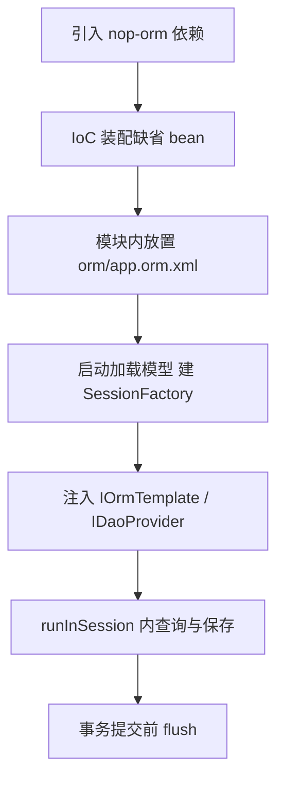

# 快速上手：装配 SessionFactory 到执行第一条查询

> 本页依据的源文件（相对本页 `../../` = 仓库根）：
>
> - [orm-defaults.beans.xml](../../nop-persistence/nop-orm/src/main/resources/_vfs/nop/orm/beans/orm-defaults.beans.xml)
> - [OrmSessionFactoryBean.java](../../nop-persistence/nop-orm/src/main/java/io/nop/orm/factory/OrmSessionFactoryBean.java)
> - [IOrmTemplate.java](../../nop-persistence/nop-orm/src/main/java/io/nop/orm/IOrmTemplate.java)
> - [OrmDaoProvider.java](../../nop-persistence/nop-orm/src/main/java/io/nop/orm/dao/OrmDaoProvider.java)
> - [SessionFactoryConfig.java](../../nop-persistence/nop-orm/src/main/java/io/nop/orm/factory/SessionFactoryConfig.java)
> - [AbstractOrmTestCase.java](../../nop-persistence/nop-orm/src/test/java/io/nop/orm/AbstractOrmTestCase.java)
> - [OrmModelLoader.java](../../nop-persistence/nop-orm-model/src/main/java/io/nop/orm/model/loader/OrmModelLoader.java)
> - [TestEqlQuery.java](../../nop-persistence/nop-orm/src/test/java/io/nop/orm/loader/TestEqlQuery.java)

本页给出 nop-orm 从零到第一条查询的最短可运行路径：引入依赖、装配缺省 bean、放置 ORM 模型、经 IOrmTemplate / IEntityDao 读写实体、理解事务挂接点。每一步均取自仓库内可运行的测试与缺省配置，可对照复现。引擎内部机制见 architecture.md（PLAN 规划）与 modules/session-factory.md。

## 路径总览



> Sources: [nop-persistence/nop-orm/src/main/resources/_vfs/nop/orm/beans/orm-defaults.beans.xml:38-58](https://gitee.com/canonical-entropy/nop-entropy/blob/f2ecee739b/nop-persistence/nop-orm/src/main/resources/_vfs/nop/orm/beans/orm-defaults.beans.xml#L38-L58)、[nop-persistence/nop-orm/src/test/java/io/nop/orm/AbstractOrmTestCase.java:43-89](https://gitee.com/canonical-entropy/nop-entropy/blob/f2ecee739b/nop-persistence/nop-orm/src/test/java/io/nop/orm/AbstractOrmTestCase.java#L43-L89)、[nop-persistence/nop-orm-model/src/main/java/io/nop/orm/model/loader/OrmModelLoader.java:39-64](https://gitee.com/canonical-entropy/nop-entropy/blob/f2ecee739b/nop-persistence/nop-orm-model/src/main/java/io/nop/orm/model/loader/OrmModelLoader.java#L39-L64)、[nop-persistence/nop-orm/src/main/java/io/nop/orm/impl/OrmTemplateImpl.java:204-231](https://gitee.com/canonical-entropy/nop-entropy/blob/f2ecee739b/nop-persistence/nop-orm/src/main/java/io/nop/orm/impl/OrmTemplateImpl.java#L204-L231)

## 第 1 步：引入依赖并装配缺省 bean

依赖坐标为 `io.github.entropy-cloud:nop-orm`，它会传递引入 `nop-dao`、`nop-orm-eql`、`nop-orm-model`（`nop-persistence/nop-orm/pom.xml:19-29`）。nop-orm-demo 的引入方式：

```xml
<dependency>
    <groupId>io.github.entropy-cloud</groupId>
    <artifactId>nop-orm</artifactId>
</dependency>
```

（`nop-demo/nop-orm-demo/pom.xml:23-26`）

在标准 Nop 应用里不需要手写任何 ORM 装配：`orm-defaults.beans.xml` 单文件注册全部缺省 bean，核心三个是：

```xml
<bean id="nopOrmSessionFactory" class="io.nop.orm.factory.OrmSessionFactoryBean"
      ioc:bean-method="getObject" ioc:default="true">
    <property name="name" value="app-orm"/>
    <property name="registerGlobalCache" value="true"/>
    <property name="sequenceGenerator" ref="nopSequenceGenerator" ioc:ignore-depends="true"/>
    <property name="daoListeners">
        <ioc:collect-beans by-type="io.nop.orm.IOrmDaoListener" ioc:ignore-depends="true"/>
    </property>
    <property name="interceptors">
        <ioc:collect-beans by-type="io.nop.orm.IOrmInterceptor" ioc:ignore-depends="true"/>
    </property>
</bean>

<bean id="nopOrmTemplate" class="io.nop.orm.impl.OrmTemplateImpl" ioc:default="true"/>

<bean id="nopDaoProvider" class="io.nop.orm.dao.OrmDaoProvider" ioc:default="true" init-method="register">
    <property name="ormTemplate" ref="nopOrmTemplate"/>
</bean>
```

（`nop-persistence/nop-orm/src/main/resources/_vfs/nop/orm/beans/orm-defaults.beans.xml:38-58`）

要点：`ioc:bean-method="getObject"` 表示容器暴露的 `nopOrmSessionFactory` 实际是 `getObject()` 的返回值，即内部构造的 `SessionFactoryImpl`（`nop-persistence/nop-orm/src/main/java/io/nop/orm/factory/OrmSessionFactoryBean.java:193-195`）。`@PostConstruct init()` 校验四项必给依赖（jdbcTemplate、beanProvider、shardSelector、sequenceGenerator），随后逐项装配 SessionFactoryImpl，并在未提供时补建缺省的 `JdbcQueryExecutor` 与全局缓存（`OrmSessionFactoryBean.java:72-75、95-113`）。拦截器与 daoListener 通过 `ioc:collect-beans` 按类型聚合，业务方只需注册自己的 `IOrmInterceptor` / `IOrmDaoListener` bean 即可被收进来（`orm-defaults.beans.xml:44-50`）。

脱离 IoC 容器时，最小程序化装配只有六行——这正是 nop-orm 全部测试的启动方式：

```java
OrmSessionFactoryBean factoryBean = new OrmSessionFactoryBean();
factoryBean.setJdbcTemplate(jdbcTemplate);
factoryBean.setBeanProvider(new MockBeanProvider());
factoryBean.setGlobalCache(new LocalCacheProvider("global", CacheConfig.newConfig(1000)));
factoryBean.setSequenceGenerator(new UuidSequenceGenerator());
factoryBean.setColumnBinderEnhancer(new DefaultOrmColumnBinderEnhancer());
factoryBean.init();
sessionFactory = factoryBean.getObject();
ormTemplate = new OrmTemplateImpl(sessionFactory);
```

（`nop-persistence/nop-orm/src/test/java/io/nop/orm/AbstractOrmTestCase.java:48-61`）

可注入到 `SessionFactoryConfig` 的全部依赖项（JdbcTemplate、ShardSelector、globalCache、interceptors、daoListeners 等）见 `nop-persistence/nop-orm/src/main/java/io/nop/orm/factory/SessionFactoryConfig.java:47-85`。

> Sources: [nop-persistence/nop-orm/src/main/resources/_vfs/nop/orm/beans/orm-defaults.beans.xml:38-58](https://gitee.com/canonical-entropy/nop-entropy/blob/f2ecee739b/nop-persistence/nop-orm/src/main/resources/_vfs/nop/orm/beans/orm-defaults.beans.xml#L38-L58)、[nop-persistence/nop-orm/src/main/java/io/nop/orm/factory/OrmSessionFactoryBean.java:68-130](https://gitee.com/canonical-entropy/nop-entropy/blob/f2ecee739b/nop-persistence/nop-orm/src/main/java/io/nop/orm/factory/OrmSessionFactoryBean.java#L68-L130)、[nop-persistence/nop-orm/src/test/java/io/nop/orm/AbstractOrmTestCase.java:48-61](https://gitee.com/canonical-entropy/nop-entropy/blob/f2ecee739b/nop-persistence/nop-orm/src/test/java/io/nop/orm/AbstractOrmTestCase.java#L48-L61)、[nop-demo/nop-orm-demo/pom.xml:23-26](https://gitee.com/canonical-entropy/nop-entropy/blob/f2ecee739b/nop-demo/nop-orm-demo/pom.xml#L23-L26)、[nop-persistence/nop-orm/src/main/java/io/nop/orm/factory/SessionFactoryConfig.java:47-85](https://gitee.com/canonical-entropy/nop-entropy/blob/f2ecee739b/nop-persistence/nop-orm/src/main/java/io/nop/orm/factory/SessionFactoryConfig.java#L47-L85)

## 第 2 步：提供 ORM 模型（app.orm.xml）

模型文件放在每个模块 `_vfs` 目录的 orm/app.orm.xml 模型文件。加载逻辑：`OrmModelLoader` 从启用模块收集 `"orm/app.orm.xml"` 资源，再合并虚拟文件系统中 `/main/orm/app.orm.xml` 的主模型，最后 `init()` 并冻结（`nop-persistence/nop-orm-model/src/main/java/io/nop/orm/model/loader/OrmModelLoader.java:43-64`）。demo 中的实体声明形如：

```xml
<entity name="demo.orm.entity.Department" tableName="department"
        registerShortName="true">
    <columns>
        <column name="deptName" code="dept_name" primary="true"
                propId="1" stdSqlType="VARCHAR" precision="20"/>
        ...
    </columns>
</entity>
```

（`nop-demo/nop-orm-demo/src/test/resources/_vfs/orm/demo/orm/app.orm.xml:21-32`）

谁触发加载：`OrmSessionFactoryBean` 若未被注入 `IOrmModelProvider`，则在 init 时缺省创建 `DefaultOrmModelProvider` 并挂到 SessionFactory 上（`nop-persistence/nop-orm/src/main/java/io/nop/orm/factory/OrmSessionFactoryBean.java:170-177`）；后者通过 `new OrmModelLoader().loadOrmModel(false)` 完成实际加载，并支持 `clearCache()` 整体重载（`nop-persistence/nop-orm/src/main/java/io/nop/orm/factory/DefaultOrmModelProvider.java:44-49`）。

建表有两种方式。应用启动路径：配置 `nop.orm.init-database-schema: true` 后，`DataBaseSchemaInitializer` bean 生效并按模型建表（`nop-demo/nop-orm-demo/src/test/resources/application.yaml:10-11`、`orm-defaults.beans.xml:78-83`、`nop-persistence/nop-orm/src/main/java/io/nop/orm/OrmConfigs.java:50-52`）。测试内路径：用 `DdlSqlCreator` 按拓扑序生成建表 SQL 直接执行：

```java
Collection<? extends IEntityModel> tables = sessionFactory.getOrmModel().getEntityModelsInTopoOrder();
String createSql = new DdlSqlCreator(jdbcTemplate.getDialectForQuerySpace(null)).createTables(tables, false);
jdbcTemplate.executeMultiSql(new SQL(createSql));
```

（`nop-persistence/nop-orm/src/test/java/io/nop/orm/AbstractOrmTestCase.java:85-89`）

> Sources: [nop-persistence/nop-orm-model/src/main/java/io/nop/orm/model/loader/OrmModelLoader.java:43-64](https://gitee.com/canonical-entropy/nop-entropy/blob/f2ecee739b/nop-persistence/nop-orm-model/src/main/java/io/nop/orm/model/loader/OrmModelLoader.java#L43-L64)、[nop-persistence/nop-orm/src/main/java/io/nop/orm/factory/OrmSessionFactoryBean.java:170-177](https://gitee.com/canonical-entropy/nop-entropy/blob/f2ecee739b/nop-persistence/nop-orm/src/main/java/io/nop/orm/factory/OrmSessionFactoryBean.java#L170-L177)、[nop-persistence/nop-orm/src/main/java/io/nop/orm/factory/DefaultOrmModelProvider.java:44-49](https://gitee.com/canonical-entropy/nop-entropy/blob/f2ecee739b/nop-persistence/nop-orm/src/main/java/io/nop/orm/factory/DefaultOrmModelProvider.java#L44-L49)、[nop-persistence/nop-orm/src/test/java/io/nop/orm/AbstractOrmTestCase.java:85-89](https://gitee.com/canonical-entropy/nop-entropy/blob/f2ecee739b/nop-persistence/nop-orm/src/test/java/io/nop/orm/AbstractOrmTestCase.java#L85-L89)、[nop-demo/nop-orm-demo/src/test/resources/application.yaml:10-11](https://gitee.com/canonical-entropy/nop-entropy/blob/f2ecee739b/nop-demo/nop-orm-demo/src/test/resources/application.yaml#L10-L11)

## 第 3 步：使用 IOrmTemplate 与 OrmDaoProvider

`nopOrmTemplate`（`IOrmTemplate` 实现类为 `OrmTemplateImpl`）是无处不在的门面；`nopDaoProvider` 在 `register()` 时把自己注册为全局 `DaoProvider` 实例，`dao(entityName)` 按实体名懒创建并缓存 `OrmEntityDao`（`nop-persistence/nop-orm/src/main/java/io/nop/orm/dao/OrmDaoProvider.java:45-57`）。业务代码的标准注入方式：

```java
@Inject
IDaoProvider daoProvider;

@Inject
IOrmTemplate ormTemplate;

IEntityDao<Department> dao = daoProvider.daoFor(Department.class);
Department dept = dao.newEntity();
dept.setDeptName("Comp. Sci.");
dao.saveEntity(dept);
```

注入方式与 newEntity/saveEntity 调用见 `nop-demo/nop-orm-demo/src/test/java/demo/orm/test/TestEntityDao.java:23-30、43-49`；`IEntityDao` 接口方法定义在 `nop-persistence/nop-dao/src/main/java/io/nop/dao/api/IEntityDao.java:93-95、220`。也可以不用 Dao，直接走模板的实体 API：`orm().newEntity(entityName)`、`orm().save(entity)`（`nop-persistence/nop-orm/src/main/java/io/nop/orm/IOrmTemplate.java:122、233`），测试中的对应写法见 `AbstractOrmTestCase.java:91-106`。

所有操作都要在 session 上下文中执行。`runInSession` 复用当前上下文里已注册的 session，没有则走 `runInNewSession`：打开新 session → 执行回调 → 正常返回时 `flush()` → finally 中恢复旧 session 并关闭新 session（`nop-persistence/nop-orm/src/main/java/io/nop/orm/impl/OrmTemplateImpl.java:204-231`）。`get/save/findFirst` 等方法内部同样包了一层 `runInSession`，所以单次调用即使不显式包 session 也能正确落库。

> Sources: [nop-persistence/nop-orm/src/main/java/io/nop/orm/dao/OrmDaoProvider.java:45-57](https://gitee.com/canonical-entropy/nop-entropy/blob/f2ecee739b/nop-persistence/nop-orm/src/main/java/io/nop/orm/dao/OrmDaoProvider.java#L45-L57)、[nop-demo/nop-orm-demo/src/test/java/demo/orm/test/TestEntityDao.java:23-49](https://gitee.com/canonical-entropy/nop-entropy/blob/f2ecee739b/nop-demo/nop-orm-demo/src/test/java/demo/orm/test/TestEntityDao.java#L23-L49)、[nop-persistence/nop-orm/src/main/java/io/nop/orm/IOrmTemplate.java:122-233](https://gitee.com/canonical-entropy/nop-entropy/blob/f2ecee739b/nop-persistence/nop-orm/src/main/java/io/nop/orm/IOrmTemplate.java#L122-L233)、[nop-persistence/nop-orm/src/main/java/io/nop/orm/impl/OrmTemplateImpl.java:204-231](https://gitee.com/canonical-entropy/nop-entropy/blob/f2ecee739b/nop-persistence/nop-orm/src/main/java/io/nop/orm/impl/OrmTemplateImpl.java#L204-L231)

## 第 4 步：执行第一条查询

查询入参是 `io.nop.core.lang.sql.SQL` 对象，文本是 EQL（面向实体的查询语言，编译为 SQL）。仓库内最短的查询测试：

```java
@Test
public void testSimpleSelect() {
    String sql = "select o from io.nop.app.SimsClass o";
    List<SimsClass> list = orm().findAll(new SQL(sql));
    assertEquals(1, list.size());
}
```

（`nop-persistence/nop-orm/src/test/java/io/nop/orm/loader/TestEqlQuery.java:28-33`）

带参数、返回实体关联与聚合行的写法：

```java
orm().runInSession(() -> {
    String sql = "select o.id, o.classId, o.simsCollege, concat(o.className,'XX') "
            + "from io.nop.app.SimsClass o where o.classId=?";
    List<Map<String, Object>> list = orm().findAll(SQL.begin().sql(sql, 11).end());
    SimsCollege college = (SimsCollege) list.get(0).get("simsCollege");
});
```

（`nop-persistence/nop-orm/src/test/java/io/nop/orm/loader/TestEqlQuery.java:35-51`）

查询入口分两组。`findAll/findFirst/findPage` 及 `findLong/findString` 等类型化捷径继承自 `ISqlExecutor`（`nop-persistence/nop-dao/src/main/java/io/nop/dao/api/ISqlExecutor.java:64-73、170-172`）；`findListByQuery/findFirstByQuery/existsByQuery` 接受结构化的 `QueryBean`，默认以 `ColumnMapRowMapper` 返回列映射行（`nop-persistence/nop-orm/src/main/java/io/nop/orm/IOrmTemplate.java:190-202`）。

一个必须知道的语义：同一 session 内，保存后未 flush 前查询查不到新数据，需要手动 `session.flush()`；从数据库加载时若 session 已有同 id 实体，返回的是 session 中的同一实例：

```java
ormTemplate.runInSession(session -> {
    initDepartments();
    Assertions.assertEquals(0, daoProvider.daoFor(Department.class).findAll().size());
    session.flush();
    Assertions.assertEquals(7, daoProvider.daoFor(Department.class).findAll().size());
    return null;
});
```

（`nop-demo/nop-orm-demo/src/test/java/demo/orm/test/TestEntityDao.java:61-74`，同文件 90-110 行演示了 `findFirstByExample` 后 `assertSame` 命中 session 实例）

### IOrmTemplate 常用方法

| 方法 | 签名（节选） | 行为 | 定义位置 |
|---|---|---|---|
| runInSession | `<T> T runInSession(Function<IOrmSession,T>)` | 复用或新建 session 执行回调 | IOrmTemplate.java:72 |
| get | `IOrmEntity get(String entityName, Object id)` | 按主键查找，未找到返回 null | IOrmTemplate.java:105 |
| load | `IOrmEntity load(String entityName, Object id)` | 未加载则返回 Proxy 放入 session | IOrmTemplate.java:114 |
| save | `Object save(IOrmEntity entity)` | 保存实体，返回主键 | IOrmTemplate.java:122 |
| saveOrUpdate | `void saveOrUpdate(IOrmEntity entity)` | session 已存在则更新，否则新建 | IOrmTemplate.java:139 |
| delete / deleteById | `void delete(IOrmEntity)` / `int deleteById(String,Object)` | 删除实体 / 按主键生成 delete | IOrmTemplate.java:150、204-209 |
| findAll / findFirst | `List<T> findAll(SQL)` / `T findFirst(SQL)` | 执行 EQL/SQL，继承自 ISqlExecutor | ISqlExecutor.java:71、64 |
| findListByQuery | `List<Map<String,Object>> findListByQuery(QueryBean)` | 结构化查询，返回列映射行 | IOrmTemplate.java:196-198 |
| flushSession / clearSession | `void flushSession()` / `void clearSession()` | 刷新 / 清空当前 session 一级缓存 | IOrmTemplate.java:58、63 |

> Sources: [nop-persistence/nop-orm/src/test/java/io/nop/orm/loader/TestEqlQuery.java:28-51](https://gitee.com/canonical-entropy/nop-entropy/blob/f2ecee739b/nop-persistence/nop-orm/src/test/java/io/nop/orm/loader/TestEqlQuery.java#L28-L51)、[nop-persistence/nop-dao/src/main/java/io/nop/dao/api/ISqlExecutor.java:64-73](https://gitee.com/canonical-entropy/nop-entropy/blob/f2ecee739b/nop-persistence/nop-dao/src/main/java/io/nop/dao/api/ISqlExecutor.java#L64-L73)、[nop-persistence/nop-orm/src/main/java/io/nop/orm/IOrmTemplate.java:190-209](https://gitee.com/canonical-entropy/nop-entropy/blob/f2ecee739b/nop-persistence/nop-orm/src/main/java/io/nop/orm/IOrmTemplate.java#L190-L209)、[nop-demo/nop-orm-demo/src/test/java/demo/orm/test/TestEntityDao.java:61-110](https://gitee.com/canonical-entropy/nop-entropy/blob/f2ecee739b/nop-demo/nop-orm-demo/src/test/java/demo/orm/test/TestEntityDao.java#L61-L110)、[nop-persistence/nop-orm/src/main/java/io/nop/orm/impl/OrmTemplateImpl.java:214-231](https://gitee.com/canonical-entropy/nop-entropy/blob/f2ecee739b/nop-persistence/nop-orm/src/main/java/io/nop/orm/impl/OrmTemplateImpl.java#L214-L231)

## 第 5 步：事务边界

ORM 不自己管事务，而是挂接到 nop-dao 的事务监听器。缺省 bean `nopDefaultTransactionListener` 以 `ioc:lazy-property` 注入 ormTemplate 以规避循环依赖（`orm-defaults.beans.xml:17-20`）。行为：事务提交前 flush 当前 session；事务未提交（回滚）时清空 session 缓存，避免 session 与数据库不一致：

```java
public void onBeforeCommit(ITransaction txn) {
    if (ormTemplate != null)
        ormTemplate.flushSession();
}

public void onAfterCompletion(ITransaction txn, CompleteStatus status, Throwable exception) {
    ...
    if (status != CompleteStatus.COMMIT) {
        IOrmSession session = ormTemplate.currentSession();
        if (session != null)
            session.clear();
    }
}
```

（`nop-persistence/nop-orm/src/main/java/io/nop/orm/txn/OrmTransactionListener.java:29-48`）

组合起来：`runInNewSession` 正常返回时自动 flush（`OrmTemplateImpl.java:219-221`），事务管理器提交前再 flush 一次并真正提交 JDBC 事务，异常路径由 `onAfterCompletion` 清理 session。无事务包裹时，flush 即 SQL 执行时点。session 与事务的完整交互、实体状态迁移见 flows/entity-lifecycle.md，查询从 EQL 到 JDBC 的管线见 flows/query-pipeline.md。

### 关键配置项

| 配置项 | 默认值 | 作用 | 定义位置 |
|---|---|---|---|
| nop.orm.init-database-schema | false | 启动时按 ORM 模型建表 | OrmConfigs.java:50-52 |
| nop.orm.init-database-data | false | 启动时从 CSV/SQL 初始化数据（目录默认 `/_init-data/`） | OrmConfigs.java:54-60 |
| nop.orm.query-plan-cache-size | 1000 | EQL 编译缓存大小 | OrmConfigs.java:35-36 |
| nop.orm.entity-global-cache.size | 10000 | 每实体全局（二级）缓存条目数 | OrmConfigs.java:38-40 |
| nop.orm.entity-global-cache.timeout | 10 分钟 | 全局缓存写入后过期时间 | OrmConfigs.java:42-44 |
| nop.orm.default-entity-batch-load-size | 1000 | 批量加载单次最大条数 | OrmConfigs.java:31-33 |
| nop.orm.check-mandatory-when-save | true | 保存时校验必填字段非空 | OrmConfigs.java:23-25 |

（路径前缀均为 `nop-persistence/nop-orm/src/main/java/io/nop/orm/OrmConfigs.java`）

> Sources: [nop-persistence/nop-orm/src/main/java/io/nop/orm/txn/OrmTransactionListener.java:29-48](https://gitee.com/canonical-entropy/nop-entropy/blob/f2ecee739b/nop-persistence/nop-orm/src/main/java/io/nop/orm/txn/OrmTransactionListener.java#L29-L48)、[nop-persistence/nop-orm/src/main/resources/_vfs/nop/orm/beans/orm-defaults.beans.xml:17-20](https://gitee.com/canonical-entropy/nop-entropy/blob/f2ecee739b/nop-persistence/nop-orm/src/main/resources/_vfs/nop/orm/beans/orm-defaults.beans.xml#L17-L20)、[nop-persistence/nop-orm/src/main/java/io/nop/orm/impl/OrmTemplateImpl.java:219-221](https://gitee.com/canonical-entropy/nop-entropy/blob/f2ecee739b/nop-persistence/nop-orm/src/main/java/io/nop/orm/impl/OrmTemplateImpl.java#L219-L221)、[nop-persistence/nop-orm/src/main/java/io/nop/orm/OrmConfigs.java:23-60](https://gitee.com/canonical-entropy/nop-entropy/blob/f2ecee739b/nop-persistence/nop-orm/src/main/java/io/nop/orm/OrmConfigs.java#L23-L60)

## 下一步

- 概念与术语（实体状态、PROXY、SqlItem、EQL）：[glossary.md](glossary.md)
- 架构分层与端到端数据流：architecture.md（PLAN 规划）；三类读者的阅读顺序：reading-guide.md（PLAN 规划）
- SessionFactory 与模型供给细节：modules/session-factory.md；写路径与批量落库：modules/persister-sql.md
- 拦截器、数据权限过滤、schema 初始化等扩展点：topics/assembly-interceptors.md

> Sources: [nop-persistence/nop-orm/src/main/java/io/nop/orm/factory/OrmSessionFactoryBean.java:68-130](https://gitee.com/canonical-entropy/nop-entropy/blob/f2ecee739b/nop-persistence/nop-orm/src/main/java/io/nop/orm/factory/OrmSessionFactoryBean.java#L68-L130)、[nop-persistence/nop-orm/src/test/java/io/nop/orm/loader/TestEqlQuery.java:28-51](https://gitee.com/canonical-entropy/nop-entropy/blob/f2ecee739b/nop-persistence/nop-orm/src/test/java/io/nop/orm/loader/TestEqlQuery.java#L28-L51)、[nop-persistence/nop-orm/src/main/java/io/nop/orm/txn/OrmTransactionListener.java:29-48](https://gitee.com/canonical-entropy/nop-entropy/blob/f2ecee739b/nop-persistence/nop-orm/src/main/java/io/nop/orm/txn/OrmTransactionListener.java#L29-L48)

## Sources

- [nop-persistence/nop-orm/src/main/resources/_vfs/nop/orm/beans/orm-defaults.beans.xml:17-20、38-58、78-83](https://gitee.com/canonical-entropy/nop-entropy/blob/f2ecee739b/nop-persistence/nop-orm/src/main/resources/_vfs/nop/orm/beans/orm-defaults.beans.xml#L17-L20)
- [nop-persistence/nop-orm/src/main/java/io/nop/orm/factory/OrmSessionFactoryBean.java:68-130、170-177、193-195](https://gitee.com/canonical-entropy/nop-entropy/blob/f2ecee739b/nop-persistence/nop-orm/src/main/java/io/nop/orm/factory/OrmSessionFactoryBean.java#L68-L130)
- [nop-persistence/nop-orm/src/main/java/io/nop/orm/IOrmTemplate.java:58-63、72、105、114、122、139、150、190-209、233](https://gitee.com/canonical-entropy/nop-entropy/blob/f2ecee739b/nop-persistence/nop-orm/src/main/java/io/nop/orm/IOrmTemplate.java#L58-L63)
- [nop-persistence/nop-orm/src/main/java/io/nop/orm/dao/OrmDaoProvider.java:45-57](https://gitee.com/canonical-entropy/nop-entropy/blob/f2ecee739b/nop-persistence/nop-orm/src/main/java/io/nop/orm/dao/OrmDaoProvider.java#L45-L57)
- [nop-persistence/nop-orm/src/main/java/io/nop/orm/factory/SessionFactoryConfig.java:47-85](https://gitee.com/canonical-entropy/nop-entropy/blob/f2ecee739b/nop-persistence/nop-orm/src/main/java/io/nop/orm/factory/SessionFactoryConfig.java#L47-L85)
- [nop-persistence/nop-orm/src/main/java/io/nop/orm/impl/OrmTemplateImpl.java:175-231](https://gitee.com/canonical-entropy/nop-entropy/blob/f2ecee739b/nop-persistence/nop-orm/src/main/java/io/nop/orm/impl/OrmTemplateImpl.java#L175-L231)
- [nop-persistence/nop-orm/src/main/java/io/nop/orm/txn/OrmTransactionListener.java:29-48](https://gitee.com/canonical-entropy/nop-entropy/blob/f2ecee739b/nop-persistence/nop-orm/src/main/java/io/nop/orm/txn/OrmTransactionListener.java#L29-L48)
- [nop-persistence/nop-orm/src/main/java/io/nop/orm/OrmConfigs.java:23-60](https://gitee.com/canonical-entropy/nop-entropy/blob/f2ecee739b/nop-persistence/nop-orm/src/main/java/io/nop/orm/OrmConfigs.java#L23-L60)
- [nop-persistence/nop-orm/src/test/java/io/nop/orm/AbstractOrmTestCase.java:48-89](https://gitee.com/canonical-entropy/nop-entropy/blob/f2ecee739b/nop-persistence/nop-orm/src/test/java/io/nop/orm/AbstractOrmTestCase.java#L48-L89)
- [nop-persistence/nop-orm/src/test/java/io/nop/orm/loader/TestEqlQuery.java:28-51](https://gitee.com/canonical-entropy/nop-entropy/blob/f2ecee739b/nop-persistence/nop-orm/src/test/java/io/nop/orm/loader/TestEqlQuery.java#L28-L51)
- [nop-persistence/nop-orm-model/src/main/java/io/nop/orm/model/loader/OrmModelLoader.java:43-64](https://gitee.com/canonical-entropy/nop-entropy/blob/f2ecee739b/nop-persistence/nop-orm-model/src/main/java/io/nop/orm/model/loader/OrmModelLoader.java#L43-L64)
- [nop-persistence/nop-orm/src/main/java/io/nop/orm/factory/DefaultOrmModelProvider.java:44-49](https://gitee.com/canonical-entropy/nop-entropy/blob/f2ecee739b/nop-persistence/nop-orm/src/main/java/io/nop/orm/factory/DefaultOrmModelProvider.java#L44-L49)
- [nop-persistence/nop-dao/src/main/java/io/nop/dao/api/ISqlExecutor.java:64-73、170-172](https://gitee.com/canonical-entropy/nop-entropy/blob/f2ecee739b/nop-persistence/nop-dao/src/main/java/io/nop/dao/api/ISqlExecutor.java#L64-L73)
- [nop-persistence/nop-dao/src/main/java/io/nop/dao/api/IEntityDao.java:93-95、220](https://gitee.com/canonical-entropy/nop-entropy/blob/f2ecee739b/nop-persistence/nop-dao/src/main/java/io/nop/dao/api/IEntityDao.java#L93-L95)
- [nop-demo/nop-orm-demo/pom.xml:23-26](https://gitee.com/canonical-entropy/nop-entropy/blob/f2ecee739b/nop-demo/nop-orm-demo/pom.xml#L23-L26)
- [nop-demo/nop-orm-demo/src/test/java/demo/orm/test/TestEntityDao.java:23-110](https://gitee.com/canonical-entropy/nop-entropy/blob/f2ecee739b/nop-demo/nop-orm-demo/src/test/java/demo/orm/test/TestEntityDao.java#L23-L110)
- [nop-demo/nop-orm-demo/src/test/resources/application.yaml:10-11](https://gitee.com/canonical-entropy/nop-entropy/blob/f2ecee739b/nop-demo/nop-orm-demo/src/test/resources/application.yaml#L10-L11)
- nop-demo/nop-orm-demo/src/test/resources/_vfs/orm/demo/orm/app.orm.xml:21-32

---

## On this page

- 路径总览
- 第 1 步：引入依赖并装配缺省 bean
- 第 2 步：提供 ORM 模型（app.orm.xml）
- 第 3 步：使用 IOrmTemplate 与 OrmDaoProvider
- 第 4 步：执行第一条查询
- 第 5 步：事务边界
- 下一步
