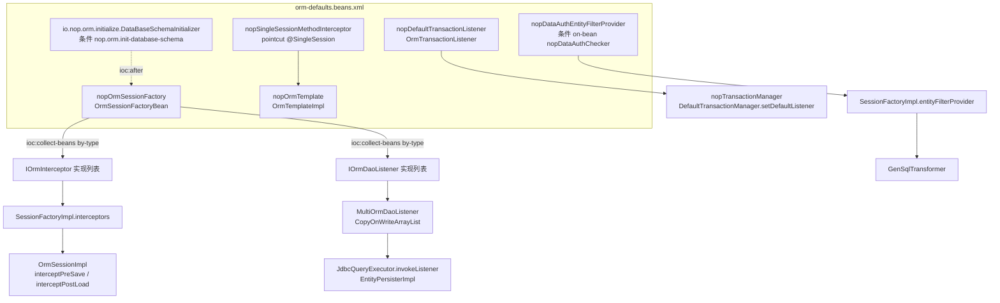

# 装配与扩展：beans、拦截器、监听器与配置

> 本页依据的源文件：
> - [nop-persistence/nop-orm/src/main/resources/_vfs/nop/orm/beans/orm-defaults.beans.xml](https://gitee.com/canonical-entropy/nop-entropy/blob/f2ecee739b/nop-persistence/nop-orm/src/main/resources/_vfs/nop/orm/beans/orm-defaults.beans.xml)
> - [nop-persistence/nop-orm/src/main/java/io/nop/orm/IOrmInterceptor.java](https://gitee.com/canonical-entropy/nop-entropy/blob/f2ecee739b/nop-persistence/nop-orm/src/main/java/io/nop/orm/IOrmInterceptor.java)
> - [nop-persistence/nop-orm/src/main/java/io/nop/orm/IOrmDaoListener.java](https://gitee.com/canonical-entropy/nop-entropy/blob/f2ecee739b/nop-persistence/nop-orm/src/main/java/io/nop/orm/IOrmDaoListener.java)
> - [nop-persistence/nop-orm/src/main/java/io/nop/orm/interceptor/XplOrmInterceptor.java](https://gitee.com/canonical-entropy/nop-entropy/blob/f2ecee739b/nop-persistence/nop-orm/src/main/java/io/nop/orm/interceptor/XplOrmInterceptor.java)
> - [nop-persistence/nop-orm/src/main/java/io/nop/orm/factory/XplOrmInterceptorLoader.java](https://gitee.com/canonical-entropy/nop-entropy/blob/f2ecee739b/nop-persistence/nop-orm/src/main/java/io/nop/orm/factory/XplOrmInterceptorLoader.java)
> - [nop-persistence/nop-orm/src/main/java/io/nop/orm/support/MultiOrmInterceptor.java](https://gitee.com/canonical-entropy/nop-entropy/blob/f2ecee739b/nop-persistence/nop-orm/src/main/java/io/nop/orm/support/MultiOrmInterceptor.java)
> - [nop-persistence/nop-orm/src/main/java/io/nop/orm/interceptor/SingleSessionMethodInterceptor.java](https://gitee.com/canonical-entropy/nop-entropy/blob/f2ecee739b/nop-persistence/nop-orm/src/main/java/io/nop/orm/interceptor/SingleSessionMethodInterceptor.java)
> - [nop-persistence/nop-orm/src/main/java/io/nop/orm/filter/DataAuthEntityFilterProvider.java](https://gitee.com/canonical-entropy/nop-entropy/blob/f2ecee739b/nop-persistence/nop-orm/src/main/java/io/nop/orm/filter/DataAuthEntityFilterProvider.java)
> - [nop-persistence/nop-orm/src/main/java/io/nop/orm/initialize/DataBaseSchemaInitializer.java](https://gitee.com/canonical-entropy/nop-entropy/blob/f2ecee739b/nop-persistence/nop-orm/src/main/java/io/nop/orm/initialize/DataBaseSchemaInitializer.java)
> - [nop-persistence/nop-orm/src/main/java/io/nop/orm/txn/OrmTransactionListener.java](https://gitee.com/canonical-entropy/nop-entropy/blob/f2ecee739b/nop-persistence/nop-orm/src/main/java/io/nop/orm/txn/OrmTransactionListener.java)
> - [nop-persistence/nop-orm/src/main/java/io/nop/orm/OrmConfigs.java](https://gitee.com/canonical-entropy/nop-entropy/blob/f2ecee739b/nop-persistence/nop-orm/src/main/java/io/nop/orm/OrmConfigs.java)

nop-orm 把缺省装配收敛到单个 `orm-defaults.beans.xml`：约 19 个 bean 以 `ioc:default="true"` 声明，`nopOrmSessionFactory` 经 `ioc:collect-beans` 按类型收集 `IOrmInterceptor` 与 `IOrmDaoListener` 两个扩展点。在此之上还有三条旁路：各模块 `app.orm-interceptor.xml` 声明式拦截（`XplOrmInterceptor`）、`@SingleSession` 注解的方法级 AOP、EQL 编译期数据权限过滤；schema 初始化由三个条件 bean 按序执行，事务提交点由 `OrmTransactionListener` 挂接，行为开关集中在 [OrmConfigs](../../../nop-persistence/nop-orm/src/main/java/io/nop/orm/OrmConfigs.java)。

## 职责与装配入口：orm-defaults.beans.xml

整个模块的 IoC 装配只有一个文件（104 行），没有按包拆分的多个 beans 文件。装配手段覆盖了 Nop IoC 的主要特性，每个 bean 用到的机制不同：

- **缺省实现标记**：除 `nopTransactionalFunctionInvoker` 外全部 bean 带 `ioc:default="true"`（orm-defaults.beans.xml:13-76），表示它们是可被应用层同名 bean 替换的缺省装配。
- **工厂 bean 模式**：`nopOrmSessionFactory` 用 `ioc:bean-method="getObject"`，容器实际暴露的是 `OrmSessionFactoryBean.getObject()` 的返回值 `IOrmSessionFactory`（orm-defaults.beans.xml:38-39，OrmSessionFactoryBean.java:40、193）。
- **按类型收集**：`daoListeners` 与 `interceptors` 两个属性用 `ioc:collect-beans by-type` 注入，并带 `ioc:ignore-depends="true"` 避免依赖放大（orm-defaults.beans.xml:44-50）。
- **条件装配**：`nopDataAuthEntityFilterProvider` 仅当容器存在 `nopDataAuthChecker` bean 时创建（`on-bean` 条件，orm-defaults.beans.xml:60-65）；三个初始化器分别绑定配置属性 `nop.orm.init-database-schema`、`nop.orm.auto-add-tenant-col`、`nop.orm.init-database-data`（`if-property` 条件，orm-defaults.beans.xml:78-97）。
- **初始化顺序**：初始化器用 `ioc:type="@bean:id"` 以类名为 id 注册，`ioc:after="nopOrmSessionFactory,..."` 强制排在工厂之后，`ioc:force-init="true"` 强制立即初始化（orm-defaults.beans.xml:78-97）。
- **循环依赖规避**：`nopDefaultTransactionListener` 的 `ormTemplate` 属性标 `ioc:lazy-property="true"`（orm-defaults.beans.xml:17-20），延迟到首次使用时赋值（见下文事务挂接一节）。

全量 bean 清单：

| Bean id | 实现 | 装配特征 | 行 |
|---|---|---|---|
| nopSqlLibManager | `sql_lib.SqlLibManager` | lazy-init、`ioc:delay-method="delayInit"` | 13-15 |
| nopDefaultTransactionListener | `txn.OrmTransactionListener` | `ormTemplate` 为 lazy-property | 17-20 |
| nopOrmGlobalCacheConfig | `CacheConfig` | `ioc:config-prefix="nop.orm.global-cache"` | 22-24 |
| nopOrmGlobalCacheProvider | `LocalCacheProvider` | 构造注入 cache config | 26-29 |
| nopShardSelector | `EmptyShardSelector.INSTANCE`（util:constant） | 静态字段常量 bean | 31-32 |
| nopSequenceGenerator | `UuidSequenceGenerator` | — | 34 |
| nopOrmColumnBinderEnhancer | `DefaultOrmColumnBinderEnhancer` | — | 36 |
| nopOrmSessionFactory | `OrmSessionFactoryBean` | `ioc:bean-method="getObject"`、collect-beans×2 | 38-51 |
| nopOrmTemplate | `impl.OrmTemplateImpl` | — | 53-54 |
| nopDaoProvider | `dao.OrmDaoProvider` | `init-method="register"` | 56-58 |
| nopDataAuthEntityFilterProvider | `filter.DataAuthEntityFilterProvider` | 条件：on-bean `nopDataAuthChecker` | 60-65 |
| nopSingleSessionMethodInterceptor | `interceptor.SingleSessionMethodInterceptor` | `ioc:pointcut annotations=@SingleSession` | 67-72 |
| nopSingleSessionFunctionInvoker | `utils.SingleSessionFunctionInvoker` | — | 74 |
| nopTransactionalFunctionInvoker | `io.nop.dao.utils.TransactionalFunctionInvoker` | 无 ioc:default（实现在 nop-dao） | 76 |
| DataBaseSchemaInitializer | `initialize.DataBaseSchemaInitializer` | 类名为 id、if-property、force-init、after 工厂 | 78-83 |
| AddTenantColInitializer | `initialize.AddTenantColInitializer` | after 工厂与 schema 初始化器 | 85-90 |
| DataInitInitializer | `initialize.DataInitInitializer` | 同上 | 92-97 |
| SqlLibDictLoader | `sql_lib.dict.SqlLibDictLoader` | 类名为 id | 99 |
| nopDaoResourceNamespaceHandler | `resource.DaoResourceNamespaceHandler` | register/unregister 生命周期方法 | 101-103 |



> Sources: [nop-persistence/nop-orm/src/main/resources/_vfs/nop/orm/beans/orm-defaults.beans.xml:13-103](https://gitee.com/canonical-entropy/nop-entropy/blob/f2ecee739b/nop-persistence/nop-orm/src/main/resources/_vfs/nop/orm/beans/orm-defaults.beans.xml#L13-L103)、[nop-persistence/nop-orm/src/main/java/io/nop/orm/factory/OrmSessionFactoryBean.java:40-193](https://gitee.com/canonical-entropy/nop-entropy/blob/f2ecee739b/nop-persistence/nop-orm/src/main/java/io/nop/orm/factory/OrmSessionFactoryBean.java#L40-L193)、[nop-persistence/nop-dao/src/main/java/io/nop/dao/txn/impl/DefaultTransactionManager.java:131-137](https://gitee.com/canonical-entropy/nop-entropy/blob/f2ecee739b/nop-persistence/nop-dao/src/main/java/io/nop/dao/txn/impl/DefaultTransactionManager.java#L131-L137)

## 扩展点契约：IOrmInterceptor 与 IOrmDaoListener

两个接口构成互补的观察面。`IOrmInterceptor` 挂在**实体对象**生命周期上，10 个回调全部是 default 方法，按需覆盖（IOrmInterceptor.java:13-53）：`preSave`/`preUpdate`/`preDelete` 返回 `ProcessResult`，非 `CONTINUE` 即中止本次写操作；`postReset`/`postSave`/`postUpdate`/`postDelete`/`postLoad` 为通知；`preFlush`/`postFlush(Throwable)` 包裹整个 flush 过程。接口继承 `IOrdered`，实现可用 order 值参与排序（IOrmInterceptor.java:13）。

`IOrmDaoListener` 挂在**SQL 访问**粒度上，只有四个方法，参数是 `IEntityModel` 而非实体实例（IOrmDaoListener.java:15-23）。接口 javadoc 说明了存在理由：用 EQL 更新数据或查询返回空集时，`IOrmInterceptor` 可能完全没有被触发的机会；daoListener 保证每次数据库访问必然回调，这一机制被自动化测试框架使用（IOrmDaoListener.java:12-14）。

| 扩展点 | 回调 | 参数/返回 | 收集或注册方式 | 触发位置 |
|---|---|---|---|---|
| IOrmInterceptor | pre/post Save、Update、Delete、Reset、Load、Flush | IOrmEntity；pre* 返回 ProcessResult | `ioc:collect-beans by-type` + `addInterceptor` | OrmSessionImpl.interceptXxx |
| IOrmDaoListener | onRead/onUpdate/onDelete/onSave | IEntityModel；void | `ioc:collect-beans by-type` + `addDaoListener` | JdbcQueryExecutor、EntityPersisterImpl |
| XplOrmInterceptor（模型级） | 同 IOrmInterceptor，按实体名分发 | Xpl 脚本 IEvalAction | 扫描 `/模块/orm/app.orm-interceptor.xml` | DefaultOrmModelProvider → LoadedOrmModel |
| @SingleSession 方法拦截 | 方法调用前后 | IMethodInvocation | `ioc:pointcut annotations` | SingleSessionMethodInterceptor |
| IEntityFilterProvider | getEntityFilter | SyntaxMarker+SQL → IMarkedString | 条件 bean（依赖 nopDataAuthChecker） | GenSqlTransformer（EQL 编译期） |
| ITransactionListener | onBeforeCommit/onAfterCompletion | ITransaction | 固定 bean id + `@Named` 注入 | DefaultTransactionManager |

> Sources: [nop-persistence/nop-orm/src/main/java/io/nop/orm/IOrmInterceptor.java:13-53](https://gitee.com/canonical-entropy/nop-entropy/blob/f2ecee739b/nop-persistence/nop-orm/src/main/java/io/nop/orm/IOrmInterceptor.java#L13-L53)、[nop-persistence/nop-orm/src/main/java/io/nop/orm/IOrmDaoListener.java:12-23](https://gitee.com/canonical-entropy/nop-entropy/blob/f2ecee739b/nop-persistence/nop-orm/src/main/java/io/nop/orm/IOrmDaoListener.java#L12-L23)

## 收集与分发机制

**收集**发生在容器启动时。`ioc:collect-beans` 把容器内所有 `IOrmInterceptor`/`IOrmDaoListener` 类型 bean 组成列表，注入 `OrmSessionFactoryBean`；`@PostConstruct init()` 中转手设置到 `SessionFactoryImpl`，同一处还注入 `entityFilterProvider`（OrmSessionFactoryBean.java:89-91）：

```xml
<property name="daoListeners">
    <ioc:collect-beans by-type="io.nop.orm.IOrmDaoListener" ioc:ignore-depends="true"/>
</property>
<property name="interceptors">
    <ioc:collect-beans by-type="io.nop.orm.IOrmInterceptor" ioc:ignore-depends="true"/>
</property>
```
（orm-defaults.beans.xml:44-50）

**存储**端，`SessionFactoryImpl` 持有 `List<IOrmInterceptor>`，`addInterceptor` 采用写时复制替换整个列表（SessionFactoryImpl.java:238-255）；daoListener 则惰性包装：第一次 `addDaoListener` 时创建 `MultiOrmDaoListener`，内部是 `CopyOnWriteArrayList`（SessionFactoryImpl.java:262-278，MultiOrmDaoListener.java:16-25）。`IOrmSessionFactory` 接口把 `addInterceptor`/`addDaoListener` 暴露为运行期 API（IOrmSessionFactory.java:62-64），支持启动后动态增删。

**分发**在会话层是双通道顺序执行。以保存为例：先调实体自身钩子 `entity.orm_preSave()`，再调模型级拦截器 `loadedOrmModel.getOrmInterceptor()`，最后遍历全局拦截器列表；任一环节返回 `STOP` 即整体短路（OrmSessionImpl.java:1111-1126）：

```java
ProcessResult interceptPreSave(IOrmEntity entity) {
    if (entity.orm_preSave() == ProcessResult.STOP)
        return ProcessResult.STOP;
    if (loadedOrmModel.getOrmInterceptor() != null) {
        if (loadedOrmModel.getOrmInterceptor().preSave(entity) == ProcessResult.STOP)
            return ProcessResult.STOP;
    }
    for (IOrmInterceptor interceptor : interceptors)
        if (interceptor.preSave(entity) == ProcessResult.STOP)
            return ProcessResult.STOP;
    return ProcessResult.CONTINUE;
}
```
（OrmSessionImpl.java:1111-1125）

post 类回调（postLoad/postSave/postUpdate/postDelete/preFlush/postFlush）同构，但不短路、广播给所有实现（OrmSessionImpl.java:1061-1108）。`support.MultiOrmInterceptor` 是同构组合器的编程版：pre 类方法逐个调用并在首个非 `CONTINUE` 处返回（MultiOrmInterceptor.java:36-66），post 类方法顺序广播（MultiOrmInterceptor.java:68-115）。

**模型级拦截器** `XplOrmInterceptor` 不在 beans 里声明，而是声明式产出：`XplOrmInterceptorLoader.loadInterceptor` 扫描每个启用模块的 `/{moduleId}/orm/app.orm-interceptor.xml`，用 `DslModelParser` 按 `OrmConstants.XDSL_SCHEMA_ORM_INTERCEPTOR` 解析，归约为 `事件 → 实体名 → IEvalAction 列表` 三层结构，同实体多条 action 按 `OrderedComparator` 排序（XplOrmInterceptorLoader.java:35-63）。运行时按 `entity.orm_entityName()` 取该实体的 action，执行作用域中注入 `entity` 变量，preFlush/postFlush 例外——无实体，postFlush 注入 `exception` 变量（XplOrmInterceptor.java:113-123、205-214）。该加载结果经 `DefaultOrmModelProvider` 的 `interceptorCache` 缓存，是否检查变更由 `CFG_ORM_INTERCEPTOR_CACHE_CHECK_CHANGE` 控制，即支持不重启更新拦截脚本（DefaultOrmModelProvider.java:36-41，OrmConfigs.java:77-79）。注意一处命名不对称：配置事件 `PRE_RESET` 的 action 实际在 `postReset` 回调中执行（XplOrmInterceptor.java:55-64、168-170）。

**daoListener 触发点**在 SQL 执行面：`JdbcQueryExecutor.invokeListener` 在执行语句前按 `ICompiledSql` 的 `readEntityNames` 逐个回调 `onRead`，再按 `statementKind`（DELETE/UPDATE/INSERT）对写实体回调对应方法（JdbcQueryExecutor.java:118-140）；persister 的 save/update/delete 路径各有对应调用（EntityPersisterImpl.java:146、221、250、638、662）。

**@SingleSession 方法拦截**是第三个入口。`SingleSessionMethodInterceptor` 实现 `IMethodInterceptor`，仅当目标方法标注 `@SingleSession` 时把整个方法体包进 `ormTemplate.runInSession(...)`，异步方法走 `runInSessionAsync`（SingleSessionMethodInterceptor.java:27-50）：

```java
public Object invoke(IMethodInvocation inv) throws Exception {
    IFunctionModel method = inv.getMethod();
    SingleSession singleSession = method.getAnnotation(SingleSession.class);
    if (singleSession == null)
        return inv.proceed();
    if (method.isAsync()) {
        return ormTemplate.runInSessionAsync(session -> { ... inv.proceed() ... });
    }
    return ormTemplate.runInSession(session -> { ... inv.proceed() ... });
}
```
（SingleSessionMethodInterceptor.java:27-49，节略）

bean 上以 `ioc:pointcut annotations="io.nop.api.core.annotations.orm.SingleSession"` 声明切点，优先级取 `ApiConstants.INTERCEPTOR_PRIORITY_SINGLE_SESSION`（orm-defaults.beans.xml:67-72）。同族还有 RPC 面的 `SingleSessionServiceInterceptor`（实现 `IRpcServiceInterceptor`，intercept/interceptAsync 均包进 session，SingleSessionServiceInterceptor.java:19-34）和函数调度面的 `SingleSessionFunctionInvoker`（SingleSessionFunctionInvoker.java:19-36）。session 绑定语义见 modules/session-factory.md。

> Sources: [nop-persistence/nop-orm/src/main/resources/_vfs/nop/orm/beans/orm-defaults.beans.xml:44-72](https://gitee.com/canonical-entropy/nop-entropy/blob/f2ecee739b/nop-persistence/nop-orm/src/main/resources/_vfs/nop/orm/beans/orm-defaults.beans.xml#L44-L72)、[nop-persistence/nop-orm/src/main/java/io/nop/orm/session/OrmSessionImpl.java:1061-1126](https://gitee.com/canonical-entropy/nop-entropy/blob/f2ecee739b/nop-persistence/nop-orm/src/main/java/io/nop/orm/session/OrmSessionImpl.java#L1061-L1126)、[nop-persistence/nop-orm/src/main/java/io/nop/orm/factory/XplOrmInterceptorLoader.java:35-63](https://gitee.com/canonical-entropy/nop-entropy/blob/f2ecee739b/nop-persistence/nop-orm/src/main/java/io/nop/orm/factory/XplOrmInterceptorLoader.java#L35-L63)、[nop-persistence/nop-orm/src/main/java/io/nop/orm/loader/JdbcQueryExecutor.java:118-140](https://gitee.com/canonical-entropy/nop-entropy/blob/f2ecee739b/nop-persistence/nop-orm/src/main/java/io/nop/orm/loader/JdbcQueryExecutor.java#L118-L140)

## 数据权限过滤：DataAuthEntityFilterProvider

数据权限不走拦截器，而是嵌进 EQL→SQL 的编译期变换。`DataAuthEntityFilterProvider` 实现 `sql.IEntityFilterProvider`（接口只有一个方法，IEntityFilterProvider.java:16-18），其 bean 装配以 `on-bean nopDataAuthChecker` 为条件——容器里没有数据权限校验器时整个过滤面不存在（orm-defaults.beans.xml:60-65）。取过滤条件的过程：

```java
public IMarkedString getEntityFilter(SyntaxMarker marker, SQL sql, ISqlCompileTool compiler) {
    IServiceContext ctx = IServiceContext.getCtx();
    if (ctx == null) ctx = new ServiceContextImpl();
    String bizObj = StringHelper.simpleClassName(marker.getEntityName());
    ITreeBean filter = dataAuthChecker.getFilter(bizObj, DATA_AUTH_ACTION_SQL, ctx);
    IMarkedString filteredSql = FilterSqlHelper.buildFilterSQL(filter, marker.getEntityName(),
            marker.getAlias(), compiler, ctx);
    return filteredSql == null ? MarkedString.EMPTY : filteredSql;
}
```
（DataAuthEntityFilterProvider.java:26-39）

实体名被截为简单类名后作为业务对象标识传给 `IDataAuthChecker.getFilter`，动作码固定为 `DATA_AUTH_ACTION_SQL`；`FilterSqlHelper` 把返回的过滤树编译为带别名的 SQL 片段，无过滤时返回 `MarkedString.EMPTY`（DataAuthEntityFilterProvider.java:33-38）。provider 经 `SessionFactoryImpl.setEntityFilterProvider` 进入引擎（OrmSessionFactoryBean.java:91，SessionFactoryImpl.java:135-136），消费方是 `GenSqlTransformer`——其构造函数直接持有 `IEntityFilterProvider` 字段（GenSqlTransformer.java:40、54）。查询管线全貌见 flows/query-pipeline.md。

> Sources: [nop-persistence/nop-orm/src/main/java/io/nop/orm/filter/DataAuthEntityFilterProvider.java:26-39](https://gitee.com/canonical-entropy/nop-entropy/blob/f2ecee739b/nop-persistence/nop-orm/src/main/java/io/nop/orm/filter/DataAuthEntityFilterProvider.java#L26-L39)、[nop-persistence/nop-orm/src/main/java/io/nop/orm/sql/IEntityFilterProvider.java:16-18](https://gitee.com/canonical-entropy/nop-entropy/blob/f2ecee739b/nop-persistence/nop-orm/src/main/java/io/nop/orm/sql/IEntityFilterProvider.java#L16-L18)、[nop-persistence/nop-orm/src/main/java/io/nop/orm/sql/GenSqlTransformer.java:40-54](https://gitee.com/canonical-entropy/nop-entropy/blob/f2ecee739b/nop-persistence/nop-orm/src/main/java/io/nop/orm/sql/GenSqlTransformer.java#L40-L54)

## Schema 初始化与事务挂接：生命周期链

启动期有三条按 `ioc:after` 串成链的条件初始化路径，全部排在 `nopOrmSessionFactory` 之后（orm-defaults.beans.xml:78-97）：

1. **DataBaseSchemaInitializer**：`@PostConstruct init()` 从工厂取 `IOrmModel`，按拓扑序遍历实体模型，跳过视图（`isTableView`），对每个 querySpace 用方言相关的 `DdlSqlCreator.createTable(table, false)` 生成建表语句，仅在 `existsTable` 为否时 `executeUpdate`——即只建缺失表，不改已有结构（DataBaseSchemaInitializer.java:56-72）：

```java
IOrmModel ormModel = ormSessionFactory.getOrmModel();
Collection<? extends IEntityModel> tables = ormModel.getEntityModelsInTopoOrder();
for (IEntityModel table : tables) {
    if (table.isTableView()) continue;
    String querySpace = table.getQuerySpace();
    String createSql = new DdlSqlCreator(jdbcTemplate.getDialectForQuerySpace(querySpace))
            .createTable(table, false);
    if (!jdbcTemplate.existsTable(querySpace, table.getTableName())) {
        jdbcTemplate.executeUpdate(SQL.begin().querySpace(querySpace)
                .name("create:" + table.getTableName()).sql(createSql).end());
    }
}
```
（DataBaseSchemaInitializer.java:57-72，节略）

   其静态方法 `splitByQuerySpace` 供 dbtool 等外部调用方复用：按 `EXT_AUTO_UPGRADE_DATABASE` 扩展属性过滤实体，并用 `@InjectValue` 注入的 `specifyQuerySpaces` 白名单限定范围；该静态字段仅在被容器实例化时赋值，外部直接调用时为 null，代码有显式防御（DataBaseSchemaInitializer.java:41-44、74-92）。
2. **AddTenantColInitializer**：绑定 `nop.orm.auto-add-tenant-col`，场景是"从不使用租户升级到使用租户"，为既有表补租户列（AddTenantColInitializer.java:18-19）。
3. **DataInitInitializer**：绑定 `nop.orm.init-database-data`，数据目录由 `@InjectValue("@cfg:nop.orm.init-database-data-location|/_init-data/")` 注入（DataInitInitializer.java:60-62）。

事务挂接则由 `nopDefaultTransactionListener` 完成。`OrmTransactionListener.onBeforeCommit` 在事务提交前调 `ormTemplate.flushSession()`，把 session 中挂起变更推入当前事务；`onAfterCompletion` 在非 COMMIT 结局时清空 session 缓存，注释明确这是与 Spring+Hibernate 一致的行为——不清空会导致 session 与数据库不一致（OrmTransactionListener.java:29-48）。`ormTemplate` 是 lazy-property：容器创建阶段（如 DataInitInitializer 执行 `_init-data` 脚本时）该属性尚未赋值，此时事务退化为纯 JDBC 原始 SQL，`ormTemplate != null` 判断使监听器安全跳过，这也解释了事务管理器到 OrmTemplate 的循环依赖为何存在（OrmTransactionListener.java:30-33）。注册点在 nop-dao：`DefaultTransactionManager.setDefaultListener` 以 `@Named("nopDefaultTransactionListener")` 按名注入该 bean（DefaultTransactionManager.java:131-137，dao-defaults.beans.xml:16-24）。flush 与事务的完整时序见 flows/entity-lifecycle.md。

> Sources: [nop-persistence/nop-orm/src/main/java/io/nop/orm/initialize/DataBaseSchemaInitializer.java:41-92](https://gitee.com/canonical-entropy/nop-entropy/blob/f2ecee739b/nop-persistence/nop-orm/src/main/java/io/nop/orm/initialize/DataBaseSchemaInitializer.java#L41-L92)、[nop-persistence/nop-orm/src/main/java/io/nop/orm/txn/OrmTransactionListener.java:29-48](https://gitee.com/canonical-entropy/nop-entropy/blob/f2ecee739b/nop-persistence/nop-orm/src/main/java/io/nop/orm/txn/OrmTransactionListener.java#L29-L48)、[nop-persistence/nop-dao/src/main/java/io/nop/dao/txn/impl/DefaultTransactionManager.java:131-137](https://gitee.com/canonical-entropy/nop-entropy/blob/f2ecee739b/nop-persistence/nop-dao/src/main/java/io/nop/dao/txn/impl/DefaultTransactionManager.java#L131-L137)

## 不变式与失败行为

- **短路语义只属于 pre 类回调**：`preSave/preUpdate/preDelete` 任一返回非 `CONTINUE` 即终止整个写操作，post 类回调无中止能力（OrmSessionImpl.java:1111-1126，MultiOrmInterceptor.java:36-66）。
- **事件名白名单**：`XplOrmInterceptor.setActions` 收到未知事件名直接抛 `IllegalArgumentException("nop.err.orm.unsupported-event:" + event)`（XplOrmInterceptor.java:72-74）。
- **并发安全策略不一致**：拦截器列表是写时复制的不可变快照（SessionFactoryImpl.java:242-248），daoListener 是 `CopyOnWriteArrayList`（MultiOrmDaoListener.java:17），二者都偏向读多写少场景，但删除拦截器不会影响正在遍历的旧快照。
- **初始化器只做增量**：建表仅补缺失表，自动升级差异表结构的能力不在本模块，需引入 `nop-dbtool-core` 并开启 `nop.orm.db-differ.auto-upgrade-database`，配置注释明确警示生产风险（OrmConfigs.java:62-67）。
- **过滤面可整体缺席**：无 `nopDataAuthChecker` 时 provider 不装配，EQL 编译不附加任何过滤条件——数据权限是"有校验器才生效"而不是缺省开启（orm-defaults.beans.xml:60-65）。
- **事务监听器空安全**：lazy 属性未赋值期间所有回调静默跳过，不抛错（OrmTransactionListener.java:30-33、38-40）。

> Sources: [nop-persistence/nop-orm/src/main/java/io/nop/orm/session/OrmSessionImpl.java:1111-1126](https://gitee.com/canonical-entropy/nop-entropy/blob/f2ecee739b/nop-persistence/nop-orm/src/main/java/io/nop/orm/session/OrmSessionImpl.java#L1111-L1126)、[nop-persistence/nop-orm/src/main/java/io/nop/orm/interceptor/XplOrmInterceptor.java:72-74](https://gitee.com/canonical-entropy/nop-entropy/blob/f2ecee739b/nop-persistence/nop-orm/src/main/java/io/nop/orm/interceptor/XplOrmInterceptor.java#L72-L74)、[nop-persistence/nop-orm/src/main/java/io/nop/orm/OrmConfigs.java:62-67](https://gitee.com/canonical-entropy/nop-entropy/blob/f2ecee739b/nop-persistence/nop-orm/src/main/java/io/nop/orm/OrmConfigs.java#L62-L67)

## 配置项与运维

`OrmConfigs` 用 `IConfigReference` 常量集中声明配置键与缺省值，全部支持运行期经配置中心刷新。装配相关的键：

| 配置键 | 缺省值 | 作用 | 出处 |
|---|---|---|---|
| nop.orm.init-database-schema | false | 触发 DataBaseSchemaInitializer 建表 | OrmConfigs.java:50-52 |
| nop.orm.init-database-data | false | 触发 DataInitInitializer 导入数据 | OrmConfigs.java:54-56 |
| nop.orm.init-database-data-location | /_init-data/ | 初始数据查找目录 | OrmConfigs.java:58-60 |
| nop.orm.auto-add-tenant-col | （无值即不启用） | 触发 AddTenantColInitializer | orm-defaults.beans.xml:85-90 |
| nop.orm.db-differ.auto-upgrade-database | false | 自动升级（需 nop-dbtool-core） | OrmConfigs.java:62-67 |
| nop.orm.check-mandatory-when-save / -update | true / true | 保存/更新时校验必填字段 | OrmConfigs.java:23-29 |
| nop.orm.default-entity-batch-load-size | 1000 | 批量加载单次上限 | OrmConfigs.java:31-33 |
| nop.orm.query-plan-cache-size | 1000 | EQL 编译缓存大小 | OrmConfigs.java:35-36 |
| nop.orm.entity-global-cache.size / .timeout | 10000 / 10 分钟 | 实体全局缓存容量与过期 | OrmConfigs.java:38-44 |
| nop.orm.entity.global-cache.enabled | true | 全局缓存总开关（orm 内 useGlobalCache 的前置） | OrmConfigs.java:46-48 |
| nop.orm.interceptor-cache-check-change | true | 拦截脚本缓存动态加载 | OrmConfigs.java:77-79 |
| nop.orm.model-cache-check-change | true | ORM 模型缓存动态加载 | OrmConfigs.java:81-83 |
| nop.orm.session-check-context | true | 校验 session 绑定上下文一致性 | OrmConfigs.java:92-94 |

全局缓存 bean 走另一条路：`nopOrmGlobalCacheConfig` 以 `ioc:config-prefix="nop.orm.global-cache"` 整段绑定 CacheConfig（orm-defaults.beans.xml:22-24），供 `nopOrmGlobalCacheProvider` 构造使用（orm-defaults.beans.xml:26-29）。`OrmSessionFactoryBean` 实现 `IConfigRefreshable`，配置变化时仅重设 query plan 缓存与全局缓存的 maximumSize/expireAfterWrite，不重建工厂（OrmSessionFactoryBean.java:55-67）。缓存与租户模型缓存的容量细节见 modules/session-factory.md；改这些值的上手路径见 quickstart.md，术语定义见 glossary.md。

> Sources: [nop-persistence/nop-orm/src/main/java/io/nop/orm/OrmConfigs.java:23-98](https://gitee.com/canonical-entropy/nop-entropy/blob/f2ecee739b/nop-persistence/nop-orm/src/main/java/io/nop/orm/OrmConfigs.java#L23-L98)、[nop-persistence/nop-orm/src/main/resources/_vfs/nop/orm/beans/orm-defaults.beans.xml:22-29](https://gitee.com/canonical-entropy/nop-entropy/blob/f2ecee739b/nop-persistence/nop-orm/src/main/resources/_vfs/nop/orm/beans/orm-defaults.beans.xml#L22-L29)、[nop-persistence/nop-orm/src/main/java/io/nop/orm/factory/OrmSessionFactoryBean.java:55-67](https://gitee.com/canonical-entropy/nop-entropy/blob/f2ecee739b/nop-persistence/nop-orm/src/main/java/io/nop/orm/factory/OrmSessionFactoryBean.java#L55-L67)

## 关键测试与延伸阅读

按 PLAN.md 的约定，测试目录证据归 quickstart.md 页，本页不展开测试叙事；但 `IOrmDaoListener` 的 javadoc 指明其存在动机之一是服务自动化测试框架——每次数据库访问必然回调，即使 EQL 更新或空结果查询绕过了实体级拦截器（IOrmDaoListener.java:12-14）。扩展点在实体状态机中的触发位置、flush 与事务的交互，分别在 flows/entity-lifecycle.md 与 architecture.md 展开；模块全景见 overview.md 与 reading-guide.md。

本页未能覆盖：`SqlLibDictLoader` 与 `DaoResourceNamespaceHandler` 的内部机制（仅确认装配方式，orm-defaults.beans.xml:99-103）；`nop-data-auth` 模块中 `IDataAuthChecker` 的实现；`FilterSqlHelper` 的 SQL 片段拼接算法。

> Sources: [nop-persistence/nop-orm/src/main/java/io/nop/orm/IOrmDaoListener.java:12-14](https://gitee.com/canonical-entropy/nop-entropy/blob/f2ecee739b/nop-persistence/nop-orm/src/main/java/io/nop/orm/IOrmDaoListener.java#L12-L14)、[nop-persistence/nop-orm/src/main/resources/_vfs/nop/orm/beans/orm-defaults.beans.xml:99-103](https://gitee.com/canonical-entropy/nop-entropy/blob/f2ecee739b/nop-persistence/nop-orm/src/main/resources/_vfs/nop/orm/beans/orm-defaults.beans.xml#L99-L103)

## Sources

- [nop-persistence/nop-orm/src/main/resources/_vfs/nop/orm/beans/orm-defaults.beans.xml:13-103](https://gitee.com/canonical-entropy/nop-entropy/blob/f2ecee739b/nop-persistence/nop-orm/src/main/resources/_vfs/nop/orm/beans/orm-defaults.beans.xml#L13-L103)
- [nop-persistence/nop-orm/src/main/java/io/nop/orm/IOrmInterceptor.java:13-53](https://gitee.com/canonical-entropy/nop-entropy/blob/f2ecee739b/nop-persistence/nop-orm/src/main/java/io/nop/orm/IOrmInterceptor.java#L13-L53)
- [nop-persistence/nop-orm/src/main/java/io/nop/orm/IOrmDaoListener.java:12-23](https://gitee.com/canonical-entropy/nop-entropy/blob/f2ecee739b/nop-persistence/nop-orm/src/main/java/io/nop/orm/IOrmDaoListener.java#L12-L23)
- [nop-persistence/nop-orm/src/main/java/io/nop/orm/interceptor/XplOrmInterceptor.java:55-214](https://gitee.com/canonical-entropy/nop-entropy/blob/f2ecee739b/nop-persistence/nop-orm/src/main/java/io/nop/orm/interceptor/XplOrmInterceptor.java#L55-L214)
- [nop-persistence/nop-orm/src/main/java/io/nop/orm/factory/XplOrmInterceptorLoader.java:35-63](https://gitee.com/canonical-entropy/nop-entropy/blob/f2ecee739b/nop-persistence/nop-orm/src/main/java/io/nop/orm/factory/XplOrmInterceptorLoader.java#L35-L63)
- [nop-persistence/nop-orm/src/main/java/io/nop/orm/support/MultiOrmInterceptor.java:36-115](https://gitee.com/canonical-entropy/nop-entropy/blob/f2ecee739b/nop-persistence/nop-orm/src/main/java/io/nop/orm/support/MultiOrmInterceptor.java#L36-L115)
- [nop-persistence/nop-orm/src/main/java/io/nop/orm/interceptor/SingleSessionMethodInterceptor.java:27-49](https://gitee.com/canonical-entropy/nop-entropy/blob/f2ecee739b/nop-persistence/nop-orm/src/main/java/io/nop/orm/interceptor/SingleSessionMethodInterceptor.java#L27-L49)
- [nop-persistence/nop-orm/src/main/java/io/nop/orm/interceptor/SingleSessionServiceInterceptor.java:19-34](https://gitee.com/canonical-entropy/nop-entropy/blob/f2ecee739b/nop-persistence/nop-orm/src/main/java/io/nop/orm/interceptor/SingleSessionServiceInterceptor.java#L19-L34)
- [nop-persistence/nop-orm/src/main/java/io/nop/orm/utils/SingleSessionFunctionInvoker.java:19-36](https://gitee.com/canonical-entropy/nop-entropy/blob/f2ecee739b/nop-persistence/nop-orm/src/main/java/io/nop/orm/utils/SingleSessionFunctionInvoker.java#L19-L36)
- [nop-persistence/nop-orm/src/main/java/io/nop/orm/filter/DataAuthEntityFilterProvider.java:26-39](https://gitee.com/canonical-entropy/nop-entropy/blob/f2ecee739b/nop-persistence/nop-orm/src/main/java/io/nop/orm/filter/DataAuthEntityFilterProvider.java#L26-L39)
- [nop-persistence/nop-orm/src/main/java/io/nop/orm/sql/IEntityFilterProvider.java:16-18](https://gitee.com/canonical-entropy/nop-entropy/blob/f2ecee739b/nop-persistence/nop-orm/src/main/java/io/nop/orm/sql/IEntityFilterProvider.java#L16-L18)
- [nop-persistence/nop-orm/src/main/java/io/nop/orm/sql/GenSqlTransformer.java:40-54](https://gitee.com/canonical-entropy/nop-entropy/blob/f2ecee739b/nop-persistence/nop-orm/src/main/java/io/nop/orm/sql/GenSqlTransformer.java#L40-L54)
- [nop-persistence/nop-orm/src/main/java/io/nop/orm/initialize/DataBaseSchemaInitializer.java:41-92](https://gitee.com/canonical-entropy/nop-entropy/blob/f2ecee739b/nop-persistence/nop-orm/src/main/java/io/nop/orm/initialize/DataBaseSchemaInitializer.java#L41-L92)
- [nop-persistence/nop-orm/src/main/java/io/nop/orm/initialize/DataInitInitializer.java:60-62](https://gitee.com/canonical-entropy/nop-entropy/blob/f2ecee739b/nop-persistence/nop-orm/src/main/java/io/nop/orm/initialize/DataInitInitializer.java#L60-L62)
- [nop-persistence/nop-orm/src/main/java/io/nop/orm/initialize/AddTenantColInitializer.java:18-19](https://gitee.com/canonical-entropy/nop-entropy/blob/f2ecee739b/nop-persistence/nop-orm/src/main/java/io/nop/orm/initialize/AddTenantColInitializer.java#L18-L19)
- [nop-persistence/nop-orm/src/main/java/io/nop/orm/txn/OrmTransactionListener.java:29-48](https://gitee.com/canonical-entropy/nop-entropy/blob/f2ecee739b/nop-persistence/nop-orm/src/main/java/io/nop/orm/txn/OrmTransactionListener.java#L29-L48)
- [nop-persistence/nop-orm/src/main/java/io/nop/orm/OrmConfigs.java:23-98](https://gitee.com/canonical-entropy/nop-entropy/blob/f2ecee739b/nop-persistence/nop-orm/src/main/java/io/nop/orm/OrmConfigs.java#L23-L98)
- [nop-persistence/nop-orm/src/main/java/io/nop/orm/factory/OrmSessionFactoryBean.java:40-193](https://gitee.com/canonical-entropy/nop-entropy/blob/f2ecee739b/nop-persistence/nop-orm/src/main/java/io/nop/orm/factory/OrmSessionFactoryBean.java#L40-L193)
- [nop-persistence/nop-orm/src/main/java/io/nop/orm/factory/SessionFactoryImpl.java:238-278](https://gitee.com/canonical-entropy/nop-entropy/blob/f2ecee739b/nop-persistence/nop-orm/src/main/java/io/nop/orm/factory/SessionFactoryImpl.java#L238-L278)
- [nop-persistence/nop-orm/src/main/java/io/nop/orm/factory/DefaultOrmModelProvider.java:36-41](https://gitee.com/canonical-entropy/nop-entropy/blob/f2ecee739b/nop-persistence/nop-orm/src/main/java/io/nop/orm/factory/DefaultOrmModelProvider.java#L36-L41)
- [nop-persistence/nop-orm/src/main/java/io/nop/orm/IOrmSessionFactory.java:62-64](https://gitee.com/canonical-entropy/nop-entropy/blob/f2ecee739b/nop-persistence/nop-orm/src/main/java/io/nop/orm/IOrmSessionFactory.java#L62-L64)
- [nop-persistence/nop-orm/src/main/java/io/nop/orm/impl/MultiOrmDaoListener.java:16-25](https://gitee.com/canonical-entropy/nop-entropy/blob/f2ecee739b/nop-persistence/nop-orm/src/main/java/io/nop/orm/impl/MultiOrmDaoListener.java#L16-L25)
- [nop-persistence/nop-orm/src/main/java/io/nop/orm/session/OrmSessionImpl.java:1061-1126](https://gitee.com/canonical-entropy/nop-entropy/blob/f2ecee739b/nop-persistence/nop-orm/src/main/java/io/nop/orm/session/OrmSessionImpl.java#L1061-L1126)
- [nop-persistence/nop-orm/src/main/java/io/nop/orm/loader/JdbcQueryExecutor.java:118-140](https://gitee.com/canonical-entropy/nop-entropy/blob/f2ecee739b/nop-persistence/nop-orm/src/main/java/io/nop/orm/loader/JdbcQueryExecutor.java#L118-L140)
- [nop-persistence/nop-orm/src/main/java/io/nop/orm/persister/EntityPersisterImpl.java:146-662](https://gitee.com/canonical-entropy/nop-entropy/blob/f2ecee739b/nop-persistence/nop-orm/src/main/java/io/nop/orm/persister/EntityPersisterImpl.java#L146-L662)
- [nop-persistence/nop-dao/src/main/java/io/nop/dao/txn/impl/DefaultTransactionManager.java:131-137](https://gitee.com/canonical-entropy/nop-entropy/blob/f2ecee739b/nop-persistence/nop-dao/src/main/java/io/nop/dao/txn/impl/DefaultTransactionManager.java#L131-L137)
- [nop-persistence/nop-dao/src/main/resources/_vfs/nop/dao/beans/dao-defaults.beans.xml:16-24](https://gitee.com/canonical-entropy/nop-entropy/blob/f2ecee739b/nop-persistence/nop-dao/src/main/resources/_vfs/nop/dao/beans/dao-defaults.beans.xml#L16-L24)

---

## On this page

- 职责与装配入口：orm-defaults.beans.xml
- 扩展点契约：IOrmInterceptor 与 IOrmDaoListener
- 收集与分发机制
- 数据权限过滤：DataAuthEntityFilterProvider
- Schema 初始化与事务挂接：生命周期链
- 不变式与失败行为
- 配置项与运维
- 关键测试与延伸阅读
