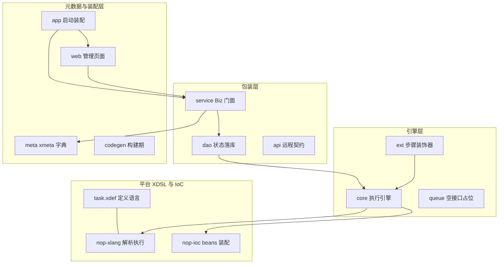
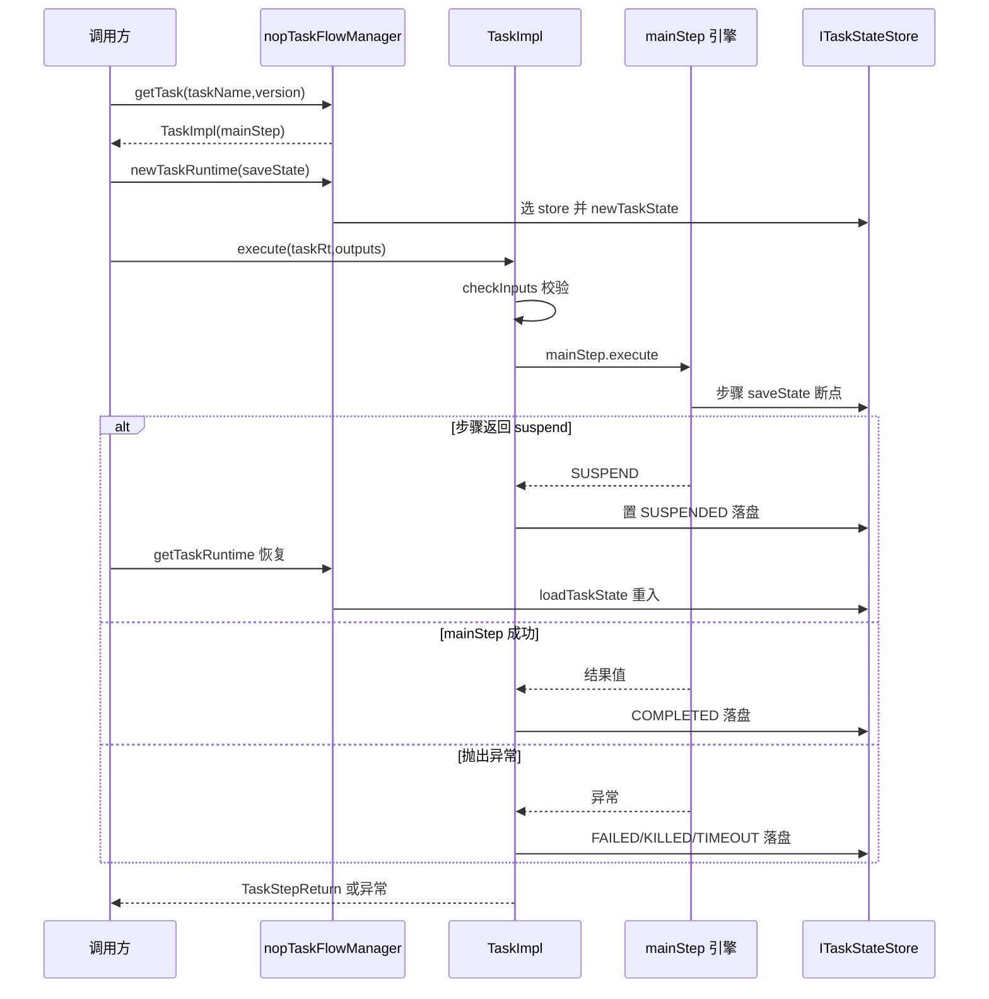

# 架构与数据流

nop-task 由十个 Maven 子模块组成：nop-task-core 持有全部执行语义，dao/service/api/ext 以单向依赖包装引擎，meta/codegen/web/app 承担元数据与装配。本页给出子模块分层、一次任务从定义到终态的数据流、状态存储的架构接缝；机制细节见[任务执行管线](flows/task-execution.md)等子页。

> 本页源文件基准（相对 `deepwiki/nop-task/` 需两级回溯至仓库根，已逐条验证可解析）：
>
> - [../../nop-task/nop-task-core/src/main/java/io/nop/task/impl/TaskFlowManagerImpl.java](../../nop-task/nop-task-core/src/main/java/io/nop/task/impl/TaskFlowManagerImpl.java)
> - [../../nop-task/nop-task-core/src/main/java/io/nop/task/impl/TaskRuntimeImpl.java](../../nop-task/nop-task-core/src/main/java/io/nop/task/impl/TaskRuntimeImpl.java)
> - [../../nop-task/nop-task-core/src/main/java/io/nop/task/impl/TaskImpl.java](../../nop-task/nop-task-core/src/main/java/io/nop/task/impl/TaskImpl.java)
> - [../../nop-task/nop-task-core/src/main/java/io/nop/task/step/GraphTaskStep.java](../../nop-task/nop-task-core/src/main/java/io/nop/task/step/GraphTaskStep.java)
> - [../../nop-task/nop-task-core/src/main/java/io/nop/task/ITaskStateStore.java](../../nop-task/nop-task-core/src/main/java/io/nop/task/ITaskStateStore.java)
> - [../../nop-task/nop-task-dao/src/main/java/io/nop/task/dao/store/DaoTaskStateStore.java](../../nop-task/nop-task-dao/src/main/java/io/nop/task/dao/store/DaoTaskStateStore.java)
> - [../../nop-kernel/nop-xdefs/src/main/resources/_vfs/nop/schema/task/task.xdef](../../nop-kernel/nop-xdefs/src/main/resources/_vfs/nop/schema/task/task.xdef)
> - [../../nop-task/nop-task-core/src/main/resources/_vfs/nop/task/beans/task-defaults.beans.xml](../../nop-task/nop-task-core/src/main/resources/_vfs/nop/task/beans/task-defaults.beans.xml)

## 十个子模块的分层与依赖方向

聚合 pom 声明十个子模块：core、dao、web、queue、codegen、api、meta、service、app、ext（`nop-task/pom.xml:20-29`）。依赖方向严格单向，没有模块反向包含引擎内部。core 只依赖平台的 nop-xlang 与 nop-ioc（`nop-task/nop-task-core/pom.xml:18,23`），是唯一的运行时引擎；dao 在 nop-orm 之上实现引擎的 store 契约（`nop-task/nop-task-dao/pom.xml:23,28`）；service 叠加 dao 与 nop-biz 提供 BizModel 门面（`nop-task/nop-task-service/pom.xml:17,33,39`）；api 仅依赖 nop-api-core（`nop-task/nop-task-api/pom.xml:23`），可被客户端独立引用；ext 在 core 之上注册步骤装饰器（`nop-task/nop-task-ext/pom.xml:21,26,31`），对 dao 的依赖是测试范围（`nop-task/nop-task-ext/pom.xml:52-56`）；codegen 在 dao/service/web 三个 pom 中均为 test scope（`nop-task/nop-task-dao/pom.xml:32-35`），是构建期生成器而非运行时依赖；queue 除聚合父 pom 外零依赖。

| 子模块 | 运行时角色 | 直接依赖（pom 行号） | 关键类型与事实 |
|---|---|---|---|
| nop-task-core | 执行引擎（步骤抽象/模型层/常量/错误） | nop-xlang:18、nop-ioc:23 | `TaskFlowManagerImpl` 唯一引擎入口 bean；175 个源文件 |
| nop-task-dao | 状态落库 | nop-api-core:18、nop-orm:23、nop-task-core:28 | `DaoTaskStateStore` 唯一 DB store；两实体表 |
| nop-task-service | BizModel 服务面 | nop-task-dao:17、nop-task-core:22、nop-task-meta:33、nop-biz:39 | 4 个 BizModel 全继承 `CrudBizModel`，唯一自定义是禁 `copyForNew`（[详见服务面子页](modules/task-service-dao.md)） |
| nop-task-api | 远程 CRUD 契约 | 仅 nop-api-core:23 | `__XGEN_FORCE_OVERRIDE__` 生成物 12 个文件；`NopTaskDefinitionApi` 绑定 `@BizModel` 并继承 `ICrudApi`（`nop-task/nop-task-api/src/main/java/io/nop/task/api/crud/NopTaskDefinitionApi.java:10-13`） |
| nop-task-ext | 步骤装饰器扩展 | nop-orm:21、nop-dao:26、nop-task-core:31（dao 仅测试） | `task-ext.beans.xml` 按约定名注册 5 个装饰器：transaction/ormSession/retry/timeout/rateLimit |
| nop-task-queue | 队列占位 | 零依赖 | 全部源码仅 `ITaskQueue` 空方法 `enqueueTask()`（`nop-task/nop-task-queue/src/main/java/io/nop/task/queue/ITaskQueue.java:3-5`） |
| nop-task-meta | 模型元数据 | —（纯资源） | 4 实体 xmeta、3 个状态字典（`nop-task/nop-task-meta/src/main/resources/_vfs/dict/task/task-status.dict.yaml:1-38`，状态 0-70 与引擎状态码对齐） |
| nop-task-codegen | 构建期生成器 | dao/service/web pom 均 test scope | `NopTaskCodeGen` + `gen-orm.xgen`，生成 dao 实体与 `_gen` 基类 |
| nop-task-web | 管理页面 | nop-task-meta、nop-task-codegen、nop-task-service | src/main 无 Java 文件，纯 `_vfs/nop/task/pages/` 页面资源 |
| nop-task-app | 启动装配 | nop-task-service、nop-task-web | `NopTaskApplication` + 集成测试（写保护/数据权限） |

api 与 queue 在图中是孤立/虚线节点：api 只面向客户端（与 service 的 BizModel 同名绑定，不进引擎依赖链），queue 无任何边——它是唯一的未落地模块。层次关系与各模块源文件数的一致性核查见[服务面与持久化对接](modules/task-service-dao.md)。

> Sources: [nop-task/pom.xml:20-29](https://gitee.com/canonical-entropy/nop-entropy/blob/0e67dba845/nop-task/pom.xml#L20-L29)、[nop-task/nop-task-core/pom.xml:18-23](https://gitee.com/canonical-entropy/nop-entropy/blob/0e67dba845/nop-task/nop-task-core/pom.xml#L18-L23)、[nop-task/nop-task-dao/pom.xml:18-35](https://gitee.com/canonical-entropy/nop-entropy/blob/0e67dba845/nop-task/nop-task-dao/pom.xml#L18-L35)、[nop-task/nop-task-service/pom.xml:17-39](https://gitee.com/canonical-entropy/nop-entropy/blob/0e67dba845/nop-task/nop-task-service/pom.xml#L17-L39)、[nop-task/nop-task-queue/src/main/java/io/nop/task/queue/ITaskQueue.java:3-5](https://gitee.com/canonical-entropy/nop-entropy/blob/0e67dba845/nop-task/nop-task-queue/src/main/java/io/nop/task/queue/ITaskQueue.java#L3-L5)

## 平台 XDSL 体系中的位置

nop-task 的任务定义语言是平台 XDSL 体系的一个普通成员，而非私有 XML 解析器。schema 文件 task.xdef 位于平台内核模块 nop-kernel/nop-xdefs 的 `/nop/schema/task/task.xdef`（`nop-kernel/nop-xdefs/src/main/resources/_vfs/nop/schema/task/task.xdef:1-304`），根节点声明 `xdef:name="TaskFlowModel"`、`xdef:bean-package="io.nop.task.model"`（同文件 9-14 行）——模型基类由 xdef 工具链生成到 core 的 `_gen` 包，手写子类只补行为，这条生成链路见[核心引擎与步骤抽象](modules/task-core.md)。头注释写明引擎定位："支持异步执行的轻量化任务引擎。持久化状态为可选特性"（task.xdef:4-5）。

core 通过两个平台接缝消费这套体系。其一是解析：`TaskFlowManagerImpl.parseTask` 直接用 xlang 的 `DslModelParser.parseFromResource` 解析资源（`nop-task/nop-task-core/src/main/java/io/nop/task/impl/TaskFlowManagerImpl.java:33,150-153`）；常规加载则拼 `task/{name}/v{version}` 路径交给平台的 `ResourceComponentManager` 缓存加载（`TaskFlowManagerImpl.java:143-147`），DSL 路径常量 `XDEF_PATH_TASK` 单源定义在 `TaskConstants`（`nop-task/nop-task-core/src/main/java/io/nop/task/TaskConstants.java:13`）。其二是装配：引擎 bean 走 nop-ioc 的 beans.xml 而非注解扫描——`nopTaskFlowManager`（实现 `TaskFlowManagerImpl`）与 `nopTaskExecutionQueue`（平台 `DefaultTaskExecutionQueue`，非 queue 模块的 `ITaskQueue`）都定义在 core 的 `task-defaults.beans.xml`（`nop-task/nop-task-core/src/main/resources/_vfs/nop/task/beans/task-defaults.beans.xml:5-15`）。ext 的装饰器同样按 IoC 约定名 `nopTaskStepDecorator_<name>` 注册（`TaskConstants.java:198`；`nop-task/nop-task-ext/src/main/resources/_vfs/nop/task/beans/task-ext.beans.xml:8-27`），transaction/ormSession 两个装饰器还带 `on-class` 条件，类路径缺失时自动失效。

> Sources: [nop-kernel/nop-xdefs/src/main/resources/_vfs/nop/schema/task/task.xdef:4-14](https://gitee.com/canonical-entropy/nop-entropy/blob/0e67dba845/nop-kernel/nop-xdefs/src/main/resources/_vfs/nop/schema/task/task.xdef#L4-L14)、[nop-task/nop-task-core/src/main/java/io/nop/task/impl/TaskFlowManagerImpl.java:143-159](https://gitee.com/canonical-entropy/nop-entropy/blob/0e67dba845/nop-task/nop-task-core/src/main/java/io/nop/task/impl/TaskFlowManagerImpl.java#L143-L159)、[nop-task/nop-task-core/src/main/java/io/nop/task/TaskConstants.java:13-198](https://gitee.com/canonical-entropy/nop-entropy/blob/0e67dba845/nop-task/nop-task-core/src/main/java/io/nop/task/TaskConstants.java#L13-L198)、[nop-task/nop-task-core/src/main/resources/_vfs/nop/task/beans/task-defaults.beans.xml:5-15](https://gitee.com/canonical-entropy/nop-entropy/blob/0e67dba845/nop-task/nop-task-core/src/main/resources/_vfs/nop/task/beans/task-defaults.beans.xml#L5-L15)、[nop-task/nop-task-ext/src/main/resources/_vfs/nop/task/beans/task-ext.beans.xml:8-27](https://gitee.com/canonical-entropy/nop-entropy/blob/0e67dba845/nop-task/nop-task-ext/src/main/resources/_vfs/nop/task/beans/task-ext.beans.xml#L8-L27)

## 一次任务从定义到终态的数据流

全流程分四段：**定义→编译→执行→终态**。定义段，task.xml 按 task.xdef 解析为 `TaskFlowModel`，模型 `init()` 即做静态分析，`getTask` 惰性编译为持有 mainStep 的 `TaskImpl`（编译管线详见[任务执行管线](flows/task-execution.md)）。执行段，调用方经 `newTaskRuntime(task, saveState, ...)` 拿到运行时：构造器创建并发安全的子 EvalScope、把 `svcCtx` 与 `taskRt` 注入作用域、向 svcCtx 注册取消监听（`nop-task/nop-task-core/src/main/java/io/nop/task/impl/TaskRuntimeImpl.java:60-82`）。`TaskImpl.execute` 先做必填输入校验（`nop-task/nop-task-core/src/main/java/io/nop/task/impl/TaskImpl.java:132,297-321`），再驱动 mainStep；mainStep 是顺序步骤时由 `SequentialTaskStep` 以 `bodyStepIndex` 推进，是图步骤时由 `GraphTaskStep` 按 waitSteps/waitErrorSteps/waitCompleteSteps 三元等待集用 CompletableFuture 级联调度，死端由 `completeGraphIfDrained` 兜底（`nop-task/nop-task-core/src/main/java/io/nop/task/step/GraphTaskStep.java:54-97,177-246,363-368`）。

终态收敛全部发生在 `TaskImpl.execute` 的同步 catch 与异步 `thenCompose` 两条出口（`TaskImpl.java:142-174`）：步骤返回 `@suspend` 哨兵时任务置 SUSPENDED 并落盘，不 runCleanup、保留 bean 容器给进程内 resume（`:159-160`）；成功经 `driveTaskCompleted` 置 COMPLETED 并捕获 result（`:182-193`）；异常经 `driveTaskTerminal` 按取消原因分发到 TIMEOUT/KILLED/FAILED 三个 driver（`:218-229`）。四个终态 driver 全部在 `synchronized(taskState)` 内执行"skipTerminalOverwrite 守卫 → 写状态 → saveTaskState"的原子序列，先到终态不被覆写（`:266-275`）。resume 侧走对称路径：`getTaskRuntime(taskInstanceId)` 从 store 加载状态并以 `recoverMode=true` 构造 runtime（`nop-task/nop-task-core/src/main/java/io/nop/task/impl/TaskFlowManagerImpl.java:120-134`），任务已终态则短路返回缓存结果或重抛异常（`TaskImpl.java:98-117`）。

图中三个出口与错误语义的三分法一一对应，错误码如何被消费、取消与失败如何区分，见[错误模型](topics/error-model.md)；挂起到重入的快照细节见[状态与恢复](flows/state-and-recovery.md)。

> Sources: [nop-task/nop-task-core/src/main/java/io/nop/task/impl/TaskImpl.java:91-275](https://gitee.com/canonical-entropy/nop-entropy/blob/0e67dba845/nop-task/nop-task-core/src/main/java/io/nop/task/impl/TaskImpl.java#L91-L275)、[nop-task/nop-task-core/src/main/java/io/nop/task/impl/TaskFlowManagerImpl.java:97-134](https://gitee.com/canonical-entropy/nop-entropy/blob/0e67dba845/nop-task/nop-task-core/src/main/java/io/nop/task/impl/TaskFlowManagerImpl.java#L97-L134)、[nop-task/nop-task-core/src/main/java/io/nop/task/impl/TaskRuntimeImpl.java:60-82](https://gitee.com/canonical-entropy/nop-entropy/blob/0e67dba845/nop-task/nop-task-core/src/main/java/io/nop/task/impl/TaskRuntimeImpl.java#L60-L82)、[nop-task/nop-task-core/src/main/java/io/nop/task/step/GraphTaskStep.java:177-368](https://gitee.com/canonical-entropy/nop-entropy/blob/0e67dba845/nop-task/nop-task-core/src/main/java/io/nop/task/step/GraphTaskStep.java#L177-L368)

## 状态存储在架构中的位置

状态存储是引擎里唯一留白的架构接缝：core 定义契约，dao 提供实现，装配由应用侧决定。契约 `ITaskStateStore` 共 8 个方法加 `isSupportPersist()`——task 级 new/load/save、step 级 newMainStepState/loadMainStepState/newStepState/loadStepState/saveStepState（`nop-task/nop-task-core/src/main/java/io/nop/task/ITaskStateStore.java:10-41`）；`loadMainStepState` 默认返回 null，非持久化 store 继承默认即恒回退 fresh（`:24-29`）。`TaskFlowManagerImpl` 用两个字段表达这个接缝：可空的 `taskStateStore`（无注入则持久化请求抛 `ERR_TASK_NO_PERSIST_STATE_STORE`，`nop-task/nop-task-core/src/main/java/io/nop/task/impl/TaskFlowManagerImpl.java:55-57,114-118`）与缺省 `DefaultTaskStateStore.INSTANCE`，按 `saveState` 标志分流（`:97-106`）。运行时把读写转插给 store：`saveTaskState()` 一行委托（`nop-task/nop-task-core/src/main/java/io/nop/task/impl/TaskRuntimeImpl.java:241-243`），`newMainStepRuntime` 在 recoverMode 下先 `loadMainStepState` 加载 `@main` 持久化行、未命中回退新建（`:218-238`）。

DB 侧唯一的实现是 dao 模块的 `DaoTaskStateStore`，继承 `AbstractDaoHandler`、声明 `isSupportPersist()=true`（`nop-task/nop-task-dao/src/main/java/io/nop/task/dao/store/DaoTaskStateStore.java:48,116-119`），把状态写成 `NopTaskInstance`/`NopTaskStepInstance` 两类表行：步骤载荷走版本化 wrapper `__stateDataVersion=2` 打包五类数据、超 4000 字符降级（`:92-94,542-577`）；fork 等并发驱动对同一 `(taskInstanceId, stepPath)` 行的写经 64 槽条带锁串行化（`:327-339`）。未注入持久化 store 时引擎不报错而是内存降级——所有 save 变 no-op，挂起只在进程内成立，`getTaskRuntime` 因 `loadTaskState` 返回 null 恒抛 `ERR_TASK_UNKNOWN_TASK_INSTANCE`，双 store 的行为对照见[状态与恢复](flows/state-and-recovery.md)。

存储接缝的两侧被刻意隔离。服务面没有任何引擎操作：4 个 BizModel 全继承 `CrudBizModel`，唯一自定义行为是重写 `copyForNew` 直接抛异常（`nop-task/nop-task-service/src/main/java/io/nop/task/service/entity/NopTaskInstanceBizModel.java:20-36`），任务实例行只能由引擎经 store 写入；状态行的读写终点是 dao 实体而非 BizModel。queue 模块的 `ITaskQueue` 空接口没有实现类，引擎实际使用的执行队列是 core 装配的 `DefaultTaskExecutionQueue`（task-defaults.beans.xml:8-15），两者无代码关联。这套分层使得"是否落库、落库到哪"成为部署期选择：dao 是可替换的 store 提供方，service/web/api 是只读门面，引擎自身对存储介质零感知。

> Sources: [nop-task/nop-task-core/src/main/java/io/nop/task/ITaskStateStore.java:10-41](https://gitee.com/canonical-entropy/nop-entropy/blob/0e67dba845/nop-task/nop-task-core/src/main/java/io/nop/task/ITaskStateStore.java#L10-L41)、[nop-task/nop-task-core/src/main/java/io/nop/task/impl/TaskFlowManagerImpl.java:55-118](https://gitee.com/canonical-entropy/nop-entropy/blob/0e67dba845/nop-task/nop-task-core/src/main/java/io/nop/task/impl/TaskFlowManagerImpl.java#L55-L118)、[nop-task/nop-task-core/src/main/java/io/nop/task/impl/TaskRuntimeImpl.java:218-243](https://gitee.com/canonical-entropy/nop-entropy/blob/0e67dba845/nop-task/nop-task-core/src/main/java/io/nop/task/impl/TaskRuntimeImpl.java#L218-L243)、[nop-task/nop-task-dao/src/main/java/io/nop/task/dao/store/DaoTaskStateStore.java:48-577](https://gitee.com/canonical-entropy/nop-entropy/blob/0e67dba845/nop-task/nop-task-dao/src/main/java/io/nop/task/dao/store/DaoTaskStateStore.java#L48-L577)、[nop-task/nop-task-service/src/main/java/io/nop/task/service/entity/NopTaskInstanceBizModel.java:20-36](https://gitee.com/canonical-entropy/nop-entropy/blob/0e67dba845/nop-task/nop-task-service/src/main/java/io/nop/task/service/entity/NopTaskInstanceBizModel.java#L20-L36)

## 机制索引：从本页进入细节子页

本页只保留全局视图，每条机制的分析落在对应子页；按需跳转即可，初次阅读建议按表中顺序。

| 机制 | 子页 | 子页核心断言 |
|---|---|---|
| 步骤抽象双轴（接口/装饰器）与装饰链组装 | [核心引擎与步骤抽象](modules/task-core.md) | `ITaskStep` 两条继承轴；`TaskConstants` 单源委托 `_NopTaskCoreConstants`；`TaskStepReturn` 四哨兵协议 |
| 服务面与 DAO 落库细节 | [服务面与持久化对接](modules/task-service-dao.md) | 4 个 BizModel 无引擎操作；`DaoTaskStateStore` 唯一 DB 实现；主树无 store 默认装配；queue 未落地 |
| 解析→编译→执行的六阶段管线 | [任务执行管线](flows/task-execution.md) | task.xdef→`TaskFlowModel`→`TaskImpl`；resume 短路与终态 driver 分工 |
| 挂起快照与跨重启重入 | [状态与恢复](flows/state-and-recovery.md) | 两次 saveState + SUSPENDED 落盘；continuation-skip；`DefaultTaskStateStore` 内存降级 |
| 错误码体系与失败三语义 | [错误模型](topics/error-model.md) | TaskErrors 33 码：28 在用/5 预留未用；失败/挂起/取消的判定与消费路径 |

术语划界见[术语表](glossary.md)；上手路径见[总览](overview.md)与[快速上手](quickstart.md)；三类读者的阅读顺序见[阅读指南](reading-guide.md)。

> Sources: [deepwiki/nop-task/modules/task-core.md](modules/task-core.md)、[deepwiki/nop-task/modules/task-service-dao.md](modules/task-service-dao.md)、[deepwiki/nop-task/flows/task-execution.md](flows/task-execution.md)、[deepwiki/nop-task/flows/state-and-recovery.md](flows/state-and-recovery.md)、[deepwiki/nop-task/topics/error-model.md](topics/error-model.md)

## Sources

- [nop-task/pom.xml:20-29](https://gitee.com/canonical-entropy/nop-entropy/blob/0e67dba845/nop-task/pom.xml#L20-L29)
- [nop-task/nop-task-core/pom.xml:18-23](https://gitee.com/canonical-entropy/nop-entropy/blob/0e67dba845/nop-task/nop-task-core/pom.xml#L18-L23)
- [nop-task/nop-task-core/src/main/java/io/nop/task/ITaskStateStore.java:10-41](https://gitee.com/canonical-entropy/nop-entropy/blob/0e67dba845/nop-task/nop-task-core/src/main/java/io/nop/task/ITaskStateStore.java#L10-L41)
- [nop-task/nop-task-core/src/main/java/io/nop/task/TaskConstants.java:13-198](https://gitee.com/canonical-entropy/nop-entropy/blob/0e67dba845/nop-task/nop-task-core/src/main/java/io/nop/task/TaskConstants.java#L13-L198)
- [nop-task/nop-task-core/src/main/java/io/nop/task/impl/TaskFlowManagerImpl.java:33-254](https://gitee.com/canonical-entropy/nop-entropy/blob/0e67dba845/nop-task/nop-task-core/src/main/java/io/nop/task/impl/TaskFlowManagerImpl.java#L33-L254)
- [nop-task/nop-task-core/src/main/java/io/nop/task/impl/TaskRuntimeImpl.java:35-243](https://gitee.com/canonical-entropy/nop-entropy/blob/0e67dba845/nop-task/nop-task-core/src/main/java/io/nop/task/impl/TaskRuntimeImpl.java#L35-L243)
- [nop-task/nop-task-core/src/main/java/io/nop/task/impl/TaskImpl.java:91-321](https://gitee.com/canonical-entropy/nop-entropy/blob/0e67dba845/nop-task/nop-task-core/src/main/java/io/nop/task/impl/TaskImpl.java#L91-L321)
- [nop-task/nop-task-core/src/main/java/io/nop/task/step/GraphTaskStep.java:54-368](https://gitee.com/canonical-entropy/nop-entropy/blob/0e67dba845/nop-task/nop-task-core/src/main/java/io/nop/task/step/GraphTaskStep.java#L54-L368)
- [nop-task/nop-task-core/src/main/resources/_vfs/nop/task/beans/task-defaults.beans.xml:5-15](https://gitee.com/canonical-entropy/nop-entropy/blob/0e67dba845/nop-task/nop-task-core/src/main/resources/_vfs/nop/task/beans/task-defaults.beans.xml#L5-L15)
- [nop-task/nop-task-dao/pom.xml:18-35](https://gitee.com/canonical-entropy/nop-entropy/blob/0e67dba845/nop-task/nop-task-dao/pom.xml#L18-L35)
- [nop-task/nop-task-dao/src/main/java/io/nop/task/dao/store/DaoTaskStateStore.java:48-577](https://gitee.com/canonical-entropy/nop-entropy/blob/0e67dba845/nop-task/nop-task-dao/src/main/java/io/nop/task/dao/store/DaoTaskStateStore.java#L48-L577)
- [nop-task/nop-task-service/pom.xml:17-39](https://gitee.com/canonical-entropy/nop-entropy/blob/0e67dba845/nop-task/nop-task-service/pom.xml#L17-L39)
- [nop-task/nop-task-service/src/main/java/io/nop/task/service/entity/NopTaskInstanceBizModel.java:20-36](https://gitee.com/canonical-entropy/nop-entropy/blob/0e67dba845/nop-task/nop-task-service/src/main/java/io/nop/task/service/entity/NopTaskInstanceBizModel.java#L20-L36)
- [nop-task/nop-task-api/pom.xml:23](https://gitee.com/canonical-entropy/nop-entropy/blob/0e67dba845/nop-task/nop-task-api/pom.xml#L23)
- [nop-task/nop-task-api/src/main/java/io/nop/task/api/crud/NopTaskDefinitionApi.java:10-13](https://gitee.com/canonical-entropy/nop-entropy/blob/0e67dba845/nop-task/nop-task-api/src/main/java/io/nop/task/api/crud/NopTaskDefinitionApi.java#L10-L13)
- [nop-task/nop-task-api/src/main/java/io/nop/task/api/crud/NopTaskInstanceApi.java:10-13](https://gitee.com/canonical-entropy/nop-entropy/blob/0e67dba845/nop-task/nop-task-api/src/main/java/io/nop/task/api/crud/NopTaskInstanceApi.java#L10-L13)
- [nop-task/nop-task-ext/pom.xml:21-56](https://gitee.com/canonical-entropy/nop-entropy/blob/0e67dba845/nop-task/nop-task-ext/pom.xml#L21-L56)
- [nop-task/nop-task-ext/src/main/resources/_vfs/nop/task/beans/task-ext.beans.xml:8-27](https://gitee.com/canonical-entropy/nop-entropy/blob/0e67dba845/nop-task/nop-task-ext/src/main/resources/_vfs/nop/task/beans/task-ext.beans.xml#L8-L27)
- [nop-task/nop-task-queue/src/main/java/io/nop/task/queue/ITaskQueue.java:3-5](https://gitee.com/canonical-entropy/nop-entropy/blob/0e67dba845/nop-task/nop-task-queue/src/main/java/io/nop/task/queue/ITaskQueue.java#L3-L5)
- [nop-task/nop-task-meta/src/main/resources/_vfs/dict/task/task-status.dict.yaml:1-38](https://gitee.com/canonical-entropy/nop-entropy/blob/0e67dba845/nop-task/nop-task-meta/src/main/resources/_vfs/dict/task/task-status.dict.yaml#L1-L38)
- [nop-kernel/nop-xdefs/src/main/resources/_vfs/nop/schema/task/task.xdef:4-304](https://gitee.com/canonical-entropy/nop-entropy/blob/0e67dba845/nop-kernel/nop-xdefs/src/main/resources/_vfs/nop/schema/task/task.xdef#L4-L304)

---

## On this page

- 十个子模块的分层与依赖方向
- 平台 XDSL 体系中的位置
- 一次任务从定义到终态的数据流
- 状态存储在架构中的位置
- 机制索引：从本页进入细节子页
