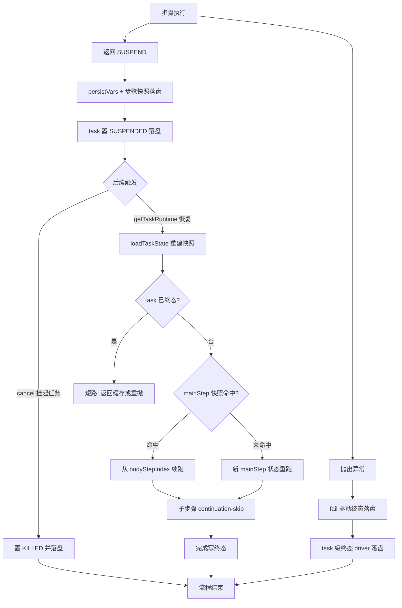
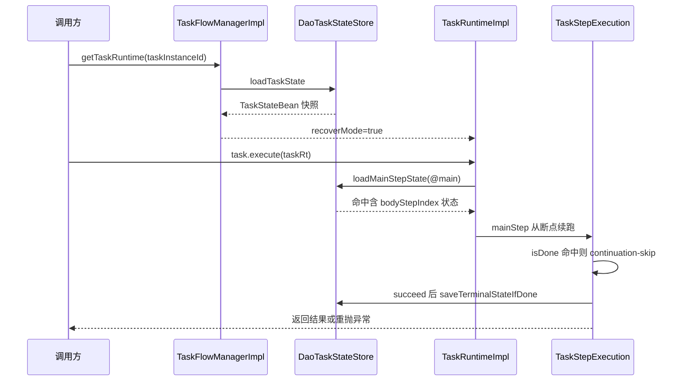

# 状态持久化与恢复：挂起如何变成重入

nop-task 引擎把"中断后继续执行"建为一条状态链：步骤返回 `SUSPEND` → 逐层落盘快照 → task 标记 `SUSPENDED` → 恢复时按 `taskInstanceId` 重建 runtime 并跳过已完成步骤。本章拆解这条链上的状态模型、读写时机、DAO 落库实现与内存降级路径。

> **基准源文件**（相对本页 `deepwiki/nop-task/flows/`，已逐条验证存在）：
>
> - [../../../nop-task/nop-task-core/src/main/java/io/nop/task/ITaskState.java](../../../nop-task/nop-task-core/src/main/java/io/nop/task/ITaskState.java)
> - [../../../nop-task/nop-task-core/src/main/java/io/nop/task/ITaskStateStore.java](../../../nop-task/nop-task-core/src/main/java/io/nop/task/ITaskStateStore.java)
> - [../../../nop-task/nop-task-core/src/main/java/io/nop/task/impl/TaskRuntimeImpl.java](../../../nop-task/nop-task-core/src/main/java/io/nop/task/impl/TaskRuntimeImpl.java)
> - [../../../nop-task/nop-task-core/src/main/java/io/nop/task/impl/TaskImpl.java](../../../nop-task/nop-task-core/src/main/java/io/nop/task/impl/TaskImpl.java)
> - [../../../nop-task/nop-task-core/src/main/java/io/nop/task/step/TaskStepExecution.java](../../../nop-task/nop-task-core/src/main/java/io/nop/task/step/TaskStepExecution.java)
> - [../../../nop-task/nop-task-core/src/main/java/io/nop/task/state/DefaultTaskStateStore.java](../../../nop-task/nop-task-core/src/main/java/io/nop/task/state/DefaultTaskStateStore.java)
> - [../../../nop-task/nop-task-dao/src/main/java/io/nop/task/dao/store/DaoTaskStateStore.java](../../../nop-task/nop-task-dao/src/main/java/io/nop/task/dao/store/DaoTaskStateStore.java)
> - [../../../nop-task/nop-task-core/src/main/java/io/nop/task/impl/TaskFlowManagerImpl.java](../../../nop-task/nop-task-core/src/main/java/io/nop/task/impl/TaskFlowManagerImpl.java)

**相关页面**：[核心引擎](../modules/task-core.md)（步骤抽象与装饰链）、[任务执行管线](./task-execution.md)（执行主流程）、[术语表](../glossary.md)（Task/Step/Runtime/State 划界）。

## 状态模型：task / step 两级 envelope

状态抽象分两层，共享 `ITaskStateCommon` 的公共字段（internal、retryAttempt、tagSet、bizObjId、extType/extState、createTime/updateTime、resultValue、error）（`nop-task/nop-task-core/src/main/java/io/nop/task/ITaskStateCommon.java:19-89`）。task 级 `ITaskState` 增加 taskStatus、request/response、taskVars 与终态判定 `isTerminal()`（COMPLETED/KILLED/FAILED/TIMEOUT 四值）（`ITaskState.java:20-28`），并提供 `afterLoad`/`beforeSave` 两个持久化生命周期钩子（`ITaskState.java:119-129`）。step 级 `ITaskStepState` 是恢复机制的核心：`stepPath`（静态步骤名）+ `runId`（动态执行路径）唯一定位一次步骤执行，`bodyStepIndex` 记录 composite 步骤的控制流位置，`stateBean` 装载步骤自选的 continuation 状态（`ITaskStepState.java:27-77`）。

引擎对状态的定义是 continuation 语义：state 变量以闭包方式捕获全部相关变量，使步骤能从中断点续跑；持久化中若已含返回结果，则重复执行时直接返回缓存结果、跳过执行体（`ITaskStepState.java:13-17` 接口 javadoc）。两个内存实现 `TaskStateBean`/`TaskStepStateBean` 位于 `io.nop.task.state` 包，exception 字段标为 `transient`——序列化恢复靠 store 层的 ErrorBean 通路，不靠 Java 序列化（`nop-task/nop-task-core/src/main/java/io/nop/task/state/TaskStateBean.java:28`）。

| 字段组 | task 级（ITaskState） | step 级（ITaskStepState） | 恢复时的作用 |
|---|---|---|---|
| 状态码 | taskStatus（8 态，含 SUSPENDED） | stepStatus（ACTIVE/COMPLETED/FAILED/EXPIRED/KILLED） | 终态短路判定：isTerminal/isDone |
| 定位键 | taskInstanceId（主键） | taskInstanceId + stepPath（+ runId 区分迭代） | DAO 按 (taskInstanceId, stepPath) upsert/查找 |
| 控制流 | — | bodyStepIndex | composite 步骤（sequential/loop）续跑位置 |
| continuation | request、taskVars | stateBean、persistVarsSnapshot | 步骤内部状态与声明的持久化变量 |
| 结果/异常 | resultValue、exception | resultValue、outputs、savedNextStepName、exception | 缓存结果重放、失败重抛、跳转恢复 |
| 诊断 | errCode/errMsg/errorBeanData/errorStack（DAO 列） | 同左（step 表列） | 跨进程重启后重构 NopException |

> Sources: 状态字段职责与恢复作用（`ITaskState.java`、`ITaskStepState.java`、`ITaskStateCommon.java`、`TaskStateBean.java`、`TaskStepStateBean.java`、`DaoTaskStateStore.java`）

## TaskRuntimeImpl 如何写状态、读状态

`TaskRuntimeImpl` 持有 `ITaskStateStore` 与 `recoverMode` 标志，自身几乎不实现持久化逻辑，而是把读写转插给 store（`nop-task/nop-task-core/src/main/java/io/nop/task/impl/TaskRuntimeImpl.java:40-48`）。写路径是 `saveTaskState()` → `stateStore.saveTaskState(this)`（`TaskRuntimeImpl.java:241-243`），调用点全部在 `TaskImpl` 的终态/挂起 driver 内。读路径集中在 `newMainStepRuntime()`：recoverMode=true 时先调 `stateStore.loadMainStepState`（stepPath=`@main` 的持久化行，含 composite mainStep 的 bodyStepIndex），未命中再回退 `newMainStepState` 创建全新 ACTIVE 状态（`TaskRuntimeImpl.java:218-238`）。

子任务通过 `newChildRuntime(task, saveState)` 委托 manager 创建，父取消经 onCancel 监听器传播到子 runtime（`TaskRuntimeImpl.java:167-176`）。cancel 对挂起任务有专门分支：SUSPENDED 且非终态的 task 被 cancel 时直接驱动 KILLED 终态并立即落盘，不再等 resume（`TaskRuntimeImpl.java:90-105`，plan 364 [05-03] 修复，Phase 4 修复中痕迹）。

运行时的创建入口在 `TaskFlowManagerImpl`，两条路径的 store 选择不同：fresh 执行 `newTaskRuntime(task, saveState, ...)` 按 saveState 标志选 store——true 时用注入的持久化 store（缺失则抛 `ERR_TASK_NO_PERSIST_STATE_STORE`），false 时用 `DefaultTaskStateStore.INSTANCE`；resume 路径 `getTaskRuntime(taskInstanceId, ...)` 强制用持久化 store，`loadTaskState` 返回 null 即抛 `ERR_TASK_UNKNOWN_TASK_INSTANCE`，并以 `recoverMode=true` 构造 runtime（`nop-task/nop-task-core/src/main/java/io/nop/task/impl/TaskFlowManagerImpl.java:96-134`）。saveState 标志来自 task.xml 模型属性 `defaultSaveState`（缺省 false），codegen 生成的 biz action 直接把它拼进 `newTaskRuntime` 调用（`nop-task/nop-task-core/src/main/java/io/nop/task/utils/TaskGenHelper.java:17-18`；`nop-task/nop-task-core/src/main/java/io/nop/task/model/_gen/_TaskFlowModel.java:35-38`）。

> Sources: runtime 状态读写与 store 选择（`TaskRuntimeImpl.java`、`TaskFlowManagerImpl.java`、`TaskGenHelper.java`）

## 挂起 → 快照：三次落盘点

挂起语义由 `<suspend>` 步骤实现，类似 yield：首次进入时 `stateBean` 为空，写入 first 标记并返回 `SUSPEND`；再次进入时按 `resumeWhen` 条件判定放行或继续挂起（`nop-task/nop-task-core/src/main/java/io/nop/task/step/SuspendTaskStep.java:28-43`）。`SUSPEND` 沿调用链向上传播时，引擎在三个位置做状态快照：

1. **步骤 ACTIVE 创建时**：fresh 路径完成 input 初始化后 `capturePersistVars` + `stepRt.saveState()`，先落一行 ACTIVE 状态（`TaskStepExecution.java:282-287`）。
2. **步骤挂起返回时**：`step.execute(stepRt)` 同步返回 SUSPEND 后再次 `capturePersistVars` + `saveState()`，把 stateBean（suspend 的 first 标记、loop 的迭代位置）与 bodyStepIndex 落盘——resume 才能从挂起点续跑而非重新挂起（`TaskStepExecution.java:300-313`）。
3. **task 级挂起标记**：`TaskImpl.execute` 的 thenCompose 出口发现 `ret.isSuspend()` 时，把 taskStatus 置 `SUSPENDED` 并 `saveTaskState()`；此分支刻意不调 `runCleanup`、不关 task meter，保留 task 级 bean 容器给进程内 resume（`nop-task/nop-task-core/src/main/java/io/nop/task/impl/TaskImpl.java:153-162`）。

composite 步骤在每次子步骤完成后推进自己的游标：sequential 读 `bodyStepIndex` 定位起点，每步完成后 `setBodyStepIndex` + `saveState()`（`nop-task/nop-task-core/src/main/java/io/nop/task/step/SequentialTaskStep.java:46-76`）；loop 的 `LoopStateBean`（items + index）存进 stateBean，每轮迭代后 `incIndex` + `saveState()`（`nop-task/nop-task-core/src/main/java/io/nop/task/step/LoopTaskStep.java:120-190`）。子步骤挂起时 composite 原样上抛 `SUSPEND`，自身游标已在上一次 saveState 中固化。

失败分支与挂起对称：步骤异常经 `driveStepFailure` 统一驱动——cancel 类异常按 reason 映射 EXPIRED/KILLED，普通失败 `fail()` + `setStepStatus(FAILED)`，均以 `saveTerminalStateIfDone` 收尾（`TaskStepExecution.java:380-407,426-434`）；异常上浮到 task 级后由 `driveTaskTerminal` 分发到 FAILED/KILLED/TIMEOUT 三个 driver，全部走"synchronized(taskState) 内 skipTerminalOverwrite 守卫 → 写状态 + exception → saveTaskState"的原子序列（`TaskImpl.java:182-259,266-275`）。

> Sources: 挂起与终态落盘点（`SuspendTaskStep.java`、`TaskStepExecution.java`、`TaskImpl.java`、`SequentialTaskStep.java`、`LoopTaskStep.java`）

## 重入恢复：resume 的完整时序

恢复入口是 `taskFlowManager.getTaskRuntime(taskInstanceId, svcCtx)` + `task.execute(taskRt, outputNames)`。仓库内现成的生产用例是 `call-task` 步骤：首次执行把子任务 taskInstanceId 存进自身 stateBean 并 saveState；重入时发现 taskId 非空，直接 `getTaskRuntime(taskId)` 取回子任务 runtime 续跑（`nop-task/nop-task-core/src/main/java/io/nop/task/step/CallTaskStep.java:78-90`）。

恢复重入的关键判定按层展开：

- **task 层短路**：recoverMode 且 taskState.isTerminal() 时，COMPLETED 返回缓存 resultValue，FAILED/KILLED/TIMEOUT 重抛缓存 exception（缺失时按状态码合成对应错误码），mainStep 不重跑（`TaskImpl.java:94-117,282-295`）。
- **mainStep 层装载**：`loadMainStepState` 按 `@main` 找持久化行，命中则 composite mainStep 从 bodyStepIndex 续跑，避免重复执行已完成的子步骤（`nop-task/nop-task-dao/src/main/java/io/nop/task/dao/store/DaoTaskStateStore.java:278-285`）。
- **子步骤层装载门控**：`newStepRuntime` 先调 `loadStepState`，但只对"本次 task 执行内首次实例化的 stepPath"生效——loop 迭代 2+、fork 分支 2+ 复用同一 stepPath，必须走全新 state，否则 continuation-skip 会错误命中首轮终态行、静默跳过后续迭代（`nop-task/nop-task-core/src/main/java/io/nop/task/impl/TaskStepRuntimeImpl.java:141-178`）。
- **continuation-skip 消费**：resume 中命中 `stepState.isDone()` 的步骤，COMPLETED 返回缓存 result、重放持久化 outputs 与 savedNextStepName；FAILED 重抛 exception，但配置了 nextOnError 时改走错误分支而非重抛（`TaskStepExecution.java:221-269,471-484`）。
- **变量恢复**：recoverMode 步骤在执行前把 persistVarsSnapshot 回写 scope，兑现"xdef 声明 persist 的变量支持中断后恢复"契约（`TaskStepExecution.java:226-230,454-465`）。

> Sources: 恢复重入判定链（`TaskFlowManagerImpl.java`、`TaskImpl.java`、`TaskStepRuntimeImpl.java`、`TaskStepExecution.java`、`CallTaskStep.java`、`DaoTaskStateStore.java`）

## nop-task-dao 落库实现

`DaoTaskStateStore` 是仓库内唯一持久化实现（`isSupportPersist()=true`，`DaoTaskStateStore.java:117-119`），把状态写到 `NopTaskInstance` / `NopTaskStepInstance` 两张表。task 行由 `newTaskState` 直接 INSERT（status=ACTIVE、记 startTime）；后续 `saveTaskState` 按 taskInstanceId 查行做 upsert：写 taskName/status/updateTime，request 序列化进 `taskInputs` 列（超 4000 字符跳过并告警），resultValue 序列化进 `remark` 列——守卫阈值 `REMARK_MAX_LEN=200` 与列宽 VARCHAR(200) 对齐（plan 364 [01-04] 修复），exception 提取 errCode/errMsg（截断到 500）+ 完整 ErrorBean JSON 到 `errorBeanData` + 截断 stack 到 `errorStack`，终态时记 endTime（`DaoTaskStateStore.java:124-135,151-249`）。列名见生成实体 `_NopTaskInstance`（remark:165、errorBeanData:169、errorStack:173、taskInputs:37）。

step 行按 `(taskInstanceId, stepPath)` 定位 upsert（`findStepEntity`，`DaoTaskStateStore.java:364-371`），`copyStepStateToEntity` 把 runId/bodyStepIndex/stepStatus/retryCount/tagText 写入对应列，状态载荷进 `stateBeanData` 列：plan 349 Phase 6 引入版本化 wrapper（`__stateDataVersion=2`），一列打包 resultValue/stateBean/outputs/nextStepName/persistVars 五类数据；超 4000 字符先降级为仅 resultValue，仍超限清列并告警（`DaoTaskStateStore.java:472-529,542-577`）。读取侧 `parseStepStateData` 向后兼容旧格式（裸 resultValue JSON）；`TaskStepStateBean.getStateBean` 对 Map 形态的 stateBean 按请求类型反序列化并写回字段，避免 resume 后每次读取都重复 serialize+parse（`nop-task/nop-task-core/src/main/java/io/nop/task/state/TaskStepStateBean.java:209-225`，plan 364 [03-04] 修复）。

异常的跨进程恢复是独立通路：save 侧把含 FQCN（reserved param `__exceptionClass`）与 cause 链的 ErrorBean 序列化进 errorBeanData；load 侧 `loadException` 优先从 errorBeanData 重构（reserved param `__exceptionClass` 携带 FQCN）、回退 errCode+errMsg（`DaoTaskStateStore.java:419-449`）。精确异常子类经 `TaskExceptionRegistry` 反射构造：nop-task-core 两个子类编译期注册工厂（`TaskExceptionRegistry.java:55-60`），其余 FQCN 反射注册、缺类安全回退 generic NopException（`TaskExceptionRegistry.java:110-119`）。并发方面，plan 364 [05-02] 引入 64 槽条带锁，把 fork 分支共享同一 stepPath 行的并发写按行串行化，消除后写者乐观锁异常冒泡为分支失败的问题（`DaoTaskStateStore.java:327-360`）。task/step 状态 bean 均有 `beforeSave`/`afterLoad` 钩子，在 entity 拷贝前后被 store 调用，供自定义子类做归一化与 transient 重建（`DaoTaskStateStore.java:146,161,283,315,353`）。

> Sources: DAO 落库与异常重构（`DaoTaskStateStore.java`、`TaskExceptionRegistry.java`、`TaskStepStateBean.java`、`nop-task/nop-task-dao/src/main/java/io/nop/task/dao/entity/_gen/_NopTaskInstance.java`、`nop-task/nop-task-dao/src/main/java/io/nop/task/dao/entity/_gen/_NopTaskStepInstance.java`）

## 存储实现对照：内存降级 vs DAO 落库

引擎内置两个 `ITaskStateStore` 实现，行为差异即"是否支持重入"的分界：

| 维度 | DefaultTaskStateStore（内存） | DaoTaskStateStore（DAO 落库） |
|---|---|---|
| isSupportPersist | false（`DefaultTaskStateStore.java:19-21`） | true（`DaoTaskStateStore.java:117-119`） |
| saveTaskState / saveStepState | 空实现，状态仅存于 bean 字段（`DefaultTaskStateStore.java:71-83`） | 按 taskInstanceId / (taskInstanceId, stepPath) upsert 两张表 |
| loadTaskState / loadStepState | 恒返回 null（`DefaultTaskStateStore.java:66-78`） | 查表 + toXxxStateBean 重建 + afterLoad 钩子 |
| loadMainStepState | 未覆写，继承接口默认 null（`ITaskStateStore.java:27-29`） | 按 `@main` 查行，命中返回含 bodyStepIndex 的状态 |
| 挂起语义 | 进程内成立：taskStatus 置 SUSPENDED 仅在内存生效 | 跨进程/跨重启成立：SUSPENDED 行可被 getTaskRuntime 取回 |
| resume 可达性 | getTaskRuntime 恒抛 ERR_TASK_UNKNOWN_TASK_INSTANCE（loadTaskState 为 null） | 正常恢复；行不存在时抛同一错误 |
| call-task 子任务 | newChildRuntime(saveState=false)，重入分支走不通 | 子任务实例行可恢复（`CallTaskStep.java:83-89`） |

内存降级路径核查结论：`defaultSaveState=false`（模型缺省）或未注入持久化 store 时，引擎仍完整执行"步骤 saveState → task SUSPENDED"的调用序，只是所有 save 是 no-op、状态留在 `TaskStateBean`/`TaskStepStateBean` 堆字段里；此时挂起任务只能靠持有原 runtime 引用在同进程内续跑，进程重启后无法恢复——`getTaskRuntime` 会因 `loadTaskState` 返回 null 而抛 `ERR_TASK_UNKNOWN_TASK_INSTANCE`（`TaskFlowManagerImpl.java:120-134`）。测试侧的 `SnapshotTaskStateStore` 等录制型 store 也印证了这一分层：快照能力由 store 实现决定，引擎代码无感知。

> Sources: 双实现对照（`DefaultTaskStateStore.java`、`DaoTaskStateStore.java`、`ITaskStateStore.java`、`TaskFlowManagerImpl.java`、`CallTaskStep.java`）

## 修复中痕迹（plan 364，以生成时工作区为准）

本章断言基于工作区当前状态，其中含 plan 364（`ai-dev/plans/364-nop-task-audit-confirmed-defect-fixes.md`）的修复痕迹，如实记录如下：

- **Phase 3（持久化正确性）已标记 completed**：REMARK_MAX_LEN=200 守卫、TASK_ERR_MSG_MAX_LEN=500 截断、stateBean Map 转换写回、64 槽条带锁（[05-02]）均已落入 `DaoTaskStateStore.java` / `TaskStepStateBean.java`，并有对应测试（TestDaoTaskStateStoreRemarkBoundary、TestDaoTaskStateStoreConcurrentSameRow 等）。
- **Phase 4（终态与并发正确性）标记 in progress，但多项修复代码已出现在工作区**：SUSPENDED-cancel→KILLED（`TaskRuntimeImpl.java:90-105`，[05-03]）、fail() 对称 first-terminal-wins 守卫（`TaskStepStateBean.java:55-63`，[05-01]）、stepState 加 volatile（`TaskStepRuntimeImpl.java:47`，[05-06]）、sync/async 失败驱动统一 `driveStepFailure`（`TaskStepExecution.java:380-407`，[02-02]）、全局限流器/信号量强引用注册表（`TaskFlowManagerImpl.java:59-66`，[05-04]）——计划文件中对应条目尚未勾选，属于"代码先行、计划回填"的中间态。
- `TaskConstants.java` 与 `GraphTaskStep.java` 在工作区有未提交改动（状态常量改为引用生成常量 `_NopTaskCoreConstants` 单源化；graph 计数收敛为 `completeGraphIfDrained` 单一判据），本章状态码断言以工作区版本为准。

> Sources: 修复状态依据（`ai-dev/plans/364-nop-task-audit-confirmed-defect-fixes.md`、git 工作区 diff、`TaskRuntimeImpl.java`、`TaskStepStateBean.java`）

## Sources

- nop-task/nop-task-core/src/main/java/io/nop/task/ITaskState.java ()
- nop-task/nop-task-core/src/main/java/io/nop/task/ITaskStateCommon.java ()
- nop-task/nop-task-core/src/main/java/io/nop/task/ITaskStateStore.java ()
- nop-task/nop-task-core/src/main/java/io/nop/task/ITaskStepState.java ()
- nop-task/nop-task-core/src/main/java/io/nop/task/ITaskStepRuntime.java ()
- nop-task/nop-task-core/src/main/java/io/nop/task/ITaskRuntime.java ()
- nop-task/nop-task-core/src/main/java/io/nop/task/TaskConstants.java ()
- nop-task/nop-task-core/src/main/java/io/nop/task/impl/TaskRuntimeImpl.java ()
- nop-task/nop-task-core/src/main/java/io/nop/task/impl/TaskImpl.java ()
- nop-task/nop-task-core/src/main/java/io/nop/task/impl/TaskFlowManagerImpl.java ()
- nop-task/nop-task-core/src/main/java/io/nop/task/impl/TaskStepRuntimeImpl.java ()
- nop-task/nop-task-core/src/main/java/io/nop/task/step/TaskStepExecution.java ()
- nop-task/nop-task-core/src/main/java/io/nop/task/step/SuspendTaskStep.java ()
- nop-task/nop-task-core/src/main/java/io/nop/task/step/SequentialTaskStep.java ()
- nop-task/nop-task-core/src/main/java/io/nop/task/step/LoopTaskStep.java ()
- nop-task/nop-task-core/src/main/java/io/nop/task/step/CallTaskStep.java ()
- nop-task/nop-task-core/src/main/java/io/nop/task/state/DefaultTaskStateStore.java ()
- nop-task/nop-task-core/src/main/java/io/nop/task/state/TaskStateBean.java ()
- nop-task/nop-task-core/src/main/java/io/nop/task/state/TaskStepStateBean.java ()
- nop-task/nop-task-core/src/main/java/io/nop/task/state/AbstractTaskStateCommon.java ()
- nop-task/nop-task-core/src/main/java/io/nop/task/utils/TaskGenHelper.java ()
- nop-task/nop-task-core/src/main/java/io/nop/task/model/_gen/_TaskFlowModel.java ()
- nop-task/nop-task-dao/src/main/java/io/nop/task/dao/store/DaoTaskStateStore.java ()
- nop-task/nop-task-dao/src/main/java/io/nop/task/dao/store/TaskExceptionRegistry.java ()
- nop-task/nop-task-dao/src/main/java/io/nop/task/dao/entity/_gen/_NopTaskInstance.java ()
- nop-task/nop-task-dao/src/main/java/io/nop/task/dao/entity/_gen/_NopTaskStepInstance.java ()
- ai-dev/plans/364-nop-task-audit-confirmed-defect-fixes.md ()

---

## On this page

- 状态模型：task / step 两级 envelope
- TaskRuntimeImpl 如何写状态、读状态
- 挂起 → 快照：三次落盘点
- 重入恢复：resume 的完整时序
- nop-task-dao 落库实现
- 存储实现对照：内存降级 vs DAO 落库
- 修复中痕迹（plan 364，以生成时工作区为准）
