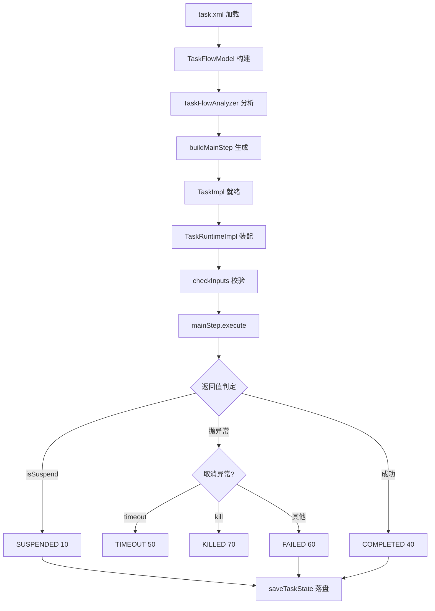
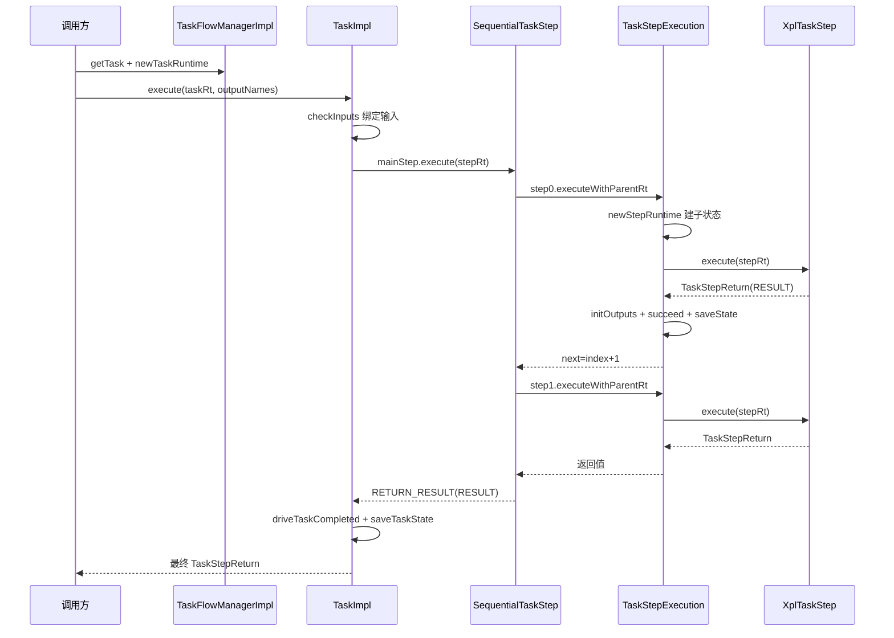

# 任务流执行管线：从 task.xml 到步骤输出

> **本章源文件基准**（显示为仓库根相对路径；链接自本页目录 `flows/` 起三步回溯，已逐条验证存在）：
>
> - [nop-kernel/nop-xdefs/src/main/resources/_vfs/nop/schema/task/task.xdef](../../../nop-kernel/nop-xdefs/src/main/resources/_vfs/nop/schema/task/task.xdef)
> - [nop-task/nop-task-core/src/main/java/io/nop/task/impl/TaskFlowManagerImpl.java](../../../nop-task/nop-task-core/src/main/java/io/nop/task/impl/TaskFlowManagerImpl.java)
> - [nop-task/nop-task-core/src/main/java/io/nop/task/impl/TaskImpl.java](../../../nop-task/nop-task-core/src/main/java/io/nop/task/impl/TaskImpl.java)
> - [nop-task/nop-task-core/src/main/java/io/nop/task/impl/TaskRuntimeImpl.java](../../../nop-task/nop-task-core/src/main/java/io/nop/task/impl/TaskRuntimeImpl.java)
> - [nop-task/nop-task-core/src/main/java/io/nop/task/model/TaskFlowModel.java](../../../nop-task/nop-task-core/src/main/java/io/nop/task/model/TaskFlowModel.java)
> - [nop-task/nop-task-core/src/main/java/io/nop/task/builder/TaskFlowBuilder.java](../../../nop-task/nop-task-core/src/main/java/io/nop/task/builder/TaskFlowBuilder.java)
> - [nop-task/nop-task-core/src/main/java/io/nop/task/step/TaskStepExecution.java](../../../nop-task/nop-task-core/src/main/java/io/nop/task/step/TaskStepExecution.java)
> - [nop-task/nop-task-core/src/main/java/io/nop/task/step/SequentialTaskStep.java](../../../nop-task/nop-task-core/src/main/java/io/nop/task/step/SequentialTaskStep.java)
> - [nop-task/nop-task-core/src/main/java/io/nop/task/step/GraphTaskStep.java](../../../nop-task/nop-task-core/src/main/java/io/nop/task/step/GraphTaskStep.java)
> - [nop-task/nop-task-core/src/main/java/io/nop/task/TaskStepReturn.java](../../../nop-task/nop-task-core/src/main/java/io/nop/task/TaskStepReturn.java)

本章拆解 nop-task 引擎把一个 task.xml 变成步骤输出的完整机制：DSL 按 task.xdef 解析为 TaskFlowModel，经 TaskFlowBuilder 构建为 ITask，由 ITaskFlowManager 装配 TaskRuntime，mainStep 驱动顺序或图执行，最终汇聚 TaskStepReturn 并驱动任务终态。失败、超时、挂起三条分支贯穿全文。术语定义见 [../glossary.md](../glossary.md)。

## 管线总览

全管线分六个阶段，每阶段的输入、产出与失败模式如下：

| 阶段 | 输入 | 输出 | 失败模式 |
|------|------|------|----------|
| 解析加载 | task.xml 资源 | TaskFlowModel | DSL 校验失败由 DslModelParser 抛错 |
| 构建期分析 | TaskFlowModel | analyze 后的模型 | invoke-static 方法解析失败：ERR_TASK_STATIC_METHOD_NOT_FOUND / ERR_TASK_UNRESOLVED_METHOD_OWNER |
| ITask 构建 | 模型 + TaskFlowBuilder | TaskImpl(mainStep) | mainStep 为 null 被 Guard 拒绝 |
| Runtime 装配 | ITask + saveState 开关 | TaskRuntimeImpl + ITaskState | 需持久化但无 store：ERR_TASK_NO_PERSIST_STATE_STORE；resume 未知实例：ERR_TASK_UNKNOWN_TASK_INSTANCE |
| 输入校验与步骤执行 | ITaskStepRuntime | TaskStepReturn | 必填输入缺失：ERR_TASK_MANDATORY_INPUT_NOT_ALLOW_EMPTY；步骤异常进 driveStepFailure |
| 结果汇聚与终态 | mainStep 返回值 | 任务终态 + 状态落盘 | 终态覆写被 skipTerminalOverwrite 阻止（first-terminal-wins） |



解析入口在管理器：`getTaskFlowModel` 按 `task/{name}/v{version}` 规则拼路径交给 `ResourceComponentManager` 缓存加载（`nop-task/nop-task-core/src/main/java/io/nop/task/impl/TaskFlowManagerImpl.java:143-147`）；模型创建时 `init()` 立即执行 `TaskFlowAnalyzer.analyze` 做静态分析（`nop-task/nop-task-core/src/main/java/io/nop/task/model/TaskFlowModel.java:34-36`）。`getTask` 首次调用时经 `TaskFlowBuilder.buildTask` 同步构建并缓存 ITask（`nop-task/nop-task-core/src/main/java/io/nop/task/model/TaskFlowModel.java:38-43`）；两条旁路入口 `parseTask`（直接 `DslModelParser` 解析资源）与 `loadTaskFromPath`（显式路径加载）最终复用同一 buildTask 通道（`nop-task/nop-task-core/src/main/java/io/nop/task/impl/TaskFlowManagerImpl.java:150-159`）。

`buildTask` 的装配序列固定为 `resolve` → `buildMainStep` → bean 容器模板 → `TaskImpl` 构造，全部发生在首次 `getTask` 调用线程内（nop-task/nop-task-core/src/main/java/io/nop/task/builder/TaskFlowBuilder.java:33-49）：

```java
    @Override
    public ITask buildTask(TaskFlowModel taskFlowModel) {
        resolve(taskFlowModel);

        TaskStepBuilder stepBuilder = new TaskStepBuilder();
        ITaskStep mainStep = stepBuilder.buildMainStep(taskFlowModel);

        IBeanContainerImplementor beanContainerTemplate = taskFlowModel.getBeanContainerTemplate(this::buildBeanContainerTemplate);

        ITaskBeanContainerFactory factory = beanContainerTemplate == null ? null :
                new BeanContainerFactory(taskFlowModel.isUseParentBeanContainer(), beanContainerTemplate);

        TaskImpl task = new TaskImpl(taskFlowModel.getName(), taskFlowModel.getVersion(), mainStep,
                taskFlowModel.isRecordMetrics(), taskFlowModel.getFlags(), factory,
                taskFlowModel.getInputs(), taskFlowModel.getOutputs());
        return task;
    }
```

前置的 `resolve` 遍历全部步骤，只处理 invoke-static 类型：import 未声明 owner 抛 ERR_TASK_UNRESOLVED_METHOD_OWNER（`TaskFlowBuilder.java:57-59`），类加载后按"方法名 + 入参数量"查找静态方法，未命中抛 ERR_TASK_STATIC_METHOD_NOT_FOUND（62-69 行），解析结果写回 `stepModel.setResolvedMethod` 供执行期直接调用。TaskImpl 构造器用 `Guard.notNull(mainStep, "mainStep")` 拒绝空 mainStep（`nop-task/nop-task-core/src/main/java/io/nop/task/impl/TaskImpl.java:61`）。

> Sources: [nop-task/nop-task-core/src/main/java/io/nop/task/impl/TaskFlowManagerImpl.java:143-159](https://gitee.com/canonical-entropy/nop-entropy/blob/555f7a9731/nop-task/nop-task-core/src/main/java/io/nop/task/impl/TaskFlowManagerImpl.java#L143-L159)、[nop-task/nop-task-core/src/main/java/io/nop/task/model/TaskFlowModel.java:33-43](https://gitee.com/canonical-entropy/nop-entropy/blob/555f7a9731/nop-task/nop-task-core/src/main/java/io/nop/task/model/TaskFlowModel.java#L33-L43)、[nop-task/nop-task-core/src/main/java/io/nop/task/builder/TaskFlowBuilder.java:33-78](https://gitee.com/canonical-entropy/nop-entropy/blob/555f7a9731/nop-task/nop-task-core/src/main/java/io/nop/task/builder/TaskFlowBuilder.java#L33-L78)

## DSL 面：task.xdef 支持的步骤类型

task.xdef 是 DSL 的唯一 schema（路径常量 `XDEF_PATH_TASK = "/nop/schema/task/task.xdef"`，`nop-task/nop-task-core/src/main/java/io/nop/task/TaskConstants.java:13`）。根节点声明 `defaultSaveState`、`graphMode`、`enterSteps`、`exitSteps` 等任务级属性（`nop-kernel/nop-xdefs/src/main/resources/_vfs/nop/schema/task/task.xdef:9-15`）。步骤公共属性分两层：TaskExecutableModel 层提供 `timeout`、`persistVars`、`retry`、`throttle`、`rate-limit`、`when`、`catch`、`finally`（同文件 30-121 行）；TaskStepModel 层追加 `next`、`nextOnError`、`saveState`、`waitSteps`、`waitErrorSteps`、`sync`、`concurrent`（133-138 行）。步骤标签的派发依据 `<steps>` 节点声明的 `xdef:bean-sub-type-prop="type"`——XML 标签名即模型类 `type` 字段的取值（task.xdef:146-147）。全部步骤类型如下：

| XML 标签 | 模型类 | 执行语义 |
|----------|--------|----------|
| simple | SimpleTaskStepModel | 从 BeanContainer 取 ITaskStep 执行 |
| step / xpl（已废弃别名） | XplTaskStepModel | 执行 xpl 模板 |
| script | ScriptTaskStepModel | 经 IScriptCompiler 执行脚本 |
| graph | GraphTaskStepModel | 按依赖关系推导执行顺序 |
| sequential | SequentialTaskStepModel | 依次执行子步骤 |
| selector | SelectorTaskStepModel | 首个非空返回值即返回 |
| parallel | ParallelTaskStepModel | 并行执行 + aggregator 汇总 |
| fork / fork-n | ForkTaskStepModel / ForkNTaskStepModel | 按 producer 集合 / 次数复制并行 |
| loop / loop-n | LoopTaskStepModel / LoopNTaskStepModel | for 循环（while/until）/ 定次循环 |
| choose / if | ChooseTaskStepModel / IfTaskStepModel | switch 分支 / 条件分支 |
| invoke / invoke-static | InvokeTaskStepModel / InvokeStaticTaskStepModel | 调 bean 方法 / 静态方法 |
| call-task / call-step | CallTaskStepModel / CallStepTaskStepModel | 调子任务 / 步骤库步骤 |
| suspend | SuspendTaskStepModel | 挂起，等待恢复 |
| delay / sleep | DelayTaskStepModel / SleepTaskStepModel | 异步延迟 / 阻塞线程 |
| exit / end | ExitTaskStepModel / EndTaskStepModel | 跳出 sequential/loop / 退出整个工作流 |
| custom（已废弃） | CustomTaskStepModel | 改用 step |

装饰链（retry/throttle 等如何包装步骤）与常量、错误枢纽的分工见 [核心引擎](../modules/task-core.md)。

> Sources: [nop-kernel/nop-xdefs/src/main/resources/_vfs/nop/schema/task/task.xdef:9-15](https://gitee.com/canonical-entropy/nop-entropy/blob/555f7a9731/nop-kernel/nop-xdefs/src/main/resources/_vfs/nop/schema/task/task.xdef#L9-L15)、[nop-kernel/nop-xdefs/src/main/resources/_vfs/nop/schema/task/task.xdef:144-304](https://gitee.com/canonical-entropy/nop-entropy/blob/555f7a9731/nop-kernel/nop-xdefs/src/main/resources/_vfs/nop/schema/task/task.xdef#L144-L304)、[nop-task/nop-task-core/src/main/java/io/nop/task/TaskConstants.java:13-31](https://gitee.com/canonical-entropy/nop-entropy/blob/555f7a9731/nop-task/nop-task-core/src/main/java/io/nop/task/TaskConstants.java#L13-L31)

## 运行时装配：ITaskFlowManager 与 TaskRuntime

`nopTaskFlowManager` 是唯一的引擎入口 bean（`nop-task/nop-task-core/src/main/resources/_vfs/nop/task/beans/task-defaults.beans.xml:5-6`），实现类 TaskFlowManagerImpl 提供两组创建路径：`newTaskRuntime` 面向 fresh 执行，`saveState=true` 时要求持久化 ITaskStateStore，否则回退内存版 DefaultTaskStateStore；`getTaskRuntime` 面向 resume，从 store 加载 ITaskState，实例不存在抛 ERR_TASK_UNKNOWN_TASK_INSTANCE（`nop-task/nop-task-core/src/main/java/io/nop/task/impl/TaskFlowManagerImpl.java:97-134`）。fresh 路径的装配动作如下（nop-task/nop-task-core/src/main/java/io/nop/task/impl/TaskFlowManagerImpl.java:97-106）：

```java
    public ITaskRuntime newTaskRuntime(ITask task, boolean saveState, IServiceContext svcCtx, IEvalScope scope) {
        ITaskStateStore stateStore = saveState ? requirePersistStateState() : nonPersistStateStore;
        TaskRuntimeImpl taskRt = new TaskRuntimeImpl(this, stateStore, svcCtx, scope, false);

        ITaskState taskState = stateStore.newTaskState(task.getTaskName(), task.getTaskVersion(), taskRt);
        taskRt.setTaskState(taskState);

        prepareTaskRuntime(taskRt, task);
        return taskRt;
    }
```

TaskRuntimeImpl 构造时创建并发安全的子 EvalScope，把 `svcCtx` 与 `taskRt` 注入作用域变量，并向 svcCtx 注册取消监听（`nop-task/nop-task-core/src/main/java/io/nop/task/impl/TaskRuntimeImpl.java:60-82`）。它同时是取消传播枢纽：SUSPENDED 状态的任务被 cancel 时直接驱动 KILLED 终态并落盘，不等 resume（97-106 行）；子任务场景下 `newChildRuntime` 把子 runtime 的 cancel 挂到父监听链、任务清理时摘除（167-176 行），`runCleanup` 则以 `REASON_TASK_COMPLETE` 触发全部 task 级清理回调（271-275 行）。执行期 `newMainStepRuntime` 创建 stepPath 为 `@main`（`MAIN_STEP_NAME`，`nop-task/nop-task-core/src/main/java/io/nop/task/TaskConstants.java:31`）的主步骤运行时；recoverMode 下优先加载持久化的 mainStep 状态实现断点续跑，未命中则新建（218-238 行）。ITaskRuntime 契约的完整职责（taskVars、attributes、限流器/信号量获取）见接口定义（`nop-task/nop-task-core/src/main/java/io/nop/task/ITaskRuntime.java:36-166`）。

> Sources: [nop-task/nop-task-core/src/main/resources/_vfs/nop/task/beans/task-defaults.beans.xml:5-6](https://gitee.com/canonical-entropy/nop-entropy/blob/555f7a9731/nop-task/nop-task-core/src/main/resources/_vfs/nop/task/beans/task-defaults.beans.xml#L5-L6)、[nop-task/nop-task-core/src/main/java/io/nop/task/impl/TaskFlowManagerImpl.java:97-134](https://gitee.com/canonical-entropy/nop-entropy/blob/555f7a9731/nop-task/nop-task-core/src/main/java/io/nop/task/impl/TaskFlowManagerImpl.java#L97-L134)、[nop-task/nop-task-core/src/main/java/io/nop/task/impl/TaskRuntimeImpl.java:60-106](https://gitee.com/canonical-entropy/nop-entropy/blob/555f7a9731/nop-task/nop-task-core/src/main/java/io/nop/task/impl/TaskRuntimeImpl.java#L60-L106)、[nop-task/nop-task-core/src/main/java/io/nop/task/impl/TaskRuntimeImpl.java:167-238](https://gitee.com/canonical-entropy/nop-entropy/blob/555f7a9731/nop-task/nop-task-core/src/main/java/io/nop/task/impl/TaskRuntimeImpl.java#L167-L238)、[nop-task/nop-task-core/src/main/java/io/nop/task/ITaskRuntime.java:36-166](https://gitee.com/canonical-entropy/nop-entropy/blob/555f7a9731/nop-task/nop-task-core/src/main/java/io/nop/task/ITaskRuntime.java#L36-L166)

## 两步任务的执行时序

以最小 sequential 任务（两个 xpl 步骤）为例，从调用方拿到 ITask 到步骤输出的完整时序：



TaskImpl.execute 先做 resume 短路：recoverMode 且任务已终态时，COMPLETED 直接返回缓存 result，FAILED/KILLED/TIMEOUT 重抛缓存或合成异常，mainStep 不重跑（`nop-task/nop-task-core/src/main/java/io/nop/task/impl/TaskImpl.java:98-117`）。fresh 路径则经 `checkInputs` 做类型转换与必填校验（297-321 行），随后创建 mainStep 运行时并执行（119、141 行）。

SequentialTaskStep 用 `bodyStepIndex` 驱动循环：每步调 `executeWithParentRt(stepRt).syncIfDone()`，返回 SUSPEND 直接上抛，返回 END/EXIT 结束序列，否则按 `next` 声明或索引 +1 推进并 `saveState` 持久化位置；序列耗尽时返回 `RETURN_RESULT(stepRt.getResult())`（`nop-task/nop-task-core/src/main/java/io/nop/task/step/SequentialTaskStep.java:46-98`），未知跳转名抛 ERR_TASK_UNKNOWN_NEXT_STEP（101-110 行）。同步分支的推进逻辑如下（nop-task/nop-task-core/src/main/java/io/nop/task/step/SequentialTaskStep.java:57-76）：

```java
            ITaskStepExecution step = steps.get(index);

            TaskStepReturn stepResult = step.executeWithParentRt(stepRt).syncIfDone();
            lastResult = stepResult;

            if (stepResult.isSuspend())
                return stepResult;

            if (stepResult.isDone()) {
                if (stepResult.isEnd()) {
                    stepRt.setBodyStepIndex(steps.size());
                    return stepResult;
                } else if (stepResult.isExit()) {
                    stepRt.setBodyStepIndex(steps.size());
                    return TaskStepReturn.RETURN(stepResult.getOutputs());
                }

                index = getNextIndex(index, stepResult, stepRt);
                stepRt.setBodyStepIndex(index);
                stepRt.saveState();
```

`bodyStepIndex` 被推到 `steps.size()` 即视为序列耗尽——END/EXIT 与正常走完共用同一判定（51-55 行的入口检查）。步骤返回异步 future 时走 `thenApply` 分支（77-96 行）：异步完成值同样可能是 SUSPEND，直接返回而非当作未知跳转，END/EXIT/推进语义与同步分支逐条对偶，最终递归 `execute(stepRt)` 续跑。

> Sources: [nop-task/nop-task-core/src/main/java/io/nop/task/impl/TaskImpl.java:91-153](https://gitee.com/canonical-entropy/nop-entropy/blob/555f7a9731/nop-task/nop-task-core/src/main/java/io/nop/task/impl/TaskImpl.java#L91-L153)、[nop-task/nop-task-core/src/main/java/io/nop/task/impl/TaskImpl.java:297-321](https://gitee.com/canonical-entropy/nop-entropy/blob/555f7a9731/nop-task/nop-task-core/src/main/java/io/nop/task/impl/TaskImpl.java#L297-L321)、[nop-task/nop-task-core/src/main/java/io/nop/task/step/SequentialTaskStep.java:46-110](https://gitee.com/canonical-entropy/nop-entropy/blob/555f7a9731/nop-task/nop-task-core/src/main/java/io/nop/task/step/SequentialTaskStep.java#L46-L110)

## 步骤执行层：TaskStepExecution 与 ITaskStepRuntime

XML 里每个步骤节点不直接变成 ITaskStep，而是被包装为 TaskStepExecution——执行的门面。`executeWithParentRt` 按序完成：创建子 ITaskStepRuntime（含步骤状态与 cancelToken 传递）、recoverMode 下恢复 persistVars 快照、continuation-skip 检查（状态已终态则返回缓存结果或重抛异常）、`when` 条件与 flags 判定不满足则跳过、绑定 input 并保存 ACTIVE 态（`nop-task/nop-task-core/src/main/java/io/nop/task/step/TaskStepExecution.java:206-288`）。前置检查段的源码如下（nop-task/nop-task-core/src/main/java/io/nop/task/step/TaskStepExecution.java:212-231）：

```java
        ITaskStepRuntime stepRt = parentRt.newStepRuntime(stepName, step.getStepType(),
                step.getPersistVars(), useParentScope, step.isConcurrent());

        stepRt.setOutputNames(outputVars);

        LOG.debug("nop.task.step.run:taskName={},taskInstanceId={},stepPath={},runId={},loc={}",
                taskRt.getTaskName(), taskRt.getTaskInstanceId(),
                stepRt.getStepPath(), stepRt.getRunId(), step.getLocation());

        // plan 257: continuation-skip reader —— resume/re-execution 时检查 state.isDone()。
        // 终态 COMPLETED → 返回缓存 result（step body 不被调用）；终态 FAILED → 重抛 exception。
        // 这是 plans 252-256 状态机 write-side（succeed/COMPLETED + FAILED driver）的 read-side 消费方，
        // 使 ITaskStepState.isDone()/result() 首次被 production 消费。
        ITaskStepState stepState = stepRt.getState();
        if (stepRt.isRecoverMode()) {
            // persistVars 恢复（plan 349 Phase 6）：xdef 声明的持久化变量快照回写步骤 scope，
            // 使"标记为 persist 的变量支持中断后恢复执行"契约成立
            restorePersistVars(step, stepState, stepRt);
        }
        if (stepState != null && stepState.isDone()) {
```

真正的 ITaskStep 由 AbstractTaskStep 子类实现，只负责纯执行逻辑并返回 TaskStepReturn（`nop-task/nop-task-core/src/main/java/io/nop/task/ITaskStep.java:22-50`）；location/stepType/persistVars/inputs/outputs 等公共属性收敛在 AbstractTaskStep（`nop-task/nop-task-core/src/main/java/io/nop/task/step/AbstractTaskStep.java:20-93`）。

结果侧：成功路径把 RESULT 写回父 scope、执行 output 导出（exportAs/toTaskScope）、应用模型声明的 next、写 succeed 终态并落盘（TaskStepExecution.java:316-357）。步骤返回 SUSPEND 时先结束 meter 再捕获 persistVars 并 `saveState`，resume 才能从挂起点续跑而非重新挂起（301-313 行）。失败统一进 `driveStepFailure`：取消异常按 reason 映射 EXPIRED/KILLED 步骤终态；普通失败标 FAILED 后，配置了 `nextOnError` 时包装为携带 ErrorBean 的 error-handoff 返回值（包装点在 `buildErrorResult`，486-491 行），否则 rethrow（380-407 行）。步骤级持久化开关收敛在 `persistStepState`：xdef 声明 `saveState="false"` 的步骤跳过自身状态行的全部落盘（ACTIVE、挂起、终态三处出口均过此门，149、190-192、426-434 行）。

ITaskStepRuntime 是步骤内可用的全部上下文：EvalScope 读写、`RESULT` 变量、stepPath/runId、`bodyStepIndex`/`stateBean`（供 loop、suspend 存放游标与标记）、`saveState`（`nop-task/nop-task-core/src/main/java/io/nop/task/ITaskStepRuntime.java:12-138`）。

> Sources: [nop-task/nop-task-core/src/main/java/io/nop/task/step/TaskStepExecution.java:206-288](https://gitee.com/canonical-entropy/nop-entropy/blob/555f7a9731/nop-task/nop-task-core/src/main/java/io/nop/task/step/TaskStepExecution.java#L206-L288)、[nop-task/nop-task-core/src/main/java/io/nop/task/step/TaskStepExecution.java:301-407](https://gitee.com/canonical-entropy/nop-entropy/blob/555f7a9731/nop-task/nop-task-core/src/main/java/io/nop/task/step/TaskStepExecution.java#L301-L407)、[nop-task/nop-task-core/src/main/java/io/nop/task/step/TaskStepExecution.java:426-491](https://gitee.com/canonical-entropy/nop-entropy/blob/555f7a9731/nop-task/nop-task-core/src/main/java/io/nop/task/step/TaskStepExecution.java#L426-L491)、[nop-task/nop-task-core/src/main/java/io/nop/task/ITaskStepRuntime.java:12-138](https://gitee.com/canonical-entropy/nop-entropy/blob/555f7a9731/nop-task/nop-task-core/src/main/java/io/nop/task/ITaskStepRuntime.java#L12-L138)、[nop-task/nop-task-core/src/main/java/io/nop/task/step/AbstractTaskStep.java:20-93](https://gitee.com/canonical-entropy/nop-entropy/blob/555f7a9731/nop-task/nop-task-core/src/main/java/io/nop/task/step/AbstractTaskStep.java#L20-L93)

## 图执行：GraphTaskStep

graphMode 或 `<graph>` 步骤把执行交给 GraphTaskStep。每个节点由 waitSteps（成功等待）、waitErrorSteps（失败等待）、waitCompleteSteps（完成等待）构成依赖集；`buildWaitFuture` 为三者分别挂 whenComplete 回调，等待计数归零即放行（`nop-task/nop-task-core/src/main/java/io/nop/task/step/GraphTaskStep.java:135-174`）。执行循环先为所有有依赖的节点登记 waitFuture，再从 enter 节点启动，全部路径死端时以 ERR_TASK_GRAPH_NO_ACTIVE_STEP 兜底终结（202-246 行）；步骤结果统一写入 stepRt 内的 `STEP_RESULTS` 映射（`makeResults`，429-438 行），已完成的步骤在 `initFutures` 中直接以 completedFuture 占位支持重入（440-453 行）。

失败语义是图执行的关键分支：步骤失败时，若该步骤被任何节点的 waitError/waitComplete 依赖（"错误消费者"非空），错误被记录为 StepResultBean 后以异常完成 stepFuture，触发错误分支级联而图不 fail-fast；无消费者则取消全图（275-297 行）。waitError 的触发判据在 `errorTriggerFired`：声明的错误触发步骤中存在失败者才执行节点 body，全部成功则按"跳过"级联后继（374-383 行）。节点声明 `nextOnError` 时，TaskStepExecution 把失败包装为携带跳转名的"成功返回"，图层用 `isErrorHandoff` 还原为本节点失败语义（313-330 行）。任一节点返回 SUSPEND 时，图以挂起返回值终结并取消兄弟分支（301-308 行）；exit 节点完成即终结全图（339-344 行）。收敛判据收敛在 `completeGraphIfDrained`：runningCount 归零且图未结束时终结（363-368 行），且所有"级联后继"必须先于减计数执行，消除瞬态 runningCount==0 误判（332-336 行注释）。

> Sources: [nop-task/nop-task-core/src/main/java/io/nop/task/step/GraphTaskStep.java:135-174](https://gitee.com/canonical-entropy/nop-entropy/blob/555f7a9731/nop-task/nop-task-core/src/main/java/io/nop/task/step/GraphTaskStep.java#L135-L174)、[nop-task/nop-task-core/src/main/java/io/nop/task/step/GraphTaskStep.java:202-246](https://gitee.com/canonical-entropy/nop-entropy/blob/555f7a9731/nop-task/nop-task-core/src/main/java/io/nop/task/step/GraphTaskStep.java#L202-L246)、[nop-task/nop-task-core/src/main/java/io/nop/task/step/GraphTaskStep.java:275-368](https://gitee.com/canonical-entropy/nop-entropy/blob/555f7a9731/nop-task/nop-task-core/src/main/java/io/nop/task/step/GraphTaskStep.java#L275-L368)

## 结果汇聚与终态

TaskStepReturn 是唯一的步骤产出协议：`nextStepName` + outputs Map，或异步 future。四个哨兵名承担控制流——`@end` 结束任务、`@exit` 跳出序列、`@suspend` 挂起、RESULT 为缺省结果变量（`nop-task/nop-task-core/src/main/java/io/nop/task/TaskConstants.java:31-52`）；`isResultTruthy` 供 selector 判定分支（`nop-task/nop-task-core/src/main/java/io/nop/task/TaskStepReturn.java:147-155`）。suspend 判定用值比较而非对象身份，保证包装层重建返回值后语义不丢（215-220 行）。

mainStep 的返回值回到 TaskImpl 后按三分支汇聚（`nop-task/nop-task-core/src/main/java/io/nop/task/impl/TaskImpl.java:153-174`）：SUSPEND 不是终态——任务置 SUSPENDED 并落盘，不 runCleanup，等 resume；成功置 COMPLETED 并捕获 result；异常经 `driveTaskTerminal` 分发。终态驱动全部带 skipTerminalOverwrite 守卫，先到终态不被覆写（266-275 行）；每个 driver 在 taskState 监视器内执行"判定-写入-落盘"原子序列，避免 kill 线程与完成回调线程竞态（driveTaskCompleted 182-193 行，FAILED/KILLED/TIMEOUT driver 对称，200-259 行）。resume 短路对非 COMPLETED 终态合成对应异常：FAILED/KILLED/TIMEOUT 分别映射 ERR_TASK_ALREADY_FAILED/ALREADY_KILLED/ALREADY_TIMEOUT（`synthesizeResumeException`，282-295 行）：

| 任务状态 | 码 | 触发条件 | 驱动方法 |
|----------|----|----------|----------|
| COMPLETED | 40 | mainStep 成功返回 | driveTaskCompleted |
| FAILED | 60 | 非取消异常 | driveTaskFailed |
| KILLED | 70 | kill 取消上浮 | driveTaskKilled |
| TIMEOUT | 50 | step-timeout 取消上浮 | driveTaskTimeout |
| SUSPENDED | 10 | 步骤返回 @suspend（非终态） | TaskImpl.thenCompose 内联 |

状态码与 ORM 字典对齐，常量单源于生成的 _NopTaskCoreConstants（`nop-task/nop-task-core/src/main/java/io/nop/task/TaskConstants.java:81-115`）。SUSPEND 的产生点是 SuspendTaskStep：首次进入返回 SUSPEND，resume 后按 `resume-when` 决定继续挂起或放行（`nop-task/nop-task-core/src/main/java/io/nop/task/step/SuspendTaskStep.java:26-43`）。挂起后的快照与重入机制（ITaskState 序列化、跨进程恢复）见 [状态与恢复](./state-and-recovery.md)。

> Sources: [nop-task/nop-task-core/src/main/java/io/nop/task/impl/TaskImpl.java:153-275](https://gitee.com/canonical-entropy/nop-entropy/blob/555f7a9731/nop-task/nop-task-core/src/main/java/io/nop/task/impl/TaskImpl.java#L153-L275)、[nop-task/nop-task-core/src/main/java/io/nop/task/TaskStepReturn.java:147-220](https://gitee.com/canonical-entropy/nop-entropy/blob/555f7a9731/nop-task/nop-task-core/src/main/java/io/nop/task/TaskStepReturn.java#L147-L220)、[nop-task/nop-task-core/src/main/java/io/nop/task/TaskConstants.java:31-115](https://gitee.com/canonical-entropy/nop-entropy/blob/555f7a9731/nop-task/nop-task-core/src/main/java/io/nop/task/TaskConstants.java#L31-L115)、[nop-task/nop-task-core/src/main/java/io/nop/task/step/SuspendTaskStep.java:26-43](https://gitee.com/canonical-entropy/nop-entropy/blob/555f7a9731/nop-task/nop-task-core/src/main/java/io/nop/task/step/SuspendTaskStep.java#L26-L43)

## Sources

- [nop-kernel/nop-xdefs/src/main/resources/_vfs/nop/schema/task/task.xdef:9-304](https://gitee.com/canonical-entropy/nop-entropy/blob/555f7a9731/nop-kernel/nop-xdefs/src/main/resources/_vfs/nop/schema/task/task.xdef#L9-L304)
- [nop-task/nop-task-core/src/main/java/io/nop/task/TaskConstants.java:13-115](https://gitee.com/canonical-entropy/nop-entropy/blob/555f7a9731/nop-task/nop-task-core/src/main/java/io/nop/task/TaskConstants.java#L13-L115)
- [nop-task/nop-task-core/src/main/java/io/nop/task/TaskStepReturn.java:147-220](https://gitee.com/canonical-entropy/nop-entropy/blob/555f7a9731/nop-task/nop-task-core/src/main/java/io/nop/task/TaskStepReturn.java#L147-L220)
- [nop-task/nop-task-core/src/main/java/io/nop/task/ITaskRuntime.java:36-166](https://gitee.com/canonical-entropy/nop-entropy/blob/555f7a9731/nop-task/nop-task-core/src/main/java/io/nop/task/ITaskRuntime.java#L36-L166)
- [nop-task/nop-task-core/src/main/java/io/nop/task/ITaskStep.java:22-50](https://gitee.com/canonical-entropy/nop-entropy/blob/555f7a9731/nop-task/nop-task-core/src/main/java/io/nop/task/ITaskStep.java#L22-L50)
- [nop-task/nop-task-core/src/main/java/io/nop/task/ITaskStepRuntime.java:12-138](https://gitee.com/canonical-entropy/nop-entropy/blob/555f7a9731/nop-task/nop-task-core/src/main/java/io/nop/task/ITaskStepRuntime.java#L12-L138)
- [nop-task/nop-task-core/src/main/java/io/nop/task/impl/TaskFlowManagerImpl.java:97-159](https://gitee.com/canonical-entropy/nop-entropy/blob/555f7a9731/nop-task/nop-task-core/src/main/java/io/nop/task/impl/TaskFlowManagerImpl.java#L97-L159)
- [nop-task/nop-task-core/src/main/java/io/nop/task/impl/TaskImpl.java:91-321](https://gitee.com/canonical-entropy/nop-entropy/blob/555f7a9731/nop-task/nop-task-core/src/main/java/io/nop/task/impl/TaskImpl.java#L91-L321)
- [nop-task/nop-task-core/src/main/java/io/nop/task/impl/TaskRuntimeImpl.java:60-238](https://gitee.com/canonical-entropy/nop-entropy/blob/555f7a9731/nop-task/nop-task-core/src/main/java/io/nop/task/impl/TaskRuntimeImpl.java#L60-L238)
- [nop-task/nop-task-core/src/main/java/io/nop/task/model/TaskFlowModel.java:33-43](https://gitee.com/canonical-entropy/nop-entropy/blob/555f7a9731/nop-task/nop-task-core/src/main/java/io/nop/task/model/TaskFlowModel.java#L33-L43)
- [nop-task/nop-task-core/src/main/java/io/nop/task/builder/TaskFlowBuilder.java:33-78](https://gitee.com/canonical-entropy/nop-entropy/blob/555f7a9731/nop-task/nop-task-core/src/main/java/io/nop/task/builder/TaskFlowBuilder.java#L33-L78)
- [nop-task/nop-task-core/src/main/java/io/nop/task/step/TaskStepExecution.java:206-491](https://gitee.com/canonical-entropy/nop-entropy/blob/555f7a9731/nop-task/nop-task-core/src/main/java/io/nop/task/step/TaskStepExecution.java#L206-L491)
- [nop-task/nop-task-core/src/main/java/io/nop/task/step/SequentialTaskStep.java:46-110](https://gitee.com/canonical-entropy/nop-entropy/blob/555f7a9731/nop-task/nop-task-core/src/main/java/io/nop/task/step/SequentialTaskStep.java#L46-L110)
- [nop-task/nop-task-core/src/main/java/io/nop/task/step/GraphTaskStep.java:135-368](https://gitee.com/canonical-entropy/nop-entropy/blob/555f7a9731/nop-task/nop-task-core/src/main/java/io/nop/task/step/GraphTaskStep.java#L135-L368)
- [nop-task/nop-task-core/src/main/java/io/nop/task/step/AbstractTaskStep.java:20-93](https://gitee.com/canonical-entropy/nop-entropy/blob/555f7a9731/nop-task/nop-task-core/src/main/java/io/nop/task/step/AbstractTaskStep.java#L20-L93)
- [nop-task/nop-task-core/src/main/java/io/nop/task/step/SuspendTaskStep.java:26-43](https://gitee.com/canonical-entropy/nop-entropy/blob/555f7a9731/nop-task/nop-task-core/src/main/java/io/nop/task/step/SuspendTaskStep.java#L26-L43)
- [nop-task/nop-task-core/src/main/resources/_vfs/nop/task/beans/task-defaults.beans.xml:5-6](https://gitee.com/canonical-entropy/nop-entropy/blob/555f7a9731/nop-task/nop-task-core/src/main/resources/_vfs/nop/task/beans/task-defaults.beans.xml#L5-L6)

---

## On this page

- 管线总览
- DSL 面：task.xdef 支持的步骤类型
- 运行时装配：ITaskFlowManager 与 TaskRuntime
- 两步任务的执行时序
- 步骤执行层：TaskStepExecution 与 ITaskStepRuntime
- 图执行：GraphTaskStep
- 结果汇聚与终态
