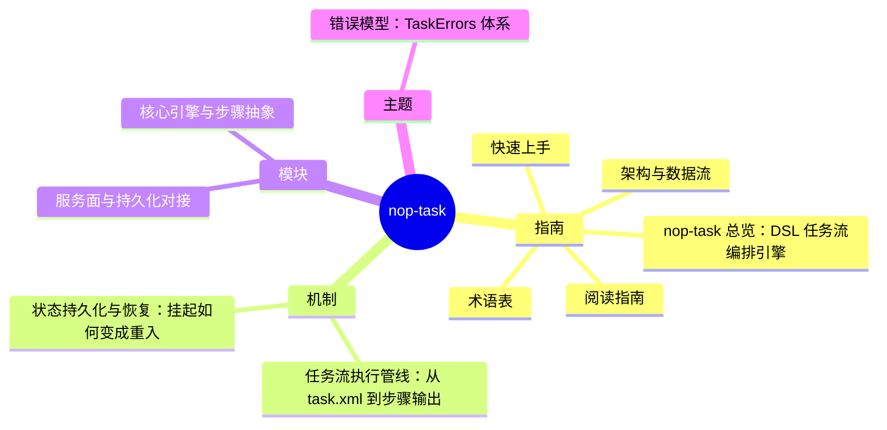

# nop-task DeepWiki

> 目标：nop-task · 结构契约：[PLAN.md](./PLAN.md) · 本文件由 gen-wiki-meta.mjs 生成，勿手改

> 快照：nop-task @ c0cd127f40 · 2026-09-26

## 指南

- [overview](overview.md) — nop-task 总览：DSL 任务流编排引擎
- [quickstart](quickstart.md) — 快速上手
- [glossary](glossary.md) — 术语表
- [reading guide](reading-guide.md) — 阅读指南
- [architecture](architecture.md) — 架构与数据流

## 机制

- [flows task execution](flows/task-execution.md) — 任务流执行管线：从 task.xml 到步骤输出
- [flows state and recovery](flows/state-and-recovery.md) — 状态持久化与恢复：挂起如何变成重入

## 模块

- [modules task core](modules/task-core.md) — 核心引擎与步骤抽象
- [modules task service dao](modules/task-service-dao.md) — 服务面与持久化对接

## 主题

- [topics error model](topics/error-model.md) — 错误模型：TaskErrors 体系
