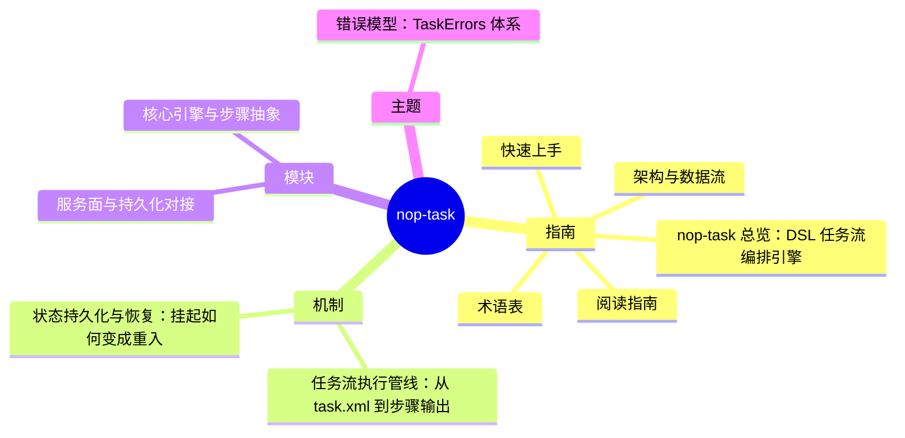

# nop-task DeepWiki

> 目标：nop-task · 结构契约：[PLAN.md](./PLAN.md) · 本文件由 gen-wiki-meta.mjs 生成，勿手改

> 快照：nop-task @ 555f7a9731 · 2026-09-30

## 1. 指南

- 1.1 [nop-task 总览：DSL 任务流编排引擎](overview.md)
- 1.2 [快速上手](quickstart.md)
- 1.3 [术语表](glossary.md)
- 1.4 [阅读指南](reading-guide.md)
- 1.5 [架构与数据流](architecture.md)

## 2. 机制

- 2.1 [任务流执行管线：从 task.xml 到步骤输出](flows/task-execution.md)
- 2.2 [状态持久化与恢复：挂起如何变成重入](flows/state-and-recovery.md)

## 3. 模块

- 3.1 [核心引擎与步骤抽象](modules/task-core.md)
- 3.2 [服务面与持久化对接](modules/task-service-dao.md)

## 4. 主题

- 4.1 [错误模型：TaskErrors 体系](topics/error-model.md)
