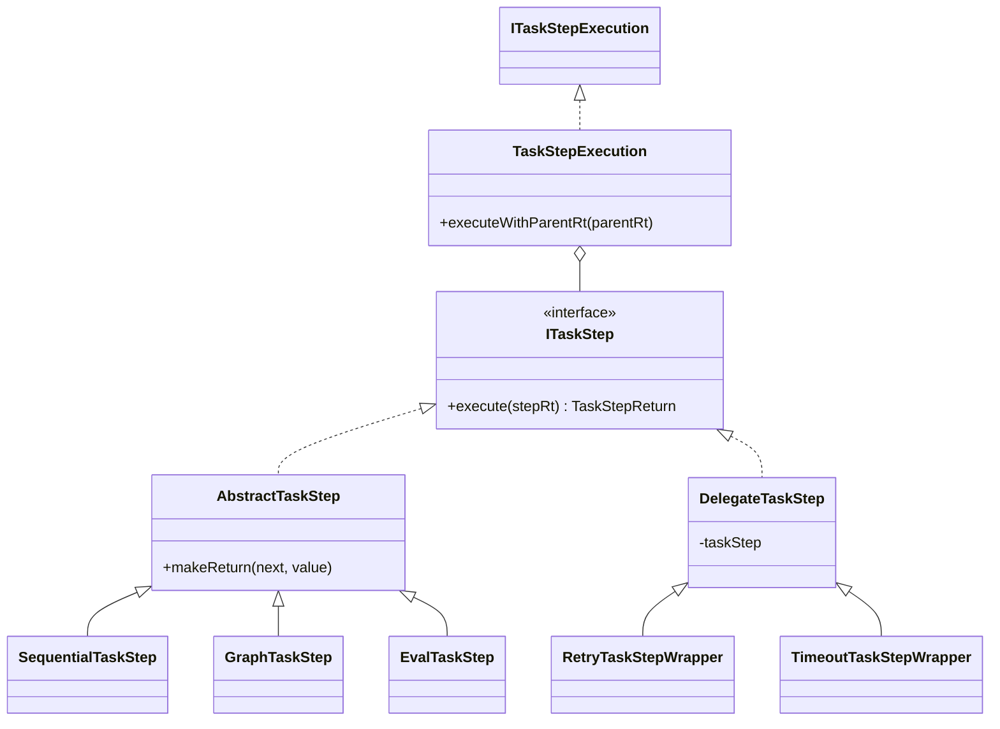
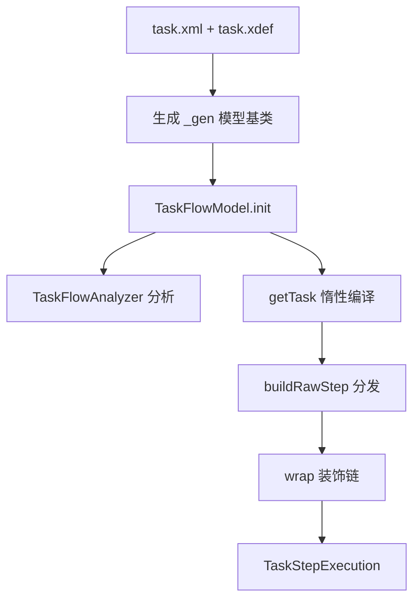
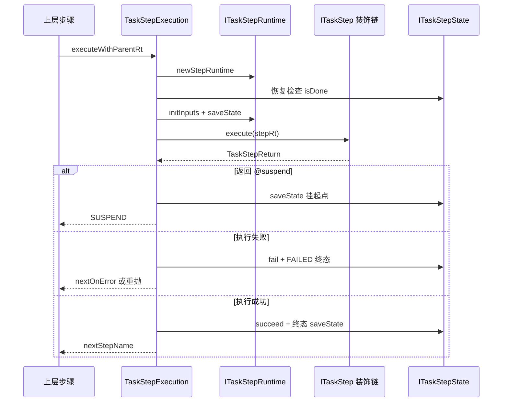

# 核心引擎与步骤抽象

> 本页源文件基准（相对于 `deepwiki/nop-task/modules/`）：
>
> - [../../nop-task/nop-task-core/src/main/java/io/nop/task/ITaskStep.java](../../../nop-task/nop-task-core/src/main/java/io/nop/task/ITaskStep.java)
> - [../../nop-task/nop-task-core/src/main/java/io/nop/task/step/AbstractTaskStep.java](../../../nop-task/nop-task-core/src/main/java/io/nop/task/step/AbstractTaskStep.java)
> - [../../nop-task/nop-task-core/src/main/java/io/nop/task/step/DelegateTaskStep.java](../../../nop-task/nop-task-core/src/main/java/io/nop/task/step/DelegateTaskStep.java)
> - [../../nop-task/nop-task-core/src/main/java/io/nop/task/TaskStepReturn.java](../../../nop-task/nop-task-core/src/main/java/io/nop/task/TaskStepReturn.java)
> - [../../nop-task/nop-task-core/src/main/java/io/nop/task/step/TaskStepExecution.java](../../../nop-task/nop-task-core/src/main/java/io/nop/task/step/TaskStepExecution.java)
> - [../../nop-task/nop-task-core/src/main/java/io/nop/task/TaskConstants.java](../../../nop-task/nop-task-core/src/main/java/io/nop/task/TaskConstants.java)
> - [../../nop-task/nop-task-core/src/main/java/io/nop/task/utils/TaskStepHelper.java](../../../nop-task/nop-task-core/src/main/java/io/nop/task/utils/TaskStepHelper.java)
> - [../../nop-task/nop-task-core/src/main/java/io/nop/task/builder/TaskStepEnhancer.java](../../../nop-task/nop-task-core/src/main/java/io/nop/task/builder/TaskStepEnhancer.java)
> - [../../nop-task/nop-task-core/src/main/java/io/nop/task/model/TaskFlowModel.java](../../../nop-task/nop-task-core/src/main/java/io/nop/task/model/TaskFlowModel.java)

本页解释 nop-task-core 的步骤抽象与模型层：`ITaskStep` 的两条继承轴（具体步骤继承 `AbstractTaskStep`、横切包装继承 `DelegateTaskStep`）、`TaskStepReturn` 的产出协议、由 task.xdef 生成的 `TaskFlowModel`/`TaskStepsModel`/`TaskStepModel` 三层模型，以及把模型变成可执行对象的装饰链管线。执行管线的全局视角见[任务执行管线](../flows/task-execution.md)。

## 步骤抽象：一个接口，两条继承轴

`ITaskStep` 的接口注释将其定位为"一种函数定义，支持多输入和多输出"（`nop-task/nop-task-core/src/main/java/io/nop/task/ITaskStep.java:19-22`）。契约只有五个元数据读取器加一个执行方法：`getStepType()`、`getPersistVars()`、`isConcurrent()`、`getInputs()`、`getOutputs()`，以及 `execute(ITaskStepRuntime)`（`ITaskStep.java:26-50`）。`execute` 的返回值 `TaskStepReturn` 标注 `@Nonnull`，且明确允许返回 `CompletionStage`——同步/异步由返回值统一表达，接口层不区分两套 API（`ITaskStep.java:42-50`）。

继承轴有两条，职责完全不同：

- **`AbstractTaskStep`（具体步骤基类）**：把接口的五个元数据落成可写字段，并提供 `makeReturn` 工厂把步骤返回值规约为 `TaskStepReturn`（`nop-task/nop-task-core/src/main/java/io/nop/task/step/AbstractTaskStep.java:20-92`）。所有控制流与动作步骤（`SequentialTaskStep`、`SelectorTaskStep`、`GraphTaskStep`、`EvalTaskStep` 等）都沿这条轴扩展。最简单的例子是 `EvalTaskStep`：执行 XLang 源后 `makeReturn(result)` 交还（`nop-task/nop-task-core/src/main/java/io/nop/task/step/EvalTaskStep.java:24-27`）。
- **`DelegateTaskStep`（包装器基类）**：构造时持有一个内层 `ITaskStep`，全部元数据读取委托给内层，自己只改写 `execute` 行为（`nop-task/nop-task-core/src/main/java/io/nop/task/step/DelegateTaskStep.java:11-51`）。retry、timeout、限流、线程池等横切能力全部沿这条轴实现（`RetryTaskStepWrapper`、`TimeoutTaskStepWrapper`、`ThrottleTaskStepWrapper` 等），这正是装饰器模式的落点。

两条轴之外还有一层执行外壳：`TaskStepExecution` 实现的是 `ITaskStepExecution` 而非 `ITaskStep`，它包住装饰链完成后的整体，负责输入绑定、恢复检查与状态驱动（`nop-task/nop-task-core/src/main/java/io/nop/task/step/TaskStepExecution.java:40-44,206-213`）。

| 层级 | 类型 | 代表实现 | 职责 |
|---|---|---|---|
| 契约 | `ITaskStep` | — | 步骤元数据 + 同步/异步统一的 `execute` |
| 具体步骤轴 | `AbstractTaskStep` | `SequentialTaskStep`、`GraphTaskStep`、`EvalTaskStep` | 持有元数据字段，`makeReturn` 规约产出 |
| 横切包装轴 | `DelegateTaskStep` | `RetryTaskStepWrapper`、`TimeoutTaskStepWrapper` | 元数据透传内层，只改写执行行为 |
| 执行外壳 | `ITaskStepExecution` | `TaskStepExecution` | 输入/输出绑定、恢复检查、状态机驱动 |

> Sources: [nop-task/nop-task-core/src/main/java/io/nop/task/ITaskStep.java:19-50](/nop-task/nop-task-core/src/main/java/io/nop/task/ITaskStep.java#L19-L50)、[nop-task/nop-task-core/src/main/java/io/nop/task/step/AbstractTaskStep.java:20-92](/nop-task/nop-task-core/src/main/java/io/nop/task/step/AbstractTaskStep.java#L20-L92)、[nop-task/nop-task-core/src/main/java/io/nop/task/step/DelegateTaskStep.java:11-51](/nop-task/nop-task-core/src/main/java/io/nop/task/step/DelegateTaskStep.java#L11-L51)、[nop-task/nop-task-core/src/main/java/io/nop/task/step/EvalTaskStep.java:24-27](/nop-task/nop-task-core/src/main/java/io/nop/task/step/EvalTaskStep.java#L24-L27)、[nop-task/nop-task-core/src/main/java/io/nop/task/step/TaskStepExecution.java:40-44](/nop-task/nop-task-core/src/main/java/io/nop/task/step/TaskStepExecution.java#L40-L44)

## TaskStepReturn：一个对象表达四种出口

`TaskStepReturn` 用两个字段承载全部产出语义：`nextStepName`（下一个步骤名，兼作控制哨兵）与 `outputs`（输出 Map，约定键 `RESULT` 存返回值），外加可选的 `future` 表达异步（`nop-task/nop-task-core/src/main/java/io/nop/task/TaskStepReturn.java:82-84`）。哨兵值来自 `TaskConstants`：

- `nextStepName == null` 且无输出 = `CONTINUE`，顺序推进到下一兄弟步骤（`TaskStepReturn.java:36`）；
- `@end`（`isEnd()`）结束整个 task，返回值成为任务结果（`TaskStepReturn.java:39-42,222-224`）;
- `@exit`（`isExit()`）只跳过后续同级步骤（`TaskStepReturn.java:44-46,226-228`）;
- `@suspend`（`isSuspend()`）挂起，支持状态的步骤可从历史状态恢复（`TaskConstants.java:44-48`）。

异步用工厂 `ASYNC`/`ASYNC_RETURN` 包装 `CompletionStage`，`hookFuture` 保证最终必然解包为一个非异步结果（`TaskStepReturn.java:67-80,92-102`）。对未完成的异步结果调用 `get()` 会抛 `ERR_TASK_STEP_RESULT_IS_ASYNC`，强制调用方走 `sync()`/`thenCompose` 路径（`TaskStepReturn.java:186-190`）。

两个容易被误读的细节值得单独说明。其一，`isSuspend()` 是按 `nextStepName` 值判断而非对象身份判断——包装层用 `RETURN(nextStepName, outputs)` 重建返回值时不会丢失挂起语义，否则挂起步骤会被驱动为 COMPLETED（`TaskStepReturn.java:215-220`，plan 349 修复）。其二，`isResultTruthy()` 为 selector 分支判定服务：无输出为 false，有 `RESULT` 键按其真值，有其他输出即 true（`TaskStepReturn.java:147-155`）。`of()` 工厂中显式传入的 `nextStepName` 优先于返回值自带的跳转名，否则 `EndTaskStep`/`ExitTaskStep` 传入的 `@end`/`@exit` 哨兵会被静默丢弃（`TaskStepReturn.java:116-123`）。

> Sources: [nop-task/nop-task-core/src/main/java/io/nop/task/TaskStepReturn.java:36-80](/nop-task/nop-task-core/src/main/java/io/nop/task/TaskStepReturn.java#L36-L80)、[nop-task/nop-task-core/src/main/java/io/nop/task/TaskStepReturn.java:147-155](/nop-task/nop-task-core/src/main/java/io/nop/task/TaskStepReturn.java#L147-L155)、[nop-task/nop-task-core/src/main/java/io/nop/task/TaskStepReturn.java:215-228](/nop-task/nop-task-core/src/main/java/io/nop/task/TaskStepReturn.java#L215-L228)、[nop-task/nop-task-core/src/main/java/io/nop/task/TaskConstants.java:38-48](/nop-task/nop-task-core/src/main/java/io/nop/task/TaskConstants.java#L38-L48)

## 模型层：xdef 生成的复合嵌套结构

模型类由 `/nop/schema/task/task.xdef` 生成基类（`nop-task/nop-task-core/src/main/java/io/nop/task/model/_gen/_TaskFlowModel.java:11-17`），手写子类只补充行为。继承链构成一个复合模式：`TaskStepModel` 是所有步骤节点的根，`_TaskStepsModel` 继承它并加入 `steps` 子步骤列表（`nop-task/nop-task-core/src/main/java/io/nop/task/model/_gen/_TaskStepsModel.java:17-24`），`TaskFlowModel` 再经 `_TaskFlowModel` 继承 `TaskStepsModel`——即"任务本身也是一个步骤"。`TaskStepModel` 是抽象类，子类必须给出 `getType()`，`getFullStepType()` 缺省即返回它（`nop-task/nop-task-core/src/main/java/io/nop/task/model/TaskStepModel.java:24-28`）。

| 模型类 | 生成基类 | 关键成员与职责 |
|---|---|---|
| `TaskStepModel` | `_TaskStepModel`（extends `TaskExecutableModel`） | `name`/`next`/`nextOnError`/`saveState`/`sync`/`useParentScope`/`waitSteps`（`_TaskStepModel.java:17,54-122`）；`normalize()` 归一化输入（`TaskStepModel.java:68-70`） |
| `TaskStepsModel` | `_TaskStepsModel` | `KeyedList<TaskStepModel> steps`，按名索引子步骤（`_TaskStepsModel.java:24-40`）；手写类当前为空壳（`TaskStepsModel.java:12-16`） |
| `TaskFlowModel` | `_TaskFlowModel`（extends `TaskStepsModel`） | `auth`/`beans`/`graphMode`/`defaultSaveState`/`restartable` 等任务级配置（`_TaskFlowModel.java:24-94`） |

`TaskFlowModel` 的行为集中在三处。其一，`init()` 在模型加载后立即跑 `TaskFlowAnalyzer` 做静态分析（`nop-task/nop-task-core/src/main/java/io/nop/task/model/TaskFlowModel.java:33-36`）。其二，`getTask`/`getTaskStepLib`/`getBeanContainerTemplate` 三个惰性方法把模型编译为运行期对象，结果缓存 synchronized 字段，构建器由调用方注入（`TaskFlowModel.java:38-81`）。其三，无名字的任务模型名字缺省为 `@main`，类型固定为 `task`（`TaskFlowModel.java:60-71`；`TaskConstants.java:31`）。`graphMode` 决定主步骤编译成图还是顺序步骤（`nop-task/nop-task-core/src/main/java/io/nop/task/builder/TaskStepBuilder.java:182-190`）。

> Sources: [nop-task/nop-task-core/src/main/java/io/nop/task/model/TaskFlowModel.java:22-82](/nop-task/nop-task-core/src/main/java/io/nop/task/model/TaskFlowModel.java#L22-L82)、[nop-task/nop-task-core/src/main/java/io/nop/task/model/TaskStepModel.java:19-70](/nop-task/nop-task-core/src/main/java/io/nop/task/model/TaskStepModel.java#L19-L70)、[nop-task/nop-task-core/src/main/java/io/nop/task/model/_gen/_TaskStepsModel.java:17-40](/nop-task/nop-task-core/src/main/java/io/nop/task/model/_gen/_TaskStepsModel.java#L17-L40)、[nop-task/nop-task-core/src/main/java/io/nop/task/model/_gen/_TaskFlowModel.java:11-94](/nop-task/nop-task-core/src/main/java/io/nop/task/model/_gen/_TaskFlowModel.java#L11-L94)

## 从模型到运行时：装饰链的固定组装顺序

`TaskStepEnhancer.buildExecution` 是每个步骤节点的组装入口：先 `buildDecorated` 产出装饰链，再把链整体包进 `TaskStepExecution`（`nop-task/nop-task-core/src/main/java/io/nop/task/builder/TaskStepEnhancer.java:59-62`）。链的内核由 `TaskStepBuilder.buildRawStep` 按 `stepModel.getType()` 分发产出，20 余种步骤类型各自映射到具体类，未知类型抛 `ERR_TASK_UNSUPPORTED_STEP_TYPE`（`nop-task/nop-task-core/src/main/java/io/nop/task/builder/TaskStepBuilder.java:90-180`）。分发之后统一回填模型元数据：location、inputs、outputs、concurrent、persistVars（`TaskStepBuilder.java:413-420`）。

随后 `wrap` 按固定顺序叠加包装器，顺序本身承载语义：decorate → try(catch/finally) → 输出构建 → retry → executor → runOnContext → timeout → throttle → rateLimit → validator → sync → allowFailure（`TaskStepEnhancer.java:107-166`）。注释明确"timeout 控制整个 retry 过程的时长"，即 timeout 在 retry 之外（`TaskStepEnhancer.java:127-135`）。用户自定义装饰器有三条解析路径：显式 bean、XLang source、约定名 `nopTaskStepDecorator_<name>`（`TaskStepEnhancer.java:198-214`；`TaskConstants.java:198`）。一个防御性细节：`simple` 步骤引用的容器 bean 是共享单例，必须再包一层 `SimpleBeanTaskStep`，否则多步骤引用同一 bean 时 persistVars/concurrent 配置互相覆盖（`TaskStepBuilder.java:379-385`）。

`TaskStepExecution.executeWithParentRt` 是步骤生命周期的真正现场：创建子 `ITaskStepRuntime` → 恢复模式下检查终态（continuation-skip：COMPLETED 回放缓存结果、FAILED 默认重抛）→ 绑定输入并捕获 persistVars 落盘 → 执行内层链 → 按产出三分支驱动状态机（挂起落盘返回；失败进 `driveStepFailure`；成功导出 outputs、`succeed` 并保存终态）（`nop-task/nop-task-core/src/main/java/io/nop/task/step/TaskStepExecution.java:206-371,380-407`）。

> Sources: [nop-task/nop-task-core/src/main/java/io/nop/task/builder/TaskStepEnhancer.java:59-166](/nop-task/nop-task-core/src/main/java/io/nop/task/builder/TaskStepEnhancer.java#L59-L166)、[nop-task/nop-task-core/src/main/java/io/nop/task/builder/TaskStepBuilder.java:90-180](/nop-task/nop-task-core/src/main/java/io/nop/task/builder/TaskStepBuilder.java#L90-L180)、[nop-task/nop-task-core/src/main/java/io/nop/task/builder/TaskStepBuilder.java:379-420](/nop-task/nop-task-core/src/main/java/io/nop/task/builder/TaskStepBuilder.java#L379-L420)、[nop-task/nop-task-core/src/main/java/io/nop/task/step/TaskStepExecution.java:206-407](/nop-task/nop-task-core/src/main/java/io/nop/task/step/TaskStepExecution.java#L206-L407)

## 控制流步骤：跳转、候选与图协作

`SequentialTaskStep.execute` 用 `bodyStepIndex`（保存在 `ITaskStepRuntime` 状态里）驱动 do-while 循环：每执行完一个子步骤就把索引推进写回状态并 `saveState`，这是断点恢复的最小持久单元；子步骤返回非空 `nextStepName` 时按名字查 `stepIndex` 跳转，查不到抛 `ERR_TASK_UNKNOWN_NEXT_STEP`（`nop-task/nop-task-core/src/main/java/io/nop/task/step/SequentialTaskStep.java:46-110`）。`@end` 直接上抛结束全任务，`@exit` 则转为返回 outputs、索引置到末尾（`SequentialTaskStep.java:64-72`）。

`SelectorTaskStep` 逐候选尝试：子步骤抛异常且还有候选时吞掉异常推进下一候选，成功返回按 `isResultTruthy` 决定是否短路（`nop-task/nop-task-core/src/main/java/io/nop/task/step/SelectorTaskStep.java:40-77`）。挂起类步骤以 `SuspendTaskStep` 为代表：首次进入必挂起（类似 yield），之后按 `resumeWhen` 谓词决定继续挂起还是放行（`nop-task/nop-task-core/src/main/java/io/nop/task/step/SuspendTaskStep.java:28-43`）。`SUSPEND` 会沿调用链逐层透传：顺序与选择步骤都把挂起原样上抛并停止推进（`SequentialTaskStep.java:62-63`；`SelectorTaskStep.java:61-62`）。

`GraphTaskStep` 是最复杂的控制流步骤。每个节点声明 `waitSteps`（成功等待）/`waitErrorSteps`（错误等待）/`waitCompleteSteps`（完成等待），构造时做防御性复制并把交集单列为 `waitCompleteSteps`，避免原地改写模型自有集合导致二次构建语义漂移（`nop-task/nop-task-core/src/main/java/io/nop/task/step/GraphTaskStep.java:79-97`）。执行时按依赖关系用 CompletableFuture 级联调度：错误只有被 waitError/waitComplete 节点消费时才不 fail-fast，全部路径死端由 `completeGraphIfDrained`（runningCount 归零且图未终结）以 `ERR_TASK_GRAPH_NO_ACTIVE_STEP` 兜底（`GraphTaskStep.java:190-246,274-297,363-368`）。错误分支转交（error-handoff）：`TaskStepExecution` 把失败包装为携带 `nextOnError` 跳转的成功返回，图层将其还原为失败语义以触发 waitError 等待者（`GraphTaskStep.java:313-330`）。图内挂起则以挂起值终结全图并取消兄弟分支（`GraphTaskStep.java:301-309`）。注意：并行会话正在修复 GraphTaskStep/TaskConstants，本页断言以当前工作区内容为准。恢复侧的状态快照与重入见[状态与恢复](../flows/state-and-recovery.md)。

> Sources: [nop-task/nop-task-core/src/main/java/io/nop/task/step/SequentialTaskStep.java:46-110](/nop-task/nop-task-core/src/main/java/io/nop/task/step/SequentialTaskStep.java#L46-L110)、[nop-task/nop-task-core/src/main/java/io/nop/task/step/SelectorTaskStep.java:40-77](/nop-task/nop-task-core/src/main/java/io/nop/task/step/SelectorTaskStep.java#L40-L77)、[nop-task/nop-task-core/src/main/java/io/nop/task/step/SuspendTaskStep.java:28-43](/nop-task/nop-task-core/src/main/java/io/nop/task/step/SuspendTaskStep.java#L28-L43)、[nop-task/nop-task-core/src/main/java/io/nop/task/step/GraphTaskStep.java:79-97](/nop-task/nop-task-core/src/main/java/io/nop/task/step/GraphTaskStep.java#L79-L97)、[nop-task/nop-task-core/src/main/java/io/nop/task/step/GraphTaskStep.java:179-368](/nop-task/nop-task-core/src/main/java/io/nop/task/step/GraphTaskStep.java#L179-L368)

## TaskConstants 与 TaskStepHelper：常量枢纽与横切工具

`TaskConstants` 是全模块的符号表，三类常量支撑了前文所有机制：

1. **哨兵与变量名**：`@main`/`@end`/`@exit`/`@suspend` 四个保留步骤名，以及 `RESULT`、`STEP_RESULTS`、`ERROR`、`OUTPUTS` 等 scope 约定变量（`nop-task/nop-task-core/src/main/java/io/nop/task/TaskConstants.java:31-72`）。
2. **步骤类型字面量**：`STEP_TYPE_*` 既是 xdef 的合法取值也是 `TaskStepBuilder` switch 的分发键（`TaskConstants.java:123-182`；`TaskStepBuilder.java:93-175`）。
3. **状态码**：任务/步骤状态常量全部单源引用生成的 `_NopTaskCoreConstants`，漂移在编译期暴露——历史上 30/40/50/60 数值体系与 ORM 字典错位，导致 COMPLETED 被展示层读成"执行中"（`TaskConstants.java:82-121`）。

`TaskStepHelper` 收拢了跨步骤复用的横切逻辑。`checkNotCancelled` 在取消时抛出携带 cancel reason 的 `NopTaskCancelledException`，使 task 层能区分 timeout 与 kill（`nop-task/nop-task-core/src/main/java/io/nop/task/utils/TaskStepHelper.java:71-80`）。`timeout` 为被包装步骤装配独立 cancellable 与定时器，异步结果与超时兜底 promise 竞速，保证返回值在有限时间内终结、终态 driver 不会被挂死（`TaskStepHelper.java:184-244`）。`retry` 循环中，真取消（kill/timeout）不计失败次数，`SUSPEND` 不视为成功（否则 resume 时挂起子流程被 continuation-skip 永久跳过），每轮 retryAttempt 增量在下一轮执行前落盘（`TaskStepHelper.java:246-325`）。`withCancellable` 为并发步骤装配可自动取消未完成分支的 token（`TaskStepHelper.java:357-386`）。

对引擎使用者，术语边界见[术语表](../glossary.md)。错误码体系与步骤失败语义的完整分析见[错误模型](../topics/error-model.md)。

> Sources: [nop-task/nop-task-core/src/main/java/io/nop/task/TaskConstants.java:31-72](/nop-task/nop-task-core/src/main/java/io/nop/task/TaskConstants.java#L31-L72)、[nop-task/nop-task-core/src/main/java/io/nop/task/TaskConstants.java:82-121](/nop-task/nop-task-core/src/main/java/io/nop/task/TaskConstants.java#L82-L121)、[nop-task/nop-task-core/src/main/java/io/nop/task/utils/TaskStepHelper.java:71-128](/nop-task/nop-task-core/src/main/java/io/nop/task/utils/TaskStepHelper.java#L71-L128)、[nop-task/nop-task-core/src/main/java/io/nop/task/utils/TaskStepHelper.java:184-325](/nop-task/nop-task-core/src/main/java/io/nop/task/utils/TaskStepHelper.java#L184-L325)、[nop-task/nop-task-core/src/main/java/io/nop/task/utils/TaskStepHelper.java:357-386](/nop-task/nop-task-core/src/main/java/io/nop/task/utils/TaskStepHelper.java#L357-L386)

## Sources

- [nop-task/nop-task-core/src/main/java/io/nop/task/ITaskStep.java:19-50](/nop-task/nop-task-core/src/main/java/io/nop/task/ITaskStep.java#L19-L50)
- [nop-task/nop-task-core/src/main/java/io/nop/task/step/AbstractTaskStep.java:20-92](/nop-task/nop-task-core/src/main/java/io/nop/task/step/AbstractTaskStep.java#L20-L92)
- [nop-task/nop-task-core/src/main/java/io/nop/task/step/DelegateTaskStep.java:11-51](/nop-task/nop-task-core/src/main/java/io/nop/task/step/DelegateTaskStep.java#L11-L51)
- [nop-task/nop-task-core/src/main/java/io/nop/task/step/EvalTaskStep.java:24-27](/nop-task/nop-task-core/src/main/java/io/nop/task/step/EvalTaskStep.java#L24-L27)
- [nop-task/nop-task-core/src/main/java/io/nop/task/TaskStepReturn.java:36-258](/nop-task/nop-task-core/src/main/java/io/nop/task/TaskStepReturn.java#L36-L258)
- [nop-task/nop-task-core/src/main/java/io/nop/task/TaskConstants.java:31-182](/nop-task/nop-task-core/src/main/java/io/nop/task/TaskConstants.java#L31-L182)
- [nop-task/nop-task-core/src/main/java/io/nop/task/model/TaskFlowModel.java:22-82](/nop-task/nop-task-core/src/main/java/io/nop/task/model/TaskFlowModel.java#L22-L82)
- [nop-task/nop-task-core/src/main/java/io/nop/task/model/TaskStepModel.java:19-70](/nop-task/nop-task-core/src/main/java/io/nop/task/model/TaskStepModel.java#L19-L70)
- [nop-task/nop-task-core/src/main/java/io/nop/task/model/_gen/_TaskStepsModel.java:17-40](/nop-task/nop-task-core/src/main/java/io/nop/task/model/_gen/_TaskStepsModel.java#L17-L40)
- [nop-task/nop-task-core/src/main/java/io/nop/task/builder/TaskStepBuilder.java:90-420](/nop-task/nop-task-core/src/main/java/io/nop/task/builder/TaskStepBuilder.java#L90-L420)
- [nop-task/nop-task-core/src/main/java/io/nop/task/builder/TaskStepEnhancer.java:59-214](/nop-task/nop-task-core/src/main/java/io/nop/task/builder/TaskStepEnhancer.java#L59-L214)
- [nop-task/nop-task-core/src/main/java/io/nop/task/step/TaskStepExecution.java:206-407](/nop-task/nop-task-core/src/main/java/io/nop/task/step/TaskStepExecution.java#L206-L407)
- [nop-task/nop-task-core/src/main/java/io/nop/task/step/SequentialTaskStep.java:46-110](/nop-task/nop-task-core/src/main/java/io/nop/task/step/SequentialTaskStep.java#L46-L110)
- [nop-task/nop-task-core/src/main/java/io/nop/task/step/SelectorTaskStep.java:40-77](/nop-task/nop-task-core/src/main/java/io/nop/task/step/SelectorTaskStep.java#L40-L77)
- [nop-task/nop-task-core/src/main/java/io/nop/task/step/SuspendTaskStep.java:28-43](/nop-task/nop-task-core/src/main/java/io/nop/task/step/SuspendTaskStep.java#L28-L43)
- [nop-task/nop-task-core/src/main/java/io/nop/task/step/GraphTaskStep.java:79-368](/nop-task/nop-task-core/src/main/java/io/nop/task/step/GraphTaskStep.java#L79-L368)
- [nop-task/nop-task-core/src/main/java/io/nop/task/utils/TaskStepHelper.java:71-386](/nop-task/nop-task-core/src/main/java/io/nop/task/utils/TaskStepHelper.java#L71-L386)

---

## On this page

- 步骤抽象：一个接口，两条继承轴
- TaskStepReturn：一个对象表达四种出口
- 模型层：xdef 生成的复合嵌套结构
- 从模型到运行时：装饰链的固定组装顺序
- 控制流步骤：跳转、候选与图协作
- TaskConstants 与 TaskStepHelper：常量枢纽与横切工具
