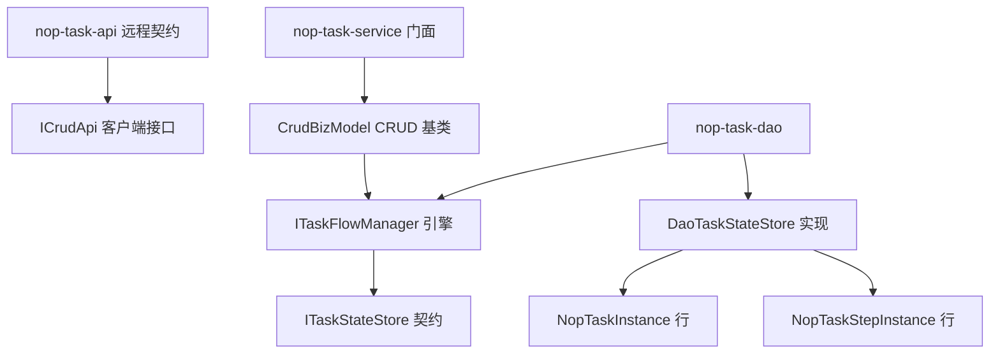
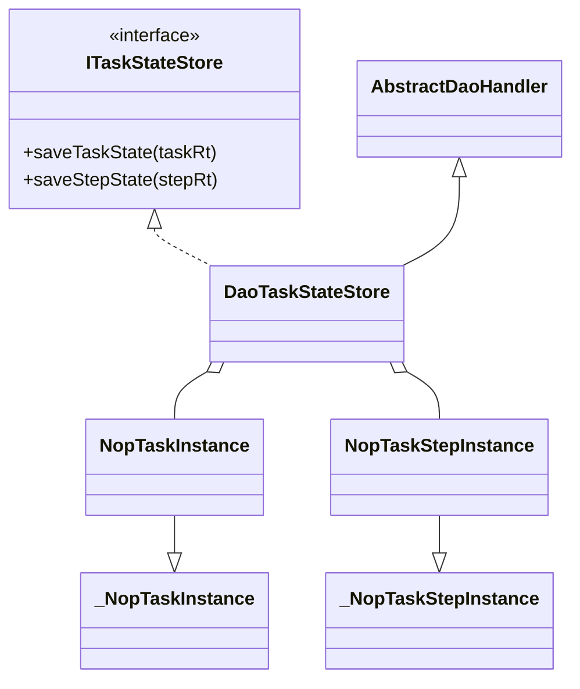
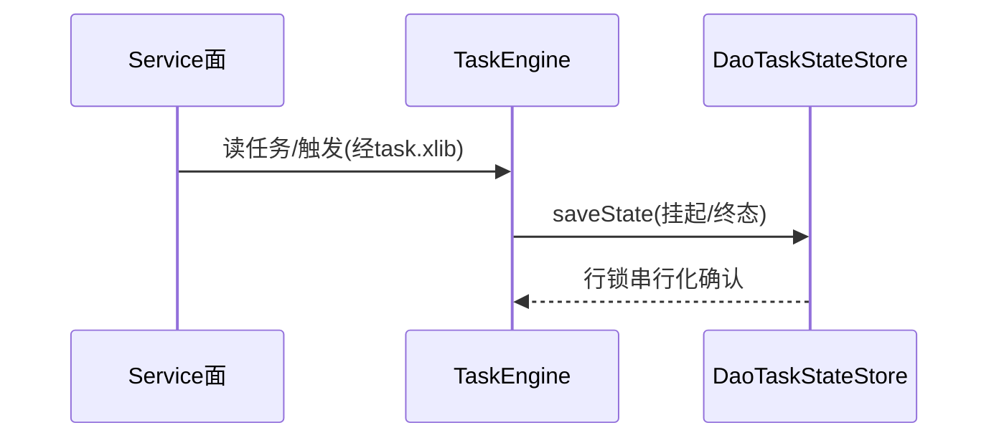

# 服务面与持久化对接

> 本页源文件基准（相对于 `deepwiki/nop-task/modules/`）：
>
> - [../../nop-task/nop-task-service/src/main/java/io/nop/task/service/entity/NopTaskInstanceBizModel.java](../../../nop-task/nop-task-service/src/main/java/io/nop/task/service/entity/NopTaskInstanceBizModel.java)
> - [../../nop-task/nop-task-service/src/main/java/io/nop/task/service/entity/NopTaskDefinitionBizModel.java](../../../nop-task/nop-task-service/src/main/java/io/nop/task/service/entity/NopTaskDefinitionBizModel.java)
> - [../../nop-task/nop-task-dao/src/main/java/io/nop/task/dao/store/DaoTaskStateStore.java](../../../nop-task/nop-task-dao/src/main/java/io/nop/task/dao/store/DaoTaskStateStore.java)
> - [../../nop-task/nop-task-dao/src/main/java/io/nop/task/dao/store/TaskExceptionRegistry.java](../../../nop-task/nop-task-dao/src/main/java/io/nop/task/dao/store/TaskExceptionRegistry.java)
> - [../../nop-task/nop-task-dao/src/main/java/io/nop/task/dao/entity/NopTaskInstance.java](../../../nop-task/nop-task-dao/src/main/java/io/nop/task/dao/entity/NopTaskInstance.java)
> - [../../nop-task/nop-task-api/src/main/java/io/nop/task/api/crud/NopTaskInstanceApi.java](../../../nop-task/nop-task-api/src/main/java/io/nop/task/api/crud/NopTaskInstanceApi.java)
> - [../../nop-task/nop-task-queue/src/main/java/io/nop/task/queue/ITaskQueue.java](../../../nop-task/nop-task-queue/src/main/java/io/nop/task/queue/ITaskQueue.java)
> - [../../nop-task/nop-task-core/src/main/java/io/nop/task/ITaskStateStore.java](../../../nop-task/nop-task-core/src/main/java/io/nop/task/ITaskStateStore.java)

本页解释四个外围模块如何包装[核心引擎](./task-core.md)：service 暴露实体 CRUD 门面并加写保护，dao 以 `DaoTaskStateStore` 落库，api 提供远程契约，queue 为占位。任务生命周期操作的入口见[任务执行管线](../flows/task-execution.md)。

## 模块分工：包装而不重建引擎

四个模块的依赖方向是单向的：api 只依赖 `nop-api-core`；dao 在其上叠加 `nop-orm` 与 `nop-task-core`（实现引擎的 store 契约）；service 再叠加 dao 与 `nop-biz`（继承 `CrudBizModel`）；queue 无任何依赖。没有任何一个模块反向包含引擎内部——包装点只有两个：service 面向 GraphQL 的 CRUD 门面，dao 面向 `ITaskFlowManager` 的状态存储实现。

| 模块 | src/main/java 文件数 | 职责 | 关键类型 |
|---|---|---|---|
| nop-task-api | 12 | 远程 CRUD 契约（代码生成物） | `ICrudApi` 子接口 ×4、`@DataBean` ×8 |
| nop-task-dao | 16 | 落库实体 + `ITaskStateStore` DB 实现 | `DaoTaskStateStore`、`TaskExceptionRegistry` |
| nop-task-service | 7 | BizModel 服务面 | `NopTask*BizModel` ×4 + 空常量接口 ×3 |
| nop-task-queue | 1 | 队列对接占位 | `ITaskQueue`（空方法） |



> Sources: [nop-task/nop-task-service/pom.xml]()、[nop-task/nop-task-dao/pom.xml]()、[nop-task/nop-task-api/pom.xml]()、[nop-task/nop-task-queue/pom.xml]()

## 服务面：CRUD 门面加一道写保护闸门

服务面只有 7 个 Java 文件：4 个 BizModel、3 个空常量接口。`NopTaskConstants` 为无成员接口（`nop-task/nop-task-service/src/main/java/io/nop/task/service/NopTaskConstants.java:3-4`）。`NopTaskConfigs` 同为无成员接口（`nop-task/nop-task-service/src/main/java/io/nop/task/service/NopTaskConfigs.java:3-4`）。`NopTaskErrors` 亦然（`nop-task/nop-task-service/src/main/java/io/nop/task/service/NopTaskErrors.java:3-4`）。四个 BizModel 全部继承平台的 `CrudBizModel<T>` 并以 `@BizModel` 绑定实体名（`nop-task/nop-task-service/src/main/java/io/nop/task/service/entity/NopTaskInstanceBizModel.java:20-24`），自身唯一的行为是**重写 `copyForNew` 并直接抛异常**（`NopTaskInstanceBizModel.java:30-42`）：

```java
public NopTaskInstance copyForNew(@Name("data") Map<String, Object> data, IServiceContext context) {
    throw crudWriteDisabled("copyForNew");
}
```

禁用理由写在注释里：`copyForNew` 的 `cloneInstance` 会整行克隆乐观锁 `version` 列，绕过 xmeta 的 insert 锁（`nop-task/nop-task-service/src/main/java/io/nop/task/service/entity/NopTaskDefinitionBizModel.java:26-29`）。错误码为 `ERR_TASK_CRUD_WRITE_DISABLED`，消息明确"实体为引擎独占数据，禁止CRUD写操作"（`nop-task/nop-task-core/src/main/java/io/nop/task/TaskErrors.java:184-185`）。

| Biz 对象 | BizModel 类 | 自定义行为 | 继承的 CRUD 门面 |
|---|---|---|---|
| `NopTaskDefinition` | `NopTaskDefinitionBizModel` | `copyForNew` 禁用 | `CrudBizModel` 全套查询/写操作 |
| `NopTaskDefinitionAuth` | `NopTaskDefinitionAuthBizModel` | `copyForNew` 禁用 | 同上 |
| `NopTaskInstance` | `NopTaskInstanceBizModel` | `copyForNew` 禁用 | 同上 |
| `NopTaskStepInstance` | `NopTaskStepInstanceBizModel` | `copyForNew` 禁用 | 同上 |

继承的操作面来自平台基类：查询侧 `findCount`/`findPage`/`findFirst`（`nop-service-framework/nop-biz/src/main/java/io/nop/biz/crud/CrudBizModel.java:284-313,497-499`）与 `get`/`batchGet`/`asDict` 等；写侧 `save`（`CrudBizModel.java:550-552`）、`update`/`saveOrUpdate`/`delete`/`batchDelete`/`batchUpdate`/`updateByQuery`/`recoverDeleted` 等。也就是说，服务面暴露的是**实体数据的读写**，任务实例行的业务写入仍走引擎——四个 BizModel 对任务启动、恢复、取消没有任何方法。

IoC 注册在 `_service.beans.xml`：每个对象两个 bean，一个是 BizModel 类实例（`ioc:default="true"`），一个是 `BizProxyFactoryBean` 生成的 `biz_NopTask*` 代理，类型为 dao 模块的 `INopTask*Biz` 接口（`nop-task/nop-task-service/src/main/resources/_vfs/nop/task/beans/_service.beans.xml:16-19`）。这四个接口本身只是 `ICrudBiz<T>` 的空扩展（`nop-task/nop-task-dao/src/main/java/io/nop/task/biz/INopTaskInstanceBiz.java:8-10`），作用是给代理一个编译期类型。任务级 GraphQL 操作的真正生成机制（xlib 注入 `nopTaskFlowManager`）属引擎侧，见[任务执行管线](../flows/task-execution.md)。

> Sources: [nop-task/nop-task-service/src/main/java/io/nop/task/service/entity/NopTaskInstanceBizModel.java:20-42](/nop-task/nop-task-service/src/main/java/io/nop/task/service/entity/NopTaskInstanceBizModel.java#L20-L42)、[nop-task/nop-task-service/src/main/java/io/nop/task/service/entity/NopTaskDefinitionBizModel.java:26-42](/nop-task/nop-task-service/src/main/java/io/nop/task/service/entity/NopTaskDefinitionBizModel.java#L26-L42)、[nop-task/nop-task-core/src/main/java/io/nop/task/TaskErrors.java:184-185](/nop-task/nop-task-core/src/main/java/io/nop/task/TaskErrors.java#L184-L185)、[nop-service-framework/nop-biz/src/main/java/io/nop/biz/crud/CrudBizModel.java:284-552](/nop-service-framework/nop-biz/src/main/java/io/nop/biz/crud/CrudBizModel.java#L284-L552)、[nop-task/nop-task-service/src/main/resources/_vfs/nop/task/beans/_service.beans.xml:6-37](/nop-task/nop-task-service/src/main/resources/_vfs/nop/task/beans/_service.beans.xml#L6-L37)

## DAO 实体：引擎状态的落库载体

dao 模块的 16 个 Java 文件分四组：4 个手写实体、4 个 `_gen` 生成基类、4 个 `INopTask*Biz` 代理接口、2 个常量接口（`NopTaskDaoConstants`/`_NopTaskDaoConstants` 均无成员，`nop-task/nop-task-dao/src/main/java/io/nop/task/dao/_NopTaskDaoConstants.java:4-6`）加 store 包两类。手写实体是生成基类的空子类，只挂 `@BizObjName` 名字（`nop-task/nop-task-dao/src/main/java/io/nop/task/dao/entity/NopTaskInstance.java:14-18`），全部字段（含 getter/setter 与类型转换）都在生成基类里。

| 实体 | 表名 | 主键 | 定位 |
|---|---|---|---|
| `NopTaskDefinition` | nop_task_definition | `taskDefId` | 逻辑流模型定义（CRUD 管理） |
| `NopTaskDefinitionAuth` | nop_task_definition_auth | `sid` | 定义级权限 |
| `NopTaskInstance` | nop_task_instance | `taskInstanceId` | 任务运行状态行（`DaoTaskStateStore` 读写） |
| `NopTaskStepInstance` | nop_task_step_instance | `stepInstanceId` | 步骤运行状态行（同上） |

表名与列定义源自 `nop-task/model/nop-task.orm.xml`（四实体见 `:61-261`）。两个实例表是状态存储的承重列：`NopTaskInstance` 有 `status`/`startTime`/`endTime`/`taskInputs`/`remark`/`errCode`/`errMsg`/`errorBeanData`/`errorStack`（`nop-task/nop-task-dao/src/main/java/io/nop/task/dao/entity/_gen/_NopTaskInstance.java:25-177`）；`NopTaskStepInstance` 有 `stepPath`/`runId`/`bodyStepIndex`/`stepStatus`/`stateBeanData`/`retryCount`/`tagText`/`errorBeanData`/`errorStack`（`nop-task/nop-task-dao/src/main/java/io/nop/task/dao/entity/_gen/_NopTaskStepInstance.java:25-153`）。ORM 模型同时锁定了三列宽度——`REMARK` 200、`ERROR_BEAN_DATA` 4000、`ERROR_STACK` 4000（`nop-task/model/nop-task.orm.xml:332-336`）——以及步骤表的单列索引 `IX_TASK_STEP_TASK_ID`，其注释指明唯一程序化查询条件是 `eq(taskInstanceId) AND eq(stepPath)`（`nop-task/model/nop-task.orm.xml:340-347`）。






> Sources: [nop-task/nop-task-service/src/main/java/io/nop/task/service/entity/NopTaskInstanceBizModel.java:20-36]() [nop-task/nop-task-dao/src/main/java/io/nop/task/dao/store/DaoTaskStateStore.java:327-360]()


> Sources: [nop-task/nop-task-dao/src/main/java/io/nop/task/dao/entity/NopTaskInstance.java:14-18](/nop-task/nop-task-dao/src/main/java/io/nop/task/dao/entity/NopTaskInstance.java#L14-L18)、[nop-task/nop-task-dao/src/main/java/io/nop/task/dao/entity/_gen/_NopTaskInstance.java:25-187](/nop-task/nop-task-dao/src/main/java/io/nop/task/dao/entity/_gen/_NopTaskInstance.java#L25-L187)、[nop-task/nop-task-dao/src/main/java/io/nop/task/dao/entity/_gen/_NopTaskStepInstance.java:25-177](/nop-task/nop-task-dao/src/main/java/io/nop/task/dao/entity/_gen/_NopTaskStepInstance.java#L25-L177)、[nop-task/model/nop-task.orm.xml:61-347](/nop-task/model/nop-task.orm.xml#L61-L347)、[nop-task/nop-task-dao/src/main/java/io/nop/task/biz/INopTaskInstanceBiz.java:8-10](/nop-task/nop-task-dao/src/main/java/io/nop/task/biz/INopTaskInstanceBiz.java#L8-L10)

## DaoTaskStateStore：把引擎状态写成两类表行

引擎定义的持久化契约是 `ITaskStateStore` 的 8 个方法：task 级 `newTaskState`/`loadTaskState`/`saveTaskState`，step 级 `newMainStepState`/`loadMainStepState`/`newStepState`/`loadStepState`/`saveStepState`，外加 `isSupportPersist()`（`nop-task/nop-task-core/src/main/java/io/nop/task/ITaskStateStore.java:10-47`）。`DaoTaskStateStore` 是该契约唯一的 DB 实现，继承 `AbstractDaoHandler` 并声明 `isSupportPersist()=true`（`nop-task/nop-task-dao/src/main/java/io/nop/task/dao/store/DaoTaskStateStore.java:48,116-119`）。

**task 级读写**。`newTaskState` 直接 `saveEntityDirectly` 落一条 ACTIVE 任务行（`DaoTaskStateStore.java:123-135`）；`saveTaskState` 把内存状态回写实体：请求参数序列化为 JSON 写 `taskInputs`（上限 4000，超长跳过有日志，`:176-188`）；终态结果写 `remark`——列宽只有 200，守卫阈值与列宽对齐，超长跳过（`:193-212`）；异常拆成 `errCode`+`errMsg`（截断 500）+ 完整 `ErrorBean` JSON（`errorBeanData`）+ 原始堆栈（`errorStack`）四列（`:217-237`）；终态时补 `endTime`（`:239-243`）。`loadTaskState` 反向重建：`remark` 反序列化回 `resultValue`（解析失败降级保留原文）、`taskInputs` 恢复 `request`、异常从 `errorBeanData` 重构，随后调用状态 bean 的 `afterLoad` hook（`:138-148,382-425`）。

**step 级读写**。主步骤信封固定 `stepPath=@main`、`runId=0`、`stepType=task`（`:254-263`）；`loadMainStepState` 按 path 加载持久化行，无行返回 null 使引擎回退新建（`:277-285`）。子步骤以 `stepPath=parentPath/stepName` 层级定位（`:288-317`）；`findStepEntity` 的查询条件正是 ORM 索引注释所指的 `eq(taskInstanceId)+eq(stepPath)`（`:364-371`）。`saveStepState` 在进程内用 64 槽条带锁按 `(taskInstanceId, stepPath)` 串行化读-拷-写，防止 fork/kill 等并发驱动对同一行的乐观锁冲突冒泡为分支失败（`:327-360`）。

步骤状态的负载走单一 `stateBeanData` 列，格式为版本化 wrapper（`__stateDataVersion=2`），打包 `resultValue`/`stateBean`/`outputs`/`nextStepName`/`persistVars`；超 4000 时降级为仅保留 `resultValue`，仍超长则清列（`:542-577`）。读取侧向后兼容旧格式（裸 `resultValue` JSON，`:583-615`）。

**装配方式**。`TaskFlowManagerImpl` 持有两个 store 字段：可空的 `taskStateStore` 与缺省 `DefaultTaskStateStore.INSTANCE`（内存实现），按 `saveState` 标志分流（`nop-task/nop-task-core/src/main/java/io/nop/task/impl/TaskFlowManagerImpl.java:55-57,95-98`）；需要持久化而未注入时抛 `ERR_TASK_NO_PERSIST_STATE_STORE`（`:114-117`）。`nopTaskFlowManager` bean 定义在引擎的 `task-defaults.beans.xml`（`nop-task/nop-task-core/src/main/resources/_vfs/nop/task/beans/task-defaults.beans.xml:5-6`），但主树没有把 `DaoTaskStateStore` 注册进去——落库能力要求应用侧向该 bean 注入 `taskStateStore` 属性；仓库内唯一的使用示范是 ext 测试经 `ioc:allow-override` 覆盖 `nopTaskFlowManager`（`nop-task/nop-task-ext/src/test/resources/_vfs/nop/task/test/beans/test-reliability.beans.xml:16-17`）。挂起与恢复如何消费这些行，见[状态与恢复](../flows/state-and-recovery.md)。

> Sources: [nop-task/nop-task-core/src/main/java/io/nop/task/ITaskStateStore.java:10-47](/nop-task/nop-task-core/src/main/java/io/nop/task/ITaskStateStore.java#L10-L47)、[nop-task/nop-task-dao/src/main/java/io/nop/task/dao/store/DaoTaskStateStore.java:48-615](/nop-task/nop-task-dao/src/main/java/io/nop/task/dao/store/DaoTaskStateStore.java#L48-L615)、[nop-task/nop-task-dao/src/main/java/io/nop/task/dao/store/DaoTaskStateStore.java:809-890](/nop-task/nop-task-dao/src/main/java/io/nop/task/dao/store/DaoTaskStateStore.java#L809-L890)、[nop-task/nop-task-core/src/main/java/io/nop/task/impl/TaskFlowManagerImpl.java:55-117](/nop-task/nop-task-core/src/main/java/io/nop/task/impl/TaskFlowManagerImpl.java#L55-L117)、[nop-task/nop-task-core/src/main/resources/_vfs/nop/task/beans/task-defaults.beans.xml:5-15](/nop-task/nop-task-core/src/main/resources/_vfs/nop/task/beans/task-defaults.beans.xml#L5-L15)

## 异常落库与重建：TaskExceptionRegistry

跨重启恢复时，`errorBeanData` 里的 `ErrorBean` JSON 需要还原成异常对象。`TaskExceptionRegistry` 是 dao 模块内的 FQCN→工厂注册表：编译期注册 `NopTaskFailException`、`NopTaskCancelledException`（来自 nop-task-core）；反射注册 `io.nop.ai.agent.engine.NopAiAgentException`、`io.nop.ai.api.exceptions.NopAiException`——dao 不依赖 nop-ai 模块，缺类时该 FQCN 安全回退（`nop-task/nop-task-dao/src/main/java/io/nop/task/dao/store/TaskExceptionRegistry.java:55-71`）。反射路径依次探测 `(String,Throwable)`/`(ErrorCode,Throwable)`/`(String)`/`(ErrorCode)` 四种构造器，全部失败则返回 null 由调用方退化为 generic `NopException`（`:126-172`）。

重建入口 `loadException` 优先解析 `errorBeanData`（保留 params 与 cause chain），失败或缺失时回退 `errCode+errMsg`；`errorStack` 列的内容作为 `errorStack` param 附加到重建异常上（`DaoTaskStateStore.java:809-829`）。`rebuildExceptionFromErrorBean` 递归还原 cause 链，并把 cause 经构造器直接传入——先建 null-cause 再 `initCause` 会触发 `IllegalStateException`（`:847-856`）。恢复后的异常如何在重入时被重抛，属引擎语义，见[状态与恢复](../flows/state-and-recovery.md)。

> Sources: [nop-task/nop-task-dao/src/main/java/io/nop/task/dao/store/TaskExceptionRegistry.java:36-172](/nop-task/nop-task-dao/src/main/java/io/nop/task/dao/store/TaskExceptionRegistry.java#L36-L172)、[nop-task/nop-task-dao/src/main/java/io/nop/task/dao/store/DaoTaskStateStore.java:803-890](/nop-task/nop-task-dao/src/main/java/io/nop/task/dao/store/DaoTaskStateStore.java#L803-L890)

## API 契约与队列占位

nop-task-api 的 12 个文件全部是 `__XGEN_FORCE_OVERRIDE__` 代码生成物：4 个 CRUD 接口 + 8 个数据 Bean。每个接口以与 service BizModel 相同的 `@BizModel` 名绑定实体、继承 `ICrudApi<I,O>`（`nop-task/nop-task-api/src/main/java/io/nop/task/api/crud/NopTaskInstanceApi.java:10-13`）。`ICrudApi` 的 javadoc 将其定位为"`CrudBizModel` 远程调用时客户端可用的接口"（`nop-kernel/nop-api-core/src/main/java/io/nop/api/core/api/ICrudApi.java:26-32`），操作集覆盖 `findCount`/`findPage`/`findFirst`/`findList`/`get`/`batchGet`/`asDict` 与 `save`/`saveOrUpdate`/`copyForNew`/`update`/`batchUpdate`/`updateByQuery` 等（`ICrudApi.java:36-193`）。模块 pom 仅依赖 `nop-api-core`，因此这套契约可被客户端独立引用，不拖入引擎与 ORM。`InputBean`/`OutputBean` 以 `@PropMeta(propId=N)` 镜像实体列，propId 与 ORM 模型的列号一致（`nop-task/nop-task-api/src/main/java/io/nop/task/api/beans/NopTaskInstanceInputBean.java:9-12,18-20`）。

nop-task-queue 是四模块中唯一未落地的：全部源码只有一个 `ITaskQueue` 接口，声明空的 `void enqueueTask();`（`nop-task/nop-task-queue/src/main/java/io/nop/task/queue/ITaskQueue.java:3-5`），pom 零依赖、无实现类。引擎当前实际使用的执行队列是 core 模块的 `DefaultTaskExecutionQueue`（`task-defaults.beans.xml:8-15`），与本接口无关。

> Sources: [nop-task/nop-task-api/src/main/java/io/nop/task/api/crud/NopTaskInstanceApi.java:10-13](/nop-task/nop-task-api/src/main/java/io/nop/task/api/crud/NopTaskInstanceApi.java#L10-L13)、[nop-kernel/nop-api-core/src/main/java/io/nop/api/core/api/ICrudApi.java:17-193](/nop-kernel/nop-api-core/src/main/java/io/nop/api/core/api/ICrudApi.java#L17-L193)、[nop-task/nop-task-api/src/main/java/io/nop/task/api/beans/NopTaskInstanceInputBean.java:9-20](/nop-task/nop-task-api/src/main/java/io/nop/task/api/beans/NopTaskInstanceInputBean.java#L9-L20)、[nop-task/nop-task-queue/src/main/java/io/nop/task/queue/ITaskQueue.java:3-5](/nop-task/nop-task-queue/src/main/java/io/nop/task/queue/ITaskQueue.java#L3-L5)

## Sources

- [nop-task/nop-task-service/src/main/java/io/nop/task/service/entity/NopTaskInstanceBizModel.java:20-42](/nop-task/nop-task-service/src/main/java/io/nop/task/service/entity/NopTaskInstanceBizModel.java#L20-L42)
- [nop-task/nop-task-service/src/main/java/io/nop/task/service/entity/NopTaskDefinitionBizModel.java:26-42](/nop-task/nop-task-service/src/main/java/io/nop/task/service/entity/NopTaskDefinitionBizModel.java#L26-L42)
- [nop-task/nop-task-service/src/main/java/io/nop/task/service/entity/NopTaskDefinitionAuthBizModel.java:20-42](/nop-task/nop-task-service/src/main/java/io/nop/task/service/entity/NopTaskDefinitionAuthBizModel.java#L20-L42)
- [nop-task/nop-task-service/src/main/java/io/nop/task/service/entity/NopTaskStepInstanceBizModel.java:20-42](/nop-task/nop-task-service/src/main/java/io/nop/task/service/entity/NopTaskStepInstanceBizModel.java#L20-L42)
- [nop-task/nop-task-service/src/main/java/io/nop/task/service/NopTaskConstants.java:3-4](/nop-task/nop-task-service/src/main/java/io/nop/task/service/NopTaskConstants.java#L3-L4)
- [nop-task/nop-task-service/src/main/java/io/nop/task/service/NopTaskConfigs.java:3-4](/nop-task/nop-task-service/src/main/java/io/nop/task/service/NopTaskConfigs.java#L3-L4)
- [nop-task/nop-task-service/src/main/java/io/nop/task/service/NopTaskErrors.java:3-4](/nop-task/nop-task-service/src/main/java/io/nop/task/service/NopTaskErrors.java#L3-L4)
- [nop-task/nop-task-service/src/main/resources/_vfs/nop/task/beans/_service.beans.xml:6-37](/nop-task/nop-task-service/src/main/resources/_vfs/nop/task/beans/_service.beans.xml#L6-L37)
- [nop-service-framework/nop-biz/src/main/java/io/nop/biz/crud/CrudBizModel.java:284-552](/nop-service-framework/nop-biz/src/main/java/io/nop/biz/crud/CrudBizModel.java#L284-L552)
- [nop-task/nop-task-dao/src/main/java/io/nop/task/dao/store/DaoTaskStateStore.java:48-902](/nop-task/nop-task-dao/src/main/java/io/nop/task/dao/store/DaoTaskStateStore.java#L48-L902)
- [nop-task/nop-task-dao/src/main/java/io/nop/task/dao/store/TaskExceptionRegistry.java:36-187](/nop-task/nop-task-dao/src/main/java/io/nop/task/dao/store/TaskExceptionRegistry.java#L36-L187)
- [nop-task/nop-task-dao/src/main/java/io/nop/task/dao/entity/NopTaskInstance.java:14-18](/nop-task/nop-task-dao/src/main/java/io/nop/task/dao/entity/NopTaskInstance.java#L14-L18)
- [nop-task/nop-task-dao/src/main/java/io/nop/task/dao/entity/_gen/_NopTaskInstance.java:25-187](/nop-task/nop-task-dao/src/main/java/io/nop/task/dao/entity/_gen/_NopTaskInstance.java#L25-L187)
- [nop-task/nop-task-dao/src/main/java/io/nop/task/dao/entity/_gen/_NopTaskStepInstance.java:25-177](/nop-task/nop-task-dao/src/main/java/io/nop/task/dao/entity/_gen/_NopTaskStepInstance.java#L25-L177)
- [nop-task/nop-task-dao/src/main/java/io/nop/task/biz/INopTaskInstanceBiz.java:8-10](/nop-task/nop-task-dao/src/main/java/io/nop/task/biz/INopTaskInstanceBiz.java#L8-L10)
- [nop-task/model/nop-task.orm.xml:61-348](/nop-task/model/nop-task.orm.xml#L61-L348)
- [nop-task/nop-task-core/src/main/java/io/nop/task/ITaskStateStore.java:10-47](/nop-task/nop-task-core/src/main/java/io/nop/task/ITaskStateStore.java#L10-L47)
- [nop-task/nop-task-core/src/main/java/io/nop/task/impl/TaskFlowManagerImpl.java:55-117](/nop-task/nop-task-core/src/main/java/io/nop/task/impl/TaskFlowManagerImpl.java#L55-L117)
- [nop-task/nop-task-core/src/main/java/io/nop/task/TaskErrors.java:184-185](/nop-task/nop-task-core/src/main/java/io/nop/task/TaskErrors.java#L184-L185)
- [nop-task/nop-task-core/src/main/resources/_vfs/nop/task/beans/task-defaults.beans.xml:5-15](/nop-task/nop-task-core/src/main/resources/_vfs/nop/task/beans/task-defaults.beans.xml#L5-L15)
- [nop-task/nop-task-ext/src/test/resources/_vfs/nop/task/test/beans/test-reliability.beans.xml:13-17](/nop-task/nop-task-ext/src/test/resources/_vfs/nop/task/test/beans/test-reliability.beans.xml#L13-L17)
- [nop-task/nop-task-api/src/main/java/io/nop/task/api/crud/NopTaskInstanceApi.java:10-13](/nop-task/nop-task-api/src/main/java/io/nop/task/api/crud/NopTaskInstanceApi.java#L10-L13)
- [nop-task/nop-task-api/src/main/java/io/nop/task/api/beans/NopTaskInstanceInputBean.java:9-20](/nop-task/nop-task-api/src/main/java/io/nop/task/api/beans/NopTaskInstanceInputBean.java#L9-L20)
- [nop-kernel/nop-api-core/src/main/java/io/nop/api/core/api/ICrudApi.java:26-347](/nop-kernel/nop-api-core/src/main/java/io/nop/api/core/api/ICrudApi.java#L26-L347)
- [nop-task/nop-task-queue/src/main/java/io/nop/task/queue/ITaskQueue.java:3-5](/nop-task/nop-task-queue/src/main/java/io/nop/task/queue/ITaskQueue.java#L3-L5)

---

## On this page

- 模块分工：包装而不重建引擎
- 服务面：CRUD 门面加一道写保护闸门
- DAO 实体：引擎状态的落库载体
- DaoTaskStateStore：把引擎状态写成两类表行
- 异常落库与重建：TaskExceptionRegistry
- API 契约与队列占位
