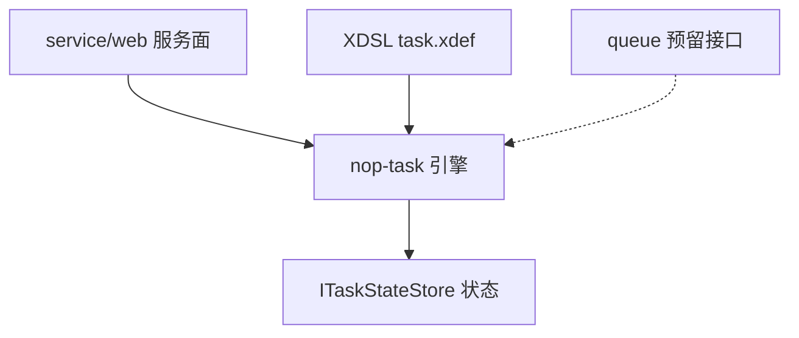

# nop-task 总览：DSL 任务流编排引擎

nop-task 是 Nop 平台的 DSL 驱动任务流编排引擎：任务流用 XML（task.xdef 约束）定义，引擎负责解析为模型、按顺序或图结构驱动步骤执行，并支持把执行状态持久化后从断点恢复。本页是恒含总览，给定位、能力边界与关键数字；机制细节下沉到互链子页。

> 本页源文件基准（相对于 `deepwiki/nop-task/`，逐条验证存在）：
>
> - [../nop-task/pom.xml](../../nop-task/pom.xml)
> - [../nop-kernel/nop-xdefs/src/main/resources/_vfs/nop/schema/task/task.xdef](../../nop-kernel/nop-xdefs/src/main/resources/_vfs/nop/schema/task/task.xdef)
> - [../nop-task/nop-task-core/src/main/java/io/nop/task/ITaskFlowManager.java](../../nop-task/nop-task-core/src/main/java/io/nop/task/ITaskFlowManager.java)
> - [../nop-task/nop-task-core/src/main/java/io/nop/task/impl/TaskFlowManagerImpl.java](../../nop-task/nop-task-core/src/main/java/io/nop/task/impl/TaskFlowManagerImpl.java)
> - [../nop-task/nop-task-core/src/main/java/io/nop/task/ITaskStep.java](../../nop-task/nop-task-core/src/main/java/io/nop/task/ITaskStep.java)
> - [../nop-task/nop-task-core/src/main/java/io/nop/task/TaskStepReturn.java](../../nop-task/nop-task-core/src/main/java/io/nop/task/TaskStepReturn.java)
> - [../nop-task/nop-task-core/src/main/java/io/nop/task/TaskErrors.java](../../nop-task/nop-task-core/src/main/java/io/nop/task/TaskErrors.java)

## 定位与形态：引擎实现，不是业务应用

形态判定为 framework-repo：仓库内容是引擎机制本身（模型解析、步骤生命周期、图调度、状态机），不含任务流业务用法。task.xdef 头注释自述定位——"支持异步执行的轻量化任务引擎。持久化状态为可选特性，如果在步骤上配置了saveState，则可以从任意步骤中断并恢复执行"（`nop-kernel/nop-xdefs/src/main/resources/_vfs/nop/schema/task/task.xdef:4`）。任务级开关在根节点：`graphMode`（图/顺序两种执行形态）、`restartable`、`defaultSaveState`、`recordMetrics`（task.xdef:9-11）。

两个核心抽象撑起全部机制。入口门面 `ITaskFlowManager`：`newTaskRuntime`（新建执行）/`getTaskRuntime`（按 taskInstanceId 恢复）、`getTask`/`parseTask`/`loadTaskFromPath` 三种加载路径、`getTaskStepLib` 步骤库（`nop-task/nop-task-core/src/main/java/io/nop/task/ITaskFlowManager.java:16-41`）。步骤契约 `ITaskStep`：接口注释定位为"一种函数定义，支持多输入和多输出"，唯一执行方法 `execute` 返回 `TaskStepReturn`，同步/异步由返回值统一表达，步骤内部状态存入 stepState 以支持断点重启（`nop-task/nop-task-core/src/main/java/io/nop/task/ITaskStep.java:19-26,42-50`）；`TaskStepReturn` 用 `nextStepName` 哨兵表达四种出口——CONTINUE、`@end`、`@exit`、`@suspend`（`nop-task/nop-task-core/src/main/java/io/nop/task/TaskStepReturn.java:36-46,215-228`）。

实现类 `TaskFlowManagerImpl` 持有两个状态存储：可空 `taskStateStore`（持久化）与缺省 `DefaultTaskStateStore.INSTANCE`（内存降级），按 `saveState` 标志分流；要求持久化而未注入时抛 `ERR_TASK_NO_PERSIST_STATE_STORE`，按不存在实例恢复时抛 `ERR_TASK_UNKNOWN_TASK_INSTANCE`（`nop-task/nop-task-core/src/main/java/io/nop/task/impl/TaskFlowManagerImpl.java:55-57,97-134`）。nop-task 在平台中的位置如下。

> Sources: [nop-kernel/nop-xdefs/src/main/resources/_vfs/nop/schema/task/task.xdef:3-13](https://gitee.com/canonical-entropy/nop-entropy/blob/0e67dba845/nop-kernel/nop-xdefs/src/main/resources/_vfs/nop/schema/task/task.xdef#L3-L13)、[nop-task/nop-task-core/src/main/java/io/nop/task/ITaskFlowManager.java:16-41](https://gitee.com/canonical-entropy/nop-entropy/blob/0e67dba845/nop-task/nop-task-core/src/main/java/io/nop/task/ITaskFlowManager.java#L16-L41)、[nop-task/nop-task-core/src/main/java/io/nop/task/ITaskStep.java:19-50](https://gitee.com/canonical-entropy/nop-entropy/blob/0e67dba845/nop-task/nop-task-core/src/main/java/io/nop/task/ITaskStep.java#L19-L50)、[nop-task/nop-task-core/src/main/java/io/nop/task/TaskStepReturn.java:36-228](https://gitee.com/canonical-entropy/nop-entropy/blob/0e67dba845/nop-task/nop-task-core/src/main/java/io/nop/task/TaskStepReturn.java#L36-L228)、[nop-task/nop-task-core/src/main/java/io/nop/task/impl/TaskFlowManagerImpl.java:55-134](https://gitee.com/canonical-entropy/nop-entropy/blob/0e67dba845/nop-task/nop-task-core/src/main/java/io/nop/task/impl/TaskFlowManagerImpl.java#L55-L134)、[nop-task/pom.xml:19-30](https://gitee.com/canonical-entropy/nop-entropy/blob/0e67dba845/nop-task/pom.xml#L19-L30)

## 能力边界：支持什么、不提供什么、什么在修

| 维度 | 支持 | 不提供/未落地 |
|---|---|---|
| 步骤类型 | 24 种可执行类型（sequential/selector/graph/parallel/fork/loop/if/suspend/xpl/script/invoke/call-task 等）加 5 个结构节点（case/otherwise/then/else/task），共 29 个 `STEP_TYPE_*` 常量（`nop-task/nop-task-core/src/main/java/io/nop/task/TaskConstants.java:123-181`） | 未知类型抛 `ERR_TASK_UNSUPPORTED_STEP_TYPE`（`nop-task/nop-task-core/src/main/java/io/nop/task/TaskErrors.java:119-121`） |
| 状态存储 | 三档：内存 `DefaultTaskStateStore`（缺省降级）、`DaoTaskStateStore` 落库（需应用侧向 `nopTaskFlowManager` 注入 `taskStateStore`，主树默认不注册）、自定义 `ITaskStateStore` 实现（TaskFlowManagerImpl.java:55-57；详见[服务面与持久化对接](modules/task-service-dao.md)） | 开箱即用的落库装配 |
| 恢复方式 | 步骤级断点：`bodyStepIndex` 加 `persistVars` 逐步落盘；resume 按 `taskInstanceId` 重建 runtime 并跳过已完成步骤；已终态任务 resume 按历史状态合成 `ERR_TASK_ALREADY_FAILED/KILLED/TIMEOUT` 重抛（TaskFlowManagerImpl.java:120-134；详见[状态持久化与恢复](flows/state-and-recovery.md)） | 未开 saveState 的任务中断即丢状态 |
| 横切控制 | retry/timeout/throttle/rateLimit/executor/validator 按固定顺序装饰步骤（详见[核心引擎与步骤抽象](modules/task-core.md)） | — |

修复中特性（并行 plan 364，页面断言以生成时工作区为准）：GraphTaskStep/TaskConstants 正确性修复；全局限流器/信号量注册表由 Caffeine 有界缓存改为强引用 `ConcurrentHashMap`，避免驱逐在用实例分裂 permit 池，容量配置转为告警阈值（`nop-task/nop-task-core/src/main/java/io/nop/task/impl/TaskFlowManagerImpl.java:59-66`）。

> Sources: [nop-task/nop-task-core/src/main/java/io/nop/task/TaskConstants.java:123-181](https://gitee.com/canonical-entropy/nop-entropy/blob/0e67dba845/nop-task/nop-task-core/src/main/java/io/nop/task/TaskConstants.java#L123-L181)、[nop-task/nop-task-core/src/main/java/io/nop/task/TaskErrors.java:119-121](https://gitee.com/canonical-entropy/nop-entropy/blob/0e67dba845/nop-task/nop-task-core/src/main/java/io/nop/task/TaskErrors.java#L119-L121)、[nop-task/nop-task-core/src/main/java/io/nop/task/impl/TaskFlowManagerImpl.java:59-66](https://gitee.com/canonical-entropy/nop-entropy/blob/0e67dba845/nop-task/nop-task-core/src/main/java/io/nop/task/impl/TaskFlowManagerImpl.java#L59-L66)

## 平台角色与关键数字

平台角色有三条边界。其一，服务面只管数据不管执行：4 个 BizModel 继承 `CrudBizModel` 暴露实体 CRUD，唯一自定义行为是 `copyForNew` 直接抛 `ERR_TASK_CRUD_WRITE_DISABLED`（引擎独占数据禁写），对任务启动/恢复/取消没有任何方法（详见[服务面与持久化对接](modules/task-service-dao.md)）。其二，任务级 GraphQL 操作不经 service 层，由引擎侧 xlib 注入 `nopTaskFlowManager` 生成（机制见[任务执行管线](flows/task-execution.md)）。其三，nop-task-queue 仅一个空接口 `ITaskQueue.enqueueTask()`，无实现类，引擎实际使用 core 模块的 `DefaultTaskExecutionQueue`（`nop-task/nop-task-queue/src/main/java/io/nop/task/queue/ITaskQueue.java:3-5`）。

| 关键数字 | 值 | 依据 |
|---|---|---|
| 子模块 | 10 个：core/dao/web/queue/codegen/api/meta/service/app/ext | `nop-task/pom.xml:19-30` |
| 源文件规模 | 254 个（core 175/dao 16/api 12/ext 9/service 7/queue 1） | `deepwiki/nop-task/PLAN.md:7`（core 175 经工作区 find 复核一致） |
| fan-in 前三 | TaskConstants 51 / TaskStepReturn 49 / ITaskStepRuntime 48（文件级口径） | `deepwiki/nop-task/PLAN.md:13,23`（plan 364 修复中随工作区小幅漂移） |
| 错误码 | TaskErrors 定义 33 条，28 条在用、5 条预留 | `nop-task/nop-task-core/src/main/java/io/nop/task/TaskErrors.java:17-185`；逐码核查表见[错误模型](topics/error-model.md) |

错误模型不设私有异常层级：TaskErrors 以接口常量声明全部错误码，异常统一由平台 `NopException` 承载，唯一子类 `NopTaskCancelledException` 用于区分取消与超时（详见[错误模型](topics/error-model.md)）。

> Sources: [nop-task/pom.xml:13-30](https://gitee.com/canonical-entropy/nop-entropy/blob/0e67dba845/nop-task/pom.xml#L13-L30)、[nop-task/nop-task-core/src/main/java/io/nop/task/TaskErrors.java:17-185](https://gitee.com/canonical-entropy/nop-entropy/blob/0e67dba845/nop-task/nop-task-core/src/main/java/io/nop/task/TaskErrors.java#L17-L185)、[nop-task/nop-task-queue/src/main/java/io/nop/task/queue/ITaskQueue.java:3-5](https://gitee.com/canonical-entropy/nop-entropy/blob/0e67dba845/nop-task/nop-task-queue/src/main/java/io/nop/task/queue/ITaskQueue.java#L3-L5)

## 阅读路径

- 快速跑通最小任务：[快速上手](quickstart.md)；概念划界：[术语表](glossary.md)。
- 机制主线：[架构与数据流](architecture.md) → [任务执行管线](flows/task-execution.md) → [状态持久化与恢复](flows/state-and-recovery.md)。
- 模块与主题深读：[核心引擎与步骤抽象](modules/task-core.md)、[服务面与持久化对接](modules/task-service-dao.md)、[错误模型](topics/error-model.md)。
- 按读者类型的完整导航见[阅读指南](reading-guide.md)。

> Sources: [deepwiki/nop-task/reading-guide.md](reading-guide.md)、[deepwiki/nop-task/quickstart.md](quickstart.md)、[deepwiki/nop-task/glossary.md](glossary.md)、[deepwiki/nop-task/architecture.md](architecture.md)

## Sources

- [nop-task/pom.xml:13-30](https://gitee.com/canonical-entropy/nop-entropy/blob/0e67dba845/nop-task/pom.xml#L13-L30)
- [nop-kernel/nop-xdefs/src/main/resources/_vfs/nop/schema/task/task.xdef:3-13](https://gitee.com/canonical-entropy/nop-entropy/blob/0e67dba845/nop-kernel/nop-xdefs/src/main/resources/_vfs/nop/schema/task/task.xdef#L3-L13)
- [nop-task/nop-task-core/src/main/java/io/nop/task/ITaskFlowManager.java:16-41](https://gitee.com/canonical-entropy/nop-entropy/blob/0e67dba845/nop-task/nop-task-core/src/main/java/io/nop/task/ITaskFlowManager.java#L16-L41)
- [nop-task/nop-task-core/src/main/java/io/nop/task/ITaskStep.java:19-50](https://gitee.com/canonical-entropy/nop-entropy/blob/0e67dba845/nop-task/nop-task-core/src/main/java/io/nop/task/ITaskStep.java#L19-L50)
- [nop-task/nop-task-core/src/main/java/io/nop/task/TaskStepReturn.java:36-228](https://gitee.com/canonical-entropy/nop-entropy/blob/0e67dba845/nop-task/nop-task-core/src/main/java/io/nop/task/TaskStepReturn.java#L36-L228)
- [nop-task/nop-task-core/src/main/java/io/nop/task/TaskErrors.java:17-185](https://gitee.com/canonical-entropy/nop-entropy/blob/0e67dba845/nop-task/nop-task-core/src/main/java/io/nop/task/TaskErrors.java#L17-L185)
- [nop-task/nop-task-core/src/main/java/io/nop/task/TaskConstants.java:123-181](https://gitee.com/canonical-entropy/nop-entropy/blob/0e67dba845/nop-task/nop-task-core/src/main/java/io/nop/task/TaskConstants.java#L123-L181)
- [nop-task/nop-task-core/src/main/java/io/nop/task/impl/TaskFlowManagerImpl.java:55-134](https://gitee.com/canonical-entropy/nop-entropy/blob/0e67dba845/nop-task/nop-task-core/src/main/java/io/nop/task/impl/TaskFlowManagerImpl.java#L55-L134)
- [nop-task/nop-task-queue/src/main/java/io/nop/task/queue/ITaskQueue.java:3-5](https://gitee.com/canonical-entropy/nop-entropy/blob/0e67dba845/nop-task/nop-task-queue/src/main/java/io/nop/task/queue/ITaskQueue.java#L3-L5)
- [deepwiki/nop-task/PLAN.md:7-23](PLAN.md)

---

## On this page

- 定位与形态：引擎实现，不是业务应用
- 能力边界：支持什么、不提供什么、什么在修
- 平台角色与关键数字
- 阅读路径
