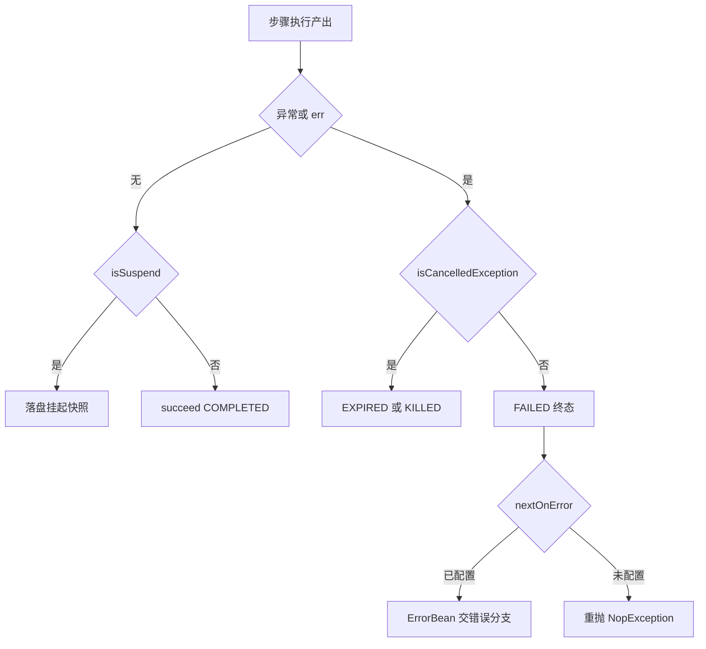

# 错误模型：TaskErrors 体系与步骤失败语义

> 本页源文件基准（相对于 `deepwiki/nop-task/topics/`，逐条验证可解析）：
>
> - [../../../nop-task/nop-task-core/src/main/java/io/nop/task/TaskErrors.java](../../../nop-task/nop-task-core/src/main/java/io/nop/task/TaskErrors.java)
> - [../../../nop-task/nop-task-core/src/main/java/io/nop/task/TaskStepReturn.java](../../../nop-task/nop-task-core/src/main/java/io/nop/task/TaskStepReturn.java)
> - [../../../nop-task/nop-task-core/src/main/java/io/nop/task/step/TaskStepExecution.java](../../../nop-task/nop-task-core/src/main/java/io/nop/task/step/TaskStepExecution.java)
> - [../../../nop-task/nop-task-core/src/main/java/io/nop/task/utils/TaskStepHelper.java](../../../nop-task/nop-task-core/src/main/java/io/nop/task/utils/TaskStepHelper.java)
> - [../../../nop-task/nop-task-core/src/main/java/io/nop/task/exceptions/NopTaskCancelledException.java](../../../nop-task/nop-task-core/src/main/java/io/nop/task/exceptions/NopTaskCancelledException.java)
> - [../../../nop-kernel/nop-api-core/src/main/java/io/nop/api/core/exceptions/NopException.java](../../../nop-kernel/nop-api-core/src/main/java/io/nop/api/core/exceptions/NopException.java)
> - [../../../nop-kernel/nop-core/src/main/java/io/nop/core/exceptions/ErrorMessageManager.java](../../../nop-kernel/nop-core/src/main/java/io/nop/core/exceptions/ErrorMessageManager.java)
> - [../../../nop-task/nop-task-service/src/main/java/io/nop/task/service/entity/NopTaskInstanceBizModel.java](../../../nop-task/nop-task-service/src/main/java/io/nop/task/service/entity/NopTaskInstanceBizModel.java)

nop-task 不设私有异常层级：TaskErrors 以接口常量声明全部错误码，异常统一用平台 `NopException` 承载。失败、挂起、取消三种步骤出口分别由哨兵返回值、`isSuspend()` 值判断与 `isCancelledException()` 判定函数区分，`driveStepFailure` 把失败与取消收敛到状态机终态，消费方经 `ErrorBean`（nextOnError 分支）或重抛异常拿到错误。引擎机制背景见[核心引擎](../modules/task-core.md)与[任务执行管线](../flows/task-execution.md)。

## TaskErrors：33 条错误码的全表核查

`TaskErrors` 是标注 `@Locale("zh-CN")` 的接口，每条码用 `ErrorCode.define(code, message, argNames...)` 声明，消息模板用 `{argName}` 占位（`nop-task/nop-task-core/src/main/java/io/nop/task/TaskErrors.java:13-18`；`nop-kernel/nop-api-core/src/main/java/io/nop/api/core/exceptions/ErrorCode.java:27-31`）。逐码全仓 grep 核查（排除定义文件与测试）结果如下，33 条中 28 条有生产抛出点，5 条预留未用：

| 错误码 | 含义 | 生产抛出点 | 状态 |
|---|---|---|---|
| `ERR_TASK_STEP_CONFIG_INVALID` | 步骤配置属性非法 | `TaskStepEnhancer.java:242-247`（retry/timeout 等数值校验） | 在用 |
| `ERR_TASK_UNKNOWN_NEXT_STEP` | 跳转目标不存在 | 静态：`TaskFlowAnalyzer.java:49,58`（next/nextOnError 指向不存在步骤）；运行期：`SequentialTaskStep.java:105-106` | 在用 |
| `ERR_TASK_UNKNOWN_WAIT_STEP` | 等待的步骤未定义 | `TaskFlowAnalyzer.java:68,79`（waitSteps/waitErrorSteps 校验） | 在用 |
| `ERR_TASK_UNSUPPORTED_STEP_TYPE` | 步骤类型无实现 | `TaskStepBuilder.java:171` | 在用 |
| `ERR_TASK_GRAPH_STEP_NO_ENTER_STEPS` | 流程图缺起始步骤 | `GraphStepAnalyzer.java:60` | 在用 |
| `ERR_TASK_GRAPH_STEP_NO_EXIT_STEPS` | 流程图缺终止步骤 | `GraphStepAnalyzer.java:65` | 在用 |
| `ERR_TASK_UNKNOWN_STEP_IN_GRAPH` | 图内引用未定义步骤 | `GraphStepAnalyzer.java:72,81,142,152` | 在用 |
| `ERR_TASK_GRAPH_STEP_CONTAINS_LOOP` | 流程图含环 | `GraphStepAnalyzer.java:40` | 在用 |
| `ERR_TASK_DUPLICATE_STEP_IN_GRAPH` | 图内步骤重名 | `GraphStepAnalyzer.java:53` | 在用 |
| `ERR_TASK_INVALID_CUSTOM_TYPE` | customType 缺名字空间 | `TransformCustomStepHelper.java:29,92` | 在用 |
| `ERR_TASK_UNRESOLVED_METHOD_OWNER` | 方法引用类未定义 | `TaskFlowBuilder.java:58` | 在用 |
| `ERR_TASK_STATIC_METHOD_NOT_FOUND` | 静态方法不存在 | `TaskFlowBuilder.java:65` | 在用 |
| `ERR_TASK_STEP_RESULT_IS_ASYNC` | 同步访问未完成异步结果 | `TaskStepReturn.java:186-190`（`get()`） | 在用 |
| `ERR_TASK_LOOP_STEP_INVALID_LOOP_VAR` | 循环变量设置非法 | `LoopNTaskStep.java:164` | 在用 |
| `ERR_TASK_UNKNOWN_STEP_IN_LIB` | 任务库中无此步骤 | `CallStepTaskStep.java:74` | 在用 |
| `ERR_TASK_MANDATORY_INPUT_NOT_ALLOW_EMPTY` | 必填输入为空 | `TaskStepExecution.java:499-502`（步骤级）；`TaskImpl.java:313-317`（任务级） | 在用 |
| `ERR_TASK_GRAPH_NO_ACTIVE_STEP` | 图无活跃步骤但未结束 | `GraphTaskStep.java:423-425`（死端兜底） | 在用 |
| `ERR_TASK_RETRY_TIMES_EXCEED_LIMIT` | 重试次数超限 | `TaskStepHelper.java:256-259`（无历史异常时合成） | 在用 |
| `ERR_TASK_REQUEST_RATE_EXCEED_LIMIT` | 访问速率超限 | `RateLimitTaskStepWrapper.java:40` | 在用 |
| `ERR_TASK_THROTTLE_TIMEOUT` | 限流等待超时 | `ThrottleTaskStepWrapper.java:40` | 在用 |
| `ERR_TASK_CANCELLED` | 任务已取消 | `NopTaskCancelledException.java:30-38`（构造）；`TaskRuntimeImpl.java:99-103`（挂起任务被 kill）；被 `TaskStepHelper.java:160` 按码识别 | 在用 |
| `ERR_TASK_STEP_ALREADY_FAILED` | 步骤历史已终态失败 | `TaskStepExecution.java:255-257`（resume 重抛合成）；`GraphTaskStep.java:414-418`（error-handoff 兜底标记） | 在用 |
| `ERR_TASK_ALREADY_FAILED` | 任务历史已终态失败 | `TaskImpl.java:290`（resume 合成） | 在用 |
| `ERR_TASK_ALREADY_KILLED` | 任务历史已中止 | `TaskImpl.java:286` | 在用 |
| `ERR_TASK_ALREADY_TIMEOUT` | 任务历史已超时 | `TaskImpl.java:288` | 在用 |
| `ERR_TASK_NO_PERSIST_STATE_STORE` | 未配置状态存储 | `TaskFlowManagerImpl.java:116` | 在用 |
| `ERR_TASK_UNKNOWN_TASK_INSTANCE` | 任务实例不存在 | `TaskFlowManagerImpl.java:126-127` | 在用 |
| `ERR_TASK_CRUD_WRITE_DISABLED` | 引擎独占实体禁写 | `NopTaskInstanceBizModel.java:38-42` 等 4 个 BizModel | 在用 |
| `ERR_TASK_STEP_NOT_RESTARTABLE` | 步骤不允许多次执行 | — | 预留未用 |
| `ERR_TASK_NULL_ASYNC_PROMISE` | asyncPromise 为 null | — | 预留未用 |
| `ERR_TASK_ASYNC_RETURN_NEXT_STEP_SHOULD_NOT_BE_ASYNC` | 异步返回嵌套 ASYNC | —（等价校验以 `Guard.checkArgument` 形式内联于 `TaskStepReturn.java:77,131`） | 预留未用 |
| `ERR_TASK_STEP_TIMEOUT` | 步骤超时 | —（超时实际走 `CANCEL_REASON_TIMEOUT` 取消链，见下节） | 预留未用 |
| `ERR_TASK_STEP_MANDATORY_OUTPUT_IS_EMPTY` | 必填输出为空 | — | 预留未用 |

命名约定横切两个事实。其一，抛出点普遍经 `TaskStepHelper.newError` 工厂统一附加 `taskName`/`stepPath`/`runId`/`stepType` 四个诊断参数（`nop-task/nop-task-core/src/main/java/io/nop/task/utils/TaskStepHelper.java:54-69`）。其二，错误码族按模块延伸。nop-task-ext 有独立的 `TaskExtErrors`：`ERR_TASK_DECORATOR_INVALID_CONFIG` 定义于 `nop-task/nop-task-ext/src/main/java/io/nop/task/ext/TaskExtErrors.java:20-22`，不与核心族混用。

> Sources: [nop-task/nop-task-core/src/main/java/io/nop/task/TaskErrors.java:13-185](/nop-task/nop-task-core/src/main/java/io/nop/task/TaskErrors.java#L13-L185)、[nop-kernel/nop-api-core/src/main/java/io/nop/api/core/exceptions/ErrorCode.java:27-43](/nop-kernel/nop-api-core/src/main/java/io/nop/api/core/exceptions/ErrorCode.java#L27-L43)、[nop-task/nop-task-core/src/main/java/io/nop/task/utils/TaskStepHelper.java:54-69](/nop-task/nop-task-core/src/main/java/io/nop/task/utils/TaskStepHelper.java#L54-L69)、[nop-task/nop-task-ext/src/main/java/io/nop/task/ext/TaskExtErrors.java:20-22](/nop-task/nop-task-ext/src/main/java/io/nop/task/ext/TaskExtErrors.java#L18)

## TaskStepReturn 的哨兵语义：@end / @exit / @suspend / ASYNC

步骤产出是一个 `TaskStepReturn` 值对象：`nextStepName` 字段兼作控制哨兵，`outputs` 承载数据，`future` 表达异步（`nop-task/nop-task-core/src/main/java/io/nop/task/TaskStepReturn.java:82-84`）。哨兵取值来自 `TaskConstants` 的保留步骤名 `@end`/`@exit`/`@suspend`（`nop-task/nop-task-core/src/main/java/io/nop/task/TaskConstants.java:37-48`）：`RETURN_RESULT_END` 结束整个任务并把返回值定为任务结果（`TaskStepReturn.java:39-42`），`EXIT` 只跳出同级序列（`TaskStepReturn.java:44-46`），`SUSPEND` 单例表示挂起（`TaskStepReturn.java:37`）。错误不是第五种哨兵——异常直接沿调用栈传播，`TaskStepReturn` 不携带 Throwable 字段。

三个对失败语义有直接影响的守卫都写在这个类里。第一，`isSuspend()`/`isEnd()`/`isExit()` 按 `nextStepName` 的值而非对象身份判断，包装层（输出构建、retry）经 `RETURN(nextStepName, outputs)` 重建返回值时不丢失哨兵语义，否则挂起步骤会被驱动为 COMPLETED 或误抛 `ERR_TASK_UNKNOWN_NEXT_STEP`（`TaskStepReturn.java:215-228`）。第二，对未完成的异步结果调用 `get()` 抛 `ERR_TASK_STEP_RESULT_IS_ASYNC`，强制消费方走 `sync()`/`thenCompose`（`TaskStepReturn.java:186-190`）。第三，`ASYNC` 工厂与 `hookFuture` 用 `thenCompose` 展开嵌套 future，并以 `Guard.checkArgument(!ret.isAsync())` 禁止异步返回再带 ASYNC 标记，保证最终必然解包为同步结果（`TaskStepReturn.java:71-80,92-102`）——这正是上表中两条预留码的语义以断言形式内联存活的证据。

> Sources: [nop-task/nop-task-core/src/main/java/io/nop/task/TaskStepReturn.java:36-102](/nop-task/nop-task-core/src/main/java/io/nop/task/TaskStepReturn.java#L36-L102)、[nop-task/nop-task-core/src/main/java/io/nop/task/TaskStepReturn.java:186-228](/nop-task/nop-task-core/src/main/java/io/nop/task/TaskStepReturn.java#L186-L228)、[nop-task/nop-task-core/src/main/java/io/nop/task/TaskConstants.java:37-48](/nop-task/nop-task-core/src/main/java/io/nop/task/TaskConstants.java#L37-L48)

## 步骤失败驱动：driveStepFailure 与三语义分流

`TaskStepExecution.executeWithParentRt` 是失败语义的汇聚点，同步出口（catch 块）与异步出口（`thenCompose` 的 err 回调）统一调用同一个私有方法 `driveStepFailure`（`nop-task/nop-task-core/src/main/java/io/nop/task/step/TaskStepExecution.java:316-327,360-370`）。统一本身是一次修复：此前两份约 35 行的实现已发生语义漂移，异步出口的 `addXplStack` 位于 nextOnError 分支之后而永不可达（`TaskStepExecution.java:373-379` 注释）。

`driveStepFailure` 内部分两条路（`TaskStepExecution.java:380-407`）。取消路径：`isCancelledException` 命中时先经 `resolveStepCancelReason` 解析原因，`fail()` 落异常后按原因把步骤状态置为 `EXPIRED(50)`（timeout）或 `KILLED(70)`（kill 等），保存终态并以 `encodeCancelReason` 重抛携带原因的异常。普通失败路径：先 `addXplStack` 附加 XPL 调用栈，再 `fail()` + `FAILED(60)` + 捕获持久变量 + 保存终态；配置了 `nextOnError` 则返回 `buildErrorResult` 的 error-handoff 结果，否则 `NopException.adapt` 重抛。挂起路径不进此方法：`stepResult.isSuspend()` 在进入 `thenCompose` 前被拦截，结束指标、捕获持久变量、`saveState` 后原样返回，不置任何终态（`TaskStepExecution.java:300-314`）；retry 包装层同样不把 SUSPEND 记为成功，避免 resume 时挂起子流程被 continuation-skip 永久跳过（`TaskStepHelper.java:297-300`）。

| 维度 | 失败（FAILED） | 挂起（SUSPENDED） | 取消（EXPIRED/KILLED） |
|---|---|---|---|
| 触发源 | 步骤体抛异常 / 异步 err 回调 | 步骤返回 `@suspend` 哨兵 | cancel token 触发、`checkNotCancelled`、timeout 兜底 promise |
| 判定方式 | `driveStepFailure` 非 cancel 分支 | `isSuspend()` 值判断（`TaskStepReturn.java:219`） | `TaskStepHelper.isCancelledException` 遍历 cause 链（`TaskStepHelper.java:82-101`） |
| 状态落点 | 步骤 FAILED=60（`_NopTaskCoreConstants.java:44`） | 步骤 SUSPENDED=10，无终态落盘 | 步骤 EXPIRED=50 / KILLED=70（`TaskStepExecution.java:387-389`） |
| 对调用方表现 | nextOnError→ErrorBean，否则重抛 | SUSPEND 沿链透传给上层 | 重抛 `NopTaskCancelledException`（码为 ERR_TASK_CANCELLED） |
| resume 行为 | continuation-skip 重抛历史异常或 `ERR_TASK_STEP_ALREADY_FAILED` | 从挂起快照续跑 | 任务级合成 `ERR_TASK_ALREADY_KILLED/TIMEOUT` |

> Sources: [nop-task/nop-task-core/src/main/java/io/nop/task/step/TaskStepExecution.java:300-407](/nop-task/nop-task-core/src/main/java/io/nop/task/step/TaskStepExecution.java#L300-L407)、[nop-task/nop-task-core/src/main/java/io/nop/task/step/TaskStepExecution.java:486-491](/nop-task/nop-task-core/src/main/java/io/nop/task/step/TaskStepExecution.java#L486-L491)、[nop-task/nop-task-core/src/main/java/io/nop/task/utils/TaskStepHelper.java:82-101](/nop-task/nop-task-core/src/main/java/io/nop/task/utils/TaskStepHelper.java#L82-L101)、[nop-task/nop-task-core/src/main/java/io/nop/task/core/_NopTaskCoreConstants.java:39-49](/nop-task/nop-task-core/src/main/java/io/nop/task/core/_NopTaskCoreConstants.java#L39-L49)

## 取消与超时：reason 编码链与任务级终态合成

取消与超时共享一条链路，区别只在 reason 字符串。超时包装经 `TaskStepHelper.timeout` 装配独立 cancellable，定时器以 `CANCEL_REASON_TIMEOUT` 取消并让超时兜底 promise 异常完成，与业务返回值竞速，保证返回值在有限时间内终结（`nop-task/nop-task-core/src/main/java/io/nop/task/utils/TaskStepHelper.java:184-244`）；注意超时并不抛 `ERR_TASK_STEP_TIMEOUT`，而是产生 reason 为 timeout 的 `NopTaskCancelledException`。步骤入口的 `checkNotCancelled` 在发现已取消时抛出携带 token reason 的同型异常（`TaskStepHelper.java:71-80`）。

reason 之所以要"编码进异常"，是因为 task seam 处的 `taskRt.getCancelReason()` 与 step token 均不可靠——step 超时时任务并未被 cancel，step token 又可能被 `withCancellable` 复位；唯一可靠信号是 step driver 传播出的异常自身（`NopTaskCancelledException.java:11-17` 注释；`TaskStepHelper.java:123-152`）。`NopTaskCancelledException` 继承 `NopException`、码固定为 `ERR_TASK_CANCELLED`，携带 `cancelReason` 字段（`NopTaskCancelledException.java:19-38`）；识别函数遍历 cause 链做三档匹配：`CancellationException`、`NopTaskCancelledException`/`NopTaskFailException`、以及码等于 `ERR_TASK_CANCELLED` 的 `NopException`（`TaskStepHelper.java:154-162`）。

任务层消费同一信号。resume 一个已终态任务时，`TaskImpl.synthesizeResumeException` 按历史状态合成异常：KILLED→`ERR_TASK_ALREADY_KILLED`、TIMEOUT→`ERR_TASK_ALREADY_TIMEOUT`、其余终态→`ERR_TASK_ALREADY_FAILED`（`nop-task/nop-task-core/src/main/java/io/nop/task/impl/TaskImpl.java:279-296`），三类码的细分即"非静默"裁定，避免恢复一律报 ALREADY_FAILED。运维侧 kill 一个 SUSPENDED（无驱动在飞）任务时，`TaskRuntimeImpl.cancel` 直接以 `ERR_TASK_CANCELLED` 写入异常并驱动 KILLED 终态落盘，不再等待 resume（`nop-task/nop-task-core/src/main/java/io/nop/task/impl/TaskRuntimeImpl.java:93-104`）。

> Sources: [nop-task/nop-task-core/src/main/java/io/nop/task/utils/TaskStepHelper.java:71-162](/nop-task/nop-task-core/src/main/java/io/nop/task/utils/TaskStepHelper.java#L71-L162)、[nop-task/nop-task-core/src/main/java/io/nop/task/utils/TaskStepHelper.java:184-244](/nop-task/nop-task-core/src/main/java/io/nop/task/utils/TaskStepHelper.java#L184-L244)、[nop-task/nop-task-core/src/main/java/io/nop/task/exceptions/NopTaskCancelledException.java:19-38](/nop-task/nop-task-core/src/main/java/io/nop/task/exceptions/NopTaskCancelledException.java#L19-L38)、[nop-task/nop-task-core/src/main/java/io/nop/task/impl/TaskImpl.java:279-296](/nop-task/nop-task-core/src/main/java/io/nop/task/impl/TaskImpl.java#L279-L296)、[nop-task/nop-task-core/src/main/java/io/nop/task/impl/TaskRuntimeImpl.java:93-104](/nop-task/nop-task-core/src/main/java/io/nop/task/impl/TaskRuntimeImpl.java#L93-L104)

## 与平台 NopException 体系的关系

TaskErrors 完全寄生在平台两层异常设施上。声明层：`ErrorCode.define` 生成含 code/message/argNames/status 的码对象（`nop-kernel/nop-api-core/src/main/java/io/nop/api/core/exceptions/ErrorCode.java:27-43`）。承载层：`NopException(errorCode)` 构造器从码对象取默认描述与 HTTP status，`param()` 填充消息模板参数，`addXplStack()` 叠加 XPL 调用栈（`nop-kernel/nop-api-core/src/main/java/io/nop/api/core/exceptions/NopException.java:90-100,412,451`）。nop-task 侧没有定义新的异常基类——唯一的子类是上述 `NopTaskCancelledException`，动机是平台单例异常不允许携带不同 reason 的多实例。

翻译边界在 `ErrorMessageManager`：nextOnError 分支与图错误汇聚调用 `buildErrorMessage(locale, e, includeStack, onlyPublic)` 把 `NopException`（含错误码、参数、XPL 栈）转为可序列化的 `ErrorBean`（`nop-kernel/nop-core/src/main/java/io/nop/core/exceptions/ErrorMessageManager.java:291-295`；`nop-task/nop-task-core/src/main/java/io/nop/task/step/TaskStepExecution.java:486-491`）。另一处隐性耦合是事务语义：`NopException.shouldRollback` 决定 ORM 是否回滚，取消类异常默认参与该判定（`NopException.java:110-117`）。

> Sources: [nop-kernel/nop-api-core/src/main/java/io/nop/api/core/exceptions/NopException.java:90-117](/nop-kernel/nop-api-core/src/main/java/io/nop/api/core/exceptions/NopException.java#L90-L117)、[nop-kernel/nop-api-core/src/main/java/io/nop/api/core/exceptions/NopException.java:412-451](/nop-kernel/nop-api-core/src/main/java/io/nop/api/core/exceptions/NopException.java#L412-L451)、[nop-kernel/nop-core/src/main/java/io/nop/core/exceptions/ErrorMessageManager.java:291-295](/nop-kernel/nop-core/src/main/java/io/nop/core/exceptions/ErrorMessageManager.java#L291-L295)、[nop-task/nop-task-core/src/main/java/io/nop/task/exceptions/NopTaskCancelledException.java:19-38](/nop-task/nop-task-core/src/main/java/io/nop/task/exceptions/NopTaskCancelledException.java#L19-L38)

## 消费方如何拿到错误

四类消费面，错误形态各不相同。**错误分支消费**：配置 `nextOnError` 的步骤失败时，`buildErrorResult` 把 `ErrorBean` 绑定到 scope 变量 `error`（变量名可经 `errorName` 覆写，缺省 `ERROR`，`TaskConstants.java:60`）并跳转错误分支（`TaskStepExecution.java:486-491`）；图中下游经 `waitErrorSteps`/`waitCompleteSteps` 等待的节点从 `StepResultBean.error` 读到同一 `ErrorBean`（`nop-task/nop-task-core/src/main/java/io/nop/task/step/GraphTaskStep.java:405-420`；`nop-task/nop-task-core/src/main/java/io/nop/task/StepResultBean.java:29,89-93`）。

**BizModel/服务面**：引擎状态表对 CRUD 写关闭，`NopTaskInstance` 等 4 个 BizModel 的写操作抛 `ERR_TASK_CRUD_WRITE_DISABLED` 并附 `bizObjName`/`action` 参数（`nop-task/nop-task-service/src/main/java/io/nop/task/service/entity/NopTaskInstanceBizModel.java:31-42`），查询实例错误详情应读实体状态列而非捕获写异常。**恢复入口**：`getTaskRuntime` 对不存在的实例抛 `ERR_TASK_UNKNOWN_TASK_INSTANCE`，缺状态存储抛 `ERR_TASK_NO_PERSIST_STATE_STORE`（`TaskFlowManagerImpl.java:113-128`）；已终态任务的 resume 收到上节的 `ERR_TASK_ALREADY_*` 合成异常。**跨模块嵌入方**：nop-ai-agent 的 `TeamTaskGraphBuilder` 把 nop-task 的 `ERR_TASK_GRAPH_STEP_CONTAINS_LOOP` 包装进自己的 `NopAiAgentException` 再抛出（`nop-ai/nop-ai-agent/src/main/java/io/nop/ai/agent/team/flow/TeamTaskGraphBuilder.java:68-75`），说明错误码是嵌入方依赖面的一部分。挂起与状态的对接细节见[状态与恢复](../flows/state-and-recovery.md)。

> Sources: [nop-task/nop-task-core/src/main/java/io/nop/task/step/TaskStepExecution.java:486-491](/nop-task/nop-task-core/src/main/java/io/nop/task/step/TaskStepExecution.java#L486-L491)、[nop-task/nop-task-core/src/main/java/io/nop/task/StepResultBean.java:29-93](/nop-task/nop-task-core/src/main/java/io/nop/task/StepResultBean.java#L29-L93)、[nop-task/nop-task-service/src/main/java/io/nop/task/service/entity/NopTaskInstanceBizModel.java:31-42](/nop-task/nop-task-service/src/main/java/io/nop/task/service/entity/NopTaskInstanceBizModel.java#L31-L42)、[nop-task/nop-task-core/src/main/java/io/nop/task/impl/TaskFlowManagerImpl.java:113-128](/nop-task/nop-task-core/src/main/java/io/nop/task/impl/TaskFlowManagerImpl.java#L113-L128)、[nop-ai/nop-ai-agent/src/main/java/io/nop/ai/agent/team/flow/TeamTaskGraphBuilder.java:68-75](/nop-ai/nop-ai-agent/src/main/java/io/nop/ai/agent/team/flow/TeamTaskGraphBuilder.java#L68-L75)

## Sources

- [nop-task/nop-task-core/src/main/java/io/nop/task/TaskErrors.java:13-185](/nop-task/nop-task-core/src/main/java/io/nop/task/TaskErrors.java#L13-L185)
- [nop-task/nop-task-core/src/main/java/io/nop/task/TaskStepReturn.java:36-228](/nop-task/nop-task-core/src/main/java/io/nop/task/TaskStepReturn.java#L36-L228)
- [nop-task/nop-task-core/src/main/java/io/nop/task/TaskConstants.java:37-60](/nop-task/nop-task-core/src/main/java/io/nop/task/TaskConstants.java#L37-L60)
- [nop-task/nop-task-core/src/main/java/io/nop/task/step/TaskStepExecution.java:225-502](/nop-task/nop-task-core/src/main/java/io/nop/task/step/TaskStepExecution.java#L225-L502)
- [nop-task/nop-task-core/src/main/java/io/nop/task/utils/TaskStepHelper.java:54-330](/nop-task/nop-task-core/src/main/java/io/nop/task/utils/TaskStepHelper.java#L54-L330)
- [nop-task/nop-task-core/src/main/java/io/nop/task/exceptions/NopTaskCancelledException.java:19-38](/nop-task/nop-task-core/src/main/java/io/nop/task/exceptions/NopTaskCancelledException.java#L19-L38)
- [nop-task/nop-task-core/src/main/java/io/nop/task/impl/TaskImpl.java:279-317](/nop-task/nop-task-core/src/main/java/io/nop/task/impl/TaskImpl.java#L279-L317)
- [nop-task/nop-task-core/src/main/java/io/nop/task/impl/TaskRuntimeImpl.java:93-104](/nop-task/nop-task-core/src/main/java/io/nop/task/impl/TaskRuntimeImpl.java#L93-L104)
- [nop-task/nop-task-core/src/main/java/io/nop/task/impl/TaskFlowManagerImpl.java:113-128](/nop-task/nop-task-core/src/main/java/io/nop/task/impl/TaskFlowManagerImpl.java#L113-L128)
- [nop-task/nop-task-core/src/main/java/io/nop/task/builder/TaskFlowAnalyzer.java:45-85](/nop-task/nop-task-core/src/main/java/io/nop/task/builder/TaskFlowAnalyzer.java#L45-L85)
- [nop-task/nop-task-core/src/main/java/io/nop/task/builder/TaskStepEnhancer.java:242-247](/nop-task/nop-task-core/src/main/java/io/nop/task/builder/TaskStepEnhancer.java#L242-L247)
- [nop-task/nop-task-core/src/main/java/io/nop/task/builder/TaskStepBuilder.java:171](/nop-task/nop-task-core/src/main/java/io/nop/task/builder/TaskStepBuilder.java#L171)
- [nop-task/nop-task-core/src/main/java/io/nop/task/builder/GraphStepAnalyzer.java:40-152](/nop-task/nop-task-core/src/main/java/io/nop/task/builder/GraphStepAnalyzer.java#L40-L152)
- [nop-task/nop-task-core/src/main/java/io/nop/task/builder/TaskFlowBuilder.java:58-65](/nop-task/nop-task-core/src/main/java/io/nop/task/builder/TaskFlowBuilder.java#L58-L65)
- [nop-task/nop-task-core/src/main/java/io/nop/task/builder/TransformCustomStepHelper.java:29-92](/nop-task/nop-task-core/src/main/java/io/nop/task/builder/TransformCustomStepHelper.java#L29-L92)
- [nop-task/nop-task-core/src/main/java/io/nop/task/step/SequentialTaskStep.java:100-110](/nop-task/nop-task-core/src/main/java/io/nop/task/step/SequentialTaskStep.java#L100-L110)
- [nop-task/nop-task-core/src/main/java/io/nop/task/step/GraphTaskStep.java:405-425](/nop-task/nop-task-core/src/main/java/io/nop/task/step/GraphTaskStep.java#L405-L425)
- [nop-task/nop-task-core/src/main/java/io/nop/task/step/LoopNTaskStep.java:164](/nop-task/nop-task-core/src/main/java/io/nop/task/step/LoopNTaskStep.java#L164)
- [nop-task/nop-task-core/src/main/java/io/nop/task/step/CallStepTaskStep.java:74](/nop-task/nop-task-core/src/main/java/io/nop/task/step/CallStepTaskStep.java#L74)
- [nop-task/nop-task-core/src/main/java/io/nop/task/step/RateLimitTaskStepWrapper.java:40](/nop-task/nop-task-core/src/main/java/io/nop/task/step/RateLimitTaskStepWrapper.java#L40)
- [nop-task/nop-task-core/src/main/java/io/nop/task/step/ThrottleTaskStepWrapper.java:40](/nop-task/nop-task-core/src/main/java/io/nop/task/step/ThrottleTaskStepWrapper.java#L40)
- [nop-task/nop-task-core/src/main/java/io/nop/task/StepResultBean.java:29-93](/nop-task/nop-task-core/src/main/java/io/nop/task/StepResultBean.java#L29-L93)
- [nop-task/nop-task-core/src/main/java/io/nop/task/core/_NopTaskCoreConstants.java:39-89](/nop-task/nop-task-core/src/main/java/io/nop/task/core/_NopTaskCoreConstants.java#L39-L89)
- [nop-task/nop-task-ext/src/main/java/io/nop/task/ext/TaskExtErrors.java:20-22](/nop-task/nop-task-ext/src/main/java/io/nop/task/ext/TaskExtErrors.java#L18)
- [nop-task/nop-task-service/src/main/java/io/nop/task/service/entity/NopTaskInstanceBizModel.java:31-42](/nop-task/nop-task-service/src/main/java/io/nop/task/service/entity/NopTaskInstanceBizModel.java#L31-L42)
- [nop-kernel/nop-api-core/src/main/java/io/nop/api/core/exceptions/ErrorCode.java:27-43](/nop-kernel/nop-api-core/src/main/java/io/nop/api/core/exceptions/ErrorCode.java#L27-L43)
- [nop-kernel/nop-api-core/src/main/java/io/nop/api/core/exceptions/NopException.java:90-451](/nop-kernel/nop-api-core/src/main/java/io/nop/api/core/exceptions/NopException.java#L90-L451)
- [nop-kernel/nop-core/src/main/java/io/nop/core/exceptions/ErrorMessageManager.java:291-295](/nop-kernel/nop-core/src/main/java/io/nop/core/exceptions/ErrorMessageManager.java#L291-L295)
- [nop-ai/nop-ai-agent/src/main/java/io/nop/ai/agent/team/flow/TeamTaskGraphBuilder.java:68-75](/nop-ai/nop-ai-agent/src/main/java/io/nop/ai/agent/team/flow/TeamTaskGraphBuilder.java#L68-L75)

---

## On this page

- TaskErrors：33 条错误码的全表核查
- TaskStepReturn 的哨兵语义：@end / @exit / @suspend / ASYNC
- 步骤失败驱动：driveStepFailure 与三语义分流
- 取消与超时：reason 编码链与任务级终态合成
- 与平台 NopException 体系的关系
- 消费方如何拿到错误
