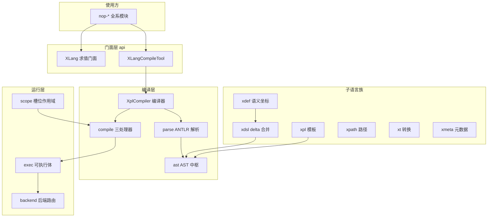
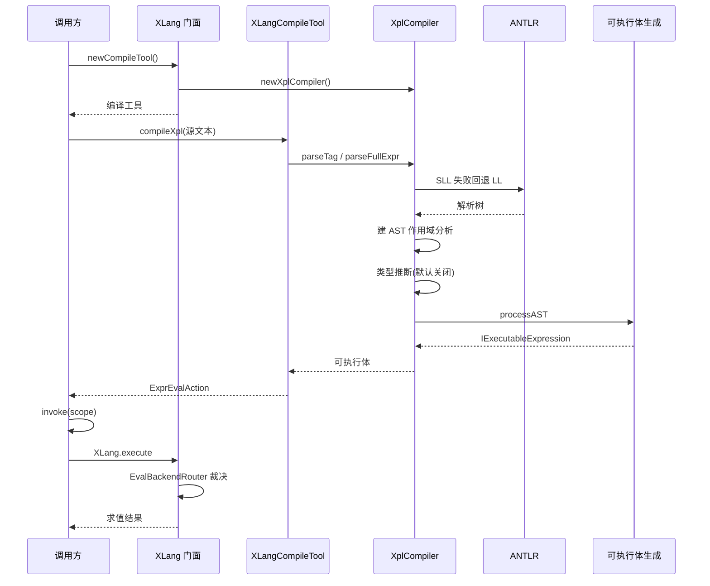

# 架构与数据流

> 本页源证据（基准为仓库根，相对本页 `deepwiki/nop-xlang/` 已逐条验证存在）：
>
> - [XLang.java](../../nop-kernel/nop-xlang/src/main/java/io/nop/xlang/api/XLang.java)（求值门面与统一执行出口）
> - [XLangCompileTool.java](../../nop-kernel/nop-xlang/src/main/java/io/nop/xlang/api/XLangCompileTool.java)（编译工具门面）
> - [XLangExprParser.java](../../nop-kernel/nop-xlang/src/main/java/io/nop/xlang/expr/XLangExprParser.java)（解析与生成总闸）
> - [XplCompiler.java](../../nop-kernel/nop-xlang/src/main/java/io/nop/xlang/xpl/impl/XplCompiler.java)（IXplCompiler 默认实现）
> - [XLangConstants.java](../../nop-kernel/nop-xlang/src/main/java/io/nop/xlang/XLangConstants.java)（子语言常量聚合接口）
> - [XLangConfigs.java](../../nop-kernel/nop-xlang/src/main/java/io/nop/xlang/XLangConfigs.java)（编译器配置开关）
> - [pom.xml](../../nop-kernel/nop-xlang/pom.xml)（上游依赖清单）

nop-xlang 是平台最大的模块（src/main 24 个包、893 个 Java 文件、约 12.5 万行），本质是一台自研语言编译器加模板/表达式运行时。本页是父页：只画分层、数据流与语言族地图，五阶段每步发生什么、AST 分类、合并语义、错误码全量等细节见子页（[编译管线](flows/compile-pipeline.md)、[AST 节点体系](modules/ast-model.md)、[XDef 与 XDSL](modules/xdef-xdsl.md)、[表达式求值](flows/expression-eval.md)、[错误模型](topics/error-model.md)）。

## 平台位置：全系依赖的编译器底座

依赖方向上 nop-xlang 很轻：pom 只声明 nop-commons、nop-core、nop-xdefs、nop-antlr4-common 与可选的 nop-antlr4-tool，外加 janino 与 jakarta.validation-api（nop-kernel/nop-xlang/pom.xml:15-57）。`.xdef` schema 资源放在上游 nop-xdefs 的 `_vfs/nop/schema/` 下，代码与模型分离。下游则极重：仓库 grep 到 51 个 pom 含 `nop-xlang` 依赖声明，剔除自身、BOM、聚合 pom 与 tests 后为 47 个模块——nop-boot、nop-ioc、nop-biz、nop-dao、nop-orm-model、nop-graphql-core、nop-wf-core、nop-task-core、nop-rule-core、nop-excel、nop-ai-core 等全部直接依赖。可以理解为：Spring 生态里"注解扫描 + SpEL + 模板引擎"三件事在 Nop 合并为这一个模块，其余 nop-* 都构建在它之上。

门面收敛到两个类。`XLang` 是静态门面：`newXplCompiler()` 经 `DefaultXLangProvider` 产出编译器，`newCompileTool()` 把编译器包成 `XLangCompileTool`（nop-kernel/nop-xlang/src/main/java/io/nop/xlang/api/XLang.java:68-74）；`execute` 是全部求值的统一出口——`EvalBackendRouter` 激活时走后端裁决，否则直通全局执行器（同文件 47-53 行）。`XLangCompileTool` 则实现 `IStdDomainRegistry`（编译期即可解析 XDef 域），持有 `IXplCompiler` 与 `IXLangCompileScope`，对上暴露 compileXpl/compileFullExpr/compileXjson/compileEvalFunction 等一组入口（nop-kernel/nop-xlang/src/main/java/io/nop/xlang/api/XLangCompileTool.java:55-68、300-310、203-221、323-358）。

> Sources: `nop-kernel/nop-xlang/pom.xml` (15-57)、`nop-kernel/nop-xlang/src/main/java/io/nop/xlang/api/XLang.java` (40-131)、`nop-kernel/nop-xlang/src/main/java/io/nop/xlang/api/XLangCompileTool.java` (55-358)

## 包结构即管线阶段

模块的包边界与编译管线阶段几乎一一对应，这是读懂 12.5 万行的第一把钥匙。管线本身的逐步拆解（每阶段输入/输出/失败模式）见[编译管线](flows/compile-pipeline.md)；下表给出各包的规模与角色（文件数/行数为实测）：

| 层 | 包（规模） | 管线阶段 | 关键类型 |
|---|---|---|---|
| 门面 | api/（19 文件 / 1171 行） | 入口与产物包装 | XLang、XLangCompileTool、ExprEvalAction、IXLangCompileScope |
| 解析 | parse/（13 / 21408） | S1 ANTLR 解析 + S2 AST 构建；行数大头是生成物 `nop-kernel/nop-xlang/src/main/java/io/nop/xlang/parse/antlr/XLangParser.java`（11565 行） | XLangParseTreeParser、XLangASTBuildVisitor（`_XLangASTBuildVisitor` 2217 行亦为生成物） |
| 节点 | ast/（268 / 32008） | 贯穿全管线的 AST 中枢（`_gen/` 117 文件） | Expression（全模块最高 fan-in）、XLangASTKind（105 值枚举） |
| 语义处理 | compile/（11 / 6107） | S5 前置作用域分析、S4 类型推断、S5 可执行体生成 | LexicalScopeAnalysis、TypeInferenceProcessor、BuildExecutableProcessor |
| 求值 | exec/（141 / 11601） | 运行期可执行体（与 AST 节点一一对应） | AbstractExecutable、BinaryExecutable 特化族 |
| 上下文 | scope/（3 / 1081） | 编译期槽位分配与块级作用域 | LexicalScope、XLangBlockScope |
| 表达式入口 | expr/（19 / 3013） | 表达式解析门面与阶段引导符 | XLangExprParser、ExprPhase（`${}`/`#{}`/`%{}`/`@{}`） |
| 路由 | backend/（13 / 1120） | 求值后端裁决（解释器/java/truffle） | EvalBackendRouter、IEvalStaticBackend、IEvalDynamicBackend |
| 转译 | janino/（2 / 390） | Java 源转译路径 | janino 编译适配 |
| 根 | 根目录 3 文件 | 常量聚合 / 配置 / 错误码 | XLangConstants、XLangConfigs、XLangErrors |

三个结构性事实值得在父页层面记住。其一，编译器是一条继承链而非一组平行类：`XplCompiler extends XLangExprParser implements IXplCompiler`（nop-kernel/nop-xlang/src/main/java/io/nop/xlang/xpl/impl/XplCompiler.java:94），所以"模板编译器"与"表达式解析器"共享同一套 parse/buildExecutable 实现。其二，优化器不在默认主链：`XLangExprParser.buildExecutable` 声明了 `optimize` 参数但方法体未使用（nop-kernel/nop-xlang/src/main/java/io/nop/xlang/expr/XLangExprParser.java:61-82），`XLangCompileTool` 上的 `optimize` 字段虽默认 true 也只透传不生效（XLangCompileTool.java:59）；3028 行的 `XLangASTOptimizer` 是模板化改写骨架，真实机制在 nop-core 的 `AbstractOptimizer`，仅被 `replaceIdentifier` 这类定制场景使用——辨析见 [AST 节点体系](modules/ast-model.md)。其三，类型推断默认关闭：`CFG_XLANG_TYPE_INFERENCE_ENABLED` 缺省 false（nop-kernel/nop-xlang/src/main/java/io/nop/xlang/XLangConfigs.java:43-44），开启后错误也只降级为 warn 日志，是管线中唯一"软失败"环节——这就是[编译管线](flows/compile-pipeline.md)所称的第三通道。

> Sources: `nop-kernel/nop-xlang/src/main/java/io/nop/xlang/xpl/impl/XplCompiler.java` (94)、`nop-kernel/nop-xlang/src/main/java/io/nop/xlang/expr/XLangExprParser.java` (34-82)、`nop-kernel/nop-xlang/src/main/java/io/nop/xlang/XLangConfigs.java` (43-44)、`nop-kernel/nop-xlang/src/main/java/io/nop/xlang/api/XLangCompileTool.java` (59)

## 一次编译的数据流

把门面、编译器与求值串成一条时间线：调用方拿到编译工具，源文本（XPL 模板或表达式）经 ANTLR 两阶段解析（SLL 失败回退 LL）、访问器建 AST、作用域分析定槽位、（可选）类型推断，最终由 `BuildExecutableProcessor` 产出 `IExecutableExpression`，包装为 `ExprEvalAction` 返回；求值发生在另一时刻，经 `XLang.execute` 统一裁决后递归执行。

数据流的两端各有一个固定形状。编译侧：`compileFullExpr` 等入口都是"解析 + 生成"两步，`buildEvalAction` 把可执行体包成 `ExprEvalAction`（nop-kernel/nop-xlang/src/main/java/io/nop/xlang/api/XLangCompileTool.java:151-159、305-310）；XPL 模板入口 `compileXpl` 先用 `XNodeParser` 把 XML 文本解析为 `XNode` 再走标签编译（同文件 300-303 行）。求值侧：`ExprEvalAction.invoke`（nop-kernel/nop-xlang/src/main/java/io/nop/xlang/api/ExprEvalAction.java:45-52）把作用域包成 `EvalRuntime` 调 `XLang.execute`；运行期可执行体树做后序遍历，槽位变量 O(1) 读 `EvalFrame`，标识符的四种解析结果（常量内联/槽位/闭包引用/作用域链）对应四种求值成本——逐算子语义与槽位栈帧细节见[表达式求值](flows/expression-eval.md)。这条链上的错误抛出点分布（S1 的 `ERR_ANTLR_PARSE_FAIL` 到运行期的 `ERR_EXEC_*` 共 348 个活跃错误码，其中 33 个零抛出点）见[错误模型](topics/error-model.md)。

> Sources: `nop-kernel/nop-xlang/src/main/java/io/nop/xlang/api/XLangCompileTool.java` (151-159, 300-310)、`nop-kernel/nop-xlang/src/main/java/io/nop/xlang/api/XLang.java` (47-54)、`nop-kernel/nop-xlang/src/main/java/io/nop/xlang/api/ExprEvalAction.java` (45-52)

## 语言族地图

XLang 不是一个语言而是一族语言：同一套 AST 与编译器底座上派生出六种面向，外加两个附属面。`XLangConstants` 的接口继承清单就是这张地图的代码投影——它同时继承 `ExprConstants`、`XplConstants`、`XDslConstants`、`BizFilterConstants`、`ObjMetaPropConstants`（nop-kernel/nop-xlang/src/main/java/io/nop/xlang/XLangConstants.java:27-37），并集中定义 `MODEL_TYPE_XDEF/XPL/XMETA/XJAVA` 等模型类型常量（同文件 58-73 行）。

| 子语言 | 角色 | 落点（规模） | 入口锚点 |
|---|---|---|---|
| XDef | 元模型/语义坐标：把属性值换成"域:选项"类型声明，自举定义于 xdef.xdef | xdef/（62 文件 / 11544 行） | 73 个内置域处理器，按六类归纳；`XDefConstants` 99 个 STD_DOMAIN_* 常量 |
| XDSL | 遵循 XDef 坐标的模型实例，支持 `x:extends` 差量合并 | xdsl/（39 / 4928）+ delta/（8 / 1192） | `XDslExtender` 三条合并硬规则、`DeltaMerger` 8 算子、`OverrideHelper` 结合律矩阵 |
| XPL | XML 模板标签语言，逐标签编译为输出表达式树 | xpl/（84 / 9257，含 tags/xlib 子包） | `IXplCompiler`/`IXplTagCompiler` 注册制标签编译器；`MODEL_TYPE_XPL` |
| XScript | JavaScript 兼容语法的脚本形态，与表达式共用同一编译器与 AST | script/（3 / 127，外部引擎接入） | `IScriptCompiler`、`ScriptCompilerRegistry`、`ScriptEvalAction`；缺省 lang 时直接 `parseFullExpr` |
| XT | XSLT 风格转换规则语言 | xt/（62 / 4721） | `IXTransform`、`XtTransformCompiler`，model/ 下约 20 个规则模型（template/mapping/each/choose） |
| XPath | XML 路径语言，节点选择与取值算子 | xpath/（41 / 1773） | `XPathHelper`、`XPathExprParser`；`XPATH_OPERATOR_*`（`$value`/`$tag`/`$text` 等，XLangConstants.java:29-37） |
| xmeta | 对象元数据（属性布局/校验等，附属面） | xmeta/（71 / 9970） | `ObjMetaPropConstants`、Schema 校验器 |
| xlib | 全局函数库（附属面） | functions/（3 / 817） | `GlobalFunctions`、`LogFunctions`、`TemplateMacroImpls` |

语言族共享底座的方式不同：XPL/XScript 直接产出 AST 走完整管线；XDef 不产 AST，它的域处理器在 XDSL 模型装载时被回调（`parseProp` 把文本转成强类型值），而 XPL 族域（`xpl`、`xpl-fn`、`eval-code` 等 17 个）是例外——它们把属性值编译为可执行模板。XDef 域处理器与合并语义的机制全貌见 [XDef 与 XDSL](modules/xdef-xdsl.md)；术语划界见[术语表](glossary.md)。

> Sources: `nop-kernel/nop-xlang/src/main/java/io/nop/xlang/XLangConstants.java` (27-73)、`nop-kernel/nop-xlang/src/main/java/io/nop/xlang/script/IScriptCompiler.java`、`nop-kernel/nop-xlang/src/main/java/io/nop/xlang/xt/core/XtTransformCompiler.java`

## 横切机制与阅读路径

三套同构生成派发（Visitor/Processor/Optimizer，均按 105 值 `XLangASTKind` 全量 switch，由同一 codegen 同步生成）横切编译层所有 pass——作用域分析是 Visitor 子类，类型推断与可执行体生成是 Processor 子类，这是"新增节点不会漏改 pass"的保障，机制与代价见 [AST 节点体系](modules/ast-model.md)。配置面横切运行层：调试器开关（缺省 false）、java 静态后端与 truffle 动态后端开关（缺省均 true，仅在后端模块注册时生效）、强制解释器诊断开关（nop-kernel/nop-xlang/src/main/java/io/nop/xlang/XLangConfigs.java:40-60），它们决定 `EvalBackendRouter` 的裁决结果但默认行为始终是解释执行。错误面横切全部阶段：码定义集中、抛出点散布全仓库（跨模块消费方含 nop-orm-eql、nop-ioc、nop-rule 等），见[错误模型](topics/error-model.md)。

按目的选路：跑通第一次编译求值看[快速上手](quickstart.md)；定位模块在平台中的角色看[总览](overview.md)；追一次编译的每一步看[编译管线](flows/compile-pipeline.md)，追一个表达式的求值看[表达式求值](flows/expression-eval.md)；改 AST 相关代码先看 [AST 节点体系](modules/ast-model.md)，改模型装载与合并先看 [XDef 与 XDSL](modules/xdef-xdsl.md)；查错误码看[错误模型](topics/error-model.md)。fan-in 排序的代码阅读入口见[阅读指南](reading-guide.md)。

> Sources: `nop-kernel/nop-xlang/src/main/java/io/nop/xlang/ast/XLangASTVisitor.java`、`nop-kernel/nop-xlang/src/main/java/io/nop/xlang/XLangConfigs.java` (40-60)、`nop-kernel/nop-xlang/src/main/java/io/nop/xlang/backend/EvalBackendRouter.java`

## Sources

- `nop-kernel/nop-xlang/pom.xml` ()
- `nop-kernel/nop-xlang/src/main/java/io/nop/xlang/XLangConstants.java` ()
- `nop-kernel/nop-xlang/src/main/java/io/nop/xlang/XLangConfigs.java` ()
- `nop-kernel/nop-xlang/src/main/java/io/nop/xlang/api/XLang.java` ()
- `nop-kernel/nop-xlang/src/main/java/io/nop/xlang/api/XLangCompileTool.java` ()
- `nop-kernel/nop-xlang/src/main/java/io/nop/xlang/api/ExprEvalAction.java` ()
- `nop-kernel/nop-xlang/src/main/java/io/nop/xlang/expr/XLangExprParser.java` ()
- `nop-kernel/nop-xlang/src/main/java/io/nop/xlang/expr/ExprPhase.java` ()
- `nop-kernel/nop-xlang/src/main/java/io/nop/xlang/xpl/impl/XplCompiler.java` ()
- `nop-kernel/nop-xlang/src/main/java/io/nop/xlang/xpl/impl/DefaultXLangProvider.java` ()
- `nop-kernel/nop-xlang/src/main/java/io/nop/xlang/xpl/IXplCompiler.java` ()
- `nop-kernel/nop-xlang/src/main/java/io/nop/xlang/script/IScriptCompiler.java` ()
- `nop-kernel/nop-xlang/src/main/java/io/nop/xlang/script/ScriptEvalAction.java` ()
- `nop-kernel/nop-xlang/src/main/java/io/nop/xlang/xt/core/XtTransformCompiler.java` ()
- `nop-kernel/nop-xlang/src/main/java/io/nop/xlang/xt/IXTransform.java` ()
- `nop-kernel/nop-xlang/src/main/java/io/nop/xlang/xpath/XPathHelper.java` ()
- `nop-kernel/nop-xlang/src/main/java/io/nop/xlang/xpath/parse/XPathExprParser.java` ()
- `nop-kernel/nop-xlang/src/main/java/io/nop/xlang/functions/GlobalFunctions.java` ()
- `nop-kernel/nop-xlang/src/main/java/io/nop/xlang/backend/EvalBackendRouter.java` ()
- `nop-kernel/nop-xlang/src/main/java/io/nop/xlang/ast/XLangASTVisitor.java` ()
- `nop-kernel/nop-xlang/src/main/java/io/nop/xlang/xdef/XDefConstants.java` ()

---

## On this page

- 平台位置：全系依赖的编译器底座
- 包结构即管线阶段
- 一次编译的数据流
- 语言族地图
- 横切机制与阅读路径
