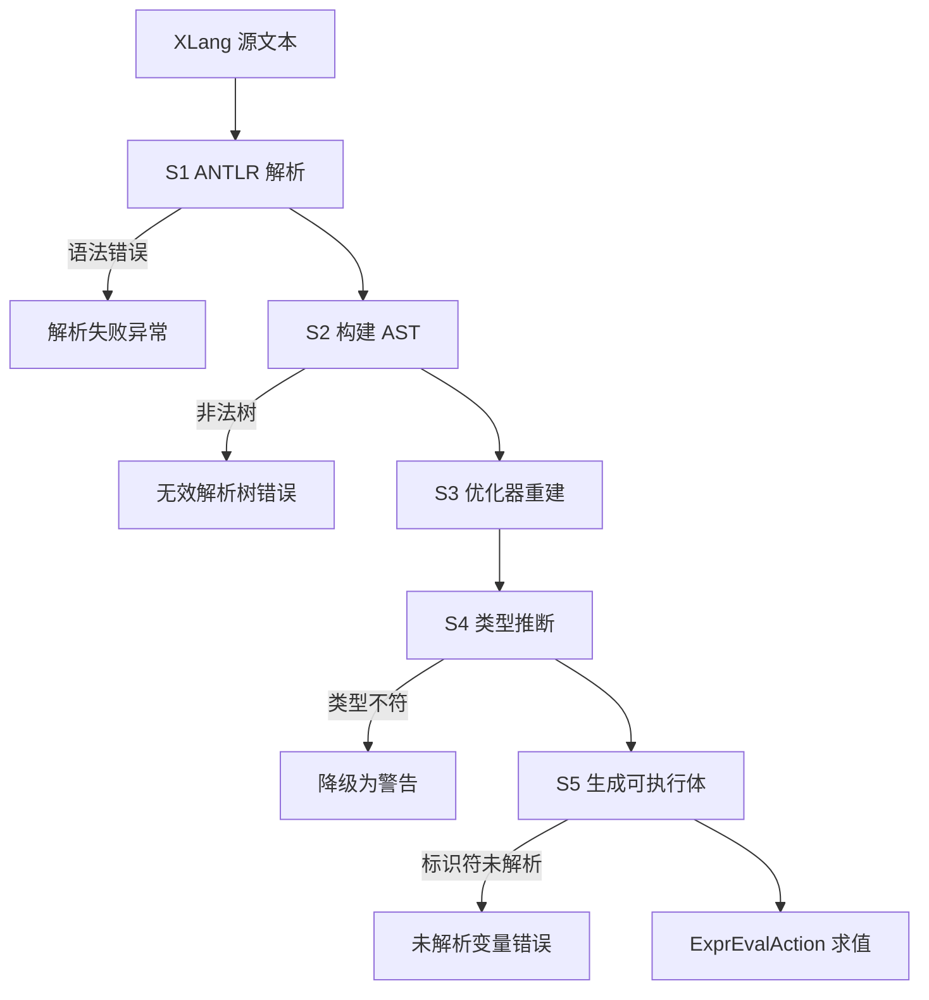
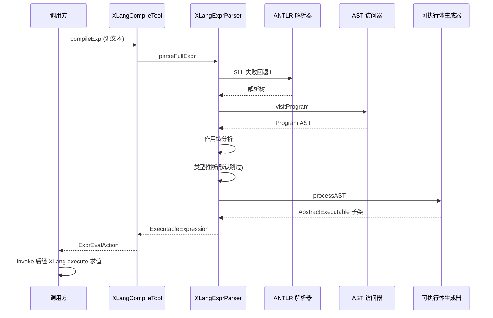

# 编译管线：从 XLang 源文本到可执行体

> 本页源证据：
> - `nop-kernel/nop-xlang/model/antlr/XLangParser.g4`
> - `nop-kernel/nop-xlang/src/main/java/io/nop/xlang/parse/XLangASTParser.java`
> - `nop-kernel/nop-xlang/src/main/java/io/nop/xlang/parse/_XLangASTBuildVisitor.java`
> - `nop-kernel/nop-xlang/src/main/java/io/nop/xlang/parse/XLangASTBuildVisitor.java`
> - `nop-kernel/nop-xlang/src/main/java/io/nop/xlang/ast/XLangASTOptimizer.java`
> - `nop-kernel/nop-xlang/src/main/java/io/nop/xlang/compile/TypeInferenceProcessor.java`
> - `nop-kernel/nop-xlang/src/main/java/io/nop/xlang/compile/BuildExecutableProcessor.java`
> - `nop-kernel/nop-xlang/src/main/java/io/nop/xlang/expr/XLangExprParser.java`
> - `nop-kernel/nop-xlang/src/main/java/io/nop/xlang/exec/AbstractExecutable.java`
> - `nop-kernel/nop-antlr4/nop-antlr4-common/src/main/java/io/nop/antlr4/common/AbstractParseTreeParser.java`

本页追踪一段 XLang 表达式从源文本到可执行体的完整编译路径。管线由五阶段组成：ANTLR 解析、AST 构建、优化器重建、类型推断、可执行体生成，随后交由 exec 包在运行期求值。每阶段标注输入、输出与失败模式，并给出可核查的源码位置。

## 管线总览

编译入口是 `XLangExprParser`：`parseFullExpr` 把源文本变成 `Program` AST（nop-kernel/nop-xlang/src/main/java/io/nop/xlang/expr/XLangExprParser.java:34-40），`buildExecutable` 把 AST 变成 `IExecutableExpression`（nop-kernel/nop-xlang/src/main/java/io/nop/xlang/expr/XLangExprParser.java:61-82）。面向使用者的门面是 `XLangCompileTool`，其 `buildEvalAction` 串联"解析 + 生成"两步并包装为 `ExprEvalAction`（nop-kernel/nop-xlang/src/main/java/io/nop/xlang/api/XLangCompileTool.java:305-310）。

| 阶段 | 输入 | 输出 | 失败模式 |
|------|------|------|----------|
| S1 ANTLR 解析 | 源文本或资源 | `ParseTreeResult`（含 `ProgramContext`） | `ERR_ANTLR_PARSE_FAIL`、`ERR_ANTLR_PARSE_NOT_END_PROPERLY`，`NopException` 带出错位置与期望 token |
| S2 AST 构建 | ANTLR 解析树 | `Program`（`XLangASTNode` 树，105 种 kind） | `ERR_XLANG_INVALID_PARSE_TREE` |
| S3 优化器重建 | `XLangASTNode` | 子节点被替换后的新 AST | 不抛错；以 `changeCount` 记录变更次数 |
| S4 类型推断 | AST + `TypeInferenceState` | `ReturnTypeInfo` + `TypeErrorCollector` | 类型错误不抛出，降级为 warn 日志 |
| S5 生成可执行体 | 已解析标识符的 AST | `IExecutableExpression`（`AbstractExecutable` 子类） | `ERR_XLANG_UNRESOLVED_IDENTIFIER` 等编译期错误；`ERR_EXEC_*` 结构性错误 |

> Sources:
> - `nop-kernel/nop-xlang/src/main/java/io/nop/xlang/expr/XLangExprParser.java` ()
> - `nop-kernel/nop-xlang/src/main/java/io/nop/xlang/api/XLangCompileTool.java` ()

## 阶段一：ANTLR 解析（.g4 语法到解析树）

语法的源头是四个 .g4 文件：`nop-kernel/nop-xlang/model/antlr/XLangParser.g4`（646 行，parser 语法）、`nop-kernel/nop-xlang/model/antlr/XLangLexer.g4`（825 行，token 定义）、`nop-kernel/nop-xlang/model/antlr/XLangCommon.g4`（130 行）、`nop-kernel/nop-xlang/model/antlr/XLangTypeSystem.g4`（328 行，被 `nop-kernel/nop-xlang/model/antlr/XLangParser.g4` 第 3 行 import）。入口规则是 `program : body=topLevelStatements_ EOF ;`（nop-kernel/nop-xlang/model/antlr/XLangParser.g4:27-29）。`nop-kernel/nop-xlang/src/main/java/io/nop/xlang/parse/antlr/XLangParser.java`（11565 行）与 `XLangLexer.java` 是 ANTLR 由这四个 .g4 生成的产物，本页不以其为机制解释对象。

驱动生成物的手写代码是 `XLangParseTreeParser`：`doParse` 先建 `XLangLexer` 与 `CommonTokenStream`，再建 `XLangParser` 并调用 `twoPhaseParse(parser, p -> p.program())`（nop-kernel/nop-xlang/src/main/java/io/nop/xlang/parse/XLangParseTreeParser.java:19-28）。`twoPhaseParse` 是通用的两阶段容错解析：第一阶段用 SLL 预测模式加 `BailErrorStrategy` 快速尝试；一旦抛出 `ParseCancellationException`，重置 parser 后切到 LL 模式完整重解析；两阶段都失败时经 `buildError` 抛出（nop-kernel/nop-antlr4/nop-antlr4-common/src/main/java/io/nop/antlr4/common/AbstractParseTreeParser.java:84-106）。

失败模式有两个出口。其一，输入在语法结尾处还有多余内容：`checkEnd` 在未消费到 EOF 时抛 `ERR_ANTLR_PARSE_NOT_END_PROPERLY`，附 offending token、源码片段（nop-kernel/nop-antlr4/nop-antlr4-common/src/main/java/io/nop/antlr4/common/AbstractParseTreeParser.java:108-126）。其二，语法本身不合法：`buildError` 把 `RecognitionException` 包装为 `ERR_ANTLR_PARSE_FAIL`，附位置、offending token、期望 token 集合——期望集合优先匹配 `PRIMARY_EXPECTED_TOKENS`（逗号、分号、四种闭括号）以简化报错信息（nop-kernel/nop-antlr4/nop-antlr4-common/src/main/java/io/nop/antlr4/common/AbstractParseTreeParser.java:142-168；nop-kernel/nop-xlang/src/main/java/io/nop/xlang/parse/XLangParseTreeParser.java:30-42）。解析成功输出 `ParseTreeResult`；`XLangASTParser` 是面向资源文件的 `ITextResourceParser<Program>` 适配器，同样走"解析树 + 访问器"两步（nop-kernel/nop-xlang/src/main/java/io/nop/xlang/parse/XLangASTParser.java:11-19）。

> Sources:
> - `nop-kernel/nop-xlang/model/antlr/XLangParser.g4` ()
> - `nop-kernel/nop-xlang/src/main/java/io/nop/xlang/parse/XLangParseTreeParser.java` ()
> - `nop-kernel/nop-antlr4/nop-antlr4-common/src/main/java/io/nop/antlr4/common/AbstractParseTreeParser.java` ()

## 阶段二：AST 构建（生成的访问器加语义钩子）

解析树到 AST 的转换由一对访问器完成。基类 `_XLangASTBuildVisitor`（2217 行，文件头无版权注释、按 ANTLR `XLangParserBaseVisitor` 模式生成）为每个带标签的语法分支提供 `visitXxx` 方法：以 `visitArrayBinding_full` 为例，方法先 `new ArrayBinding()`，再 `setLocation(ParseTreeHelper.loc(ctx))` 回填源码位置，然后逐字段从 context 取值（nop-kernel/nop-xlang/src/main/java/io/nop/xlang/parse/_XLangASTBuildVisitor.java:22-30）。子类 `XLangASTBuildVisitor` 是手写的语义钩子层：生成代码遇到需要解释的 token 时回调它，例如 `BinaryExpression_operator(token)` 把 ANTLR token 映射为 `XLangOperator`（nop-kernel/nop-xlang/src/main/java/io/nop/xlang/parse/XLangASTBuildVisitor.java:90-92），字面量求值与变量声明种类分别委托给 `XLangParseHelper.literalValue` / `variableKind`（nop-kernel/nop-xlang/src/main/java/io/nop/xlang/parse/XLangParseHelper.java:31、150-156）。

入口是 `visitProgram((ProgramContext) parseTree)`，`XLangExprParser.parseFullExpr` 与 `XLangASTParser.transform` 都调用它（nop-kernel/nop-xlang/src/main/java/io/nop/xlang/expr/XLangExprParser.java:38；nop-kernel/nop-xlang/src/main/java/io/nop/xlang/parse/XLangASTParser.java:34-38）。输出的 AST 节点种类由枚举 `XLangASTKind` 收录，共 105 项（ordinal 0-104），从 `Program`、`BinaryExpression` 一直到 XPL 特有的 `TextOutputExpression`、`GenNodeExpression`（nop-kernel/nop-xlang/src/main/java/io/nop/xlang/ast/XLangASTKind.java:4-216，该枚举同为生成物）。

失败模式：当钩子遇到既不是终结符也不是合法限定名的解析树节点时，抛 `ERR_XLANG_INVALID_PARSE_TREE` 并携带该节点位置（nop-kernel/nop-xlang/src/main/java/io/nop/xlang/parse/XLangASTBuildVisitor.java:160-169）。可选语法钩子（如 `?.` 的 `OptionalDot` 判定）返回布尔值决定节点字段是否生成（nop-kernel/nop-xlang/src/main/java/io/nop/xlang/parse/XLangASTBuildVisitor.java:171-179）。

> Sources:
> - `nop-kernel/nop-xlang/src/main/java/io/nop/xlang/parse/_XLangASTBuildVisitor.java` ()
> - `nop-kernel/nop-xlang/src/main/java/io/nop/xlang/parse/XLangASTBuildVisitor.java` ()
> - `nop-kernel/nop-xlang/src/main/java/io/nop/xlang/ast/XLangASTKind.java` ()

## 阶段三：优化器（生成的自底向上重建器）

`XLangASTOptimizer`（3028 行，头注释 `__XGEN_FORCE_OVERRIDE__`，生成物）继承 nop-core 的 `AbstractOptimizer`，按 105 种 kind 逐一分发到 `optimizeXxx` 方法（nop-kernel/nop-xlang/src/main/java/io/nop/xlang/ast/XLangASTOptimizer.java:8-14）。生成的 `optimizeXxx` 是统一的重建模式：递归优化每个子节点，子节点变化时 `incChangeCount()` 并按 `shouldClone` 决定是否 `deepClone` 父节点（冻结节点必须克隆，见 nop-kernel/nop-core/src/main/java/io/nop/core/lang/ast/optimize/AbstractOptimizer.java:40-48），列表字段经 `optimizeList` 处理（nop-kernel/nop-core/src/main/java/io/nop/core/lang/ast/optimize/AbstractOptimizer.java:50-84）。`optimizeProgram`、`optimizeIfStatement`、`optimizeBinaryExpression` 均为此模式，基类本身不做常量折叠（nop-kernel/nop-xlang/src/main/java/io/nop/xlang/ast/XLangASTOptimizer.java:352-368、455-467、1337-1367）。

需要指出主编译链路上的一个事实：`XLangExprParser.buildExecutable` 声明了 `optimize` 参数但方法体内未使用它（nop-kernel/nop-xlang/src/main/java/io/nop/xlang/expr/XLangExprParser.java:61-82），常规表达式编译不经过这个优化器。优化器的实际调用点是 `XLangASTTransformer.replaceIdentifier`：用匿名子类覆盖 `optimizeIdentifier`，在遍历中把指定名字的标识符替换为给定值（nop-kernel/nop-xlang/src/main/java/io/nop/xlang/ast/trans/XLangASTTransformer.java:16-28），`Expression.replaceIdentifier` 对外暴露该能力（nop-kernel/nop-xlang/src/main/java/io/nop/xlang/ast/Expression.java:45）。失败模式：该阶段是纯结构性变换，不抛领域错误；`nop-kernel/nop-xlang/src/main/java/io/nop/xlang/compile/ExpressionOptimizer.java` 目前是空类占位（nop-kernel/nop-xlang/src/main/java/io/nop/xlang/compile/ExpressionOptimizer.java:10-12）。

> Sources:
> - `nop-kernel/nop-xlang/src/main/java/io/nop/xlang/ast/XLangASTOptimizer.java` ()
> - `nop-kernel/nop-core/src/main/java/io/nop/core/lang/ast/optimize/AbstractOptimizer.java` ()
> - `nop-kernel/nop-xlang/src/main/java/io/nop/xlang/ast/trans/XLangASTTransformer.java` ()

## 阶段四：类型推断（默认关闭，错误降级）

`TypeInferenceProcessor`（2096 行）继承 `XLangASTProcessor<ReturnTypeInfo, TypeInferenceState>`，内部持有 `TypeErrorCollector`（nop-kernel/nop-xlang/src/main/java/io/nop/xlang/compile/TypeInferenceProcessor.java:118-124）。它的推断是流敏感的：以 `processIfStatement` 为例，先处理条件表达式，再为 true/false 两个分支各建子状态，用 `UnionTypeNarrower.collectNarrowedTypes` 从条件中收集分支收窄后的变量类型，最后按分支合并为联合类型（nop-kernel/nop-xlang/src/main/java/io/nop/xlang/compile/TypeInferenceProcessor.java:126-150）。

调用方与失败语义同样关键。该阶段受配置 `nop.xlang.type-inference.enabled` 控制，默认值为 `false`（nop-kernel/nop-xlang/src/main/java/io/nop/xlang/XLangConfigs.java:44）。开启后，类型错误（`ERR_TYPE_INFER_ASSIGN_TYPE_MISMATCH`、`ERR_TYPE_INFER_INCOMPATIBLE_TYPES`、`ERR_TYPE_INFER_UNDEFINED_VARIABLE`）由 `TypeErrorCollector` 以 error/warning 列表形式收集（nop-kernel/nop-xlang/src/main/java/io/nop/xlang/compile/TypeErrorCollector.java:25-41；记录点如 nop-kernel/nop-xlang/src/main/java/io/nop/xlang/compile/TypeInferenceProcessor.java:363、1289、1395），`buildExecutable` 只把它们逐条打为 warn 日志，注释明言"类型推导错误以警告日志形式暴露，不中断编译"（nop-kernel/nop-xlang/src/main/java/io/nop/xlang/expr/XLangExprParser.java:70-79）。即此阶段没有异常出口，是管线中唯一"软失败"环节。

> Sources:
> - `nop-kernel/nop-xlang/src/main/java/io/nop/xlang/compile/TypeInferenceProcessor.java` ()
> - `nop-kernel/nop-xlang/src/main/java/io/nop/xlang/compile/TypeErrorCollector.java` ()
> - `nop-kernel/nop-xlang/src/main/java/io/nop/xlang/XLangConfigs.java` ()

## 阶段五：作用域分析与可执行体生成

进入 `BuildExecutableProcessor` 之前有两步前置。第一步是 `LexicalScopeAnalysis`：遍历 AST 确定每个变量引用的原始定义，构建 `LexicalScope`，为局部变量和闭包变量分配 slot（对应运行时堆栈位置）（nop-kernel/nop-xlang/src/main/java/io/nop/xlang/compile/LexicalScopeAnalysis.java:126-128）。它的失败模式是编译期硬错误：标识符无法解析时抛 `ERR_XLANG_UNRESOLVED_IDENTIFIER`（隐式变量用 `ERR_XLANG_UNRESOLVED_IMPLICIT_VAR`，nop-kernel/nop-xlang/src/main/java/io/nop/xlang/compile/LexicalScopeAnalysis.java:690、715），另有 break/continue 不在循环内、const 缺初始化器等检查（同文件 106-113 行的错误码导入）。

第二步是 `BuildExecutableProcessor`（约 1700 行）把 AST 逐节点翻译为 exec 包中的可执行体。以标识符为例，`processIdentifier` 按 `IdentifierKind` 分派：全局变量生成 `GlobalVarExecutable`，作用域变量生成 `ScopeIdentifierExecutable`，可内联常量直接生成 `LiteralExecutable`，闭包函数经 `BuildFuncRefExecutable` 捕获 slot（nop-kernel/nop-xlang/src/main/java/io/nop/xlang/compile/BuildExecutableProcessor.java:465-522）。产出统一实现 `IExecutableExpression`，其基类 `AbstractExecutable` 只保留源码位置 `loc`、错误工厂 `newError`（把 `display()` 文本挂到异常参数上）与子表达式求值模板 `eval`（nop-kernel/nop-xlang/src/main/java/io/nop/xlang/exec/AbstractExecutable.java:27-34、56-62、74-81）。

失败模式：结构不被支持时 `defaultProcess` 与各分支兜底抛 `ERR_EXEC_NOT_SUPPORTED_AST_NODE` 并附 AST 节点描述（nop-kernel/nop-xlang/src/main/java/io/nop/xlang/compile/BuildExecutableProcessor.java:297-298、529-530）；参数个数越界抛 `ERR_EXEC_TOO_MANY_ARGS` 等（同文件 1362 行附近）。生成后的执行入口 `ExprEvalAction.invoke` 调 `XLang.execute(expr, new EvalRuntime(...))`（nop-kernel/nop-xlang/src/main/java/io/nop/xlang/api/ExprEvalAction.java:45-52），`XLang.execute` 是统一后端裁决的 choke point：`EvalBackendRouter` 激活时走裁决路径，否则直通全局执行器（nop-kernel/nop-xlang/src/main/java/io/nop/xlang/api/XLang.java:47-53）。运行期由 `DefaultExpressionExecutor.execute` 回调 `expr.execute(this, rt)` 完成求值（nop-kernel/nop-core/src/main/java/io/nop/core/lang/eval/DefaultExpressionExecutor.java:10-16）；子表达式异常经 `AbstractExecutable.eval` 的 `addXplStack` 逐层叠加 XPL 调用栈（nop-kernel/nop-xlang/src/main/java/io/nop/xlang/exec/AbstractExecutable.java:74-81），属性读写失败包装为 `ERR_EXEC_READ_ATTR_FAIL` / `ERR_EXEC_WRITE_ATTR_FAIL`（同文件 105-115 行）。

> Sources:
> - `nop-kernel/nop-xlang/src/main/java/io/nop/xlang/compile/LexicalScopeAnalysis.java` ()
> - `nop-kernel/nop-xlang/src/main/java/io/nop/xlang/compile/BuildExecutableProcessor.java` ()
> - `nop-kernel/nop-xlang/src/main/java/io/nop/xlang/exec/AbstractExecutable.java` ()
> - `nop-kernel/nop-xlang/src/main/java/io/nop/xlang/api/ExprEvalAction.java` ()

## 端到端时序与错误抛出点

一次 `XLangCompileTool.compileExpr` 调用把五个阶段串成一条同步链；求值则是编译产物在另一时刻的重入。

各阶段的错误抛出点汇总如下，异常基类从 `NopException`（编译期）过渡到 `NopEvalException`（生成与运行期）：

| 错误码 | 抛出位置 | 阶段 | 异常类型 |
|--------|----------|------|----------|
| `ERR_ANTLR_PARSE_FAIL` | nop-kernel/nop-antlr4/nop-antlr4-common/src/main/java/io/nop/antlr4/common/AbstractParseTreeParser.java:149-151 | S1 解析 | `NopException` |
| `ERR_ANTLR_PARSE_NOT_END_PROPERLY` | 同上文件 :112-124 | S1 解析（尾部多余输入） | `NopException` |
| `ERR_XLANG_INVALID_PARSE_TREE` | nop-kernel/nop-xlang/src/main/java/io/nop/xlang/parse/XLangASTBuildVisitor.java:168 | S2 AST 构建 | `NopException` |
| `ERR_XLANG_UNRESOLVED_IDENTIFIER` | nop-kernel/nop-xlang/src/main/java/io/nop/xlang/compile/LexicalScopeAnalysis.java:715 | S5 前置作用域分析 | `NopEvalException` |
| `ERR_TYPE_INFER_*` | nop-kernel/nop-xlang/src/main/java/io/nop/xlang/expr/XLangExprParser.java:74-78 | S4 类型推断 | 不抛出，warn 日志 |
| `ERR_EXEC_NOT_SUPPORTED_AST_NODE` | nop-kernel/nop-xlang/src/main/java/io/nop/xlang/compile/BuildExecutableProcessor.java:297-298 | S5 生成 | `NopEvalException` |
| `ERR_EXEC_READ_ATTR_FAIL` 等 | nop-kernel/nop-xlang/src/main/java/io/nop/xlang/exec/AbstractExecutable.java:105-115 | 运行期求值 | `NopEvalException` |

> Sources:
> - `nop-kernel/nop-xlang/src/main/java/io/nop/xlang/api/XLang.java` ()
> - `nop-kernel/nop-core/src/main/java/io/nop/core/lang/eval/DefaultExpressionExecutor.java` ()

## Sources

- `nop-kernel/nop-xlang/model/antlr/XLangParser.g4` ()
- `nop-kernel/nop-xlang/model/antlr/XLangLexer.g4` ()
- `nop-kernel/nop-antlr4/nop-antlr4-common/src/main/java/io/nop/antlr4/common/AbstractParseTreeParser.java` ()
- `nop-kernel/nop-xlang/src/main/java/io/nop/xlang/parse/XLangASTParser.java` ()
- `nop-kernel/nop-xlang/src/main/java/io/nop/xlang/parse/XLangParseTreeParser.java` ()
- `nop-kernel/nop-xlang/src/main/java/io/nop/xlang/parse/_XLangASTBuildVisitor.java` ()
- `nop-kernel/nop-xlang/src/main/java/io/nop/xlang/parse/XLangASTBuildVisitor.java` ()
- `nop-kernel/nop-xlang/src/main/java/io/nop/xlang/parse/XLangParseHelper.java` ()
- `nop-kernel/nop-xlang/src/main/java/io/nop/xlang/ast/XLangASTKind.java` ()
- `nop-kernel/nop-xlang/src/main/java/io/nop/xlang/ast/XLangASTOptimizer.java` ()
- `nop-kernel/nop-xlang/src/main/java/io/nop/xlang/ast/trans/XLangASTTransformer.java` ()
- `nop-kernel/nop-core/src/main/java/io/nop/core/lang/ast/optimize/AbstractOptimizer.java` ()
- `nop-kernel/nop-xlang/src/main/java/io/nop/xlang/compile/TypeInferenceProcessor.java` ()
- `nop-kernel/nop-xlang/src/main/java/io/nop/xlang/compile/TypeErrorCollector.java` ()
- `nop-kernel/nop-xlang/src/main/java/io/nop/xlang/compile/LexicalScopeAnalysis.java` ()
- `nop-kernel/nop-xlang/src/main/java/io/nop/xlang/compile/BuildExecutableProcessor.java` ()
- `nop-kernel/nop-xlang/src/main/java/io/nop/xlang/expr/XLangExprParser.java` ()
- `nop-kernel/nop-xlang/src/main/java/io/nop/xlang/api/XLangCompileTool.java` ()
- `nop-kernel/nop-xlang/src/main/java/io/nop/xlang/api/ExprEvalAction.java` ()
- `nop-kernel/nop-xlang/src/main/java/io/nop/xlang/api/XLang.java` ()
- `nop-kernel/nop-xlang/src/main/java/io/nop/xlang/exec/AbstractExecutable.java` ()
- `nop-kernel/nop-core/src/main/java/io/nop/core/lang/eval/DefaultExpressionExecutor.java` ()

相关页面：术语定义见 [../glossary.md](../glossary.md)；AST 节点分类与优化器细节见 [AST 节点体系](../modules/ast-model.md)；可执行体的求值语义见 [表达式求值](./expression-eval.md)。

---

## On this page

- 管线总览
- 阶段一：ANTLR 解析（.g4 语法到解析树）
- 阶段二：AST 构建（生成的访问器加语义钩子）
- 阶段三：优化器（生成的自底向上重建器）
- 阶段四：类型推断（默认关闭，错误降级）
- 阶段五：作用域分析与可执行体生成
- 端到端时序与错误抛出点
