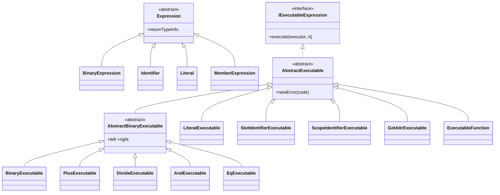
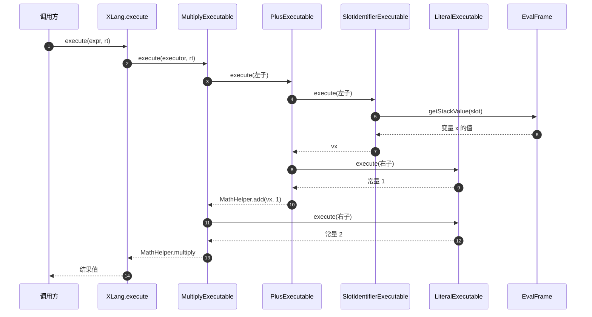

# 表达式求值：Expression 如何变成值

XLang 的求值分两个世界：编译期产出 `Expression` AST 与它的编译产物 `IExecutableExpression` 可执行体；运行期可执行体在 `EvalRuntime`（作用域 + 栈帧）中递归 `execute` 产出值。本页覆盖可执行体体系、求值链路、作用域与典型算子语义。编译侧前置见[编译管线](./compile-pipeline.md)，节点分类详见 [AST 节点体系](../modules/ast-model.md)，XPL/XScript 等语言族术语划界见[术语表](../glossary.md)。

> 主要源文件：
> - [../../../nop-kernel/nop-xlang/src/main/java/io/nop/xlang/ast/Expression.java](../../../nop-kernel/nop-xlang/src/main/java/io/nop/xlang/ast/Expression.java)（表达式 AST 基类）
> - [../../../nop-kernel/nop-core/src/main/java/io/nop/core/lang/eval/IExecutableExpression.java](../../../nop-kernel/nop-core/src/main/java/io/nop/core/lang/eval/IExecutableExpression.java)（可执行体接口）
> - [../../../nop-kernel/nop-xlang/src/main/java/io/nop/xlang/exec/AbstractExecutable.java](../../../nop-kernel/nop-xlang/src/main/java/io/nop/xlang/exec/AbstractExecutable.java)（可执行体基类）
> - [../../../nop-kernel/nop-xlang/src/main/java/io/nop/xlang/exec/BinaryExecutable.java](../../../nop-kernel/nop-xlang/src/main/java/io/nop/xlang/exec/BinaryExecutable.java)（二元算子分派）
> - [../../../nop-kernel/nop-core/src/main/java/io/nop/core/lang/eval/EvalRuntime.java](../../../nop-kernel/nop-core/src/main/java/io/nop/core/lang/eval/EvalRuntime.java)（求值运行时）
> - [../../../nop-kernel/nop-core/src/main/java/io/nop/core/lang/eval/EvalFrame.java](../../../nop-kernel/nop-core/src/main/java/io/nop/core/lang/eval/EvalFrame.java)（槽位栈帧）
> - [../../../nop-kernel/nop-xlang/src/main/java/io/nop/xlang/scope/LexicalScope.java](../../../nop-kernel/nop-xlang/src/main/java/io/nop/xlang/scope/LexicalScope.java)（编译期槽位分配）
> - [../../../nop-kernel/nop-xlang/src/main/java/io/nop/xlang/scope/XLangBlockScope.java](../../../nop-kernel/nop-xlang/src/main/java/io/nop/xlang/scope/XLangBlockScope.java)（编译期块级作用域）
> - [../../../nop-kernel/nop-xlang/src/main/java/io/nop/xlang/expr/XLangExprParser.java](../../../nop-kernel/nop-xlang/src/main/java/io/nop/xlang/expr/XLangExprParser.java)（parse→compile 门面）
> - [../../../nop-kernel/nop-xlang/src/main/java/io/nop/xlang/compile/BuildExecutableProcessor.java](../../../nop-kernel/nop-xlang/src/main/java/io/nop/xlang/compile/BuildExecutableProcessor.java)（AST→可执行体）

## 求值模型：AST 与可执行体分离

`Expression`（`io.nop.xlang.ast`）是全部表达式 AST 节点的抽象基类，本体只携带类型推断结果 `returnTypeInfo` 并提供 `toExprString` 反打印与 `replaceIdentifier` 替换（`nop-kernel/nop-xlang/src/main/java/io/nop/xlang/ast/Expression.java:18-46`）。它是全模块 fan-in 最高的类型（185 处引用，`deepwiki/nop-xlang/PLAN.md:13`）：解析、优化、类型推断、编译、模板标签编译器都以它为操作对象。

AST 不直接求值。真正持有运行期语义的是 `IExecutableExpression`——接口注释明确其为"根据XLang抽象语法树编译得到的可执行对象"，核心签名是 `Object execute(IExpressionExecutor executor, EvalRuntime rt)`（`nop-kernel/nop-core/src/main/java/io/nop/core/lang/eval/IExecutableExpression.java:12-46`）。这个"编译产物树"与 AST 节点一一对应但形态更扁平：常量折叠、标识符解析、算子特化都在编译期完成，运行期只剩递归求值。

统一求值入口是 `XLang.execute`：若 `EvalBackendRouter` 激活（如 truffle 后端注册）则裁决分流，否则交给全局执行器（`nop-kernel/nop-xlang/src/main/java/io/nop/xlang/api/XLang.java:47-54`）。默认执行器 `DefaultExpressionExecutor` 是个单例回调：`execute` 直接调 `expr.execute(this, rt)`（`nop-kernel/nop-core/src/main/java/io/nop/core/lang/eval/DefaultExpressionExecutor.java:10-17`），求值就是可执行体树的后序遍历。对外门面 `ExprEvalAction.invoke` 把 `IEvalContext` 的作用域包成 `EvalRuntime` 后调 `XLang.execute`（`nop-kernel/nop-xlang/src/main/java/io/nop/xlang/api/ExprEvalAction.java:44-47`）。

> Sources: Expression.java (18-46), IExecutableExpression.java (12-46), XLang.java (43-54), DefaultExpressionExecutor.java (10-17), ExprEvalAction.java (44-52), deepwiki/nop-xlang/PLAN.md (13)

## 可执行体层级与 AbstractExecutable

`exec/` 包 141 个文件按 AST 节点族组织。基类 `AbstractExecutable` 保留源码位置 `loc`，提供三件基础设施：错误构造（`newError` 把错误包装为 `NopEvalException` 并附加 `ARG_EXPR` 表达式文本，`nop-kernel/nop-xlang/src/main/java/io/nop/xlang/exec/AbstractExecutable.java:56-62`）、子表达式求值（`eval` 帮助方法在异常上 `addXplStack` 追加 XPL 调用栈帧，同文件 74-81 行）、属性读写语义（`readAttr`/`setAttr` 委托 `XLangSemantics`，101-115 行）。`display`/`visit` 支持调试器断点与可执行体树遍历，非断点微结构（字面量、槽位读取）以 `allowBreakPoint()=false` 标记（`nop-kernel/nop-core/src/main/java/io/nop/core/lang/eval/IExecutableExpression.java:26-28`）。

二元族收敛在 `AbstractBinaryExecutable`（持有左右子表达式，`nop-kernel/nop-xlang/src/main/java/io/nop/xlang/exec/AbstractBinaryExecutable.java:16-34`），其下按算子裂变为 `PlusExecutable`（`nop-kernel/nop-xlang/src/main/java/io/nop/xlang/exec/PlusExecutable.java:16`）、`DivideExecutable`（`nop-kernel/nop-xlang/src/main/java/io/nop/xlang/exec/DivideExecutable.java:17`）、`AndExecutable`（`nop-kernel/nop-xlang/src/main/java/io/nop/xlang/exec/AndExecutable.java:18`）、`EqExecutable` 等专属子类。

左列是编译期 AST（`_BinaryExpression`/`_Literal`/`_Identifier` 均 extends `Expression`，`nop-kernel/nop-xlang/src/main/java/io/nop/xlang/ast/_gen/_BinaryExpression.java:17`；`nop-kernel/nop-xlang/src/main/java/io/nop/xlang/ast/MemberExpression.java:14` 经 `OptionalExpression` 间接继承），右列是运行期可执行体。两侧同名对应关系由编译期处理器维护（见末节）。

> Sources: AbstractExecutable.java (27-115), AbstractBinaryExecutable.java (16-58), AndExecutable.java (18-34), PlusExecutable.java (16), _BinaryExpression.java (17), MemberExpression.java (14), IExecutableExpression.java (26-28)

## 一次二元表达式的求值时序

以槽位变量 `x` 的表达式 `(x + 1) * 2` 为例：编译期 `processBinaryExpression` 先递归编译左右子树再 `BinaryExecutable.valueOf` 装配（`nop-kernel/nop-xlang/src/main/java/io/nop/xlang/compile/BuildExecutableProcessor.java:1070-1075`）；运行期 `valueOf` 按算子特化产物——`ADD` 产 `PlusExecutable`、`DIVIDE` 产 `DivideExecutable`、与 `null` 比较直接坍缩为 `EqNullExecutable`（`nop-kernel/nop-xlang/src/main/java/io/nop/xlang/exec/BinaryExecutable.java:27-87`）。

三个要点。其一，递归在 `execute` 之间发生：`BinaryExecutable.execute` 先左后右取值，再调 `EvalHelper.binaryOp` 兜底运算（`nop-kernel/nop-xlang/src/main/java/io/nop/xlang/exec/BinaryExecutable.java:94-100`；`nop-kernel/nop-xlang/src/main/java/io/nop/xlang/utils/EvalHelper.java:16-66`）。其二，字面量编译即定值：`LiteralExecutable.execute` 直接返回构造期持有的 `value`（`nop-kernel/nop-xlang/src/main/java/io/nop/xlang/exec/LiteralExecutable.java:44-46`），数值/字符串/正则字面量各有编译入口（`nop-kernel/nop-xlang/src/main/java/io/nop/xlang/compile/BuildExecutableProcessor.java:533-546`）。其三，异常携带表达式上下文：`AbstractExecutable.newError` 把 `display()` 文本作为 `ARG_EXPR` 传入，栈底到栈顶是完整子表达式链（`nop-kernel/nop-xlang/src/main/java/io/nop/xlang/exec/AbstractExecutable.java:56-62`）。

> Sources: BuildExecutableProcessor.java (533-546, 1070-1075), BinaryExecutable.java (27-100), EvalHelper.java (16-66), LiteralExecutable.java (28-46), AbstractExecutable.java (56-81)

## 求值上下文与作用域机制

运行期上下文由三层构成。`EvalRuntime` 持有 `IEvalScope` 变量作用域、`EvalFrame` 调用帧栈（`pushFrame`/`popFrame`）、退出模式 `ExitMode` 与输出 `IEvalOutput`（`nop-kernel/nop-core/src/main/java/io/nop/core/lang/eval/EvalRuntime.java:6-70`）。`IEvalScope` 是显式定义的变量查找链——注释说明"为了支持调试功能和副作用输出，需要显式定义scope"——变量未命中时沿 `parentScope` 上溯（`nop-kernel/nop-core/src/main/java/io/nop/core/lang/eval/IEvalScope.java:24-61`）；默认实现 `EvalScopeImpl.getValue` 的查找顺序是本层 Map → `extension` 扩展作用域 → 父链（`nop-kernel/nop-core/src/main/java/io/nop/core/lang/eval/EvalScopeImpl.java:170-191`）。`EvalFrame` 是"函数参数 + 函数内变量 + 闭包变量构成的集合"的 `Object[]` 槽位数组，按 slot 下标 O(1) 读写（`nop-kernel/nop-core/src/main/java/io/nop/core/lang/eval/EvalFrame.java:18-65`）。

| 层面 | 类型 | 职责 | 关键机制 | 锚点 |
|---|---|---|---|---|
| 编译期·块级 | `XLangBlockScope` | 变量声明登记、闭包捕获、标签编译器与命名空间开关 | `resolveVar` 本层→闭包→父链递归；函数层命中外层变量时登记 `ClosureRefDefinition` | XLangBlockScope.java:98-119 |
| 编译期·闭包提升 | `LexicalScope` | 把参数/闭包变量/局部变量汇编成函数级槽位表 | `hoistClosureVars` 递归提升内部函数所需闭包变量；`assignVarSlots` 按参数→闭包→局部顺序编号，同名共享 slot | LexicalScope.java:66-156 |
| 编译期·总上下文 | `XLangCompileScope` | 继承 `EvalScopeImpl` 又实现 `IXLangCompileScope`，管理 `XLangBlockScope` 栈 | 每个 `{}` 延迟创建 blockScope，未声明变量则不建 | XLangCompileScope.java:48-115 |
| 运行期·变量 | `EvalScopeImpl`（`IEvalScope`） | Map 变量表 + 父链 + 扩展作用域兜底 | `getValue` 三级查找；`newChildScope(inheritParentVars)` 控制继承 | EvalScopeImpl.java:96-100, 170-191 |
| 运行期·栈帧 | `EvalFrame` | 函数调用的槽位存储 | `getStackValue(slot)`/`setStackValue`；`EvalReference` 支持闭包按引用 | EvalFrame.java:34-65, 89-101 |
| 运行期·函数调用 | `ExecutableFunction` | 编译产出的函数对象（实现 `IEvalFunction`） | 新建 `EvalFrame` → 写默认参数 → `pushFrame` → 执行体 → `finally popFrame` | ExecutableFunction.java:86-100 |

调用帧与槽位的对应关系在编译期确定：`LexicalScope.assignVarSlots` 按"参数-闭包变量-局部变量"顺序分配 slot 编号（`nop-kernel/nop-xlang/src/main/java/io/nop/xlang/scope/LexicalScope.java:113-156`），编译进函数的 `slotNames` 数组随 `ExecutableFunction` 保存（`nop-kernel/nop-xlang/src/main/java/io/nop/xlang/exec/ExecutableFunction.java:38-62`）。函数调用时新帧按同名数组初始化，`SlotIdentifierExecutable.execute` 因此只需 `rt.getCurrentFrame().getStackValue(slot)`（`nop-kernel/nop-xlang/src/main/java/io/nop/xlang/exec/SlotIdentifierExecutable.java:48-50`）；闭包变量可能被内层函数修改时改存 `EvalReference` 按引用传递（`nop-kernel/nop-core/src/main/java/io/nop/core/lang/eval/EvalFrame.java:89-101`，编译分支见 `nop-kernel/nop-xlang/src/main/java/io/nop/xlang/compile/BuildExecutableProcessor.java:474-490`）。

> Sources: EvalRuntime.java (6-70), IEvalScope.java (24-77), EvalScopeImpl.java (96-100, 170-191), EvalFrame.java (18-101), LexicalScope.java (66-156), XLangBlockScope.java (98-119), XLangCompileScope.java (48-115), ExecutableFunction.java (34-100), SlotIdentifierExecutable.java (48-50), BuildExecutableProcessor.java (464-490)

## 典型算子语义

算子全集定义在 `XLangOperator` 枚举：算术、比较、相等、逻辑、位运算、`??`、自增自减与全部自赋值族（`nop-kernel/nop-xlang/src/main/java/io/nop/xlang/ast/XLangOperator.java:15-41`）。编译期 `BinaryExecutable.valueOf` 将高频算子特化为专属可执行体，其余落入携带 `operator` 字段的通用 `BinaryExecutable`（`nop-kernel/nop-xlang/src/main/java/io/nop/xlang/exec/BinaryExecutable.java:27-87`）。

| 类别 | 代表算子 | 求值语义 | 实现 |
|---|---|---|---|
| 算术 | `+ - * / %` | 左右取值后委托 `MathHelper` 跨数值类型运算 | Plus/Minus/Multiply/DivideExecutable（DivideExecutable.java:22-27, EvalHelper.java:30-39） |
| 比较 | `< <= > >=` | `MathHelper.lt/le/gt/ge`，数值化后比较 | Gt/Ge/Lt/LeExecutable（BinaryExecutable.java:74-81, EvalHelper.java:40-43, 50-53） |
| 相等 | `== === != !==` | `xlangEq`：指针相等短路；数值跨类型值比较；字符串值比较；其余非数字类型直接 false | EqExecutable（EqExecutable.java:23-27; MathHelper.java:679-693）；`==null` 编译期坍缩为 EqNullExecutable（BinaryExecutable.java:42-73） |
| 逻辑 | `&& \|\| ??` | 返回操作数值本身而非布尔化：`&&` 左值假即返回左值，否则返回右值 | AndExecutable 短路（AndExecutable.java:29-34）；`??` 为 NullCoalesceExecutable（BinaryExecutable.java:82-83） |
| 位运算 | `& \| ^ << >> >>>` | 通用 `BinaryExecutable` + `MathHelper.band/bor/…` | EvalHelper.java:17-29 |
| 路径 | `a.b`、`a?.[b]` | 计算属性 `GetAttrExecutable`：null 非可选抛 `ERR_EXEC_GET_ATTR_ON_NULL_OBJ`，Integer 下标走 `readIndex`，否则按 beanModel 读属性 | GetAttrExecutable.java:77-95；非计算属性编译为 GetPropertyExecutable（BuildExecutableProcessor.java:1245-1252） |
| 赋值/自赋值 | `= += ++` 等 | 按目标编译期分派：槽位/引用/作用域变量各有专属可执行体；自赋值复用 `XLangSemantics.selfAssignValue` | BuildExecutableProcessor.java:1090-1159；AbstractExecutable.java:96-98 |

两个语义细节值得注意。逻辑算子不做布尔化——`&&` 返回的是决定结果的那个操作数的原值，`EvalHelper.binaryOp` 的兜底分支行为一致（`nop-kernel/nop-xlang/src/main/java/io/nop/xlang/utils/EvalHelper.java:54-63`）。`xlangEq` 与 Java `equals` 不同：两个非数字、非字符串对象仅指针相等才判等（`nop-kernel/nop-commons/src/main/java/io/nop/commons/util/MathHelper.java:687-693`），这决定了 XScript 中对象比较的直觉语义。

> Sources: XLangOperator.java (15-41), BinaryExecutable.java (27-87), EvalHelper.java (16-66), AndExecutable.java (29-34), EqExecutable.java (17-33), MathHelper.java (679-693), DivideExecutable.java (17-33), GetAttrExecutable.java (77-95), BuildExecutableProcessor.java (1090-1159, 1245-1252), AbstractExecutable.java (96-98)

## 与编译产物的衔接：标识符解析决定求值形态

`XLangExprParser.buildExecutable` 是表达式进入运行期的总闸：先 `LexicalScopeAnalysis` 完成标识符解析与槽位编号，再（配置开启时）跑 `TypeInferenceProcessor` 把类型写回 `returnTypeInfo`，最后 `BuildExecutableProcessor.processAST` 产出可执行体（`nop-kernel/nop-xlang/src/main/java/io/nop/xlang/expr/XLangExprParser.java:60-82`）。嵌入表达式的引导符按阶段区分——`${}` 执行期、`#{}` 编译期、`%{}` 转换期、`@{}` 数据绑定（`nop-kernel/nop-xlang/src/main/java/io/nop/xlang/expr/ExprPhase.java:10-29`）。

标识符的编译分支直接决定运行期取值路径：`GLOBAL_VAR_REF` → `GlobalVarExecutable`；`SCOPE_VAR_REF` → `ScopeIdentifierExecutable`（运行期走 `XLangSemantics.getScopeValue` 查作用域链，`nop-kernel/nop-xlang/src/main/java/io/nop/xlang/exec/ScopeIdentifierExecutable.java:34-36`）；`VAR_REF`/`CLOSURE_VAR_REF` → 可内联常量直接坍缩为 `LiteralExecutable`，否则 `SlotIdentifierExecutable` 或按引用 `ReferenceIdentifierExecutable`（`nop-kernel/nop-xlang/src/main/java/io/nop/xlang/compile/BuildExecutableProcessor.java:464-531`）。也就是说，同写法 `x` 在不同解析结果下有四种求值成本：常量零开销、帧内 O(1)、闭包引用一次解引用、作用域链逐级查找。嵌入 `MemberExpression` 时，`scope` 前缀变量（`{scope.xxx}`）被识别为 `ScopeIdentifierExecutable`，类静态引用编译为静态 getter 调用（`nop-kernel/nop-xlang/src/main/java/io/nop/xlang/compile/BuildExecutableProcessor.java:1223-1252`）。函数定义编译为 `ExecutableFunction`，调用入口按参数个数特化为 0-3 参子类减少数组分配（`nop-kernel/nop-xlang/src/main/java/io/nop/xlang/exec/FunctionExecutable.java:31-45`）。

> Sources: XLangExprParser.java (33-82), ExprPhase.java (10-29), BuildExecutableProcessor.java (464-531, 1223-1252), ScopeIdentifierExecutable.java (34-36), SlotIdentifierExecutable.java (48-50), FunctionExecutable.java (31-45), ExecutableFunction.java (31-34)

## Sources

- nop-kernel/nop-xlang/src/main/java/io/nop/xlang/ast/Expression.java ()
- nop-kernel/nop-xlang/src/main/java/io/nop/xlang/ast/Identifier.java ()
- nop-kernel/nop-xlang/src/main/java/io/nop/xlang/ast/Literal.java ()
- nop-kernel/nop-xlang/src/main/java/io/nop/xlang/ast/XLangOperator.java ()
- nop-kernel/nop-xlang/src/main/java/io/nop/xlang/ast/MemberExpression.java ()
- nop-kernel/nop-xlang/src/main/java/io/nop/xlang/ast/OptionalExpression.java ()
- nop-kernel/nop-xlang/src/main/java/io/nop/xlang/ast/_gen/_BinaryExpression.java ()
- nop-kernel/nop-core/src/main/java/io/nop/core/lang/eval/IExecutableExpression.java ()
- nop-kernel/nop-core/src/main/java/io/nop/core/lang/eval/IExpressionExecutor.java ()
- nop-kernel/nop-core/src/main/java/io/nop/core/lang/eval/DefaultExpressionExecutor.java ()
- nop-kernel/nop-core/src/main/java/io/nop/core/lang/eval/EvalRuntime.java ()
- nop-kernel/nop-core/src/main/java/io/nop/core/lang/eval/EvalScopeImpl.java ()
- nop-kernel/nop-core/src/main/java/io/nop/core/lang/eval/EvalFrame.java ()
- nop-kernel/nop-xlang/src/main/java/io/nop/xlang/exec/AbstractExecutable.java ()
- nop-kernel/nop-xlang/src/main/java/io/nop/xlang/exec/AbstractBinaryExecutable.java ()
- nop-kernel/nop-xlang/src/main/java/io/nop/xlang/exec/BinaryExecutable.java ()
- nop-kernel/nop-xlang/src/main/java/io/nop/xlang/exec/PlusExecutable.java ()
- nop-kernel/nop-xlang/src/main/java/io/nop/xlang/exec/MinusExecutable.java ()
- nop-kernel/nop-xlang/src/main/java/io/nop/xlang/exec/MultiplyExecutable.java ()
- nop-kernel/nop-xlang/src/main/java/io/nop/xlang/exec/DivideExecutable.java ()
- nop-kernel/nop-xlang/src/main/java/io/nop/xlang/exec/AndExecutable.java ()
- nop-kernel/nop-xlang/src/main/java/io/nop/xlang/exec/EqExecutable.java ()
- nop-kernel/nop-xlang/src/main/java/io/nop/xlang/exec/LiteralExecutable.java ()
- nop-kernel/nop-xlang/src/main/java/io/nop/xlang/exec/SlotIdentifierExecutable.java ()
- nop-kernel/nop-xlang/src/main/java/io/nop/xlang/exec/ScopeIdentifierExecutable.java ()
- nop-kernel/nop-xlang/src/main/java/io/nop/xlang/exec/GetAttrExecutable.java ()
- nop-kernel/nop-xlang/src/main/java/io/nop/xlang/exec/FunctionExecutable.java ()
- nop-kernel/nop-xlang/src/main/java/io/nop/xlang/exec/ExecutableFunction.java ()
- nop-kernel/nop-xlang/src/main/java/io/nop/xlang/utils/EvalHelper.java ()
- nop-kernel/nop-xlang/src/main/java/io/nop/xlang/scope/LexicalScope.java ()
- nop-kernel/nop-xlang/src/main/java/io/nop/xlang/scope/XLangBlockScope.java ()
- nop-kernel/nop-xlang/src/main/java/io/nop/xlang/scope/XLangCompileScope.java ()
- nop-kernel/nop-xlang/src/main/java/io/nop/xlang/api/IXLangCompileScope.java ()
- nop-kernel/nop-xlang/src/main/java/io/nop/xlang/api/XLang.java ()
- nop-kernel/nop-xlang/src/main/java/io/nop/xlang/api/ExprEvalAction.java ()
- nop-kernel/nop-xlang/src/main/java/io/nop/xlang/expr/XLangExprParser.java ()
- nop-kernel/nop-xlang/src/main/java/io/nop/xlang/expr/ExprPhase.java ()
- nop-kernel/nop-xlang/src/main/java/io/nop/xlang/expr/IXLangExprParser.java ()
- nop-kernel/nop-xlang/src/main/java/io/nop/xlang/compile/BuildExecutableProcessor.java ()
- nop-kernel/nop-commons/src/main/java/io/nop/commons/util/MathHelper.java ()
- deepwiki/nop-xlang/PLAN.md ()

---

## On this page

- 求值模型：AST 与可执行体分离
- 可执行体层级与 AbstractExecutable
- 一次二元表达式的求值时序
- 求值上下文与作用域机制
- 典型算子语义
- 与编译产物的衔接：标识符解析决定求值形态
