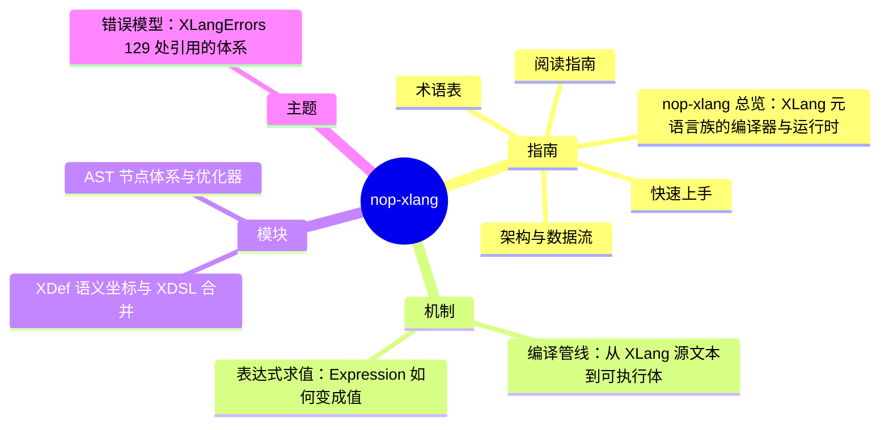

# nop-xlang DeepWiki

> 目标：nop-kernel/nop-xlang · 结构契约：[PLAN.md](./PLAN.md) · 本文件由 gen-wiki-meta.mjs 生成，勿手改

> 快照：nop-kernel/nop-xlang @ cadb264d10 · 2026-09-26

## 指南

- [overview](overview.md) — nop-xlang 总览：XLang 元语言族的编译器与运行时
- [quickstart](quickstart.md) — 快速上手
- [glossary](glossary.md) — 术语表
- [reading guide](reading-guide.md) — 阅读指南
- [architecture](architecture.md) — 架构与数据流

## 机制

- [flows compile pipeline](flows/compile-pipeline.md) — 编译管线：从 XLang 源文本到可执行体
- [flows expression eval](flows/expression-eval.md) — 表达式求值：Expression 如何变成值

## 模块

- [modules ast model](modules/ast-model.md) — AST 节点体系与优化器
- [modules xdef xdsl](modules/xdef-xdsl.md) — XDef 语义坐标与 XDSL 合并

## 主题

- [topics error model](topics/error-model.md) — 错误模型：XLangErrors 129 处引用的体系
