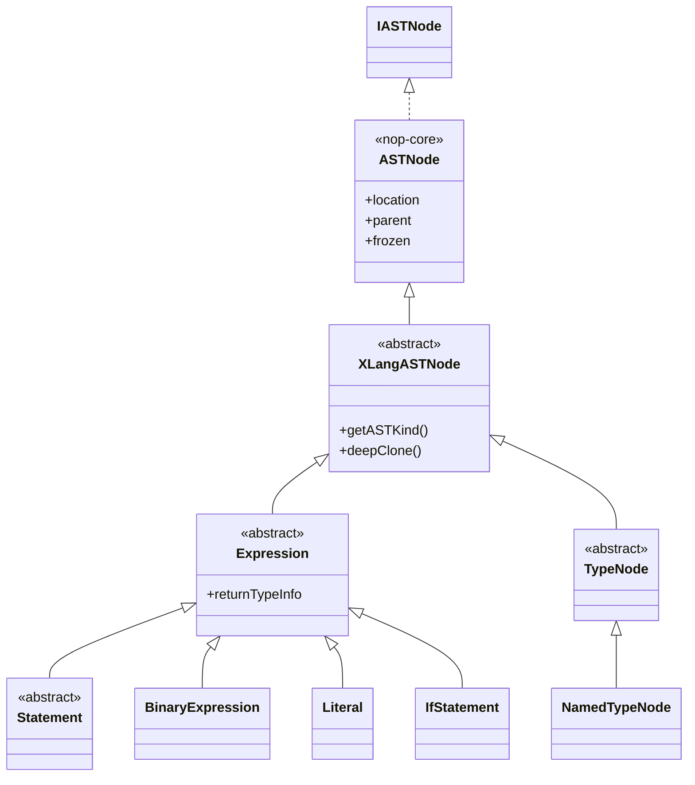
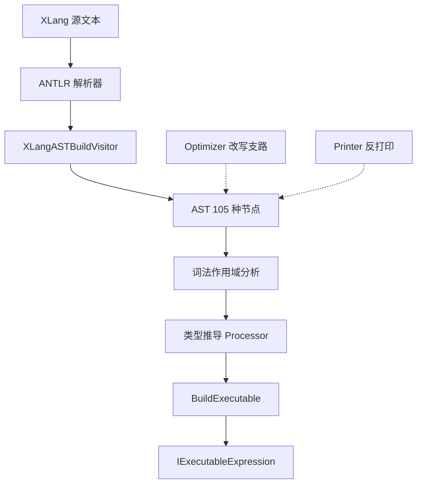
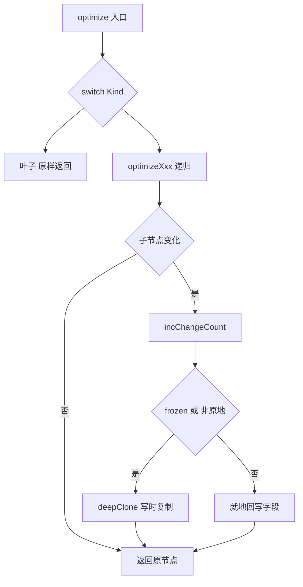

# AST 节点体系与优化器

> 源码锚点（本页断言均基于以下文件）：
>
> - [XLangASTNode.java](../../../nop-kernel/nop-xlang/src/main/java/io/nop/xlang/ast/XLangASTNode.java)
> - [XLangASTKind.java](../../../nop-kernel/nop-xlang/src/main/java/io/nop/xlang/ast/XLangASTKind.java)
> - [XLangASTVisitor.java](../../../nop-kernel/nop-xlang/src/main/java/io/nop/xlang/ast/XLangASTVisitor.java)
> - [XLangASTProcessor.java](../../../nop-kernel/nop-xlang/src/main/java/io/nop/xlang/ast/XLangASTProcessor.java)
> - [XLangASTOptimizer.java](../../../nop-kernel/nop-xlang/src/main/java/io/nop/xlang/ast/XLangASTOptimizer.java)
> - [AbstractOptimizer.java](../../../nop-kernel/nop-core/src/main/java/io/nop/core/lang/ast/optimize/AbstractOptimizer.java)
> - [trans/XLangASTTransformer.java](../../../nop-kernel/nop-xlang/src/main/java/io/nop/xlang/ast/trans/XLangASTTransformer.java)

本页描述 XLang 编译器的 AST 中枢：`io.nop.xlang.ast` 包（268 个 Java 文件：根目录 142 + `_gen` 117 + `print` 2 + `definition` 6 + `trans` 1）的节点分类、`XLangASTKind` 105 值枚举、三套生成的树遍历派发机制（Visitor/Processor/Optimizer），以及 `XLangASTOptimizer`（3028 行）的真实结构——一个统一改写骨架而非手工化简规则集。编译全链路见[编译管线](../flows/compile-pipeline.md)，AST 求值见[表达式求值](../flows/expression-eval.md)。

## 节点中枢：XLangASTNode 与 XLangASTKind

每个 AST 节点是一条五层继承链的具体类：`IASTNode` → `ASTNode<N>`（nop-core 通用树基础设施）→ `XLangASTNode` → `_gen/_Xxx` 生成基类 → 手写薄壳类。`IXLangASTNode` 只声明一个方法 `getASTKind()`（`nop-kernel/nop-xlang/src/main/java/io/nop/xlang/ast/IXLangASTNode.java:12-14`）；`XLangASTNode` 在其上补充抽象方法 `deepClone()` 与父节点 Kind 查询 `getASTParentKind()`（`nop-kernel/nop-xlang/src/main/java/io/nop/xlang/ast/XLangASTNode.java:13-27`），并沿父链向上查找词法作用域 `getLexicalScope()`（同文件 29-34 行）。

树的基础设施全部在 nop-core 的 `ASTNode<N>` 中：`location`（源码位置）、`leadingComment/trailingComment`、`frozen` 标志和 `parent` 指针（`nop-kernel/nop-core/src/main/java/io/nop/core/lang/ast/ASTNode.java:52-56`）。节点一旦冻结即只读——任何 setter 经 `checkAllowChange()` 抛 `ERR_LANG_AST_IS_READ_ONLY`（同文件 71-74 行）；同文件还定义了结构等价比较入口 `isEquivalentTo`（104 行）、深克隆（145 行）、子遍历 `forEachChild`/`processChild`（167/212 行）。全仓库 src/main 下约 150 个 Java 文件引用 `XLangASTNode`、约 120 个引用 `XLangASTKind`（子串匹配统计），是 nop-xlang 中扇入最高的类型。

`XLangASTKind` 是 105 个值的扁平枚举（ordinal 0–104，从 `CompilationUnit` 到 `CustomExpression`，`nop-kernel/nop-xlang/src/main/java/io/nop/xlang/ast/XLangASTKind.java:4-216`）。每个具体节点类在生成的 `_getASTKind()` 中返回唯一常量，如 `_BinaryExpression` 返回 `XLangASTKind.BinaryExpression`（`nop-kernel/nop-xlang/src/main/java/io/nop/xlang/ast/_gen/_BinaryExpression.java:185-187`）。Kind 就是整棵树的总开关：Visitor、Processor、Optimizer 三个 3000 行级类都用 `switch(kind)` 全量派发。

代码组织采用"双文件"模式：`_gen/_Xxx.java` 由 codegen 生成，承载全部字段、`getASTKind()`、`deepClone()`、`isEquivalentTo()` 与 JSON 序列化（如 `_BinaryExpression.java:80-108,164-187`）；手写薄壳只提供 `valueOf` 静态工厂和少量语义方法——`BinaryExpression` 全类 13 行，仅一个 `valueOf(loc,left,op,right)`（`nop-kernel/nop-xlang/src/main/java/io/nop/xlang/ast/BinaryExpression.java:14-26`）；`Literal` 提供 `stringValue/booleanValue/nullValue/numberValue` 工厂与 `toTruthy()`（`nop-kernel/nop-xlang/src/main/java/io/nop/xlang/ast/Literal.java:14-56`）。按 AGENTS.md 约束，`_gen/` 目录不可手改，新增节点须改生成模型后重新生成。

> Sources: [nop-kernel/nop-xlang/src/main/java/io/nop/xlang/ast/XLangASTNode.java:13-34](/nop-kernel/nop-xlang/src/main/java/io/nop/xlang/ast/XLangASTNode.java#L13-L34), [nop-kernel/nop-xlang/src/main/java/io/nop/xlang/ast/XLangASTKind.java:4-216](/nop-kernel/nop-xlang/src/main/java/io/nop/xlang/ast/XLangASTKind.java#L4-L216), [nop-kernel/nop-xlang/src/main/java/io/nop/xlang/ast/_gen/_BinaryExpression.java:80-187](/nop-kernel/nop-xlang/src/main/java/io/nop/xlang/ast/_gen/_BinaryExpression.java#L80-L187), [nop-kernel/nop-core/src/main/java/io/nop/core/lang/ast/ASTNode.java:44-227](/nop-kernel/nop-core/src/main/java/io/nop/core/lang/ast/ASTNode.java#L44-L227)

## 105 种节点的分组分类

枚举本身无分组声明，下表按语义将 105 个 Kind 归为 12 组（计数为本页归纳）：

| 分组 | 数量 | 代表 Kind | 说明 |
|---|---|---|---|
| 编译单元与模块 | 11 | CompilationUnit, Program, ImportDeclaration, ExportNamedDeclaration | 解析产物根与 ES 模块式 import/export |
| 语句 | 20 | IfStatement, ForOfStatement, TryStatement, UsingStatement, ExpressionStatement | 控制流；注意 Statement 继承自 Expression |
| 声明 | 9 | FunctionDeclaration, VariableDeclaration, ClassDefinition, EnumDeclaration, TypeAliasDeclaration | 具名定义，多带 Decorators |
| 字面量与标识符 | 5 | Literal, TemplateStringLiteral, RegExpLiteral, Identifier, QualifiedName | 叶子节点 |
| 表达式与运算 | 15 | BinaryExpression, AssignmentExpression, LogicalExpression, MemberExpression, CompareOpExpression, BetweenOpExpression | 含 XLang 特有比较算子（CompareOp/AssertOp/BetweenOp） |
| 调用与函数 | 6 | CallExpression, NewExpression, ArrowFunctionExpression, AwaitExpression, EvalExpression, SpreadElement | EvalExpression 支持运行期编译字符串 |
| 数据结构 | 6 | ArrayExpression, ObjectExpression, PropertyAssignment, TemplateExpression, ConcatExpression | 模板串/拼接统一为多子表达式 |
| 解构绑定 | 5 | ObjectBinding, ArrayBinding, RestBinding, PropertyBinding | `let {a,b} = obj` 类模式 |
| 类型节点 | 14 | NamedTypeNode, UnionTypeDef, FunctionTypeDef, CastExpression, InstanceOfExpression | `TypeNode` 与 `StructuredTypeDef` 两个抽象族 |
| XPL 输出与宏 | 8 | MacroExpression, TextOutputExpression, GenNodeExpression, OutputXmlAttrExpression | XPL 模板编译专用（见下） |
| 元数据与装饰器 | 5 | Decorators, Decorator, MetaObject, MetaProperty, MetaArray | xbiz/xmeta 元数据载体 |
| 扩展点 | 1 | CustomExpression | 外部系统注入自定义表达式 |

两个容易误判的设计点：

1. **一切皆表达式**。生成的 `_Statement` 继承自 `Expression` 而非相反（`nop-kernel/nop-xlang/src/main/java/io/nop/xlang/ast/_gen/_Statement.java:11`），因此 if/块/循环都可以出现在表达式位置——这也是编译管线中 `optimizeIfStatement` 的分支参数类型是 `Expression` 的原因（`nop-kernel/nop-xlang/src/main/java/io/nop/xlang/ast/XLangASTOptimizer.java:470-488`）。`Expression` 手写壳增加类型推导结果字段 `returnTypeInfo` 与反打印方法 `toExprString()`（`nop-kernel/nop-xlang/src/main/java/io/nop/xlang/ast/Expression.java:18-39`）。
2. **存在 Kind 表之外的抽象节点**。`FilterOpExpression`（filter 算子基类，携带 `op/errorCode/label` 字段）不在 `XLangASTKind` 枚举中，其生成基类也没有 `getASTKind()` 覆写——它是纯抽象辅助基类，仓库内仅测试代码有子类（`nop-kernel/nop-xlang/src/main/java/io/nop/xlang/ast/_gen/_FilterOpExpression.java:11-20`、`ast/FilterOpExpression.java:19-23`）。同理 `Statement/Declaration/TypeNode/ModuleSpecifier` 等手写壳都是无 Kind 的中间抽象层。

节点层级抽样（按 Kind 分组，非全量）：

> Sources: [nop-kernel/nop-xlang/src/main/java/io/nop/xlang/ast/XLangASTKind.java:4-216](/nop-kernel/nop-xlang/src/main/java/io/nop/xlang/ast/XLangASTKind.java#L4-L216), [nop-kernel/nop-xlang/src/main/java/io/nop/xlang/ast/_gen/_Statement.java:11](/nop-kernel/nop-xlang/src/main/java/io/nop/xlang/ast/_gen/_Statement.java#L11), [nop-kernel/nop-xlang/src/main/java/io/nop/xlang/ast/Expression.java:18-45](/nop-kernel/nop-xlang/src/main/java/io/nop/xlang/ast/Expression.java#L18-L45), [nop-kernel/nop-xlang/src/main/java/io/nop/xlang/ast/FilterOpExpression.java:19-23](/nop-kernel/nop-xlang/src/main/java/io/nop/xlang/ast/FilterOpExpression.java#L19-L23)

## 三套生成派发：Visitor / Processor / Optimizer

围绕同一 Kind 枚举，codegen 生成三个同构的 `switch(kind)` 全量派发类，构成对 AST 的三种只读/改写访问姿势：

| 派发类 | 签名 | 派发到 | 已知子类 | 失败语义 |
|---|---|---|---|---|
| `XLangASTVisitor` | `void visit(node)` | `visitXxx(node)`，默认实现遍历子节点 | `LexicalScopeAnalysis`、`XLangExpressionPrinter` | 未知 Kind 抛 `IllegalArgumentException` |
| `XLangASTProcessor<T,C>` | `T processAST(node,ctx)` | `processXxx(node,ctx)`，默认 `defaultProcess` 返回 null | `TypeInferenceProcessor<ReturnTypeInfo,TypeInferenceState>`、`BuildExecutableProcessor<IExecutableExpression,IXLangCompileScope>` | 未知 Kind 抛 `IllegalArgumentException` |
| `XLangASTOptimizer<C>` | `XLangASTNode optimize(node,ctx)` | `optimizeXxx(node,ctx)`，默认自底向上替换子节点 | 匿名子类（仅 `XLangASTTransformer.replaceIdentifier`） | 未知 Kind 抛 `IllegalArgumentException` |

`XLangASTVisitor.visit()` 对 105 个 Kind 逐一 `case` 转发（`nop-kernel/nop-xlang/src/main/java/io/nop/xlang/ast/XLangASTVisitor.java:10-435`），每个 `visitXxx` 的默认实现按子节点声明顺序调用 `visitChild/visitChildren`——如 `visitIfStatement` 依次访问 test/consequent/alternate（同文件 487-492 行）。词法作用域分析器 `LexicalScopeAnalysis` 继承它并覆写关键节点（`nop-kernel/nop-xlang/src/main/java/io/nop/xlang/compile/LexicalScopeAnalysis.java:128`）；AST 反打印器 `XLangExpressionPrinter` 同样以 Visitor 方式复刻源码文本（`nop-kernel/nop-xlang/src/main/java/io/nop/xlang/ast/print/XLangExpressionPrinter.java:123`）。

`XLangASTProcessor` 是"每 Kind 产出结果"的有转换发：`TypeInferenceProcessor` 产出 `ReturnTypeInfo`（`nop-kernel/nop-xlang/src/main/java/io/nop/xlang/compile/TypeInferenceProcessor.java:118`），`BuildExecutableProcessor` 产出可执行体 `IExecutableExpression`（`nop-kernel/nop-xlang/src/main/java/io/nop/xlang/compile/BuildExecutableProcessor.java:263`）。二者在表达式编译入口 `XLangExprParser.buildExecutable` 中先后接线：先 `LexicalScopeAnalysis.analyze`，再按配置开关 `CFG_XLANG_TYPE_INFERENCE_ENABLED` 做类型推导（错误仅告警不中断），最后 `BuildExecutableProcessor.processAST` 生成可执行体（`nop-kernel/nop-xlang/src/main/java/io/nop/xlang/expr/XLangExprParser.java:61-82`）。解析侧由 ANTLR 生成的 `XLangParseTreeParser` 产出语法树，再经 `XLangASTBuildVisitor.visitProgram` 建成本 AST（`nop-kernel/nop-xlang/src/main/java/io/nop/xlang/expr/XLangExprParser.java:34-40`、`nop-kernel/nop-xlang/src/main/java/io/nop/xlang/parse/XLangASTParser.java:11-36`）。

三个派发类与 Kind 枚举由同一 codegen 同步生成（文件头均有 `__XGEN_FORCE_OVERRIDE__` 标记，如 `nop-kernel/nop-xlang/src/main/java/io/nop/xlang/ast/XLangASTKind.java:1`），这保证新增 Kind 时三套派发不会遗漏——代价是三个文件都在 2000–3000 行量级。

> Sources: [nop-kernel/nop-xlang/src/main/java/io/nop/xlang/ast/XLangASTVisitor.java:10-492](/nop-kernel/nop-xlang/src/main/java/io/nop/xlang/ast/XLangASTVisitor.java#L10-L492), [nop-kernel/nop-xlang/src/main/java/io/nop/xlang/ast/XLangASTProcessor.java:5-757](/nop-kernel/nop-xlang/src/main/java/io/nop/xlang/ast/XLangASTProcessor.java#L5-L757), [nop-kernel/nop-xlang/src/main/java/io/nop/xlang/expr/XLangExprParser.java:34-82](/nop-kernel/nop-xlang/src/main/java/io/nop/xlang/expr/XLangExprParser.java#L34-L82), [nop-kernel/nop-xlang/src/main/java/io/nop/xlang/compile/BuildExecutableProcessor.java:263](/nop-kernel/nop-xlang/src/main/java/io/nop/xlang/compile/BuildExecutableProcessor.java#L263)

## XLangASTOptimizer：统一改写骨架而非折叠规则

3028 行的 `XLangASTOptimizer<C>`（`nop-kernel/nop-xlang/src/main/java/io/nop/xlang/ast/XLangASTOptimizer.java:8`）很容易被误读为"105 条化简规则"。逐方法核对后的事实是：**它不含任何常量折叠**——全文件没有一处构造 `Literal` 或合并表达式的代码，每个 `optimizeXxx` 都是同一模板的实例。真正的机制在基类 `AbstractOptimizer`（nop-core）中：变更计数 `changeCount`（`nop-kernel/nop-core/src/main/java/io/nop/core/lang/ast/optimize/AbstractOptimizer.java:17-30`）、写时复制判定 `shouldClone`（40-48 行：节点已冻结或非原地模式时 `deepClone`）、列表级联替换 `optimizeList`（50-84 行）与父指针清理 `clearParent`（86-92 行）。

因此这 3028 行应按"骨架 + 钩子"分类，而非逐条规则罗列：

| 类别 | 覆写方法示例 | 行为 | 代码锚点 |
|---|---|---|---|
| 叶子恒等 | optimizeIdentifier, optimizeLiteral, optimizeTextOutputExpression | 无子节点，直接返回原节点 | XLangASTOptimizer.java:370-375, 2223-2229 |
| 单子节点替换 | optimizeUnaryExpression, optimizeEvalExpression, optimizeThrowStatement | 递归优化唯一子节点，变化则计数+回写 | 同文件 1301-1317, 1500-1516, 564-580 |
| 双子节点替换 | optimizeBinaryExpression, optimizeAssignmentExpression, optimizeCompareOpExpression | left/right 逐一递归替换 | 同文件 1337-1364, 1413-1440, 2266+ |
| 列表节点替换 | optimizeCompilationUnit, optimizeProgram, optimizeSwitchStatement | `optimizeList` 批量替换，支持剔除空项 | 同文件 334-350, 352-368, 495-533 |
| 变更追踪 | 全部方法共用 | `incChangeCount` + `shouldClone` 冻结节点写时克隆 | AbstractOptimizer.java:28-48 |
| 定制钩子 | 匿名子类覆写 optimizeXxx | 外部注入替换规则，是本类唯一预期扩展方式 | trans/XLangASTTransformer.java:17-29 |

优化器的设计意图在其唯一内置用例中体现得最清楚：`XLangASTTransformer.replaceIdentifier` 用匿名子类覆写 `optimizeIdentifier`，把指定名字的标识符替换为给定表达式或 `Literal.valueOf` 包装值，其余 Kind 走默认的自底向上遍历（`nop-kernel/nop-xlang/src/main/java/io/nop/xlang/ast/trans/XLangASTTransformer.java:16-29`）；`Expression.replaceIdentifier` 将其暴露为节点 API（`nop-kernel/nop-xlang/src/main/java/io/nop/xlang/ast/Expression.java:44-45`）。写时复制机制保证被冻结的共享 AST 在改写时不被污染——替换发生后原树保持原样，新树通过 `deepClone` 独立存在。

同一骨架在仓库中复制了三份：`EqlASTOptimizer`（`nop-persistence/nop-orm-eql/src/main/java/io/nop/orm/eql/ast/EqlASTOptimizer.java:8`）、`GraphQLASTOptimizer`（`nop-service-framework/nop-graphql/nop-graphql-core/src/main/java/io/nop/graphql/core/ast/GraphQLASTOptimizer.java:8`）、`MermaidASTOptimizer`（`nop-format/nop-mermaid/src/main/java/io/nop/mermaid/ast/MermaidASTOptimizer.java:8`）均直接继承 nop-core 的 `AbstractOptimizer`，印证"Kind 派发改写骨架"是平台级模式而非 XLang 特例。

> Sources: [nop-kernel/nop-xlang/src/main/java/io/nop/xlang/ast/XLangASTOptimizer.java:8-493](/nop-kernel/nop-xlang/src/main/java/io/nop/xlang/ast/XLangASTOptimizer.java#L8-L493), [nop-kernel/nop-core/src/main/java/io/nop/core/lang/ast/optimize/AbstractOptimizer.java:16-93](/nop-kernel/nop-core/src/main/java/io/nop/core/lang/ast/optimize/AbstractOptimizer.java#L16-L93), [nop-kernel/nop-xlang/src/main/java/io/nop/xlang/ast/trans/XLangASTTransformer.java:16-29](/nop-kernel/nop-xlang/src/main/java/io/nop/xlang/ast/trans/XLangASTTransformer.java#L16-L29)

## 配套设施：工厂、打印与标识符定义

- **`XLangASTBuilder`**：程序化构造 AST 的静态工厂集合，如 `let`（`nop-kernel/nop-xlang/src/main/java/io/nop/xlang/ast/XLangASTBuilder.java:27`）、`buildTypeNode`（183 行）、`buildParams`（193 行）、`buildPropExpr`（260 行），供编译器各 pass 内部拼装节点。
- **`print/`**：`XLangExpressionPrinter` 继承 `XLangASTVisitor`，把 AST 还原为表达式文本；`XLangSourcePrinter` 在其上输出源码级格式（`nop-kernel/nop-xlang/src/main/java/io/nop/xlang/ast/print/XLangExpressionPrinter.java:123`、`print/XLangSourcePrinter.java:15`）。`Expression.toExprString()` 是其常用入口，日志与调试信息依赖它。
- **`IdentifierKind`**：13 值枚举，把标识符分为 IMPORT_CLASS_DECL / PARAM_DECL / VAR_DECL / FUNC_DECL / GLOBAL_VAR_REF / SCOPE_VAR_REF / CLOSURE_VAR_REF / VAR_REF 等（`nop-kernel/nop-xlang/src/main/java/io/nop/xlang/ast/IdentifierKind.java:13-66`），是词法作用域分析把 `Identifier` 解析为带类别引用的依据。
- **`definition/`**：解析结果的具体化——`GlobalVarDefinition`、`LocalVarDeclaration`、`ClosureRefDefinition`、`ResolvedFuncDefinition` 等类描述标识符绑定到的目标，衔接作用域模型。

XPL 模板编译使用的 8 个输出类 Kind（TextOutput/EscapeOutput/CollectOutput/GenNode/OutputXmlAttr 等）也在本包内定义，但它们的编译语义归属模板引擎，见[编译管线](../flows/compile-pipeline.md)；求值期这些节点如何变成值见[表达式求值](../flows/expression-eval.md)。术语对照见[术语表](../glossary.md)。

> Sources: [nop-kernel/nop-xlang/src/main/java/io/nop/xlang/ast/XLangASTBuilder.java:21-285](/nop-kernel/nop-xlang/src/main/java/io/nop/xlang/ast/XLangASTBuilder.java#L21-L285), [nop-kernel/nop-xlang/src/main/java/io/nop/xlang/ast/print/XLangExpressionPrinter.java:123](/nop-kernel/nop-xlang/src/main/java/io/nop/xlang/ast/print/XLangExpressionPrinter.java#L123), [nop-kernel/nop-xlang/src/main/java/io/nop/xlang/ast/IdentifierKind.java:13-66](/nop-kernel/nop-xlang/src/main/java/io/nop/xlang/ast/IdentifierKind.java#L13-L66)

## Sources

- [nop-kernel/nop-xlang/src/main/java/io/nop/xlang/ast/XLangASTNode.java:13-34](/nop-kernel/nop-xlang/src/main/java/io/nop/xlang/ast/XLangASTNode.java#L13-L34)
- [nop-kernel/nop-xlang/src/main/java/io/nop/xlang/ast/IXLangASTNode.java:12-14](/nop-kernel/nop-xlang/src/main/java/io/nop/xlang/ast/IXLangASTNode.java#L12-L14)
- [nop-kernel/nop-xlang/src/main/java/io/nop/xlang/ast/XLangASTKind.java:4-216](/nop-kernel/nop-xlang/src/main/java/io/nop/xlang/ast/XLangASTKind.java#L4-L216)
- [nop-kernel/nop-xlang/src/main/java/io/nop/xlang/ast/XLangASTVisitor.java:7-492](/nop-kernel/nop-xlang/src/main/java/io/nop/xlang/ast/XLangASTVisitor.java#L7-L492)
- [nop-kernel/nop-xlang/src/main/java/io/nop/xlang/ast/XLangASTProcessor.java:5-757](/nop-kernel/nop-xlang/src/main/java/io/nop/xlang/ast/XLangASTProcessor.java#L5-L757)
- [nop-kernel/nop-xlang/src/main/java/io/nop/xlang/ast/XLangASTOptimizer.java:8-1364](/nop-kernel/nop-xlang/src/main/java/io/nop/xlang/ast/XLangASTOptimizer.java#L8-L1364)
- [nop-kernel/nop-xlang/src/main/java/io/nop/xlang/ast/_gen/_BinaryExpression.java:80-187](/nop-kernel/nop-xlang/src/main/java/io/nop/xlang/ast/_gen/_BinaryExpression.java#L80-L187)
- [nop-kernel/nop-xlang/src/main/java/io/nop/xlang/ast/_gen/_Statement.java:11](/nop-kernel/nop-xlang/src/main/java/io/nop/xlang/ast/_gen/_Statement.java#L11)
- [nop-kernel/nop-xlang/src/main/java/io/nop/xlang/ast/Expression.java:18-45](/nop-kernel/nop-xlang/src/main/java/io/nop/xlang/ast/Expression.java#L18-L45)
- [nop-kernel/nop-xlang/src/main/java/io/nop/xlang/ast/trans/XLangASTTransformer.java:16-29](/nop-kernel/nop-xlang/src/main/java/io/nop/xlang/ast/trans/XLangASTTransformer.java#L16-L29)
- [nop-kernel/nop-core/src/main/java/io/nop/core/lang/ast/ASTNode.java:44-227](/nop-kernel/nop-core/src/main/java/io/nop/core/lang/ast/ASTNode.java#L44-L227)
- [nop-kernel/nop-core/src/main/java/io/nop/core/lang/ast/optimize/AbstractOptimizer.java:16-93](/nop-kernel/nop-core/src/main/java/io/nop/core/lang/ast/optimize/AbstractOptimizer.java#L16-L93)
- [nop-kernel/nop-xlang/src/main/java/io/nop/xlang/expr/XLangExprParser.java:34-82](/nop-kernel/nop-xlang/src/main/java/io/nop/xlang/expr/XLangExprParser.java#L34-L82)
- [nop-kernel/nop-xlang/src/main/java/io/nop/xlang/compile/LexicalScopeAnalysis.java:128](/nop-kernel/nop-xlang/src/main/java/io/nop/xlang/compile/LexicalScopeAnalysis.java#L128)
- [nop-kernel/nop-xlang/src/main/java/io/nop/xlang/compile/TypeInferenceProcessor.java:118](/nop-kernel/nop-xlang/src/main/java/io/nop/xlang/compile/TypeInferenceProcessor.java#L118)
- [nop-kernel/nop-xlang/src/main/java/io/nop/xlang/compile/BuildExecutableProcessor.java:263](/nop-kernel/nop-xlang/src/main/java/io/nop/xlang/compile/BuildExecutableProcessor.java#L263)

---

## On this page

- 节点中枢：XLangASTNode 与 XLangASTKind
- 105 种节点的分组分类
- 三套生成派发：Visitor / Processor / Optimizer
- XLangASTOptimizer：统一改写骨架而非折叠规则
- 配套设施：工厂、打印与标识符定义
