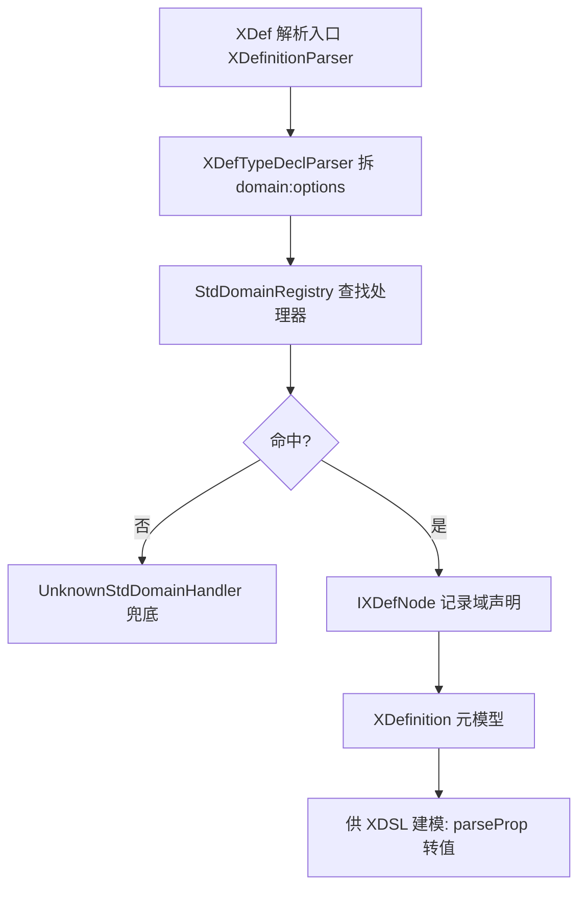
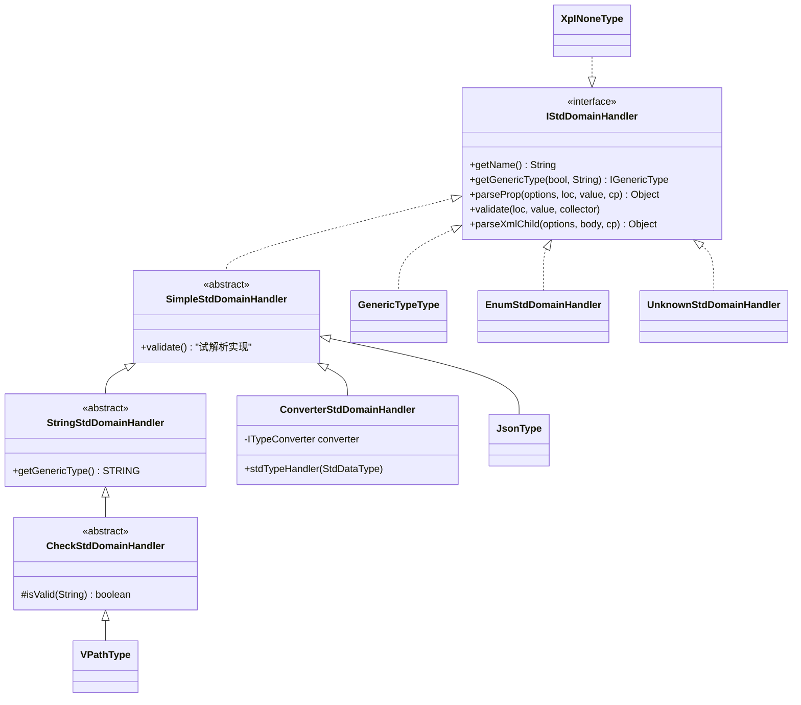
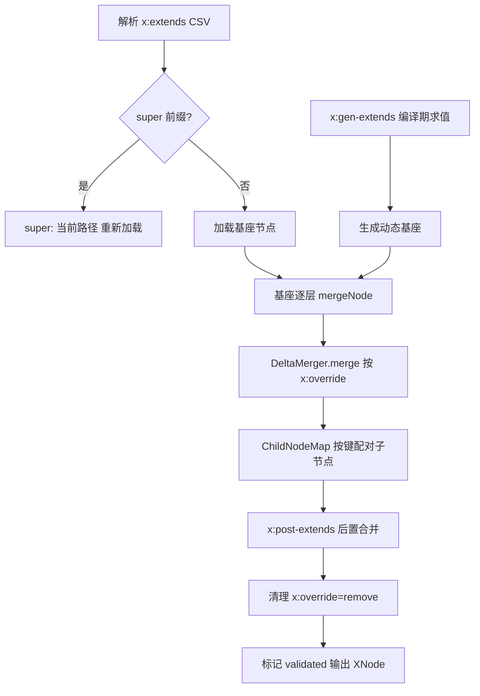

# XDef 语义坐标与 XDSL 模型合并

XDef 把 XML 属性值替换为带"标准域"（std-domain）的类型声明，形成模型的结构坐标；XDSL 在此坐标上定义 `x:extends` 合并与 delta 差量定制。本页追踪两条实现线：`xdef/` 的域处理器注册与解析（SimpleStdDomainHandlers 73 个内置域），`xdsl/`+`delta/` 的合并算子与原型展开。概念背景另见[术语表](../glossary.md)。

> 主要源文件：
> - [../../../nop-kernel/nop-xlang/src/main/java/io/nop/xlang/xdef/domain/SimpleStdDomainHandlers.java](../../../nop-kernel/nop-xlang/src/main/java/io/nop/xlang/xdef/domain/SimpleStdDomainHandlers.java)（1957 行，内置域处理器集合）
> - [../../../nop-kernel/nop-xlang/src/main/java/io/nop/xlang/xdef/domain/StdDomainRegistry.java](../../../nop-kernel/nop-xlang/src/main/java/io/nop/xlang/xdef/domain/StdDomainRegistry.java)（域注册表）
> - [../../../nop-kernel/nop-xlang/src/main/java/io/nop/xlang/xdef/IStdDomainHandler.java](../../../nop-kernel/nop-xlang/src/main/java/io/nop/xlang/xdef/IStdDomainHandler.java)（域处理器接口）
> - [../../../nop-kernel/nop-xlang/src/main/java/io/nop/xlang/xdef/parse/XDefinitionParser.java](../../../nop-kernel/nop-xlang/src/main/java/io/nop/xlang/xdef/parse/XDefinitionParser.java)（XDef 元模型解析器）
> - [../../../nop-kernel/nop-xlang/src/main/java/io/nop/xlang/xdsl/XDslExtender.java](../../../nop-kernel/nop-xlang/src/main/java/io/nop/xlang/xdsl/XDslExtender.java)（`x:extends` 展开）
> - [../../../nop-kernel/nop-xlang/src/main/java/io/nop/xlang/delta/DeltaMerger.java](../../../nop-kernel/nop-xlang/src/main/java/io/nop/xlang/delta/DeltaMerger.java)（合并算子执行）
> - [../../../nop-kernel/nop-xlang/src/main/java/io/nop/xlang/delta/OverrideHelper.java](../../../nop-kernel/nop-xlang/src/main/java/io/nop/xlang/delta/OverrideHelper.java)（算子结合律表）
> - [../../../docs-for-ai/02-core-guides/xdef-and-xdsl.md](../../../docs-for-ai/02-core-guides/xdef-and-xdsl.md)（概念定义，非代码来源）

## XDef：元模型与语义坐标的定义

平台文档将 XDef 定义为"统一元模型语言"：所有 DSL（ORM、beans、页面等）由 XDef 定义，且元模型与最终 XML 基本同构，只是把具体值替换为类型声明（`docs-for-ai/02-core-guides/xdef-and-xdsl.md:3-17`）。源码中这个"类型声明"就是 `XDefTypeDecl`——属性值写作 `域:选项` 语法（如 `int`、`v-path`、`enum:xxx`），由 `XDefTypeDeclParser.parseFromText` 拆出 stdDomain 与 options 两段（`nop-kernel/nop-xlang/src/main/java/io/nop/xlang/xdef/parse/XDefTypeDeclParser.java:30-89`），入口 `XDslParseHelper.parseDefType` 带缓存（`nop-kernel/nop-xlang/src/main/java/io/nop/xlang/xdsl/XDslParseHelper.java:357-363`）。

`xdef/` 目录 62 个文件分三块：

- **模型接口**（`xdef/` 根）：`IXDefinition`/`IXDefNode`/`IXDefAttribute` 等元模型节点接口，加 `XDefConstants`（99 个 `STD_DOMAIN_*` 常量，`nop-kernel/nop-xlang/src/main/java/io/nop/xlang/xdef/XDefConstants.java:19-167`）、覆盖算子枚举 `XDefOverride`（`nop-kernel/nop-xlang/src/main/java/io/nop/xlang/xdef/XDefOverride.java:19-50`）。
- **实现**（`impl/`）：`XDefinition`、`XDefNode`、四类约束检查（`XDefCheckRef/Require/Unique/Mutex`）、`XDefToObjMeta`（导出对象元数据）、`XDefRefResolver`。
- **解析**（`parse/`）：`XDefinitionParser` 把 `.xdef` XML 解析为 `XDefinition` 元模型——它本身继承 `AbstractDslParser<XDefinition>`（`nop-kernel/nop-xlang/src/main/java/io/nop/xlang/xdef/parse/XDefinitionParser.java:98`），逐节点建立 `XDefNode`（`parseNode` 298 行起）、收集 `xdef:name`/`xdef:id` 本地引用（250-283 行）、解析约束检查（723 行起）。

域解析的入口在解析器里是一个薄查找：`getStdDomainHandler` 委托 `StdDomainRegistry.instance()`，查不到且允许时用 `UnknownStdDomainHandler` 兜底（`nop-kernel/nop-xlang/src/main/java/io/nop/xlang/xdef/parse/XDefinitionParser.java:130-135`）。注册表本身是 `ConcurrentHashMap` 单例；未命中时若域 名以 `-string` 后缀结尾则回退到 `string` 域（`nop-kernel/nop-xlang/src/main/java/io/nop/xlang/xdef/domain/StdDomainRegistry.java:32-40`）。

> Sources: SimpleStdDomainHandlers.java (81-1957), StdDomainRegistry.java (19-40), XDefinitionParser.java (98-160), XDefTypeDeclParser.java (30-89), XDefConstants.java (19-167), docs-for-ai/02-core-guides/xdef-and-xdsl.md (3-17)

## 标准域处理器体系：SimpleStdDomainHandlers 与分类

`IStdDomainHandler` 接口约定每个域要提供：`getName`、`getGenericType(mandatory, options)`（推断解析结果的泛型类型）、`parseProp`（字符串到值的解析）、`validate`（校验）、`parseXmlChild`/`supportXmlChild`（XML 子节点形式）、`serializeToString`（`nop-kernel/nop-xlang/src/main/java/io/nop/xlang/xdef/IStdDomainHandler.java:27-86`）。基类链把实现成本压到最低：`SimpleStdDomainHandler` 用"试解析"实现 `validate`（`nop-kernel/nop-xlang/src/main/java/io/nop/xlang/xdef/domain/SimpleStdDomainHandler.java:14-23`）；`StringStdDomainHandler` 固定返回字符串类型（`nop-kernel/nop-xlang/src/main/java/io/nop/xlang/xdef/domain/StringStdDomainHandler.java:13-24`）；`CheckStdDomainHandler` 只留一个 `isValid(text)` 模板方法，通过则原样返回文本（`nop-kernel/nop-xlang/src/main/java/io/nop/xlang/xdef/domain/CheckStdDomainHandler.java:20-36`）；`ConverterStdDomainHandler` 包装 `ITypeConverter`，并为每个 `StdDataType` 批量生成处理器（`nop-kernel/nop-xlang/src/main/java/io/nop/xlang/xdef/domain/ConverterStdDomainHandler.java:26-84`）。

`SimpleStdDomainHandlers`（1957 行）是 73 个静态内部类的集合（`nop-kernel/nop-xlang/src/main/java/io/nop/xlang/xdef/domain/SimpleStdDomainHandlers.java:81-1957`），按解析逻辑可归为六类：

| 分类 | 代表域（类 → 域名） | 解析逻辑 | 代码落点 |
|---|---|---|---|
| 路径解析 | `v-path`、`name-or-v-path`、`xdef-ref`、`v-path-list` | 校验 VPath 后用 `StringHelper.absolutePath` 把相对路径转为相对当前文件的绝对路径；`name-or-v-path` 无 `.` 时按名字返回 | SimpleStdDomainHandlers.java:82-178 |
| 名称校验 | `class-name`、`bean-name`、`xml-name`、`var-name`、`java-name`、`prop-name`、`nop-module-id`、`url`、`email`、`regex` 等约 20 个 | `CheckStdDomainHandler.isValid` 断言格式，通过后返回原文 | SimpleStdDomainHandlers.java:269-658 |
| 类型转换 | `int-list`、`int-range`、`long-size`、`boolFlag`、`double-percent`、`csv-set`、`csv-list`、`std-sql-type`、`field-selection`、`sql-order-by` 等 | `parseProp` 调 `ConvertHelper`/专用 Parser 把文本转成 List、Range、Bean 等强类型值 | SimpleStdDomainHandlers.java:180-213, 487-585, 1608-1730, 1922-1956 |
| 结构化文本 | `json`、`json-map`、`xml`、`xml-body`、`filter-bean`、`xjson-node` | 把属性文本解析为 JSON 容器或 `XNode` 树 | SimpleStdDomainHandlers.java:722-973 |
| 类型表达式 | `generic-type`、`generic-type-list`、`jpath`、`xpath` | 直接实现 `IStdDomainHandler`，调 `GenericTypeParser`/XPath 引擎 | SimpleStdDomainHandlers.java:1173-1296, 1732-1795 |
| 词法集合 | `prop-name-set`、`word-set` | 继承 `AbstractStringSetType`，CSV 拆分进 `Set` | SimpleStdDomainHandlers.java:587-607 |

注册表 `registerDefaults` 装配全部内置域：上面 73 个类逐一 `new`，再按 `StdDataType` 枚举批量注册转换域、`"text"` 作为 `string` 别名、`"full-path"` 别名，以及 `XplStdDomainHandlers` 的 17 个 XPL 族域（`xpl`、`xpl-fn`、`eval-code`、`expr`、`xt-expr` 等，编译为可执行模板/表达式而非普通值）、`enum`/`dict`（查 `DictProvider` 字典）、`xjson`/`xjson-list`/`xjson-map`（`nop-kernel/nop-xlang/src/main/java/io/nop/xlang/xdef/domain/StdDomainRegistry.java:50-191`）。

域处理器真正的消费点在模型构建侧：`DslBeanModelParser`（继承 `DslXNodeToJsonTransformer`，`nop-kernel/nop-xlang/src/main/java/io/nop/xlang/xdsl/json/DslBeanModelParser.java:27`）遍历 DSL 节点时按属性上的 `XDefTypeDecl` 取 handler 并调 `parseProp` 产出强类型值（`nop-kernel/nop-xlang/src/main/java/io/nop/xlang/xdsl/json/DslXNodeToJsonTransformer.java:417-418`），XML 体则走 `parseXmlChild`（435-447 行）。这就是"语义坐标"的机制含义：XDef 声明域 → 注册表定位 handler → `parseProp` 决定值形态。

> Sources: IStdDomainHandler.java (27-86), SimpleStdDomainHandler.java (14-23), StringStdDomainHandler.java (13-24), CheckStdDomainHandler.java (20-36), ConverterStdDomainHandler.java (26-84), SimpleStdDomainHandlers.java (81-1957), StdDomainRegistry.java (50-191), XplStdDomainHandlers.java (57-684), DslXNodeToJsonTransformer.java (400-472)

## XDSL 模型加载与 x:extends 合并语义

XDSL 模型解析的骨架在 `AbstractDslParser.doParseResource`：加载器按 `XDslExtendPhase`（`buildBase → mergeBase → postExtends → validate`，`nop-kernel/nop-xlang/src/main/java/io/nop/xlang/xdsl/XDslExtendPhase.java:8-25`）执行 x-extends 展开，然后依次 `applyCompileConfig`（`x:config` 的 import）、`runPreParse`（`x:pre-parse`）、`doParseNode`（域解析建对象）、`runPostParse`（`x:post-parse`）（`nop-kernel/nop-xlang/src/main/java/io/nop/xlang/xdsl/AbstractDslParser.java:127-226`）。具体建对象由 `DslModelParser.doParseNode0` 分派：`dynamic`/`forEditor` 模式转 JSON 视图，否则 `DslBeanModelParser.transformToObject` 反射装配目标 Bean 并回调 `INeedInit.init()`（`nop-kernel/nop-xlang/src/main/java/io/nop/xlang/xdsl/DslModelParser.java:110-136`）。

`XDslExtender` 是 `x:extends` 的执行器，合并顺序有三条硬规则：

1. **线性化**：`buildSource` 解析 `x:extends` CSV，`none` 忽略 defaultExtends，`super` 展开为 `super:{当前路径}`（delta 定制入口），每个基座递归 `buildSource`；`x:gen-extends` 在编译期求值生成动态基座后即删除（`nop-kernel/nop-xlang/src/main/java/io/nop/xlang/xdsl/XDslExtender.java:265-312`）。
2. **从内向外**：`extendNode` 先按列表顺序把外部基座逐层 `mergeNode` 进 base，最后再把当前节点合并上来（230-239 行）。
3. **子节点自动 replace**：子节点若自带 `x:extends`，`extendsSub` 递归先展开它，展开完的子树被标记 `x:override=replace` 并 `x:validated=true`，防止父继承方向再向该子树合并（`nop-kernel/nop-xlang/src/main/java/io/nop/xlang/xdsl/XDslExtender.java:116-127, 411-439`）。平台文档把同一语义描述为"子节点 x:extends 的隐式 replace"（`docs-for-ai/02-core-guides/xdef-and-xdsl.md:399-431`）。

真正的节点合并委托给 `delta/DeltaMerger`，算子由 `x:override` 属性（`XDefOverride` 枚举 8 个值）驱动。默认算子依元模型而定：叶子节点（无子定义）默认 `merge-replace`，其余默认 `merge`（`nop-kernel/nop-xlang/src/main/java/io/nop/xlang/delta/DeltaMerger.java:47-60`）。

| `x:override` | DeltaMerger 方法 | 属性处理 | 体/子节点处理 | 落点 |
|---|---|---|---|---|
| merge（默认） | `overrideMerge` | 合并属性 | xb 有子则按键递归 `mergeChildren`，仅有文本则覆盖 xa 文本 | DeltaMerger.java:186-206 |
| replace | `overrideReplace` | 清空后继承 xb | 体整体替换 | DeltaMerger.java:157-160 |
| remove | `overrideRemove` | 仅保留唯一键 | 清体；xa 转为 `x:abstract` | DeltaMerger.java:141-155, 78-81 |
| append / prepend | `overrideAppend/Prepend` | 合并属性 | xa 插入 `x:super` 占位后追加/前插 xb 子节点 | DeltaMerger.java:162-174, 208-214 |
| merge-replace | `overrideMergeReplace` | 合并属性 | 属性合并 + 体替换 | DeltaMerger.java:176-179 |
| merge-super | `overrideMergeSuper` | 合并属性 | xb 中 `x:super` 位置替换为 xa 克隆 | DeltaMerger.java:181-184, 255-258 |
| bounded-merge | `overrideMerge(bounded=true)` | 合并属性 | 无法按键匹配时直接追加而非交叉排序 | DeltaMerger.java:186-206, 310-313 |

子节点配对由 `ChildNodeMap` 决定：优先按元模型声明的 `xdef:key-attr`，其次 `xdef:unique-attr`（含属性缺省值参与配对），否则按 tagName 分组（`nop-kernel/nop-xlang/src/main/java/io/nop/xlang/delta/ChildNodeMap.java:76-133`）。递归合并前还要过两道闸。其一，`x:final` 节点禁止被覆盖（`DeltaMerger.java:62-68`）。其二，两节点算子组合不满足结合律时抛 `ERR_XDSL_NOT_ALLOW_MERGE_BETWEEN_NODE`（抛出点 `DeltaMerger.java:57-60`）。结合律结果由 `OverrideHelper` 的静态矩阵给出，例如 `append∘append=append`、`append∘merge` 非法、`merge∘append=replace`（`nop-kernel/nop-xlang/src/main/java/io/nop/xlang/delta/OverrideHelper.java:30-131`）。

> Sources: AbstractDslParser.java (127-226), DslModelParser.java (110-136), XDslExtendPhase.java (8-25), XDslExtender.java (82-137, 265-312, 411-469), DeltaMerger.java (47-214, 255-326), OverrideHelper.java (30-131), ChildNodeMap.java (76-133), docs-for-ai/02-core-guides/xdef-and-xdsl.md (399-431)

## delta 差量定制与原型展开

`delta/` 目录 8 个类提供两组能力。**差量保存方向**：`DeltaDiffer.diff` 对比 xa（基线）与 xb（全量），按节点差异自动标注最小算子（remove/replace/prepend/append/merge/merge-replace/bounded-merge/merge-super 八个 `diff*` 方法，`nop-kernel/nop-xlang/src/main/java/io/nop/xlang/delta/DeltaDiffer.java:39-66`），这是把用户改动写成 delta 文件的算法基础。

**定制叠加方向**：`x:extends="super:{path}"` 让 `_vfs` 的 delta 层文件继承原文件；`XDslExtender` 负责展开，`DeltaMerger` 负责叠加。另一处轻量合并是 `XDefMergeLoader`——它不是运行时机制，而是为向 AI 传递完整元模型服务：`inlineXDefRef` 把 `xdef:ref` 指向的外部 `.xdef` 属性与子节点原位并入当前节点并去重（同一路径只加载一次），`convertToDefine` 则改为在根部生成 `xdef:define` 定义、原位置换为名称引用，两种模式都只保留 name/ref/body-type/key-attr/unique-attr 五个元属性（`nop-kernel/nop-xlang/src/main/java/io/nop/xlang/xdef/XDefMergeLoader.java:38-40, 150-228`）。

原型机制（`x:prototype`）也在这一层：合并完成后 `processPrototype` 沿元模型递归找带 `x:prototype` 的子节点，定位被引用的原型节点（可链式继承），以 `forPrototype=true` 递归 `merge` 后替换原节点；键定位复用 `key-attr`/`unique-attr`，map 型体退化为 `type` 属性（`nop-kernel/nop-xlang/src/main/java/io/nop/xlang/delta/DeltaMerger.java:357-411`）。`cleanRemoved` 则在原型处理前删除整棵树中 `x:override=remove` 的节点（`nop-kernel/nop-xlang/src/main/java/io/nop/xlang/xdsl/XDslExtender.java:496-508`）。合并语义的编译期出口是生成 `XNode`，其后的对象装配见[编译管线](../flows/compile-pipeline.md)与 [AST 节点体系](./ast-model.md)。

> Sources: DeltaDiffer.java (25-66), DeltaMerger.java (357-411), XDslExtender.java (490-508), XDefMergeLoader.java (36-336)

## Sources

- nop-kernel/nop-xlang/src/main/java/io/nop/xlang/xdef/domain/SimpleStdDomainHandlers.java ()
- nop-kernel/nop-xlang/src/main/java/io/nop/xlang/xdef/domain/StdDomainRegistry.java ()
- nop-kernel/nop-xlang/src/main/java/io/nop/xlang/xdef/domain/SimpleStdDomainHandler.java ()
- nop-kernel/nop-xlang/src/main/java/io/nop/xlang/xdef/domain/StringStdDomainHandler.java ()
- nop-kernel/nop-xlang/src/main/java/io/nop/xlang/xdef/domain/CheckStdDomainHandler.java ()
- nop-kernel/nop-xlang/src/main/java/io/nop/xlang/xdef/domain/ConverterStdDomainHandler.java ()
- nop-kernel/nop-xlang/src/main/java/io/nop/xlang/xdef/domain/XplStdDomainHandlers.java ()
- nop-kernel/nop-xlang/src/main/java/io/nop/xlang/xdef/IStdDomainHandler.java ()
- nop-kernel/nop-xlang/src/main/java/io/nop/xlang/xdef/XDefConstants.java ()
- nop-kernel/nop-xlang/src/main/java/io/nop/xlang/xdef/XDefOverride.java ()
- nop-kernel/nop-xlang/src/main/java/io/nop/xlang/xdef/XDefMergeLoader.java ()
- nop-kernel/nop-xlang/src/main/java/io/nop/xlang/xdef/parse/XDefinitionParser.java ()
- nop-kernel/nop-xlang/src/main/java/io/nop/xlang/xdef/parse/XDefTypeDeclParser.java ()
- nop-kernel/nop-xlang/src/main/java/io/nop/xlang/xdsl/AbstractDslParser.java ()
- nop-kernel/nop-xlang/src/main/java/io/nop/xlang/xdsl/DslModelParser.java ()
- nop-kernel/nop-xlang/src/main/java/io/nop/xlang/xdsl/XDslExtender.java ()
- nop-kernel/nop-xlang/src/main/java/io/nop/xlang/xdsl/XDslExtendPhase.java ()
- nop-kernel/nop-xlang/src/main/java/io/nop/xlang/xdsl/XDslKeys.java ()
- nop-kernel/nop-xlang/src/main/java/io/nop/xlang/xdsl/XDslParseHelper.java ()
- nop-kernel/nop-xlang/src/main/java/io/nop/xlang/xdsl/json/DslBeanModelParser.java ()
- nop-kernel/nop-xlang/src/main/java/io/nop/xlang/xdsl/json/DslXNodeToJsonTransformer.java ()
- nop-kernel/nop-xlang/src/main/java/io/nop/xlang/delta/DeltaMerger.java ()
- nop-kernel/nop-xlang/src/main/java/io/nop/xlang/delta/DeltaDiffer.java ()
- nop-kernel/nop-xlang/src/main/java/io/nop/xlang/delta/OverrideHelper.java ()
- nop-kernel/nop-xlang/src/main/java/io/nop/xlang/delta/ChildNodeMap.java ()
- docs-for-ai/02-core-guides/xdef-and-xdsl.md ()

---

## On this page

- XDef：元模型与语义坐标的定义
- 标准域处理器体系：SimpleStdDomainHandlers 与分类
- XDSL 模型加载与 x:extends 合并语义
- delta 差量定制与原型展开
