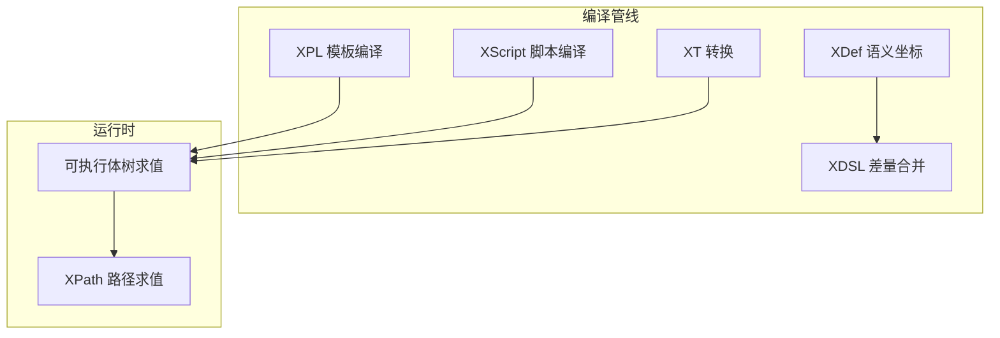

# nop-xlang 总览：XLang 元语言族的编译器与运行时

> 主要源文件（相对路径均逐条核实存在）：
> - [../nop-kernel/nop-xlang/src/main/java/io/nop/xlang/api/XLang.java](../../nop-kernel/nop-xlang/src/main/java/io/nop/xlang/api/XLang.java)（静态门面：求值裁决 / XPL 编译 / 标签加载）
> - [../nop-kernel/nop-xlang/src/main/java/io/nop/xlang/XLangConstants.java](../../nop-kernel/nop-xlang/src/main/java/io/nop/xlang/XLangConstants.java)（平台模型类型 / 文件类型 / XPath 算子常量）
> - [../nop-kernel/nop-xlang/src/main/java/io/nop/xlang/XLangErrors.java](../../nop-kernel/nop-xlang/src/main/java/io/nop/xlang/XLangErrors.java)（全模块错误码集中定义，1218 行）
> - [../nop-kernel/nop-xlang/src/main/java/io/nop/xlang/ast/XLangASTKind.java](../../nop-kernel/nop-xlang/src/main/java/io/nop/xlang/ast/XLangASTKind.java)（105 种 AST 节点类型枚举）
> - [../nop-kernel/nop-xlang/src/main/java/io/nop/xlang/XLangConfigs.java](../../nop-kernel/nop-xlang/src/main/java/io/nop/xlang/XLangConfigs.java)（模块配置项与默认值）
> - [../nop-kernel/nop-xlang/pom.xml](../../nop-kernel/nop-xlang/pom.xml)（依赖 nop-commons / nop-core / nop-xdefs / antlr4 / janino）

## 定位与形态

nop-xlang 是 Nop 平台元语言族 XLang 的编译器与运行时：XDef 定义语义坐标、XDSL 做差量合并、XPL 是模板、XScript 是脚本、XT 做转换、XPath 做路径求值。形态为 compiler-parser：上游是 ANTLR 解析与 AST 构建，下游是模板/表达式运行时，五阶段管线见[编译管线](flows/compile-pipeline.md)。体量：`src/main/java` 下 896 个 Java 文件、126,329 行（实测 find/wc），顶层 26 个子包按管线阶段划分——`ast/` 节点、`parse/` 解析、`compile/` 编译期处理器、`exec/` 可执行体、`xdef/`+`xdsl/`+`delta/` 元模型与合并、`xpl/` 模板、`xt/` 转换、`xpath/` 路径（目录实测）。入口门面 `XLang` 提供四类静态服务：统一求值 `execute`（全部运行期表达式求值出口的裁决点）、`newXplCompiler`/`newCompileTool` 编译工具、`parseXpl`/`loadTpl` 模板装载（装载期即绑定可执行体）、`getTagAction`/`getTag` 标签库加载（`nop-kernel/nop-xlang/src/main/java/io/nop/xlang/api/XLang.java:47-118`）。

> Sources: api/XLang.java (40-132), XLangConstants.java (27-86), pom.xml (7-57)

## 语言族地图

六门子语言按归属划分：XDef/XDSL/XT 走编译管线，XPath 是纯运行期求值，XPL 与 XScript 横跨两侧（先编译为可执行体、再在运行期求值）。

| 语言 | 用途 | 编译产物 |
|---|---|---|
| XDef | 定义 DSL 元模型与语义坐标 | `XDefinition` 元模型（`xdef/parse/XDefinitionParser`） |
| XDSL | `x:extends` 差量合并与 delta 定制 | 合并后的模型对象（`XDslExtender` / `DeltaMerger`） |
| XPL | XML 模板与标签库（`xpl`/`xlib`） | `XplModel`，体内表达式装载期绑定为 `IExecutableExpression`（`api/XLang.java:76-84`） |
| XScript | 嵌入式脚本 / 表达式 | `Expression` AST → `AbstractExecutable` 可执行体 |
| XT | 模型转换规则 | `IXTransform` 规则模型（`xt/` 包） |
| XPath | 节点路径求值 | 解析后即时求值（`xpath/IXPathEvaluator`），无持久产物 |

术语划界见[术语表](glossary.md)；XDef/XDSL 的域处理器与合并算子实现见 [XDef 与 XDSL](modules/xdef-xdsl.md)。

> Sources: XLangConstants.java (29-73), api/XLang.java (76-118), modules/xdef-xdsl.md, 目录实测

## 关键数字

| 指标 | 数值 | 核实出处 |
|---|---|---|
| Java 文件 / 行数 | 896 / 126,329 | 实测 `nop-kernel/nop-xlang/src/main/java` |
| AST 节点类型 | 105 种 Kind（ordinal 0-104） | `ast/XLangASTKind.java:4-216`，逐条计数 |
| Expression 类型 fan-in | 185 处引用（全模块最高） | [AST 节点体系](modules/ast-model.md)、[表达式求值](flows/expression-eval.md) |
| 错误码 | 348 个定义，其中 33 个零引用预留 | `XLangErrors.java`（1218 行），逐码核实见[错误模型](topics/error-model.md) |
| 上游依赖 | nop-commons、nop-core、nop-xdefs、nop-antlr4-common、janino | `pom.xml:15-57` |
| 下游依赖方 | 全仓 50 个 pom 声明依赖 nop-xlang（不含自身） | 实测 grep |

> Sources: ast/XLangASTKind.java (4-216), XLangErrors.java (15-1218), pom.xml (15-57)

## 能力边界

三条经源码核实的边界事实。第一，类型推断默认关闭：`nop.xlang.type-inference.enabled` 默认值 `false`（`nop-kernel/nop-xlang/src/main/java/io/nop/xlang/XLangConfigs.java:43-44`）；即便开启，类型错误也只降级为 warn 日志、不中断编译（[编译管线](flows/compile-pipeline.md)阶段四已核实）。第二，AST 优化器不在默认主链：`XLangExprParser.buildExecutable` 声明了 `optimize` 参数但方法体未使用，`compile/ExpressionOptimizer` 是空类占位，优化器的现存实际调用点是标识符替换（[编译管线](flows/compile-pipeline.md)阶段三已核实，`nop-kernel/nop-xlang/src/main/java/io/nop/xlang/expr/XLangExprParser.java:61-82`）。第三，错误面集中定义、跨模块消费：348 个错误码中 33 个为预留码，nop-ioc、nop-orm-eql、nop-excel 等外部模块直接抛 XLang 错误码（[错误模型](topics/error-model.md)已核实）。求值语义的边界（AST 与可执行体分离、后端路由裁决）见[表达式求值](flows/expression-eval.md)。

> Sources: XLangConfigs.java (40-48), expr/XLangExprParser.java (61-82), flows/compile-pipeline.md (77-88), topics/error-model.md (13-47)

## 平台角色

nop-xlang 被全仓 50 个模块 pom 直接依赖（含 nop-biz、nop-orm、nop-ioc、nop-graphql、nop-wf 等），是全系 `nop-*` 的元编程底座：各业务 DSL 都经 XDef 声明语义坐标、经 XDSL 做差量定制。`XLangConstants` 聚合了平台全部模型类型常量——`xdef`/`xmeta`/`xjava`/`xpl`/`xlib`/`xtask`（`nop-kernel/nop-xlang/src/main/java/io/nop/xlang/XLangConstants.java:58-72`）与 XPath 输出算子 `$value`/`$text`/`$xml` 等（同文件 29-36 行），是平台模型语汇的注册处。运行期，各模块的表达式求值收敛到 `XLang.execute` 单一裁决点（`nop-kernel/nop-xlang/src/main/java/io/nop/xlang/api/XLang.java:47-54`）。分层与数据流的系统视图见[架构](architecture.md)，上手路径见[快速上手](quickstart.md)，全库阅读顺序见[阅读指南](reading-guide.md)。

> Sources: XLangConstants.java (29-72), api/XLang.java (43-54), pom.xml 实测

## Sources

- nop-kernel/nop-xlang/src/main/java/io/nop/xlang/api/XLang.java ()
- nop-kernel/nop-xlang/src/main/java/io/nop/xlang/XLangConstants.java ()
- nop-kernel/nop-xlang/src/main/java/io/nop/xlang/XLangErrors.java ()
- nop-kernel/nop-xlang/src/main/java/io/nop/xlang/ast/XLangASTKind.java ()
- nop-kernel/nop-xlang/src/main/java/io/nop/xlang/XLangConfigs.java ()
- nop-kernel/nop-xlang/src/main/java/io/nop/xlang/expr/XLangExprParser.java ()
- nop-kernel/nop-xlang/pom.xml ()

---

## On this page

- 定位与形态
- 语言族地图
- 关键数字
- 能力边界
- 平台角色
