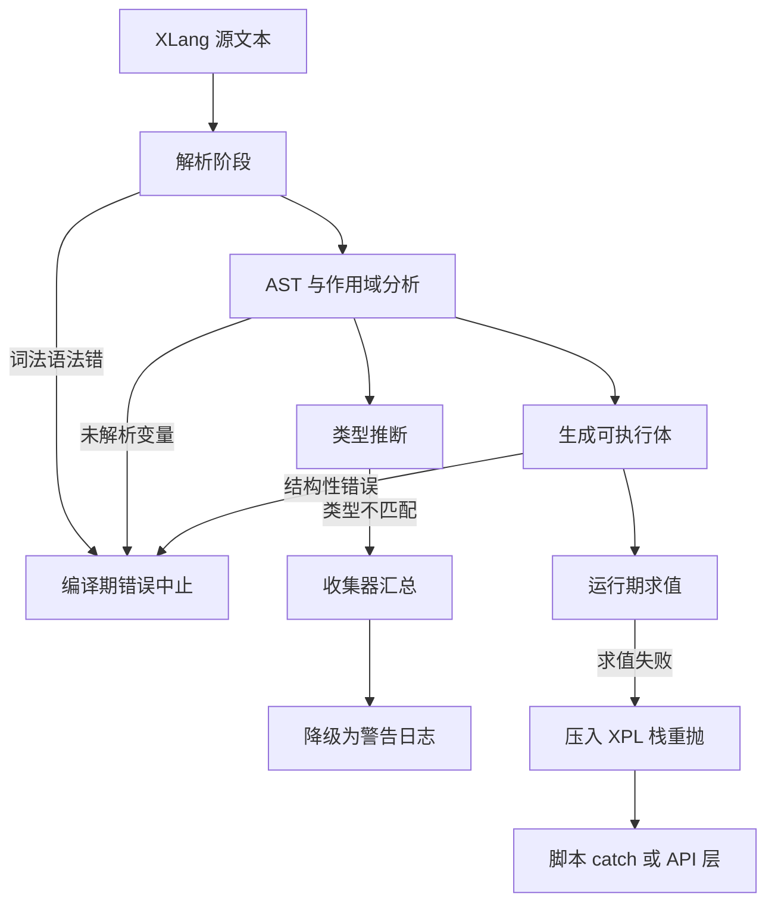

# 错误模型：XLangErrors 129 处引用的体系

> 本页源证据（基准 `deepwiki/nop-xlang/topics/`，相对路径 `../../../` 已逐条验证存在）：
> - `../../../nop-kernel/nop-xlang/src/main/java/io/nop/xlang/XLangErrors.java`
> - `../../../nop-kernel/nop-xlang/src/main/java/io/nop/xlang/compile/TypeErrorCollector.java`
> - `../../../nop-kernel/nop-xlang/src/main/java/io/nop/xlang/expr/XLangExprParser.java`
> - `../../../nop-kernel/nop-xlang/src/main/java/io/nop/xlang/exec/AbstractExecutable.java`
> - `../../../nop-kernel/nop-api-core/src/main/java/io/nop/api/core/exceptions/ErrorCode.java`
> - `../../../nop-kernel/nop-api-core/src/main/java/io/nop/api/core/exceptions/NopException.java`
> - `../../../nop-kernel/nop-api-core/src/main/java/io/nop/api/core/exceptions/NopEvalException.java`
> - `../../../nop-kernel/nop-xlang/src/main/java/io/nop/xlang/XLangConfigs.java`

XLangErrors 是 nop-xlang 全部错误码的唯一集中定义点：348 个 `ErrorCode` 常量、121 个 `ARG_` 参数名常量，按前缀分成 18 个族。本页逐码 grep 核实每个码的抛出点，划分编译期与运行期两组，标注 33 个从未抛出的预留码，并说明 ErrorCode/NopException 机制与配置开关对错误面的影响。

## 全量界定：348 个错误码的定义与引用

`XLangErrors` 是接口，`@Locale("zh-CN")` 标注消息语言（nop-kernel/nop-xlang/src/main/java/io/nop/xlang/XLangErrors.java:15-16）。每个错误码用 `ErrorCode.define(code, message, ARG_...)` 静态定义，第一个码 `ERR_FILTER_OP_INVALID_ARG_COUNT` 在第 184 行，最后一个 `ERR_XDEF_CHECK_CONDITION_COMPILE_ERROR` 止于第 1216-1217 行。121 个 `ARG_` 常量（17-182 行及 1122-1184 行的分散段落）集中声明消息插值参数名，供 `NopException.param(...)` 按名填充。

引用规模的实测数据：main 源码中 `import static io.nop.xlang.XLangErrors.*` 共 786 行，覆盖 143 个源文件；把测试代码计入后为 174 个文件。抛出点按裸常量名逐一 grep（含静态导入形态）核实，结论：348 个码中 315 个在仓库内至少有一个抛出点，33 个零引用（见下节）。文件内还有 2 个被注释掉的死定义：`ERR_XLANG_IMPORTED_CLASS_NOT_ALLOW_USED_AS_PARAM`（287-289 行）与 `ERR_XPL_UNKNOWN_TAG_FRAME`（498-500 行）。

错误消息的中文文案随 `ErrorCode.description` 定义在接口内，运行期可被 i18n 资源覆盖：`nop-runner/nop-cli-core/src/main/resources/_vfs/i18n/zh-CN/nop-cli-errors.i18n.yaml` 为全部码登记了中英文案（如 1273-1276 行的 type-infer 族）。

> Sources: `nop-kernel/nop-xlang/src/main/java/io/nop/xlang/XLangErrors.java`（全文件）；`nop-runner/nop-cli-core/src/main/resources/_vfs/i18n/zh-CN/nop-cli-errors.i18n.yaml`

## 分组体系：前缀即子系统

错误码常量名前缀与抛出点包一一对应，逐码核实后的分组全表如下（"抛出点"列给出已验证的代表位置）：

| 分组 | 前缀/范围 | 定义→有抛出点 | 典型抛出点（已核实） |
|------|-----------|---------------|----------------------|
| XPL 标签编译 | `ERR_XPL_`（另含 `ERR_XPL_FN_BODY_IS_FUNCTION`） | 67→61 | `XplLibTagCompiler.java:792`、`NodeOutputTagCompiler.java:78` |
| 运行期求值 | `ERR_EXEC_` | 62→58 | `XLangSemantics.java:562`、`BuildExecutableProcessor.java:1238` |
| XDSL 模型加载/合并 | `ERR_XDSL_` | 55→53 | delta 合并与 DslModel 解析（`xdsl` 包） |
| XDef 元模型 | `ERR_XDEF_` | 45→36 | `xdef/parse`、`xdef/domain` 各处理器 |
| XLang 编译总类 | `ERR_XLANG_` | 44→43 | `LexicalScopeAnalysis.java:690,833` |
| 表达式解析 | `ERR_EXPR_` | 19→13 | `SimpleExprParser.java:350,411,465,492` |
| Schema 校验 | `ERR_SCHEMA_`、`ERR_OBJ_SCHEMA_NO_PROP` | 15→13 | `nop-kernel/nop-xlang/src/main/java/io/nop/xlang/xmeta/validate/SchemaBasedValidator.java` |
| XMeta 元数据 | `ERR_XMETA_` | 7→7 | `xmeta/xjava`、`ObjMetaMergeHelper` |
| XT 转换规则 | `ERR_XT_` | 7→7 | `xt` 包规则编译与变换 |
| XLib 标签库 | `ERR_XLIB_` | 5→5 | `nop-kernel/nop-xlang/src/main/java/io/nop/xlang/api/XLang.java:99,116`、`nop-kernel/nop-xlang/src/main/java/io/nop/xlang/xpl/xlib/XplTag.java` |
| Java 转译 | `ERR_JAVAC_PARSE_FAIL`、`ERR_JAVA_*` | 4→4 | `janino` 转译路径 |
| 类型推断 | `ERR_TYPE_INFER_`（1132 行起专属分节） | 7→4 | `GenericTypeInferencer.java:240,353` |
| 其余小族 | `ERR_MACRO_`(2)、`ERR_XPATH_`(2)、`ERR_BIZ_`(2)、`ERR_LAYOUT_`(2)、`ERR_FILTER_`(2)、`ERR_SCRIPT_COMPILE_ERROR`(1) | 11→11 | `xpath`、`filter`、`layout/parse` 包 |

小族里有一处命名错位：`ERR_XPL_FN_BODY_IS_FUNCTION` 的消息是 stdDomain 校验语义（XLangErrors.java:936-938），按前缀归入 XPL 组但实际从 xdef 域处理器抛出。三对常量共享同一错误码字符串（重复定义，非别名机制）：`tag-body-not-renderer`（515-519 行）、`log-message-not-static`（655-659 行）、`get-prop-on-null-obj`（527-531 行）。

**预留未用码（33 个，逐码 grep 零抛出点，如实标注）**：EXPR 族 6 个——`ERR_EXPR_PARSE_NOT_END_PROPERLY`、`ERR_EXPR_JSON_LITERAL_NOT_ALLOW_PROP_ACCESS`、`ERR_EXPR_EMPTY_BRACE`、`ERR_EXPR_INVALID_ATTR_EXPR`、`ERR_EXPR_XPL_DUPLICATE_ATTR_NAME`、`ERR_EXPR_NOT_EXECUTABLE`；EXEC 族 4 个——`ERR_EXEC_ARRAY_NOT_SUPPORT_FUNCTION`、`ERR_EXEC_READ_ATTR_NOT_STRING`、`ERR_EXEC_EXPR_NOT_THROWABLE`、`ERR_EXEC_SPREAD_ITEM_NOT_MAP`；XDEF 族 9 个——`ERR_XDEF_DUPLICATE_NODE_ID`、`ERR_XDEF_TAG_NAME_CONFLICT_WITH_ATTR_NAME`、`ERR_XDEF_UNION_ELEMENT_TYPE_IS_UNKNOWN`、`ERR_XDEF_SET_NO_CHILD`、`ERR_XDEF_STD_DOMAIN_NOT_SUPPORT_OPTIONS`、`ERR_XDEF_SET_NODE_MUST_HAS_KEY_ATTR`、`ERR_XDEF_SIMPLE_NODE_NOT_ALLOW_ATTR`、`ERR_XDEF_DUPLICATE_BEAN_CLASS`、`ERR_XDEF_ANY_TAG_NODE_NO_BEAN_CLASS_ATTR`；XPL 族 6 个——`ERR_XPL_MULTIPLE_SLOT_WITH_SAME_NAME`、`ERR_XPL_PARSE_ATTR_NUM_FAIL`、`ERR_XPL_EVAL_NOT_ALLOW_CHILD`、`ERR_XPL_EVAL_INVALID_LANG`、`ERR_XPL_TAG_NO_BODY`、`ERR_XPL_TAG_BODY_NOT_RENDERER`；TYPE_INFER 族 3 个——`ERR_TYPE_INFER_RETURN_TYPE_MISMATCH`、`ERR_TYPE_INFER_NO_COMMON_TYPE`、`ERR_TYPE_INFER_CIRCULAR_DEPENDENCY`（为推断引擎预留，当前 `TypeErrorCollector` API 尚无发射点）；XDSL 族 2 个——`ERR_XDSL_NOT_ALLOW_MULTIPLE_SUPER`、`ERR_XDSL_CHECK_REF_VIOLATION`；SCHEMA 族 2 个——`ERR_SCHEMA_PROP_STD_DOMAIN_VALIDATION_FAIL`、`ERR_SCHEMA_PROP_LENGTH_GREATER_THAN_UTF8_LENGTH`；XLANG 族 1 个——`ERR_XLANG_XPL_EXPR_PAREN_NOT_MATCH`。其中 `ERR_EXPR_PARSE_NOT_END_PROPERLY`（"解析失败，表达式没有正常结束"）与 ANTLR 路径在用的 `ERR_ANTLR_PARSE_NOT_END_PROPERLY`（nop-kernel/nop-antlr4/nop-antlr4-common/src/main/java/io/nop/antlr4/common/AntlrErrors.java:25）语义重叠，属手写解析器退役后的遗留。这些码已随 i18n 目录登记文案，但无 Java 抛出点。

> Sources: `nop-kernel/nop-xlang/src/main/java/io/nop/xlang/XLangErrors.java`；`nop-kernel/nop-xlang/src/main/java/io/nop/xlang/expr/simple/SimpleExprParser.java`；`nop-kernel/nop-xlang/src/main/java/io/nop/xlang/compile/GenericTypeInferencer.java`

## 编译期与运行期的传播差异

两类错误走两条传播通道。**编译期错误**（解析、词法作用域分析、宏展开、XPL 标签编译、XDSL/XDef 模型加载、可执行体生成）在 `throw` 的瞬间就地中断，用 `.source(node)` 或 `.loc(...)` 把 AST 节点位置钉在异常上，例如 `SimpleExprParser.java:350` 的 `throw sc.newError(ERR_EXPR_UNEXPECTED_CHAR)` 与 `LexicalScopeAnalysis.java:833` 的 `throw new NopEvalException(ERR_XLANG_UNRESOLVED_IDENTIFIER).param(ARG_VAR_NAME, name).source(id)`。**运行期错误**（`ERR_EXEC_` 族为主）由求值器在执行中抛出，位置信息事后逐层补挂：`AbstractExecutable.eval` 捕获 `NopException` 后调用 `e.addXplStack(this)` 把当前可执行体压入 XPL 调用栈再重抛（nop-kernel/nop-xlang/src/main/java/io/nop/xlang/exec/AbstractExecutable.java:75-82），`NopException.getMessage` 最终把 `loc` 与 `xplStack` 一并渲染（NopException.java:397-404）。

| 维度 | 编译期错误 | 运行期错误 |
|------|-----------|-----------|
| 代表码族 | `ERR_EXPR_`/`ERR_XLANG_`/`ERR_XPL_`/`ERR_XDSL_`/`ERR_XDEF_` | `ERR_EXEC_`（exec、functions 包） |
| 异常类型 | `NopException`/`NopEvalException`，抛出即携带 source 位置 | 同为 `NopException` 子类，位置经 `addXplStack` 逐层累积 |
| 中断行为 | 立即中止编译/加载，调用方拿到首个错误 | 沿调用栈上传，栈帧补全后到达脚本 catch 或 API 层 |
| 类型推断特例 | `TypeErrorCollector` 收集、WARN 日志，不中断（见下） | 不适用 |

一个交叉细节：5 个 `ERR_EXEC_` 形态的码出现在编译期抛出点——`BuildExecutableProcessor` 为字面量表达式与类引用求静态值时提前触发 `ERR_EXEC_CLASS_NO_STATIC_FIELD`、`ERR_EXEC_CLASS_NO_CONSTRUCTOR`、`ERR_EXEC_CLASS_NO_STATIC_METHOD`、`ERR_EXEC_CLASS_NOT_ALLOW_ATTR_EXPR`、`ERR_EXEC_CONVERT_FUNC_ONLY_ALLOW_ONE_ARG`（nop-kernel/nop-xlang/src/main/java/io/nop/xlang/compile/BuildExecutableProcessor.java:1238、1483-1489）。分组依据是抛出点而非码名前缀，这也是本页逐码核实的原因。

类型推断是唯一的"第三通道"：`TypeErrorCollector` 把 `NopException` 连同位置收进列表而非抛出（nop-kernel/nop-xlang/src/main/java/io/nop/xlang/compile/TypeErrorCollector.java:26-55）；`XLangExprParser.buildExecutable` 在推断有错时仅逐条 `LOG.warn`，注释明言"类型推导错误以警告日志形式暴露，不中断编译"（nop-kernel/nop-xlang/src/main/java/io/nop/xlang/expr/XLangExprParser.java:70-77）。7 个 `ERR_TYPE_INFER_` 码中当前只有 3 个会被收集器实际发射（`ASSIGN_TYPE_MISMATCH`、`UNDEFINED_VARIABLE`、`INCOMPATIBLE_TYPES`，TypeErrorCollector.java:38-55），`GenericTypeInferencer` 另发 `TYPE_VAR_CONFLICT` 错误与 `INCOMPATIBLE_TYPES` 警告（GenericTypeInferencer.java:240,353）。

> Sources: `nop-kernel/nop-xlang/src/main/java/io/nop/xlang/compile/TypeErrorCollector.java`；`nop-kernel/nop-xlang/src/main/java/io/nop/xlang/expr/XLangExprParser.java`；`nop-kernel/nop-xlang/src/main/java/io/nop/xlang/exec/AbstractExecutable.java`；`nop-kernel/nop-xlang/src/main/java/io/nop/xlang/compile/LexicalScopeAnalysis.java`

## 平台机制：ErrorCode 与 NopException

XLangErrors 只做"码 + 文案 + 参数名"的声明；抛出与传播由 nop-api-core 的两个类承载。`ErrorCode` 是不可变值对象，四个字段 `errorCode/description/argNames/status`，`define(...)` 工厂把 status 缺省为 -1（nop-kernel/nop-api-core/src/main/java/io/nop/api/core/exceptions/ErrorCode.java:12-33）。`NopException` 继承 `RuntimeException`（NopException.java:33），构造时以错误码字符串为 message、description 为初始文案（90-100 行）；`param(name, value)` 按名填充参数，且当参数值实现 `ISourceLocationGetter` 时自动补全异常位置（451-457 行），这正是 XLang 抛出点普遍 `.param(ARG_NODE, node)` 就能带出位置的原因。消息渲染时 description 里的 `{argName}` 占位符按 params 插值（`getMessage`，382-410 行）。

文案本地化走 `IErrorMessageManager`：`getDefaultErrorDescription` 按默认 locale 查管理器，查不到回落到 `ErrorCode.description`（NopException.java:46-56）。`NopEvalException` 是 nop-api-core 内置的执行期子类（NopEvalException.java:17），XLang 在需要类型区分时使用它。此外 `bizFatal` 标记（249-256 行）与 `notRollback`（110-130 行）把"是否中断业务、是否回滚事务"的策略挂在同一异常对象上，nop-xlang 的测试 `TestAttrBizFatalWrap`、`TestPropBizFatalWrap`、`TestInvokeMethodBizFatalWrap` 验证了求值路径对 bizFatal 的透传。

> Sources: `nop-kernel/nop-api-core/src/main/java/io/nop/api/core/exceptions/ErrorCode.java`；`nop-kernel/nop-api-core/src/main/java/io/nop/api/core/exceptions/NopException.java`；`nop-kernel/nop-api-core/src/main/java/io/nop/api/core/exceptions/NopEvalException.java`

## 配置开关对错误面的影响

`XLangConfigs` 中与错误面直接相关的开关及实测状态：

| 开关 | 默认值 | 对错误面的作用（已核实的使用点） |
|------|--------|----------------------------------|
| `nop.xlang.type-inference.enabled`（`CFG_XLANG_TYPE_INFERENCE_ENABLED`） | false | 打开后编译期增加类型检查诊断面；错误只降级为 WARN 日志不失败（XLangConfigs.java:43-44，XLangExprParser.java:70-77）。即该开关只会"多报错"，不会"多失败" |
| `nop.xlang.debugger.enabled`（`CFG_XLANG_DEBUGGER_ENABLED`） | false | 启用后表达式经调试执行器执行，运行期错误路径叠加断点/栈查询能力（XLangConfigs.java:40-41；消费方 `nop-xlang-debugger` 初始化器与 IDEA 插件） |
| `nop.xlang.antlr.max-nested-level`（`CFG_XLANG_ANTLR_MAX_NESTED_LEVEL`） | 100 | 预留的解析深度上限；主代码当前唯一引用点被注释（XLangLexerBase.java:42），实际不生效 |
| `nop.xlang.expr.print-debug-info-when-parse-xpl-expr` | true | 声明于 XLangConfigs.java:21-23；主代码 grep 未见消费点，按现状标注为无生效证据 |

异常栈深度另受平台级开关约束：`NopException.addXplStack` 按 `ApiConfigs.CFG_EXCEPTION_MAX_XPL_STACK_SIZE` 截断 XPL 栈帧（NopException.java:428），这决定了运行期错误最终能携带多深的定位链。

> Sources: `nop-kernel/nop-xlang/src/main/java/io/nop/xlang/XLangConfigs.java`；`nop-kernel/nop-xlang/src/main/java/io/nop/xlang/expr/XLangExprParser.java`；`nop-kernel/nop-api-core/src/main/java/io/nop/api/core/exceptions/NopException.java`

## 跨模块消费与相关页面

XLangErrors 的消费不限于 nop-xlang：已核实的跨模块抛出点包括 nop-orm-eql 的 `EqlParseHelper`（EQL 解析复用 XLang 错误码）、nop-rule-core 的 `RuleExprParser`、nop-ai-core 的 `PromptSyntaxStdDomainHandler`、nop-record 的 `PeekMatchRuleStdDomainHandler`、nop-excel 的 `ImportExcelParser`、nop-ioc 的 `BeanDefinitionBuilder`、nop-autotest-core 的 `AutoTestCase` 以及 nop-javac 的 `JavaCompilerErrors`。错误定义集中在一处、抛出点散布全仓库，是它成为全模块第二高 fan-in 点的直接原因。

编译期错误所在的管线阶段详见 [编译管线](../flows/compile-pipeline.md)；运行期求值与 catch 语义详见 [表达式求值](../flows/expression-eval.md)；错误挂载所用的 AST 节点位置接口见 [AST 节点体系](../modules/ast-model.md)；XDSL/XDef 族错误码对应的加载与合并机制见 [XDef 与 XDSL](../modules/xdef-xdsl.md)。

> Sources: `nop-persistence/nop-orm-eql/src/main/java/io/nop/orm/eql/parse/EqlParseHelper.java`；`nop-rule/nop-rule-core/src/main/java/io/nop/rule/core/expr/RuleExprParser.java`；`nop-kernel/nop-javac/src/main/java/io/nop/javac/JavaCompilerErrors.java`

## Sources

- `nop-kernel/nop-xlang/src/main/java/io/nop/xlang/XLangErrors.java` ()
- `nop-kernel/nop-xlang/src/main/java/io/nop/xlang/compile/TypeErrorCollector.java` ()
- `nop-kernel/nop-xlang/src/main/java/io/nop/xlang/compile/GenericTypeInferencer.java` ()
- `nop-kernel/nop-xlang/src/main/java/io/nop/xlang/compile/BuildExecutableProcessor.java` ()
- `nop-kernel/nop-xlang/src/main/java/io/nop/xlang/compile/LexicalScopeAnalysis.java` ()
- `nop-kernel/nop-xlang/src/main/java/io/nop/xlang/expr/XLangExprParser.java` ()
- `nop-kernel/nop-xlang/src/main/java/io/nop/xlang/expr/simple/SimpleExprParser.java` ()
- `nop-kernel/nop-xlang/src/main/java/io/nop/xlang/exec/AbstractExecutable.java` ()
- `nop-kernel/nop-xlang/src/main/java/io/nop/xlang/XLangConfigs.java` ()
- `nop-kernel/nop-xlang/src/main/java/io/nop/xlang/parse/antlr/XLangLexerBase.java` ()
- `nop-kernel/nop-api-core/src/main/java/io/nop/api/core/exceptions/ErrorCode.java` ()
- `nop-kernel/nop-api-core/src/main/java/io/nop/api/core/exceptions/NopException.java` ()
- `nop-kernel/nop-api-core/src/main/java/io/nop/api/core/exceptions/NopEvalException.java` ()
- `nop-runner/nop-cli-core/src/main/resources/_vfs/i18n/zh-CN/nop-cli-errors.i18n.yaml` ()

---

## On this page

- 全量界定：348 个错误码的定义与引用
- 分组体系：前缀即子系统
- 编译期与运行期的传播差异
- 平台机制：ErrorCode 与 NopException
- 配置开关对错误面的影响
- 跨模块消费与相关页面
