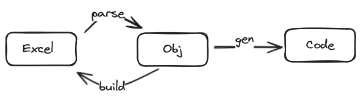

# 地表最强的模型驱动代码生成器

Nop平台支持自定义的模型驱动代码生成机制，这个机制可以在Nop平台之外独立使用。这里以消息对象模型为例，演示如何通过配置实现对消息对象模型的解析和代码生成。



B站讲解视频:  [地表最强的模型驱动代码生成器](https://www.bilibili.com/video/BV14t421t7jr/)

参考代码： [https://gitee.com/canonical-entropy/nop-entropy/tree/master/demo](https://gitee.com/canonical-entropy/nop-entropy/tree/master/demo)

## 一. Excel模型文件

我们在Excel模型文件中定义一系列消息对象的结构，然后再根据结构定义生成对象的消息类。


```java
public class IsoMessage{
    private BigDecimal amount;
    private int value;
    private String name;

    public String getBigDecimal(){
       return ...
    }
    ....
}
```

## 二. 定义导入模型

无需编程，只需要增加一个imp导入模型定义，即可自动实现Excel文件的解析。

在本示例中，我们建立一个app-templates模块，然后在其中加入msg.imp.xml导入模型定义文件。


为了让Nop平台的模型加载器识别msg.xlsx这样的文件后缀名，实现对模型的自动加载和解析，我们需要定义增加一个注册模型，即上面的msg.register-model.xml。

```xml
<model x:schema="/nop/schema/register-model.xdef" xmlns:x="/nop/schema/xdsl.xdef"
       name="imp">
    <loaders>
        <xlsx-loader fileType="msg.xlsx" impPath="/app/imp/msg.imp.xml"/>
    </loaders>
</model>
```

在这个注册模型中，我们设置了`msg.xlsx`文件后缀与`msg.imp.xml`导入模型的关联。

在导入模型中我们只需要定义Excel模型文件的Sheet模式，以及字段之间的父子关系。

```xml
<imp x:schema="/nop/schema/excel/imp.xdef" xmlns:x="/nop/schema/xdsl.xdef" xmlns:c="c" xmlns:xpt="xpt"
     templatePath="template.msg.xlsx" defaultStripText="true">
    <sheets>
        <sheet name="目录" ignore="true"/>
        <sheet name="配置">
            <fields>
                <field name="basePackageName" displayName="basePackageName" mandatory="true">
                    <schema stdDomain="string"/>
                </field>
                ...
            </fields>
        </sheet>

        <sheet name="message" namePattern=".*" field="messages" multiple="true" keyProp="name" sheetNameProp="name">
            <fields>
                <field name="name" displayName="名称" mandatory="true">
                    <schema stdDomain="prop-name"/>
                </field>
                ...
                <field name="fields" displayName="字段列表" list="true" keyProp="name">
                    <fields>
                        <field name="name" displayName="字段名" mandatory="true">
                            <schema stdDomain="var-name"/>
                        </field>
                        ...
                    </fields>
                </field>
            </fields>
        </sheet>
    </sheets>
</imp>
```

上面的配置中，`namePattern=“.*"`结合`multiple="true"`表示有多个sheet都会匹配message这个解析模板。fields="messages"表示解析得到的所有对象被收集到一个名为messages的列表中。【字段列表】这个节点设置了`list="true"`，它表示解析得到一个对象列表。

## 三. 使用NopCli工具实现Excel模型的解析

> Nop平台中的nop-cli命令行工具可以直接执行模型解析、代码生成等指令，具体文档参见[cli.md](https://gitee.com/canonical-entropy/nop-entropy/blob/master/docs/dev-guide/cli.md)

```
java -Xbootclasspath/a:app-templates/src/main/resources/
     -jar ../nop-cli/target/nop-cli-2.0.0-BETA.1.jar
     extract model/test.msg.xlsx -o=target/test.msg.json
```

* -Xbootclasspath配置将app-templates这个工程下的模型文件引入到classpath中，后面就可以通过虚拟文件路径来访问所有模型文件

* extract指令表示解析test.msg.xlsx模型，解析的结果输出到test.msg.json文件中

  > msg.register-model.xml中已经定义了后缀名为msg.xlsx的模型对象使用msg.imp.xml导入模型来解析

得到的json结果为

```json
{
  "appName": "LIMS",
  "basePackageName": "app.test",
  "mavenGroupId": "com.demo",
  "mavenArtifactId": "app-test",
  "mavenVersion": "1.0.0-SNAPSHOT",
  "messages": [
    {
      "name": "IsoMessage",
      "fields": [
        {
          "propId": 1,
          "name": "amount",
          "displayName": null,
          "type": "java.math.BigDecimal",
          "stdDomain": null,
          "codec": null,
          "length": 3,
          "offset": 1
        },
        {
          "propId": 2,
          "name": "value",
          "displayName": null,
          "type": "int",
          "stdDomain": null,
          "codec": null,
          "length": 12,
          "offset": 4
        },
        {
          "propId": 3,
          "name": "name",
          "displayName": null,
          "type": "java.lang.String",
          "stdDomain": null,
          "codec": null,
          "length": 10,
          "offset": 16
        }
      ]
    }
  ]
}
```

## 四. 使用NopCli工具根据JSON生成Excel模型

```
java -Xbootclasspath/a:app-templates/src/main/resources/
     -jar ../nop-cli/target/nop-cli-2.0.0-BETA.1.jar
      gen-file target/test.msg.json
      -t=/app/imp/msg.imp.xml -o=target/out.msg.xlsx
```

* gen-file指令将解析test.msg.json文件得到JSON对象，然后从msg.imp.xml取到其中配置的`template.msg.xlsx`作为导出模板，生成Excel文件为out.msg.xlsx

## 五. 使用NopCli工具执行代码生成

```
java -Xbootclasspath/a:app-templates/src/main/resources/
     -jar ../nop-cli/target/nop-cli-2.0.0-BETA.1.jar
     gen model/test.msg.xlsx
     -t=/app/templates/msg -o=target
```

* gen指令将解析`test.msg.xlsx`文件，应用app-templates模块下的`/app/templates/msg`模板，生成的文件保存到target目录下

具体代码生成模板的配置说明，参见[codegen.md](https://gitee.com/canonical-entropy/nop-entropy/blob/master/docs/dev-guide/codegen.md)

NopCodeGen做了大量底层工作，使得我们可以采用差量化的代码生成方案。也就是说自动生成的代码永远都可以重新生成，手工修改的部分与自动生成的代码相分离，独立存放。

详细介绍参见文章 [数据驱动的差量化代码生成器 - 知乎 (zhihu.com)](https://zhuanlan.zhihu.com/p/540022264)

## 六. Maven集成

NopCli工具可以直接集成在maven打包工具中使用，从而将模型驱动整合到DevOps开发流程中，详细介绍可以参见[如何集成Nop平台的代码生成器 - 知乎 (zhihu.com)](https://zhuanlan.zhihu.com/p/613448320)

## 总结: 为什么NopCodeGen是地表最强
1. 数据驱动。通过目录名和文件名中的微格式来控制代码生成过程中的判断和循环。
2. Excel模型驱动。无需编程就可以实现任意的领域模型和Excel文件之间的双向转换，相当于是将Excel作为一种序列化形式来使用。可以通过Excel来定义自己的领域模型，用于代码生成。
3. Xpl模板语言。可以通过标签抽象、元编程等技术实现高阶抽象，灵活性和直观性远超Freemarker。
4. 提供了一个通用的命令行工具执行代码生成，可以通过maven插件调用，无需单独部署软件，与DevOps流程紧密集成。
5. 代码生成采用差量化设计，手工修改的代码与自动生成的代码相分离。模型修改后随时可以重新生成，不会覆盖手工修改的代码。
6. 代码生成模板支持Delta定制。无需修改Nop平台内置的模板，通过在delta目录下增加对应的模板文件或者标签库就可以定制平台内置模板的内容。
7. 代码生成过程支持生成缓存和依赖追踪，可以实现类似Vite的动态更新能力。只要修改了模型或者模型衍生所需的其他文件，就自动生成，无需手动执行代码生成器。
8. 根据Excel数据模型我们自动生成全套前后端应用（包括服务层和前台AMIS页面），服务层可以通过gPRC, REST, GraphQL三种协议来访问，
9. 自动实现的增删改查支持主子表复杂数据。ORM引擎自动支持多租户和扩展字段，扩展字段可以选择在纵表中保存。纵表中的扩展字段可以进行复杂查询，可以在SQL公式中使用，可以进行排序。

以上功能都是目前其他代码生成器和开源框架所不具备的功能。有些人可能也会在Excel中做一些简单的模型定义，但是他们都是针对自己特定的需求编写Excel解析器，而Nop平台并不需要手工编写Excel解析，而是使用一个通用的映射方案，可以使用Excel来表达复杂嵌套的领域对象结构。所以Nop平台中API模型、Netty消息模型等都是使用Excel模型来定义。而且这个模型可以随时增加扩展属性，不需要修改模型解析和模型对象定义。
**NopCodeGen所提供的不仅仅是针对当前需求所编写的特定模板，而是一整套可扩展的模型驱动架构支撑工具**。


