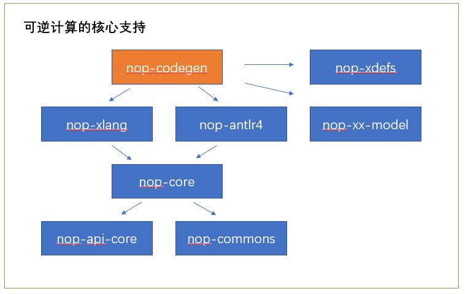
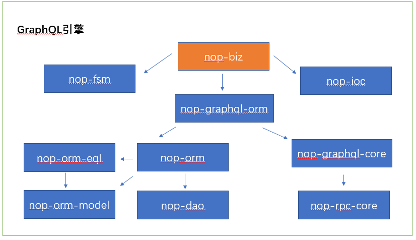
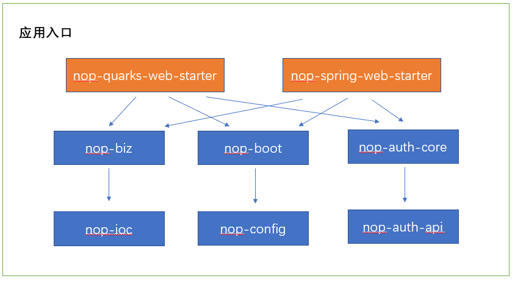
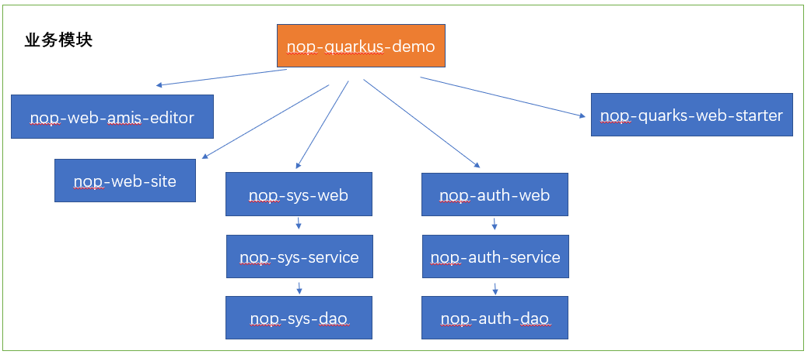
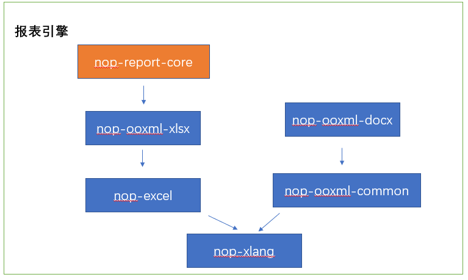
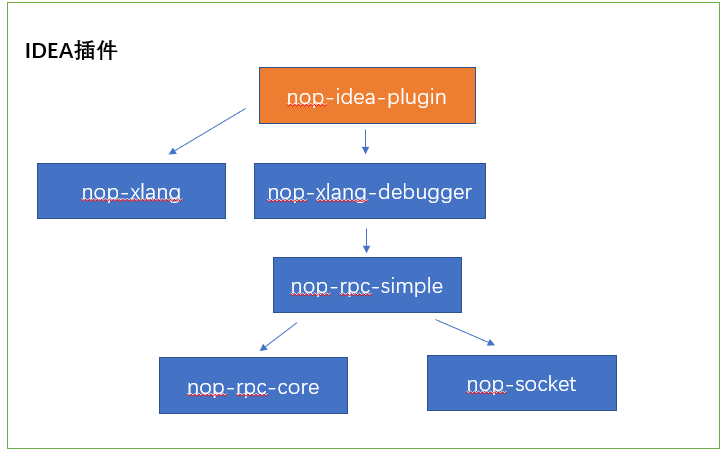
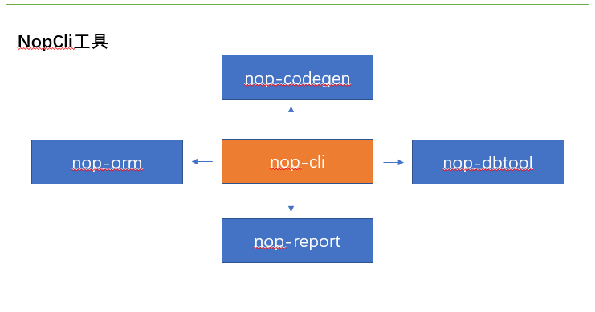

# Module Dependencies

Although the Nop platform has many modules, thanks to its overall design leveraging dependency injection, dynamic loading, and similar approaches, the coupling between modules is very low. Most modules can be used independently and can even be integrated with other frameworks outside of the Nop platform.

## I. Core Modules

The two most central modules of the Nop platform are nop-core and nop-xlang. The concrete implementation of the so-called reversible computation principle is concentrated in these two modules.

* **nop-api-core contains global objects and interaction messages that need to be shared both internally and externally across the entire platform.** For example, all annotations used on the platform, common Beans used by API calls (such as ApiRequest, ApiResponse, PageBean), the NopException unified exception handling class, the IContext global context, the IUserContext user context, etc. When third-party frameworks need to call service interfaces provided by the Nop platform, they typically reference this module.

* nop-commons provides helper functions such as StringHelper and FileHelper, and offers a large number of business-agnostic data structure wrappers, including ThreadPoolExecutor, LocalCache, TextScanner, and more.

* **nop-core is responsible for providing core model objects that may be used by other modules, as well as global model caching and dependency tracking mechanisms.** Examples include basic structure definitions and related algorithm implementations for Tree, Table, Graph, Filter, and FieldSelection; XML and JSON file parsing (without using third-party parsing libraries); a delta-based virtual file system; a global model loader; and dictionary tables, internationalization messages, exception code mappings, etc. To better support GraalVM, the core module also provides custom generic type definitions and reflection invocation mechanisms (direct use of Java reflection has lower performance).

* **nop-xlang provides the Nop platform’s core XLang language and the implementation of the delta merge algorithm.** XLang is an umbrella term encompassing a series of built-in custom domain-specific languages within the Nop platform, such as the XDef meta-model definition language, the XMeta object structure definition language, the Xpl template language oriented toward meta-programming, the XScript scripting language with macro functions, the XPath path lookup language, the XTransform structural transformation language, etc. See [xlang](https://gitee.com/canonical-entropy/nop-entropy/blob/master/docs/dev-guide/xlang/index.md)

* **nop-codegen provides a code generator that can be integrated with the Maven packaging tool.** The built-in metaprogramming mechanism in XLang can be regarded as a language-embedded code generator, whereas codegen provides an external, data-driven, delta-based code generator. See [codegen.md](https://gitee.com/canonical-entropy/nop-entropy/blob/master/docs/dev-guide/codegen.md). The templates directory under the nop-codegen module contains a large number of built-in code generation templates—for example, /templates/orm is used to generate a full set of front-end and back-end CRUD code based on a data model. These code generation templates may need to parse DSL models, in which case the corresponding meta-model and Excel parsing model must be introduced. For instance, to generate an Antlr AST parser from g4 file definitions, you need to introduce the nop-antlr4 dependency; see [antlr.md](https://gitee.com/canonical-entropy/nop-entropy/blob/master/docs/dev-guide/xlang/antlr.md). To parse Excel data models, you need to introduce the nop-orm-model dependency and use the orm.xdef meta-model from the nop-xdefs module.

The development of nop-xlang is an interesting bootstrapping process. Since codegen needs to use the Xpl and XScript languages in XLang, and the XScript parser is automatically generated from the antlr grammar definition model, the actual development process proceeded as follows:

1. First manually write a simple XScript parser to support running the antlr code generation templates

2. Write code generation templates to generate an XScript parser from the antlr model

3. Replace the hand-written XScript parser with the automatically generated one

The nop-codegen tool can be used independently of the Nop platform to generate code for other frameworks or languages—such as MyBatis code, Vue code, etc.—and it can be combined with a FileWatcher. **When it detects that a model file in a directory has changed, it automatically regenerates all files that depend on that model.**

After introducing the nop-xlang module, we can call `ResourceComponentManager.instance().loadComponentModel(path)` to load model files from the virtual file system under the `src/resources/_vfs/` directory, automatically parse models based on xdef meta-model definitions, automatically execute compile-time code generation, delta merge, and other model transformation operations, and cache the model parsing results.

## II. GraphQL Engine

The Nop platform’s backend services are implemented using the NopGraphQL engine. NopGraphQL does not use the graphql-java package; it is a completely new GraphQL engine implemented from scratch. Compared to graphql-java, it fully leverages the reversible computation principle, greatly reducing the amount of hand-written code and improving runtime performance. In addition, NopGraphQL supports dynamic model loading and supports both REST and GraphQL invocation interfaces.

* nop-graphql-core provides the GraphQL execution engine, orchestrates multiple DataFetchers to fetch data in parallel, and provides RPC call interface encapsulation

* nop-graphql-orm provides various DataFetchers implemented using the NopORM engine

* nop-dao provides JDBC wrappers, transaction wrappers, and a database dialect mechanism

* nop-orm-model provides entity model definitions, while nop-orm-eql provides the EQL grammar parser. These two modules can be used independently of the nop-orm engine

* nop-orm implements an ORM engine that encompasses all the core features of Hibernate and MyBatis

* [BizObjectManager](https://gitee.com/canonical-entropy/nop-entropy/blob/master/nop-service-framework/nop-biz/src/main/java/io/nop/biz/impl/BizObjectManager.java) in nop-biz provides an implementation of the [IGraphQLSchemaLoader](https://gitee.com/canonical-entropy/nop-entropy/blob/master/nop-service-framework/nop-graphql/nop-graphql-core/src/main/java/io/nop/graphql/core/schema/IGraphQLSchemaLoader.java) interface, mapping GraphQL calls to BizModel methods. This process is similar to how REST frameworks map URL links to methods on Controller classes. See [graphql-java.md](https://gitee.com/canonical-entropy/nop-entropy/blob/master/docs/dev-guide/graphql/graphql-java.md). The nop-biz module includes a built-in [CRUD service](https://gitee.com/canonical-entropy/nop-entropy/blob/master/nop-service-framework/nop-biz/src/main/java/io/nop/biz/crud/CrudBizModel.java) and a [dictionary table service](https://gitee.com/canonical-entropy/nop-entropy/blob/master/nop-service-framework/nop-biz/src/main/java/io/nop/biz/dict/DictProviderBizModel.java).

* nop-biz provides a built-in finite state machine mechanism via nop-fsm, allowing the description of certain simple business processes

* nop-biz does not strongly depend on the NopIoC container, but by depending on the nop-ioc module it can make use of the module’s built-in beans.xml configuration

## III. Distributed RPC Framework

The Nop platform builds a distributed RPC mechanism on top of the GraphQL engine. See [rpc-design.md](../dev-guide/microservice/rpc-design.md)

* nop-cluster-core provides support mechanisms related to clusters, such as load balancing, service discovery, and leader election

* nop-rpc-http wraps the [IHttpClient](https://gitee.com/canonical-entropy/nop-entropy/blob/master/nop-network/nop-http/nop-http-api/src/main/java/io/nop/http/api/client/IHttpClient.java) interface as the IRpcService interface (the internal implementation interface of RPC services)

* nop-rpc-cluster provides broadcast-style RPC calls and load-balanced RPC calls

NopIoC has a Spring Boot–like auto-config mechanism, so simply introducing modules such as nop-cluster-nacos will automatically initialize the relevant beans.

* nop-cluster-nacos provides service registration and discovery based on Alibaba Nacos

* nop-cluster-sentinel implements circuit breaking and rate limiting based on Alibaba Sentinel

* nop-config provides dynamic configuration update mechanisms

* nop-biz implements RPC service interfaces via the GraphQL engine

## IV. Application Entry

* The NopApplication class in the nop-boot module plays a role similar to the SpringApplication class in Spring Boot, responsible for the creation and initialization of the entire application

* nop-quarkus-web-starter serves a role similar to a Spring Boot starter module; as long as an application includes the nop-quarks-web-starter module, it can integrate the Nop platform with the Quarkus framework

* nop-spring-web-starter implements integration between the Nop platform and the Spring framework

## V. Application Modules

* nop-web-site contains the frontend framework code of the Nop platform; it is the packaged product of the nop-chaos project

* nop-web-amis-editor contains the code of the AMIS visual designer

Code generated from Excel data models is typically split into several submodules: the dao module provides entity definitions and Mapper definitions; the service module provides GraphQL services; the web module provides frontend View models and AMIS page definitions. Typical business applications will introduce nop-sys-web and nop-auth-web.

* The nop-sys module provides backend services and frontend pages related to system tables such as dictionary tables and system serial numbers

* The nop-auth module provides backend services and frontend pages related to user role and permission control

The overall design of the Nop platform adopts a flexible organization that can be composed or decomposed. During initial code generation, for each Excel data model we generate an app module that references the service and web submodules corresponding to the model—for example, nop-auth-app references nop-auth-web and nop-auth-service. During development and debugging, we can launch the nop-auth-app module as a standalone microservice, and use the built-in SSO mechanism to integrate multiple microservices into a single application system.

In addition, **we can also include the web and service submodules of all modules within a single application to form a monolithic application**, as demonstrated in the nop-quarkus-demo module.

## VI. Reporting Engine

NopReport is a reporting engine that uses Excel as a visual designer and supports Chinese-style reports. See [report.md](../user-guide/report.md).

* nop-report-core implements core mechanisms such as the report expansion algorithm, report expressions, and report functions

* nop-ooxml-xlsx provides Excel file parsing and saving. Its implementation does not use the apache poi package or any other third-party libraries; instead, it directly parses the raw Excel files using an XML parser. As a result, the codebase is very small and can be embedded for use on Android

* nop-excel provides the ExcelWorkbook model object. Using the workbook.xdef meta-model, it can automatically realize two-way conversion between DSLs in XML format and ExcelWorkbook objects. Therefore, ExcelWorkbook as a domain model exists independently of the Excel software

* nop-ooxml-docx provides a Word template mechanism that supports visual editing. See [word-temlate.md](../dev-guide/report/word-template.md)

## VII. Automated Testing Framework

In principle, the Nop platform’s automated testing framework is a general-purpose design that does not depend on the JUnit testing framework.

* nop-autotest-core provides framework-neutral automated testing support; it is integrated with the nop-orm engine, can automatically record data read and modified by the ORM engine, automatically initialize the database using the recorded data, and automatically verify that the execution results of test cases match the recorded results

* nop-match provides a result-matching verification algorithm based on prefix-guided syntax

* nop-autotest-junit provides the necessary wrappers for integration with the JUnit framework, and integrates with the nop-ioc and nop-config modules to simplify the configuration and usage of automated test cases

## VIII. IDEA Plugin

* The nop-idea-plugin plugin provides unified DSL syntax hints, validation, link navigation, breakpoint debugging, and other capabilities based on the xdef meta-model

* nop-xlang-debugger provides breakpoint debugging support; its internal implementation uses a simple socket-based RPC interface

* The application under debug also needs to introduce a dependency on the nop-xlang-debugger module, because the basic principle is that the application opens a socket listening port at startup, and then the IDEA debugger connects to this port to send debugging commands

## IX. Command-Line Tools

The nop-cli command-line tool aggregates a set of features that can be used independently. See [cli.md](../dev-guide/cli.md)

* The gen command relies on the nop-codegen module to perform code generation

* The reverse-db command relies on the nop-dbtool module to reverse-engineer database table definitions, then convert them into the entity object models defined in the nop-orm module, and finally use the report export capability provided by the nop-report module to save the entity object model to an Excel file

<!-- SOURCE_MD5:ba516a4286ee66cb845c85fdffe80789-->
