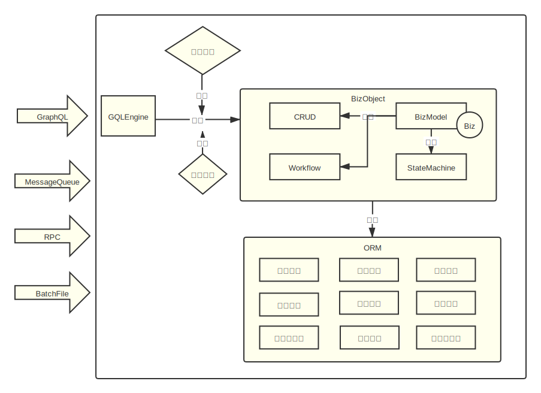

# Viewing the Design of the Open-Source Low-Code Platform Skyve Through Reversible Computation

[Skyve](https://github.com/skyvers/skyve) is an open-source business software construction platform written in Java. It supports rapid application development with no-code and low-code. It supports different database engines: MySQL, SQL Server, and the H2 database engine. Skyve adopts a relatively traditional backend low-code implementation approach, which is also a currently popular low-code/no-code scheme. In this article, we compare Skyve’s design with the Nop platform to help you understand what makes Nop unique.

## I. Multi-tenant Customization

Skyve is a multi-tenant system. It provides an interesting feature: Customer Override—in short, each tenant can have tenant-specific customized configurations, enabling each tenant to have unique functional implementations.

Skyve achieves this by creating model files under the /src/main/java/customers/{tenantId}/{modelPath} directory, thereby overriding the corresponding files under /src/main/java/modules/{moduleId}. This approach is similar to Docker’s layered filesystem design, where each tenant acts as a customization layer—upper-layer files override lower-layer files. Many low-code platforms essentially adopt similar customization schemes. However, compared to the Nop platform’s Delta customization mechanism based on Reversible Computation theory, we can see that Skyve’s scheme is a rather primitive, ad hoc design that does not truly tap into the power of Delta customization.

1. Skyve’s customization is specifically implemented for each type of model file rather than based on a general Delta filesystem concept. If a new type of model file needs to be added, Skyve must modify the implementation of FileSystemRepository.
2. Loading model objects based on file paths has not been abstracted into a unified ResourceLoader mechanism; it does not provide a model parsing cache or resource dependency tracking (automatically invalidating the model cache when dependent files change).
3. Customization files completely override the original files, and cannot inherit from the original files while including only Delta revisions in the customization files like the Nop platform can.

In the Nop platform, all model files are loaded in a unified way

```
model = ResourceComponentManager.instance().loadComponentModel(resourcePath)
```

> Refer to [custom-model.md](https://gitee.com/canonical-entropy/nop-entropy/blob/master/docs/dev-guide/model/custom-model.md) to configure the model loader corresponding to a file type.

For the /nop/auth/model/NopAuthUser/NopAuthUser.xmeta file, we can add a `/_delta/default/nop/auth/model/NopAutUser/NopAuthUser.xmeta` file, and at load time the system first searches for files under the _delta directory. By default, the “default” delta layer is enabled, but we can explicitly specify the list of enabled delta layers via the nop.core.vfs.delta-layer-ids parameter. In other words, Delta customization can be multi-layered, unlike Skyve’s single-layer Delta customization.

> Historically, we have used three layers of customization: platform—customize and fix platform built-in features; product—common functionality of the base product; app—custom functionality for specific applications.

In the customization file, we can use x:extends="super" to indicate inheritance from the previous layer's configuration, and only include Delta descriptions in the current file.

```xml
<meta x:extends="super">
    <props>
      <!-- Remove a field from the base model -->
      <prop name="fieldA" x:override="remove" />
      <prop name="fieldB">
         <!-- Add a dictionary configuration to fieldB -->
         <schema dict="xxx/yyy" />
      </prop>
    </props>
</meta>
```

Besides using x:extends="super", we can explicitly specify the base model to inherit:

```xml
 <meta x:extends="/nop/app/base.xmeta">
 </meta>
```

x:extends is a highly effective Tree structure decomposition mechanism, and it can also be applied to JSON files. For example, for front-end UI JSON, we can split a large page into multiple sub-files in a similar way:

```json
{
  type: "page",
  body: {
     ...
     {
        type: 'action',
        dialog: {
           "x:extends" : "xxx/formA.page.json",
           "title" : "zzz", // You can override properties inherited via x:extends here
        }
     }
  }
}
```

## II. Domain-Specific Models

Skyve aims to define models as much as possible through metadata rather than code, so it provides multiple XML-based domain models such as Document and View. This allows a large part of business logic to be described with XML files without writing Java code.

Skyve uses the XSD (XML Schema) language to regulate the format of XML model files and then leverages JAXB (Java Architecture for XML Binding) for XML parsing. Similarly, the Nop platform uses the metamodel definition language XDefinition to define the format of model files, but its design philosophy differs substantially from XSD:

### 1. Homomorphic Design

XDef explicitly adopts a homomorphic mapping design philosophy: the structure of the XDef metamodel remains consistent with the structure of the model itself, only adding annotations on top of the model’s syntax. For example, [view.xdef](https://gitee.com/canonical-entropy/nop-entropy/blob/master/nop-xdefs/src/main/resources/_vfs/nop/schema/xui/xview.xdef)

```xml
<!--
Includes form definitions, table definitions, and page frame composition
-->
<view bizObjName="string" x:schema="/nop/schema/xdef.xdef" xdef:check-ns="auth"
      xmlns:x="/nop/schema/xdsl.xdef" xmlns:xdef="xdef">

    <grids xdef:key-attr="id" xdef:body-type="list">
        <grid id="!xml-name" xdef:ref="grid.xdef"/>
    </grids>
   ...
</view>
```

The model structure it describes looks like this:

```xml
<view x:schema="/nop/schema/xui/xview.xdef" bizObjName="NopAuthUser"
      xmlns:x="/nop/schema/xdsl.xdef" xmlns:j="j">
    <grids>
        <grid id="list" >
            <cols>
                <!-- Username -->
                <col id="userName" mandatory="true" sortable="true"/>

                <!-- Nickname -->
                <col id="nickName" mandatory="true" sortable="true"/>
            </cols>
        </grid>
    </grids>
</view>
```

Basically, you treat the original model file as a template and replace concrete values with the corresponding stdDomain definitions. For example, id="!xml-name" indicates that the id attribute is non-empty and must satisfy the xml-name domain definition—that is, conform to XML naming rules.

> You can register custom stdDomain handlers via StdDomainRegistry.registerDomainHandler(handler).

The XDef metamodel is so simple and intuitive that OpenAI’s ChatGPT can already understand it directly. See [Validated strategies for GPT-driven low-code platforms to produce complete applications](https://zhuanlan.zhihu.com/p/614745000).

### 2. Executable Types

In mode definition languages such as XSD or JSON Schema, only fundamental data types are defined, and types with executable semantics are not. In the XDef metamodel, we can specify types such as stdDomain=expr/xpl, thereby automatically parsing XML text into expression objects or Xpl template objects.

With this mechanism, we can embed Turing-complete scripting languages and template languages into domain-specific languages (DSLs). Conversely, by leveraging compile-time macro processing in the Xpl template language, we can seamlessly embed arbitrary DSLs within the template language, thus achieving seamless fusion between general-purpose and DSL languages.

The Nop platform provides an IDEA plugin, [nop-idea-plugin](https://gitee.com/canonical-entropy/nop-entropy/tree/master/nop-idea-plugin). As long as the XDef metamodel definition is provided, the plugin can automatically support syntax hints, validation, and link navigation. Notably, it also provides breakpoint debugging capabilities, enabling step-by-step debugging of DSL code. In other words, we can easily develop a domain-specific language (just define the XDef metamodel) and provide a suite of developer tooling for that DSL without special programming. See [plugin-dev.md](https://gitee.com/canonical-entropy/nop-entropy/blob/master/docs/dev-guide/ide/plugin-dev.md).

### 3. Domain Coordinate System

In Skyve, XSD is only used as auxiliary information for XML serialization, with no other role. In the Nop platform, the XDef metamodel definition not only defines the domain model structure itself, but also provides a coordinate system for locating domain concepts within the domain model space!

In Nop’s domain models, every node corresponds to a unique path starting from the root (i.e., its unique coordinate), for example: `/view/grids[@id="list"]/cols/col[@id="fieldA"]/label` indicates the label attribute of the column with id=fieldA inside the grid with id=list.

> XPath syntax can also be used for locating within a tree structure; however, an XPath expression may match multiple nodes or attributes, so it is not a one-to-one description and cannot serve as a unique coordinate.

In XDef definitions, for each collection element, we typically add an xdef:key-attr attribute to indicate the unique identifier of its child nodes. For example, in the definition above, the XDef for the view’s grids collection element is:

```xml
    <grids xdef:key-attr="id" xdef:body-type="list">
        <grid id="!xml-name" xdef:ref="grid.xdef"/>
    </grids>
```

This practice is essentially the same as the key attributes required by the virtual DOM diff algorithms in front-end frameworks like Vue/React.

Given xdef:key-attr, if we want to add properties to existing table columns, we can do something like:

```xml
<view x:extends="_NopAuthUser.view.xml">
    <grids>
      <grid id="list">
        <cols>
           <!-- Remove an existing column -->
           <col id="fieldB" x:override="remove" />
           <col id="fieldA" width="Add new configuration">
           </col>
        </cols>
      </grid>
    </grids>
</view>
```

A conventional class inheritance mechanism cannot override properties of a specific element within a list in the base class!

With Delta computation based on domain models, many architecture-level features can be uniformly implemented by the platform rather than being baked into specific domain models. For example, the NopIoC dependency injection container uses a configuration syntax similar to Spring 1.0. It can leverage a unified Delta customization mechanism to remove system-provided bean definitions without any built-in bean exclusion logic in the engine, enabling NopIoC to provide dynamic configuration capabilities beyond SpringBoot with just ~4,000 lines of code.

```xml
<beans x:schema="/nop/schema/beans.xdef" xmlns:x="/nop/schema/xdsl.xdef"
       x:extends="super" x:dump="true">
    <bean id="nopDataSource" x:override="remove" />

    <bean id="nopHikariConfig" x:override="remove" />

    <alias name="dynamicDataSource" alias="nopDataSource" />
</beans>
```

The example above is the customization of [dao-defaults.beans.xml](https://gitee.com/canonical-entropy/nop-for-ruoyi/blob/master/ruoyi-admin/src/main/resources/_vfs/_delta/default/nop/dao/beans/dao-defaults.beans.xml) when integrating the Nop platform with the SpringBoot-based Ruoyi framework. It removes the Nop platform’s default data source definitions and sets an alias for Ruoyi’s built-in dynamicDataSource, enabling the Nop platform to use that data source directly.

### 4. Metaprogramming

In Skyve, all models are manually authored or fixed at initial code generation. If we observe frequently recurring structural patterns, it is difficult to abstract them. That is, Skyve does not provide mechanisms for further secondary abstraction atop its built-in models.

Reversible Computation theory suggests software construction can follow the formula:

```
  App = Delta x-extends Generator<DSL>
```

Generator is a crucial part of Reversible Computation theory. The Nop platform’s domain models have built-in metaprogramming mechanisms x:gen-extends and x:post-extends, which perform dynamic code generation during model parsing and loading. Through this mechanism, many common structural transformations can be moved from the runtime engine to compile time, dramatically simplifying runtime engine design and improving overall performance.

Take workflow as an example: to support countersignature, implementations usually add special handling in the engine. Conceptually, however, a countersign step is redundant: it can be decomposed into a normal step plus an implicit aggregation step. Thus, in NopWorkflow, supporting countersignature only requires adding a `<wf:CounterSignSupport/>` invocation in the x:post-extends section; it identifies countersign steps and automatically expands them into two nodes based on their properties.

This metaprogramming mechanism is extremely powerful because it resembles mathematical derivation: you only consider symbolic transformations to produce the desired result, without worrying about complex runtime state dependencies.

In the NopORM engine, support for JSON objects and extended fields is also implemented via compile-time techniques; the ORM engine itself does not embed such knowledge. See [orm-gen.xlib](https://gitee.com/canonical-entropy/nop-entropy/blob/master/nop-orm/src/main/resources/_vfs/nop/orm/xlib/orm-gen.xlib).

### 5. Custom Extensions

In Skyve, model object properties are fixed; we can only accept Skyve’s design and cannot add custom extension properties to model objects without modifying Skyve’s core code. In contrast, the Nop platform’s philosophy is Delta everywhere; every design uses a paired (base, delta) structure, and model objects must reserve space for extension properties. The general convention in Nop is: beyond attributes defined in the XDef metamodel, attributes with a namespace are treated as extension attributes by default. For example:

```xml
<prop name="fieldA" ui:show="C">...</prop>
```

Although ui:show is not defined in the XDef metamodel, it is preserved as an extension property on the model when parsed because it has a namespace; a validation error is not thrown.

> The (base, delta) pairing appears throughout the Nop platform. For instance, all messages are passed as (data, headers) pairs. In many cases, metadata can be seen as some Delta complement to data; and data and metadata can be transformed into each other depending on the context. If certain information is not needed by the current logic, it can be preserved and transmitted as metadata; at the next stage when it becomes relevant, part of the original data may be converted into metadata, and part of the original metadata may be converted into data for processing. The saying “metadata is data describing data” is not entirely accurate: in practice, metadata may include information irrelevant to the current application yet harmless (useless yet harmless).

### 6. Language Workbench

Skyve’s approach is rather traditional—it implements specific functionality for each model separately. The Nop platform’s approach is to provide a Language Workbench, offering technical support for developing domain-specific languages, so that we can quickly develop a DSL that fits domain needs. See [XDSL: General-purpose DSL design](https://zhuanlan.zhihu.com/p/612512300). A language workbench can be viewed as a Language Oriented Programming paradigm. JetBrains has a product called [MPS](https://www.jetbrains.com/mps/) specifically for LOP. The Nop platform’s goals are broadly similar to MPS, but it is founded on the systematic Reversible Computation theory, and it differs fundamentally from MPS in core software construction principles and technical approach.

In the Nop platform, all domain models are defined via a unified metamodel mechanism that conforms to the base XDSL grammar specification (defined by the [xdsl.xdef](https://gitee.com/canonical-entropy/nop-entropy/blob/master/nop-xdefs/src/main/resources/_vfs/nop/schema/xdsl.xdef) metamodel). Leveraging XDSL’s general capabilities, our custom DSLs can automatically gain Delta merging, metaprogramming, breakpoint debugging, visual design, etc. For example, for a workflow engine, we only need to implement the core runtime of the flow; we automatically obtain the visual flow designer, flow breakpoint debugging, Delta customization, inheritance of an existing flow template, and more without extra work.

Based on XDSL, we have naturally implemented seamless embedding across multiple DSLs—for instance, embedding a rules engine within a workflow engine, and triggering workflow steps in rules engine actions.

## III. Concrete Model Comparison

Beyond the general mechanisms above, the Nop platform’s implementations of specific domain models are more fine-grained, more abstract, and easier to extend than Skyve’s.

### 1. Data Model

In Skyve, the Document model describes object properties and associations among objects. It describes both interface structures between the front and backend and the persistent storage structure in the data layer. In the Nop platform, we accomplish similar tasks using the XMeta model and ORM.

Skyve is built on Hibernate; while it benefits from Hibernate’s powerful capabilities, it also inherits its drawbacks. The NopOrm engine is a next-generation ORM designed and implemented from scratch based on Reversible Computation principles. Through theoretical analysis, it defines an object query syntax EQL as the minimal object-oriented extension of SQL: EQL = SQL + AutoJoin. This overcomes certain inherent limitations of Hibernate at the theoretical level while preserving SQL’s native capabilities to the greatest extent. See [What kind of ORM engine does a low-code platform need (1)](https://zhuanlan.zhihu.com/p/543252423).

Skyve does not distinguish between the interface layer’s structural model and the storage layer’s structural model. In complex business scenarios, it is difficult to isolate the influences of different layers’ requirements and to accommodate long-term structural evolution. In the storage layer we want to reduce redundancy; in the interface layer we may need to return multiple derived datasets for the same underlying data.

The Nop platform can automatically generate GraphQL services from data models, with a series of common business features built in:

* Composite primary keys
* Automatic field encryption/decryption
* Generate masks for card numbers and similar fields
* Automatically generate corresponding label fields based on dictionary configurations (via metaprogramming in XMeta)
* Batch loading optimizations (resolving Hibernate’s common N+1 problem)
* Logical deletion
* Optimistic locking
* Automatically record the modifier and modification time
* Automatically record field values before and after entity changes
* Built-in MakerChecker approval mechanism—when enabled, modifications must be approved before committing
* One-shot commit for master-detail tables
* Recursive deletion of child table data
* Extension field support
* Database/table sharding
* Distributed transactions

See [What kind of ORM engine does a low-code platform need (2)](https://zhuanlan.zhihu.com/p/545063021).

### 2. Backend Service Extension

Skyve uses Bizlet for backend logic extension.

```java
class Bizlet{
      public void preSave(T bean) throws Exception {
    }

    public void preDelete(T bean) throws Exception {
    }

    public void postRender(T bean, WebContext webContext) {
    }
}
```

This design is clearly tied to CRUD logic. It is also incomplete: there is no simple way to intercept queries, adding pre- and post-query behaviors. Queries directly invoke storage-layer interfaces and do not pass through Bizlet.

In the Nop platform, the NopGraphQL engine decomposed at the object level corresponds to the BizModel model. It is a general service model and is not limited to CRUD services. CrudBizModel is just a base class that provides default action definitions. Leveraging metadata in XMeta, CrudBizModel can automatically implement complex parameter validation and master-detail structure save/copy features. The NopGraphQL engine also has very flexible data permission filtering, allowing precise control of access rights across complex object graphs via simple descriptive configurations. See the video [How to configure list filters in the Nop platform and add data permissions](https://www.bilibili.com/video/BV1Ac411H7my/).

Another key design point is that the Nop platform emphasizes framework-agnostic expression of business logic. Traditional service implementations depend on specific frameworks; for example, Skyve’s backend services use a WebContext object that directly contains HttpServletRequest and HttpServletResponse, thus binding the logic to a web runtime environment and making it difficult to migrate business code to non-web environments. In the Nop platform, the GraphQL engine’s input parameters and return objects are all POJOs, with no dependency on any specific runtime environment. NopGraphQL can be viewed as a pure logic engine. Its input can come from various sources; for example, it can read request objects from batch files, automatically transforming online services into batch-processing services (with NopOrm performing batch commit optimizations). It can also directly integrate with Kafka, transforming GraphQL services into message processing services (responses can be sent to a Reply Topic).



A POJO-based design also dramatically reduces unit testing difficulty; services can be tested individually without web server integration.

For details on the NopGraphQL design, see [GraphQL engine in a low-code platform](https://zhuanlan.zhihu.com/p/589565334).

### 3. Presentation Model

Skyve describes page structure through the View model, which can be considered a front-end framework with a small set of fixed components.

```xml
<view xmlns="http://www.skyve.org/xml/view"
    xmlns:xsi="http://www.w3.org/2001/XMLSchema-instance"
    name="_residentInfo" title="Resident Info"
    xsi:schemaLocation="http://www.skyve.org/xml/view ../../../../schemas/view.xsd">
    <form border="true" borderTitle="Resident Info">
        <column percentageWidth="30" responsiveWidth="4" />
        <column />
        <row>
            <item>
                <default binding="parent.residentName" />
            </item>
        </row>
    </form>
    <form border="true" borderTitle="Resident Photo">
        <column percentageWidth="30" responsiveWidth="4" />
        <column />
        <row>
            <item showLabel="false">
                <contentImage binding="parent.photo" />
            </item>
        </row>
    </form>
</view>
```

The Nop platform’s XView model has a similar role to Skyve’s View model but adopts a more business-oriented abstraction by separating concepts such as forms, tables, layout, actions, and pages. In particular, form layout information and form control content are separated via the NopLayout layout language. For example:

```xml
<view>
    <forms>
        <form id="edit" size="lg">
            <layout>
                ========== intro[Product Introduction] ================
                goodsSn[Product Code] name[Product Name]
                counterPrice[Market Price]
                isNew[New Release] isHot[Hot Recommendation]
                isOnSale[On Shelf]
                picUrl[Product page image]
                gallery[Product promotional images list, JSON array format]
                unit[Unit, e.g., piece, box]
                keywords[Product keywords, comma-separated]
                categoryId[Category ID] brandId[Brand ID]
                brief[Product Summary]
                detail[Product Detailed Description, rich text]

                =========specs[Product Specifications]=======
                !specifications

                =========goodsProducts[Inventory]=======
                !products

                =========attrs[Product Parameters]========
                !attributes

            </layout>
            <cells>
                <cell id="specifications">
                    <gen-control>
                        <input-table addable="@:true" editable="@:true"
                                     removable="@:true" needConfirm="@:false">
                            <columns j:list="true">
                                <input-text name="specification" label="Spec Name" required="true"/>
                                <input-text name="value" label="Spec Value" required="true">
                                </input-text>
                                <input-text name="picUrl" label="Image" required="true"/>
                            </columns>
                        </input-table>
                    </gen-control>
                    <selection>id,specification,value,picUrl</selection>
                </cell>
              </cells>
      </form>
  </forms>
</view>
```

The NopLayout language expresses complex UI layout rules very compactly. Display controls for individual fields are automatically inferred based on data types and domains defined in the data model and typically need not be specified. If the inferred control does not meet requirements, you can specify a display control for a specific field using a cell’s gen-control configuration.

> Interestingly, the NopLayout layout syntax is also very easy for ChatGPT to understand and emulate. See [How to overcome GPT’s input token limits and produce complex DSLs](https://zhuanlan.zhihu.com/p/615685144).

For NopLayout syntax rules, see [Form layout language in a low-code platform: NopLayout](https://zhuanlan.zhihu.com/p/592131885).

Skyve’s View model design also has an issue: what if the default UI model doesn’t meet requirements? Skyve’s current answer is that there’s little it can do—if it’s beyond the original model design, you must abandon the entire page and start from scratch using other techniques. In the Nop platform, with Delta merging, we can implement partial inheritance and then add partial Delta descriptions.

The Nop platform uses the Baidu AMIS framework on the frontend—an excellent, powerful low-code frontend framework. See [Why Baidu AMIS is an excellent design](https://zhuanlan.zhihu.com/p/599773955). Our frontend page descriptors are JSON generated at compile time based on XView. On top of auto-generated JSON, we can apply minimal Delta customizations. As long as a page falls within AMIS’s capabilities, we can reuse XView through partial inheritance without writing pages from scratch.

```yaml
# The main.page.yaml file is generated from the XView model by default

x:gen-extends: |
  <web:GenPage view="NopAuthUser.view.xml" page="main"
        xpl:lib="/nop/web/xlib/web.xlib" />
```

A natural question is: what if AMIS cannot describe a particular page structure? First, AMIS’s capabilities can be extended via custom components. Since all frontend control structures can ultimately be represented as abstract syntax trees (AST) and serialized to JSON, AMIS’s JSON form is, in principle, complete—there is nothing it cannot describe (in the most extreme case, the whole page is displayed via a single custom component that reads and interprets its body configuration). Alternatively, using code generation and metaprogramming, we can provide a new interpreter for XView and translate XView into Vue or React source code.

### 4. Code Generation

Skyve provides a Maven plugin that can generate entity class code, etc., based on XML model configurations. Its generator is relatively simple—it produces output by concatenating text in Java code. The Nop platform’s XCodeGenerator is a more systematic solution.

First, XCodeGenerator supports incremental code generation. Generated code and manually modified enhanced code are stored separately and do not interfere with each other; you can regenerate code from the model at any time without overwriting manual changes.

Second, XCodeGenerator is a data-driven generator. Template directory structures control conditionals and loops in the generation process. For example, /{!enabled}{entityModel.name}.java indicates that a Java file will be generated per entity only when the enabled attribute is true.

Third, XCodeGenerator—like other models in the Nop platform—supports Delta customization. That is, without modifying platform-built-in templates, you can override built-in template files by adding corresponding files under the delta directory.

Fourth, XCodeGenerator supports custom models and can be used independently outside the Nop platform. For example, beyond the built-in data and API models, we can define an Excel-format domain model for a specific business domain. Providing just an imp.xml descriptor file allows Excel files to be automatically parsed into domain model objects, which can then be fed to custom code generation templates to produce target files.

For details on XCodeGenerator, see [Data-driven Delta-based code generator](https://zhuanlan.zhihu.com/p/540022264).

### 5. Reporting Tools

Skyve uses JasperReports to generate reports, which is insufficient for complex Chinese-style reporting needs. The Nop platform provides NopReport, a Chinese-style reporting engine using Excel as the visual designer. With about 3,000 lines of code, it implements hierarchical coordinate expansion, a hallmark of Chinese-style reporting theory. See [Open-source Chinese-style reporting engine using Excel as the designer: NopReport](https://zhuanlan.zhihu.com/p/620250740). [Demo video](https://www.bilibili.com/video/BV1Sa4y1K7tD/)

For Word template export, the Nop platform also provides a Word template engine using Word as the visual designer. It leverages Nop’s built-in XPL template language to convert Word files into dynamic templates in about 800 lines of code. See [How to implement a visual Word template like poi-tl in ~800 lines of code](https://zhuanlan.zhihu.com/p/537439335).

### 6. Automated Testing

Skyve provides an interesting automated testing capability: it can automatically generate corresponding WebDriver test cases based on data and View models.

```xml
<automation uxui="external" userAgentType="tablet" testStrategy="Assert"
    xsi:schemaLocation="http://www.skyve.org/xml/sail ../../../skyve/schemas/sail.xsd"
    xmlns="http://www.skyve.org/xml/sail"
    xmlns:xsi="http://www.w3.org/2001/XMLSchema-instance">

    <interaction name="Menu Document Numbers">
        <method>
            <navigateList document="DocumentNumber" module="admin"/>
            <listGridNew document="DocumentNumber" module="admin"/>
            <testDataEnter/>
            <save/>
            <testDataEnter/>
            <save/>
            <delete/>
        </method>
    </interaction>
```

Because Skyve has model knowledge, its generated test cases can automatically leverage information already present in the model. For example, testDataEnter indicates that random test values should be generated for each field in the form.

The Nop platform goes deeper with model information. Beyond using model knowledge for inputs, we can capitalize on model-driven advantages to capture all side effects across the system and record them. This allows converting test cases dependent on complex states into pure logic test cases with no side effects. See [Automated testing in a low-code platform](https://zhuanlan.zhihu.com/p/569315603).

## IV. The Value of Theory

The fundamental difference between the Nop platform and all other low-code platforms is that it is based on a new software construction theory—Reversible Computation. It starts by establishing a minimal set of concepts and then builds a large technical system through rigorous logical derivation. Reversible Computation overcomes the limitations of component theory at the theoretical level, paving the way for system-level, coarse-grained software reuse. As a reference implementation of Reversible Computation, the Nop platform provides unified technical tooling to solve common problems encountered during domain modeling.

The Nop platform solves problems differently from other platforms. Take Excel model parsing: the usual approach is to specify a format for a particular business need and implement a corresponding Excel parsing function. Different models mean multiple different parsing functions. In the Nop platform, we specify rules for mapping Excel structures to domain object structures and build a unified generic parser. In category-theoretic terms, Nop’s Excel model parser is a functor mapping from the Excel category (containing infinitely many different Excel file formats) to the domain object category (containing infinitely many different domain object structures). If we also define an inverse report export functor from the DSL model object category to the Excel category, they can form an adjoint functor pair.

A functor defines a structure-preserving mapping from each object in Domain A to an object in Domain B.
Category theory’s principal approach is via functors. Concretely, to solve a specific problem, we first enlarge it into a functor mapping problem, thereby solving a set of related problems in one shot and indirectly achieving the specific goal. Such “enlarging the problem” solutions are undeniably bold; if they succeed, the only possibility is that the domain admits mathematically defined, stable, reliable laws—it is science.

Some may not be interested in Reversible Computation theory, considering it mere academic rhetoric disconnected from software engineering practice. But Vapnik, the father of statistical learning, said: “nothing is more practical than a good theory.” Reversible Computation expands the solution space and reveals many previously unseen technical possibilities. Guided by Reversible Computation, the Nop platform, with modest technical cost (currently about a hundred thousand lines of code), captures unified construction laws in the software structure space and defines a viable technical path toward intelligent low-code development. We can see clearly where we’re heading and where we currently stand. In the coming years, terms like Delta, Reversible, and Generative will frequently appear across technical domains; their integrated application will inevitably lead toward Reversible Computation theory.

> An interesting observation: deep learning’s computation pattern corresponds to `Y = Sigma( W*X + B) + Delta`. Considering residual connections, the deep learning formula and Reversible Computation’s construction formula are strikingly similar. Reversible Computation naturally involves multiple deeply nested models, just like multilayer neural networks in deep learning.

Since creating the Nop platform community, I often hear feedback like: “Ah, so you can do it that way.” That’s normal—one cannot understand what one has not yet understood. Trying a Nop platform development example may help you better grasp Reversible Computation theory. Only when we need to customize existing functionality or mechanisms in the platform (or our own base product) for specific business requirements do we truly appreciate the vast differences between the Nop platform and all public technologies.

Nop platform open-source addresses:

- gitee: [canonical-entropy/nop-entropy](https://gitee.com/canonical-entropy/nop-entropy)
- github: [entropy-cloud/nop-entropy](https://github.com/entropy-cloud/nop-entropy)
- Development examples: [docs/tutorial/tutorial.md](https://gitee.com/canonical-entropy/nop-entropy/blob/master/docs/tutorial/tutorial.md)
- [Introduction and Q&A on Reversible Computation and the Nop platform_bilibili](https://www.bilibili.com/video/BV1u84y1w7kX/)

It is recommended that Skyvue standardize the logic for model customization, so that when adding new model types you don’t need to modify FileSystemRepository.

<!-- SOURCE_MD5:5357dd750fd2145b7144ada5790f4b8c-->
