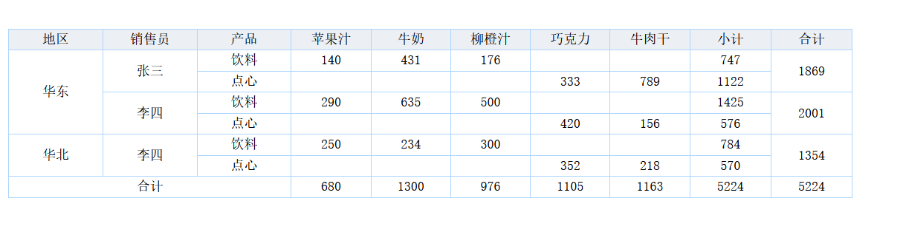
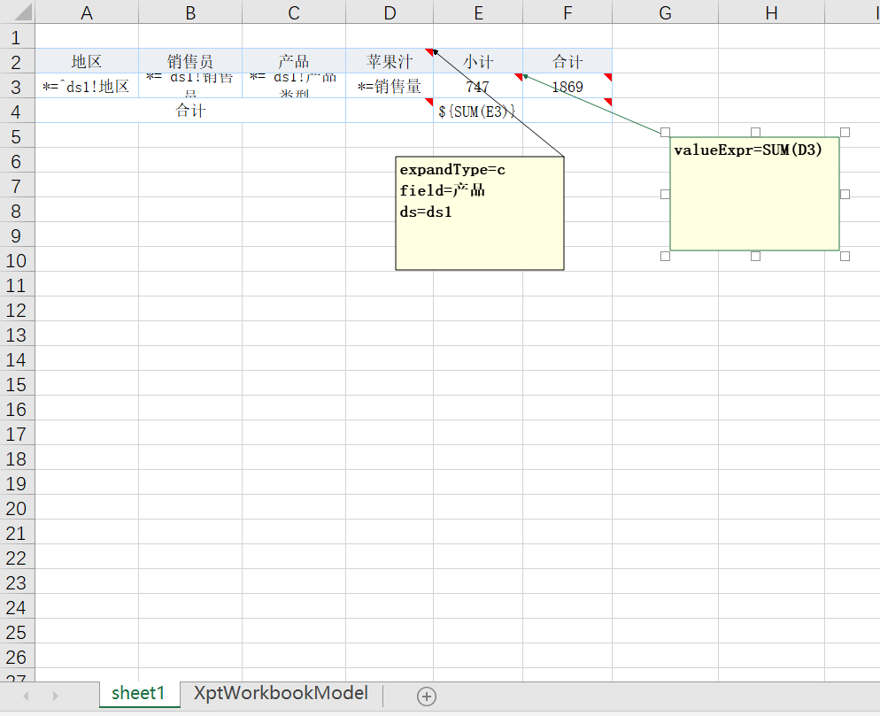
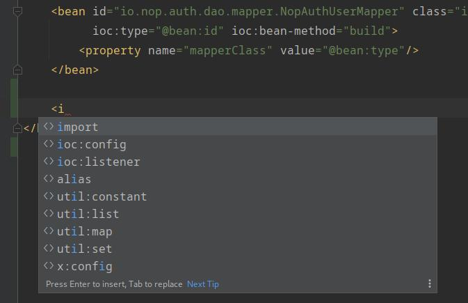
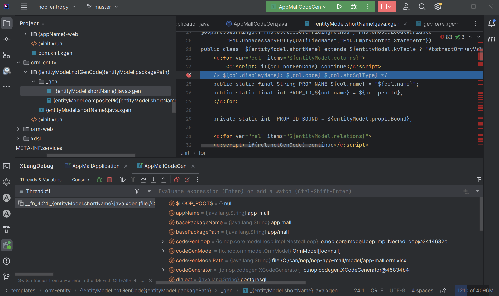

# Feature Comparison Between the Nop Platform and SpringCloud

The Nop Platform is a next-generation low-code platform designed and implemented from scratch based on the principles of Reversible Computation. Its goal is not to provide preset development scaffolding and visual design tools targeting a few fixed scenarios, but to break down the man-made barriers between declarative programming and traditional imperative programming, establishing a new programming paradigm that makes the two seamlessly compatible and continuously expands the semantic space covered by declarative programming. To achieve this goal at the lowest technical cost, the Nop Platform does not adopt the industry’s mainstream foundational open-source frameworks; instead, it reshapes the entire technical stack based on the principles of Reversible Computation. This article briefly lists the “wheels” the Nop Platform has built and compares them to the existing “wheels” in the SpringCloud technology stack.

| Component               | Nop stack     | Spring stack                       |
| ----------------------- | ------------- | ---------------------------------- |
| Web Framework           | NopGraphQL    | SpringMVC                          |
| Expression Engine       | XLang XScript | SpringEL                           |
| Template Engine         | XLang Xpl     | Velocity/Freemarker                |
| ORM Engine              | NopORM        | JPA/Mybatis                        |
| IoC Container           | NopIoC        | SpringIoC                          |
| Dynamic Configuration   | NopConfig     | SpringConfig                       |
| Distributed Transaction | NopTcc        | Alibaba Seata                      |
| Automated Testing       | NopAutoTest   | SpringBootTest                     |
| Distributed RPC         | NopRPC        | Feign RPC                          |
| Reporting Engine        | NopReport     | JasperReport                       |
| Rule Engine             | NopRule       | Drools                             |
| Batch Engine            | NopBatch      | SpringBatch                        |
| Workflow Engine         | NopWorkflow   | Flowable/BPM                       |
| Task Scheduling         | NopJob        | Quartz                             |
| XML/JSON Parsing        | NopCore       | Jaxb/Jackson                       |
| Resource Abstraction    | NopResource   | Spring Resource                    |
| Code Generator          | NopCodeGen    | Various custom generators          |
| IDE Plugin              | NopIdeaPlugin | Mybatis plugin/Spring plugin, etc. |

The Nop Platform can be used directly as a foundational development framework similar to SpringCloud. At the ProCode level it can greatly simplify the software development process and significantly improve software extensibility.

## I. IoC Container

A declarative IoC container was the core capability that helped Spring rise to prominence. However, since Spring 2.0, SpringIoC has gradually lost its declarative nature, resulting in the runtime being mixed with a lot of imperative logic. A typical symptom is: changing the package scan order in Spring will subtly alter the bean wiring results.

NopIoC builds upon the Spring 1.0 wiring syntax and adds conditional wiring logic similar to SpringBoot, and at runtime it fully reduces to the Spring 1.0 syntax to execute. The loading order of beans files and the declaration order of beans do not affect the final wiring result.

```xml
@ConditionOnMissingBean
@ConditionOnProperty("test.my-bean.enabled")
@Component
public class MyBean{
    @Inject
    OtherBean other;
}
```

Corresponding NopIoC configuration:

```xml
<bean id="myBean" ioc:default="true" class="test.MyBean">
  <ioc:condition>
     <if-property name="test.my-bean.enabled" />
  </ioc:condition>
</bean>
```

NopIoC supports standardized annotations such as `@Inject`, `@PostConstruct`, `@PreDestroy`, and it is compatible with Spring-specific `@Autowired`. However, it does not use package scanning to discover bean definitions; instead, beans must be declared in a beans.xml file.

Because the Nop Platform extensively adopts model-driven mechanisms to generate code dynamically, many bean definitions are automatically generated into configuration files, and there is actually very little that needs to be written by hand. You can also write an extension scanning function to use NopIoC’s metaprogramming capabilities to dynamically generate bean definitions. For example:

```xml
<beans>
   <x:gen-extends>
      <ioc-gen:scan packages="test.my,test.other" />
   </x:gen-extends>
</beans>
```

### Bean Customization

What makes NopIoC unique is that you can customize wiring logic via standard Delta customization. For example, you can remove an existing bean definition using the following:

```xml
<beans x:extends="super">
    <bean id="dataSource" x:override="remove" />
</beans>
```

### Dynamic Configuration

NopIoC is designed with unified integration with the NopConfig configuration center. In beans.xml you can denote dynamic configuration items via special prefixes:

```xml
<bean id="xx">
   <property name="poolSize" value="@r-cfg:my.pool-size|5" />
</bean>
```

The `@r-cfg:` prefix indicates a dynamic configuration item. When the configuration center changes the configuration, the bean property will be automatically updated.

Additionally, the beans syntax defines a dedicated ioc:config node:

```xml
  <ioc:config id="nopOrmGlobalCacheConfig" class="io.nop.commons.cache.CacheConfig"
    ioc:config-prefix="nop.orm.global-cache"  ioc:default="true"/>
```

The NopIoC container automatically tracks all references to `ioc:config`. Once the configuration changes, it will automatically trigger the refresh-config method defined on those beans that use the config.

The ioc:config-prefix serves a role similar to Spring’s `@ConfigurationProperties`, used to specify the prefix of configuration items in the configuration file.

### Interoperability with SpringIoC

NopIoC and the Spring container can be used together. Generally, NopIoC starts after SpringIoC has initialized, and it can obtain beans managed by Spring through the parentContainer. Therefore, in NopIoC you can directly inject Spring-managed beans via `@Inject`. In beans managed by Spring, you can use beanContainer to retrieve beans managed by NopIoC by name or by type.

```java
BeanContainer.intance().getBean(beanName)
BeanContainer.intance().getBeanByType(beanType)
```

NopIoC aims to be a better SpringIoC. It adheres to a strictly declarative design, can be integrated within the Spring ecosystem, and its entire codebase is under 5,000 lines. For more detailed design, see: [If We Were to Rewrite SpringBoot, What Different Choices Would We Make?](https://zhuanlan.zhihu.com/p/579847124)

## II. Web Framework

In the SpringCloud technology stack, we typically call Service from Controller to implement specific business logic, and in the Controller we handle structure transformation or composition work, such as converting entity objects to DTOs. To implement GraphQL service interfaces, we need to use the graphql-java package to rewrite the interface layer code and cannot directly reuse Controllers to expose services.

The NopGraphQL engine greatly simplifies the design of the service interface layer. In general, we can directly expose domain model objects as external service interfaces, implement permission control and structural adaptation at the metadata layer, and avoid adaptation and transformation in the Controller layer.

For example, even for the simplest web service, we still need to specify URL patterns and parameter passing (query params, path params, or body). Many times we inadvertently introduce dependencies on HttpServlet interfaces, binding the entire service to a specific web runtime environment.

```java
@RestController
public class MyController{
    @PostMapping(value = "/echo/{id}")
    public String echo(@QueryParam("msg") String msg,
                 @PathParam("id") String id, HttpServletRequest request) {
        return "Hello Nacos Discovery " + msg + ",id=" + id;
    }
}
```

In the Nop Platform, we only need to add the `@BizModel` annotation on the domain model object, then mark the service method and parameter names.

```xml
@BizModel("MyObject")
public class MyObjectBizModel{
    @BizQuery
    public PageBean<MyEntity> findPage(@Name("id") id,
             FieldSelection selection, IServiceContext ctx){
       return ....
    }
}
```

1. NopGraphQL can provide REST services, but it enforces a fixed URL pattern: `/r/{bizObjName}__{bizAction}`, so you don’t have to design link patterns for each request.

2. Methods marked with @BizQuery can be accessed via POST and GET, while methods marked with @BizMutation support only POST. This automatic inference also helps prevent misuse.

3. For parameters, you only need to mark the parameter names with @Name; there’s no need to specify the passing mode.

4. Methods marked @BizMutation will automatically enable transaction management, so there’s no need for additional @Transactional annotations.

### GraphQL as a General Decomposition and Composition Solution


NopGraphQL not only simultaneously provides GraphQL and REST service modes, but its role in the Nop Platform is to serve as a general-purpose decomposition and composition solution. In the Nop Platform, all message services, batch services, RPC services, etc., upon receiving a request message, deliver it to the GraphQLEngine for processing.

Ordinary web framework service methods generally do not support directly returning entity objects because entity objects typically contain too much information and are not suitable for direct serialization to the frontend. However, under the coordination of the GraphQL engine, the return value of the service method is not returned directly to the frontend; it is enhanced by selection and the Data Loader. Given this, NopGraphQL completely delegates the result conversion and adaptation work to the GraphQL engine (based on metadata provided by XMeta). That is, you can implement an adaptation layer through configuration without a separately designed Controller adaptation layer.

The NopGraphQL engine can be used outside a web environment, in any scenario requiring work decomposition and result selection/adaptation. It provides an IServiceContext context object that is runtime-independent (essentially equivalent to a Map). You can use it to cache and share data across multiple service calls to optimize batch processing performance.

### Distributed RPC

In the SpringCloud technology stack, the server automatically registers itself with the service registry on startup, and then the client adds a Feign interface to achieve load-balanced calls. Canary releases, A/B testing, etc., can leverage the service routing mechanism here.

In NopGraphQL, we also add a service invocation interface:

```java
    public interface RuleService{

        CompletionStage<ApiResponse<RuleResultBean>> executeRuleAsync(ApiRequest<RuleRequestBean> request);

        default ApiResponse<RuleResultBean> executeRule(ApiRequest<RuleRequestBean> request){
            return FutureHelper.syncGet(executeRuleAsync(request));
        }
    }
```

1. Service interfaces support both asynchronous and synchronous invocation modes; asynchronous methods conventionally return CompletionStage and have the Async suffix in their method names.

2. It is stipulated that request parameters be of type ApiRequest and return results of type ApiResponse, enabling direct setting and reading of headers at the message object layer without relying on underlying runtime interfaces.

3. No additional annotations are required on the service interface—e.g., no need to add @Path for REST path declarations.

Create a distributed RPC client via beans.xml configuration:

```xml
    <bean id="testGraphQLRpc" parent="AbstractRpcProxyFactoryBean"
          ioc:type="io.nop.rpc.client.TestRpc">
        <property name="serviceName" value="rpc-demo-consumer"/>
    </bean>
```

By setting nop.rpc.service-mesh.enabled=true, you can enable service mesh mode and bypass client-side load-balancing proxies.

For detailed introductions, see:

1. [GraphQL Engine in a Low-Code Platform](https://zhuanlan.zhihu.com/p/589565334)

2. [Distributed RPC Framework in a Low-Code Platform (about 3,000 lines of code)](https://zhuanlan.zhihu.com/p/631686718)

## III. Storage Layer

The NopORM engine includes most of the features of SpringData, JPA, and MyBatis, and adds a large number of commonly used capabilities in business development, such as field encryption, logical deletion, change history tracking, extension fields, multi-tenancy, etc.

At the API level, NopORM usage is very similar to Spring, except it always uses XML model files instead of JPA annotations.

```java
IEntityDao<NopAuthUser> dao = daoProvider.daoFor(NopAuthUser.class);


MyEntity example = dao.newEntity();
example.setMyField("a");
// Find the first matching record
MyEntity entity = dao.findFirstByExample(example);

QueryBean query = new QueryBean();
query.setFilter(and(eq(MyEntity.PROP_NAME_myField,"a"), gt(MyEntity.PROP_NAME_myStatus,3)));
query.setLimit(5);

List<MyEntity> list = dao.findPageByQuery(query);
```

Generally, methods provided on the built-in IEntityDao are already sufficiently rich. They support very complex query conditions, so there is no need to generate a separate DAO interface for each entity. You typically obtain the corresponding IEntityDao via the DaoProvider.

For complex queries, you can directly use a MyBatis-like sql-lib mechanism and manage complex dynamic SQL via XML models.

```java
@SqlLibMapper("/app/mall/sql/LitemallGoods.sql-lib.xml")
public interface LitemallGoodsMapper {
    void syncCartProduct(@Name("product") LitemallGoodsProduct product);
}
```

Add the @SqlLibMapper annotation on the Mapper interface to define the mapping between the sql-lib model and the Java interface.

In a sql-lib model, you can generate SQL statements via the Xpl template language:

```xml
        <eql name="syncCartProduct" sqlMethod="execute">
            <arg name="product"/>

            <source>
                update LitemallCart o
                set o.price = ${product.price},
                  o.goodsName = ${product.goods.name},
                  o.picUrl = ${product.url},
                  o.goodsSn = ${product.goods.goodsSn}
                where o.productId = ${product.id}
            </source>
        </eql>
```

### Excel Model-Driven

The Nop Platform provides a very powerful model-driven development model. It can parse Excel data model files to automatically generate entity definitions, Mapper interface definitions, metadata definitions, backend GraphQL services, and even frontend add/update/query pages.


For detailed designs, see:

1. [What Kind of ORM Engine Does a Low-Code Platform Need? (2)](https://zhuanlan.zhihu.com/p/545063021)

2. [Data-Driven Delta Code Generator](https://zhuanlan.zhihu.com/p/540022264)

3. [Nop Platform: An Open-Source Low-Code Platform Based on the Theory of Reversible Computation](https://zhuanlan.zhihu.com/p/612433693)

4. [How a Low-Code Platform Adds Extension Fields to Entities Without Altering Tables](https://zhuanlan.zhihu.com/p/618851796)

## IV. Underlying Language

The Nop Platform provides the XLang language designed specifically for DSL development, which includes multiple sub-languages: XScript scripting language, Xpl template language, XTransform structure transformation language, and XDef meta-model definition language. Among them:

1. The XScript scripting language has a syntax similar to JavaScript and supports a Java-like type system; it can be used as a general-purpose expression language.

2. The Xpl template language is similar to FreeMarker, supports custom tag libraries, and supports compile-time macro processing.

3. The XDef meta-model definition language is similar to XML Schema; it is a very simple and intuitive meta-model definition language.

4. XTransform is a general tree structure transformation language similar to XSLT.


At the bottom layer, the Nop Platform has substantially transformed XML handling. It merely uses the basic XML syntax form and does not use the JAXB standard or the commonly used XML parsers in Java. Instead, XML and JSON parsers were written entirely from scratch. Compared to commonly used XML parsers and DOM models, the Nop Platform’s XNode structure is simpler and more intuitive. It has a built-in SourceLocation tracking mechanism and can be directly used as a generic AST node.

```java
XNode node = XNodeParser.instance().parseFromText(loc, text);

node.getTagName() // Read the tag name
node.getAttr(name) // Read an attribute
node.setAttr(name,value) // Set an attribute

node.attrText(name) // Get a text attribute; returns null if the text value is empty rather than an empty string
node.attrTextOrEmpty(name) // Returns empty string if the attribute value is empty; returns null if the attribute does not exist
node.attrInt(name) // Get the attribute value and convert it to Integer
node.attrInt(name, defaultValue) // Return the default value if the attribute value is empty
node.attrBoolean(name) // Read the attribute value and convert it to Boolean
node.attrLong(name) // Read the attribute value and convert it to Long
node.attrCsvSet(name) // Read a string attribute and convert it to a set by splitting on commas

node.getAttrs() // Get the attribute map
node.getChildren() // Get child nodes
node.childByTag(tagName) // Find a child node by tag name
node.childByAttr(attrName, attrValue) // Find a child node by attribute value
node.getContentValue() // Read the node’s content value

node.hasChild() // Whether there are child nodes
node.hasAttr() // Whether there are attributes
node.hasContent() // Whether the direct content is non-empty
node.hasBody()  // Whether there are child nodes or direct content

node.getParent() // Get the parent node

node.cloneInstance() // Clone the node

list = node.cloneChildren() // Clone all child nodes

node.detach() // Detach from the parent

node.remove() // Remove from the parent

node.replaceBy(newNode) // Replace this node with newNode in the parent’s children list

node.xml() // Get the node’s XML text
node.innerXml() // Get the node’s inner XML text

node.toTreeBean() // Convert to a TreeBean object

XNode.fromTreeBean(treeBean) // Convert from a TreeBean to XNode
```

Compared to expression and template languages in the Spring ecosystem, the Nop Platform’s XLang language has stronger design consistency:

1. Multiple sub-languages share many syntax features.

2. Multiple sub-languages share a global function library.

3. General Java functions can be registered as global functions.

4. The syntax resembles JavaScript and supports object function calls.

5. A highly customizable expression parser, SimpleExprParser, is provided. ReportExprParser (used in the reporting engine) and RuleExprParser (used in the rule engine) are both customized on top of this expression engine.

6. Systematic support for compile-time metaprogramming, such as macro functions and macro tags.

For further details, see:

1. [Metaprogramming in a Low-Code Platform](https://zhuanlan.zhihu.com/p/652413095),

2. [XDef: A Unified Meta-Model Definition Language to Replace XSD](https://zhuanlan.zhihu.com/p/652191061),

3. [Design Essentials of DSLs from the Perspective of Reversible Computation](https://zhuanlan.zhihu.com/p/646144092)

## V. Import/Export

NopReport is an open-source, from-scratch implementation of a Chinese-style reporting engine based on the theory of Reversible Computation. Its core codebase is short—just over 3,000 lines (see the [nop-report-core](https://link.zhihu.com/?target=https%3A//gitee.com/canonical-entropy/nop-entropy/tree/master/nop-report/nop-report-core) module)—with high performance (performance test code at [TestReportSpeed.java](https://link.zhihu.com/?target=https%3A//gitee.com/canonical-entropy/nop-entropy/blob/master/nop-report/nop-report-demo/src/test/java/io/nop/report/demo/TestReportSpeed.java)), and a level of flexibility and extensibility difficult for other reporting engines to match.

Within the [Nop Platform](https://link.zhihu.com/?target=https%3A//gitee.com/canonical-entropy/nop-entropy), NopReport is positioned as a general modeling tool for tabular data structures. Any functionality that needs to generate tabular data can be converted into a NopReport report model object. For example, the database reverse-engineering command provided by the NopCli command-line tool analyzes database schemas and generates an Excel model file. This Excel model is produced by converting an import template into a report output model.





Compared with other reporting engines, NopReport has the following distinctive characteristics:

1. Uses Excel as the template designer.

2. Can directly use domain model objects as data objects; DataSet is only an optional form of data object. (Typical reporting engines only support tabular data.)

3. Extends the concept of hierarchical coordinates on top of a general expression syntax rather than using a specially designed reporting expression syntax.

4. Supports multiple sheets and loop generation.

Beyond data export, NopReport also supports importing custom data structures. No coding is required—only minimal configuration is needed to import Excel data models. All Excel model files used in the Nop Platform, such as ORM entity models and API interface models, are imported via the reporting import mechanism.

For detailed introductions, see:

1. [An Open-Source Chinese-Style Reporting Engine Using Excel as the Designer: NopReport](https://zhuanlan.zhihu.com/p/620250740)

2. [How to Implement a Visual Word Template Like poi-tl in 800 Lines of Code](https://zhuanlan.zhihu.com/p/537439335)

3. [How to Support Dynamic Columns and Styles When Importing/Exporting Excel](https://www.bilibili.com/video/BV1M14y1271a/)

## VI. Logical Orchestration

The Nop Platform provides engines for business rules, workflow, batch processing, and task scheduling—covering the full description of general business logic.


See: [NopRule: A Rule Engine Using Excel as the Visual Designer](https://zhuanlan.zhihu.com/p/655192140)

## VII. Automated Testing

SpringBootTest provides integration between the Spring framework and test frameworks such as JUnit. In the Nop Platform, you can use dependency injection to obtain beans under test simply by extending the JunitAutoTest base class.

```java
@NopTestConfig(localDb = true,initDatabaseSchema = true)
public class TestGraphQLTransaction extends JunitAutoTestCase {
    @Inject
    IDaoProvider daoProvider;

    @Inject
    IGraphQLEngine graphQLEngine;

    @EnableSnapshot
    @Test
    public void testRollback() {
        GraphQLRequestBean request = new GraphQLRequestBean();
        request.setQuery("mutation { DemoAuth__testFlushError }");
        IGraphQLExecutionContext context = graphQLEngine.newGraphQLContext(request);
        GraphQLResponseBean response = graphQLEngine.executeGraphQL(context);
        output("response.json5", response);
        assertTrue(response.hasError());
        assertTrue(daoProvider.daoFor(NopAuthRole.class).getEntityById("test123") == null);
    }
}
```

Through the @NopTestConfig annotation, you can easily control certain configuration switches related to automated testing.

What makes the NopAutoTest framework unique is that it provides model-driven automated testing. It can implement automated testing of complex business functions via recording and replay mechanisms—no test code needs to be written by hand.

See: [Automated Testing in a Low-Code Platform](https://zhuanlan.zhihu.com/p/569315603)

## VIII. Tooling

The Nop Platform provides a code generator integrated with Maven that can be used independently outside the Nop Platform. Based on user-defined model files and user-defined code templates, it generates specified code in a delta-based incremental manner. Typical code generators, whether for models or templates, find it difficult to support fine-grained customization.

See: [Data-Driven Delta Code Generator](https://zhuanlan.zhihu.com/p/540022264)

NopIdeaPlugin provides a general IntelliJ IDEA plugin. It automatically recognizes the meta-model specified by the x:schema attribute on an XML root node and implements attribute hints, link navigation, and format validation according to the meta-model. For code snippets, it also provides breakpoint debugging.





## Conclusion

Compared to SpringCloud, the Nop Platform has the following characteristics:

1. Simple and direct implementation principles. The code size is generally an order of magnitude smaller than Spring components, yet the core functionality is richer.

2. Supports Delta-based customization. You can add Delta model files under the Delta directory to customize all existing features (including built-in platform features). For example, all data models and all designer pages can be freely customized.

3. Leverages code generation and metaprogramming for automatic inference, greatly reducing the amount of code that must be written by hand and ensuring a high level of internal structural consistency.

4. Uniformly uses the XDSL specification to implement DSL models. You can add new DSL models at any time or add new extension attributes to existing DSLs. The IDE plugin automatically recognizes and supports new DSL models without writing specialized support plugins.

5. Model-driven processes are integrated into DevOps. Code generation and model transformation are performed during the Maven packaging process, eliminating the need to deploy a separate model management platform.

The Nop Platform can serve as an extension component running atop SpringCloud. It does not conflict with SpringCloud’s built-in mechanisms. Its internal components can be replaced with SpringCloud implementations—but doing so will lose many advanced features, reduce performance and extensibility, and undermine the inferability of the program’s structure.

<!-- SOURCE_MD5:79cb16f1ebb21473e4d86ec93a90d9d2-->
