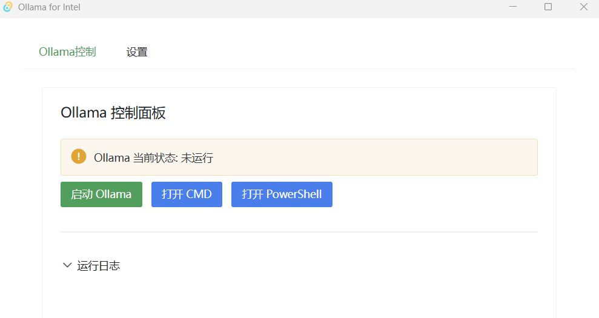

# Translating Long Documents with a Locally Deployed DeepSeek 8B Model

    With the emergence of DeepSeek, AI large models have begun to democratize technology; deploying a model of around 8B locally can already enable useful features. This article briefly introduces a practical workflow for translating technical documents using the DeepSeek large model, along with some issues encountered during the translation process.

## Model Selection
Using Ollama to run AI large models on a local laptop, I tried the following options:
1. `qwen2.5:7b`
This model often slightly rewrites the Chinese input and outputs it in Chinese instead of translating, and it frequently adds extra Markdown block markers in its output.

2. `deepseek-r1:7b`
This model has issues similar to `qwen2.5`: it often outputs Chinese during translation instead of actually translating, and it cannot understand further corrective instructions. If you increase the temperature, say to above 1, it often responds with irrelevant math-related answers.

3. `deepseek-r1:8b`
Better than the previous two. Under the same conditions and higher temperature settings, `deepseek-r1:7b` starts producing nonsense, while `deepseek-r1:8b` can still remain largely normal.

4. `deepseek-r1:14b`
Sometimes throws errors and runs slowly. Some numbers seem to get rewritten.

5. `ollama3.1:8b`
If you set the input to 8k, the output gets truncated. 2k also gets truncated.

6. `phi4:14b`
Consumes 12 GB of memory. At 4k it is better than `ollam3.1:8b`, but it still cannot fully translate at 8k.

## Environment Setup
My laptop is a ThinkPad X1 Carbon 2024 with an Intel Arc-series GPU, which provides GPU acceleration.

To enable Ollama to support Intel GPUs, you can download the Ollatel installer from [https://github.com/francisol/ollatel/releases](https://github.com/francisol/ollatel/releases) and run it directly.

Ollatel provides a simple Ollama control interface.



For a visual chat interface during debugging, you can use [ChatBox](https://chatboxai.app/zh).

Download the DeepSeek model via the command line with `ollama pull deepseek-r1:8b`.

### Adjusting the Maximum Token Counts for Input and Output
Ollama’s default input context length is 2048, which can cause truncation for longer prompts.
You can pass the `num_ctx` parameter when invoking, or create a file named `deepseek-8b-8k.txt` that adds the num_ctx configuration:

```
FROM deepseek-r1:8b

PARAMETER num_ctx 8192
PARAMETER num_predict -1
```

Then run `ollama create deepseek-r1:8b-8k -f deepseek-8b-8k.txt` to create a new model named `deepseek-r1:8b-8k`.

Increasing the context length will increase runtime memory consumption.

<!-- SOURCE_MD5:4767c70ae128055f52f080ce4f8b2cb5-->
