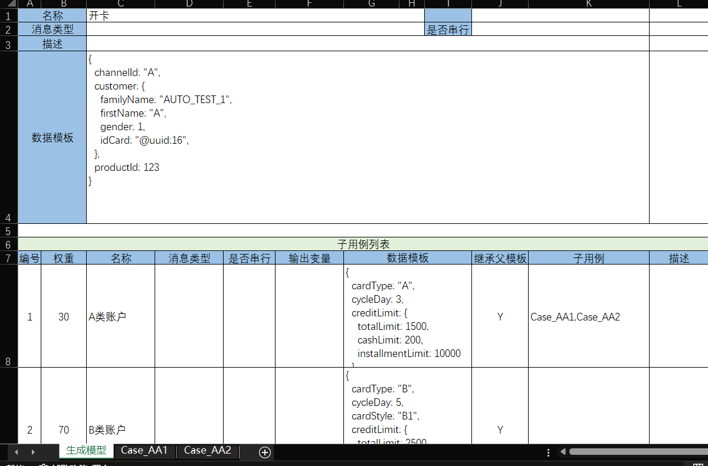

# Test Data Generator

The `batch-gen` model provides a mechanism for dynamically generating test data in proportion.




The following examples are generated in proportion:
1. Generate 30% of A-type accounts and 70% of B-type accounts.
2. The A-type account is further divided into Case_AA1 and Case_AA2. Case_AA1 includes sequential sub-cases, where the main case is executed first, followed by the dependent case.
   After executing the sub-case, the temporary variable can be recorded using `@var:mainCard.id`, which can then be referenced in subsequent cases.

In the batch processing model, the generator configuration can reference the `batch-gen` model to generate data based on bulk processing.

```xml
<batch>
  <loader>
    <generator genModelPath="create-card.batch-gen.xlsx" totalCountExpr="totalCount"/>
  </loader>
</batch>
```
