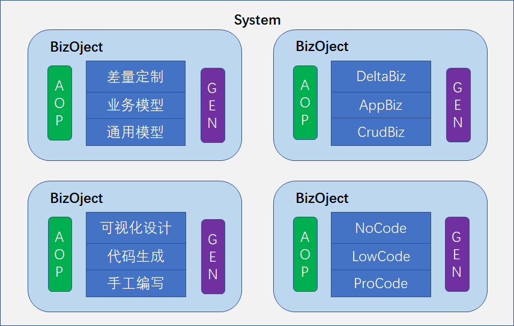

# Scalable Design of Backend Service Functions from the Perspective of Reversible Computation

Many low-code platforms are fundamentally built around a CRUD model, typically offering a certain level of customization through built-in extension points (such as before-insert, after-insert, etc.). In the Nop platform, the CRUD model is not special; the built-in CrudBizModel is merely a regular BizModel, and the core of the Nop platform does not apply any special treatment to CRUD extension points. In this article, I will use CrudBizModel as an example to explain common extension approaches for implementing backend services in the Nop platform.

## I. Providing customization hooks via callback functions

Most service functions in CrudBizModel adopt two layers of abstraction. The upper-layer function calls the lower-layer implementation and uses parameters and callback functions to achieve customization.

```javascript
    public PageBean<T> findPage(@Optional @Name("query") QueryBean query,
                                FieldSelectionBean selection, 
                                IServiceContext context) {
        return doFindPage0(query, getBizObjName(), prepareQuery, 
                   selection, context);
    }

    @BizAction
    public PageBean<T> doFindPage0(@Name("query") QueryBean query,
                                   @Name("authObjName") String authObjName,
                                   @Name("prepareQuery") BiConsumer<QueryBean, 
                                   IServiceContext> prepareQuery, 
                                   FieldSelectionBean selection,
                                   IServiceContext context) {
         query = prepareFindPageQuery(query, authObjName, 
                     METHOD_FIND_PAGE, prepareQuery, context);                      
        ...
    }
```

The findPage function is implemented via the extensible function `doFindPage0`, which provides two configurable parameters:

1. authObjName: By default, it corresponds to the current business object name (bizObjName). Specifying different values allows applying different data permission filters for different business scenarios.
2. prepareQuery: The query parameter corresponds to the query conditions passed from the frontend. The backend validates that all query fields and operators are within the allowed range based on the XMeta model configuration. The prepareQuery callback can add extra query conditions on top of the frontend-provided query without requiring validation for the appended conditions.

Using callback functions provides a composition-based extension approach, which is more flexible than class inheritance and method overriding.

## II. Using the XMeta metadata model to unify dynamic processing patterns

Traditional function reuse only reuses identical logic, at most offering several callbacks as limited extension points. However, many times there is no exactly identical logic; what we can abstract is a processing pattern. For example, the basic logic of a save function is as follows:

1. Validate the fields submitted from the frontend
2. For entities supporting logical deletion, check whether there exists an entity marked as deleted
3. Check for duplicates in the database, e.g., disallow multiple users with the same ID number
4. Create entity objects from request data; special handling is needed for complex master–detail structures

While the overall structure of the save logic is consistent across different entities, the details differ. For instance, each field has different types and validation rules, and some fields require transformation logic to convert frontend values into the format required by the backend. The fields used to ensure uniqueness also vary across entities.
In the Nop platform, each business object can be associated with an XMeta file, through which the metadata of the business object can be defined.

> XMeta metadata is more flexible and powerful than Java annotations; it supports metaprogramming and custom extensions and automatically validates structure via the XDef metamodel. For an introduction to XMeta, see [xmeta.md](../xlang/xmeta.md)

```java
   public T save(@Name("data") Map<String, Object> data, IServiceContext context) {
        return doSave(data, null, this::defaultPrepareSave, context);
   }

    @BizAction
    public T doSave(@Name("data") Map<String, Object> data, 
                    @Name("inputSelection") FieldSelectionBean inputSelection,
                    @Name("prepareSave") BiConsumer<EntityData<T>, 
                    IServiceContext> prepareSave, 
                    IServiceContext context) {
        if (CollectionHelper.isEmptyMap(data))
            throw new NopException(ERR_BIZ_EMPTY_DATA_FOR_SAVE)
                 .param(ARG_BIZ_OBJ_NAME, getBizObjName());

        // 1. Perform input validation and transformation based on XMeta configuration
        ObjMetaBasedValidator validator = 
            new ObjMetaBasedValidator(bizObjectManager, bizObj.getBizObjName(),
                objMeta,context, true);

        Map<String, Object> validated = 
              validator.validateForSave(data, inputSelection);

        // 2. Determine whether logical deletion is enabled based on ORM entity model parameters
        T entity = recoverLogicalDeleted(data, objMeta);
        boolean recover = true;
        if (entity == null) {
            recover = false;
            entity = dao().newEntity();
        }

        EntityData entityData = new EntityData<>(data, validated, entity, objMeta); 

        // 3. Check for duplicate records based on unique keys configured in XMeta
        checkUniqueForSave(entityData);

        // 4. Determine how to set master–detail data onto the newly created entity based on XMeta configuration
        new OrmEntityCopier(daoProvider, bizObjectManager)
                .copyToEntity(entityData.getValidatedData(),
                    entityData.getEntity(), null, entityData.getObjMeta(), 
                    getBizObjName(), BizConstants.METHOD_SAVE, 
                    context.getEvalScope());

        // 5. Check that the entity’s attributes satisfy data authorization requirements and are visible to the current user
        checkDataAuth(BizConstants.METHOD_SAVE, entityData.getEntity(), context);

        // 6. Execute additional customization logic
        if (prepareSave != null)
            prepareSave.accept(entityData, context);

        doSaveEntity(entityData, context);

        return entityData.getEntity();
    }
```

The Nop platform provides general-purpose ObjMetaBasedValidator and OrmEntityCopier, which can leverage information in the XMeta metadata model to uniformly implement input validation and entity construction.

Similar approaches are frequently used in various generic processing functions. For example, findTreeEntityPage uses the TreeModel configuration in XMeta to generate query statements for hierarchical structures.

Another benefit of using XMeta is support for Delta customization. Across different applications, we can use different XMeta models for the same business object to customize the actual processing logic. With strongly typed DTOs, it is difficult to achieve such logic customization without modifying the base product’s source code.

Combining GraphQL’s object composition capability, XMeta’s object structure abstraction capability, and Reversible Computation’s Delta capability, most CRUD-related logic can be consolidated. Generally, there is no need to write CRUD-related code or generate massive amounts of code for different scenarios; unified implementations can meet primary needs, and at most we supplement the CRUD model with delta information that diverges from the standard CRUD processing flow.

## III. Locally extending domain models via prefix-guided syntax

The Nop platform provides a Language Oriented Programming paradigm. That is, to solve current business problems, we do not directly use a general-purpose language; instead, we first build a domain-specific language (DSL) and then use that language to express business logic.

There’s no need to consider DSLs mysterious or complicated; essentially, they are the textual representation of a model. DSL-ization is fundamentally model-ization: once we build an abstract model for the business problem and choose a textual representation for it, it naturally becomes a DSL.

In the context of frontend-backend separation and microservices, all interactions between frontend and backend and among backend services must occur via serialized object data. If we aggregate related functionality at the semantic level and expose only a few coarse-grained service interfaces, the parameters of these interfaces are effectively a DSL.

Service functions can be regarded as virtual machines executing a DSL; different input parameters guide the VM to execute different processing logic. For a concrete example, generic query functions like findPage/findList provided by CrudBizModel take a QueryBean as the query conditions object, which can be considered a DSL describing composite query conditions for complex object structures.

```
POST /r/NopAuthDept__findPage

{
   "query": {
      "filter": {
          "$type": "or",
          "$body": [
             {
                "$type": "eq",
                "name": "status",
                "value": 1
             },
             {
                "$type": "gt",
                "name": "parent.status",
                "value": 2
             }
          ]
      },
      "orderBy":[
         {
           "name": "status",
           "desc" : false
         }
      ]
   }
}
```

In the backend, the query object corresponds to the QueryBean structure. It is a generic query model that can be freely converted between XML and JSON.

```xml
<query>
  <filter>
     <or>
       <eq name="status" value="1" />
       <gt name="parent.status" value="2" />
     </or>
  </filter>
  <orderBy>
     <field name="status" desc="false" />
  </orderBy>
</query>
```

With the QueryBean query model, we can express complex query conditions with nested and/or relationships. Leveraging the NopORM engine’s association query capability, composite property syntax such as `parent.status` can automatically perform master–detail join queries.

> In general, a unified findPage function suffices for most business queries; there’s no need to write numerous bespoke query functions. The XMeta model can control which fields support which query operators, how many fields can be queried at once, etc., helping prevent the frontend from constructing overly complex queries that could result in Denial-of-Service attacks.

Each model can be considered a DSL, and the same DSL can be interpreted and executed by different interpreters in different application scenarios. Using QueryBean as an example, we can convert it into an SQL statement for execution by the database, or compile it into a Predicate function running in memory. A rules engine can use QueryBean to express complex conditions, and a frontend business rules designer can automatically generate visualization and editing tools based on the DSL content.


The Nop platform comes with numerous DSLs and provides various representation transformations (e.g., every DSL automatically has an Excel representation, allowing usage via Excel without programming) and supports seamless embedding between DSLs. This means that, in typical business development, we seldom need to create new DSLs.
However, this does not restrict us to only the built-in model semantics of the Nop platform. All models in Nop undergo multiple model transformations before actual execution. During this process, we can introduce our own DSL translation rules to add new extension semantics to existing DSL models.

A commonly used technique in Nop is prefix-guided syntax. Specifically, we introduce a special prefix, such as `@filter:`, which enhances a raw value into a domain structure that the interpreter can augment.

> For a detailed introduction to prefix-guided syntax, see my article [DSL layered syntax design and prefix-guided syntax](https://zhuanlan.zhihu.com/p/548314138)

This approach largely preserves the overall form of the original DSL model and only performs local extensions, allowing it to be combined with other syntactic structures.

For example, suppose there is a special query requirement to concisely filter out already selected records. This need can be represented with prefix-guided syntax:

```xml
<notIn name="id" value="@filter:selectedItemIds" />
```

All query conditions in CrudBizModel go through the global IQueryTransformer.

```java
public interface IQueryTransformer {
    void transform(QueryBean filter, String authObjName, String action,
                   IBizObject bizObj, IServiceContext context);
}
```

Combined with the XMeta capability described in the previous section, we can obtain extension configuration information from XMeta via bizObj to determine how to interpret the expression following the `@filter:` prefix. One feasible approach is to map it directly to an Xpl template tag and then generate subqueries or dynamically retrieve the corresponding data sets.

## IV. Adding service functions via XBiz models

At the level of global logical organization, the Nop platform extensively adopts a layered overlay structure similar to Docker image layers. For backend services, the Nop platform decomposes a business object (BizObject) into multiple slices with different priorities.



For example, a CrudBizModel written in Java can be regarded as a foundational behavior slice developed in a ProCode mode. Each business object has a paired XBiz model file (XML format), which acts as a DSL for extending BizModel. Within it, we can define business methods using XML syntax. The XBiz model is a higher-priority behavior slice overlaying the underlying CrudBizModel. If a service method with the same name is defined in the XBiz model, it directly overrides the Java implementation. If there is no name collision, it adds new business methods to the business object. At an even higher layer, there may be dynamic behavior slices introduced in a no-code programming mode, stored in a dynamic model definition table in the database. At startup, they are automatically loaded, published as a model file in the virtual file system, and then use the virtual file system’s Delta customization mechanism to overlay the original XBiz file.

```xml
<biz x:schema="/nop/schema/biz/xbiz.xdef" xmlns:x="/nop/schema/xdsl.xdef"
     x:extends="_NopAuthUser.xbiz" xmlns:bo="bo" xmlns:c="c">

    <actions>
        <query name="active_findPage" x:prototype="findPage">

            <source>
                <c:import class="io.nop.auth.api.AuthApiConstants" />

                <bo:DoFindPage query="${query}" selection="${selection}" xpl:lib="/nop/biz/xlib/bo.xlib">
                    <filter>
                        <eq name="status" value="${AuthApiConstants.USER_STATUS_ACTIVE}" />
                    </filter>
                </bo:DoFindPage>
            </source>
        </query>
    </actions>
</biz>
```

- XBiz models can inherit existing model files or code-generator-produced model files via the general `x:extends` syntax.
- In the `<source>` section, we can use custom tags from the Xpl template language to implement custom encapsulations. The Xpl template language provides implicit parameters and compile-time transformations, enabling more concise domain-specific expressions than general-purpose programming languages.

For example, the `bo.xlib` tags provide wrappers for functions like `doFindPage/doFindList` in CrudBizModel.

```xml
<source>
    <bo:DoFindPage bizObjName="NopAuthUser" xpl:lib="/nop/biz/xlib/bo.xlib" selection="items{name,status}">
       <filter>
          <c:if test="${xxx}">
             <eq name="status" value="1" />
          </c:if>  

          <!-- A more concise expression can be used -->
          <eq name="status" value="1" xpl:if="xxx" />
       </filter>
    </bo:DoFindPage>
</source>
```

- If the `<bo:DoFindPage>` tag specifies the `bizObjName` parameter, it invokes the method on the specified business object; otherwise, it invokes the method on the current context’s `thisObj`.
- If the selection parameter is specified, after fetching the entities it automatically calls `dao.batchLoadSelection(entityList,selection)` to batch-load all specified properties, avoiding performance issues where later access triggers lazy loading one by one.
- The filter child node of `<bo:DoFindPage>` essentially provides the `prepareQuery` callback of the `doFindPage` function mentioned in Section I; here we can use the Xpl template language to dynamically generate query conditions.

The implementations of the bizObjName and selection attributes in this tag are interesting: they both leverage the Xpl custom tag’s compile-time transformation mechanism.

```xml
 <DoFindPage>
    <attr name="query" optional="true" type="io.nop.api.core.beans.query.QueryBean"/>
    <attr name="authObjName" optional="true" type="String" />
    <attr name="selection" optional="true" type="io.nop.api.core.beans.FieldSelectionBean"/>
    <attr name="bizObjName" optional="true" />
    <attr name="thisObj" implicit="true" type="io.nop.biz.api.IBizObject"/>
    <attr name="svcCtx" implicit="true" type="io.nop.core.context.IServiceContext"/>


    <transform>
         <c:script><![CDATA[
            const bizObjName = node.attrText('bizObjName');
            if(bizObjName != null){
               $.checkArgument(bizObjName.$isValidSimpleVarName(),"bizObjName");
               node.setAttr(node.attrLoc('bizObjName'),'thisObj', "${inject('nopBizObjectManager').getBizObject('" +bizObjName+"')}");
            }
            const selection = node.attrText('selection');
            if(selection and !selection.contains('${')){
                node.setAttr(node.attrLoc('selection'),'selection', "${selection('"+selection+"')}");
            }
        ]]></c:script>
    </transform>
    <source>
      ...
    </source>
</DoFindPage>        
```

At compile time, if bizObjName or selection is non-empty, they are automatically transformed into expressions:

```xml
<bo:DoFindPage thisObj="${inject('nopBizObjectManager').getBizObject('NopAuthUser')}"
    selection="${selection('items{name,status}')}">
  ...
</bo:DoFindPage>
```

- The selection function is a global macro function. It parses its parameter at compile time into a `FieldSelectionBean` object, so at runtime it uses the already parsed result without re-parsing.

- Compared to using Java to implement the same capability, Xpl tags are more concise at call sites and can avoid repeating information that can be automatically inferred.

- Consider how to express the logic “If bizObjName is specified, call the specified object; otherwise, call the current thisObj” in a programming language. When we don’t need thisObj, can we completely hide this concept in the DSL description?

## V. Enhancing XBiz models via metaprogramming

Once we introduce DSL model files like XBiz, we can immediately apply standardized metaprogramming patterns to bring more custom extensions into the DSL model. For example, in an XBiz file we can introduce logic orchestration support as follows:

```xml
<biz>
  <x:post-extends>
    <biz-gen:TaskFlowSupport xpl:lib="/nop/core/xlib/biz-gen.xlib"/>
  </x:post-extends>

  <actions>
    <mutation name="callTask" task:name="test/DemoTask"/>
  </actions>
</biz>
```

- `x:post-extends` is executed automatically at compile time during model parsing. The `<biz-gen:TaskFlowSupport>` tag automatically transforms function nodes that have `task:name`, generating code to invoke TaskFlowManager.

- We can use a visual logic orchestration designer to design `Task`, and then in the XBiz model simply specify the `task:name` associated with the service function.

For detailed introductions, see:

- [Implement backend service functions via NopTaskFlow logic orchestration](../workflow/task-flow-for-biz.md)

- [XDSL: A general domain-specific language design](https://zhuanlan.zhihu.com/p/612512300)

<!-- SOURCE_MD5:8c3acfe7d6e4a0714387a0d8f8085884-->
