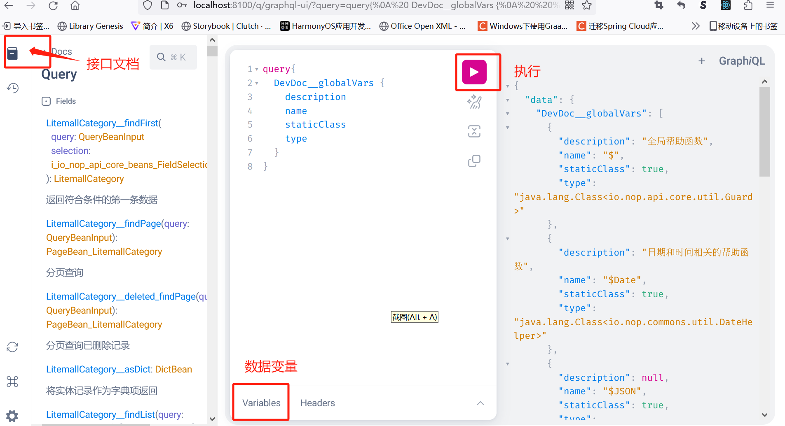

# Development and Debugging

## Debug Mode

Setting nop.debug=true enables debug mode; only then will DevDoc and other backend services for debugging be registered, and `_dump` files will be output.

The default configuration file is `application.yaml`. If you want to enable environment-specific configuration files such as `application-dev.yaml`, you must configure the corresponding `nop.profile` in bootstrap.yaml or application.yaml.

## Error Localization

Backend exceptions are generally standardized using the NopException class. It has a SourceLocation property that indicates the corresponding XLang source location where the error occurred. The NopException class also reports the XLang execution stack; when printing the exception message, the Xpl stack information will be output. For example:

```
io.nop.api.core.exceptions.NopException: NopException[seq=4,status=-1,errorCode=nop.err.xui.ref-view-not-exists,params={viewPath=/app/mall/LitemallGoods/attributes.page.yaml},desc=view配置不存在：/app/mall/LitemallGoods/attributes.page.yaml]@_loc=[114:22:0:0]/app/mall/pages/LitemallGoods/LitemallGoods.view.xml
  @@getFormSelection(formModel,objMeta)@[7:30:0:0]/nop/web/xlib/web/page_simple.xpl
  @@</_delta/default/nop/web/xlib/web.xlib#GenPage>("/app/mall/pages/LitemallGoods/LitemallGoods.view.xml","add",null)@[1:17:0:0]/app/mall/pages/LitemallGoods/add.page.yaml
  @@__fn_1()@[1:17:0:0]/app/mall/pages/LitemallGoods/add.page.yaml
```

This exception indicates:

1. add.page.yaml invoked the GenPage tag in web.xlib
2. The GenPage tag invoked `page_simple.xpl`
3. `page_simple.xpl` called the getFormSelection function at line 7
4. Inside the function, it accessed the `LitemallGoods.view.xml` model file and found that its configuration at line 114 was incorrect.

## Logging Information

### 1. Configuration Parameters
If nop.debug=true is set, the system will print all configuration parameter values and the config files they originate from at startup (since multiple configuration files may exist, and higher-priority files will override lower-priority ones).

```
# [84:11:0:0]classpath:application.yaml
quarkus.log.level=INFO
```

### 2. Model File Parsing
All model files will print logs during parsing, including the time spent parsing.

```
2023-07-11 21:13:16,152 INFO  [io.nop.cor.res.com.par.AbstractResourceParser] (Quarkus Main Thread) nop.core.component.finish-parse-resource:usedTime=10,path=/nop/schema/beans.xdef,parser=class io.nop.core.lang.xml.parse.XNodeParser
```

### 3. Conditionally Assembled Beans
Set the logging level of io.nop.ioc to debug; at startup the system will print the evaluation results of conditional beans.

```
quarkus:
  log:
    category:
      "io.nop":
        level: DEBUG
```

The NopIoC container first analyzes the presence conditions of all beans, and then creates them. The analysis results are printed to the logs. For disabled beans, the reason for being disabled is printed:

```
disabled-bean:id=nopLoginService
    loc=[15:6:0:0]/nop/auth/beans/sso-defaults.beans.xml,trace=null
    check-if-property-fail:nop.auth.sso.enabled=null
```

In the `_dump` directory, `/nop/main/beans/merged-app.beans.xml` outputs all beans that were finally activated, along with the source code locations of the configuration files they correspond to.

### 4. Database Access
All database access SQL statements are recorded in the logs, along with the SQL execution time.

```
2023-07-11 21:14:39,637 INFO  [io.nop.dao.jdb.imp.JdbcTemplateImpl] (Quarkus Main Thread) nop.jdbc.run:usedTime=1,querySpace=default,range=0,1,name=jdbc:null,sql=select o.SEQ_NAME as c1
from nop_sys_sequence as o
 where o.DEL_FLAG =  0
```

### 5. Successful Initialization
After the Nop platform initializes successfully, it prints the total time spent on initialization and a banner.

```
2023-07-11 21:14:40,562 INFO  [io.nop.cor.ini.CoreInitialization] (Quarkus Main Thread) nop.core.end-initialize:usedTime=87286
```

### 6. Virtual File Scanning
When the Nop platform starts, it uses a class scanning mechanism to find all virtual files under `_vfs` directories. When starting in debug mode, the scan results are output to nop-vfs-index.txt. This file records all accessible virtual file paths.

## Log Output

### 1. XScript has built-in functions like logInfo/logDebug

```javascript
 logInfo("nop.err.invalid-name:name={}",name);
```

The first argument must be a static string; forms like "sss"+yyy are not allowed, which also prevents log injection attacks. Note that the first argument uses the slf4j message template syntax, and variable placeholders must be denoted by `{}`.

For implementation details of the logging functions, see `LogFunctions.java` and `LogHelper.java`.

### 2. Invoking the $ function on any object will print a debug statement

```javascript
b = a.f().$("test")
```

The above call is equivalent to `b = DebugHelper.v(location(), "test",a.f());`, where the test parameter is a custom hint message.
Therefore, when you want to inspect the value of any expression, you can append a $ call to it. The printed debug information is as follows:

```
21:00:01.686 [main] INFO io.nop.xlang.utils.DebugHelper - test:a.f()=>1,loc=[6:8:0:0]file:/C:/can/nop/nop-entropy-bak/nop-xlang/target/test-classes/io/nop/xlang/expr/exprs/debug.test.md
```

test is the custom prefix information. a.f() is the source code of the expression to inspect; `=> 1` indicates that the expression returns 1. loc corresponds to the source location of the debug statement.

> You can set conditional breakpoints in DebugHelper to debug Java source code.

### 3. In the xpl template language

```xml
<c:log info="${data}" />
```

Annotating an xpl tag with `xpl:dump="true"` will print the parsed AST (Abstract Syntax Tree). For macro tags, you will see the result after macro processing.

```xml
<my:MyTag xpl:dump="true" />
```

## Model Dump

The Nop platform heavily uses metaprogramming to dynamically generate code. To effectively trace the details of code generation and make the actual origin of the runtime code snippets obvious, the Nop platform automatically outputs merged result model files to the `_dump` directory at the project root in debug mode. After starting the application, you will see a large number of output files under the `_dump` directory.


If the result file is produced by merging multiple Delta files, you will see the source location information for each originating node/attribute in the result file.

On the root node of an XDSL model, you can also add the `x:dump="true"` attribute, which will print more detailed execution traces of the merge algorithm into the logs.

```javascript
DslNodeLoader.INSTANCE.loadFromResource(resource, null, XDslExtendPhase.validate);
```

DslNodeLoader can load XDSL files and return the merged XNode. XNode merging is internally divided into multiple phases; you can merge up to a specific intermediate phase and return via XDslExtendPhase.

## XLang Debugger

The Nop platform’s `nop-idea-plugin` module provides an IDEA plugin that includes a debugger for the XScript language, enabling breakpoint debugging for all XDSL domain languages. See the documentation [idea-plugin.md](../user-guide/idea/idea-plugin.md)

## GraphQL Debugging Tool

The Quarkus framework includes a built-in `graphql-ui` debugging tool. After starting the application in debug mode, you can access the debug page via `/q/graphql-ui`.
On this page, you can view the definitions of all backend GraphQL endpoints and types, and you will get auto-completion while typing.



## Frequently Asked Questions

## Frontend

### 1. The frontend control corresponding to a field displays empty and cannot be edited

It is likely that control.xlib does not define a corresponding editor for the field. At the debug log level, the XuiHelper.getControlTag function will print the control mapping result. For example:

```
 nop.xui.resolve-control-tag:controlTag=edit-int,prop=id,domain=null,stdDomain=null,stdDataType=int,mode=add
```

### 2. Uploading a file returns 415 Unsupported Media Type

This is an error reported by the Quarkus framework. You can set quarkus.log.level to DEBUG.
Backend services need to include

### 3. The frontend UI does not display, and errors indicate certain JS is Not Found
The frontend bundled with the Nop platform is packaged via the nop-chaos project, and the packaged JS files are stored in the nop-web-site module. They use gz compression; the actual filenames look like `amis-xxx.js.gz`.
At runtime, a Filter must redirect access to JS files to access the corresponding js.gz files. The specific implementation is in the ZipContentEncodingFilterRegistrar class. This class uses Quarkus’s IoC container for initialization.
Quarkus’s IoC container does not use runtime classpath scanning; it generates code at compile time and stores all class information centrally in a jandex index. Therefore, you must run mvn install to execute Quarkus’s Maven plugin to generate the code.
Starting QuarkusDemoMain directly in the IDE will cause ZipContentEncodingFilterRegistrar not to be discovered automatically.

## Backend

### 1. Backend beans are not injected as expected

First check whether the result in the `_dump` directory `/{appName}/nop/mai/beans/merged-app.beans.xml` of the startup project meets expectations.
This file is the final result output by the IoC container after running all dynamic decision logic. It also prints the source files of properties and objects. For example:

```xml
<!--LOC:[18:6:0:0]/nop/auth/beans/auth-service.beans.xml-->
    <bean class="io.nop.auth.service.login.DaoLoginSessionStore" id="$DEFAULT$nopLoginSessionStore" ioc:aop="false"
          name="nopLoginSessionStore">
        <property name="daoProvider" ext:autowired="true">
            <ref bean="$DEFAULT$nopDaoProvider" ext:resolved-loc="[51:6:0:0]/nop/orm/beans/orm-defaults.beans.xml"/>
        </property>
        <property name="sessionIdGenerator" ext:autowired="true">
            <ref bean="$DEFAULT$nopSessionIdGenerator"
                 ext:resolved-loc="[34:6:0:0]/nop/auth/beans/auth-core-defaults.beans.xml"/>
        </property>
    </bean>
```

1. If the node path differs from that of the previous sibling node, LOC information will be printed.
2. `ext:autowired="true"` indicates that this property is automatically injected via the `@Inject` annotation.
3. The `ext:resolved-loc` attribute indicates the configuration file path where this object is defined.
4. `ext:resolved-trace="/nop/auth/beans/app-service.beans.xml"`. The `ext:resolved-trace` attribute can indicate which beans.xml imported the XML file containing this bean.

### 2. How to view the beans loaded by the current application

In debug mode, you can view the actually loaded beans via the `/p/DevDoc__beans` link.

### 3. How to view globally defined functions and objects in the system

In debug mode, visit the following links:

1. `/r/DevDoc__globalFunctions`
2. `/r/DevDoc__globalVars`

In the returned results, you can see the actual corresponding Java classes and methods of these functions and variables.

### 4. How to view the set of active configuration variables

The nop-config module is responsible for collecting configuration information from multiple sources and deciding the override relationships among them according to priority. The final set of active configuration variables can be viewed via:
`/r/DevDoc__configVars`

The returned results include the resource file path for each configuration variable.

### 5. How to view all backend GraphQL services and type definitions

`/p/DevDoc__graphql`
Returns the GraphQL definitions.

If the nop-rpc-grpc module is introduced, you can also view the service descriptions exposed in gRPC format via `/p/DevDoc__proto`.

### 6. Debugging the model merge process

Add logging output code or use extension attributes in the `x:gen-extends` or `x:post-extends` section to output debug information.

```xml
<orm>
  <x:gen-extends>
    <orm ext:time="${now()}" xgen:x:dump="true" />
  </x:gen-extends>
</orm>
```

## Automated Testing

1. Variable names in automatically recorded responses may be incorrect
   Because multiple random variables may share the same value, when saving response data, reverse lookup of variable names by value may be incorrect, resulting in recorded variable names being wrong.
   For example, updateTime being recorded as addTime.
<!-- SOURCE_MD5:de4b050864e9cab83fe04bd468f36d31-->
