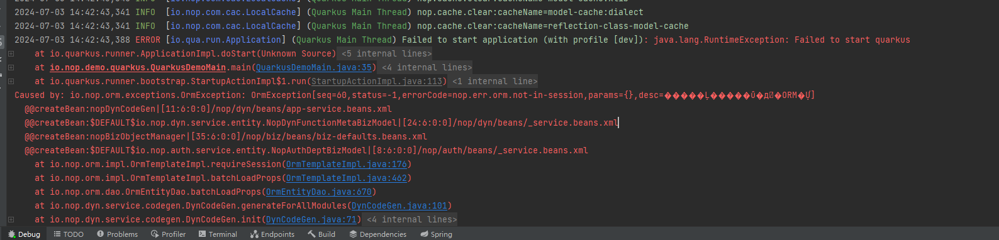

# Common Errors

## Without Session

Using `@Singleton` and `@Transactional` annotations, classes require code generation tasks to be executed during Maven packaging. Therefore, you need to first run `mvn compile -DskipTests` before you can start debugging in IDEA.
