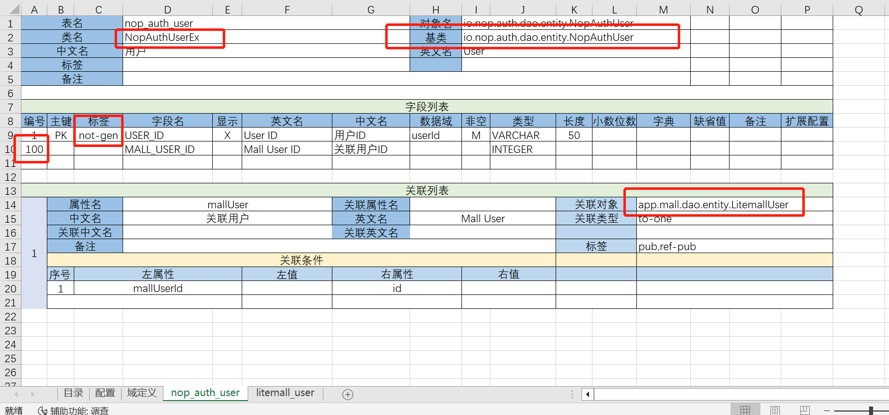
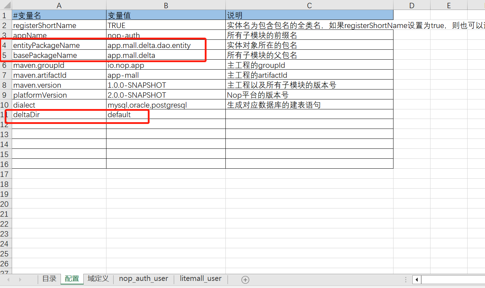

  
  # How to Implement Custom Development Without Modifying the Base Product Source Code
  
  In the ToB market, software development for a product often comes with an unavoidable curse: customization. General situation is that custom development requires extensive modifications of the base product's source code, significantly eroding the product's genericity and flexibility. If the relationship between customized development and standardized product development is not balanced properly, it can lead to severe drag on the overall product development progress. Given that competitive strength at the commercial level is largely derived from differentiation capabilities, high-value mid-to-high-end customers will inevitably require a substantial amount of customization. Moreover, these customized requirements often lack standardization and abstraction into a configurable framework.
  
  Ideally, we aim to minimize both the cost of custom development and the cost of base product R&D by avoiding modifications to the base product's source code. However, achieving this with existing software engineering theories and generic frameworks is highly challenging or comes at a very high cost. In this paper, we will analyze the technical reasons why customized development falls into trouble and introduce the innovative capabilities provided by the Nop platform leveraging reversible computation principles. This allows us to achieve full incrementalized customized development without any special design, such as preabstracting extendable interfaces (e.g., abstracting out extension points). The result is a complete incrementally customizable capability where custom incremental code remains entirely independent of the base product's source code, whether it's for Nop platform functions or base product functionalities.
  
  Specific examples can be found in the sample project [nop-app-mall/app-mall-delta](https://gitee.com/canonical-entropy/nop-app-mall/tree/master/app-mall-delta). For reversible computation theory, please refer to the article [Reversible Computing: The Next Generation of Software Construction Theory](https://zhuanlan.zhihu.com/p/64004026).
  
  ## Section 1: The Predicament of Customized Development
  
  Traditionally, our approach to solving customized development issues has primarily focused on two main strategies:
  
  ### 1.1 Branching
  
  The most common approach is to create a separate branch for each client and then periodically merge the code back into the main branch. However, this method can become chaotic when there are five or more branches in use, especially within the same team managing multiple divergent code branches. This is because it often leads to error-prone submission processes, such as accidentally merging conflicting versions of files or committing changes intended for one client's branch into another.
  
  The complexity arises further due to the nature of base product code. As a complex system with numerous dependencies, maintaining multiple code branches increases the cost of operations significantly. When issues arise during debugging, identifying whether the problem lies in the modified custom code or the base product becomes challenging. Additionally, merging changes from a custom branch back into the main branch can be time-consuming and error-prone.
  
  This issue is compounded by the fact that the base product's source code is typically extensive. Syncing and comparing large amounts of code during integration can be resource-intensive, requiring high levels of technical expertise and significant time investment.
  
  ### 1.2 Configuration and Plugins
  
  Configuration and plugins represent another key approach to supporting customized development. A mature productized solution should inherently be highly configurable. Most customer-specific requirements can be abstracted into configuration parameters that are then combined using a set of predefined rules or templates.
  
  However, this approach also has its limitations. For instance, predicting all possible changes and ensuring that no critical functionality is overlooked during the configuration phase can be extremely challenging. This often leads to a situation where critical changes occur in areas that were not initially accounted for in the configuration logic, resulting in a "configuration nightmare."
  
  The primary issue here lies in the difficulty of accurately anticipating all potential future changes and ensuring that the configuration framework remains adaptable enough to handle them without requiring extensive redesign or modification whenever new features are added.
  
  ## Section 2: Reversible Computing Theory
  
  
  ## The Case for Incremental Development
  
  Predicting upfront is not reliable, and separating costs afterward can be costly. If you aim to develop custom software at a low cost, ideally, customized code and base product code should be physically isolated without leaving any interfaces, enabling some generic mechanism to trim or expand the base functionality.

  Assuming we've established the base product `X`, which consists of multiple components that can be expressed with the following formula:

  ```plaintext
  X = A + B + C
  ```

  We aim to develop the target product `Y`, which also has multiple components, expressed as:

  ```plaintext
  Y = A + B + D
  ```

  **Developing Product X on the Base of Product Y corresponds to an abstract relationship between X and Y.**

  The following formula represents this relationship:

  ```plaintext
  Y = A + B + D = (A + B + C) + (-C + D) = X + Delta
  ```

  If we can truly implement zero-change development for the base product `X`, a natural theoretical conclusion is that **customized code is essentially a Delta correction for the base product**.

  Further, the following derived conclusions can be made:

  1. **Delta should be a first-class concept in architectural design**. This allows it to be independently identified, managed, and stored. Customized code and base product code should be physically separated at the hardware level for independent version management.

  2. The formula `X = 0 + X` implies that any change applied to the unit affects only itself, making **the whole quantity a special case of the Delta concept**. Delta's definition and representation at the theoretical level do not require special design; any inherent form can be considered a Delta expression, requiring only proper definition of Delta operations.

  3. The formula `Y = X + Delta1 + Delta2` allows for combining multiple Delta changes into one unified Delta change, satisfying the associativity property. This enables separation from the base product and independent merging of multiple Delta changes into a single Delta.

  4. The formula `Delta = -C + D` introduces an inverse component beyond just adding new components; **Delta must include its own inverse** to allow for removal or rollback of changes, making it a comprehensive change management tool.

  5. The formula `Y = (A + dA) + (B + dB) + (C + dC)` demonstrates that Delta can encompass additions, modifications, and deletions across all components of the system. If the entire system is allowed to change at every point, a stable coordinate system must exist for Delta to function effectively. After separation, `dA` is stored independently in Delta, inherently retaining a positional coordinate, which only becomes meaningful when Delta is applied alongside `X`.

  Flexible SaaS products typically store form and workflow configurations in database tables, allowing for customization at the user level through configuration adjustments. In such solutions, configuration tables and process tables are joined via a primary key that essentially forms a coordinate system.

  Some software's patching mechanisms inherently follow a Delta correction approach. The success of these mechanisms depends on the underlying architecture's coordinate system and the algorithm used to merge Deltas post-application. However, compared to custom development, patches often have lower structural requirements and may not inherently carry semantic meaning in the code itself.

  Before Docker, virtual machine technology allowed for incremental backups but treated increments as binary changes at the byte level. This made VM increments fragile, as even minor changes could lead to large-scale instability. VM increments lacked semantic meaning and were rarely of strategic value.

  The arrival of Docker changed this by introducing a Delta merging rule within the filesystem. Docker images now have clear semantic meanings, built dynamically using Dockerfiles, and can be stored, retrieved, and versioned in centralized repositories. This has opened up a complete line of reasoning centered around Delta concepts in software construction.

  The invertible nature of mathematics underpins reversible computing. Various practices, from data transformation to state management, rely on Deltas as a form of incremental change. In the context of reversible computing, any operation must be trackable backward, implying that **Delta must include positional coordinates** to enable reversal.

  A Delta is not just an additive change; it's a comprehensive representation of all possible transformations, from addition and modification to deletion and rollback. This makes Deltas powerful tools for understanding and managing system evolution.

  The Nop platform serves as a reference implementation of reversible computing theory, using its Delta mechanism to enable incremental software development without additional costs. This approach allows for zero-change development of the base product `X`, focusing solely on applying Delta corrections to achieve desired enhancements.

  In the next section, I will delve into specific practices implemented in the Nop platform.
  
  ## 三. Nop平台中的Delta定制

  All applications developed using the Nop platform inherently support Delta customization. This section provides an example of a commerce application that demonstrates how functionality can be added without modifying the base product source code, as well as how existing functionality can be modified or removed. Specific implementation details and examples are provided in the [nop-app-mall/app-mall-delta](https://gitee.com/canonical-entropy/nop-app-mall/tree/master/app-mall-delta) repository.


## 3.1 Custom Delta Module

Delta customization code can be centralized within a dedicated Delta module, such as the [app-mall-delta](https://gitee.com/canonical-entropy/nop-app-mall/tree/master/app-mall-delta) module.

In the `app-mall-codegen` module's [gen-orm.xgen](https://gitee.com/canonical-entropy/nop-app-mall/blob/master/app-mall-codegen/postcompile/gen-orm.xgen) file, the following functionality is added to generate Delta customization code into the `app-mall-delta` module:

```javascript
codeGenerator.withTargetDir("../app-mall-delta").renderModel('../../model/nop-auth-delta.orm.xlsx', '/nop/templates/orm-delta', '/', $scope);
codeGenerator.withTargetDir("../app-mall-delta").renderModel('../../model/nop-auth-delta.orm.xlsx', '/nop/templates/meta-delta', '/', $scope);
```

For other modules, such as the `app-mall-app` module, customization can be achieved by simply depending on the `app-mall-delta` module to enable Delta-based customization of Nop's built-in functionalities.


## 3.2 Customizing Data Models with Delta

The `nop-auth` module is a default permission management module provided by the Nop platform and is based on the [nop-auth.orm.xlsx](https://gitee.com/canonical-entropy/nop-entropy/blob/master/nop-auth/model/nop-auth.orm.xlsx) data model. This model generates ORM and GraphQL definitions automatically. If you need to add fields to the system's default `User` table, you can create a Delta model such as [nop-auth-delta.orm.xlsx](https://gitee.com/canonical-entropy/nop-app-mall/blob/master/model/nop-auth-delta.orm.xlsx), which includes only the tables and fields that require extension.



In the `NopAuthUser` table, we added a `MALL_USER_ID` field that links to the `LitemallUser` table defined in the `nop-app-mall` project.

1. **Unique Identifier Requirement**: The `MALL_USER_ID` column must have a unique identifier. Typically, we can start from `base_model_max_id + 50` to avoid conflicts with new fields added to the base model.
   
2. **Maintaining Model Integrity**: The primary key definition in the `NopAuthUser` table must be included to ensure model integrity. Adding a `not-gen` tag in the `Tags` column prevents redundant code generation for existing fields.

3. **Preserving Entity Names**: To maintain consistency with the base model, the entity name for `NopAuthUser` should remain as `io.nop.auth.dao.entity.NopAuthUser`, ensuring that existing code remains unaffected.

4. **Inheritance in Derived Classes**: Setting the table's `Base Class` to `io.nop.auth.dao.entity.NopAuthUser` and the class name to `NopAuthUserEx` ensures that derived classes inherit from `NopAuthUser`.

If other modules require references to entities defined in other modules, use the full entity name, such as `app.mall.dao.entity.LitemallUser`.


Since external tables do not require code generation, we add a `not-gen` tag to the `Tags` configuration in the `LitemallUser` table, retaining only the primary key definition for model validation purposes.



  
  **Note**  
  The `appName` must match the custom module name to enable customization. Otherwise, it will throw an error during runtime due to duplicate entity definitions.

  In the data model configuration, we set `deltaDir=default`, which results in the model file being generated at the path `/_vfs/_delta/{deltaDir}/{originalPath}`. During model loading, files from the delta directory are prioritized, overriding the default definitions in the base product.

  The generated ORM model structure is as follows:

  ```xml
  <orm x:extends="super,default/nop-auth.orm.xml">
    <entities>
      <entity className="app.mall.delta.dao.entity.NopAuthUserEx" displayName="用户"
              name="io.nop.auth.dao.entity.NopAuthUser">
        ...
      </entity>
    </entities>
  </orm>
```

  Under this configuration, when creating entities using `entityDao` or `ormTemplate`, the generated implementation class will be `NopAuthUserEx`, while the entity name remains `NoptAuthUser`.

  ```javascript
  IEntityDao<NopAuthUser> dao = daoProvider.daoFor(NopAuthUser.class);
  NopAuthUserEx user = (NopAuthUser) dao.newEntity();

  Or

  NopAuthUserEx user = (NopAuthUserEx) ormTemplate.newEntity(NopAuthUser.class.getName());
```

  The generated entity class structure is:

  ```java
  class NopAuthUserEx extends _NopAuthUserEx {
    // Empty implementation
  }

  class _NopAuthUserEx extends NopAuthUser {
    // Inherit all base functionality
  }
```

  The extended entity class inherits all functionalities from the base model and can be used to add additional fields via `_NopAuthUserEx`.

  If you want to remove certain fields from the database, simply add a `del` tag in the corresponding column configuration:

  ```xml
  <orm>
    <entities>
      <entity name="io.nop.auth.dao.entity.NopAuthUser">
        <columns>
          <!-- x:override="remove" indicates deletion of this field -->
          <column name="clientId" x:override="remove" />
        </columns>
      </entity>
    </entities>
  </orm>
```

  Using a delta-based data model allows for easy tracking of customizations between the customized and base versions.

  > The data model documentation should clearly state customization reasons and timestamps for reference.

  ### 3.3 IoC Container Customization

  The Nop platform includes an IoC container compatible with Spring 1.0 syntax, named **NopIoC** ([link to documentation](https://zhuanlan.zhihu.com/p/579847124)).

  #### 1. Conditional Logic
  NopIoC extends Spring 1.0's XML configuration with similar capabilities to Spring Boot's conditional loading. You can enable or disable beans using configuration variables:

  ```xml
  <bean id="nopAuthHttpServerFilter" class="io.nop.auth.core.filter.AuthHttpServerFilter">
    <ioc:condition>
      <if-property name="nop.auth.http-server-filter.enabled" enableIfMissing="true"/>
    </ioc:condition>
    <property name="config" ref="nopAuthFilterConfig"/>
  </bean>
```

  #### 2. Default Implementations
  NopIoC provides default implementations for beans if none are specified. If another bean with the same ID exists in the container, the default implementation will be ignored, similar to Spring Boot's `ConditionOnMissingBean` mechanism.

  
  ```xml
  <bean id="nopActionAuthChecker" class="io.nop.auth.service.auth.DefaultActionAuthChecker" ioc:default="true"/>
  
  <!-- Beans marked with ioc:default="true" will be overridden by other files defining the same ID -->
  <bean id="nopActionAuthChecker" class="com.ruoyi.framework.web.service.PermissionService"/>
  ```

  Also, you can add `primary=true` to newly added beans, giving them higher priority than beans without this marked.

  ### 3. x-extends Inheritance

  The most powerful aspect of NopIoC is its built-in Delta customization mechanism using XLang. You can place a file named `beans.xml` in the delta directory to override existing configuration files. For example, placing `app-mall-delta` module's `/_vfs/_delta/default/nop/auth/auth-service.beans.xml` will override the base product's configuration.

  ```xml
  <beans x:schema="/nop/schema/beans.xdef" xmlns:x="/nop/schema/xdsl.xdef"
         x:extends="super">

  <bean id="nopAuthFilterConfig">
      <property name="authPaths">
          <list x:override="append">
              <value>/mall*</value>
          </list>
      </property>
  </bean>

</beans>
```

  This configuration inherits from existing models (`x:extends="super"`), then modifies the `nopAuthFilterConfig` bean's `authPaths` property to add an entry.

  Beyond overriding bean configurations, you can use Delta customization to delete bean configurations. For example, when integrating Nop with Ruoyi framework, you may need to remove the default `dataSource` configuration:

  ```xml
  <bean id="nopDataSource" x:override="remove" />
  ```

  The specific configuration can be found in [delta directory's dao-defaults.beans.xml](https://gitee.com/canonical-entropy/nop-for-ruoyi/blob/master/ruoyi-admin/src/main/resources/_vfs/_delta/default/nop/dao/beans/dao-defaults.beans.xml).

  Delta customization is straightforward and **suitable for all model files and granular attribute customization**. Compared to SpringBoot's equivalent implementation, SpringBoot's customization capabilities are significantly limited:

  - First, to implement Bean exclusion and Override, Spring requires adding substantial internal processing code and special syntax.
  - Second, Spring's customization mechanism only targets individual bean configurations, such as disabling a bean, but lacks appropriate methods for customizing individual attributes.

  If prior planning is inadequate, fine-tuning via simple means becomes difficult when dealing with existing configurations.

  > Because the IoC container can search for matching beans based on name, type, and annotations among others, additional plugin mechanisms are generally unnecessary in most cases.

  > When running in debug mode, NopIoC outputs all bean definitions to `/_dump/{appName}/nop/main/beans/merged-app.beans.xml`, where you can see the source code locations of each bean definition.

```java
public class NopAuthUserExBizModel extends NopAuthUserBizModel {
    static final Logger LOG = LoggerFactory.getLogger(NopAuthUserExBizModel.class);

    @Override
    protected void defaultPrepareUpdate(EntityData<NopAuthUser> entityData, IServiceContext context) {
        super.defaultPrepareUpdate(entityData, context);

        LOG.info("prepare update user: {}", entityData.getEntity().getUserId());
    }
}
```

#### 2. Override Default Bean Definition in `beans.xml`

```xml
<bean id="io.nop.auth.service.entity.NopAuthUserBizModel"
      class="app.mall.delta.biz.NopAuthUserExBizModel"/>
```

The automatically generated bean definition includes the attribute `ioc:default="true"`, which means that registering another bean with the same ID will override this default definition.

In addition to extending the existing `BizModel` class, we can use an `XBiz` model to override the service methods defined in the Java object. For example, by customizing the `NopAuthUser.xbiz` file and adding method definitions:

```xml
<biz x:schema="/nop/schema/biz/xbiz.xdef" xmlns:x="/nop/schema/xdsl.xdef" x:extends="super">
    <actions>
        <query name="extAction3" displayName="Test Function 3">
            <source>
                return "result3"
            </source>
        </query>
    </actions>
</biz>
```

The NopGraphQL engine collects all `biz` files and those annotated with `@BizModel`, grouping them by `bizObjName` to form the final service object. This approach is similar to the Entity-Component-System (ECS) architecture in game development, where each entity is composed of multiple components. In this architecture, you don't necessarily need to modify existing components; instead, you can stack a new component on top of an existing one to override its functionality. The `XBiz` file defines methods with the highest priority, which will override those defined in the `BizModel` class.

## 3.5 Delta Customization for Frontend

The frontend of the Nop platform is primarily defined in two model files: `view.xml` and `page.yaml`. The former serves as a neutral `XView` blueprint that describes page structure using form, table, button, etc., while the latter corresponds to a YAML-based definition used by Baidu's AMIS framework. The actual content rendered on the frontend is dynamically generated based on these models.

By customizing these model files, you can adjust the layout of forms, add individual field controls, insert buttons, delete buttons, and even completely override the base product's page content.

## 3.6 Delta Customization for Tags

Nop platform's code generation and its meta-programming mechanism heavily rely on the Xpl template language, which is used throughout the workflow models and other executable models. The Xpl template language incorporates a tag library that allows function-level encapsulation (each tag behaves like a static method). This tag library is defined in the `xlib` file, and customization can be achieved through the Delta mechanism.

  
  For example, we can customize the `[control.xlib](https://gitee.com/canonical-entropy/nop-app-mall/blob/master/app-mall-app/src/main/resources/_vfs/_delta/default/nop/web/xlib/control.xlib)` to adjust default display controls for field types. Similarly, we can customize `[ddl.xlib](https://gitee.com/canonical-entropy/nop-entropy/blob/master/nop-orm/src/main/resources/_vfs/nop/orm/xlib/ddl/ddl_mysql.xlib)` to fix the syntax of table creation statements for specific database versions.

## 3.7 Customization of Rule Models and Report Models

All models in the Nop platform, including workflow models, report models, rule models, etc., are constrained using the XDef meta-model. These models comply with the grammar rules of the XDSL domain (for detailed information, refer to [XDSL: General Domain-Specific Language Design](https://zhuanlan.zhihu.com/p/612512300)). Therefore, all models inherently possess Delta customization capabilities and can be extended by adding corresponding files in the `_vfs/_delta/{deltaDir}` directory.

Unlike typical report engines or workflow engines, the Nop platform heavily relies on Xpl template language as executable scripts. This allows us to introduce custom tag libraries for tailored extensions. For instance:
- General report engines typically support data loading mechanisms such as JDBC, CSV, JSON, and Excel.
- To add new loading methods, we usually need to implement engine-specific interfaces and use registration mechanisms to integrate them into the engine. Customizing the visualization designer to support these configurations can be a complex task.

In contrast, the `NopReport` report model provides an extension point named `beforeExecute`, which is based on a universal interface ([IEvalAction](https://gitee.com/canonical-entropy/nop-entropy/blob/master/nop-core/src/main/java/io/nop/core/lang/eval/IEvalAction.java)). This allows us to introduce new data loading mechanisms in the `beforeExecute` section:

```xml
<beforeExecute>
  <spl:MakeDataSet xpl:lib="/nop/report/spl/spl.xlib" dsName="ds1" src="/nop/report/demo/spl/test-data.splx" />
</beforeExecute>
```

By examining the XDef meta-model, we can easily identify which nodes are Xpl template configuration nodes without needing to define or understand special plugin interfaces.

Tag invocation functions are both function calls and can be viewed as easily parsable XML configurations. Customizable visualization is achieved by supplementing a `XView` model file, which automatically generates the `<beforeExecute>` section's visualization editor.

Another approach is to leverage built-in extension attribute configurations in XDSL. All Nop platform models, including workflow models, report models, rule models, etc., inherently support extension attributes, except for those defined in the XDef meta-model. Properties and nodes with namespaces are stored as extension attributes by default (similar to allowing arbitrary Annotation annotations in Java classes). We can introduce extension attribute nodes to store configurations and utilize `<x:post-extends>` meta-programming mechanisms during compilation to parse and dynamically generate the `<beforeExecute>` section.

This approach avoids embedding data source configurations directly into report models and eliminates the need for engines to support special interfaces at runtime. Instead, it relies on **local compile-time transformations** to integrate arbitrary external data sources.

```xml
<x:post-extends>
  <xpt-gen:DataSetSupport/>
</x:post-extends>

<ext:dataSets>
  <spl name="ds1" src="/nop/report/demo/spl/test-data.splx" />
</ext:dataSets>

<beforeExecute>
  Here you can add other initialization code
</beforeExecute>
```

The `<x:post-extends>` mechanism is used to extend the engine's functionality at compile time, allowing it to support arbitrary external data sources without requiring special runtime interfaces or configurations.

## 3.8 Compile-Time Features

  
  ## A Highly Configurable Product
  
  For a product to maintain runtime performance, it should ideally enable various features during compilation rather than runtime. This approach leads to optimized code and reduced complexity in the final implementation.
  
  In the Nop platform, all XDSL domain models support `feature:on` and `feature:off` feature control mechanisms. For example:
  
  ```xml
  <form id="view" feature:on="!nop.auth.use-ext-info"> ...</form>
  ```
  
  The `feature:on="!nop.auth.use-ext-info"` attribute indicates that the `nop.auth.use-ext-info` configuration variable is set to `false`, resulting in the node's existence only when this condition is met. Otherwise, the node is automatically removed.
  
  ### Comparison with SpringBoot's Conditional Mechanism
  
  While Nop's built-in `feature` attributes can control any node across all model files without requiring additional runtime engine code or tailored logic for specific conditions, SpringBoot's conditional evaluation mechanism demands custom coding and cannot be applied to other models.
  
  ## Summary
  
  The Nop platform leverages the reversible computation principle to implement the so-called Delta customization mechanism. This allows for extensive customization of both frontend and backend functionalities without altering the core product, enabling tailored configurations through Deltas.
  
  ## Official Resources
  
  - GitHub: [entropy-cloud/nop-entropy](https://github.com/entropy-cloud/nop-entropy)
  - Gitee: [canonical-entropy/nop-entropy](https://gitee.com/canonical-entropy/nop-entropy)
  - Documentation Example: [docs/tutorial/tutorial.md](https://gitee.com/canonical-entropy/nop-entropy/blob/master/docs/tutorial/tutorial.md)
  
  - [Reversible Computation Principle and Introduction to Nop Platform on Bilibili](https://www.bilibili.com/video/BV1u84y1w7kX/)

