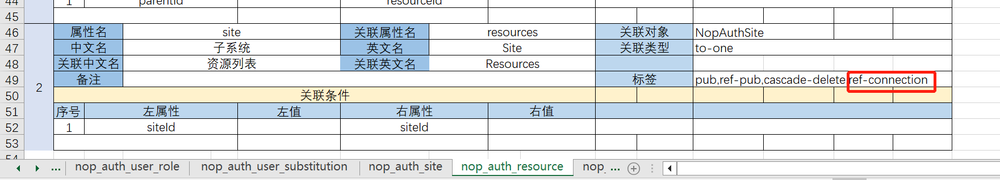

# connection Configuration

In the Excel model's foreign key object, annotate `ref-connection`. This will generate a one-to-many relationship attribute and automatically create a `connection` label in the corresponding `resources` property of the `NopAuthSite` object. For example, if the `site` property of `NopAuthResource` is annotated with `ref-connection`, it will add a `connection` label to the `resources` property of `NopAuthSite`.



Using meta programming, the `Connection` attribute will be added to the compiled `.meta` file. For example, `resourcesConnection` in the `_dump` directory shows the generated attribute definition.

```xml
<meta>
    <props>
        <prop name="resources" displayName="资源列表" i18n-en:displayName="Resources" tagSet="pub,connection"
              ext:kind="to-many" internal="true" ext:joinLeftProp="siteId" ext:joinRightProp="siteId"
              ext:joinRightDisplayProp="displayName" insertable="false" updatable="false" lazy="true">
            <schema type="io.nop.orm.IOrmEntitySet&lt;io.nop.auth.dao.entity.NopAuthResource&gt;"
                  bizObjName="NopAuthResource"/>
        </prop>
        <!--LOC:[90:22:0:0]/nop/core/xlib/biz-gen.xlib#/_delta/default/nop/auth/model/NopAuthSite/NopAuthSite.xmeta-->
        <prop name="resourcesConnection" displayName="资源列表" internal="true"
              graphql:connectionProp="resources" graphql:queryMethod="findConnection">
            <schema type="io.nop.api.core.beans.graphql.GraphQLConnection&lt;io.nop.auth.dao.entity.NopAuthResource&gt;"
                  bizObjName="NopAuthResource"/>
        </prop>
    </props>
</meta>
```

The `resourcesConnection` node in the generated graph uses the `graphql:connectionProp` attribute to reference a one-to-many relationship on the entity. This will automatically apply the corresponding connection logic for filtering.

For specific test cases, refer to `TestConnectionProp`.

The `resourcesConnection` parameter accepts a `GraphQLConnectionInput` type.

```java
public class GraphQLConnectionInput {
    /**
     * first indicates the number of items to fetch starting from afterCursor
     */
    int first;
    int last;
    String after;
    String before;

    /**
     * If cursor is not set, pagination can be handled using offset/limit
     */
    long offset;
    TreeBean filter;
    List<OrderFieldBean> orderBy;
}
```

The result type of the query is `GraphQLConnection`.

```java
class GraphQLConnection<T> {
    long total;
    List<GraphQLEdgeBean> edges;

    List<T> items;

    GraphQLPageInfo pageInfo;
}

class GraphQLPageInfo {
    String startCursor;
    String endCursor;
    Boolean hasNextPage;
    Boolean hasPreviousPage;
}
```


## Applying Different Query Conditions to the Same Subtable

```graphql
query($filter1: Map, $filter2: Map) {
  MyObject__get(id: 3) {
    activeRecords: mySubObjectConnection(filter: $filter1, limit: 5) {
      total
      items {
        id
      }
    }

    inactiveRecords: mySubObjectConnection(filter: $filter2, limit: 5) {
      total
      items {
        id
      }
    }
  }
}
```

Here, `filter1` and `filter2` are two different query conditions that can be passed from the frontend with different criteria, both targeting the same subtable object `mySubObject`. However, the results returned will differ based on the applied filters.

## Simplifying Parameter Transmission in REST Requests Using `_subArgs`

```json
/r/MyObject__get?id=3&@selection=activeRecords:mySubObjectConnection,inactiveRecords:mySubObjectConnection

{
  "_subArgs.activeRecords.limit": 5,
  "_subArgs.activeRecords.filter_status": 1,
  "_subArgs.inactiveRecords.limit": 5,
  "_subArgs.inactiveRecords.filter_status": 0
}
```

In the backend, the `GraphQLWebService` receives parameters prefixed with `_subArgs` and converts them into function parameters for the corresponding sub-properties. It also identifies parameters prefixed with `filter_` and aggregates them into a `FilterBean` object.

## Adding a `ref-query` Label to Associative Properties in Excel Models

If a `ref-query` label is set on a `to-one` association, it will automatically generate a query label for parent-to-child one-to-many relationships. In `meta-gen.xlib`, for properties with such labels, the system will add a `graphql:findMethod="findList"` configuration, enabling pagination support.

```xml
<prop name="children" graphql:findMethod="findList">
</prop>
```

Frontend developers can pass filter conditions and pagination parameters (`offset/limit`) to the service for fetching specific records.

```xml
<MyEntity__get(id:3) {
  children(filter: {...}, limit:10){
    name, status
  }
}>
```

Additionally, in the `meta` section's `prop` node, you can configure `graphql:maxFetchSize` to limit the number of records fetched. If not specified, it will default to `maxPageSize`.
