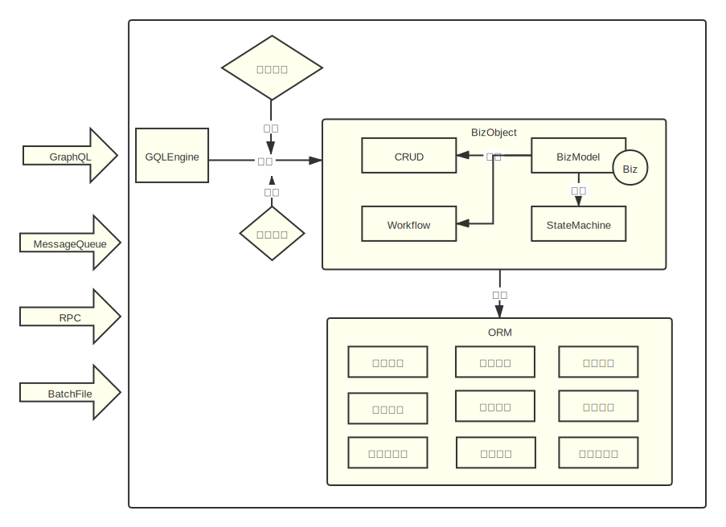

# Object-Oriented GraphQL

The Nop platform is based on a data model and automatically generates entity definitions, SQL table definitions, GraphQL types, front-end pages, and more. Taking the Department table as an example, by default we generate a GraphQL type Department and create properties for primary/foreign key relationships such as parent and children. If the connection tag is added, we also generate properties corresponding to paginated access for related objects. For example, usersConnection returns the users belonging to a specified department via a pagination mechanism similar to [Relay Cursor Connection](https://relay.dev/graphql/connections.htm). By default, business objects automatically inherit CrudBizModel, so GraphQL entry operations are generated automatically.

> For a detailed introduction to connections, see [connection.md](connection.md)

```graphql
extend type Query{
  Department__get(id:String!): Department
  Department__batchGet(ids:[String!]): [Department]
  Department__findPage(query:QueryBeanInput): PageBean_Department
  ...
}
extend type Mutation{
  Department__save(data: DepartmentInput): Department
  Department__delete(id:String!): Boolean
  ...
}
```

The Nop platform has a built-in automated back-office software production line whose input is user requirements (expressed in Excel documents) and whose output is a runnable application system. It achieves production line operation mainly through a systematic, incremental code generation scheme. Among these artifacts, the GraphQL Schema is an intermediate product automatically generated from Meta metadata definitions and BizModel business model definitions. We do not write GraphQL type definitions by hand, and while writing business code you do not need any GraphQL-specific knowledge—you do not need to implement GraphQL-specific interfaces such as DataFetcher or DataLoader. Technical details are introduced in more depth in the “Delta pipeline” section. You can also refer to the following article:

[Data-driven Delta code generator](https://zhuanlan.zhihu.com/p/540022264)

## GraphQL Object Definitions

When initializing, the NopGraphQL engine uses the IoC container’s dynamic scanning capabilities to discover all beans annotated with `@BizModel` and groups/merges them according to their BizObjName configuration. For example:

```java

@BizModel("NopAuthUser")
public class NopAuthUserBizModel extends CrudBizModel<NopAuthUser> {
  @BizMutation
  public void changeSelfPassword(@Name("oldPassword") String oldPassword,
                                 @Name("newPassword") String newPassword) {
        ...
  }
}


@BizModel("NopAuthUser")
public class NopAuthUserBizModelEx {
  @BizMutation
  public void otherOperation() {
         ...
  }

  @BizMutation
  @Priority(NORMAL_PRIORITY - 100)
  public void changeSelfPassword
  @Name("oldPassword")
  String oldPassword,
  @Name("newPassword")
  String newPassword)

  {
        ...
  }
}
```

Both NopAuthUserBizModel and NopAuthUserBizModelEx have the BizObjectName NopAuthUser, and their methods are stacked together to collectively form the methods on the NopAuthUser business object. When methods with the same name appear, the `@Priority` configuration determines which implementation takes precedence; the higher priority implementation is chosen. If priorities are the same and function names are identical, an exception is thrown.

When constructing BizObjects, the NopGraphQL engine also checks the xbiz extension model. We can extend a BizObject by adding methods in the NopAuthUser.xbiz model file; this file can be updated online and takes effect immediately without reinitializing GraphQL type definitions. Methods defined in xbiz files have the highest priority and will automatically override business methods defined in JavaBeans.

If BizModels with the same object name are viewed as slices of the object, the NopGraphQL engine dynamically gathers these slices during system initialization, and overlays them like Docker images to form a complete object definition. At runtime, the topmost xbiz slice can be modified dynamically and override the functionality of lower slices.

> The concept of BizModel slices is somewhat similar to the Entity Component System (ECS) pattern in game development, except it accumulates dynamic behavior rather than localized state.

The capability dual to Gather is Scatter: we often need abstractions for global rules, automatically pushing certain shared knowledge into different business objects. NopGraphQL primarily uses AOP and metaprogramming mechanisms to distribute information:

1. Common mechanisms can act as AOP interceptors on business methods that meet certain conditions.

2. In xbiz files, you can dynamically generate method definitions via the generic x:gen-extends metaprogramming mechanism in XLang, or use an external CodeGenerator to generate code.

## CRUD Model

In typical business development, CRUD (Create/Read/Update/Delete) operations are the most similar parts across different business objects, making it worthwhile to abstract them uniformly. NopGraphQL uses the Template Method design pattern to provide a generic CRUD implementation: CrudBizModel. You inherit from the CrudBizModel class and can add custom logic by implementing methods such as defaultPrepareSave and afterEntityChange. See:

[CrudBizModel.java](https://gitee.com/canonical-entropy/nop-entropy/blob/master/nop-biz/src/main/java/io/nop/biz/crud/CrudBizModel.java)

[ObjMetaBasedValidator.java](https://gitee.com/canonical-entropy/nop-entropy/blob/master/nop-biz/src/main/java/io/nop/biz/crud/ObjMetaBasedValidator.java)

[NopAuthUserBizModel.java](https://gitee.com/canonical-entropy/nop-entropy/blob/master/nop-auth/nop-auth-service/src/main/java/io/nop/auth/service/entity/NopAuthUserBizModel.java)

## 3.1 Metadata-Driven

CrudBizModel is implemented in a metadata-driven manner. It reads configurations from xmeta files and has built-in support for common requirements such as data validation, auto-initialization, cascade delete, logical delete, and data permissions. In most cases, you only need to adjust xmeta and xbiz configuration files without writing custom logic.

1. Data validation: Similar to GraphQL’s output selection, NopGraphQL can selectively validate and transform input fields, reflecting the duality of input and output.

   ```javascript
   validatedData = new ObjMetaBasedValidator(bizObjManager,bizObjName,objMeta,context,checkWriteAuth)
                       .validateForSave(input,inputSelection)
   ```

2. Auto-initialization: In meta, you can configure an autoExpr for fields; during create/update operations, fields can be auto-initialized based on this configuration. The autoExpr can be generated automatically based on domain configurations in the data model.

3. Auto-transformation: Based on the transformIn expression in meta, input property values are adapted/transformed. transformIn can be generated automatically based on domain configurations in the data model.

4. Cascade delete: Child table data marked as cascade-delete will be deleted along with the main table data and will trigger the delete logic defined on the business object corresponding to the child table.

5.

Logical delete: If a delFlag logical deletion marker field is enabled, the underlying ORM engine will automatically convert delete calls to modifications of delFlag and will automatically apply a delFlag=0 filter to all queries, unless the disableLogicalDelete attribute is explicitly set on the SQL object.

6. Data permissions: All retrieved entity records are automatically validated to ensure they meet data permission requirements.

## 3.2 Complex Queries

CrudBizModel provides three standard interfaces for complex queries:

```javascript
PageBean<OrmEntity> findPage(@Name("query") QueryBean query, FieldSelectionBean selection);
List<OrmEntity> findList(@Name("query") QueryBean query);
OrmEntity findFirst(@Name("query") QueryBean query);
```

1. findPage returns paginated results based on query conditions. Pagination can use a cursor+next page approach or traditional offset+limit. selection corresponds to the set of return fields supplied by the frontend call.
   * If total pages are not requested, findPage will skip querying the total count; if items list is not requested, it will adjust the actual pagination query itself accordingly.

2. findList returns a list of data based on query conditions; if no page size is set, it selects maxPageSize records according to the meta configuration.

3. findFirst returns the first record that meets the conditions.

QueryBean is similar to Hibernate’s Criteria query object and supports complex nested and/or conditions and sort orders. QueryBean can be constructed directly by the frontend and, before being executed by the DAO, undergoes the following processing:

1. Validate that query conditions only include fields with `queryable=true`, and that filter operators are within each field’s allowFilterOp set. By default, only equality queries are allowed. For example, configure username to support fuzzy search:

   ```xml
   <!-- Support equality or fuzzy matching; by default, the frontend-generated control uses fuzzy search -->
   <prop name="userName" allowFilterOp="eq,contains" queryable="true"
             xui:defaultFilterOp="contains"/>
   ```

2. Append data permission filter conditions, e.g., only viewing data whose managing unit is the current unit.

3. Add sorting conditions by primary key fields. Without sorting, concurrent database execution may return random result sets. Therefore, all paginated queries should have sorting conditions to ensure consistent pagination order.

Leveraging the underlying NopOrm engine, QueryBean naturally supports queries on associated objects. For example:

```xml

<eq name="manager.dept.type" value="1"/>
```

This indicates filtering by the condition manager.dept.type = 1 and automatically joins the corresponding department table via `manager_id`.

If the underlying ORM engine does not support join queries, you can implement a QueryTransformer interface to transform the QueryBean. For example, transform the equality condition above into a subquery:

```sql
o.manager_id in (select user.id from User user, Dept dept
       where user.dept_id = dept.id and dept.type = 1)
```

On the frontend, to construct complex query conditions in a form-friendly way, we use the following convention in the AMIS framework:

```
Field name format: filter_{propName}__{filterOp}
```

For example, `filter_userName__contains` filters the userName field using the contains operator. For the eq (equals) operator, the filterOp part can be omitted; for instance, filter_userId is equivalent to `filter_userId__eq`.

Note: If the filter condition’s value is empty, that field condition is ignored. If you need to query by null explicitly, use `__null` to indicate null and `__empty` for an empty string.

When invoking methods that end with findPage/findList/findFirst via AMIS URLs, you can use the filter convention:

```javascript
{
   url: "@query:NopAuthUser__findPage?filter_userStatus=1"
}
```

### Constructing Complex Query Conditions

When directly calling backend GraphQL or REST services, you can construct a QueryBean object:

```
POST /r/NopAuthUser__findPage

{
   "query": {
      "filter": {
         "$type": "eq",
         "name" : "userStatus",
         "value": 1
      }
   }
}
```

filter corresponds to a TreeBean-type object in the backend—a general tree structure that can be automatically converted into XML. The conversion rules are defined by a standard mechanism in the Nop platform:

1. The $type attribute corresponds to the tag name.
2. $body corresponds to child nodes and node content.
3. Other attributes that do not start with $ correspond to XML node attributes.
4. Values prefixed with `@:` are parsed as JSON.

```xml

<and>
  <eq name="status" value="@:1"/>
  <gt name="amount" value="@:3"/>
</and>
```

Corresponding JSON:

```json
{
  "$type": "and",
  "$body": [
    {
      "$type": "eq",
      "name": "status",
      "value": 1
    },
    {
      "$type": "gt",
      "name": "amount",
      "value": 3
    }
  ]
}
```

Supported filter operators such as eq and gt are defined in [FilterOp.java](https://gitee.com/canonical-entropy/nop-entropy/blob/master/nop-core/src/main/java/io/nop/core/model/query/FilterOp.java).
Common operators include:

| Operator      | Description                     |
|---------------|----------------------------------|
| eq            | Equal                            |
| gt            | Greater than                     |
| ge            | Greater than or equal            |
| lt            | Less than                        |
| xe            | Less than or equal               |
| in            | In a collection                  |
| between       | Between min and max              |
| betweenDate   | Date between min and max         |
| alwaysTrue    | Always true                      |
| alwaysFalse   | Always false                     |
| isEmpty       | The value for name is empty      |
| startsWith    | String starts with the given value |
| endsWith      | String ends with the given value   |

### BizArgsNormalizer: Normalizing Argument Formats

CrudBizModel’s `findPage/findList` and similar functions accept a QueryBean-structured query parameter. Since constructing a QueryBean on the frontend can be complex, we also support directly passing `filter_{propName}` format filter conditions such as `filter_status=1`. The backend uses the IGraphQLArgsNormalizer object introduced via the `@BizArgsNormalizer` annotation to normalize frontend parameters, converting `filter_xx` conditions into a QueryBean object. This is a general mechanism, not limited to QueryBean conversions.

```javascript
    @BizQuery
    @BizArgsNormalizer(BizConstants.BEAN_nopQueryBeanArgsNormalizer)
    @GraphQLReturn(bizObjName = BIZ_OBJ_NAME_THIS_OBJ)
    public PageBean<T> deleted_findPage(@Optional @Name("query") @Description("@i18n:biz.query|Query conditions") QueryBean query,
                                        FieldSelectionBean selection, IServiceContext context) {
      ...
   }
```

The parameter of `@BizArgsNormalizer` is the name of a bean registered in NopIoC. nopQueryBeanArgsNormalizer corresponds to a QueryBeanArgsNormalizer object registered in `biz-defaults.beans.xml`.

`IGraphQLEngine.newRpcContext` calls the argsNormalizer, so this logic is invoked when the frontend executes backend services via `/p/{bizObjName}_{bizAction}` or `/r/{bizObjName}_{bizAction}`. See the unit test `TestNopAuthUserBizModel.testQueryBeanNormalizer`.

## 3.3 The this Pointer: Relativization of Knowledge

Operation names defined in GraphQL are global names. For example, in `query{ getUser(id:3){ id, userName}}`, the getUser method needs to be unique across the entire model, which is unfavorable for code reuse.

In NopGraphQL, to implement CRUD you only need to inherit the CrudBizModel base class; the GraphQL operation name exposed externally is formed by concatenating the object name and the method name.

```java
class CrudBizModel<T> {
  @BizQuery
  @GraphQLReturn(bizObjName = "THIS_OBJ")
  public T get(@Name("id") String id) {
       ....
  }
}

@BizModel("NopAuthUser")
class NopAuthUserBizModel extends CrudBizModel<NopAuthUser> {

}
```

In the example above, the NopGraphQL engine automatically generates a query operation `NopAuthUser_get`, and its return type is `THIS_OBJ`, meaning it will be replaced by the BizObjName corresponding to the current object, i.e., NopAuthUser.

Note that with this approach we can provide different GraphQL types for the same implementation class. For example:

```java
@BizModel("NopAuthUser_admin")
public NopAuthUserAdminBizModel extends CrudBizModel

<NopAuthUser> {

}
```

Although it still inherits from `CrudBizModel<NopAuthUser>`, since the bizObjName provided in the BizModel annotation is `NopAuthUser_admin`, the returned field set of get can differ from that of the regular NopAuthUser, and the permissions required for backend calls may also differ.

In other words, method names on an object are local names whose semantics are defined relative to the this pointer. Without having all knowledge, we can build rather complex logic based on relative knowledge, and by injecting different this pointers, the concrete meaning of a whole set of calls changes. This is essentially the fundamental principle of object-oriented design.

> Object-oriented technology creates a special name—the this pointer—which is an agreed-upon, fixed local name. Using this pointer distinguishes the inside and outside of a domain. Outside the domain, objects can have many names, while inside the domain we directly refer to the current object with this.
>
> Code is merely a formal expression; its specific meaning requires an interpretative process. Invocation forms based on object pointers lead directly to interpretative diversity: injecting different this pointers provides different interpretations.

On the frontend, we use a similar strategy: frontend scripts automatically infer method signatures by method suffix. For example, for all methods ending in `_findPage`, the default signature is:

```java
XXX_findPage(query:QueryBeanInput):PageBean_XXX
```

### Return Types

Service methods on BizModel do not need to wrap their return types in ApiResponse; the framework itself will handle ApiResponse wrapping. If the return type is String, it remains a String on the frontend and will not be auto-parsed as JSON. If the return type is Map or another bean object, attributes are loaded according to the DataLoader mechanism before returning. If the method returns CompletionStage, it indicates asynchronous execution.

```java
@BizQuery
public Map<String,Object> myMethod(){
   ...
}

@BizQuery
public CompletionStage<Map<String,Object>> myMethod2Async(){
   return ...
}

@BizQuery
public MyResultBean myMethod3(){
   return ...
}
```

## 4. Framework-Agnostic Design

In traditional web frameworks, writing business code inevitably involves framework-specific runtime objects such as HttpServletRequest or SpringMVC’s ModelAndView. These objects are strongly tied to the particular runtime environment, binding your code to that environment and making it difficult to reuse across different scenarios. Most notably, a service function written for online API calls generally cannot be directly used as a message queue consumer. You are forced to abstract an additional layer—the Service layer—then wrap it separately as a Controller and a MessageConsumer to handle web requests and message queues.

NopGraphQL adopts a framework-agnostic, non-intrusive design for implementing business methods. It expands the usage scenarios of service methods and simplifies service-layer development. Specifically, NopGraphQL introduces a small set of annotations, uses POJO objects as input/output, and automatically translates business methods into the DataFetcher and DataLoader required by the GraphQL engine. For example:

```java

@BizModel("MyEntity")
class MyBizModel {
  @BizQuery
  public MyEntity get(@Name("id") String id) {
    return ...
  }

  @BizLoader
  public String extProp(@ContextSource MyEntity entity) {
        ...
  }

  @BizLoader(forType = OtherEntity.class)
  public String otherProp(@ContextSource OtherEntity entity) {
       ...
  }

  @BizLoader("someProp")
  public CompletionStage<List<SomeObject>> batchLoadSomePropAsync(
    @ContextSource List<MyEntity> entities) {
       ...
  }
}
```

1. `@BizQuery` maps the method to a GraphQL query; `@BizMutation` maps it to a GraphQL mutation.

2. `@BizLoader` provides fetcher and loader definitions for GraphQL type properties. To keep the concepts simple, NopGraphQL requires all properties to be declared in xmeta; BizModel only provides customized loaders for already defined properties.

3. If the return type is CompletionStage, the method executes asynchronously.

4. If a method annotated with `@BizLoader` has a ContextSource parameter of type List, it corresponds to a GraphQL DataLoader implementation and supports batch loading.



Service methods written with the NopGraphQL engine can be viewed as having the following function signature:

```java
ApiResponse<Object> service(ApiRequest<Map> request);

class ApiRequest<T>{
    Map<String,Object> headers;
    FieldSelectionBean selection;
    T data;
}
```

Service methods receive a POJO request object and return a POJO response object. Because both input and output are simple objects, with minimal configuration you can:

1. Publish GraphQL service methods as message queue consumers: receive a request object from one topic, send a response message to another topic, and if the header marks one-way, ignore the response.

2. Publish GraphQL service methods as RPC service functions.

3. Read Request objects from batch files, invoke service methods in sequence, submit in batches, retry failures, and write the Response messages to an output file.

## REST Over GraphQL

GraphQL engines can run on top of REST services to provide federation, combining multiple REST services into a unified GraphQL endpoint. Conversely, can we decompose underlying GraphQL service methods and expose them as individual REST resources?

NopGraphQL leverages the concept of lazy fields to define the set of Eager-loaded properties in GraphQL types and systematically transforms methods in the GraphQL model into REST services. The specific REST URL format is:

```java
/r/{operationName}?@selection=a,b,

c {
  d, e
}
```

1. Pass parameters via the request body.

2. /r/{operationName} is the service link. Use the optional `@selection` parameter to specify the selection of returned fields. If not specified, the backend automatically returns all properties not marked lazy. During code generation, data from associated tables are marked as lazy by default; thus, they are not included by default in REST call return results.

3. GET requests can only call GraphQL query operations, while POST can call query or mutation operations.

You can pass call parameters via the URL. For example:

```
GET /r/NopAuthUser_get?id=3
```

This is equivalent to executing NopAuthUser_get(id:3).

For POST requests, parameters can be sent in the HTTP body as JSON.

The front-end framework in the Nop platform builds on Baidu’s AMIS and further simplifies GraphQL calls. On the frontend, you can use the following URL format to initiate a GraphQL call:

```js
api: {
    url: '@query:NopAuthUser__get/id,userName?id=$id'
}
```

The URL above uses a so-called “prefix guiding syntax,” and the underlying ajaxFetch function recognizes the `@query:` prefix and converts it into a GraphQL request:

```graphql
query($id:String){
  NopAuthUser_get(id:$id){
    id, userName
  }
}
```

The format of a GraphQL URL recognized by ajaxFetch is:

```
(@query|@mutation):{operationName}/{selection}?paramName=paramValue
```

When writing load functions for forms or tables, if there are many fields, manually writing GraphQL requests can easily lead to missing fields. Since the front-end code in the Nop platform is also auto-generated, we can use compile-time information to auto-generate GraphQL requests so that we select exactly the data used by the form or table. Specifically, introduce compile-time variables such as formSelection and pageSelection. For example:

```java
@query:NopAuthUser_get/{@formSelection}?id=$id
```

`{@formSelection}` indicates selecting all fields used in the current form.

## GraphQL Extensions

### Map Type

GraphQL is a strongly typed framework that requires explicit type definitions for all data, which can be inconvenient in dynamic scenarios. For example, sometimes we may need to return an extension map to the frontend.

NopGraphQL introduces a special Scalar type: Map, used to describe those dynamic data structures. For example:

```graphql
type QueryBean{
    filter: Map
    orderBy: [OrderFieldBean]
}
```

### Tree Structures

For retrieving tree structures such as organization trees or menu trees, NopGraphQL provides an extension syntax via Directives to express recursive data retrieval. For example:

```graphql
query {
    NopAuthDept_findList{
        value: id
        label: displayName
        children @TreeChildren(max:5)
    }
}
```

`@TreeChildren(max:5)` indicates nesting up to 5 levels according to the current layer’s structure.

## File Upload and Download

See [upload.md](upload.md)

## REST Links

The NopGraphQL engine supports invoking backend service functions via REST links. In a certain sense, it unifies GraphQL and REST so they can achieve the same functionality; the only difference is the format of request and response messages.

See [rest.md](rest.md)

## GraphQL Result Composition

GraphQL provides result composition capabilities not available in REST, greatly enhancing system composability and runtime performance. Below is a brief description using the implementation in DevDocBizModel.

On the frontend, we can query backend global object definitions, each global object having a methods property that returns the methods defined on that global object:

```graphql
query{
  DevDoc__globalVars{
    name
    methods
  }
}
```

In DevDocBizModel’s implementation, the globalVars method initializes only simple properties such as the name of GlobalVarDefinition; it does not load the complex methods property. After globalVars returns `List<GlobalVarDefinition>`, the GraphQL engine processes the result further. Seeing that the methods property is required by the response, it calls the DataLoader corresponding to methods and returns the actual `List<FunctionDefBean>`.

**If the client does not request the methods property, the backend avoids executing the methods loader, thus improving performance.**

```java

@BizModel("DevDoc")
public class DevDocBizModel {
  @BizQuery
  @Description("Global variables")
  public List<GlobalVariableDefBean> globalVars() {
    return ...
  }

  @BizLoader(forType = GlobalVariableDefBean.class)
  public List<FunctionDefBean> methods(@ContextSource GlobalVariableDefBean varDef) {
    return ...
  }
}
```

See the full implementation in [DevDocBizModel.java](https://gitee.com/canonical-entropy/nop-entropy/blob/master/nop-biz/src/main/java/io/nop/biz/dev/DevDocBizModel.java)

## Defining Loaders in XBiz Models

Defining query, mutation, and loader in xbiz is equivalent to defining them in Java. For example:

```java

@BizModel("NopAuthRole")
public class NopAuthRoleBizModel extends CrudBizModel<NopAuthRole> {
  @BizLoader
  @GraphQLReturn(bizObjName = "NopAuthUser")
  public List<NopAuthUser> roleUsers(@ContextSource NopAuthRole role) {
    return role.getUserMappings().stream().map(NopAuthUserRole::getUser)
      .sorted(comparing(NopAuthUser::getUserName)).collect(Collectors.toList());
  }
}
```

If written in an xbiz file, it corresponds to:

```xml

<loaders>
  <loader name="roleUsers">
    <arg name="role" kind="ContextSource" type="io.nop.auth.dao.entity.NopAuthRole"/>
    <return type="List&lt;io.nop.auth.dao.entity.NopAuthUser>"/>

    <source>
      <c:script>
        const users = role.userMappings.map(m=>m.user);
        return _.sortBy(users,"userName")
      </c:script>
    </source>
  </loader>
</loaders>
```

Note: All properties usable in GraphQL must be configured in meta. Defining a loader alone does not automatically generate a property definition; this is primarily to ensure the semantic integrity of the meta model.

## Implementing Custom Attributes via Meta Getters

For some simple attribute adaptation scenarios, using a loader in xbiz might feel overly complex. You can configure getters directly in meta:

```xml

<prop name="nameEx">
  <getter>
    <c:script>
      // Here, entity refers to the current entity
      return entity.name + 'M'
    </c:script>
  </getter>
</prop>
```

## Data Types

GraphQL has only a small number of scalar types by default. NopGraphQL defines the following scalar types to make types more fine-grained:

```java
public enum GraphQLScalarType {
  ID(StdDataType.STRING), //
  Boolean(StdDataType.BOOLEAN), //
  Int(StdDataType.INT), //
  Long(StdDataType.LONG),
  Float(StdDataType.FLOAT), //
  Double(StdDataType.DOUBLE), //
  String(StdDataType.STRING), //
  Map(StdDataType.MAP), //
  Any(StdDataType.ANY),
  Void(StdDataType.VOID),
  BigDecimal(StdDataType.DECIMAL);
}
```

For Timestamp types, the default display format is `yyyy-MM-dd HH:mm:ss`. In XMeta, you can configure `graphql:datePattern` on a prop to use other formats. If you want the timestamp to return milliseconds, set the pattern to `ms`. This is a specially agreed format recognized and handled in DateHelper.

```xml
<prop name="createTime" graphql:datePattern="ms">
</prop>
```

## Using GraphQL Loaders to Load Object Attributes

For example, after retrieving User objects via DAO, you may want to automatically load a `status_label` property based on status:

```javascript
IEntityDao<NopAuthUser> user = daoProvider.daoFor(NopAuthUser.class);
List<NopAuthUser> list = user.findAll();
IServiceContext svcCtx = null; // In backend template runtime contexts, svcCtx generally exists
CompletionStage<Object> future = graphQLEngine.fetchResult(list,
        "NopAuthUser", "...F_defaults,status_label,relatedRoleList", svcCtx);
output("result.json5", FutureHelper.syncGet(future));
```

## Publishing the Same Entity Model as Multiple Different GraphQL Objects

* BizModels recognized by the NopGraphQL engine must be registered in a `beans.xml` file.
* You can specify bizObjName at registration; if not specified, it is obtained from the Java class’s `@BizObjName` annotation.

```xml
<bean id="MyUserExtBizModel" class="io.nop.graphql.demo.model.MyUserBizModel">
  <property name="bizObjName" value="MyUser_ext"/>
</bean>
```

* The format of bizObjName is `{BaseName}_{extName}`. If a corresponding Meta does not exist, the BaseName’s Meta is automatically looked up.
* You can choose to add `MyUser_ext.xmeta` and use `x:extends="MyUser.xmeta"` so it inherits from the BaseMeta.

## Acting as a Client to Access GraphQL Services on Other Servers

The Nop platform provides a GraphQLApi interface. You can generate a GraphQL client interface via the following configuration to access GraphQL services. See DemoBizModel in nop-quarkus-demo for a concrete example:

```xml
    <bean id="localGraphQLApi" parent="AbstractHttpRpcProxyFactoryBean">
        <property name="serviceName" value="nop-graphql"/>
        <property name="serviceClass" value="io.nop.api.core.graphql.GraphQLApi" />
        <property name="baseUrl" value="http://localhost:8080" />
    </bean>
```
<!-- SOURCE_MD5:3342cce0a488ed1793473db7891652d4-->
