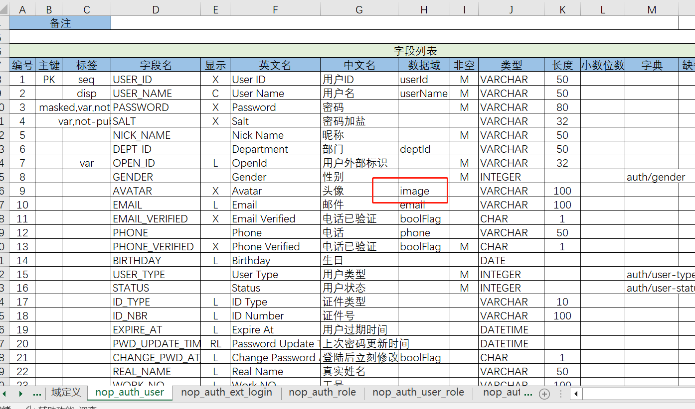

# GraphQL Engine Upload/Download Extension

Standard GraphQL engines only support JSON formatted input/output. To support file upload/download, NopGraphQL has added some extensions to the interface layer.

1. File upload information is converted into an UploadRequestBean object and can be programmed directly within the GraphQL engine for UploadRequestBean. This is equivalent to adding an automatic serialization mechanism based on the JSON serialization protocol for uploaded files. In the current incomplete state, the /f/upload endpoint automatically parses uploaded files and calls the GraphQL engine.
2. The GraphQL engine can return a WebContentBean to represent downloaded resource files. After calling the GraphQL engine and receiving a WebContentBean as a result, the framework automatically extracts Resource objects from it and sets Content-Type and Content-Disposition header configurations accordingly. In the current incomplete state, both /p/{bizObjName}_{bizAction} and /f/download/{fileId} call forms will automatically recognize WebContentBean.

```java

@BizModel("NopFileStore")
public class NopFileStoreBizModel {
    ...
    @BizMutation
    public UploadResponseBean upload(@RequestBean UploadRequestBean record, IServiceContext context) {
        checkMaxSize(record.getLength());
        checkFileExt(record.getFileExt());
        checkBizObjName(record.getBizObjName());

        String fileId = fileStore.saveFile(record, maxFileSize);

        UploadResponseBean ret = new UploadResponseBean();
        ret.setValue(fileStore.getFileLink(fileId));
        ret.setFilename(record.getFileName());
        return ret;
    }

    @BizQuery
    public WebContentBean download(@Name("fileId") String fileId,
                                   @Name("contentType") String contentType) {
        IFileRecord record = fileStore.getFile(fileId);
        if (StringHelper.isEmpty(contentType))
            contentType = MediaType.APPLICATION_OCTET_STREAM;

        return new WebContentBean(contentType, record.getResource(), record.getFileName());
    }

    protected IFileRecord loadFileRecord(String fileId, IServiceContext ctx) {
        IFileRecord record = fileStore.getFile(fileId);
        if (bizAuthChecker != null) {
            bizAuthChecker.checkAuth(record.getBizObjName(), record.getBizObjId(), record.getFieldName(), ctx);
        }
        return record;
    }
}
```

NopFileStoreBizModel is a standard POJO and does not require knowledge of any specific web framework. Therefore, it can be adapted to different web frameworks, such as SpringMVC.

```java
@RestController
public class SpringFileService extends AbstractGraphQLFileService {

    @PostMapping("/f/upload")
    public CompletionStage<ResponseEntity<Object>> upload(MultipartFile file, HttpServletRequest request) {
        String locale = ContextProvider.currentLocale();
        CompletionStage<ApiResponse<?>> res;
        try {
            InputStream inputStream = file.getInputStream();
            String fileName = StringHelper.fileFullName(file.getOriginalFilename());
            String mimeType = MediaTypeHelper.getMimeType(file.getContentType(), StringHelper.fileExt(fileName));
            UploadRequestBean uploadRequestBean = new UploadRequestBean(inputStream, fileName, file.getSize(), mimeType);
            uploadRequestBean.setBizObjName(request.getParameter(FileConstants.PARAM_BIZ_OBJ_NAME));

            IGraphQLEngine graphQLEngine = getGraphQLEngine();

            IGraphQLExecutionContext ctx = graphQLEngine.newRpcContext(GraphQLOperationType.mutation,
                    "NopFileStore__upload", buildApiRequest(request, uploadRequestBean));
            res = graphQLEngine.executeRpcAsync(ctx);
        } catch (IOException e) {
            res = FutureHelper.success(ErrorMessageManager.instance().buildResponse(locale, e));
        }
        return res.thenApply(response -> SpringWebHelper.buildResponse(response.getHttpStatus(), response));
    }

    protected <T> ApiRequest<T> buildApiRequest(HttpServletRequest request, T data) {
        ApiRequest<T> apiRequest = new ApiRequest<>();
        Enumeration<String> headerNames = request.getHeaderNames();
        while (headerNames.hasMoreElements()) {
            String name = headerNames.nextElement();
            name = name.toLowerCase(Locale.ENGLISH);
            if (shouldIgnoreHeader(name)) {
                continue;
            }
            apiRequest.setHeader(name, request.getHeader(name));
        }
        apiRequest.setData(data);
        return apiRequest;
    }
}
```

## Modules Dependencies

If you introduce `nop-quarkus-web-orm-starter` or `nop-spring-web-orm-starter`, it will automatically include:

* `nop-file-dao`: Implementation of the file upload service for `NopFileStoreBizModel`
Here is the translated English version of your Chinese technical document:

---

* **nop-file-spring** or **nop-file-quarkus**: Exposes REST services for file upload (`/f/upload`) and download (`/f/download`).

**Using OSS cloud storage requires the inclusion of the `nop-integration-oss` module.**

* **nop-integration-oss**: Supports AmazonS3, AliCloud OSS, Tencent Cloud COS, Qiniu, jdcloud, and MinIO via this interface.

The `nop-integration-oss` module is currently optional. If you are using cloud storage to store attachments, you need to include this module manually.

---

## Entity fields support attachment types

NopORM does not provide built-in support for the **附件字段 (attachment field)**. In the application layer, we use `OrmFileComponent` at the field level to integrate file storage and database storage.

1. The **附件字段 (attachment field)** stores the file download link.
2. When inserting into the database, `NopFileRecord` is used to store file metadata such as size, name, hash value, etc., along with the `fileId` and its association with the entity. File downloads are validated for entity access permissions.
3. Specific binary data storage is handled via the `IFileStore` interface. NopPlatform natively supports both local file storage and AmazonS3 object storage, as well as MinIO, Qiniu, jdcloud, and AliCloud OSS.

---

## Excel Data Model

In the Excel data model, set the field's `stdDomain` property to "file" to indicate it stores the file download link.




The Excel model generates `orm.xml` configuration files. Below is the generated XML:

```xml
<orm>
    <x:post-extends x:override="replace">
        <orm-gen:DefaultPostExtends xpl:lib="/nop/orm/xlib/orm-gen.xlib"/>
    </x:post-extends>

    <entities>
        <entity className="io.nop.auth.dao.entity.NopAuthUser">
            <columns>
                <column code="AVATAR" displayName="Avatar"
                        domain="image" name="avatar"
                        precision="100" propId="9"
                        stdDataType="string" stdDomain="file"
                        stdSqlType="VARCHAR" i18n-en:displayName="Avatar"
                        ui:show="X"/>
            </columns>
        </entity>
    </entities>
</orm>
```

The above XML configuration is generated at compile time by the `<x:post-extends>` section, which executes the `<orm-gen:FileComponentSupport/>` tag. This support will generate an `OrmFileComponent` property for each file link field.

---

## OrmFileComponent Implementation of File Binding

When uploading files, specific file data is stored in `IFileStore`. At the same time, a `NopFileRecord` is inserted into the database to store file metadata such as name and size. When an entity is updated or deleted, it triggers the `onEntityFlush` and `onEntityDelete` methods of the `IOrmComponent` interface via callback functions. These callbacks update the `bizObjName` and `bizObjId` properties in the `NopFileRecord` object.

---

# Translate Chinese Technical Document to English

Here is the translation of the provided Chinese technical document into English, maintaining the original Markdown format including headers, lists, and code blocks.

---

```java

public class OrmFileComponent extends AbstractOrmComponent {
    public static final String PROP_NAME_filePath = "filePath";

    public String getFilePath() {
        return ConvertHelper.toString(internalGetPropValue(PROP_NAME_filePath));
    }

    public void setFilePath(String value) {
        internalSetPropValue(PROP_NAME_filePath, value);
    }

    @Override
    public void onEntityFlush() {
        IOrmEntity entity = orm_owner();
        int propId = getColPropId(PROP_NAME_filePath);
        if (entity.orm_state().isUnsaved() || entity.orm_propDirty(propId)) {
            IBeanProvider beanProvider = entity.orm_enhancer().getBeanProvider();
            IOrmEntityFileStore fileStore = (IOrmEntityFileStore) beanProvider.getBean(OrmConstants.BEAN_ORM_ENTITY_FILE_STORE);
            String oldValue = (String) entity.orm_propOldValue(propId);

            String fileId = fileStore.decodeFileId(getFilePath());
            String propName = entity.orm_propName(propId);
            String bizObjName = getBizObjName();

            if (!StringHelper.isEmpty(oldValue)) {
                String oldFileId = fileStore.decodeFileId(oldValue);
                if (!StringHelper.isEmpty(oldFileId)) {
                    fileStore.detachFile(oldFileId, bizObjName, entity.orm_idString(), propName);
                }
            }

            if (!StringHelper.isEmpty(fileId)) {
                fileStore.attachFile(fileId, bizObjName, entity.orm_idString(), propName);
            }
        }
    }
}
```

This class is designed to track changes in the `filePath` property at the entity level. Without such tracking, it would be impossible to synchronize file storage with individual field changes, requiring instead that operations be performed at the entity level.

---

## File Path Management

The following methods handle file path management:

- **`getFilePath()`**：Retrieves the current file path value.
- **`setFilePath(String value)`**：Sets the new file path value.

When an entity is flushed (`onEntityFlush()`), the system checks if the `filePath` property has changed. If it has, the system performs necessary operations to synchronize file storage with the updated entity state.

---

## Background Reading

Files uploaded via the `/f/upload` endpoint can be directly accessed in the background.

```javascript
IOrmEntityFileStore fileStore = ...;
String fileId = fileStore.decodeFileId(importFilePath);
// Temporary files are always handled
String objId = FileConstants.TEMP_BIZ_OBJ_ID;
IResource resource = fileStore.getFileResource(
    fileId,
    getBizObjName(),
    objId,
    NopRuleConstants.PROP_IMPORT_FILE
);
```

The `IOrmEntityFileStore` interface is used to perform these operations.

---

## Using `domain=file`

If the `attachment` field is implemented using `domain=file`, then:

---

## Frontend Control


Based on the `stdDomain` setting, the library will automatically select the appropriate edit and display controls for the fields.

The `<edit-file>` control, by default, uploads files to `/f/upload`. The response format is:

```json
{
  "status": 0,
  "data": {
    "value": "file download link"
  }
}
```

The download link follows the format: `/f/download/{fileId}`

In the `prop` node of the metadata, the following properties can be configured:

- `ui:maxUploadSize`: Controls the maximum size of uploadable files
- `ui:uploadUrl`: Customizes the upload endpoint
- `ui:accept`: Manages allowed file extensions, e.g., `.txt,.md` for allowing only text and markdown files

Global settings can also be used to set control properties:

- `nop.file.upload-url`: Global specified upload endpoint, defaulting to `/f/upload`
- `nop.file.upload.max-size`: Global size limit for uploads. Each `prop` can specify `ui:maxUploadSize`, which must not exceed this value. The effective value is `min(prop.uploadFileSize, global.uploadMaxSize)`


## File Copy
IOrmEntityFileStore provides a `copyFile` function that copies a file based on the specified `fileId`. This allows multiple attachment fields to share the same stored file.

When deleting a file, the `detachFile` function of IOrmEntityFileStore can be called. If the file is shared by multiple records, it will only be deleted if it's the last one sharing that `fileId`.


## Integration with Minio

Many distributed storage systems are compatible with Amazon S3 protocol, such as AliCloud OSS, TencentCloud COS, Seven牛云，JDCloud, and Minio.

To enable Minio support, the `nop.file.store-impl` configuration must be set to "oss". Otherwise, local file system is used, storing files in `/nop/file`.

For AliCloud, `pathStyleAccess` must be set to `false`. Note: The correct configuration path is `nop.integration.oss.enabled`, not `nop.file.integration.oss.enabled`.


## Frontend Display
If the Excel data model sets `domain=file` or `domain=file-list`, XMeta will automatically generate corresponding `FileStatus` attributes, such as mapping the `avatar` field in `NopAuthUser` to `avatarComponentFileStatus`.

`FileStatus` returns file name, size, etc. The `<view-file>` component in `control.xlib` displays download links using FileStatus data.


## File Sharing
IOrmEntityFileStore provides a `copyFile` function that copies a file based on the specified `fileId`. This allows multiple attachment fields to share the same stored file.

```javascript
String copyFile(String fileId, String newBizObjName, String newObjId, String newFieldName);
```

- Returns a new `fileId`
- Adds an `originFileId` field to the copied `NopFileRecord`, ensuring all sharing records have the same `originFileId`.
- When calling `detachFile`, it checks if the record is the last one sharing that `fileId`. If so, it deletes the stored file; otherwise, only the corresponding `NopFileRecord` is deleted.


## Allow Anonymous Download

To allow anonymous download:
```javascript
IOrmEntityFileStore.changePublic(fileId, true);
```

2. Set `nop.auth.download-file-public=true` or customize the `auth-service.beans.xml` file's `nopAuthFilterConfig` to allow public access to `/f/download/*`

## Configuration Variables

* `nop.file.store-dir`
  Directory used for storing uploaded files when using the local filesystem, defaulting to `/nop/file`
* `nop.file.store-impl`
  If set to "oss", enable distributed storage; otherwise, use local storage
* `nop.file.upload-url` 
  Global endpoint for uploading files, defaulting to `/f/upload`
* `nop.file.upload.max-size` 
  Global size limit for uploaded files. Each `prop` (e.g., `ui:maxUploadSize`) cannot exceed this value. The effective limit is `min(prop.uploadFileSize, global.uploadMaxSize)`
