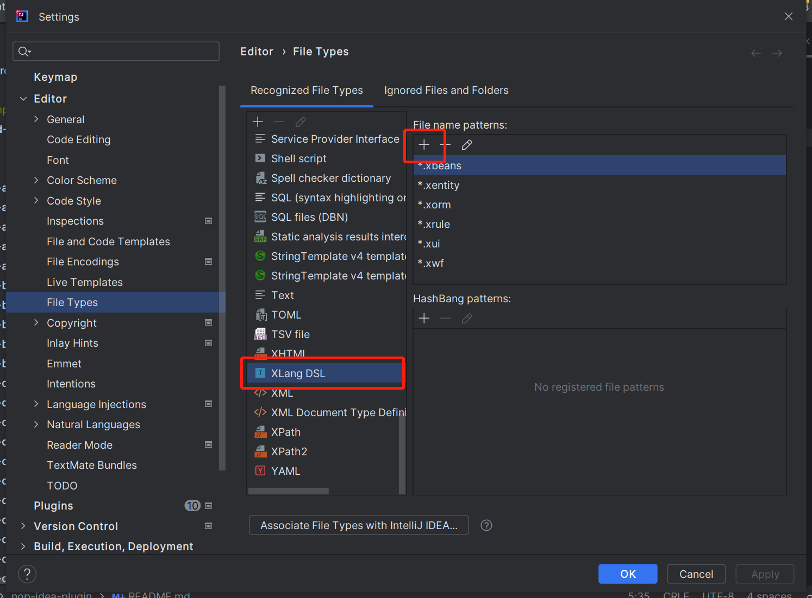
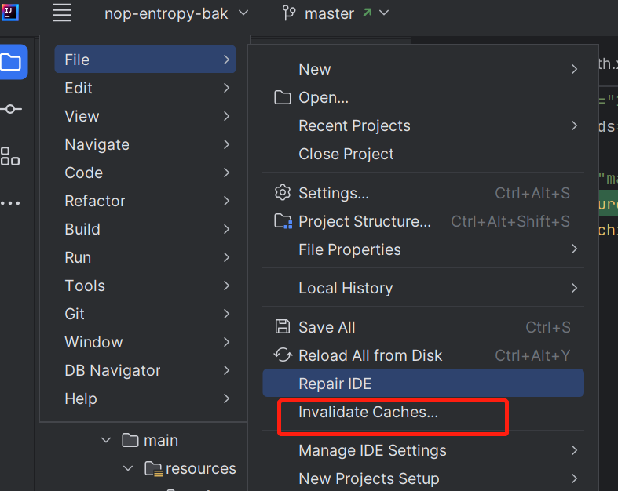

# Install JDK

Building nop-chaos requires JDK 11 or above. You can download a newer version of IDEA: [Download](https://www.jetbrains.com/idea/download/#section=windows)

You can also download a specific JDK version via the menu File/Project Structure/SDKS/Download SDK.


## Build the Plugin

```
cd nop-idea-plugin
gradlew buildPlugin
```

The compiled plugin is located in the build/distributions directory.

## Install the Plugin

After compiling the nop-idea-plugin project, click the File/Settings/Plugins/Install Plugins From Disk menu to install.


## Identify File Types

To activate the nop-idea-plugin, the file type must be XLang DSL. You can click the menu File/Settings/Editor/File Types and add a filename matching pattern for XLang DSL.



## Clear Caches

During plugin usage, if IDEA shuts down abnormally, it may cause file index corruption and the plugin may not work properly. In this case, click the File/Invalidate Caches menu to clear caches and rebuild the index.




## After updating IDEA, the plugin reports: Plugin 'Nop Entropy' (version '*') is not compatible with the current version of the IDE, because it requires build * or older but the current build is *.

This is because the plugin's version number is incompatible with the current IDEA version. You can modify the [build.gradle.kts](https://gitee.com/canonical-entropy/nop-entropy/blob/master/nop-idea-plugin/build.gradle.kts) file to change the plugin's version number to the current IDEA version number, then recompile the plugin.

```
patchPluginXml {
    sinceBuild.set("211")
    untilBuild.set("233.*")  // Change to the current IDEA version number
}
```
<!-- SOURCE_MD5:becff2494a8b7b80e42f84046fc8b2f6-->
