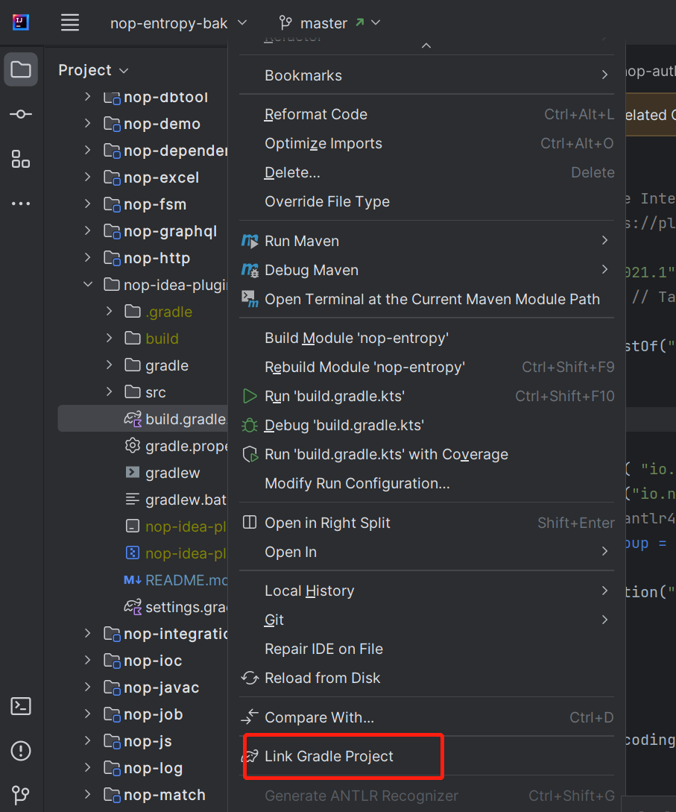
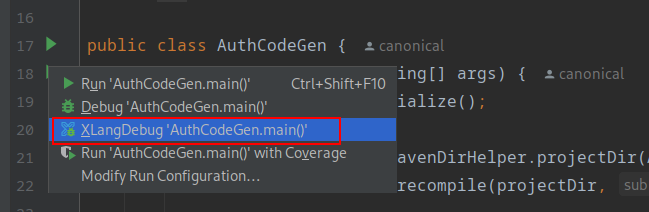

# Link a Gradle Project

The nop-idea-plugin project is a Gradle project. In IntelliJ IDEA, right-click the build.gradle.kts file and choose the Link Gradle Project menu.

## Debugging

After importing the Gradle project, in the Gradle tasks tool window select the Tasks/intellij/runIde task, then right-click to debug the plugin.
IDEA will launch a new application instance for debugging.

## Plugin Features

## Syntax Validation

XLangAnnotator checks whether XML files conform to the xdef meta-model definitions.

## Code Completion

XLangCompletionContributor suggests tag names, attribute names, attribute values, etc., based on the xdef meta-model definitions.

## Quick Documentation

When you hover over tag names, attribute names, or attribute values, the descriptions defined in the xdef meta-model are shown. Implemented by XLangDocumentationProvider.

## Navigation

When you hold CTRL and hover, a prompt appears to navigate to the related location. XLangFileDeclarationHandler identifies virtual file paths and XPL tag definitions and performs the navigation.

## Breakpoint Debugging

XLangDebugExecutor adds a debug execution button alongside Debug/Run.

XLangDebuggerRunner is responsible for launching the debugger. Concretely, the debugged program starts an RPC service exposing the io.nop.api.debugger.IDebugger interface; the IDEA plugin invokes this interface via a remote RPC mechanism and receives returned messages.

## Virtual File System

In the Nop platform, the virtual file system is accessed through the singleton VirtualFileSystem, and model files are loaded and cached via the singleton ResourceComponentManager.

Because multiple Projects may be open at runtime in IDEA, the nop-idea-plugin must maintain a separate cache for each Project.
Therefore, NopAppListener registers special implementations for the singleton objects VirtualFileSystem/ResourceComponentManager/DictProvider, etc. These implementations query the Project object from the context environment via the ProjectEnv class, obtain the NopProjectService from it, and then use the cache within that service to provide functionality.
<!-- SOURCE_MD5:8433d938e2e81cb70f8ac80ae6ec7589-->
