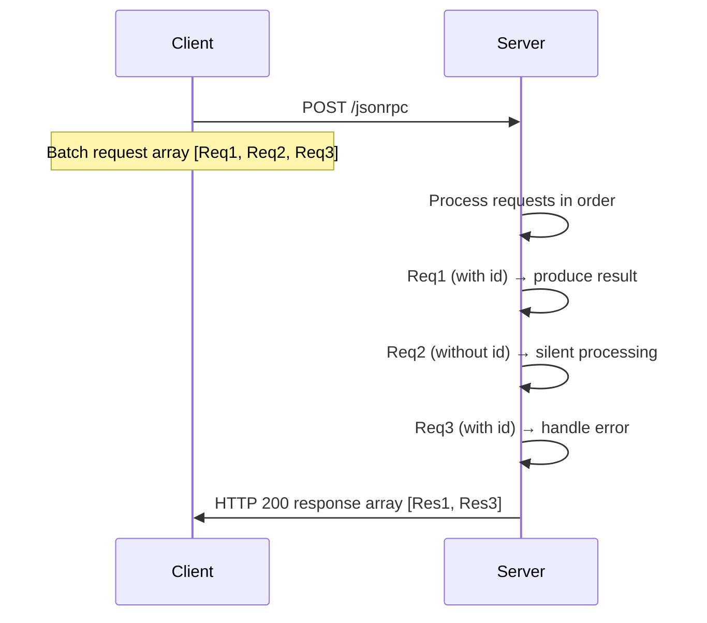

# JSON-RPC Invocation Protocol

You can use the JSON-RPC protocol for remote invocation via the `/jsonrpc` endpoint. NopGraphQL provides the following extensions to JSON-RPC:

* The id is strictly a String type; if it is null, it is considered absent.
* JsonRpcResponse.Error can include an extension property errorCode, which corresponds to the code in ApiResponse. The code in JsonRpcResponse.Error corresponds to the status in ApiResponse.
* JsonRpcRequest can include an extension property selection, which corresponds to FieldSelectionBean in ApiRequest and is used to support GraphQL field selection.
* method corresponds to operationName in NopGraphQL, for example, `NopAuthUser__findPage`.
* If params is an array type, it will be passed as a parameter named params. NopGraphQL requires every parameter of a service function to be passed by name; positional parameters are not directly supported and must be wrapped as a named parameter.

Below is DeepSeek's description of the JSON-RPC protocol.

## 1. Basic Protocol

### 1.1 Request Format

```
{
  "jsonrpc": "2.0",
  "method": "method_name",
  "params": [
    arg1,
    arg2
  ]
  | {  "key": "value"  },
  "id": "unique_identifier"
}
```

**Field Description**:

- `jsonrpc` (required): Fixed value `"2.0"`
- `method` (required): Name of the method to call (string)
- `params` (optional): Parameters (array or object)
- `id` (optional): Request identifier (number/string/null); when omitted, it is a notification request

### 1.2 Response Format

```json
{
  "jsonrpc": "2.0",
  "result": "response_data",
  "error": {
    "code": -32600,
    "message": "Invalid Request",
    "data": {}
  },
  "id": "corresponding_id"
}
```

**Field Mutual Exclusivity**:

- `result` and `error` must be mutually exclusive; only one can be present
- `id` must match the identifier in the request

## 2. Batch Calls (Batch)

### 2.1 Request Format

Send multiple request objects via a JSON array:

```
[
  {
    Request1
  },
  {
    Request2
  },
  ...
]
```

**Core Rules**:

1. Array Structure: Must be a top-level JSON array
2. Mixed Requests: May include requests with `id` and notification requests
3. Ordering Guarantee: The server must return responses in the order of the requests
4. Empty Request Constraint: An empty array `[]` is considered an invalid request

### 2.2 Request Example

```json
[
  {
    "jsonrpc": "2.0",
    "method": "getBalance",
    "params": [
      "0x742d35Cc6634C0532925a3b844Bc454e4438f44e"
    ],
    "id": 1
  },
  {
    "jsonrpc": "2.0",
    "method": "notifyLog",
    "params": {
      "event": "system_start"
    }
  },
  {
    "jsonrpc": "2.0",
    "method": "getBlock",
    "params": [
      "latest"
    ],
    "id": "block_req"
  }
]
```

### 2.3 Response Format

Return a JSON array in the same order as the requests, containing only results for requests that have an `id`:

```
[
  {
    Response1
  },
  {
    Response3
  }
]
```

**Response Example**:

```json
[
  {
    "jsonrpc": "2.0",
    "result": "0x123acb",
    "id": 1
  },
  {
    "jsonrpc": "2.0",
    "error": {
      "code": -32601,
      "message": "Method not found"
    },
    "id": "block_req"
  }
]
```

## 3. Protocol Execution Rules

### 3.1 Processing Flow



### 3.2 Error Handling

| Error Scenario           | Response Handling                                      |
|-------------------------|--------------------------------------------------------|
| Parameter error in a single request | Return an error object for that request; other requests proceed normally |
| Entire request format invalid | Return a top-level error (HTTP 400); do not process any request |
| Server processing crash  | Return responses for already processed requests; mark subsequent requests as internal errors |

## 4. Transport Layer Requirements

```http
POST /jsonrpc HTTP/1.1
Host: api.example.com
Content-Type: application/json
Content-Length: 187

[BATCH_REQUEST]
```

<!-- SOURCE_MD5:52977f308efe72dcb78ede3308aa07a0-->
