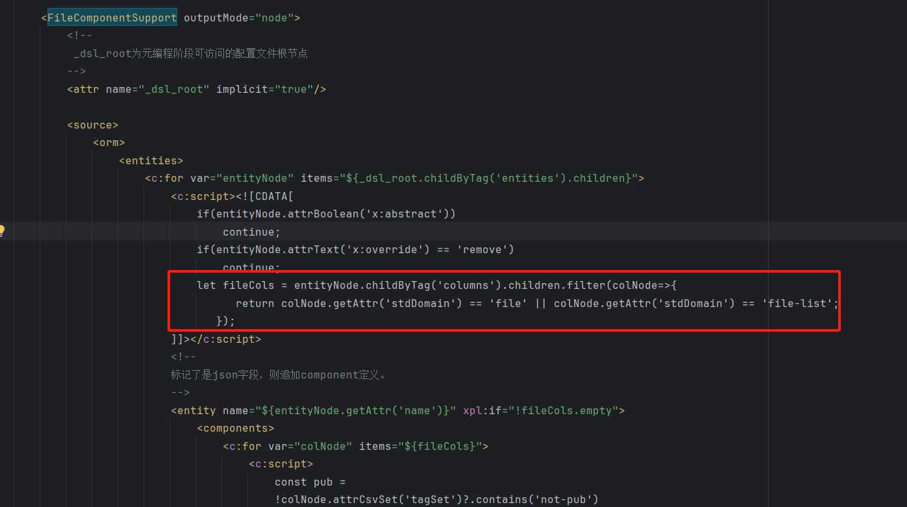

# Attachments and Attachment List Fields

## Implementation Details

1. In the `orm.xml` model, set the field's [Standard Domain] to file, i.e., `stdDomain="file"`.
2. In the `x:post-extends` section of `orm.xml`, introduce the `<orm-gen:DefaultPostExtends/>` tag.
3. The DefaultPostExtends tag invokes the FileComponentSupport tag, which iterates over all fields with `stdDomain=file` and generates the corresponding FileComponent field definitions for them.



```xml

<orm>
  <x:post-extends>
    <orm-gen:DefaultPostExtends xpl:lib="/nop/orm/xlib/orm-gen.xlib"/>
  </x:post-extends>

  <entities>
    <entity className="io.nop.auth.dao.entity.NopAuthUser" attrs="...">
      <columns>
        <column code="AVATAR" displayName="头像" domain="image" name="avatar" precision="100" propId="10"
                stdDataType="string" stdDomain="file" stdSqlType="VARCHAR" i18n-en:displayName="Avatar"
                ui:show="X"/>
      </columns>
    </entity>
  </entities>
</orm>
```

4. When `OrmSession.flush` is executed, it invokes the `onEntityFlush` callback on all Component properties of all entities. `OrmFileComponent.onEntityFlush` associates the uploaded temporary file with the current entity property. If the entity property was previously associated with another file, the previously uploaded file will be automatically deleted.

<!-- SOURCE_MD5:f41f9f98f60f00c45c2c0af2fd38e23b-->
